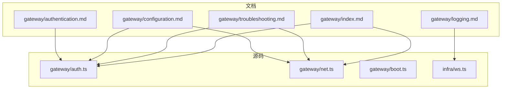
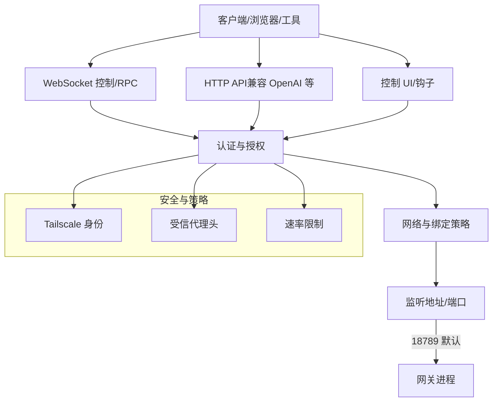
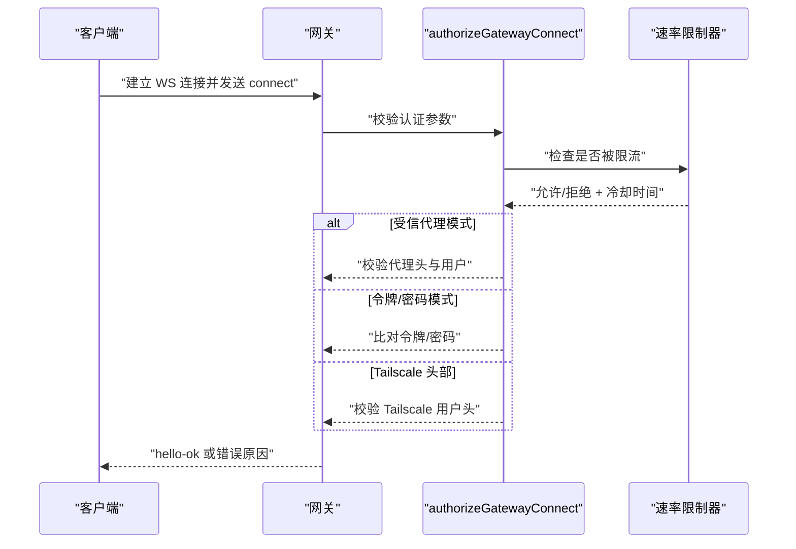
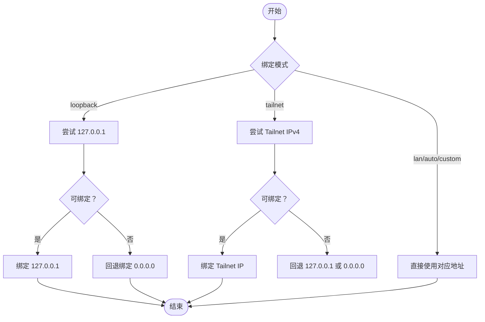
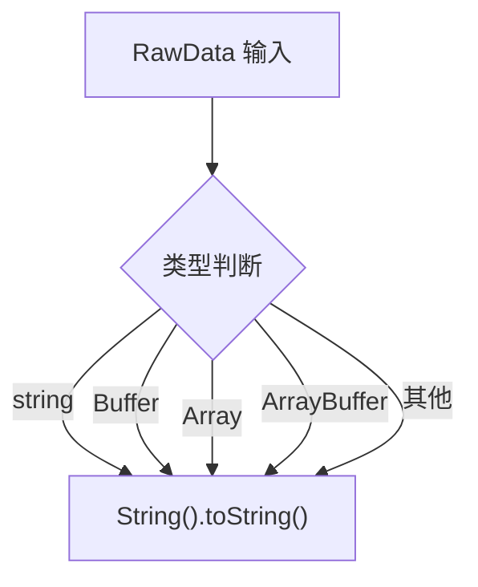
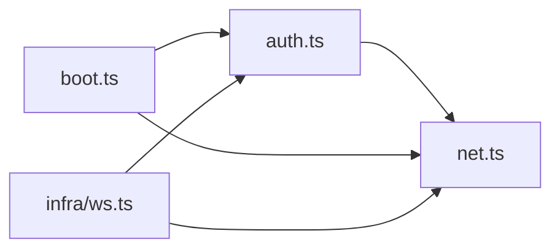

# 网关问题

<cite>
**本文引用的文件**
- [docs/gateway/troubleshooting.md](file://docs/gateway/troubleshooting.md)
- [docs/gateway/index.md](file://docs/gateway/index.md)
- [docs/gateway/configuration.md](file://docs/gateway/configuration.md)
- [docs/gateway/authentication.md](file://docs/gateway/authentication.md)
- [docs/gateway/logging.md](file://docs/gateway/logging.md)
- [src/gateway/auth.ts](file://src/gateway/auth.ts)
- [src/gateway/net.ts](file://src/gateway/net.ts)
- [src/gateway/boot.ts](file://src/gateway/boot.ts)
- [src/infra/ws.ts](file://src/infra/ws.ts)
</cite>

## 目录
1. [简介](#简介)
2. [项目结构](#项目结构)
3. [核心组件](#核心组件)
4. [架构总览](#架构总览)
5. [详细组件分析](#详细组件分析)
6. [依赖关系分析](#依赖关系分析)
7. [性能考量](#性能考量)
8. [故障排除指南](#故障排除指南)
9. [结论](#结论)
10. [附录](#附录)

## 简介
本指南面向运维与开发者，聚焦于 OpenClaw 网关（Gateway）在实际运行中遇到的常见问题：启动失败、连接超时、认证错误、端口占用等。内容覆盖进程管理、WebSocket 连接调试、认证机制验证、配置文件检查、日志分析、网络连通性测试与安全配置验证，并提供高可用部署与故障转移策略建议。所有操作建议均以仓库内官方文档与源码为依据。

## 项目结构
- 文档侧：官方文档提供了“网关运行手册”“故障排除”“配置”“认证”“日志”等专题，是排障的权威入口。
- 源码侧：网关认证、网络地址解析、WebSocket 数据转换、引导流程等关键逻辑集中在 src/gateway 与 src/infra 下，是定位问题的技术支点。

图表来源
- [docs/gateway/index.md](file://docs/gateway/index.md)
- [docs/gateway/troubleshooting.md](file://docs/gateway/troubleshooting.md)
- [docs/gateway/configuration.md](file://docs/gateway/configuration.md)
- [docs/gateway/authentication.md](file://docs/gateway/authentication.md)
- [docs/gateway/logging.md](file://docs/gateway/logging.md)
- [src/gateway/auth.ts](file://src/gateway/auth.ts)
- [src/gateway/net.ts](file://src/gateway/net.ts)
- [src/gateway/boot.ts](file://src/gateway/boot.ts)
- [src/infra/ws.ts](file://src/infra/ws.ts)

章节来源
- [docs/gateway/index.md](file://docs/gateway/index.md)
- [docs/gateway/configuration.md](file://docs/gateway/configuration.md)

## 核心组件
- 认证与授权模块：负责解析网关认证模式（令牌、密码、受信代理、Tailscale）、校验客户端凭据、速率限制与用户身份提取。
- 网络与绑定模块：负责主机地址解析、本地/私网判定、WebSocket 安全策略、可绑定地址探测。
- 引导与会话模块：负责开机自检脚本执行、主会话映射快照与恢复。
- WebSocket 工具：负责原始数据到字符串的统一转换，便于日志与调试。

章节来源
- [src/gateway/auth.ts](file://src/gateway/auth.ts)
- [src/gateway/net.ts](file://src/gateway/net.ts)
- [src/gateway/boot.ts](file://src/gateway/boot.ts)
- [src/infra/ws.ts](file://src/infra/ws.ts)

## 架构总览
下图展示网关对外服务的端口与协议承载能力，以及认证与网络层的关键交互。

图表来源
- [docs/gateway/index.md](file://docs/gateway/index.md)
- [src/gateway/auth.ts](file://src/gateway/auth.ts)
- [src/gateway/net.ts](file://src/gateway/net.ts)

## 详细组件分析

### 组件一：认证与授权（authorizeGatewayConnect）
- 功能要点
  - 支持多种认证模式：无认证、共享密钥令牌、密码、受信代理转发、Tailscale 头部身份。
  - 对来自受信代理的请求进行严格校验（必需头、用户头、允许用户列表）。
  - 对本地直连请求与非本地请求采用不同策略，避免误判。
  - 集成速率限制器，对失败尝试进行记录与冷却。
- 关键行为
  - 当启用受信代理模式但未配置代理或缺少必要头部时，返回明确原因。
  - 当使用令牌/密码模式时，缺失凭据不计入失败；错误凭据才计为失败并可能触发限流。
  - 允许在特定场景（如控制 UI 的 WebSocket）启用 Tailscale 头部认证。

图表来源
- [src/gateway/auth.ts](file://src/gateway/auth.ts)

章节来源
- [src/gateway/auth.ts](file://src/gateway/auth.ts)

### 组件二：网络与绑定（resolveGatewayBindHost / isSecureWebSocketUrl）
- 功能要点
  - 解析绑定主机地址，支持 loopback、lan、tailnet、auto、custom 等模式，并具备回退策略。
  - 判断 WebSocket URL 是否安全传输（wss 优先，loopback 的 ws 可接受，可选允许私网 ws）。
  - 识别本地/私网/环回地址，用于本地直连判断与安全策略。
- 关键行为
  - canBindToHost 通过临时服务器测试绑定可行性，避免硬编码失败。
  - isLocalGatewayAddress 将本地地址（含 Tailscale）识别为可信来源。

图表来源
- [src/gateway/net.ts](file://src/gateway/net.ts)

章节来源
- [src/gateway/net.ts](file://src/gateway/net.ts)

### 组件三：WebSocket 数据转换（rawDataToString）
- 功能要点
  - 将 WebSocket 原始数据（string、Buffer、Array、ArrayBuffer 等）统一封装为字符串，便于日志与调试输出。
- 使用场景
  - 在 verbose 日志模式下打印完整帧内容，或在控制台格式化输出。

图表来源
- [src/infra/ws.ts](file://src/infra/ws.ts)

章节来源
- [src/infra/ws.ts](file://src/infra/ws.ts)

### 组件四：引导与会话（runBootOnce）
- 功能要点
  - 读取工作区内的引导文件，按指令驱动一次性的自动化任务。
  - 执行前后对主会话映射做快照与恢复，保证状态一致性。
- 故障影响
  - 若引导文件存在但执行失败，将返回失败原因，需结合日志定位。

章节来源
- [src/gateway/boot.ts](file://src/gateway/boot.ts)

## 依赖关系分析
- 认证模块依赖网络模块提供的客户端 IP 解析与本地直连判断，确保在不同代理/隧道场景下的正确性。
- 网络模块依赖系统接口与 Tailscale 能力，用于选择合适的绑定地址与安全策略。
- WebSocket 工具为日志与调试提供统一的数据呈现，辅助定位协议层问题。
- 引导模块与会话存储交互，保障开机流程的幂等与可恢复。

图表来源
- [src/gateway/auth.ts](file://src/gateway/auth.ts)
- [src/gateway/net.ts](file://src/gateway/net.ts)
- [src/gateway/boot.ts](file://src/gateway/boot.ts)
- [src/infra/ws.ts](file://src/infra/ws.ts)

章节来源
- [src/gateway/auth.ts](file://src/gateway/auth.ts)
- [src/gateway/net.ts](file://src/gateway/net.ts)
- [src/gateway/boot.ts](file://src/gateway/boot.ts)
- [src/infra/ws.ts](file://src/infra/ws.ts)

## 性能考量
- 热重载与重启策略：配置热重载模式（hybrid/hot/restart/off）会影响变更生效方式与停机风险，应结合业务 SLA 选择。
- 速率限制：认证失败尝试会被限流，避免暴力破解；合理设置阈值与冷却时间。
- 绑定策略：优先 loopback 降低外部暴露面；在需要远程访问时，务必配合认证与受信代理策略。

## 故障排除指南

### 启动失败
- 快速命令梯次
  - openclaw gateway status
  - openclaw status
  - openclaw logs --follow
  - openclaw doctor
- 健康信号
  - openclaw gateway status 显示“Runtime: running”且“RPC probe: ok”。
  - openclaw doctor 不报告阻塞性配置/服务问题。
  - openclaw channels status --probe 显示通道已连接/就绪。
- 常见签名与修复
  - “refusing to bind gateway … without auth”：非环回绑定必须配置认证（令牌/密码），否则无法启动。
  - “another gateway instance is already listening / EADDRINUSE”：端口冲突，调整端口或释放占用。
  - “Gateway start blocked: set gateway.mode=local”：当前配置为 remote 模式，需改为 local 或正确配置远端访问。

章节来源
- [docs/gateway/troubleshooting.md](file://docs/gateway/troubleshooting.md)
- [docs/gateway/index.md](file://docs/gateway/index.md)

### 连接超时/不可达
- 本地直连与远程访问
  - 本地直连：仅在 127.0.0.1 或环回地址有效；控制 UI 与本地工具推荐使用本地直连。
  - 远程访问：优先使用 Tailscale/VPN；若使用 SSH 隧道，仍需提供正确的认证信息。
- 安全传输
  - wss 为默认安全；ws 仅在环回地址允许；可在受信私网场景开启“允许私网 ws”的断路开关（谨慎评估）。
- 绑定与端口
  - 检查绑定模式与端口；确认 canBindToHost 成功；避免 0.0.0.0 与环回混用导致客户端解析异常。

章节来源
- [docs/gateway/index.md](file://docs/gateway/index.md)
- [src/gateway/net.ts](file://src/gateway/net.ts)

### 认证错误
- 常见错误与定位
  - AUTH_TOKEN_MISSING / AUTH_TOKEN_MISMATCH：客户端未携带或令牌不匹配；可通过配置查看当前令牌并核对客户端设置。
  - AUTH_DEVICE_TOKEN_MISMATCH：设备级令牌过期或撤销；需重新批准/轮换设备令牌后重试。
  - PAIRING_REQUIRED：设备未批准；在设备列表中批准待处理请求。
  - unauthorized：认证失败；检查令牌/密码与服务端配置一致。
- 速率限制
  - 若被限流，服务端会返回 retryAfterMs；等待冷却后再试。
- 受信代理与 Tailscale
  - 受信代理模式需满足：代理配置、必需头、用户白名单；否则返回具体原因。
  - Tailscale 头部认证仅在特定场景启用，需确保头部与身份一致。

章节来源
- [docs/gateway/troubleshooting.md](file://docs/gateway/troubleshooting.md)
- [src/gateway/auth.ts](file://src/gateway/auth.ts)

### 端口占用
- 现象
  - 启动时报“另一个网关实例已在监听”或 EADDRINUSE。
- 处理
  - 释放占用端口（终止进程或更换端口）。
  - 使用强制启动选项（谨慎使用）或检查多实例冲突。

章节来源
- [docs/gateway/index.md](file://docs/gateway/index.md)

### WebSocket 连接调试
- 日志级别与样式
  - 使用 openclaw logs --follow 实时查看文件日志；通过 --verbose 提升控制台详细度。
  - WebSocket 日志在正常模式下仅打印“有趣”的结果（错误、慢调用、解析错误），在 verbose 模式下打印完整帧。
- 数据转换
  - 使用 rawDataToString 统一处理原始帧数据，便于在日志中观察消息体。

章节来源
- [docs/gateway/logging.md](file://docs/gateway/logging.md)
- [src/infra/ws.ts](file://src/infra/ws.ts)

### 认证机制验证
- 模型提供商凭据
  - 使用 openclaw models status 检查凭据有效性；必要时通过 openclaw models auth 重置或轮换。
- 环境变量与密钥注入
  - 通过环境变量或 SecretRef 注入；注意大小写与占位符替换规则。

章节来源
- [docs/gateway/authentication.md](file://docs/gateway/authentication.md)

### 配置文件检查
- 严格校验
  - 配置必须完全符合 schema；未知键、类型错误或无效值会导致网关拒绝启动。
- 热重载与重启
  - hybrid 模式下安全变更即时生效；critical 变更自动重启；可通过配置项调整策略。
- 常用字段
  - gateway.bind、gateway.port、gateway.auth.token/password、gateway.remote 等。

章节来源
- [docs/gateway/configuration.md](file://docs/gateway/configuration.md)

### 网络连通性测试
- 本地可达性
  - 使用 openclaw gateway status 与 openclaw status 检查服务健康与通道状态。
- 远程可达性
  - 通过 SSH 隧道或 Tailscale 代理访问；确保客户端使用正确的 URL 与认证。
- 地址解析
  - 检查 isLocalGatewayAddress 与 isLoopbackHost 的判定，避免误判本地/私网地址。

章节来源
- [docs/gateway/index.md](file://docs/gateway/index.md)
- [src/gateway/net.ts](file://src/gateway/net.ts)

### 安全配置验证
- 传输安全
  - 优先使用 wss；ws 仅在环回地址允许；私网 ws 需谨慎开启。
- 认证策略
  - 非环回绑定必须配置认证；受信代理与 Tailscale 头部认证需满足前置条件。
- 速率限制
  - 合理设置阈值与冷却时间，避免误伤合法请求。

章节来源
- [src/gateway/net.ts](file://src/gateway/net.ts)
- [src/gateway/auth.ts](file://src/gateway/auth.ts)

### 高可用部署与故障转移
- 多实例隔离
  - 单主机上尽量只运行一个网关实例；如需冗余，使用独立端口、配置路径与状态目录。
- 多网关示例
  - 通过环境变量与路径区分多个实例，确保端口唯一、状态隔离。
- 故障转移
  - 结合负载均衡与健康检查，将流量切换至健康实例；在客户端侧保留重试与降级策略。

章节来源
- [docs/gateway/index.md](file://docs/gateway/index.md)

## 结论
本指南基于官方文档与源码，构建了从“启动—连接—认证—配置—日志—网络—安全—高可用”的完整排障路径。建议在日常运维中：
- 优先使用 loopback 绑定与 wss 传输；
- 明确认证策略并定期轮换令牌；
- 通过 doctor 与 logs --follow 快速定位问题；
- 在多实例场景下严格隔离端口与配置；
- 在远程访问时优先采用受信代理或 Tailscale。

## 附录
- 常用命令清单（节选）
  - openclaw gateway status / openclaw status / openclaw logs --follow / openclaw doctor
  - openclaw gateway install / openclaw gateway restart / openclaw gateway stop
  - openclaw models status / openclaw config get ...
- 常见失败签名速查
  - refusing to bind gateway … without auth
  - another gateway instance is already listening / EADDRINUSE
  - Gateway start blocked: set gateway.mode=local
  - unauthorized