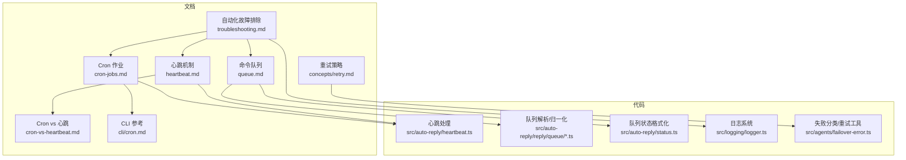
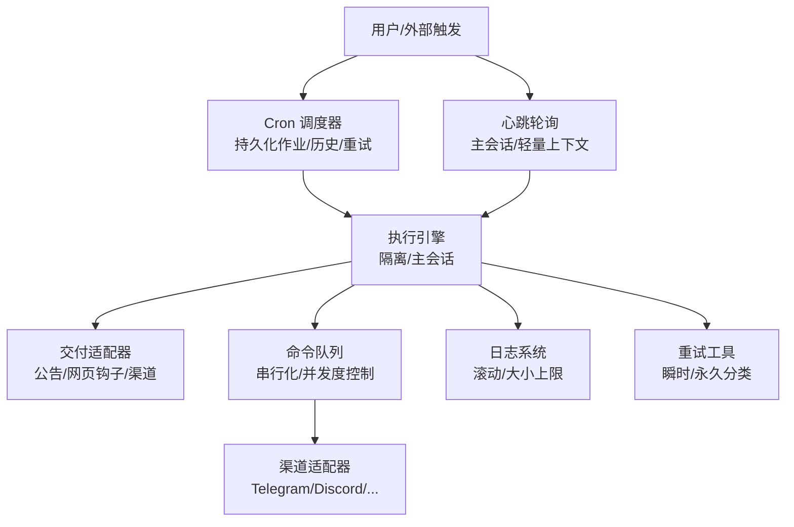
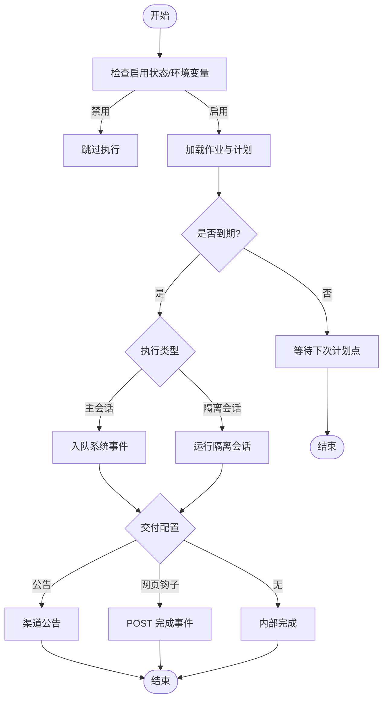
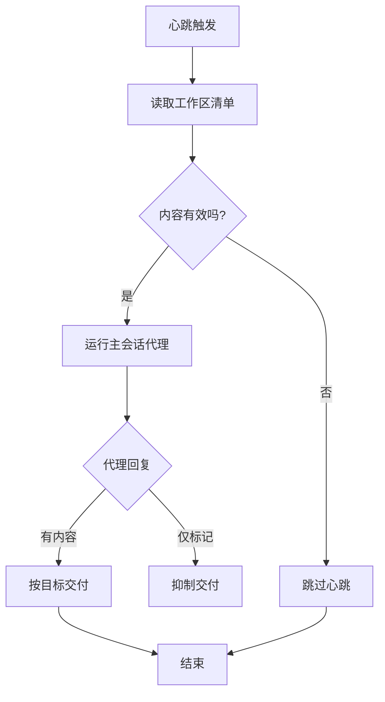
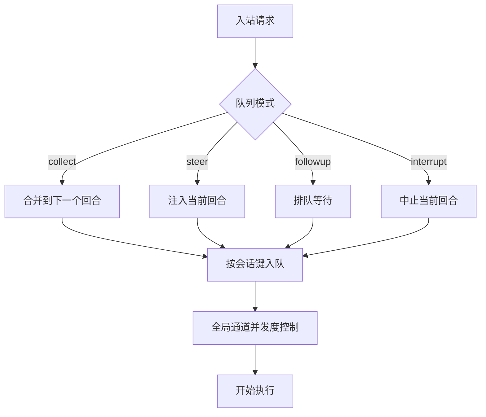
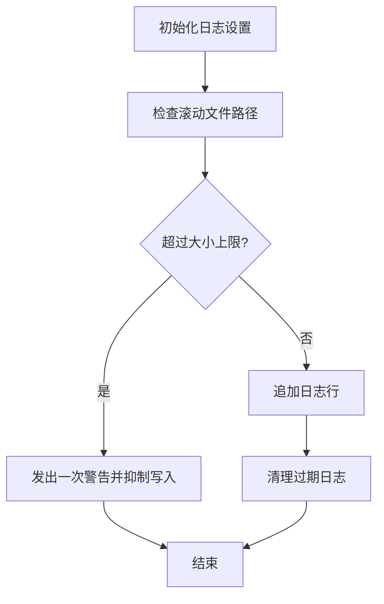
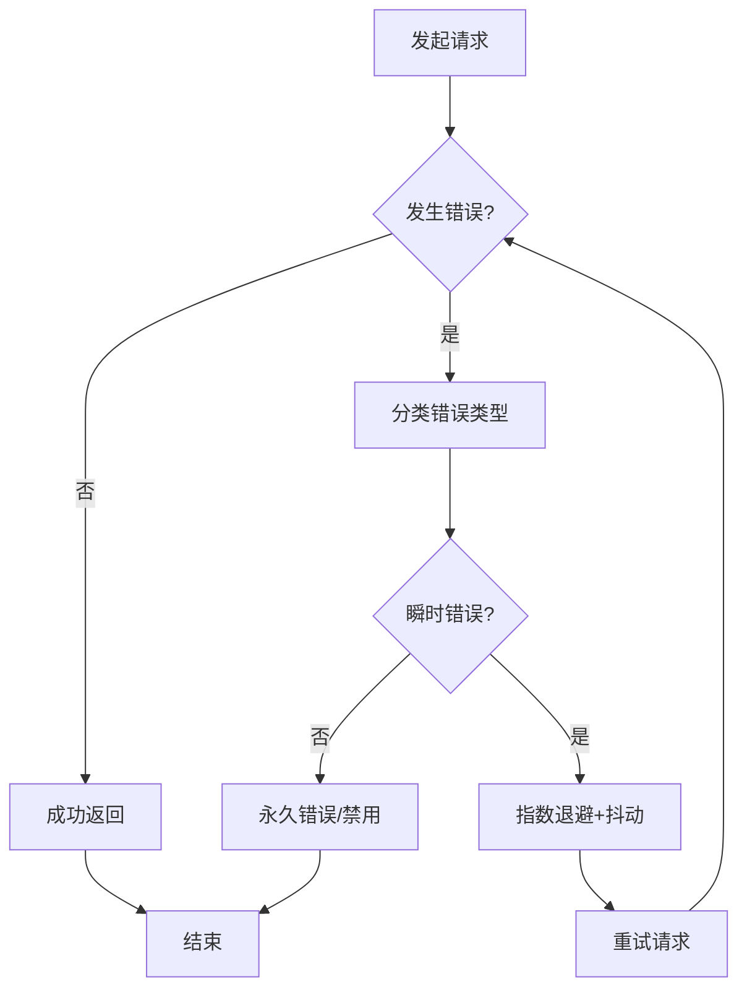
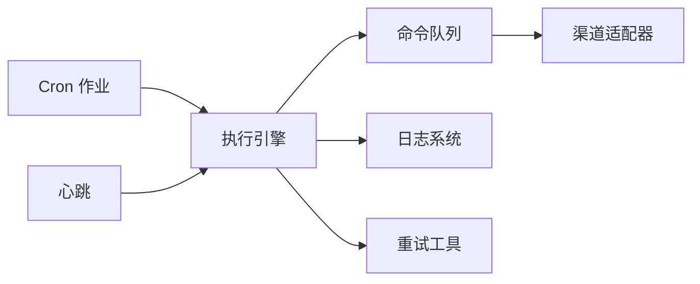

# 自动化问题

<cite>
**本文引用的文件**
- [docs/automation/troubleshooting.md](file://docs/automation/troubleshooting.md)
- [docs/automation/cron-jobs.md](file://docs/automation/cron-jobs.md)
- [docs/automation/cron-vs-heartbeat.md](file://docs/automation/cron-vs-heartbeat.md)
- [docs/concepts/queue.md](file://docs/concepts/queue.md)
- [docs/gateway/heartbeat.md](file://docs/gateway/heartbeat.md)
- [src/auto-reply/heartbeat.ts](file://src/auto-reply/heartbeat.ts)
- [src/auto-reply/status.ts](file://src/auto-reply/status.ts)
- [src/auto-reply/reply/queue/directive.ts](file://src/auto-reply/reply/queue/directive.ts)
- [src/auto-reply/reply/queue/normalize.ts](file://src/auto-reply/reply/queue/normalize.ts)
- [src/auto-reply/reply/directive-handling.queue-validation.ts](file://src/auto-reply/reply/directive-handling.queue-validation.ts)
- [src/agents/failover-error.ts](file://src/agents/failover-error.ts)
- [src/logging/logger.ts](file://src/logging/logger.ts)
- [docs/cli/cron.md](file://docs/cli/cron.md)
- [docs/concepts/retry.md](file://docs/concepts/retry.md)
</cite>

## 目录
1. [简介](#简介)
2. [项目结构](#项目结构)
3. [核心组件](#核心组件)
4. [架构总览](#架构总览)
5. [详细组件分析](#详细组件分析)
6. [依赖关系分析](#依赖关系分析)
7. [性能考量](#性能考量)
8. [故障排除指南](#故障排除指南)
9. [结论](#结论)
10. [附录](#附录)

## 简介
本指南聚焦于自动化系统的常见问题：Cron 任务未执行、心跳机制失效、队列积压、定时器异常等。内容覆盖任务调度验证、执行队列监控、时间同步检查与依赖服务状态验证，并提供自动化日志分析、任务状态跟踪与执行历史回溯的方法，以及性能优化与错误重试机制的配置建议。

## 项目结构
围绕自动化能力的关键文档与实现分布在以下位置：
- 文档侧：自动化故障排除、Cron 作业、心跳机制、命令队列、CLI 参考、重试策略等
- 代码侧：心跳提示词与跳过逻辑、队列解析与归一化、队列状态格式化、日志系统、失败分类与重试工具

**图表来源**
- [docs/automation/troubleshooting.md](file://docs/automation/troubleshooting.md)
- [docs/automation/cron-jobs.md](file://docs/automation/cron-jobs.md)
- [docs/gateway/heartbeat.md](file://docs/gateway/heartbeat.md)
- [docs/concepts/queue.md](file://docs/concepts/queue.md)
- [docs/automation/cron-vs-heartbeat.md](file://docs/automation/cron-vs-heartbeat.md)
- [docs/cli/cron.md](file://docs/cli/cron.md)
- [docs/concepts/retry.md](file://docs/concepts/retry.md)
- [src/auto-reply/heartbeat.ts](file://src/auto-reply/heartbeat.ts)
- [src/auto-reply/reply/queue/directive.ts](file://src/auto-reply/reply/queue/directive.ts)
- [src/auto-reply/reply/queue/normalize.ts](file://src/auto-reply/reply/queue/normalize.ts)
- [src/auto-reply/status.ts](file://src/auto-reply/status.ts)
- [src/logging/logger.ts](file://src/logging/logger.ts)
- [src/agents/failover-error.ts](file://src/agents/failover-error.ts)

**章节来源**
- [docs/automation/troubleshooting.md](file://docs/automation/troubleshooting.md)
- [docs/automation/cron-jobs.md](file://docs/automation/cron-jobs.md)
- [docs/gateway/heartbeat.md](file://docs/gateway/heartbeat.md)
- [docs/concepts/queue.md](file://docs/concepts/queue.md)
- [docs/automation/cron-vs-heartbeat.md](file://docs/automation/cron-vs-heartbeat.md)
- [docs/cli/cron.md](file://docs/cli/cron.md)
- [docs/concepts/retry.md](file://docs/concepts/retry.md)
- [src/auto-reply/heartbeat.ts](file://src/auto-reply/heartbeat.ts)
- [src/auto-reply/reply/queue/directive.ts](file://src/auto-reply/reply/queue/directive.ts)
- [src/auto-reply/reply/queue/normalize.ts](file://src/auto-reply/reply/queue/normalize.ts)
- [src/auto-reply/status.ts](file://src/auto-reply/status.ts)
- [src/logging/logger.ts](file://src/logging/logger.ts)
- [src/agents/failover-error.ts](file://src/agents/failover-error.ts)

## 核心组件
- Cron 调度与执行
  - 作业持久化、运行历史、重试策略、交付模式（公告/网页钩子/无）
  - 支持一次性(at)、周期性(every)与标准cron表达式，含可选时区与抖动(stagger)
- 心跳机制
  - 主会话定期轮询，支持轻量上下文、隔离会话、活跃时段限制、可见性控制
  - 响应合约：仅“无事”时返回特定标记以抑制消息
- 命令队列
  - 入站自动回复通过进程内队列串行化，按会话键与全局通道并发度控制
  - 队列模式（收集/跟进/插队/中断）、防抖、容量与丢弃策略
- 日志与可观测性
  - 滚动日志文件、大小上限、过期清理；日志级别与传输扩展
- 错误分类与重试
  - 对速率限制、过载、网络、服务器错误进行瞬时/永久分类，提供指数退避与抖动

**章节来源**
- [docs/automation/cron-jobs.md](file://docs/automation/cron-jobs.md)
- [docs/gateway/heartbeat.md](file://docs/gateway/heartbeat.md)
- [docs/concepts/queue.md](file://docs/concepts/queue.md)
- [src/logging/logger.ts](file://src/logging/logger.ts)
- [src/agents/failover-error.ts](file://src/agents/failover-error.ts)

## 架构总览
下图展示自动化关键路径：Cron 与心跳在网关内部调度，队列串行化入站处理，日志与重试贯穿各环节。

**图表来源**
- [docs/automation/cron-jobs.md](file://docs/automation/cron-jobs.md)
- [docs/gateway/heartbeat.md](file://docs/gateway/heartbeat.md)
- [docs/concepts/queue.md](file://docs/concepts/queue.md)
- [src/logging/logger.ts](file://src/logging/logger.ts)
- [src/agents/failover-error.ts](file://src/agents/failover-error.ts)

## 详细组件分析

### Cron 调度与执行
- 存储与历史
  - 作业存储于网关主机，运行历史为JSONL，受保留与裁剪策略控制
- 执行模型
  - 主会话事件：入队系统事件，按唤醒策略立即或下次心跳执行
  - 隔离会话：专用会话运行，可选择公告/网页钩子/无交付
- 交付规则
  - 公告：直接向目标渠道投递摘要，避免重复与空响应
  - 网页钩子：POST完成事件负载，支持Bearer鉴权
- 重试策略
  - 瞬时错误（限流/过载/网络/服务器）重试，永久错误禁用
  - 一次性作业默认最多3次，递增退避；周期性作业连续失败后指数退避，成功后重置

**图表来源**
- [docs/automation/cron-jobs.md](file://docs/automation/cron-jobs.md)
- [docs/cli/cron.md](file://docs/cli/cron.md)

**章节来源**
- [docs/automation/cron-jobs.md](file://docs/automation/cron-jobs.md)
- [docs/cli/cron.md](file://docs/cli/cron.md)

### 心跳机制
- 提示词与跳过逻辑
  - 默认提示严格遵循工作区清单；若内容为空或仅注释/空行，则判定为“无事”，跳过调用
- 响应合约
  - 仅“无事”时返回特定标记，且长度阈值内会被抑制
- 可见性与活跃时段
  - 支持按频道/账户的可见性开关、指示器、直接消息策略与活跃时段（时区解析）

**图表来源**
- [src/auto-reply/heartbeat.ts](file://src/auto-reply/heartbeat.ts)
- [docs/gateway/heartbeat.md](file://docs/gateway/heartbeat.md)

**章节来源**
- [src/auto-reply/heartbeat.ts](file://src/auto-reply/heartbeat.ts)
- [docs/gateway/heartbeat.md](file://docs/gateway/heartbeat.md)

### 命令队列
- 并发与串行
  - 按会话键串行化，防止共享资源竞争；全局通道并发度由配置控制
- 队列模式
  - steer/followup/collect/steer+backlog/interrupt；支持防抖、容量与丢弃策略
- 状态与诊断
  - 可输出队列深度、防抖、容量、丢弃策略等信息，便于定位积压

**图表来源**
- [docs/concepts/queue.md](file://docs/concepts/queue.md)
- [src/auto-reply/reply/queue/directive.ts](file://src/auto-reply/reply/queue/directive.ts)
- [src/auto-reply/reply/queue/normalize.ts](file://src/auto-reply/reply/queue/normalize.ts)
- [src/auto-reply/status.ts](file://src/auto-reply/status.ts)
- [src/auto-reply/reply/directive-handling.queue-validation.ts](file://src/auto-reply/reply/directive-handling.queue-validation.ts)

**章节来源**
- [docs/concepts/queue.md](file://docs/concepts/queue.md)
- [src/auto-reply/reply/queue/directive.ts](file://src/auto-reply/reply/queue/directive.ts)
- [src/auto-reply/reply/queue/normalize.ts](file://src/auto-reply/reply/queue/normalize.ts)
- [src/auto-reply/status.ts](file://src/auto-reply/status.ts)
- [src/auto-reply/reply/directive-handling.queue-validation.ts](file://src/auto-reply/reply/directive-handling.queue-validation.ts)

### 日志系统与可观测性
- 滚动日志
  - 按日期生成日志文件，默认最大文件大小，超限时抑制写入并发出警告
- 文件清理
  - 过期日志自动清理，避免磁盘占用
- 外部传输
  - 支持注册外部传输，便于集中采集

**图表来源**
- [src/logging/logger.ts](file://src/logging/logger.ts)

**章节来源**
- [src/logging/logger.ts](file://src/logging/logger.ts)

### 错误分类与重试
- 分类
  - 将符号化错误码映射为瞬时/过载/速率限制等类别
- 重试
  - 对瞬时错误采用指数退避与抖动；对永久错误直接禁用或终止流程
- 配置
  - 各渠道可独立配置重试次数、最小/最大延迟与抖动

**图表来源**
- [src/agents/failover-error.ts](file://src/agents/failover-error.ts)
- [docs/concepts/retry.md](file://docs/concepts/retry.md)

**章节来源**
- [src/agents/failover-error.ts](file://src/agents/failover-error.ts)
- [docs/concepts/retry.md](file://docs/concepts/retry.md)

## 依赖关系分析
- Cron 与心跳均依赖网关内部调度与会话上下文
- 队列模块为入站处理提供串行化保障，降低资源争用
- 日志系统贯穿所有路径，提供统一可观测性
- 重试工具为外部调用提供稳健性保障

**图表来源**
- [docs/automation/cron-jobs.md](file://docs/automation/cron-jobs.md)
- [docs/gateway/heartbeat.md](file://docs/gateway/heartbeat.md)
- [docs/concepts/queue.md](file://docs/concepts/queue.md)
- [src/logging/logger.ts](file://src/logging/logger.ts)
- [src/agents/failover-error.ts](file://src/agents/failover-error.ts)

**章节来源**
- [docs/automation/cron-jobs.md](file://docs/automation/cron-jobs.md)
- [docs/gateway/heartbeat.md](file://docs/gateway/heartbeat.md)
- [docs/concepts/queue.md](file://docs/concepts/queue.md)
- [src/logging/logger.ts](file://src/logging/logger.ts)
- [src/agents/failover-error.ts](file://src/agents/failover-error.ts)

## 性能考量
- Cron
  - 高频作业会产生较大的运行会话与运行日志体量，需合理设置会话保留与日志裁剪参数
  - 使用隔离会话与公告/网页钩子减少主会话历史污染
- 心跳
  - 使用轻量上下文与隔离会话显著降低令牌消耗
  - 限制活跃时段与合理间隔，避免不必要的调用
- 队列
  - 合理设置并发度、防抖与容量，避免积压与丢弃
- 日志
  - 控制日志文件大小上限与滚动策略，避免IO压力

[本节为通用指导，无需具体文件引用]

## 故障排除指南

### Cron 任务未执行
- 基础排查
  - 检查 Cron 是否启用、网关是否持续运行、时区与计划是否匹配
  - 使用状态与列表命令查看作业状态与下次唤醒时间
- 常见症状
  - 调度器被禁用或计时器失败
  - 一次性作业在非到期时被强制运行而被跳过
- 处理步骤
  - 确认配置与环境变量
  - 查看最近运行记录与日志上下文
  - 如为一次性作业，确认到期后再手动运行

**章节来源**
- [docs/automation/troubleshooting.md](file://docs/automation/troubleshooting.md)
- [docs/automation/cron-jobs.md](file://docs/automation/cron-jobs.md)

### Cron 执行但未交付
- 排查要点
  - 运行状态是否为成功
  - 交付模式与目标是否正确配置
  - 渠道探测是否连通
- 常见症状
  - 交付模式为“无”
  - 交付目标缺失或无效
  - 渠道认证错误（未授权/权限不足/禁止）
- 处理步骤
  - 更新交付目标或切换到公告/网页钩子
  - 修复渠道凭据与权限
  - 再次运行并观察结果

**章节来源**
- [docs/automation/troubleshooting.md](file://docs/automation/troubleshooting.md)

### 心跳被抑制或跳过
- 排查要点
  - 心跳是否启用且间隔非零
  - 最近心跳结果是否为“已运行”或可理解的跳过原因
- 常见症状
  - 在静默时段被跳过
  - 主通道繁忙导致延迟
  - 心跳文件为空且无待定定时事件
  - 可见性设置抑制外发心跳消息
- 处理步骤
  - 调整活跃时段与时区
  - 检查主通道负载
  - 校验可见性与指示器设置

**章节来源**
- [docs/automation/troubleshooting.md](file://docs/automation/troubleshooting.md)
- [docs/gateway/heartbeat.md](file://docs/gateway/heartbeat.md)

### 队列积压
- 排查要点
  - 队列深度、防抖、容量与丢弃策略
  - 并发度与通道负载
- 处理步骤
  - 输出队列状态，确认积压时长
  - 调整队列模式与参数，必要时提升并发度
  - 观察后续吞吐与延迟

**章节来源**
- [docs/concepts/queue.md](file://docs/concepts/queue.md)
- [src/auto-reply/status.ts](file://src/auto-reply/status.ts)
- [src/auto-reply/reply/directive-handling.queue-validation.ts](file://src/auto-reply/reply/directive-handling.queue-validation.ts)

### 定时器异常
- 排查要点
  - 时区与活跃时段配置
  - 主机时区变更对计划的影响
- 处理步骤
  - 校验用户时区/本地时区/显式IANA时区解析
  - Cron使用主机时区，心跳按配置时区计算
  - 在时区变更后重新评估计划

**章节来源**
- [docs/automation/troubleshooting.md](file://docs/automation/troubleshooting.md)
- [docs/automation/cron-jobs.md](file://docs/automation/cron-jobs.md)
- [docs/gateway/heartbeat.md](file://docs/gateway/heartbeat.md)

### 自动化日志分析
- 关注点
  - 滚动日志文件大小上限与抑制写入警告
  - 过期日志清理与文件路径
- 建议
  - 在问题复现期间提高日志级别，关注关键子系统
  - 使用外部传输集中采集日志

**章节来源**
- [src/logging/logger.ts](file://src/logging/logger.ts)

### 任务状态跟踪与执行历史回溯
- Cron
  - 使用状态与列表命令查看启用状态与计划
  - 使用运行历史命令查看最近执行结果与原因
- 心跳
  - 通过可见性与指示器配置确认心跳是否被抑制
- 建议
  - 结合日志与运行历史交叉验证

**章节来源**
- [docs/automation/troubleshooting.md](file://docs/automation/troubleshooting.md)
- [docs/cli/cron.md](file://docs/cli/cron.md)

### 自动化性能优化与错误重试配置
- Cron
  - 合理设置会话保留与日志裁剪，避免IO与清理开销
  - 使用隔离会话与公告/网页钩子减少主会话负担
- 心跳
  - 启用轻量上下文与隔离会话，缩短间隔并限制活跃时段
- 队列
  - 调整并发度、防抖与容量，避免积压
- 重试
  - 针对渠道配置重试次数、最小/最大延迟与抖动
  - 对瞬时错误采用指数退避，永久错误快速失败

**章节来源**
- [docs/automation/cron-jobs.md](file://docs/automation/cron-jobs.md)
- [docs/gateway/heartbeat.md](file://docs/gateway/heartbeat.md)
- [docs/concepts/queue.md](file://docs/concepts/queue.md)
- [docs/concepts/retry.md](file://docs/concepts/retry.md)

## 结论
通过结合 Cron 与心跳的调度能力、命令队列的串行化保障、完善的日志与重试机制，可有效提升自动化的稳定性与可观测性。遇到问题时，建议从启用状态、计划与时区、交付配置、队列负载与日志级别五个维度入手，逐步缩小范围并针对性优化。

[本节为总结，无需具体文件引用]

## 附录
- 相关文档与参考
  - Cron 作业与 CLI 参考
  - 心跳机制与可见性
  - 命令队列与并发控制
  - 重试策略与错误分类

**章节来源**
- [docs/automation/cron-jobs.md](file://docs/automation/cron-jobs.md)
- [docs/cli/cron.md](file://docs/cli/cron.md)
- [docs/gateway/heartbeat.md](file://docs/gateway/heartbeat.md)
- [docs/concepts/queue.md](file://docs/concepts/queue.md)
- [docs/concepts/retry.md](file://docs/concepts/retry.md)