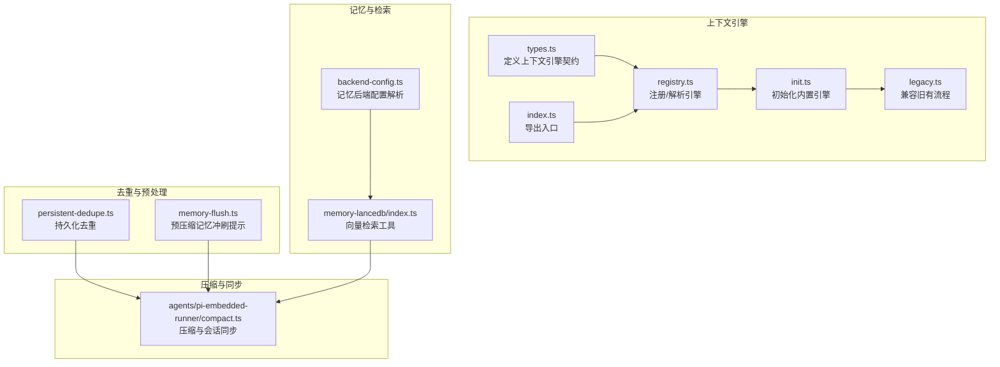
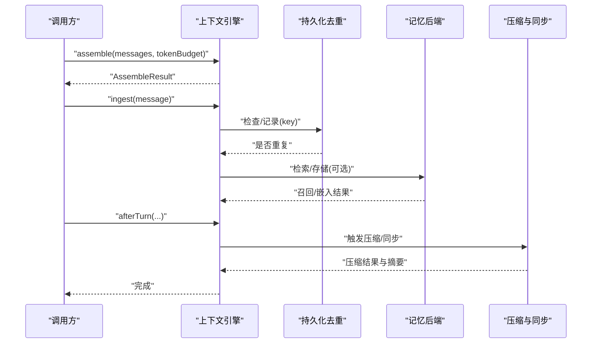
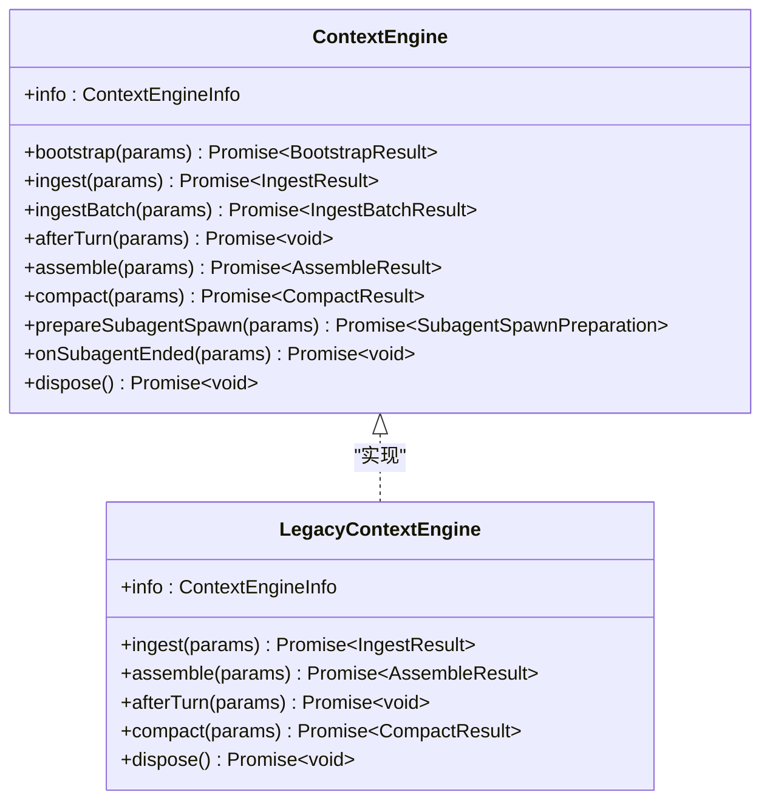
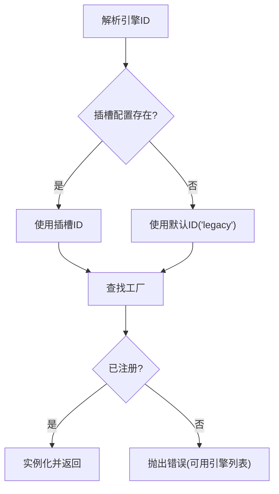
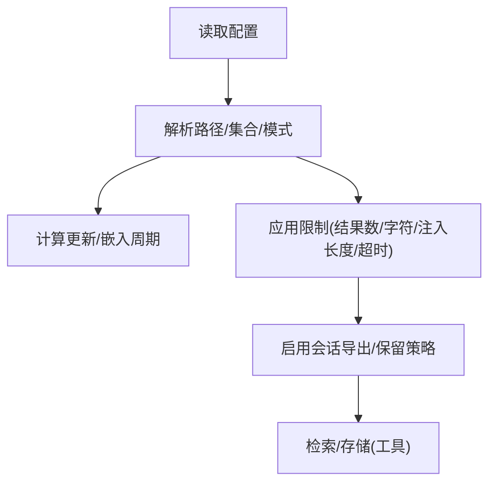
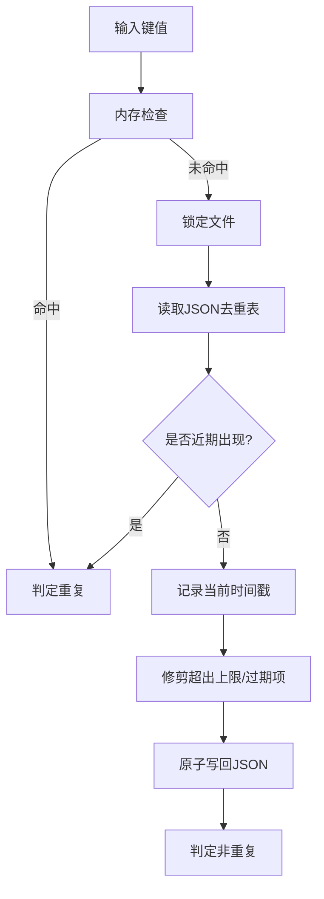
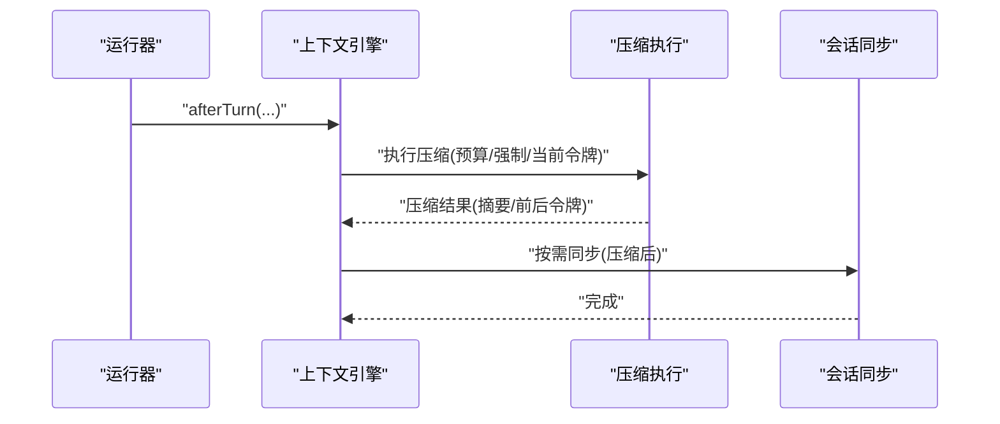
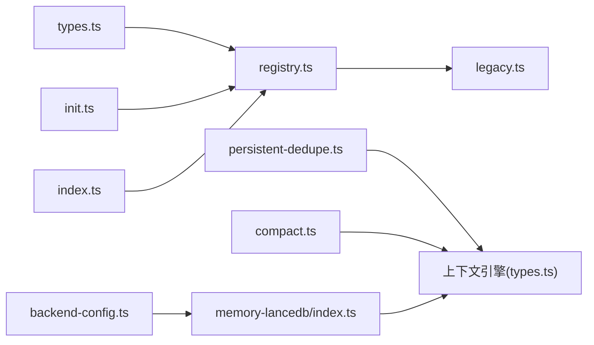

# 上下文管理

<cite>
**本文引用的文件**
- [src/context-engine/types.ts](file://src/context-engine/types.ts)
- [src/context-engine/registry.ts](file://src/context-engine/registry.ts)
- [src/context-engine/init.ts](file://src/context-engine/init.ts)
- [src/context-engine/legacy.ts](file://src/context-engine/legacy.ts)
- [src/context-engine/index.ts](file://src/context-engine/index.ts)
- [src/memory/backend-config.ts](file://src/memory/backend-config.ts)
- [src/plugin-sdk/persistent-dedupe.ts](file://src/plugin-sdk/persistent-dedupe.ts)
- [src/auto-reply/reply/memory-flush.ts](file://src/auto-reply/reply/memory-flush.ts)
- [extensions/memory-lancedb/index.ts](file://extensions/memory-lancedb/index.ts)
- [src/agents/pi-embedded-runner/compact.ts](file://src/agents/pi-embedded-runner/compact.ts)
- [docs/zh-CN/concepts/memory.md](file://docs/zh-CN/concepts/memory.md)
</cite>

## 目录
1. [引言](#引言)
2. [项目结构](#项目结构)
3. [核心组件](#核心组件)
4. [架构总览](#架构总览)
5. [详细组件分析](#详细组件分析)
6. [依赖分析](#依赖分析)
7. [性能考虑](#性能考虑)
8. [故障排查指南](#故障排查指南)
9. [结论](#结论)
10. [附录](#附录)

## 引言
本文件系统化阐述 OpenClaw 的上下文管理系统，覆盖上下文窗口管理、记忆存储与检索、信息压缩与去重、长期/短期/工作记忆的协同机制，以及上下文注入、动态调整与性能优化策略。文档同时给出配置选项、存储策略与查询优化方法，并讨论多模态信息处理与跨会话上下文保持。

## 项目结构
上下文管理由“上下文引擎接口与注册表”“记忆后端配置与检索”“去重与预压缩”“压缩与同步”等模块组成，形成可插拔、可扩展的上下文生命周期闭环。

**图表来源**
- [src/context-engine/types.ts:1-178](file://src/context-engine/types.ts#L1-L178)
- [src/context-engine/registry.ts:1-144](file://src/context-engine/registry.ts#L1-L144)
- [src/context-engine/init.ts:1-24](file://src/context-engine/init.ts#L1-L24)
- [src/context-engine/legacy.ts:1-131](file://src/context-engine/legacy.ts#L1-L131)
- [src/context-engine/index.ts:1-20](file://src/context-engine/index.ts#L1-L20)
- [src/memory/backend-config.ts:1-355](file://src/memory/backend-config.ts#L1-L355)
- [extensions/memory-lancedb/index.ts:353-389](file://extensions/memory-lancedb/index.ts#L353-L389)
- [src/plugin-sdk/persistent-dedupe.ts:86-189](file://src/plugin-sdk/persistent-dedupe.ts#L86-L189)
- [src/auto-reply/reply/memory-flush.ts:25-57](file://src/auto-reply/reply/memory-flush.ts#L25-L57)
- [src/agents/pi-embedded-runner/compact.ts:287-336](file://src/agents/pi-embedded-runner/compact.ts#L287-L336)

**章节来源**
- [src/context-engine/types.ts:1-178](file://src/context-engine/types.ts#L1-L178)
- [src/context-engine/registry.ts:1-144](file://src/context-engine/registry.ts#L1-L144)
- [src/context-engine/init.ts:1-24](file://src/context-engine/init.ts#L1-L24)
- [src/context-engine/legacy.ts:1-131](file://src/context-engine/legacy.ts#L1-L131)
- [src/context-engine/index.ts:1-20](file://src/context-engine/index.ts#L1-L20)
- [src/memory/backend-config.ts:1-355](file://src/memory/backend-config.ts#L1-L355)
- [extensions/memory-lancedb/index.ts:353-389](file://extensions/memory-lancedb/index.ts#L353-L389)
- [src/plugin-sdk/persistent-dedupe.ts:86-189](file://src/plugin-sdk/persistent-dedupe.ts#L86-L189)
- [src/auto-reply/reply/memory-flush.ts:25-57](file://src/auto-reply/reply/memory-flush.ts#L25-L57)
- [src/agents/pi-embedded-runner/compact.ts:287-336](file://src/agents/pi-embedded-runner/compact.ts#L287-L336)

## 核心组件
- 上下文引擎契约与生命周期
  - 定义了组装、摄取、压缩、引导、子代理准备与收尾、资源释放等能力，支持按令牌预算裁剪上下文并产出摘要。
- 引擎注册与解析
  - 提供进程级单例注册表，支持受信任所有者注册、默认回退引擎解析、列表枚举等。
- 记忆后端配置
  - 解析记忆后端类型、引用模式、集合路径、更新/嵌入周期、限制参数与会话导出策略。
- 向量检索工具
  - 提供记忆召回与存储工具，支持重要性与分类参数，执行嵌入与结果返回。
- 持久化去重
  - 基于内存缓存与锁文件的键值去重，支持 TTL 与条目上限，避免重复注入。
- 预压缩记忆冲刷提示
  - 在自动压缩前触发记忆冲刷，指导模型将持久记忆写入磁盘。
- 压缩与会话同步
  - 执行上下文压缩，生成摘要并进行会话记忆同步，确保压缩后的状态一致性。

**章节来源**
- [src/context-engine/types.ts:68-177](file://src/context-engine/types.ts#L68-L177)
- [src/context-engine/registry.ts:58-143](file://src/context-engine/registry.ts#L58-L143)
- [src/memory/backend-config.ts:297-355](file://src/memory/backend-config.ts#L297-L355)
- [extensions/memory-lancedb/index.ts:362-389](file://extensions/memory-lancedb/index.ts#L362-L389)
- [src/plugin-sdk/persistent-dedupe.ts:94-189](file://src/plugin-sdk/persistent-dedupe.ts#L94-L189)
- [src/auto-reply/reply/memory-flush.ts:25-57](file://src/auto-reply/reply/memory-flush.ts#L25-L57)
- [src/agents/pi-embedded-runner/compact.ts:287-336](file://src/agents/pi-embedded-runner/compact.ts#L287-L336)

## 架构总览
上下文管理以“可插拔引擎 + 统一契约”的方式组织，配合记忆后端与检索工具完成信息的获取、去重、压缩与同步，最终形成稳定、可控的模型输入上下文。

**图表来源**
- [src/context-engine/types.ts:129-154](file://src/context-engine/types.ts#L129-L154)
- [src/plugin-sdk/persistent-dedupe.ts:102-134](file://src/plugin-sdk/persistent-dedupe.ts#L102-L134)
- [extensions/memory-lancedb/index.ts:362-389](file://extensions/memory-lancedb/index.ts#L362-L389)
- [src/agents/pi-embedded-runner/compact.ts:287-336](file://src/agents/pi-embedded-runner/compact.ts#L287-L336)

## 详细组件分析

### 上下文引擎契约与生命周期
- 关键职责
  - 引擎引导：可导入历史消息，建立初始状态。
  - 消息摄取：单条或批量消息注入，支持心跳场景标记。
  - 上下文组装：在令牌预算内返回有序消息序列，可附加系统提示补充。
  - 上下文压缩：根据预算/阈值/强制标志生成摘要并裁剪。
  - 子代理生命周期：准备与结束阶段的状态隔离与回滚。
  - 资源清理：释放内部资源。
- 设计要点
  - 生命周期方法为可选，便于不同引擎实现差异化能力。
  - 运行时上下文传递，使引擎可访问调用方状态。

**图表来源**
- [src/context-engine/types.ts:68-177](file://src/context-engine/types.ts#L68-L177)
- [src/context-engine/legacy.ts:20-124](file://src/context-engine/legacy.ts#L20-L124)

**章节来源**
- [src/context-engine/types.ts:68-177](file://src/context-engine/types.ts#L68-L177)
- [src/context-engine/legacy.ts:20-124](file://src/context-engine/legacy.ts#L20-L124)

### 引擎注册与解析
- 注册机制
  - 受信任所有者注册，核心 ID 仅允许核心所有者声明；同所有者可选择刷新。
  - 公共 SDK 注册路径不可声明核心 ID，且不可安全刷新。
- 解析策略
  - 优先使用插槽配置显式指定的引擎 ID；否则回退到默认“legacy”。

**图表来源**
- [src/context-engine/registry.ts:127-143](file://src/context-engine/registry.ts#L127-L143)

**章节来源**
- [src/context-engine/registry.ts:58-143](file://src/context-engine/registry.ts#L58-L143)
- [src/context-engine/init.ts:15-23](file://src/context-engine/init.ts#L15-L23)

### 记忆后端配置与检索
- 配置解析
  - 支持后端类型、引用模式、集合路径、会话导出与保留策略、更新/嵌入周期、超时与限制等。
  - 默认集合包含根级 MEMORY.md 与 memory 目录下的 Markdown 文件。
- 检索工具
  - 提供记忆召回与存储工具，支持重要性与分类参数，执行嵌入与结果返回。

**图表来源**
- [src/memory/backend-config.ts:297-355](file://src/memory/backend-config.ts#L297-L355)
- [extensions/memory-lancedb/index.ts:362-389](file://extensions/memory-lancedb/index.ts#L362-L389)

**章节来源**
- [src/memory/backend-config.ts:297-355](file://src/memory/backend-config.ts#L297-L355)
- [extensions/memory-lancedb/index.ts:362-389](file://extensions/memory-lancedb/index.ts#L362-L389)

### 持久化去重与预压缩
- 持久化去重
  - 内存缓存 + 锁文件 JSON，支持 TTL 与最大条目控制，避免重复注入。
  - 支持热启动加载，提升命中率。
- 预压缩记忆冲刷提示
  - 在自动压缩前触发记忆冲刷，指导模型将持久记忆写入磁盘，减少重复注入。

**图表来源**
- [src/plugin-sdk/persistent-dedupe.ts:102-134](file://src/plugin-sdk/persistent-dedupe.ts#L102-L134)

**章节来源**
- [src/plugin-sdk/persistent-dedupe.ts:94-189](file://src/plugin-sdk/persistent-dedupe.ts#L94-L189)
- [src/auto-reply/reply/memory-flush.ts:25-57](file://src/auto-reply/reply/memory-flush.ts#L25-L57)

### 压缩与跨会话同步
- 压缩流程
  - 根据当前令牌估算与预算触发压缩，生成摘要并裁剪冗余回合。
- 会话同步
  - 压缩后可触发会话记忆同步，确保检索索引与实际内容一致。

**图表来源**
- [src/agents/pi-embedded-runner/compact.ts:287-336](file://src/agents/pi-embedded-runner/compact.ts#L287-L336)

**章节来源**
- [src/agents/pi-embedded-runner/compact.ts:287-336](file://src/agents/pi-embedded-runner/compact.ts#L287-L336)

## 依赖分析
- 上下文引擎依赖关系
  - 类型定义被注册表与引擎实现共同依赖。
  - 初始化模块负责注册“legacy”引擎作为默认回退。
  - 导出入口统一暴露注册、解析与引擎类。
- 记忆后端与检索
  - 配置解析模块为检索工具提供参数，检索工具通过嵌入与召回支撑上下文组装。
- 去重与压缩
  - 去重在摄取阶段降低重复成本；压缩在 afterTurn 阶段降低整体令牌占用。

**图表来源**
- [src/context-engine/types.ts:1-178](file://src/context-engine/types.ts#L1-L178)
- [src/context-engine/registry.ts:1-144](file://src/context-engine/registry.ts#L1-L144)
- [src/context-engine/init.ts:1-24](file://src/context-engine/init.ts#L1-L24)
- [src/context-engine/legacy.ts:1-131](file://src/context-engine/legacy.ts#L1-L131)
- [src/context-engine/index.ts:1-20](file://src/context-engine/index.ts#L1-L20)
- [src/memory/backend-config.ts:1-355](file://src/memory/backend-config.ts#L1-L355)
- [extensions/memory-lancedb/index.ts:353-389](file://extensions/memory-lancedb/index.ts#L353-L389)
- [src/plugin-sdk/persistent-dedupe.ts:86-189](file://src/plugin-sdk/persistent-dedupe.ts#L86-L189)
- [src/agents/pi-embedded-runner/compact.ts:287-336](file://src/agents/pi-embedded-runner/compact.ts#L287-L336)

**章节来源**
- [src/context-engine/types.ts:1-178](file://src/context-engine/types.ts#L1-L178)
- [src/context-engine/registry.ts:1-144](file://src/context-engine/registry.ts#L1-L144)
- [src/context-engine/init.ts:1-24](file://src/context-engine/init.ts#L1-L24)
- [src/context-engine/legacy.ts:1-131](file://src/context-engine/legacy.ts#L1-L131)
- [src/context-engine/index.ts:1-20](file://src/context-engine/index.ts#L1-L20)
- [src/memory/backend-config.ts:1-355](file://src/memory/backend-config.ts#L1-L355)
- [extensions/memory-lancedb/index.ts:353-389](file://extensions/memory-lancedb/index.ts#L353-L389)
- [src/plugin-sdk/persistent-dedupe.ts:86-189](file://src/plugin-sdk/persistent-dedupe.ts#L86-L189)
- [src/agents/pi-embedded-runner/compact.ts:287-336](file://src/agents/pi-embedded-runner/compact.ts#L287-L336)

## 性能考虑
- 令牌预算与分层压缩
  - 在组装阶段严格控制令牌，压缩阶段按预算/阈值/强制策略裁剪，避免超限。
- 去重与预冲刷
  - 通过持久化去重减少重复注入成本；预压缩记忆冲刷促使模型将重要信息落盘，降低后续重复概率。
- 检索与嵌入优化
  - 合理设置检索模式、结果数量与片段长度上限，控制注入字符数与超时。
- 更新与嵌入周期
  - 调整更新与嵌入周期，平衡新鲜度与性能；在 CPU 环境优先使用更快的检索模式。
- 会话同步
  - 压缩后触发同步，避免检索索引与内容不一致导致的额外往返。

[本节为通用性能建议，无需特定文件引用]

## 故障排查指南
- 引擎未注册
  - 现象：解析默认“legacy”失败或可用引擎列表为空。
  - 排查：确认初始化是否执行；检查所有者权限与重复注册策略。
- 去重异常
  - 现象：并发写入冲突或文件锁失败。
  - 排查：检查锁文件路径与权限；观察 onDiskError 回调；确认 TTL 与条目上限配置。
- 压缩无效或超时
  - 现象：压缩后令牌未下降或耗时过长。
  - 排查：检查当前令牌估算与预算；调整压缩目标与强制标志；查看压缩详情与摘要生成情况。
- 检索结果异常
  - 现象：召回数量不足或片段过短。
  - 排查：调整检索模式、结果数与片段长度上限；检查嵌入周期与命令超时。

**章节来源**
- [src/context-engine/registry.ts:127-143](file://src/context-engine/registry.ts#L127-L143)
- [src/plugin-sdk/persistent-dedupe.ts:129-133](file://src/plugin-sdk/persistent-dedupe.ts#L129-L133)
- [src/agents/pi-embedded-runner/compact.ts:287-336](file://src/agents/pi-embedded-runner/compact.ts#L287-L336)
- [src/memory/backend-config.ts:180-195](file://src/memory/backend-config.ts#L180-L195)

## 结论
OpenClaw 的上下文管理通过可插拔的上下文引擎契约、完善的注册与解析机制、可配置的记忆后端与检索工具、以及去重与压缩同步策略，实现了对上下文窗口的可控管理与高效运行。结合合理的配置与优化手段，可在多模态与跨会话场景下保持稳定的上下文质量与性能表现。

[本节为总结性内容，无需特定文件引用]

## 附录

### 配置选项与存储策略
- 记忆后端
  - 后端类型、引用模式、集合路径、会话导出目录与保留天数、更新/嵌入周期、超时与限制。
- 检索工具
  - 支持重要性与分类参数，执行嵌入与结果返回。
- 去重策略
  - TTL、内存缓存大小、文件最大条目、锁选项与回调。
- 预压缩提示
  - 在自动压缩前触发记忆冲刷，指导模型将持久记忆写入磁盘。

**章节来源**
- [src/memory/backend-config.ts:60-70](file://src/memory/backend-config.ts#L60-L70)
- [extensions/memory-lancedb/index.ts:362-389](file://extensions/memory-lancedb/index.ts#L362-L389)
- [src/plugin-sdk/persistent-dedupe.ts:94-98](file://src/plugin-sdk/persistent-dedupe.ts#L94-L98)
- [src/auto-reply/reply/memory-flush.ts:25-57](file://src/auto-reply/reply/memory-flush.ts#L25-L57)

### 多模态信息处理与跨会话上下文保持
- 多模态
  - 记忆后端与检索工具支持文本与向量检索，适配多模态输入的文本化表示。
- 跨会话保持
  - 通过会话同步与压缩后的摘要，维持上下文连贯性；记忆文件布局与自动刷新机制保障长期记忆的稳定性。

**章节来源**
- [docs/zh-CN/concepts/memory.md:16-41](file://docs/zh-CN/concepts/memory.md#L16-L41)
- [src/agents/pi-embedded-runner/compact.ts:287-336](file://src/agents/pi-embedded-runner/compact.ts#L287-L336)