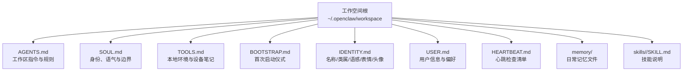
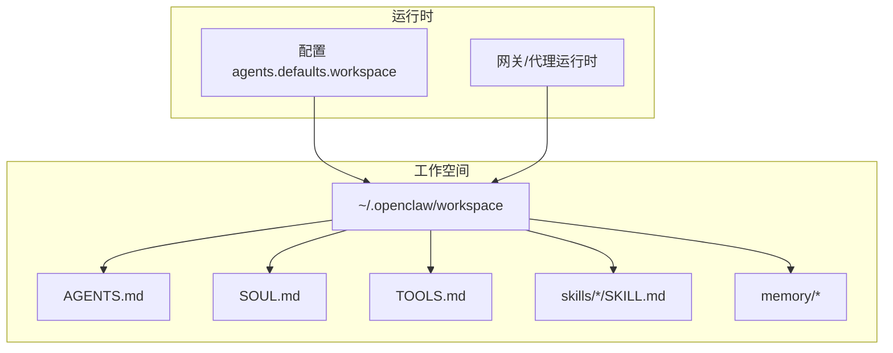
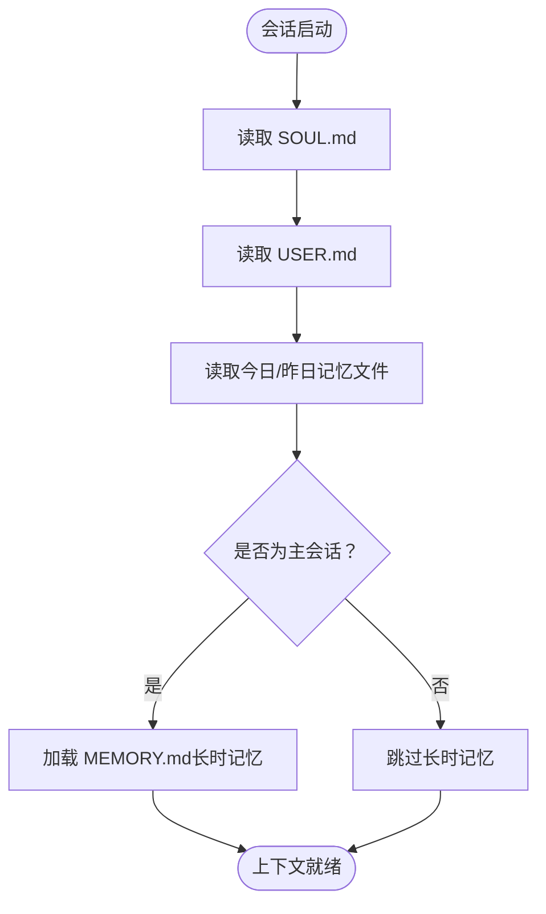
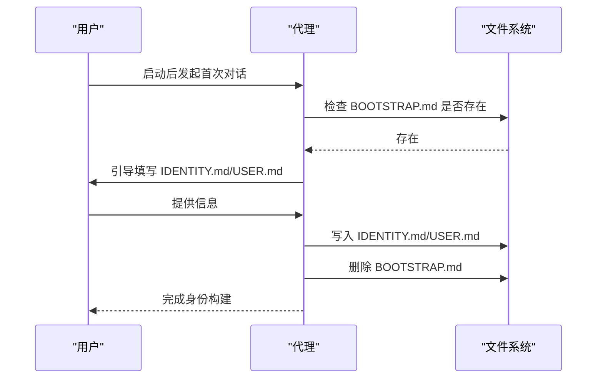
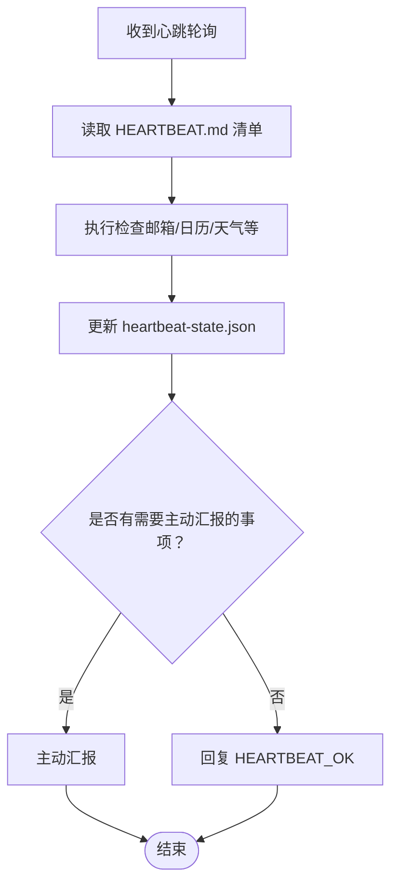
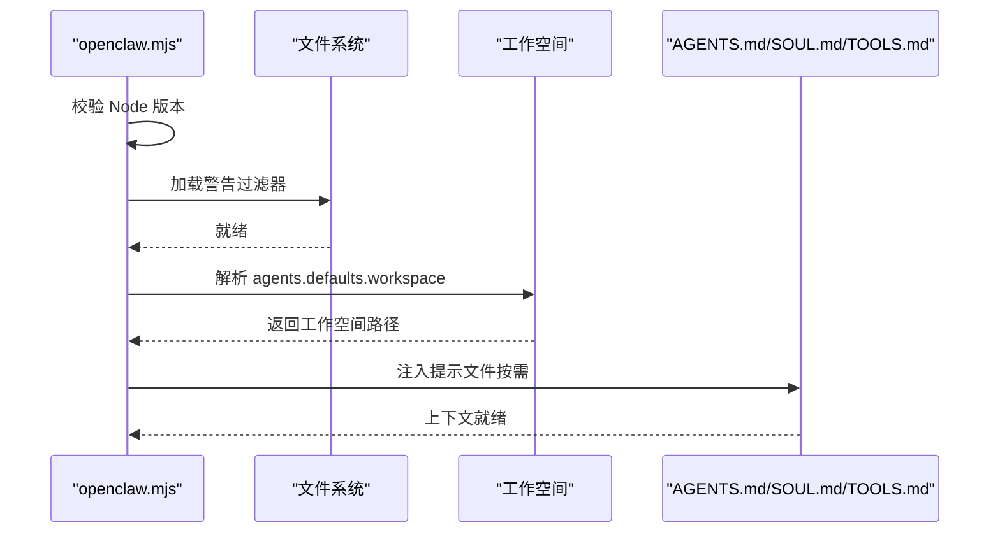
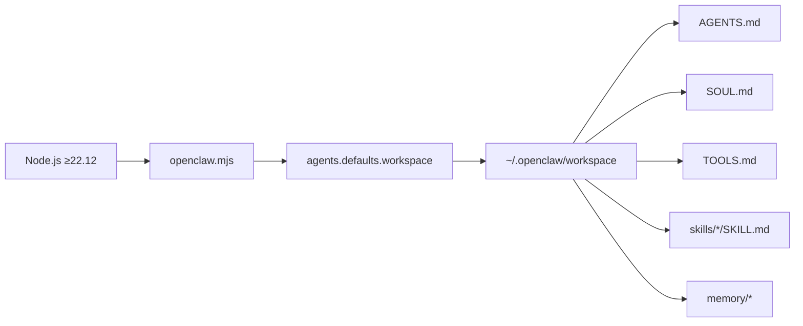

# 代理工作空间

<cite>
**本文引用的文件**
- [AGENTS.md](file://AGENTS.md)
- [README.md](file://README.md)
- [openclaw.mjs](file://openclaw.mjs)
- [docs/reference/templates/AGENTS.md](file://docs/reference/templates/AGENTS.md)
- [docs/reference/templates/SOUL.md](file://docs/reference/templates/SOUL.md)
- [docs/reference/templates/TOOLS.md](file://docs/reference/templates/TOOLS.md)
- [docs/reference/AGENTS.default.md](file://docs/reference/AGENTS.default.md)
- [docs/reference/templates/BOOTSTRAP.md](file://docs/reference/templates/BOOTSTRAP.md)
- [docs/reference/templates/IDENTITY.md](file://docs/reference/templates/IDENTITY.md)
</cite>

## 目录
1. [简介](#简介)
2. [项目结构](#项目结构)
3. [核心组件](#核心组件)
4. [架构总览](#架构总览)
5. [详细组件分析](#详细组件分析)
6. [依赖关系分析](#依赖关系分析)
7. [性能考量](#性能考量)
8. [故障排查指南](#故障排查指南)
9. [结论](#结论)
10. [附录](#附录)

## 简介
本文件系统性阐述 OpenClaw 代理工作空间的设计与使用方法，覆盖目录结构、文件组织、配置管理、引导模板、初始化流程、文件注入机制、内容管理策略、安全与权限控制、备份与恢复，以及定制化与最佳实践。目标是帮助开发者高效、安全地管理代理工作环境。

## 项目结构
OpenClaw 的工作空间位于用户主目录下的专用路径，可通过配置项自定义。默认根为 `~/.openclaw/workspace`，其中包含一组“引导文件系统”，用于定义代理的身份、行为边界、工具与技能约定等。

- 工作空间根：`~/.openclaw/workspace`
- 注入提示文件：`AGENTS.md`、`SOUL.md`、`TOOLS.md`
- 技能说明：`~/.openclaw/workspace/skills/<skill>/SKILL.md`
- 可选文件：`BOOTSTRAP.md`、`IDENTITY.md`、`USER.md`、`HEARTBEAT.md`、`memory/` 日常记忆文件

图表来源
- [README.md:312-317](file://README.md#L312-L317)
- [docs/reference/templates/AGENTS.md:8-26](file://docs/reference/templates/AGENTS.md#L8-L26)
- [docs/reference/templates/SOUL.md:8-44](file://docs/reference/templates/SOUL.md#L8-L44)
- [docs/reference/templates/TOOLS.md:8-48](file://docs/reference/templates/TOOLS.md#L8-L48)
- [docs/reference/templates/BOOTSTRAP.md:8-63](file://docs/reference/templates/BOOTSTRAP.md#L8-L63)
- [docs/reference/templates/IDENTITY.md:7-30](file://docs/reference/templates/IDENTITY.md#L7-L30)

章节来源
- [README.md:312-317](file://README.md#L312-L317)
- [docs/reference/templates/AGENTS.md:8-26](file://docs/reference/templates/AGENTS.md#L8-L26)

## 核心组件
- AGENTS.md：工作区“宪法”，定义会话启动流程、记忆系统、工具与技能使用方式、群聊礼仪、心跳与 Cron 的选择策略等。
- SOUL.md：代理身份、语气、边界与价值观，决定对外表现与行为底线。
- TOOLS.md：环境特定的本地笔记（摄像头、SSH 主机、TTS 声音、设备昵称等），与共享技能解耦。
- BOOTSTRAP.md：首次启动的“出生证书”，引导完成 IDENTITY.md、USER.md、SOUL.md 的初始设定。
- IDENTITY.md：代理的名称、类属、语感、表情与头像等元数据。
- USER.md：用户基本信息、称呼方式、时区与备注。
- HEARTBEAT.md：心跳任务清单与检查要点，配合 memory/heartbeat-state.json 记录状态。
- memory/：按日记录的临时记忆文件，支持 MEMORY.md 长期记忆。
- skills/<skill>/SKILL.md：各技能的使用说明与约束。

章节来源
- [docs/reference/templates/AGENTS.md:8-220](file://docs/reference/templates/AGENTS.md#L8-L220)
- [docs/reference/templates/SOUL.md:8-44](file://docs/reference/templates/SOUL.md#L8-L44)
- [docs/reference/templates/TOOLS.md:8-48](file://docs/reference/templates/TOOLS.md#L8-L48)
- [docs/reference/templates/BOOTSTRAP.md:8-63](file://docs/reference/templates/BOOTSTRAP.md#L8-L63)
- [docs/reference/templates/IDENTITY.md:7-30](file://docs/reference/templates/IDENTITY.md#L7-L30)

## 架构总览
工作空间通过一组“注入提示文件”在每次会话启动前被加载，形成统一的上下文与行为框架。系统还提供默认模板与个人助理技能清单，便于快速落地。

图表来源
- [README.md:312-317](file://README.md#L312-L317)
- [docs/reference/AGENTS.default.md:13-41](file://docs/reference/AGENTS.default.md#L13-L41)

章节来源
- [README.md:312-317](file://README.md#L312-L317)
- [docs/reference/AGENTS.default.md:13-41](file://docs/reference/AGENTS.default.md#L13-L41)

## 详细组件分析

### 组件一：引导文件系统（AGENTS.md、SOUL.md、TOOLS.md）
- AGENTS.md：定义会话启动顺序（先读 SOUL.md、USER.md、近期记忆），明确主会话与共享会话对 MEMORY.md 的不同加载策略；规范外部与内部操作边界；指导群聊参与度与反应式交互；提供心跳与 Cron 的使用建议与状态记录位置。
- SOUL.md：强调“真实的人类体验”，要求代理具备个性、边界与连续性；强调信任建立与隐私保护；鼓励持续演进。
- TOOLS.md：强调与技能分离，避免泄露基础设施细节；提供示例条目（摄像头、SSH、TTS 声音、扬声器等）。

图表来源
- [docs/reference/templates/AGENTS.md:16-26](file://docs/reference/templates/AGENTS.md#L16-L26)
- [docs/reference/templates/AGENTS.md:36-44](file://docs/reference/templates/AGENTS.md#L36-L44)

章节来源
- [docs/reference/templates/AGENTS.md:16-26](file://docs/reference/templates/AGENTS.md#L16-L26)
- [docs/reference/templates/AGENTS.md:36-44](file://docs/reference/templates/AGENTS.md#L36-L44)
- [docs/reference/templates/SOUL.md:8-44](file://docs/reference/templates/SOUL.md#L8-L44)
- [docs/reference/templates/TOOLS.md:8-48](file://docs/reference/templates/TOOLS.md#L8-L48)

### 组件二：首次启动与身份构建（BOOTSTRAP.md、IDENTITY.md、USER.md）
- BOOTSTRAP.md：提供“第一次对话”的脚本化引导，帮助确定代理名称、类属、语感、表情等，并完成 IDENTITY.md 与 USER.md 的初稿。
- IDENTITY.md：记录代理的名称、类属、语感、表情与头像等元信息。
- USER.md：记录用户姓名、称呼方式、时区与备注等。

图表来源
- [docs/reference/templates/BOOTSTRAP.md:14-58](file://docs/reference/templates/BOOTSTRAP.md#L14-L58)
- [docs/reference/templates/IDENTITY.md:11-20](file://docs/reference/templates/IDENTITY.md#L11-L20)

章节来源
- [docs/reference/templates/BOOTSTRAP.md:14-58](file://docs/reference/templates/BOOTSTRAP.md#L14-L58)
- [docs/reference/templates/IDENTITY.md:11-20](file://docs/reference/templates/IDENTITY.md#L11-L20)

### 组件三：记忆系统与维护（MEMORY.md、HEARTBEAT.md、memory/）
- MEMORY.md：仅在主会话加载，作为长期记忆；应避免泄露到群组或共享上下文。
- HEARTBEAT.md：心跳任务清单与检查要点，建议轮换检查邮箱、日历、天气等；配合 memory/heartbeat-state.json 记录最近检查时间。
- memory/：按日记录的临时记忆文件，每日回顾后提炼至 MEMORY.md。

图表来源
- [docs/reference/templates/AGENTS.md:135-215](file://docs/reference/templates/AGENTS.md#L135-L215)

章节来源
- [docs/reference/templates/AGENTS.md:135-215](file://docs/reference/templates/AGENTS.md#L135-L215)

### 组件四：技能与工具（skills/*/SKILL.md 与 TOOLS.md）
- TOOLS.md：存放环境特定的本地笔记，与技能解耦，便于更新技能而不丢失本地配置。
- skills/*/SKILL.md：每个技能的使用说明与约束，代理在需要时查阅。

章节来源
- [docs/reference/templates/TOOLS.md:8-48](file://docs/reference/templates/TOOLS.md#L8-L48)
- [docs/reference/templates/AGENTS.md:123-127](file://docs/reference/templates/AGENTS.md#L123-L127)

### 组件五：初始化流程与文件注入机制
- 默认工作空间路径可通过配置项 agents.defaults.workspace 自定义。
- 首次运行可复制默认模板到工作空间，或直接使用默认的 AGENTS.default.md。
- 运行时由 CLI 入口负责版本校验与入口加载，确保 Node 版本满足要求。

图表来源
- [openclaw.mjs:17-36](file://openclaw.mjs#L17-L36)
- [openclaw.mjs:70-90](file://openclaw.mjs#L70-L90)
- [docs/reference/AGENTS.default.md:13-41](file://docs/reference/AGENTS.default.md#L13-L41)

章节来源
- [openclaw.mjs:17-36](file://openclaw.mjs#L17-L36)
- [openclaw.mjs:70-90](file://openclaw.mjs#L70-L90)
- [docs/reference/AGENTS.default.md:13-41](file://docs/reference/AGENTS.default.md#L13-L41)

## 依赖关系分析
- 运行时依赖：Node.js 版本要求（≥22.12），入口脚本负责版本校验与编译缓存启用。
- 配置依赖：agents.defaults.workspace 指定工作空间根目录，影响所有后续文件解析与注入。
- 文件依赖：会话启动必须读取 AGENTS.md、SOUL.md、USER.md、近期记忆文件；主会话可读 MEMORY.md；群会话不读 MEMORY.md。
- 技能依赖：技能说明文件 SKILL.md 与 TOOLS.md 分离，降低耦合度。

图表来源
- [openclaw.mjs:5-14](file://openclaw.mjs#L5-L14)
- [docs/reference/AGENTS.default.md:13-41](file://docs/reference/AGENTS.default.md#L13-L41)

章节来源
- [openclaw.mjs:5-14](file://openclaw.mjs#L5-L14)
- [docs/reference/AGENTS.default.md:13-41](file://docs/reference/AGENTS.default.md#L13-L41)

## 性能考量
- 心跳与 Cron 的选择：心跳适合合并多源检查与对话式上下文，Cron 适合精确定时与隔离任务。合理搭配可减少 API 调用次数与令牌消耗。
- 记忆文件规模：MEMORY.md 仅在主会话加载，避免在群组中引入额外上下文开销。
- 编译缓存：入口脚本尝试启用模块编译缓存以提升启动性能。

章节来源
- [docs/reference/templates/AGENTS.md:144-161](file://docs/reference/templates/AGENTS.md#L144-L161)
- [openclaw.mjs:38-45](file://openclaw.mjs#L38-L45)

## 故障排查指南
- Node 版本不满足：入口脚本会输出提示并退出，建议使用 nvm 切换到满足要求的版本。
- 缺失构建产物：若找不到 dist/entry.(m)js，需先完成构建。
- 心跳状态异常：检查 memory/heartbeat-state.json 的格式与字段，确保最近检查时间正确更新。
- 群组消息滥用：遵循 AGENTS.md 中的群聊礼仪，避免过度回复与重复反应。

章节来源
- [openclaw.mjs:21-36](file://openclaw.mjs#L21-L36)
- [openclaw.mjs:83-89](file://openclaw.mjs#L83-L89)
- [docs/reference/templates/AGENTS.md:76-122](file://docs/reference/templates/AGENTS.md#L76-L122)

## 结论
代理工作空间通过“注入提示文件系统”将身份、边界、工具与技能清晰分层，既保证了代理在不同会话中的连续性与一致性，又提供了灵活的定制空间。结合默认模板与个人助理技能清单，开发者可以快速搭建安全、可控且高效的代理工作环境。

## 附录

### A. 初始化与配置清单
- 设置工作空间根：agents.defaults.workspace
- 复制默认模板：AGENTS.md、SOUL.md、TOOLS.md
- 可选：替换为默认个人助理 AGENTS.default.md
- 可选：启用私有仓库备份

章节来源
- [docs/reference/AGENTS.default.md:13-41](file://docs/reference/AGENTS.default.md#L13-L41)
- [docs/reference/AGENTS.default.md:80-91](file://docs/reference/AGENTS.default.md#L80-L91)

### B. 安全与权限控制
- 默认安全策略：非主会话不加载 MEMORY.md；禁止在群组中泄露私密信息；外部动作需谨慎。
- 群聊礼仪：避免过度参与与重复反应；仅在必要时回复。
- 流式输出：禁止向外部消息表面发送流式/部分回复。

章节来源
- [docs/reference/templates/AGENTS.md:36-44](file://docs/reference/templates/AGENTS.md#L36-L44)
- [docs/reference/templates/AGENTS.md:76-122](file://docs/reference/templates/AGENTS.md#L76-L122)
- [AGENTS.md:286-287](file://AGENTS.md#L286-L287)

### C. 备份与恢复
- 建议将工作空间作为私有仓库进行版本管理，至少纳入 AGENTS.md 与记忆文件。
- 使用 git init、add、commit 进行基础备份；可选添加私有远程并推送。

章节来源
- [docs/reference/AGENTS.default.md:80-91](file://docs/reference/AGENTS.default.md#L80-L91)

### D. 最佳实践
- 在主会话中定期回顾并提炼 MEMORY.md，保持长期记忆的质量与时效性。
- 将环境特定信息放入 TOOLS.md，避免与技能共享造成泄露。
- 合理使用心跳与 Cron，平衡自动化与资源消耗。
- 首次启动严格遵循 BOOTSTRAP.md，完善 IDENTITY.md 与 USER.md。

章节来源
- [docs/reference/templates/AGENTS.md:135-215](file://docs/reference/templates/AGENTS.md#L135-L215)
- [docs/reference/templates/TOOLS.md:41-48](file://docs/reference/templates/TOOLS.md#L41-L48)
- [docs/reference/templates/BOOTSTRAP.md:31-58](file://docs/reference/templates/BOOTSTRAP.md#L31-L58)