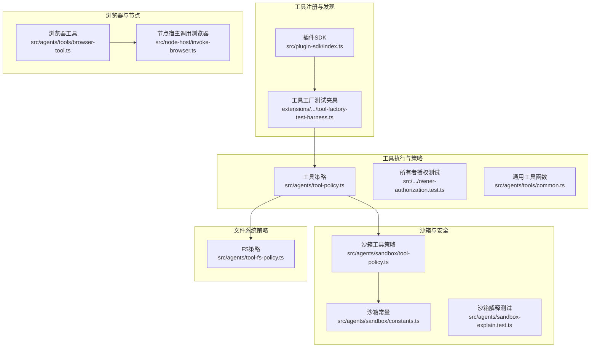
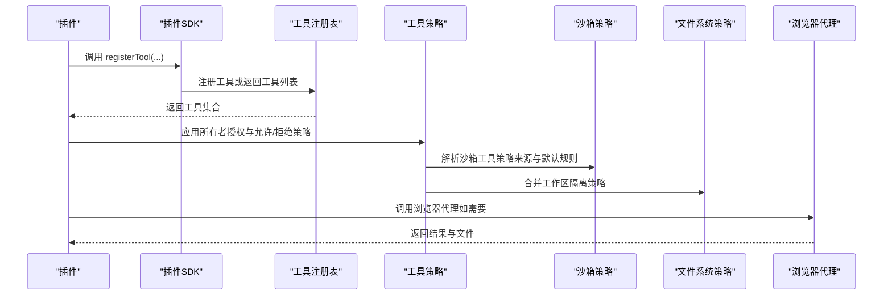
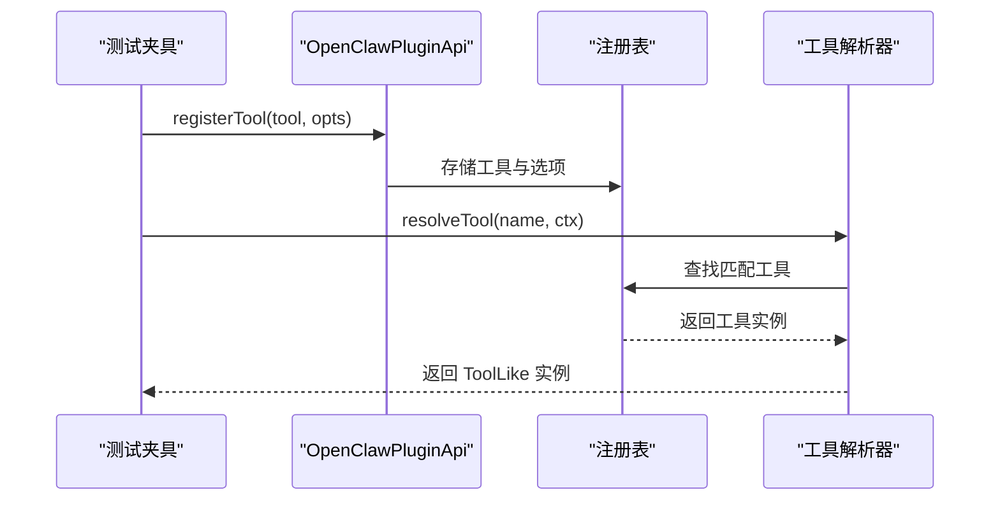
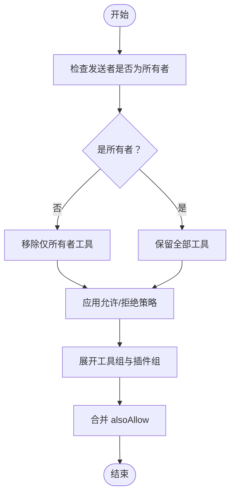
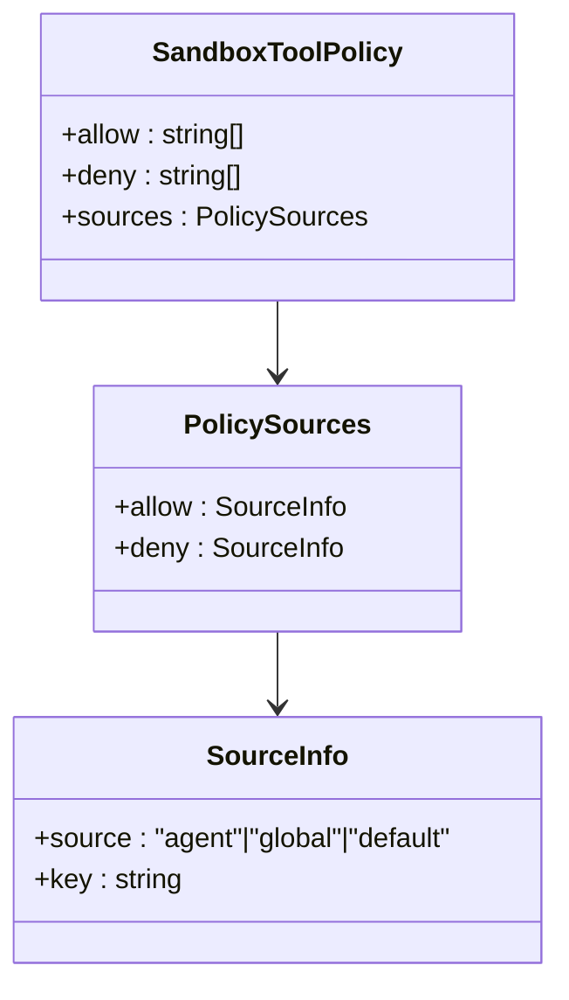
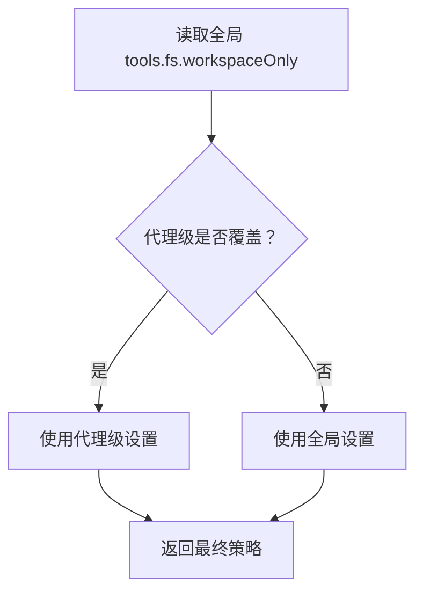
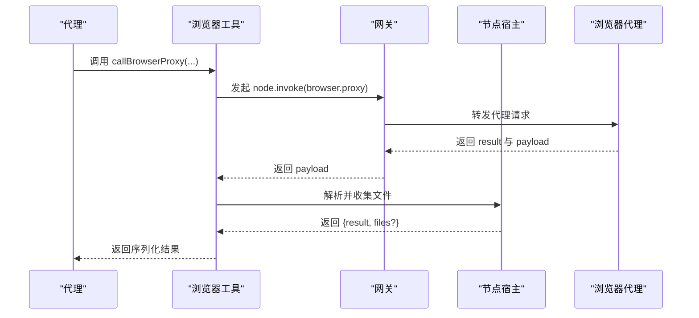
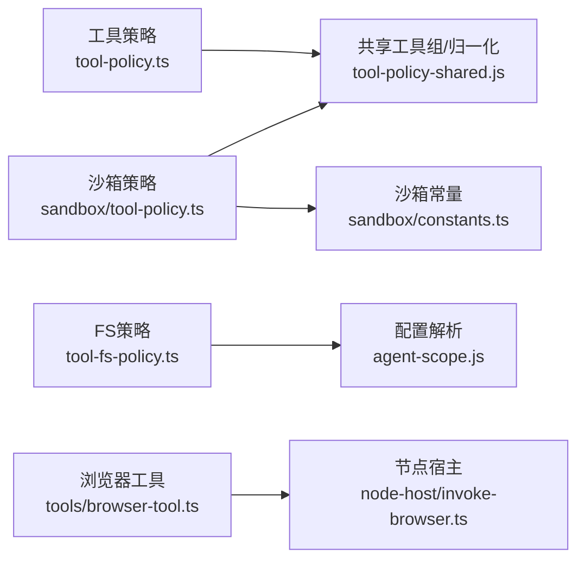

# 代理工具系统

<cite>
**本文引用的文件**
- [src/agents/openclaw-tools.ts](file://src/agents/openclaw-tools.ts)
- [src/agents/openclaw-tools.owner-authorization.test.ts](file://src/agents/openclaw-tools.owner-authorization.test.ts)
- [src/agents/tools/common.ts](file://src/agents/tools/common.ts)
- [src/agents/tool-policy.ts](file://src/agents/tool-policy.ts)
- [src/agents/tool-fs-policy.ts](file://src/agents/tool-fs-policy.ts)
- [src/agents/sandbox/tool-policy.ts](file://src/agents/sandbox/tool-policy.ts)
- [src/agents/sandbox/constants.ts](file://src/agents/sandbox/constants.ts)
- [src/agents/sandbox/config.js](file://src/agents/sandbox/config.js)
- [src/agents/sandbox/runtime-status.js](file://src/agents/sandbox/runtime-status.js)
- [src/agents/sandbox-explain.test.ts](file://src/agents/sandbox-explain.test.ts)
- [src/agents/bash-tools.ts](file://src/agents/bash-tools.ts)
- [src/agents/bash-tools.exec.js](file://src/agents/bash-tools.exec.js)
- [src/agents/bash-tools.process.js](file://src/agents/bash-tools.process.js)
- [src/agents/tools/browser-tool.ts](file://src/agents/tools/browser-tool.ts)
- [src/node-host/invoke-browser.ts](file://src/node-host/invoke-browser.ts)
- [src/plugin-sdk/index.ts](file://src/plugin-sdk/index.ts)
- [extensions/feishu/src/tool-factory-test-harness.ts](file://extensions/feishu/src/tool-factory-test-harness.ts)
- [docs/tools/index.md](file://docs/tools/index.md)
- [docs/tools/exec.md](file://docs/tools/exec.md)
- [docs/tools/elevated.md](file://docs/tools/elevated.md)
- [docs/tools/skills.md](file://docs/tools/skills.md)
- [docs/tools/skills-config.md](file://docs/tools/skills-config.md)
- [docs/gateway/sandboxing.md](file://docs/gateway/sandboxing.md)
- [docs/gateway/tools-invoke-http-api.md](file://docs/gateway/tools-invoke-http-api.md)
- [docs/concepts/architecture.md](file://docs/concepts/architecture.md)
- [docs/cli/tools.md](file://docs/cli/tools.md)
- [docs/help/troubleshooting.md](file://docs/help/troubleshooting.md)
</cite>

## 目录
1. [简介](#简介)
2. [项目结构](#项目结构)
3. [核心组件](#核心组件)
4. [架构总览](#架构总览)
5. [详细组件分析](#详细组件分析)
6. [依赖分析](#依赖分析)
7. [性能考量](#性能考量)
8. [故障排除指南](#故障排除指南)
9. [结论](#结论)
10. [附录](#附录)

## 简介
本文件系统性梳理代理工具系统的架构与实现，覆盖工具注册、发现与调用机制；内置工具的功能与使用方法（文件操作、系统工具、浏览器与代理专用工具）；工具权限控制、安全策略与沙箱机制；自定义工具开发指南与扩展集成方法；以及工具配置示例与故障排除技巧。目标是帮助开发者高效理解并扩展代理工具系统。

## 项目结构
代理工具系统主要由以下层次构成：
- 工具注册与发现：通过插件SDK导出工具接口，插件在运行时注册工具或返回工具列表。
- 工具执行与策略：根据发送者身份、工具属性与策略配置，动态应用“仅所有者可用”等访问控制。
- 沙箱与安全：默认允许/拒绝工具清单、工具组展开、运行时策略解析与来源追踪。
- 文件系统策略：工作区隔离开关，按全局与代理粒度生效。
- 浏览器与节点宿主：浏览器代理调用、文件收集与持久化。
- 文档与CLI：工具索引、执行说明、HTTP调用API与故障排除指引。

**图示来源**
- [src/plugin-sdk/index.ts](file://src/plugin-sdk/index.ts)
- [extensions/feishu/src/tool-factory-test-harness.ts](file://extensions/feishu/src/tool-factory-test-harness.ts)
- [src/agents/tool-policy.ts](file://src/agents/tool-policy.ts)
- [src/agents/sandbox/tool-policy.ts](file://src/agents/sandbox/tool-policy.ts)
- [src/agents/sandbox/constants.ts](file://src/agents/sandbox/constants.ts)
- [src/agents/tool-fs-policy.ts](file://src/agents/tool-fs-policy.ts)
- [src/agents/tools/browser-tool.ts](file://src/agents/tools/browser-tool.ts)
- [src/node-host/invoke-browser.ts](file://src/node-host/invoke-browser.ts)

**章节来源**
- [src/plugin-sdk/index.ts](file://src/plugin-sdk/index.ts)
- [extensions/feishu/src/tool-factory-test-harness.ts](file://extensions/feishu/src/tool-factory-test-harness.ts)
- [src/agents/tool-policy.ts](file://src/agents/tool-policy.ts)
- [src/agents/sandbox/tool-policy.ts](file://src/agents/sandbox/tool-policy.ts)
- [src/agents/sandbox/constants.ts](file://src/agents/sandbox/constants.ts)
- [src/agents/tool-fs-policy.ts](file://src/agents/tool-fs-policy.ts)
- [src/agents/tools/browser-tool.ts](file://src/agents/tools/browser-tool.ts)
- [src/node-host/invoke-browser.ts](file://src/node-host/invoke-browser.ts)

## 核心组件
- 插件SDK与工具注册
  - 插件通过SDK提供的API注册工具或返回工具列表，支持按上下文动态生成工具集合。
  - 工具工厂夹具用于在测试中解析已注册工具，便于验证工具发现流程。
- 工具策略与所有者授权
  - 对工具进行“仅所有者可用”的策略处理，非所有者调用时会拦截或移除相应工具。
  - 支持显式允许列表、拒绝列表、工具组展开与插件组聚合。
- 沙箱工具策略与默认规则
  - 默认允许/拒绝工具清单，自动注入图像工具以支持多模态场景。
  - 运行时解析策略来源（代理级、全局、默认），并可解释策略选择依据。
- 文件系统策略
  - 工作区隔离开关，按全局与代理粒度合并生效，确保工具仅在限定目录范围内读写。
- 浏览器与节点宿主
  - 通过网关调用浏览器代理，支持超时、鉴权与文件收集；节点宿主负责读取代理输出文件并返回结果。
- 内置工具与文档
  - 工具索引、执行说明、HTTP调用API与CLI参考，为开发者提供快速上手路径。

**章节来源**
- [src/plugin-sdk/index.ts](file://src/plugin-sdk/index.ts)
- [extensions/feishu/src/tool-factory-test-harness.ts](file://extensions/feishu/src/tool-factory-test-harness.ts)
- [src/agents/tool-policy.ts](file://src/agents/tool-policy.ts)
- [src/agents/openclaw-tools.owner-authorization.test.ts](file://src/agents/openclaw-tools.owner-authorization.test.ts)
- [src/agents/sandbox/tool-policy.ts](file://src/agents/sandbox/tool-policy.ts)
- [src/agents/sandbox/constants.ts](file://src/agents/sandbox/constants.ts)
- [src/agents/tool-fs-policy.ts](file://src/agents/tool-fs-policy.ts)
- [src/agents/tools/browser-tool.ts](file://src/agents/tools/browser-tool.ts)
- [src/node-host/invoke-browser.ts](file://src/node-host/invoke-browser.ts)
- [docs/tools/index.md](file://docs/tools/index.md)
- [docs/tools/exec.md](file://docs/tools/exec.md)
- [docs/tools/elevated.md](file://docs/tools/elevated.md)
- [docs/tools/skills.md](file://docs/tools/skills.md)
- [docs/tools/skills-config.md](file://docs/tools/skills-config.md)
- [docs/gateway/tools-invoke-http-api.md](file://docs/gateway/tools-invoke-http-api.md)
- [docs/cli/tools.md](file://docs/cli/tools.md)

## 架构总览
代理工具系统采用“插件注册 + 策略过滤 + 沙箱执行”的分层架构。插件在运行时向系统注册工具，系统根据发送者身份与策略配置对工具进行筛选与保护；沙箱提供默认的工具白/黑名单与工作区隔离，确保工具在受控环境中执行。

**图示来源**
- [src/plugin-sdk/index.ts](file://src/plugin-sdk/index.ts)
- [extensions/feishu/src/tool-factory-test-harness.ts](file://extensions/feishu/src/tool-factory-test-harness.ts)
- [src/agents/tool-policy.ts](file://src/agents/tool-policy.ts)
- [src/agents/sandbox/tool-policy.ts](file://src/agents/sandbox/tool-policy.ts)
- [src/agents/tool-fs-policy.ts](file://src/agents/tool-fs-policy.ts)
- [src/agents/tools/browser-tool.ts](file://src/agents/tools/browser-tool.ts)

## 详细组件分析

### 工具注册与发现机制
- 插件SDK导出统一的工具类型与注册接口，插件可直接注册单个工具或返回一组工具。
- 工具工厂夹具提供测试环境下的工具解析能力，支持按名称查找与动态构建工具集合。
- 典型流程：插件初始化 -> 调用 registerTool -> SDK维护注册表 -> 外部模块按需解析工具。

**图示来源**
- [extensions/feishu/src/tool-factory-test-harness.ts](file://extensions/feishu/src/tool-factory-test-harness.ts)
- [src/plugin-sdk/index.ts](file://src/plugin-sdk/index.ts)

**章节来源**
- [extensions/feishu/src/tool-factory-test-harness.ts](file://extensions/feishu/src/tool-factory-test-harness.ts)
- [src/plugin-sdk/index.ts](file://src/plugin-sdk/index.ts)

### 工具策略与所有者授权
- 所有者授权：对标记为“仅所有者”的工具，非所有者调用时会被拦截或从工具列表中移除。
- 策略合并：支持显式允许/拒绝列表、工具组展开、插件组聚合与“也允许”叠加。
- 名称归一化与组展开：保证策略匹配的健壮性与可维护性。

**图示来源**
- [src/agents/tool-policy.ts](file://src/agents/tool-policy.ts)
- [src/agents/openclaw-tools.owner-authorization.test.ts](file://src/agents/openclaw-tools.owner-authorization.test.ts)

**章节来源**
- [src/agents/tool-policy.ts](file://src/agents/tool-policy.ts)
- [src/agents/openclaw-tools.owner-authorization.test.ts](file://src/agents/openclaw-tools.owner-authorization.test.ts)

### 沙箱工具策略与默认规则
- 默认允许/拒绝清单：内置工具名与通道ID被纳入默认拒绝列表，浏览器、画布、节点、定时任务、网关等工具默认受限。
- 图像工具注入：在允许列表非空且未显式拒绝时，自动注入图像工具以支持多模态。
- 策略来源追踪：优先使用代理级配置，其次全局配置，最后默认值；记录策略来源便于诊断。

**图示来源**
- [src/agents/sandbox/tool-policy.ts](file://src/agents/sandbox/tool-policy.ts)
- [src/agents/sandbox/constants.ts](file://src/agents/sandbox/constants.ts)
- [src/agents/sandbox-explain.test.ts](file://src/agents/sandbox-explain.test.ts)

**章节来源**
- [src/agents/sandbox/tool-policy.ts](file://src/agents/sandbox/tool-policy.ts)
- [src/agents/sandbox/constants.ts](file://src/agents/sandbox/constants.ts)
- [src/agents/sandbox-explain.test.ts](file://src/agents/sandbox-explain.test.ts)

### 文件系统策略
- 工作区隔离：通过“仅工作区”开关限制工具的文件系统访问范围。
- 配置合并：优先代理级设置，其次全局设置，默认关闭工作区隔离。

**图示来源**
- [src/agents/tool-fs-policy.ts](file://src/agents/tool-fs-policy.ts)

**章节来源**
- [src/agents/tool-fs-policy.ts](file://src/agents/tool-fs-policy.ts)

### 浏览器与节点宿主
- 浏览器代理调用：通过网关发起浏览器代理请求，支持超时、查询参数与请求体；解析响应并过滤受允许档案列表。
- 节点宿主处理：收集代理输出文件，读取并返回结果，失败时抛出带原因的错误。

**图示来源**
- [src/agents/tools/browser-tool.ts](file://src/agents/tools/browser-tool.ts)
- [src/node-host/invoke-browser.ts](file://src/node-host/invoke-browser.ts)

**章节来源**
- [src/agents/tools/browser-tool.ts](file://src/agents/tools/browser-tool.ts)
- [src/node-host/invoke-browser.ts](file://src/node-host/invoke-browser.ts)

### 内置工具功能与使用方法
- 工具索引与说明：工具索引文档提供工具分类与用途概览。
- 执行与提升：执行工具与提升权限工具的使用说明，涵盖命令执行、进程管理等。
- 技能与配置：技能工具的使用与配置方式，便于在代理会话中组合调用。

**章节来源**
- [docs/tools/index.md](file://docs/tools/index.md)
- [docs/tools/exec.md](file://docs/tools/exec.md)
- [docs/tools/elevated.md](file://docs/tools/elevated.md)
- [docs/tools/skills.md](file://docs/tools/skills.md)
- [docs/tools/skills-config.md](file://docs/tools/skills-config.md)

### 自定义工具开发指南与扩展集成
- 插件SDK：通过SDK导出工具类型与注册接口，实现工具的声明与注册。
- 工具工厂夹具：在测试中模拟工具注册与解析，验证工具发现与调用链路。
- 扩展集成：插件通过openclaw.plugin.json声明元数据，系统按清单加载并注册工具。

**章节来源**
- [src/plugin-sdk/index.ts](file://src/plugin-sdk/index.ts)
- [extensions/feishu/src/tool-factory-test-harness.ts](file://extensions/feishu/src/tool-factory-test-harness.ts)

## 依赖分析
- 组件耦合
  - 工具策略依赖工具组展开与归一化工具，确保策略匹配稳定。
  - 沙箱策略依赖默认常量与工具组展开，保障默认行为一致。
  - 文件系统策略与配置解析紧密耦合，确保代理级覆盖全局级。
- 外部依赖与集成点
  - 浏览器代理通过网关调用，节点宿主负责文件读取与结果序列化。
  - CLI与HTTP API文档提供外部调用入口，便于自动化与集成。

**图示来源**
- [src/agents/tool-policy.ts](file://src/agents/tool-policy.ts)
- [src/agents/sandbox/tool-policy.ts](file://src/agents/sandbox/tool-policy.ts)
- [src/agents/sandbox/constants.ts](file://src/agents/sandbox/constants.ts)
- [src/agents/tool-fs-policy.ts](file://src/agents/tool-fs-policy.ts)
- [src/agents/tools/browser-tool.ts](file://src/agents/tools/browser-tool.ts)
- [src/node-host/invoke-browser.ts](file://src/node-host/invoke-browser.ts)

**章节来源**
- [src/agents/tool-policy.ts](file://src/agents/tool-policy.ts)
- [src/agents/sandbox/tool-policy.ts](file://src/agents/sandbox/tool-policy.ts)
- [src/agents/sandbox/constants.ts](file://src/agents/sandbox/constants.ts)
- [src/agents/tool-fs-policy.ts](file://src/agents/tool-fs-policy.ts)
- [src/agents/tools/browser-tool.ts](file://src/agents/tools/browser-tool.ts)
- [src/node-host/invoke-browser.ts](file://src/node-host/invoke-browser.ts)

## 性能考量
- 工具组展开与策略匹配：避免在热路径重复展开与编译通配符，建议缓存策略与归一化结果。
- 沙箱策略来源解析：优先代理级配置减少回退开销；默认拒绝列表较小，匹配成本低。
- 文件系统访问：启用工作区隔离可减少I/O扫描范围，提高安全性同时降低潜在开销。
- 浏览器代理：合理设置超时与文件收集范围，避免大文件传输带来的网络与磁盘压力。

## 故障排除指南
- 工具未被发现
  - 检查插件是否正确注册工具，确认工具名称与选项一致。
  - 使用工具工厂夹具在测试中验证解析逻辑。
- 工具被拦截
  - 若工具标记为“仅所有者”，请确认调用方身份；否则策略会移除该工具或拦截执行。
- 沙箱策略不符合预期
  - 检查代理级与全局级配置来源，确认策略解析顺序与默认值。
  - 参考沙箱解释测试中的断言，定位allow/deny来源。
- 文件系统访问异常
  - 确认工作区隔离开关设置，检查代理级覆盖是否生效。
- 浏览器代理失败
  - 检查超时设置、代理文件读取与节点宿主日志，关注错误原因字段。

**章节来源**
- [extensions/feishu/src/tool-factory-test-harness.ts](file://extensions/feishu/src/tool-factory-test-harness.ts)
- [src/agents/openclaw-tools.owner-authorization.test.ts](file://src/agents/openclaw-tools.owner-authorization.test.ts)
- [src/agents/sandbox-explain.test.ts](file://src/agents/sandbox-explain.test.ts)
- [src/agents/tool-fs-policy.ts](file://src/agents/tool-fs-policy.ts)
- [src/node-host/invoke-browser.ts](file://src/node-host/invoke-browser.ts)
- [docs/help/troubleshooting.md](file://docs/help/troubleshooting.md)

## 结论
代理工具系统通过清晰的注册与发现机制、严格的策略与沙箱控制、以及完善的文件系统隔离，为代理提供了安全可控的工具调用能力。开发者可基于插件SDK快速扩展工具，结合文档与CLI/API参考，实现复杂业务场景下的自动化与智能化。

## 附录
- 工具HTTP调用API与CLI参考：用于外部系统集成与自动化脚本。
- 架构概念文档：帮助理解系统整体设计与组件关系。

**章节来源**
- [docs/gateway/tools-invoke-http-api.md](file://docs/gateway/tools-invoke-http-api.md)
- [docs/cli/tools.md](file://docs/cli/tools.md)
- [docs/concepts/architecture.md](file://docs/concepts/architecture.md)