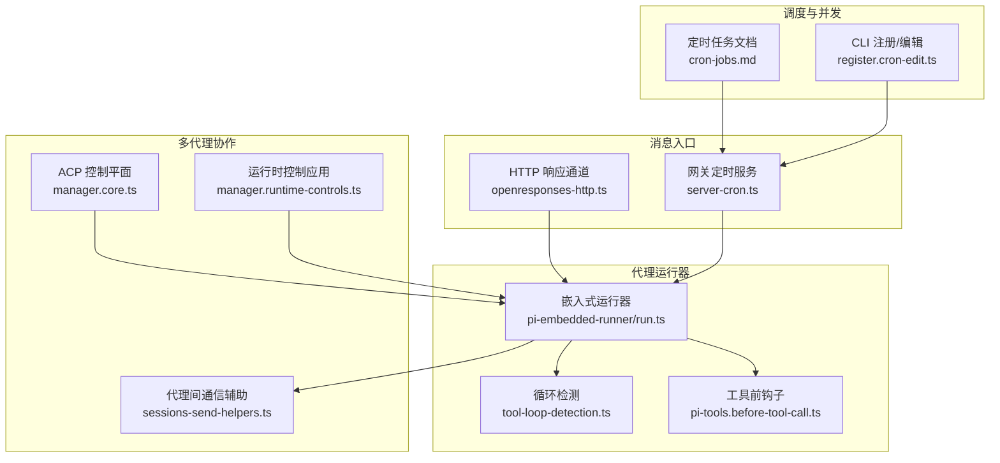
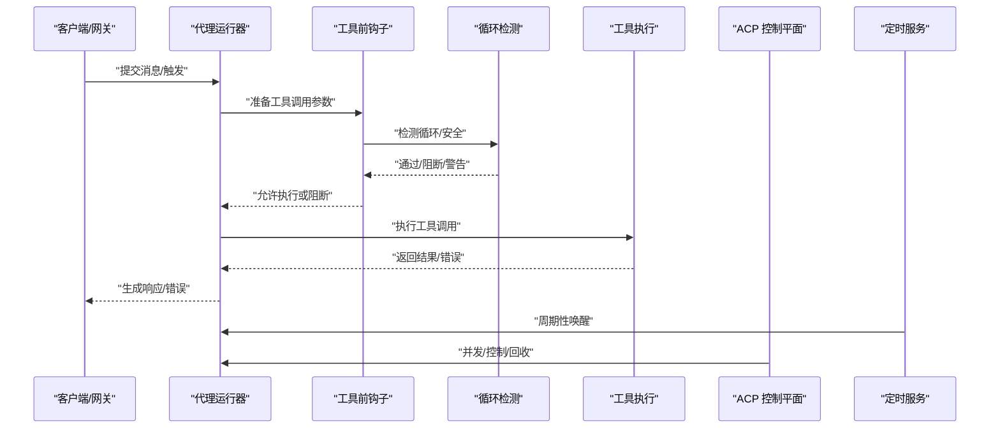
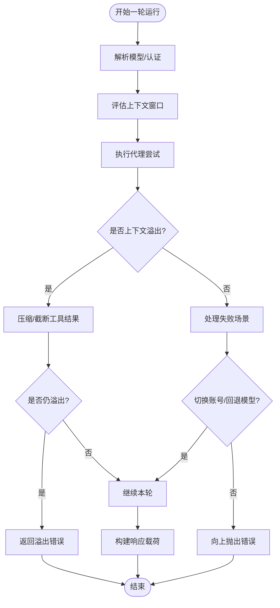
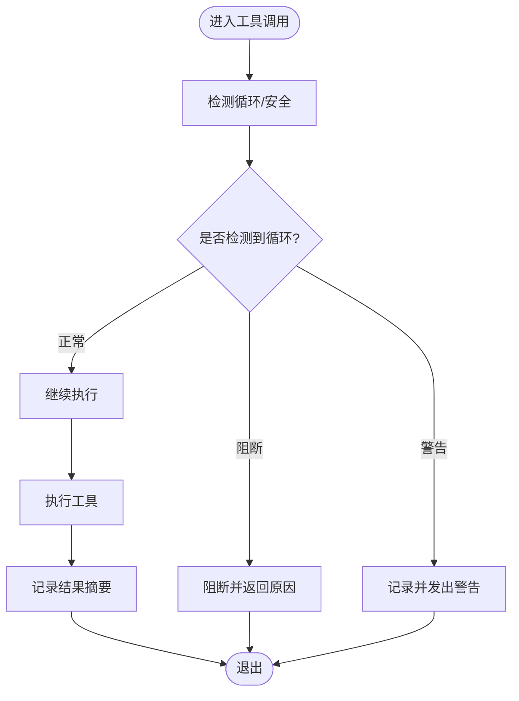
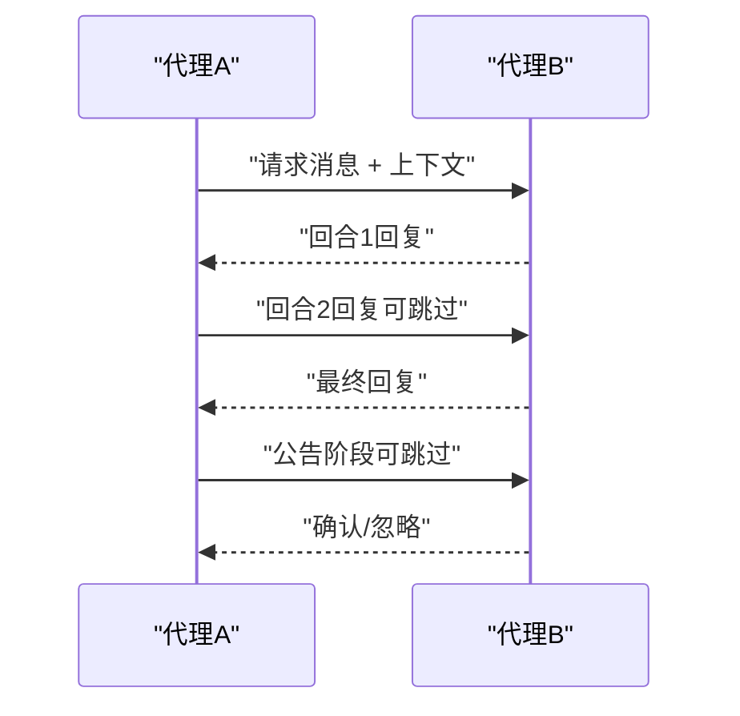
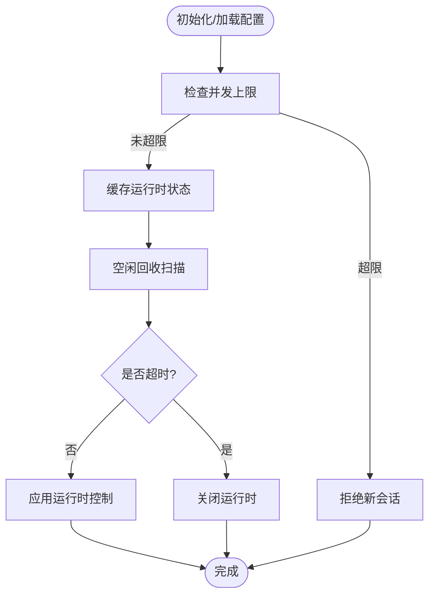
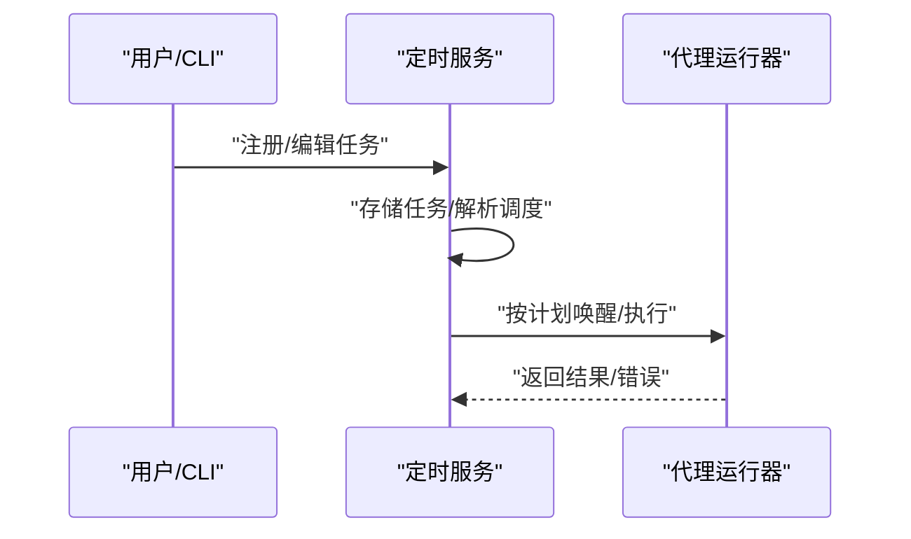
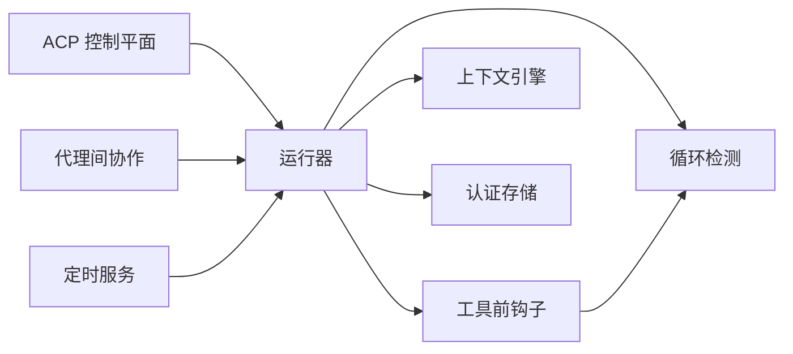

# 代理循环机制

<cite>
**本文档引用的文件**
- [src/agents/tool-loop-detection.ts](file://src/agents/tool-loop-detection.ts)
- [src/agents/pi-tools.before-tool-call.ts](file://src/agents/pi-tools.before-tool-call.ts)
- [src/agents/pi-embedded-runner/run.ts](file://src/agents/pi-embedded-runner/run.ts)
- [src/agents/tools/sessions-send-helpers.ts](file://src/agents/tools/sessions-send-helpers.ts)
- [src/gateway/openresponses-http.ts](file://src/gateway/openresponses-http.ts)
- [src/acp/control-plane/manager.core.ts](file://src/acp/control-plane/manager.core.ts)
- [src/acp/control-plane/manager.runtime-controls.ts](file://src/acp/control-plane/manager.runtime-controls.ts)
- [src/gateway/server-cron.ts](file://src/gateway/server-cron.ts)
- [docs/zh-CN/automation/cron-jobs.md](file://docs/zh-CN/automation/cron-jobs.md)
- [src/cli/cron-cli/register.cron-edit.ts](file://src/cli/cron-cli/register.cron-edit.ts)
</cite>

## 目录
1. [引言](#引言)
2. [项目结构](#项目结构)
3. [核心组件](#核心组件)
4. [架构总览](#架构总览)
5. [详细组件分析](#详细组件分析)
6. [依赖关系分析](#依赖关系分析)
7. [性能考量](#性能考量)
8. [故障排查指南](#故障排查指南)
9. [结论](#结论)
10. [附录](#附录)

## 引言
本文件系统化阐述代理循环机制的设计与实现，覆盖消息接收、处理、工具调用、响应生成的完整流程；多代理调度策略、并发控制与资源分配；代理间协作模式、消息传递与状态同步；以及循环优化策略、性能监控与错误处理机制。目标是帮助开发者快速理解并优化代理循环性能，构建稳定高效的自动化代理系统。

## 项目结构
本项目围绕“代理运行器”“工具钩子”“循环检测”“多代理协作”“调度与并发控制”等模块组织，形成从消息入口到工具执行再到响应输出的闭环。

图示来源
- [src/gateway/openresponses-http.ts:234-263](file://src/gateway/openresponses-http.ts#L234-L263)
- [src/gateway/server-cron.ts:144-166](file://src/gateway/server-cron.ts#L144-L166)
- [src/agents/pi-embedded-runner/run.ts:265-385](file://src/agents/pi-embedded-runner/run.ts#L265-L385)
- [src/agents/tool-loop-detection.ts:372-495](file://src/agents/tool-loop-detection.ts#L372-L495)
- [src/agents/pi-tools.before-tool-call.ts:91-194](file://src/agents/pi-tools.before-tool-call.ts#L91-L194)
- [src/agents/tools/sessions-send-helpers.ts:91-163](file://src/agents/tools/sessions-send-helpers.ts#L91-L163)
- [src/acp/control-plane/manager.core.ts:1070-1086](file://src/acp/control-plane/manager.core.ts#L1070-L1086)
- [src/acp/control-plane/manager.runtime-controls.ts:44-118](file://src/acp/control-plane/manager.runtime-controls.ts#L44-L118)
- [docs/zh-CN/automation/cron-jobs.md:76-304](file://docs/zh-CN/automation/cron-jobs.md#L76-L304)
- [src/cli/cron-cli/register.cron-edit.ts:1-24](file://src/cli/cron-cli/register.cron-edit.ts#L1-L24)

章节来源
- [src/gateway/openresponses-http.ts:234-263](file://src/gateway/openresponses-http.ts#L234-L263)
- [src/gateway/server-cron.ts:144-166](file://src/gateway/server-cron.ts#L144-L166)
- [src/agents/pi-embedded-runner/run.ts:265-385](file://src/agents/pi-embedded-runner/run.ts#L265-L385)
- [src/agents/tool-loop-detection.ts:372-495](file://src/agents/tool-loop-detection.ts#L372-L495)
- [src/agents/pi-tools.before-tool-call.ts:91-194](file://src/agents/pi-tools.before-tool-call.ts#L91-L194)
- [src/agents/tools/sessions-send-helpers.ts:91-163](file://src/agents/tools/sessions-send-helpers.ts#L91-L163)
- [src/acp/control-plane/manager.core.ts:1070-1086](file://src/acp/control-plane/manager.core.ts#L1070-L1086)
- [src/acp/control-plane/manager.runtime-controls.ts:44-118](file://src/acp/control-plane/manager.runtime-controls.ts#L44-L118)
- [docs/zh-CN/automation/cron-jobs.md:76-304](file://docs/zh-CN/automation/cron-jobs.md#L76-L304)
- [src/cli/cron-cli/register.cron-edit.ts:1-24](file://src/cli/cron-cli/register.cron-edit.ts#L1-L24)

## 核心组件
- 代理运行器：负责模型解析、认证、上下文窗口评估、失败回退、溢出压缩与结果构建，贯穿整个循环。
- 工具前钩子：在工具调用前进行循环检测与安全校验，支持插件钩子扩展。
- 循环检测：识别重复调用、无进展轮询、代理间来回对话等模式，防止资源浪费。
- 多代理协作：提供代理间消息上下文、回合限制与公告/回复流程。
- ACP 控制平面：会话级并发限制、空闲回收、运行时控制应用。
- 定时调度：网关侧定时任务服务与 CLI 编辑能力，支撑周期性触发代理轮次。

章节来源
- [src/agents/pi-embedded-runner/run.ts:265-385](file://src/agents/pi-embedded-runner/run.ts#L265-L385)
- [src/agents/pi-tools.before-tool-call.ts:91-194](file://src/agents/pi-tools.before-tool-call.ts#L91-L194)
- [src/agents/tool-loop-detection.ts:372-495](file://src/agents/tool-loop-detection.ts#L372-L495)
- [src/agents/tools/sessions-send-helpers.ts:91-163](file://src/agents/tools/sessions-send-helpers.ts#L91-L163)
- [src/acp/control-plane/manager.core.ts:1070-1086](file://src/acp/control-plane/manager.core.ts#L1070-L1086)
- [src/acp/control-plane/manager.runtime-controls.ts:44-118](file://src/acp/control-plane/manager.runtime-controls.ts#L44-L118)
- [src/gateway/server-cron.ts:144-166](file://src/gateway/server-cron.ts#L144-L166)

## 架构总览
代理循环以“消息入口 → 运行器 → 工具执行 → 结果输出”的主干流程为核心，辅以循环检测、并发控制、多代理协作与定时调度，形成高可用、可扩展的自动化代理体系。

图示来源
- [src/gateway/openresponses-http.ts:234-263](file://src/gateway/openresponses-http.ts#L234-L263)
- [src/agents/pi-embedded-runner/run.ts:885-1599](file://src/agents/pi-embedded-runner/run.ts#L885-L1599)
- [src/agents/pi-tools.before-tool-call.ts:91-194](file://src/agents/pi-tools.before-tool-call.ts#L91-L194)
- [src/agents/tool-loop-detection.ts:372-495](file://src/agents/tool-loop-detection.ts#L372-L495)
- [src/acp/control-plane/manager.core.ts:1070-1086](file://src/acp/control-plane/manager.core.ts#L1070-L1086)
- [src/gateway/server-cron.ts:144-166](file://src/gateway/server-cron.ts#L144-L166)

## 详细组件分析

### 代理运行器（嵌入式）
- 职责：解析模型与认证、评估上下文窗口、执行单轮代理、处理失败回退与溢出恢复、构建最终响应。
- 关键点：
  - 外层循环迭代次数上限与失败回退策略，避免无限重试。
  - 上下文溢出时的自动压缩与工具结果截断，保障会话继续。
  - 使用用量累加器与最后一次调用用量，准确反映上下文占用。
  - 失败原因分类与认证/速率限制/账单/超载等场景的差异化处理。

图示来源
- [src/agents/pi-embedded-runner/run.ts:885-1599](file://src/agents/pi-embedded-runner/run.ts#L885-L1599)

章节来源
- [src/agents/pi-embedded-runner/run.ts:265-385](file://src/agents/pi-embedded-runner/run.ts#L265-L385)
- [src/agents/pi-embedded-runner/run.ts:885-1599](file://src/agents/pi-embedded-runner/run.ts#L885-L1599)

### 工具前钩子与循环检测
- 职责：在工具调用前进行循环检测与安全校验，支持插件钩子扩展，记录调用历史与结果，发出警告或阻断。
- 关键点：
  - 支持通用重复、已知轮询无进展、代理间来回对话等多种检测器。
  - 提供阈值配置与桶化告警，避免噪声。
  - 记录工具调用签名与结果摘要，用于识别无进展重复。

图示来源
- [src/agents/pi-tools.before-tool-call.ts:91-194](file://src/agents/pi-tools.before-tool-call.ts#L91-L194)
- [src/agents/tool-loop-detection.ts:372-495](file://src/agents/tool-loop-detection.ts#L372-L495)

章节来源
- [src/agents/pi-tools.before-tool-call.ts:91-194](file://src/agents/pi-tools.before-tool-call.ts#L91-L194)
- [src/agents/tool-loop-detection.ts:372-495](file://src/agents/tool-loop-detection.ts#L372-L495)

### 多代理协作与消息传递
- 职责：在代理间建立消息上下文，定义回合限制与跳过令牌，支持公告阶段与回复阶段的协同。
- 关键点：
  - 代理间消息上下文包含双方会话键与频道信息。
  - 回合上限与跳过令牌用于避免无限 ping-pong。
  - 支持从会话键解析公告目标，适配不同平台的频道/群组标识。

图示来源
- [src/agents/tools/sessions-send-helpers.ts:91-163](file://src/agents/tools/sessions-send-helpers.ts#L91-L163)

章节来源
- [src/agents/tools/sessions-send-helpers.ts:91-163](file://src/agents/tools/sessions-send-helpers.ts#L91-L163)

### ACP 控制平面与并发控制
- 职责：限制并发会话数量、空闲回收、应用运行时控制（如模式切换、配置选项），确保系统稳定性。
- 关键点：
  - 会话并发上限与按演员键缓存，避免资源争用。
  - 空闲 TTL 管理，定期清理长时间未活动的运行时。
  - 运行时控制签名一致性，避免重复应用相同控制。

图示来源
- [src/acp/control-plane/manager.core.ts:1070-1086](file://src/acp/control-plane/manager.core.ts#L1070-L1086)
- [src/acp/control-plane/manager.core.ts:1120-1148](file://src/acp/control-plane/manager.core.ts#L1120-L1148)
- [src/acp/control-plane/manager.runtime-controls.ts:44-118](file://src/acp/control-plane/manager.runtime-controls.ts#L44-L118)

章节来源
- [src/acp/control-plane/manager.core.ts:1070-1086](file://src/acp/control-plane/manager.core.ts#L1070-L1086)
- [src/acp/control-plane/manager.core.ts:1120-1148](file://src/acp/control-plane/manager.core.ts#L1120-L1148)
- [src/acp/control-plane/manager.runtime-controls.ts:44-118](file://src/acp/control-plane/manager.runtime-controls.ts#L44-L118)

### 定时调度与触发
- 职责：网关侧定时任务服务与 CLI 编辑能力，支持一次性与周期性任务，绑定会话目标与负载类型。
- 关键点：
  - 任务存储与运行历史管理。
  - 会话目标选择：主会话、隔离会话、当前会话、命名会话。
  - CLI 注册/编辑参数与调度表达式解析。

图示来源
- [src/gateway/server-cron.ts:144-166](file://src/gateway/server-cron.ts#L144-L166)
- [docs/zh-CN/automation/cron-jobs.md:76-304](file://docs/zh-CN/automation/cron-jobs.md#L76-L304)
- [src/cli/cron-cli/register.cron-edit.ts:1-24](file://src/cli/cron-cli/register.cron-edit.ts#L1-L24)

章节来源
- [src/gateway/server-cron.ts:144-166](file://src/gateway/server-cron.ts#L144-L166)
- [docs/zh-CN/automation/cron-jobs.md:76-304](file://docs/zh-CN/automation/cron-jobs.md#L76-L304)
- [src/cli/cron-cli/register.cron-edit.ts:1-24](file://src/cli/cron-cli/register.cron-edit.ts#L1-L24)

## 依赖关系分析
- 运行器依赖：模型解析、认证存储、上下文引擎、失败回退策略、用量统计。
- 钩子与检测：共享诊断会话状态，记录调用历史，触发循环阻断或警告。
- 协作与控制：多代理上下文与回合限制依赖配置；ACP 控制平面依赖运行时接口与能力声明。
- 调度：定时服务依赖网关 RPC 与 CLI 工具链。

图示来源
- [src/agents/pi-embedded-runner/run.ts:265-385](file://src/agents/pi-embedded-runner/run.ts#L265-L385)
- [src/agents/tool-loop-detection.ts:372-495](file://src/agents/tool-loop-detection.ts#L372-L495)
- [src/agents/pi-tools.before-tool-call.ts:91-194](file://src/agents/pi-tools.before-tool-call.ts#L91-L194)
- [src/acp/control-plane/manager.core.ts:1070-1086](file://src/acp/control-plane/manager.core.ts#L1070-L1086)
- [src/agents/tools/sessions-send-helpers.ts:91-163](file://src/agents/tools/sessions-send-helpers.ts#L91-L163)
- [src/gateway/server-cron.ts:144-166](file://src/gateway/server-cron.ts#L144-L166)

章节来源
- [src/agents/pi-embedded-runner/run.ts:265-385](file://src/agents/pi-embedded-runner/run.ts#L265-L385)
- [src/agents/tool-loop-detection.ts:372-495](file://src/agents/tool-loop-detection.ts#L372-L495)
- [src/agents/pi-tools.before-tool-call.ts:91-194](file://src/agents/pi-tools.before-tool-call.ts#L91-L194)
- [src/acp/control-plane/manager.core.ts:1070-1086](file://src/acp/control-plane/manager.core.ts#L1070-L1086)
- [src/agents/tools/sessions-send-helpers.ts:91-163](file://src/agents/tools/sessions-send-helpers.ts#L91-L163)
- [src/gateway/server-cron.ts:144-166](file://src/gateway/server-cron.ts#L144-L166)

## 性能考量
- 循环检测阈值与桶化告警：避免频繁警告与误报，提升可观测性。
- 上下文溢出恢复：自动压缩与工具结果截断减少重试成本，提高吞吐。
- 失败回退与过载退避：指数退避与延迟重试降低系统压力，增强稳定性。
- 并发控制与空闲回收：限制同时会话数量，定期清理空闲运行时，释放资源。
- 定时调度并发：合理设置最大并发运行数，避免资源争用。

章节来源
- [src/agents/tool-loop-detection.ts:372-495](file://src/agents/tool-loop-detection.ts#L372-L495)
- [src/agents/pi-embedded-runner/run.ts:885-1599](file://src/agents/pi-embedded-runner/run.ts#L885-L1599)
- [src/acp/control-plane/manager.core.ts:1070-1086](file://src/acp/control-plane/manager.core.ts#L1070-L1086)
- [docs/zh-CN/automation/cron-jobs.md:294-304](file://docs/zh-CN/automation/cron-jobs.md#L294-L304)

## 故障排查指南
- 上下文溢出：检查模型上下文窗口、压缩策略与工具结果大小；必要时使用更大上下文模型。
- 循环阻断：根据循环检测日志定位重复调用模式，调整阈值或修改工具逻辑。
- 认证/速率限制/账单/超载：查看失败原因分类，切换认证配置或等待冷却；必要时启用回退模型。
- 代理间无限 ping-pong：检查回合上限与跳过令牌配置，确保公告/回复阶段有明确终止条件。
- 并发超限：调整 ACP 最大并发会话数或空闲 TTL，观察资源使用情况。
- 定时任务异常：核对任务存储路径、调度表达式与会话目标，查看运行历史日志。

章节来源
- [src/agents/tool-loop-detection.ts:372-495](file://src/agents/tool-loop-detection.ts#L372-L495)
- [src/agents/pi-embedded-runner/run.ts:1268-1292](file://src/agents/pi-embedded-runner/run.ts#L1268-L1292)
- [src/agents/tools/sessions-send-helpers.ts:155-163](file://src/agents/tools/sessions-send-helpers.ts#L155-L163)
- [src/acp/control-plane/manager.core.ts:1070-1086](file://src/acp/control-plane/manager.core.ts#L1070-L1086)
- [docs/zh-CN/automation/cron-jobs.md:288-304](file://docs/zh-CN/automation/cron-jobs.md#L288-L304)

## 结论
代理循环机制通过“运行器 + 钩子 + 检测 + 协作 + 控制 + 调度”的组合，实现了高可靠、可扩展、可观测的自动化代理系统。开发者可通过合理配置阈值、并发与回退策略，结合循环检测与溢出恢复，持续优化代理性能与稳定性。

## 附录
- 配置要点建议
  - 循环检测：开启检测器、设置合理阈值与历史窗口。
  - 运行器：启用自动压缩与工具结果截断，配置失败回退策略。
  - ACP：设置最大并发会话数与空闲 TTL，确保及时回收。
  - 定时任务：限制最大并发运行数，明确会话目标与负载类型。
- 调试方法
  - 启用详细日志与诊断会话状态，跟踪工具调用历史与结果摘要。
  - 使用 CLI 编辑任务，验证调度表达式与会话绑定。
  - 观察运行历史与错误分类，定位失败根因并调整策略。

章节来源
- [src/agents/tool-loop-detection.ts:372-495](file://src/agents/tool-loop-detection.ts#L372-L495)
- [src/agents/pi-embedded-runner/run.ts:885-1599](file://src/agents/pi-embedded-runner/run.ts#L885-L1599)
- [src/acp/control-plane/manager.core.ts:1070-1086](file://src/acp/control-plane/manager.core.ts#L1070-L1086)
- [docs/zh-CN/automation/cron-jobs.md:294-304](file://docs/zh-CN/automation/cron-jobs.md#L294-L304)
- [src/cli/cron-cli/register.cron-edit.ts:1-24](file://src/cli/cron-cli/register.cron-edit.ts#L1-L24)