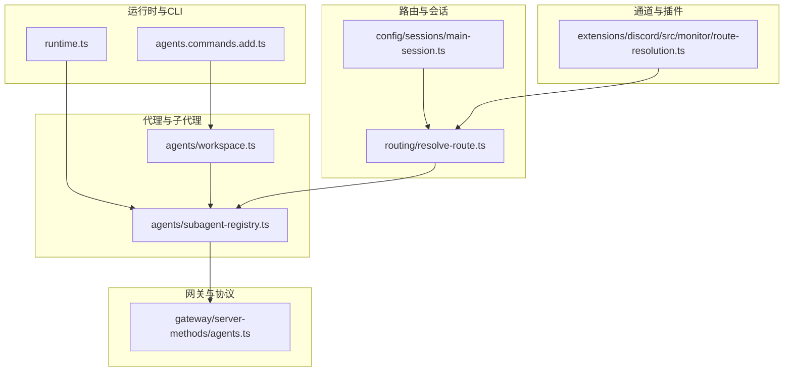
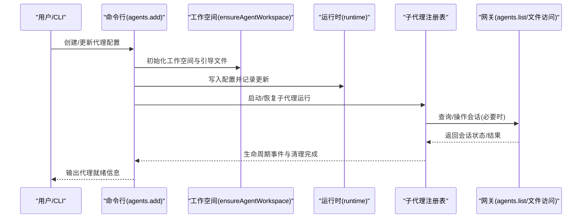
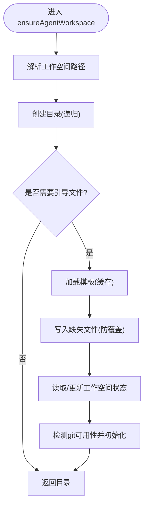
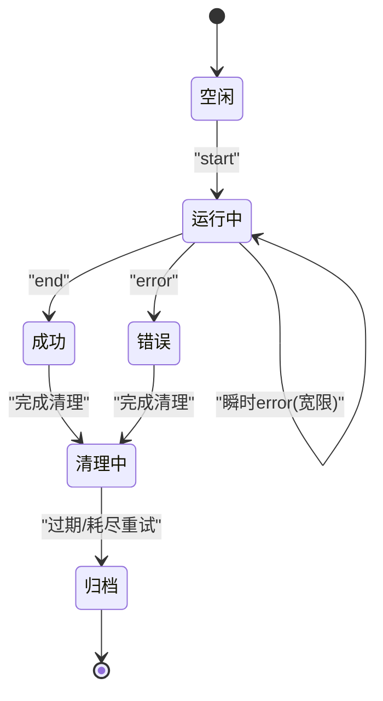
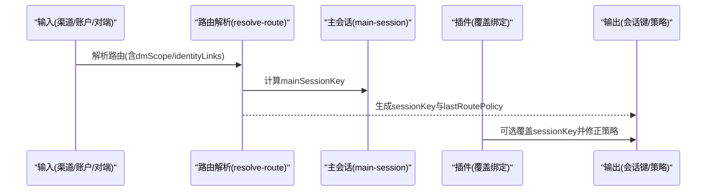
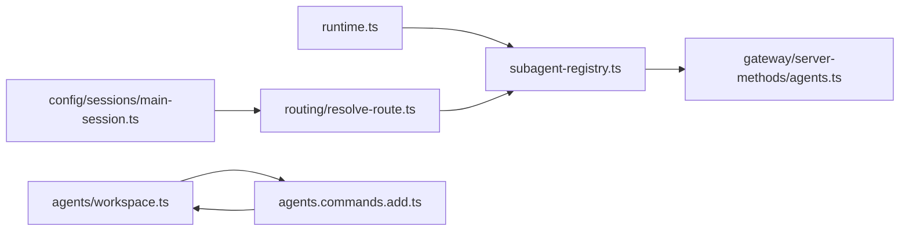

# 代理系统

<cite>
**本文引用的文件**
- [src/agents/workspace.ts](file://src/agents/workspace.ts)
- [src/runtime.ts](file://src/runtime.ts)
- [src/agents/subagent-registry.ts](file://src/agents/subagent-registry.ts)
- [src/routing/resolve-route.ts](file://src/routing/resolve-route.ts)
- [src/routing/resolve-route.test.ts](file://src/routing/resolve-route.test.ts)
- [extensions/discord/src/monitor/route-resolution.ts](file://extensions/discord/src/monitor/route-resolution.ts)
- [src/gateway/server-methods/agents.ts](file://src/gateway/server-methods/agents.ts)
- [src/commands/agents.commands.add.ts](file://src/commands/agents.commands.add.ts)
- [src/config/sessions/main-session.ts](file://src/config/sessions/main-session.ts)
- [src/channels/run-state-machine.test.ts](file://src/channels/run-state-machine.test.ts)
- [src/agents/subagent-registry.lifecycle-retry-grace.e2e.test.ts](file://src/agents/subagent-registry.lifecycle-retry-grace.e2e.test.ts)
</cite>

## 目录
1. [引言](#引言)
2. [项目结构](#项目结构)
3. [核心组件](#核心组件)
4. [架构总览](#架构总览)
5. [详细组件分析](#详细组件分析)
6. [依赖关系分析](#依赖关系分析)
7. [性能考量](#性能考量)
8. [故障排查指南](#故障排查指南)
9. [结论](#结论)
10. [附录](#附录)

## 引言
本文件面向希望理解与扩展 Pi Agent 运行时的开发者，系统性阐述以下主题：
- 代理运行时与代理循环机制
- 代理工作空间管理与引导流程
- 多代理路由策略与会话隔离
- 代理生命周期管理与状态同步
- 代理配置、工具调用协调与会话隔离
- 代理间通信模式、资源共享策略与性能优化
- 代理开发指南与最佳实践

## 项目结构
OpenClaw 采用模块化分层组织：运行时与 CLI 层、路由与会话层、代理与子代理注册层、网关与协议层、插件与通道层等。代理系统的关键实现集中在 agents、routing、config、gateway 等目录。

**图表来源**
- [src/runtime.ts:1-54](file://src/runtime.ts#L1-L54)
- [src/commands/agents.commands.add.ts:308-369](file://src/commands/agents.commands.add.ts#L308-L369)
- [src/routing/resolve-route.ts:658-692](file://src/routing/resolve-route.ts#L658-L692)
- [src/config/sessions/main-session.ts:11-38](file://src/config/sessions/main-session.ts#L11-L38)
- [src/agents/workspace.ts:327-465](file://src/agents/workspace.ts#L327-L465)
- [src/agents/subagent-registry.ts:1-800](file://src/agents/subagent-registry.ts#L1-L800)
- [src/gateway/server-methods/agents.ts:458-470](file://src/gateway/server-methods/agents.ts#L458-L470)
- [extensions/discord/src/monitor/route-resolution.ts:80-100](file://extensions/discord/src/monitor/route-resolution.ts#L80-L100)

**章节来源**
- [src/runtime.ts:1-54](file://src/runtime.ts#L1-L54)
- [src/commands/agents.commands.add.ts:308-369](file://src/commands/agents.commands.add.ts#L308-L369)
- [src/routing/resolve-route.ts:658-692](file://src/routing/resolve-route.ts#L658-L692)
- [src/config/sessions/main-session.ts:11-38](file://src/config/sessions/main-session.ts#L11-L38)
- [src/agents/workspace.ts:327-465](file://src/agents/workspace.ts#L327-L465)
- [src/agents/subagent-registry.ts:1-800](file://src/agents/subagent-registry.ts#L1-L800)
- [src/gateway/server-methods/agents.ts:458-470](file://src/gateway/server-methods/agents.ts#L458-L470)
- [extensions/discord/src/monitor/route-resolution.ts:80-100](file://extensions/discord/src/monitor/route-resolution.ts#L80-L100)

## 核心组件
- 运行时环境与日志输出：提供统一的日志与退出接口，支持测试场景下的行为控制。
- 工作空间与引导：负责默认工作空间路径解析、模板加载、边界安全读取、缓存与 Git 初始化。
- 子代理注册表：维护子代理运行记录、生命周期事件监听、清理与回收、公告重试与过期处理。
- 路由与会话键：根据渠道、账户、身份链接与直接消息作用域生成稳定的会话键，并决定“主会话”或“会话级”路由策略。
- 网关服务端方法：提供代理列表、工作区文件访问等能力，确保请求参数校验与错误响应格式一致。
- CLI 命令：新增代理、绑定路由、写入配置与工作空间初始化。

**章节来源**
- [src/runtime.ts:1-54](file://src/runtime.ts#L1-L54)
- [src/agents/workspace.ts:12-648](file://src/agents/workspace.ts#L12-L648)
- [src/agents/subagent-registry.ts:1-800](file://src/agents/subagent-registry.ts#L1-L800)
- [src/routing/resolve-route.ts:658-692](file://src/routing/resolve-route.ts#L658-L692)
- [src/gateway/server-methods/agents.ts:458-470](file://src/gateway/server-methods/agents.ts#L458-L470)
- [src/commands/agents.commands.add.ts:308-369](file://src/commands/agents.commands.add.ts#L308-L369)

## 架构总览
下图展示从输入到代理执行、会话隔离、生命周期管理与状态同步的整体流程。

**图表来源**
- [src/commands/agents.commands.add.ts:308-369](file://src/commands/agents.commands.add.ts#L308-L369)
- [src/agents/workspace.ts:327-465](file://src/agents/workspace.ts#L327-L465)
- [src/runtime.ts:1-54](file://src/runtime.ts#L1-L54)
- [src/agents/subagent-registry.ts:1-800](file://src/agents/subagent-registry.ts#L1-L800)
- [src/gateway/server-methods/agents.ts:458-470](file://src/gateway/server-methods/agents.ts#L458-L470)

## 详细组件分析

### 代理工作空间管理
- 默认工作空间路径与多配置文件模板：支持按环境变量选择不同配置档案，内置默认文件名集合（如 AGENTS.md、SOUL.md、TOOLS.md 等）。
- 边界安全读取与内容缓存：通过边界文件打开与 inode/dev/大小/修改时间组合的身份标识避免缓存污染。
- 模板加载与缺失文件写入：首次创建时写入模板文件，同时维护工作空间设置状态文件，支持 Git 初始化。
- 最小化引导白名单：在子代理或定时任务会话中仅加载必要的引导文件，减少上下文噪声。

**图表来源**
- [src/agents/workspace.ts:327-465](file://src/agents/workspace.ts#L327-L465)

**章节来源**
- [src/agents/workspace.ts:12-648](file://src/agents/workspace.ts#L12-L648)

### 代理运行时与日志
- 统一日志与错误输出：在测试环境中可选择性抑制日志以避免干扰；退出时恢复终端状态。
- 非退出式运行时：用于测试或嵌入式场景，避免进程退出。

**章节来源**
- [src/runtime.ts:1-54](file://src/runtime.ts#L1-L54)

### 代理循环机制与生命周期管理
- 生命周期事件监听：订阅“lifecycle”流事件，区分 start/end/error 三阶段，记录开始/结束时间与错误。
- 延迟错误清理与宽限期：对模型/提供商重试中的瞬时 error 事件延迟清理，等待后续 start/end 事件来撤销误判。
- 完成态冻结结果与回补：在完成后捕获子代理完成回复文本，限制最大字节数并截断提示，支持后续会话刷新。
- 清理与回收：完成清理后触发公告流程；超时或重试耗尽后放弃；定期清扫器按配置归档过期运行记录。

**图表来源**
- [src/agents/subagent-registry.ts:765-820](file://src/agents/subagent-registry.ts#L765-L820)

**章节来源**
- [src/agents/subagent-registry.ts:1-800](file://src/agents/subagent-registry.ts#L1-L800)
- [src/channels/run-state-machine.test.ts:1-42](file://src/channels/run-state-machine.test.ts#L1-L42)
- [src/agents/subagent-registry.lifecycle-retry-grace.e2e.test.ts:1-50](file://src/agents/subagent-registry.lifecycle-retry-grace.e2e.test.ts#L1-L50)

### 多代理路由策略与会话隔离
- 会话键构建：基于 agentId、channel、accountId、peer（含直接消息）、dmScope、identityLinks 生成稳定键。
- 主会话与会话级策略：当 inbound 的 lastRoutePolicy 为 main 且 sessionKey 正好是 mainSessionKey，则使用 main；否则使用 inbound 的 sessionKey。
- 通道绑定生效：插件侧可覆盖路由，强制使用绑定的会话键并推导 lastRoutePolicy。
- 测试验证：覆盖 per-peer、per-channel-peer 的直接消息作用域与 identityLinks 的映射。

**图表来源**
- [src/routing/resolve-route.ts:658-692](file://src/routing/resolve-route.ts#L658-L692)
- [src/config/sessions/main-session.ts:11-38](file://src/config/sessions/main-session.ts#L11-L38)
- [extensions/discord/src/monitor/route-resolution.ts:80-100](file://extensions/discord/src/monitor/route-resolution.ts#L80-L100)
- [src/routing/resolve-route.test.ts:36-128](file://src/routing/resolve-route.test.ts#L36-L128)

**章节来源**
- [src/routing/resolve-route.ts:658-692](file://src/routing/resolve-route.ts#L658-L692)
- [src/config/sessions/main-session.ts:11-38](file://src/config/sessions/main-session.ts#L11-L38)
- [extensions/discord/src/monitor/route-resolution.ts:80-100](file://extensions/discord/src/monitor/route-resolution.ts#L80-L100)
- [src/routing/resolve-route.test.ts:36-128](file://src/routing/resolve-route.test.ts#L36-L128)

### 代理配置、工具调用协调与会话隔离
- CLI 新增代理：交互式确认是否绑定路由，应用绑定并写入配置；随后确保工作空间与会话存在。
- 工作区文件访问：网关侧提供 agents.list 等方法，参数校验失败返回统一错误码；支持工作区文件存在性与安全性检查。
- 会话隔离：通过会话键隔离不同渠道/账户/对端的对话上下文；在子代理/定时任务场景下仅加载最小引导集，避免上下文污染。

**章节来源**
- [src/commands/agents.commands.add.ts:308-369](file://src/commands/agents.commands.add.ts#L308-L369)
- [src/gateway/server-methods/agents.ts:458-470](file://src/gateway/server-methods/agents.ts#L458-L470)
- [src/agents/workspace.ts:557-565](file://src/agents/workspace.ts#L557-L565)

### 代理间通信模式与资源共享
- 公告与清理：子代理结束后通过公告流程向请求者汇报结果；若需等待后代完成，设置硬性超时上限。
- 资源共享：通过会话键与主会话键实现跨通道的统一入口；在全局作用域下可共享主会话。
- 重试与过期：对未送达的公告进行指数退避重试，超过最大次数或过期后放弃；定期清扫器清理过期记录。

**章节来源**
- [src/agents/subagent-registry.ts:117-133](file://src/agents/subagent-registry.ts#L117-L133)
- [src/agents/subagent-registry.ts:708-763](file://src/agents/subagent-registry.ts#L708-L763)
- [src/config/sessions/main-session.ts:11-28](file://src/config/sessions/main-session.ts#L11-L28)

## 依赖关系分析
- 运行时依赖：子代理注册表依赖运行时日志接口与退出行为。
- 路由依赖：子代理注册表依赖路由解析与会话存储，以定位 child/requester 会话。
- 工作空间依赖：CLI 命令依赖工作空间初始化与模板加载。
- 网关依赖：子代理注册表与 CLI 在需要时调用网关方法查询/删除会话。

**图表来源**
- [src/runtime.ts:1-54](file://src/runtime.ts#L1-L54)
- [src/agents/subagent-registry.ts:1-800](file://src/agents/subagent-registry.ts#L1-L800)
- [src/routing/resolve-route.ts:658-692](file://src/routing/resolve-route.ts#L658-L692)
- [src/config/sessions/main-session.ts:11-38](file://src/config/sessions/main-session.ts#L11-L38)
- [src/agents/workspace.ts:327-465](file://src/agents/workspace.ts#L327-L465)
- [src/commands/agents.commands.add.ts:308-369](file://src/commands/agents.commands.add.ts#L308-L369)
- [src/gateway/server-methods/agents.ts:458-470](file://src/gateway/server-methods/agents.ts#L458-L470)

**章节来源**
- [src/runtime.ts:1-54](file://src/runtime.ts#L1-L54)
- [src/agents/subagent-registry.ts:1-800](file://src/agents/subagent-registry.ts#L1-L800)
- [src/routing/resolve-route.ts:658-692](file://src/routing/resolve-route.ts#L658-L692)
- [src/config/sessions/main-session.ts:11-38](file://src/config/sessions/main-session.ts#L11-L38)
- [src/agents/workspace.ts:327-465](file://src/agents/workspace.ts#L327-L465)
- [src/commands/agents.commands.add.ts:308-369](file://src/commands/agents.commands.add.ts#L308-L369)
- [src/gateway/server-methods/agents.ts:458-470](file://src/gateway/server-methods/agents.ts#L458-L470)

## 性能考量
- 缓存与I/O
  - 工作区文件缓存：基于 inode/dev/大小/修改时间组合的身份标识避免重复读取与缓存污染。
  - 模板加载缓存：模板内容按名称缓存，减少磁盘IO。
  - 会话管理缓存：可配置 TTL，预热常用会话文件，降低频繁访问开销。
- 路由与会话
  - 路由解析缓存：命中阈值控制，避免无限增长。
  - 最小引导集：在子代理/定时任务场景仅加载必要文件，降低上下文体积。
- 生命周期与清理
  - 指数退避重试：限制最大重试次数与最长等待时间，防止资源泄露。
  - 定期清扫：按分钟粒度扫描过期运行记录，及时释放资源。
- 日志与终端
  - 运行时日志抑制：测试场景下可关闭日志输出，减少I/O干扰。

**章节来源**
- [src/agents/workspace.ts:42-88](file://src/agents/workspace.ts#L42-L88)
- [src/agents/workspace.ts:104-130](file://src/agents/workspace.ts#L104-L130)
- [src/agents/workspace.ts:38-46](file://src/agents/workspace.ts#L38-L46)
- [src/routing/resolve-route.ts:684-692](file://src/routing/resolve-route.ts#L684-L692)
- [src/agents/workspace.ts:557-565](file://src/agents/workspace.ts#L557-L565)
- [src/agents/subagent-registry.ts:117-133](file://src/agents/subagent-registry.ts#L117-L133)
- [src/agents/subagent-registry.ts:708-763](file://src/agents/subagent-registry.ts#L708-L763)
- [src/runtime.ts:10-19](file://src/runtime.ts#L10-L19)

## 故障排查指南
- 工作区文件读取失败
  - 检查边界安全读取与缓存一致性；确认文件路径与根目录边界。
  - 查看模板加载异常与缺失文件写入失败原因。
- 路由解析异常
  - 校验 dmScope、identityLinks 与绑定覆盖是否正确；核对会话键生成规则。
  - 使用测试用例复现 per-peer/per-channel-peer 场景。
- 生命周期事件未达预期
  - 关注瞬时 error 的宽限期逻辑；确认是否被后续 start/end 抑制或触发清理。
  - 检查公告重试计数与过期时间，避免“放弃”导致的静默失败。
- 清扫与回收问题
  - 确认 archiveAfterMinutes 配置与定期清扫器启动条件。
  - 若会话未删除，检查 sessions.delete 请求与异常吞没。

**章节来源**
- [src/agents/workspace.ts:56-88](file://src/agents/workspace.ts#L56-L88)
- [src/routing/resolve-route.test.ts:36-128](file://src/routing/resolve-route.test.ts#L36-L128)
- [src/agents/subagent-registry.ts:279-313](file://src/agents/subagent-registry.ts#L279-L313)
- [src/agents/subagent-registry.ts:606-658](file://src/agents/subagent-registry.ts#L606-L658)
- [src/agents/subagent-registry.ts:726-763](file://src/agents/subagent-registry.ts#L726-L763)

## 结论
本系统通过“工作空间模板 + 边界安全读取 + 路由会话键 + 生命周期事件 + 清理与清扫”的组合，实现了高可靠、可扩展的多代理运行时。开发者可在保证会话隔离与资源可控的前提下，灵活扩展路由策略、生命周期钩子与公告机制，以满足复杂业务场景。

## 附录

### 开发者指南与最佳实践
- 工作空间
  - 使用模板初始化引导文件，避免手动维护；启用 Git 以便审计与回滚。
  - 在子代理/定时任务场景仅加载最小引导集，减少上下文噪声。
- 路由与会话
  - 明确 dmScope 与 identityLinks 的作用域边界；必要时通过插件覆盖绑定会话键。
  - 对 inbound 的 lastRoutePolicy 保持清晰的“主会话/会话级”决策。
- 生命周期
  - 对瞬时 error 事件使用宽限期策略，避免误判；确保 end/error 事件能正确触发清理。
  - 控制公告重试次数与超时，防止资源泄漏。
- 性能
  - 启用工作区文件与模板缓存；合理设置会话管理缓存 TTL。
  - 使用定期清扫器清理过期运行记录，保持系统整洁。
- 安全
  - 严格使用边界安全读取；对额外引导文件进行 basename 白名单校验。
  - 对网关请求参数进行严格校验，返回一致的错误格式。