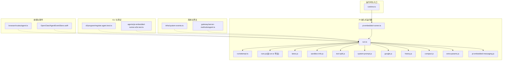
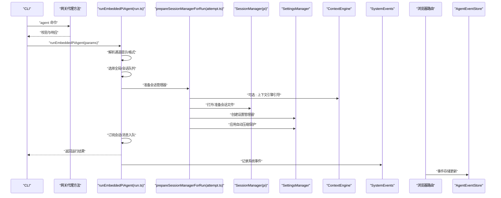
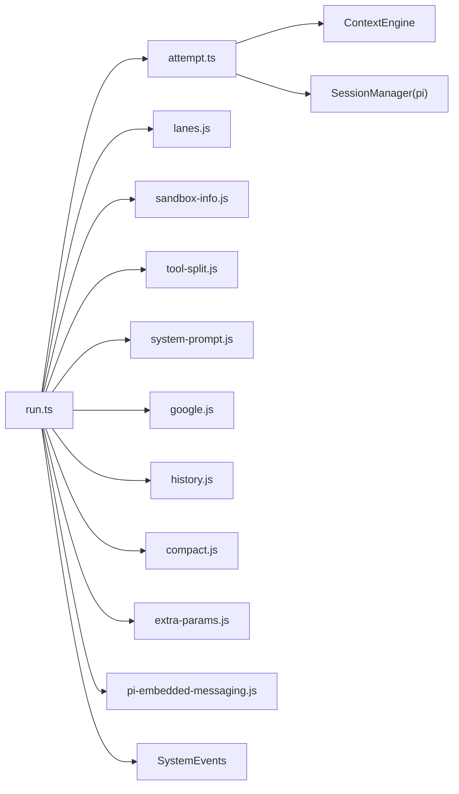

# 代理运行时

<cite>
**本文引用的文件**
- [runtime.ts](file://src/runtime.ts)
- [pi-embedded-runner.ts](file://src/agents/pi-embedded-runner.ts)
- [run.ts](file://src/agents/pi-embedded-runner/run.ts)
- [attempt.ts](file://src/agents/pi-embedded-runner/run/attempt.ts)
- [attempt.spawn-workspace.test.ts](file://src/agents/pi-embedded-runner/run/attempt.spawn-workspace.test.ts)
- [pi-embedded.ts](file://src/agents/pi-embedded.ts)
- [system-events.ts](file://src/infra/system-events.ts)
- [agent.ts](file://src/gateway/server-methods/agent.ts)
- [agent.test.ts](file://src/gateway/server-methods/agent.test.ts)
- [register.agent.test.ts](file://src/cli/program/register.agent.test.ts)
- [pi.md](file://docs/pi.md)
- [pi-embedded-runner.e2e.test.ts](file://src/agents/pi-embedded-runner.e2e.test.ts)
- [lanes.js](file://src/agents/pi-embedded-runner/lanes.js)
- [sandbox-info.js](file://src/agents/pi-embedded-runner/sandbox-info.js)
- [tool-split.js](file://src/agents/pi-embedded-runner/tool-split.js)
- [system-prompt.js](file://src/agents/pi-embedded-runner/system-prompt.js)
- [google.js](file://src/agents/pi-embedded-runner/google.js)
- [history.js](file://src/agents/pi-embedded-runner/history.js)
- [compact.js](file://src/agents/pi-embedded-runner/compact.js)
- [extra-params.js](file://src/agents/pi-embedded-runner/extra-params.js)
- [pi-embedded-messaging.js](file://src/agents/pi-embedded-messaging.js)
- [policy.ts](file://src/acp/policy.ts)
- [agent.ts](file://src/browser/routes/agent.ts)
- [AgentEventStore.swift](file://apps/macos/Sources/OpenClaw/AgentEventStore.swift)
</cite>

## 目录
1. [引言](#引言)
2. [项目结构](#项目结构)
3. [核心组件](#核心组件)
4. [架构总览](#架构总览)
5. [详细组件分析](#详细组件分析)
6. [依赖关系分析](#依赖关系分析)
7. [性能考虑](#性能考虑)
8. [故障排查指南](#故障排查指南)
9. [结论](#结论)
10. [附录](#附录)

## 引言
本文件系统性阐述 Pi Agent 运行时在 OpenClaw 中的实现与使用方式，重点覆盖以下方面：
- pi-mono 集成机制：如何通过 SessionManager 打开/写入会话、如何桥接外部资源加载与扩展。
- 嵌入式代理执行环境：工作区准备、会话管理器初始化、设置与压缩策略。
- 会话管理策略：历史轮次限制、沙箱信息构建、工具拆分与系统提示覆盖。
- 代理生命周期管理：运行队列、并发控制、消息入队与等待结束。
- 状态同步与事件处理：系统事件队列、浏览器端事件存储。
- 代理与工具系统的交互：工具结果格式协商、工具拆分与调用。
- 配置选项、性能优化与故障恢复：上下文引擎引导、自动压缩保护、Google 轮次排序修复、历史轮次裁剪。
- 开发示例与调试技巧：端到端测试工作区、探针会话、日志与退出行为。

## 项目结构
围绕代理运行时的关键目录与文件：
- 运行时入口与通用运行环境：src/runtime.ts
- Pi 嵌入式运行器聚合导出：src/agents/pi-embedded-runner.ts
- 运行主流程与尝试逻辑：src/agents/pi-embedded-runner/run.ts、run/attempt.ts
- 运行生命周期与并发队列：src/agents/pi-embedded-runner/runs.js（由 run.ts 导出）
- 会话与工作区：lanes.js、sandbox-info.js、tool-split.js、system-prompt.js、google.js、history.js、compact.js、extra-params.js
- 消息工具接口：pi-embedded-messaging.js
- 系统事件基础设施：src/infra/system-events.ts
- 网关侧代理方法与测试：src/gateway/server-methods/agent.ts、agent.test.ts
- CLI 注册与测试：src/cli/program/register.agent.test.ts
- 文档与未来考虑：docs/pi.md
- 端到端测试工作区：src/agents/pi-embedded-runner.e2e.test.ts
- 浏览器路由与事件存储：src/browser/routes/agent.ts、apps/macos/Sources/OpenClaw/AgentEventStore.swift

图表来源
- [runtime.ts:1-54](file://src/runtime.ts#L1-L54)
- [pi-embedded-runner.ts:1-29](file://src/agents/pi-embedded-runner.ts#L1-L29)
- [run.ts:265-282](file://src/agents/pi-embedded-runner/run.ts#L265-L282)
- [attempt.ts:1752-1780](file://src/agents/pi-embedded-runner/run/attempt.ts#L1752-L1780)
- [system-events.ts:99-119](file://src/infra/system-events.ts#L99-L119)
- [agent.ts:254-269](file://src/gateway/server-methods/agent.ts#L254-L269)
- [register.agent.test.ts:47-74](file://src/cli/program/register.agent.test.ts#L47-L74)
- [pi-embedded-runner.e2e.test.ts:94-129](file://src/agents/pi-embedded-runner.e2e.test.ts#L94-L129)
- [agent.ts:1-13](file://src/browser/routes/agent.ts#L1-L13)
- [AgentEventStore.swift:1-22](file://apps/macos/Sources/OpenClaw/AgentEventStore.swift#L1-L22)

章节来源
- [runtime.ts:1-54](file://src/runtime.ts#L1-L54)
- [pi-embedded-runner.ts:1-29](file://src/agents/pi-embedded-runner.ts#L1-L29)

## 核心组件
- 运行时环境与日志输出：提供统一的日志/错误输出与进程退出封装，支持测试场景下的非退出运行器。
- Pi 嵌入式运行器聚合导出：集中导出运行、生命周期、会话与工具相关能力。
- 运行主流程：解析通道提示以决定工具结果格式，选择全局或会话级队列，处理探针会话等。
- 尝试执行：准备上下文引擎引导、会话管理器、设置管理器与自动压缩保护。
- 会话与工作区：会话车道解析、沙箱信息构建、工具拆分、系统提示覆盖、Google 轮次排序修复、历史轮次限制与压缩。
- 系统事件：提供会话键对应的事件队列读取、窥视与重置能力。
- 网关代理方法：校验代理 ID、构造响应与错误码。
- CLI 注册：注册代理命令，支持详细输出与 JSON 输出。
- 端到端测试：创建测试工作区、生成会话文件、模拟孤儿用户消息等。

章节来源
- [runtime.ts:21-54](file://src/runtime.ts#L21-L54)
- [pi-embedded-runner.ts:5-29](file://src/agents/pi-embedded-runner.ts#L5-L29)
- [run.ts:265-282](file://src/agents/pi-embedded-runner/run.ts#L265-L282)
- [attempt.ts:1752-1780](file://src/agents/pi-embedded-runner/run/attempt.ts#L1752-L1780)
- [lanes.js](file://src/agents/pi-embedded-runner/lanes.js)
- [sandbox-info.js](file://src/agents/pi-embedded-runner/sandbox-info.js)
- [tool-split.js](file://src/agents/pi-embedded-runner/tool-split.js)
- [system-prompt.js](file://src/agents/pi-embedded-runner/system-prompt.js)
- [google.js](file://src/agents/pi-embedded-runner/google.js)
- [history.js](file://src/agents/pi-embedded-runner/history.js)
- [compact.js](file://src/agents/pi-embedded-runner/compact.js)
- [extra-params.js](file://src/agents/pi-embedded-runner/extra-params.js)
- [pi-embedded-messaging.js](file://src/agents/pi-embedded-messaging.js)
- [system-events.ts:99-119](file://src/infra/system-events.ts#L99-L119)
- [agent.ts:254-269](file://src/gateway/server-methods/agent.ts#L254-L269)
- [register.agent.test.ts:47-74](file://src/cli/program/register.agent.test.ts#L47-L74)
- [pi-embedded-runner.e2e.test.ts:94-129](file://src/agents/pi-embedded-runner.e2e.test.ts#L94-L129)

## 架构总览
下图展示从运行请求到会话写入与工具调用的整体流程，以及与系统事件、网关与 CLI 的交互点。

图表来源
- [run.ts:265-282](file://src/agents/pi-embedded-runner/run.ts#L265-L282)
- [attempt.ts:1752-1780](file://src/agents/pi-embedded-runner/run/attempt.ts#L1752-L1780)
- [system-events.ts:99-119](file://src/infra/system-events.ts#L99-L119)
- [agent.ts:254-269](file://src/gateway/server-methods/agent.ts#L254-L269)
- [agent.ts:1-13](file://src/browser/routes/agent.ts#L1-L13)
- [AgentEventStore.swift:1-22](file://apps/macos/Sources/OpenClaw/AgentEventStore.swift#L1-L22)

## 详细组件分析

### 运行时环境与日志
- 统一日志/错误输出：在测试环境下根据环境变量与模拟状态决定是否输出，避免噪声。
- 退出行为：默认运行器在 exit 时恢复终端状态；非退出运行器用于测试捕获异常。
- 用途：为运行器提供一致的 IO 行为，便于调试与集成。

章节来源
- [runtime.ts:10-54](file://src/runtime.ts#L10-L54)

### Pi 嵌入式运行器聚合导出
- 聚合导出：运行、生命周期、会话、工具、设置、系统提示、历史与压缩等能力。
- 作用：对外暴露统一 API，隐藏内部模块细节，便于上层调用。

章节来源
- [pi-embedded-runner.ts:1-29](file://src/agents/pi-embedded-runner.ts#L1-L29)

### 运行主流程：runEmbeddedPiAgent
- 会话车道解析：基于 sessionKey 或 sessionId 决定 lane。
- 全局/会话队列：根据 lane 选择 enqueue 策略。
- 工具结果格式：依据消息通道能力选择 markdown 或 plain。
- 探针会话：以特定前缀识别探针会话，便于隔离与测试。
- 并发与排队：通过队列确保同一 lane 内串行化，避免竞态。

章节来源
- [run.ts:265-282](file://src/agents/pi-embedded-runner/run.ts#L265-L282)

### 尝试执行：prepareSessionManagerForRun
- 上下文引擎引导：若存在 bootstrap，则在有会话文件时进行引导。
- 会话管理器准备：传入 sessionFile、sessionId、cwd 等参数完成初始化。
- 设置管理器：结合工作区与配置创建设置管理器。
- 自动压缩保护：结合上下文引擎信息应用压缩保护策略。

章节来源
- [attempt.ts:1752-1780](file://src/agents/pi-embedded-runner/run/attempt.ts#L1752-L1780)

### 会话与工作区：车道、沙箱、工具拆分与系统提示
- 车道解析：resolveEmbeddedSessionLane 基于 sessionKey/ID 解析 lane，保证同会话串行。
- 沙箱信息：构建沙箱上下文信息，供运行期使用。
- 工具拆分：splitSdkTools 将 SDK 工具与普通工具分离，便于策略控制。
- 系统提示覆盖：createSystemPromptOverride 提供系统提示定制能力。
- Google 轮次修复：applyGoogleTurnOrderingFix 处理特定提供商的轮次顺序问题。
- 历史轮次限制：limitHistoryTurns 与 getHistoryLimitFromSessionKey 控制历史长度。
- 压缩：compactEmbeddedPiSession 在合适时机触发压缩，减少存储与计算开销。
- 额外参数：applyExtraParamsToAgent/resolveExtraParams 支持运行期参数注入。

章节来源
- [lanes.js](file://src/agents/pi-embedded-runner/lanes.js)
- [sandbox-info.js](file://src/agents/pi-embedded-runner/sandbox-info.js)
- [tool-split.js](file://src/agents/pi-embedded-runner/tool-split.js)
- [system-prompt.js](file://src/agents/pi-embedded-runner/system-prompt.js)
- [google.js](file://src/agents/pi-embedded-runner/google.js)
- [history.js](file://src/agents/pi-embedded-runner/history.js)
- [compact.js](file://src/agents/pi-embedded-runner/compact.js)
- [extra-params.js](file://src/agents/pi-embedded-runner/extra-params.js)

### 生命周期与并发：runs.js（由 run.ts 导出）
- 运行状态：isEmbeddedPiRunActive/isEmbeddedPiRunStreaming 查询运行状态。
- 消息入队：queueEmbeddedPiMessage 将消息加入运行队列。
- 结束等待：waitForEmbeddedPiRunEnd 等待运行结束。
- 中止：abortEmbeddedPiRun 中止当前运行。

章节来源
- [run.ts:265-282](file://src/agents/pi-embedded-runner/run.ts#L265-L282)

### 系统事件与前端事件
- 系统事件：drainSystemEvents/peekSystemEvents/hasSystemEvents 提供会话键事件队列的读取与检查。
- 浏览器端事件存储：AgentEventStore.swift 维护事件列表并限制最大数量，便于 UI 展示。

章节来源
- [system-events.ts:99-119](file://src/infra/system-events.ts#L99-L119)
- [AgentEventStore.swift:1-22](file://apps/macos/Sources/OpenClaw/AgentEventStore.swift#L1-L22)

### 网关代理方法与 CLI 集成
- 网关校验：校验 agentId 是否存在于已知代理列表，未知则返回 INVALID_REQUEST 错误。
- CLI 注册：注册 agent 子命令，支持 --verbose 与 --json 输出，便于调试。

章节来源
- [agent.ts:254-269](file://src/gateway/server-methods/agent.ts#L254-L269)
- [register.agent.test.ts:47-74](file://src/cli/program/register.agent.test.ts#L47-L74)

### 端到端测试与探针会话
- 测试工作区：创建临时工作区与会话文件，模拟真实运行环境。
- 探针会话：以特定前缀标识，便于隔离测试与诊断。
- 孤儿消息：向会话追加孤儿用户消息，验证会话完整性与处理路径。

章节来源
- [pi-embedded-runner.e2e.test.ts:94-129](file://src/agents/pi-embedded-runner.e2e.test.ts#L94-L129)

### 消息工具接口
- MessagingToolSend：定义消息发送工具接口，便于在运行时与消息通道交互。

章节来源
- [pi-embedded-messaging.js](file://src/agents/pi-embedded-messaging.js)

### ACP 策略与安全
- ACP 策略：resolveAcpDispatchPolicyError 与 resolveAcpAgentPolicyError 提供调度与代理允许性检查，防止未授权访问。

章节来源
- [policy.ts:41-70](file://src/acp/policy.ts#L41-L70)

## 依赖关系分析
- 运行器对 SessionManager 的依赖：通过 open 与 appendMessage 等操作完成会话读写。
- 对 ContextEngine 的依赖：在尝试阶段进行可选引导，影响后续设置与压缩策略。
- 对工具系统的依赖：工具拆分、系统提示覆盖与轮次修复均影响工具调用链路。
- 对系统事件的依赖：运行器在关键节点记录事件，前端消费事件进行可视化。

图表来源
- [run.ts:265-282](file://src/agents/pi-embedded-runner/run.ts#L265-L282)
- [attempt.ts:1752-1780](file://src/agents/pi-embedded-runner/run/attempt.ts#L1752-L1780)
- [system-events.ts:99-119](file://src/infra/system-events.ts#L99-L119)

章节来源
- [run.ts:265-282](file://src/agents/pi-embedded-runner/run.ts#L265-L282)
- [attempt.ts:1752-1780](file://src/agents/pi-embedded-runner/run/attempt.ts#L1752-L1780)

## 性能考虑
- 历史轮次限制：通过 limitHistoryTurns 与 getHistoryLimitFromSessionKey 控制上下文大小，降低推理成本。
- 自动压缩：在合适时机触发压缩，减少存储占用与加载时间。
- 工具拆分：将 SDK 工具与普通工具分离，便于策略优化与缓存。
- 轮次修复：针对特定提供商的轮次顺序问题进行修复，减少无效重试。
- 并发控制：通过 lane 与队列确保串行化，避免资源争用导致的抖动。

章节来源
- [history.js](file://src/agents/pi-embedded-runner/history.js)
- [compact.js](file://src/agents/pi-embedded-runner/compact.js)
- [tool-split.js](file://src/agents/pi-embedded-runner/tool-split.js)
- [google.js](file://src/agents/pi-embedded-runner/google.js)
- [run.ts:265-282](file://src/agents/pi-embedded-runner/run.ts#L265-L282)

## 故障排查指南
- 会话文件异常：确认 sessionFile 是否存在且可写，尝试阶段会进行引导与准备。
- 工具结果格式不匹配：根据消息通道能力选择 markdown 或 plain，避免渲染错误。
- 探针会话干扰：注意以 probe- 前缀的会话仅用于测试，避免与正式会话混淆。
- 事件堆积：使用 drainSystemEvents/peekSystemEvents 检查事件队列，必要时清理。
- 网关代理校验失败：确认 agentId 是否在已知代理列表中，避免 INVALID_REQUEST。
- CLI 调试：启用 --verbose 与 --json 输出，定位参数与响应差异。

章节来源
- [attempt.ts:1752-1780](file://src/agents/pi-embedded-runner/run/attempt.ts#L1752-L1780)
- [run.ts:265-282](file://src/agents/pi-embedded-runner/run.ts#L265-L282)
- [system-events.ts:99-119](file://src/infra/system-events.ts#L99-L119)
- [agent.ts:254-269](file://src/gateway/server-methods/agent.ts#L254-L269)
- [register.agent.test.ts:47-74](file://src/cli/program/register.agent.test.ts#L47-L74)

## 结论
OpenClaw 的 Pi Agent 运行时通过“运行器 + 会话管理 + 工具策略 + 事件系统”的组合，实现了稳定、可控且可扩展的嵌入式代理执行环境。其关键优势在于：
- 明确的生命周期与并发控制，保障运行一致性；
- 可插拔的工具与系统提示策略，适配多提供商与多通道；
- 完善的事件与前端集成，便于可观测与调试；
- 面向生产的性能优化与故障恢复机制，降低运维成本。

## 附录

### 代理配置选项与最佳实践
- 工具结果格式：依据通道能力自动选择 markdown/plain，确保消息渲染正确。
- 历史轮次限制：按会话键动态调整历史长度，平衡上下文质量与性能。
- 自动压缩：在长时间运行后触发压缩，减少存储与加载压力。
- 探针会话：使用特定前缀隔离测试，避免污染正式数据。
- 日志与退出：生产环境使用默认运行器，测试环境可切换为非退出运行器以便捕获异常。

章节来源
- [run.ts:265-282](file://src/agents/pi-embedded-runner/run.ts#L265-L282)
- [history.js](file://src/agents/pi-embedded-runner/history.js)
- [compact.js](file://src/agents/pi-embedded-runner/compact.js)
- [runtime.ts:37-54](file://src/runtime.ts#L37-L54)

### 开发示例与调试技巧
- 端到端测试：参考 e2e 测试工作区创建与孤儿消息追加，验证会话完整性。
- 探针会话：以 probe- 前缀标识，便于隔离与快速回归。
- 事件监控：通过系统事件队列与前端事件存储双通道观察运行状态。
- CLI 调试：开启 --verbose 与 --json，结合网关代理方法的校验逻辑定位问题。

章节来源
- [pi-embedded-runner.e2e.test.ts:94-129](file://src/agents/pi-embedded-runner.e2e.test.ts#L94-L129)
- [system-events.ts:99-119](file://src/infra/system-events.ts#L99-L119)
- [AgentEventStore.swift:1-22](file://apps/macos/Sources/OpenClaw/AgentEventStore.swift#L1-L22)
- [register.agent.test.ts:47-74](file://src/cli/program/register.agent.test.ts#L47-L74)