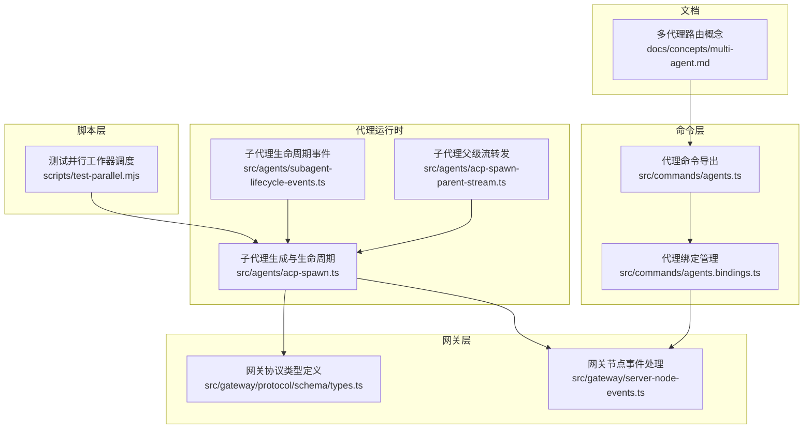
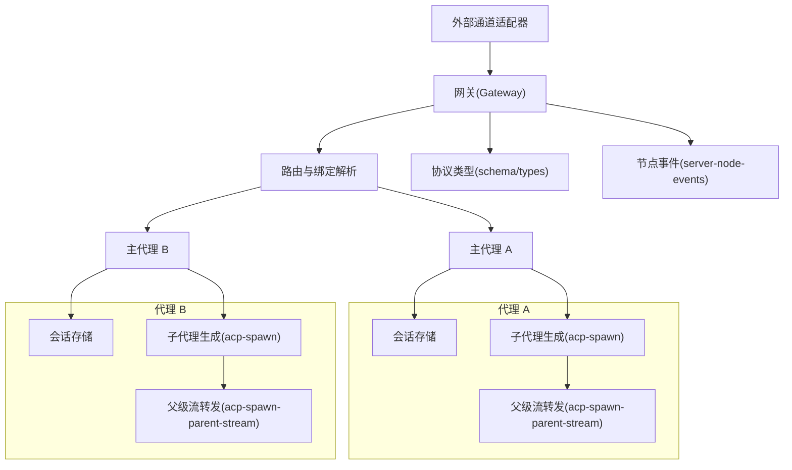
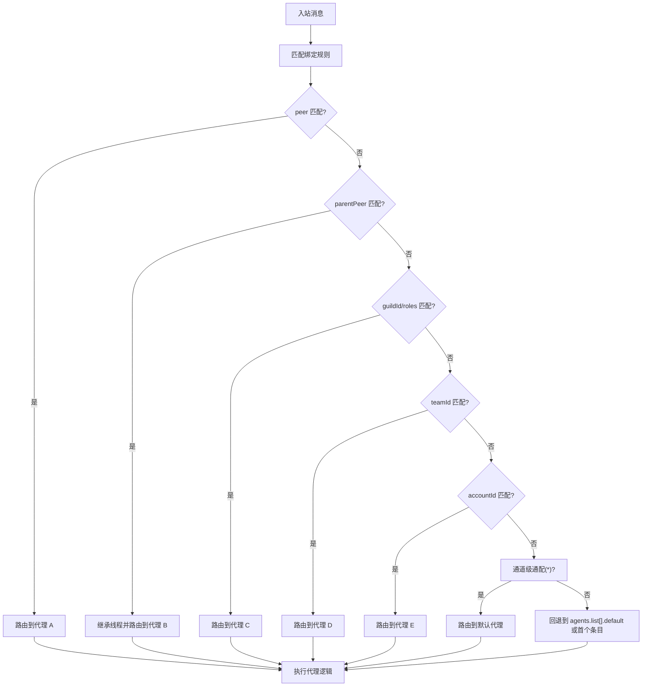
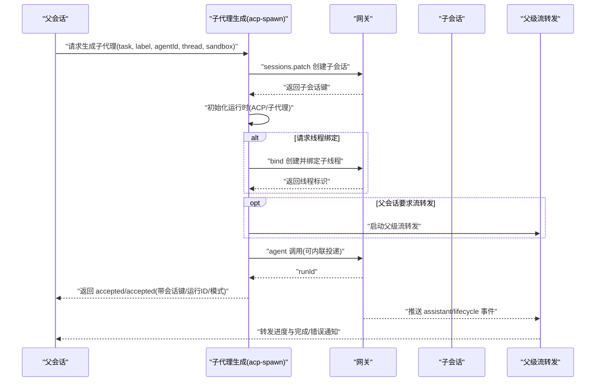
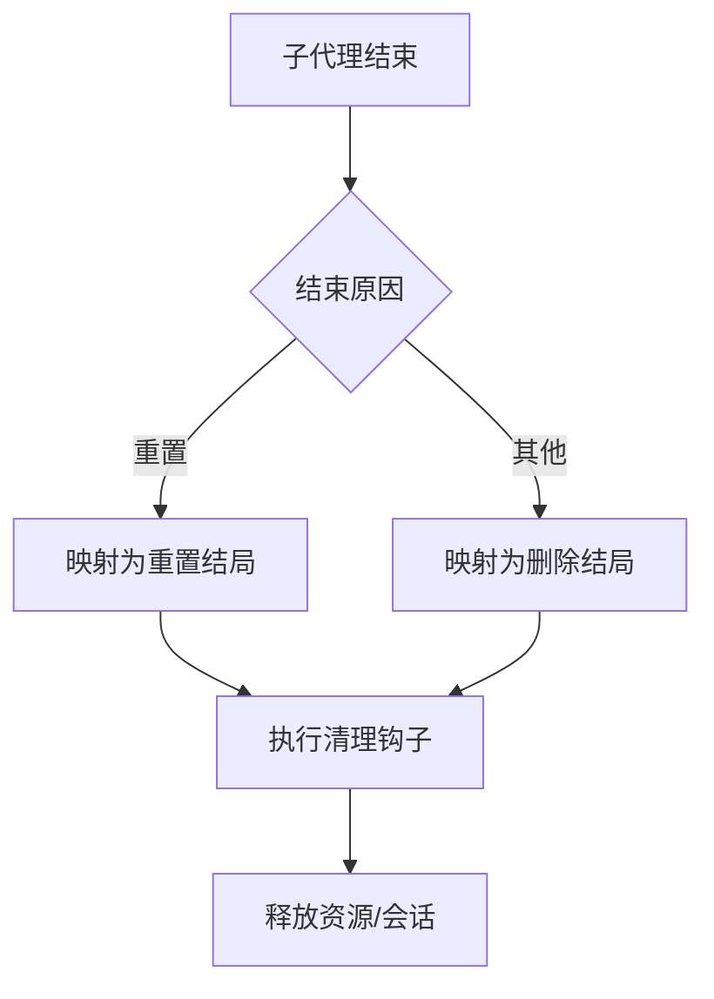
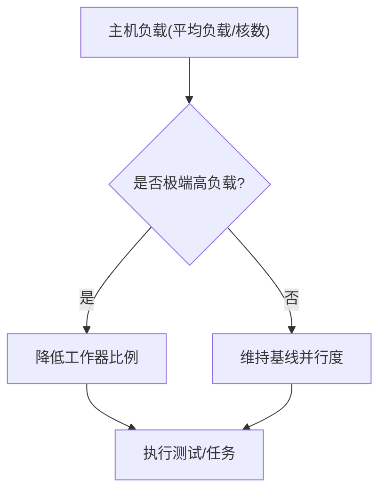
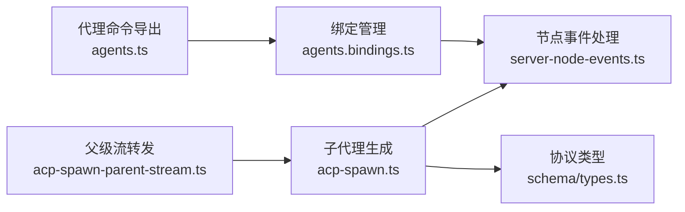

# 多代理系统

<cite>
**本文引用的文件**
- [多代理路由概念](file://docs/concepts/multi-agent.md)
- [代理命令导出](file://src/commands/agents.ts)
- [代理绑定管理](file://src/commands/agents.bindings.ts)
- [子代理生命周期事件](file://src/agents/subagent-lifecycle-events.ts)
- [子代理生成与生命周期](file://src/agents/acp-spawn.ts)
- [子代理父级流转发](file://src/agents/acp-spawn-parent-stream.ts)
- [网关协议类型定义](file://src/gateway/protocol/schema/types.ts)
- [网关节点事件处理](file://src/gateway/server-node-events.ts)
- [测试并行工作器调度](file://scripts/test-parallel.mjs)
</cite>

## 目录
1. [简介](#简介)
2. [项目结构](#项目结构)
3. [核心组件](#核心组件)
4. [架构总览](#架构总览)
5. [详细组件分析](#详细组件分析)
6. [依赖关系分析](#依赖关系分析)
7. [性能考量](#性能考量)
8. [故障排查指南](#故障排查指南)
9. [结论](#结论)
10. [附录](#附录)

## 简介
本文件面向希望构建“多代理系统”的开发者，系统性阐述该系统的多代理架构设计理念与实现机制，覆盖以下主题：
- 主代理与子代理的关系、代理树结构与层级管理
- 代理分发策略、负载均衡与资源隔离
- 代理间通信协议、消息传递与状态同步
- 代理生命周期管理、动态创建与销毁
- 多代理配置示例与性能优化建议

目标是帮助你在同一网关进程中安全、可控地运行多个“完全隔离”的代理实例，并通过绑定规则实现入站消息的确定性路由。

## 项目结构
围绕多代理能力，仓库中与之直接相关的关键模块包括：
- 文档层：多代理路由与绑定规则说明
- 命令层：代理增删查、绑定管理
- 代理运行时：子代理生成、生命周期事件、会话绑定与线程化
- 网关层：协议类型、节点事件、消息投递与回执
- 脚本层：测试并行度与资源压力下的工作器分配策略

**图表来源**
- [多代理路由概念:1-553](file://docs/concepts/multi-agent.md#L1-L553)
- [代理命令导出:1-7](file://src/commands/agents.ts#L1-L7)
- [代理绑定管理:161-175](file://src/commands/agents.bindings.ts#L161-L175)
- [子代理生成与生命周期:1-763](file://src/agents/acp-spawn.ts#L1-L763)
- [子代理父级流转发:1-379](file://src/agents/acp-spawn-parent-stream.ts#L1-L379)
- [子代理生命周期事件:32-47](file://src/agents/subagent-lifecycle-events.ts#L32-L47)
- [网关协议类型定义:1-30](file://src/gateway/protocol/schema/types.ts#L1-L30)
- [网关节点事件处理:390-428](file://src/gateway/server-node-events.ts#L390-L428)
- [测试并行工作器调度:499-553](file://scripts/test-parallel.mjs#L499-L553)

**章节来源**
- [多代理路由概念:1-553](file://docs/concepts/multi-agent.md#L1-L553)
- [代理命令导出:1-7](file://src/commands/agents.ts#L1-L7)
- [代理绑定管理:161-175](file://src/commands/agents.bindings.ts#L161-L175)
- [子代理生成与生命周期:1-763](file://src/agents/acp-spawn.ts#L1-L763)
- [子代理父级流转发:1-379](file://src/agents/acp-spawn-parent-stream.ts#L1-L379)
- [子代理生命周期事件:32-47](file://src/agents/subagent-lifecycle-events.ts#L32-L47)
- [网关协议类型定义:1-30](file://src/gateway/protocol/schema/types.ts#L1-L30)
- [网关节点事件处理:390-428](file://src/gateway/server-node-events.ts#L390-L428)
- [测试并行工作器调度:499-553](file://scripts/test-parallel.mjs#L499-L553)

## 核心组件
- 多代理路由与绑定
  - 单一网关可托管多个“完全隔离”的代理（各自工作区、状态目录、会话存储），并通过绑定规则将入站消息路由到指定代理。
  - 绑定规则具有确定性与“最具体优先”的匹配语义，支持按 peer、guild/team、accountId、通道级别等维度进行路由。
- 子代理生成与线程化
  - 支持在会话内生成子代理（子会话），并可选择将子代理绑定到通道线程，实现“主线程+子线程”的协作模式。
  - 提供从父会话向子会话的进度流转发与生命周期事件通知。
- 生命周期与清理
  - 子代理生命周期结束时，根据结束原因映射为不同结局（成功/错误/超时/被杀/重置/删除），并触发清理流程。
- 网关协议与消息投递
  - 定义了连接参数、帧格式、事件帧、快照、状态版本、代理事件等协议类型，支撑跨进程的消息传递与状态同步。
  - 节点事件处理负责解析交付上下文、生成回执、以及缺失路由时的告警。
- 资源隔离与工具策略
  - 每个代理可独立配置沙箱与工具策略，实现细粒度的安全与资源控制；同时支持 per-agent 的身份与群组聊天策略。

**章节来源**
- [多代理路由概念:10-553](file://docs/concepts/multi-agent.md#L10-L553)
- [子代理生成与生命周期:1-763](file://src/agents/acp-spawn.ts#L1-L763)
- [子代理父级流转发:1-379](file://src/agents/acp-spawn-parent-stream.ts#L1-L379)
- [子代理生命周期事件:32-47](file://src/agents/subagent-lifecycle-events.ts#L32-L47)
- [网关协议类型定义:1-30](file://src/gateway/protocol/schema/types.ts#L1-L30)
- [网关节点事件处理:390-428](file://src/gateway/server-node-events.ts#L390-L428)

## 架构总览
下图展示多代理系统在“单一网关进程”中的交互关系：外部通道适配器将入站消息送至网关，网关依据绑定规则路由到目标代理；目标代理可生成子代理并将其绑定到线程，父会话通过流转发接收子代理的进度与生命周期事件；网关负责消息投递、回执与状态同步。

**图表来源**
- [多代理路由概念:172-186](file://docs/concepts/multi-agent.md#L172-L186)
- [子代理生成与生命周期:403-762](file://src/agents/acp-spawn.ts#L403-L762)
- [子代理父级流转发:76-373](file://src/agents/acp-spawn-parent-stream.ts#L76-L373)
- [网关协议类型定义:1-30](file://src/gateway/protocol/schema/types.ts#L1-L30)
- [网关节点事件处理:390-428](file://src/gateway/server-node-events.ts#L390-L428)

## 详细组件分析

### 组件A：多代理路由与绑定
- 设计理念
  - 将“工作区、状态目录、会话存储”三者与代理 ID 强绑定，确保每个代理的认证资料、技能与会话彼此隔离。
  - 通过绑定规则实现入站消息的确定性路由，避免跨代理会话交叉。
- 关键特性
  - 绑定匹配优先级：peer > parentPeer > guildId/roles > guildId > teamId > accountId > 通道级通配 > 默认代理。
  - 支持 per-通道的默认账户与通配绑定，便于大规模账号与群组场景。
  - 支持 per-代理的沙箱与工具策略，实现差异化安全与资源控制。
- 配置要点
  - 在 agents 列表中声明多个 agentId，并在 bindings 中为每个通道与账号设置精确匹配或通配规则。
  - 使用 channels 下的 accounts 为每个通道配置多个账号，再通过 accountId 将不同账号路由到不同代理。

**图表来源**
- [多代理路由概念:172-186](file://docs/concepts/multi-agent.md#L172-L186)

**章节来源**
- [多代理路由概念:10-553](file://docs/concepts/multi-agent.md#L10-L553)

### 组件B：子代理生成与线程化
- 设计理念
  - 子代理以“子会话”的形式在父会话内生成，可选择绑定到通道线程，形成“主线程+子线程”的协作树。
  - 对于需要长时间运行的任务，采用持久会话模式；对于一次性任务，采用一次性模式。
- 关键流程
  - 参数校验与模式推断：根据是否请求线程绑定决定默认模式（持久会话或一次性）。
  - 会话创建与元数据持久化：在网关中创建子会话并写入会话文件。
  - 线程绑定：解析通道线程策略，创建子线程并将子会话绑定到该线程。
  - 进度流转发：若父会话要求，启动父级流转发，将子代理的 assistant 流量与生命周期事件转发给父会话。
  - 错误清理：任何阶段失败均清理会话与运行时资源，避免悬挂状态。

**图表来源**
- [子代理生成与生命周期:403-762](file://src/agents/acp-spawn.ts#L403-L762)
- [子代理父级流转发:76-373](file://src/agents/acp-spawn-parent-stream.ts#L76-L373)

**章节来源**
- [子代理生成与生命周期:1-763](file://src/agents/acp-spawn.ts#L1-L763)
- [子代理父级流转发:1-379](file://src/agents/acp-spawn-parent-stream.ts#L1-L379)

### 组件C：生命周期管理与清理
- 结束原因到结局的映射
  - 会话重置 → 重置结局
  - 其他原因 → 删除结局
- 清理策略
  - 子代理结束后，触发清理钩子，删除会话或执行特定收尾动作，避免资源泄漏。
- 与工具策略的配合
  - per-agent 的工具策略与沙箱模式影响子代理的可用能力与运行边界，需在生成前进行策略校验。

**图表来源**
- [子代理生命周期事件:32-47](file://src/agents/subagent-lifecycle-events.ts#L32-L47)

**章节来源**
- [子代理生命周期事件:32-47](file://src/agents/subagent-lifecycle-events.ts#L32-L47)

### 组件D：协议与消息传递
- 协议类型
  - 定义了连接参数、握手确认、请求/响应帧、事件帧、快照、存在性条目、错误形状、状态版本、代理事件、身份参数/结果、轮询参数、等待参数、唤醒参数、节点配对参数/列表/批准/拒绝/验证、节点重命名、节点列表、节点待确认等类型，用于跨组件通信。
- 消息投递与回执
  - 节点事件处理会解析交付上下文（通道、账号、目标、线程），在需要回执时发送回执确认；当缺少必要路由信息时发出告警，避免静默失败。

```mermaid
classDiagram
class ConnectParams
class HelloOk
class RequestFrame
class ResponseFrame
class EventFrame
class GatewayFrame
class Snapshot
class PresenceEntry
class ErrorShape
class StateVersion
class AgentEvent
class AgentIdentityParams
class AgentIdentityResult
class PollParams
class AgentWaitParams
class WakeParams
class NodePairRequestParams
class NodePairListParams
class NodePairApproveParams
class NodePairRejectParams
class NodePairVerifyParams
class NodeRenameParams
class NodeListParams
class NodePendingAckParams
GatewayFrame <.. RequestFrame
GatewayFrame <.. ResponseFrame
GatewayFrame <.. EventFrame
AgentEvent --> AgentIdentityParams
AgentEvent --> AgentIdentityResult
NodePairRequestParams --> NodePairApproveParams
NodePairRequestParams --> NodePairRejectParams
NodePairRequestParams --> NodePairVerifyParams
```

**图表来源**
- [网关协议类型定义:1-30](file://src/gateway/protocol/schema/types.ts#L1-L30)

**章节来源**
- [网关协议类型定义:1-30](file://src/gateway/protocol/schema/types.ts#L1-L30)
- [网关节点事件处理:390-428](file://src/gateway/server-node-events.ts#L390-L428)

### 组件E：负载均衡与资源隔离
- 负载均衡
  - 通过“通道+账号+peer/群组/频道”的多维绑定实现入站流量的确定性分流，避免集中式队列带来的瓶颈。
- 资源隔离
  - 每个代理拥有独立的工作区、状态目录与会话存储；可为每个代理配置独立的沙箱与工具策略，限制其可执行能力与访问范围。
- 并行度与压力自适应
  - 测试脚本基于主机 CPU 数与负载比率动态调整本地工作器数量，极端高负载时降低并发，保障整体稳定性。

**图表来源**
- [测试并行工作器调度:499-553](file://scripts/test-parallel.mjs#L499-L553)

**章节来源**
- [测试并行工作器调度:499-553](file://scripts/test-parallel.mjs#L499-L553)
- [多代理路由概念:502-550](file://docs/concepts/multi-agent.md#L502-L550)

## 依赖关系分析
- 组件耦合
  - 子代理生成依赖网关的会话创建与调用接口；线程绑定依赖会话绑定服务；流转发依赖代理事件订阅。
  - 绑定规则由命令层维护，网关层负责解析与执行；协议类型为跨组件通信提供契约。
- 可能的循环依赖
  - 当前文件组织以“命令层 → 运行时 → 网关层 → 协议类型”单向依赖为主，未见明显循环。
- 外部依赖与集成点
  - 通道适配器（Discord/Telegram/WhatsApp 等）通过网关协议与网关交互；会话绑定服务负责通道线程策略与放置。

**图表来源**
- [代理绑定管理:161-175](file://src/commands/agents.bindings.ts#L161-L175)
- [网关节点事件处理:390-428](file://src/gateway/server-node-events.ts#L390-L428)
- [子代理生成与生命周期:1-763](file://src/agents/acp-spawn.ts#L1-L763)
- [网关协议类型定义:1-30](file://src/gateway/protocol/schema/types.ts#L1-L30)
- [子代理父级流转发:1-379](file://src/agents/acp-spawn-parent-stream.ts#L1-L379)
- [代理命令导出:1-7](file://src/commands/agents.ts#L1-L7)

**章节来源**
- [代理绑定管理:161-175](file://src/commands/agents.bindings.ts#L161-L175)
- [网关节点事件处理:390-428](file://src/gateway/server-node-events.ts#L390-L428)
- [子代理生成与生命周期:1-763](file://src/agents/acp-spawn.ts#L1-L763)
- [网关协议类型定义:1-30](file://src/gateway/protocol/schema/types.ts#L1-L30)
- [子代理父级流转发:1-379](file://src/agents/acp-spawn-parent-stream.ts#L1-L379)
- [代理命令导出:1-7](file://src/commands/agents.ts#L1-L7)

## 性能考量
- 绑定解析复杂度
  - 绑定匹配遵循“最具体优先”，且在同一层级按配置顺序决胜负，建议将高频命中路径的绑定置于前面，减少匹配开销。
- 子代理生成与线程绑定
  - 线程绑定涉及通道策略查询与会话绑定服务调用，应避免在热路径上频繁创建与销毁线程；对长任务使用持久会话模式。
- 流转发与日志
  - 父级流转发会累积与截断文本片段并周期性刷新，注意磁盘写入与心跳唤醒频率的平衡，避免过度 IO 与唤醒风暴。
- 资源压力下的并行度
  - 在高 CPU 负载场景，适度降低并行度可显著提升稳定性；结合内存阈值与平台差异进行自适应调节。

[本节为通用性能建议，不直接分析具体文件]

## 故障排查指南
- 绑定缺失导致的路由失败
  - 现象：消息无法投递或回执被跳过。
  - 排查：检查绑定是否完整（通道、账号、目标、线程），确认通道策略允许线程绑定与子会话放置。
  - 参考：节点事件处理在路由缺失时会记录告警。
- 子代理生成失败
  - 现象：返回 error/forbidden，可能伴随清理日志。
  - 排查：确认 ACP 策略开关、沙箱模式与运行时权限；检查线程绑定策略与通道适配器可用性。
- 进度流转发异常
  - 现象：父会话未收到子代理输出或生命周期事件。
  - 排查：确认父级流转发已注册、代理事件订阅有效、会话键与运行 ID 正确；检查磁盘写入权限与日志路径。
- 回执与投递问题
  - 现象：消息已送达但未收到回执。
  - 排查：确认 deliveryChannel 与 deliveryTo 已正确解析；检查通道策略与账号配置。

**章节来源**
- [网关节点事件处理:390-428](file://src/gateway/server-node-events.ts#L390-L428)
- [子代理生成与生命周期:403-762](file://src/agents/acp-spawn.ts#L403-L762)
- [子代理父级流转发:76-373](file://src/agents/acp-spawn-parent-stream.ts#L76-L373)

## 结论
该多代理系统通过“完全隔离的代理实例 + 确定性绑定路由 + 线程化的子代理协作 + 明确的生命周期与清理策略”，在单一网关进程中实现了高隔离、高可控、可扩展的多代理运行环境。配合 per-agent 的沙箱与工具策略，可在保证安全的前提下灵活分配资源。建议在生产环境中：
- 明确绑定优先级与配置顺序，确保高频路径高效命中；
- 合理选择子代理模式（一次性/持久会话）与线程绑定策略；
- 在高负载场景下自适应调整并行度；
- 通过协议类型与节点事件处理建立清晰的可观测性与告警体系。

[本节为总结性内容，不直接分析具体文件]

## 附录
- 多代理配置示例要点
  - 在 agents 列表中声明多个 agentId，并在 bindings 中为每个通道与账号设置精确匹配或通配规则。
  - 使用 channels 下的 accounts 为每个通道配置多个账号，再通过 accountId 将不同账号路由到不同代理。
  - 为每个代理配置独立的沙箱与工具策略，限制其可执行能力与访问范围。
- 相关参考文件
  - 多代理路由与绑定规则说明
  - 子代理生成与生命周期
  - 子代理父级流转发
  - 网关协议类型定义
  - 网关节点事件处理
  - 测试并行工作器调度

**章节来源**
- [多代理路由概念:1-553](file://docs/concepts/multi-agent.md#L1-L553)
- [子代理生成与生命周期:1-763](file://src/agents/acp-spawn.ts#L1-L763)
- [子代理父级流转发:1-379](file://src/agents/acp-spawn-parent-stream.ts#L1-L379)
- [网关协议类型定义:1-30](file://src/gateway/protocol/schema/types.ts#L1-L30)
- [网关节点事件处理:390-428](file://src/gateway/server-node-events.ts#L390-L428)
- [测试并行工作器调度:499-553](file://scripts/test-parallel.mjs#L499-L553)