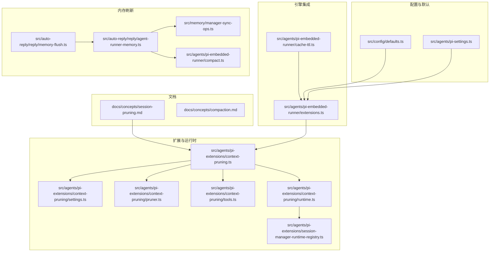
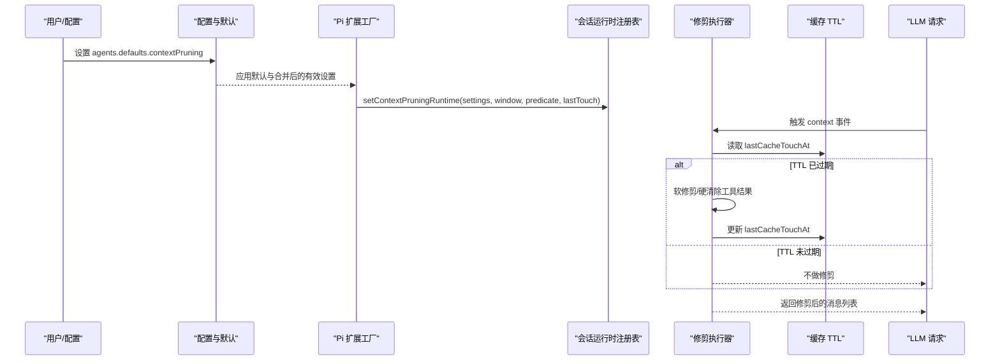
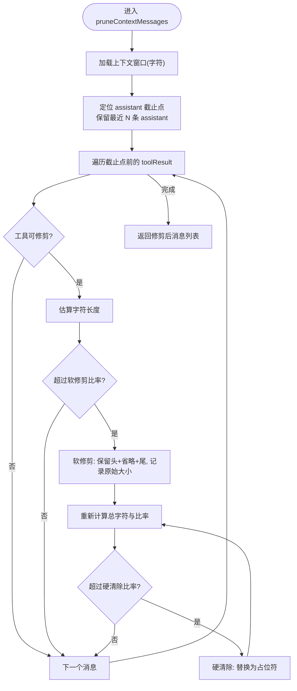
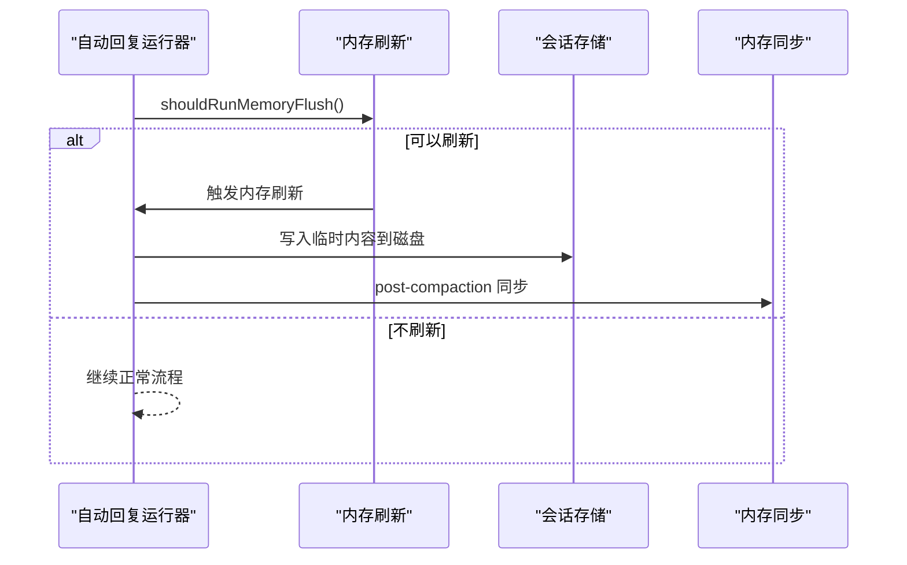
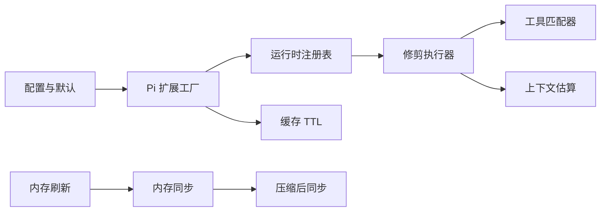

# 会话修剪

<cite>
**本文引用的文件**
- [docs/concepts/session-pruning.md](file://docs/concepts/session-pruning.md)
- [src/agents/pi-extensions/context-pruning.ts](file://src/agents/pi-extensions/context-pruning.ts)
- [src/agents/pi-extensions/context-pruning/settings.ts](file://src/agents/pi-extensions/context-pruning/settings.ts)
- [src/agents/pi-extensions/context-pruning/pruner.ts](file://src/agents/pi-extensions/context-pruning/pruner.ts)
- [src/agents/pi-extensions/context-pruning/tools.ts](file://src/agents/pi-extensions/context-pruning/tools.ts)
- [src/agents/pi-extensions/context-pruning/runtime.ts](file://src/agents/pi-extensions/context-pruning/runtime.ts)
- [src/agents/pi-extensions/session-manager-runtime-registry.ts](file://src/agents/pi-extensions/session-manager-runtime-registry.ts)
- [src/agents/pi-embedded-runner/extensions.ts](file://src/agents/pi-embedded-runner/extensions.ts)
- [src/agents/pi-embedded-runner/cache-ttl.ts](file://src/agents/pi-embedded-runner/cache-ttl.ts)
- [src/agents/pi-settings.ts](file://src/agents/pi-settings.ts)
- [src/config/defaults.ts](file://src/config/defaults.ts)
- [docs/concepts/compaction.md](file://docs/concepts/compaction.md)
- [src/auto-reply/reply/memory-flush.ts](file://src/auto-reply/reply/memory-flush.ts)
- [src/auto-reply/reply/agent-runner-memory.ts](file://src/auto-reply/reply/agent-runner-memory.ts)
- [src/memory/manager-sync-ops.ts](file://src/memory/manager-sync-ops.ts)
- [src/agents/pi-embedded-runner/compact.ts](file://src/agents/pi-embedded-runner/compact.ts)
</cite>

## 目录
1. [简介](#简介)
2. [项目结构](#项目结构)
3. [核心组件](#核心组件)
4. [架构总览](#架构总览)
5. [详细组件分析](#详细组件分析)
6. [依赖关系分析](#依赖关系分析)
7. [性能考量](#性能考量)
8. [故障排查指南](#故障排查指南)
9. [结论](#结论)
10. [附录](#附录)

## 简介
本文件系统性阐述“会话修剪”（Session Pruning）机制，聚焦于内存中的上下文修剪与预压缩内存刷新，解释其如何清理旧工具结果、优化上下文窗口、释放内存，并说明该机制对 LLM 调用性能与成本的影响。同时给出修剪配置项、触发条件、效果评估方法以及性能监控与调优建议。

## 项目结构
会话修剪相关能力主要由以下模块构成：
- 文档层：会话修剪概念与默认行为说明
- 扩展层：Pi 编码代理扩展，注入上下文事件钩子，按策略修剪消息
- 设置层：修剪配置解析与默认值计算
- 工具匹配层：基于通配符的工具选择策略
- 运行时层：会话级运行时注册表，保存修剪设置、上下文窗口与工具可修剪判定
- 引擎集成层：在 Pi 嵌入式运行器中按提供方与 TTL 规则启用修剪
- 缓存 TTL 层：读取/写入缓存 TTL 时间戳，驱动修剪触发与窗口重置
- 内存刷新层：在自动压缩前进行“静默内存刷新”，将临时内容持久化到磁盘
- 对比与协同：与“压缩”（Compaction）的区别与协作

**图示来源**
- [docs/concepts/session-pruning.md:1-122](file://docs/concepts/session-pruning.md#L1-L122)
- [src/agents/pi-extensions/context-pruning.ts:1-19](file://src/agents/pi-extensions/context-pruning.ts#L1-L19)
- [src/agents/pi-extensions/context-pruning/settings.ts:1-124](file://src/agents/pi-extensions/context-pruning/settings.ts#L1-L124)
- [src/agents/pi-extensions/context-pruning/pruner.ts:1-361](file://src/agents/pi-extensions/context-pruning/pruner.ts#L1-L361)
- [src/agents/pi-extensions/context-pruning/tools.ts:1-27](file://src/agents/pi-extensions/context-pruning/tools.ts#L1-L27)
- [src/agents/pi-extensions/context-pruning/runtime.ts:1-17](file://src/agents/pi-extensions/context-pruning/runtime.ts#L1-L17)
- [src/agents/pi-extensions/session-manager-runtime-registry.ts:1-29](file://src/agents/pi-extensions/session-manager-runtime-registry.ts#L1-L29)
- [src/agents/pi-embedded-runner/extensions.ts:30-58](file://src/agents/pi-embedded-runner/extensions.ts#L30-L58)
- [src/agents/pi-embedded-runner/cache-ttl.ts:1-81](file://src/agents/pi-embedded-runner/cache-ttl.ts#L1-L81)
- [src/config/defaults.ts:407-451](file://src/config/defaults.ts#L407-L451)
- [src/agents/pi-settings.ts:79-122](file://src/agents/pi-settings.ts#L79-L122)
- [src/auto-reply/reply/memory-flush.ts:1-229](file://src/auto-reply/reply/memory-flush.ts#L1-L229)
- [src/auto-reply/reply/agent-runner-memory.ts:430-452](file://src/auto-reply/reply/agent-runner-memory.ts#L430-L452)
- [src/memory/manager-sync-ops.ts:463-499](file://src/memory/manager-sync-ops.ts#L463-L499)
- [src/agents/pi-embedded-runner/compact.ts:287-336](file://src/agents/pi-embedded-runner/compact.ts#L287-L336)

**章节来源**
- [docs/concepts/session-pruning.md:1-122](file://docs/concepts/session-pruning.md#L1-L122)
- [docs/concepts/compaction.md:1-105](file://docs/concepts/compaction.md#L1-L105)

## 核心组件
- 修剪配置与默认值：解析用户配置，合并默认值，生成有效设置对象
- 修剪执行器：在上下文事件中按策略软修剪与硬清除工具结果，控制字符窗口占用
- 工具匹配器：支持通配符的允许/拒绝规则，决定哪些工具结果可修剪
- 运行时注册表：以会话为粒度存储修剪设置、上下文窗口与工具判定函数
- 引擎集成：在 Pi 嵌入式运行器中按提供方与 TTL 规则启用修剪，并更新缓存 TTL 时间戳
- 缓存 TTL：读取上次缓存时间戳，写入当前时间戳，用于判定是否需要修剪
- 内存刷新：在自动压缩前触发“静默内存刷新”，将临时内容持久化到磁盘，减少后续压缩压力

**章节来源**
- [src/agents/pi-extensions/context-pruning/settings.ts:1-124](file://src/agents/pi-extensions/context-pruning/settings.ts#L1-L124)
- [src/agents/pi-extensions/context-pruning/pruner.ts:242-360](file://src/agents/pi-extensions/context-pruning/pruner.ts#L242-L360)
- [src/agents/pi-extensions/context-pruning/tools.ts:10-26](file://src/agents/pi-extensions/context-pruning/tools.ts#L10-L26)
- [src/agents/pi-extensions/context-pruning/runtime.ts:1-17](file://src/agents/pi-extensions/context-pruning/runtime.ts#L1-L17)
- [src/agents/pi-embedded-runner/extensions.ts:30-58](file://src/agents/pi-embedded-runner/extensions.ts#L30-L58)
- [src/agents/pi-embedded-runner/cache-ttl.ts:42-80](file://src/agents/pi-embedded-runner/cache-ttl.ts#L42-L80)
- [src/auto-reply/reply/memory-flush.ts:170-228](file://src/auto-reply/reply/memory-flush.ts#L170-L228)

## 架构总览
下图展示从配置到运行时、再到上下文修剪与缓存 TTL 的关键交互路径。

**图示来源**
- [src/config/defaults.ts:407-451](file://src/config/defaults.ts#L407-L451)
- [src/agents/pi-embedded-runner/extensions.ts:30-58](file://src/agents/pi-embedded-runner/extensions.ts#L30-L58)
- [src/agents/pi-extensions/context-pruning/runtime.ts:1-17](file://src/agents/pi-extensions/context-pruning/runtime.ts#L1-L17)
- [src/agents/pi-extensions/context-pruning/pruner.ts:242-360](file://src/agents/pi-extensions/context-pruning/pruner.ts#L242-L360)
- [src/agents/pi-embedded-runner/cache-ttl.ts:42-80](file://src/agents/pi-embedded-runner/cache-ttl.ts#L42-L80)

## 详细组件分析

### 修剪配置与默认值
- 支持的模式：仅 cache-ttl（不支持 off）
- 关键参数：ttl、keepLastAssistants、softTrimRatio、hardClearRatio、minPrunableToolChars、tools（allow/deny）、softTrim（maxChars/headChars/tailChars）、hardClear（enabled/placeholder）
- 默认值：ttl=5m、keepLastAssistants=3、softTrimRatio=0.3、hardClearRatio=0.5、minPrunableToolChars=50000、softTrim={maxChars=4000, headChars=1500, tailChars=1500}、hardClear={enabled=true, placeholder="[Old tool result content cleared]"]
- 默认行为：若未显式设置，系统会为 Anthropic OAuth/API Key 场景设置 cache-ttl 模式与心跳间隔，并在 API Key 模式下为 Anthropic 模型补充 cacheRetention 策略

**章节来源**
- [src/agents/pi-extensions/context-pruning/settings.ts:9-65](file://src/agents/pi-extensions/context-pruning/settings.ts#L9-L65)
- [src/config/defaults.ts:407-451](file://src/config/defaults.ts#L407-L451)
- [docs/concepts/session-pruning.md:78-86](file://docs/concepts/session-pruning.md#L78-L86)

### 修剪执行流程（软修剪与硬清除）
- 上下文估计：按字符估算消息长度（文本块按字数，图像块按固定估算）
- 字符窗口：token 数 × 4（字符估算系数）
- 截止点：保留最后 N 条 assistant 消息之后的历史，防止误删推理/结论
- 软修剪：对超长工具结果保留头尾并插入省略标记与原始大小说明；含图像块的结果仅在必要时进行文本化处理
- 硬清除：当可修剪工具结果总字符达到阈值且比率仍高于硬清除阈值时，替换为占位符
- 图像保护：含图像块的工具结果不参与修剪

**图示来源**
- [src/agents/pi-extensions/context-pruning/pruner.ts:166-360](file://src/agents/pi-extensions/context-pruning/pruner.ts#L166-L360)

**章节来源**
- [src/agents/pi-extensions/context-pruning/pruner.ts:242-360](file://src/agents/pi-extensions/context-pruning/pruner.ts#L242-L360)
- [docs/concepts/session-pruning.md:59-64](file://docs/concepts/session-pruning.md#L59-L64)

### 工具选择与匹配
- 支持通配符的 allow/deny 列表，deny 优先
- 匹配大小写不敏感，空 allow 表示全部允许
- 通过编译后的正则谓词快速判断工具名是否可修剪

**章节来源**
- [src/agents/pi-extensions/context-pruning/tools.ts:10-26](file://src/agents/pi-extensions/context-pruning/tools.ts#L10-L26)
- [docs/concepts/session-pruning.md:66-71](file://docs/concepts/session-pruning.md#L66-L71)

### 运行时与会话注册表
- 使用弱映射以 SessionManager 实例为键，保存修剪设置、上下文窗口、工具可修剪判定与上次缓存时间戳
- 保证扩展在同一次会话生命周期内共享同一实例

**章节来源**
- [src/agents/pi-extensions/context-pruning/runtime.ts:1-17](file://src/agents/pi-extensions/context-pruning/runtime.ts#L1-L17)
- [src/agents/pi-extensions/session-manager-runtime-registry.ts:1-29](file://src/agents/pi-extensions/session-manager-runtime-registry.ts#L1-L29)

### 引擎集成与 TTL 触发
- 仅在 Anthropic 或兼容提供方上启用 cache-ttl 模式
- 仅在最后一次 Anthropic 调用距离当前时间超过 ttl 时才执行修剪
- 修剪完成后重置 TTL 窗口，使后续请求能复用新缓存

**章节来源**
- [src/agents/pi-embedded-runner/extensions.ts:30-58](file://src/agents/pi-embedded-runner/extensions.ts#L30-L58)
- [src/agents/pi-embedded-runner/cache-ttl.ts:15-40](file://src/agents/pi-embedded-runner/cache-ttl.ts#L15-L40)
- [docs/concepts/session-pruning.md:13-19](file://docs/concepts/session-pruning.md#L13-L19)

### 缓存 TTL 时间戳管理
- 读取：从会话条目中查找最近的自定义类型缓存条目，提取时间戳
- 写入：在成功修剪后追加当前时间戳，作为下次 TTL 判定依据

**章节来源**
- [src/agents/pi-embedded-runner/cache-ttl.ts:42-80](file://src/agents/pi-embedded-runner/cache-ttl.ts#L42-L80)

### 与压缩的关系与协同
- 压缩：将历史对话摘要化并持久化到 JSONL，属于“持久化”的长期优化
- 修剪：仅在内存中对旧工具结果进行瞬时清理，属于“请求级”的短期优化
- 两者互补：压缩解决长期上下文膨胀，修剪缓解短期内工具输出堆积导致的缓存写放大

**章节来源**
- [docs/concepts/compaction.md:81-86](file://docs/concepts/compaction.md#L81-L86)
- [docs/concepts/session-pruning.md:73-76](file://docs/concepts/session-pruning.md#L73-L76)

### 预压缩内存刷新（静默内存刷新）
- 触发时机：在自动压缩前，当会话接近上下文阈值或满足字节大小阈值时，触发“静默内存刷新”
- 目标：将临时内容持久化到磁盘（memory/YYYY-MM-DD.md），减少后续压缩负担
- 防重复：同一压缩周期内仅执行一次，避免重复刷新
- 同步策略：支持异步/等待两种模式，确保压缩后同步

**图示来源**
- [src/auto-reply/reply/memory-flush.ts:170-228](file://src/auto-reply/reply/memory-flush.ts#L170-L228)
- [src/auto-reply/reply/agent-runner-memory.ts:430-452](file://src/auto-reply/reply/agent-runner-memory.ts#L430-L452)
- [src/auto-reply/reply/agent-runner-memory.ts:519-560](file://src/auto-reply/reply/agent-runner-memory.ts#L519-L560)
- [src/memory/manager-sync-ops.ts:463-499](file://src/memory/manager-sync-ops.ts#L463-L499)
- [src/agents/pi-embedded-runner/compact.ts:287-336](file://src/agents/pi-embedded-runner/compact.ts#L287-L336)

**章节来源**
- [src/auto-reply/reply/memory-flush.ts:1-229](file://src/auto-reply/reply/memory-flush.ts#L1-L229)
- [src/auto-reply/reply/agent-runner-memory.ts:430-452](file://src/auto-reply/reply/agent-runner-memory.ts#L430-L452)
- [src/auto-reply/reply/agent-runner-memory.ts:519-560](file://src/auto-reply/reply/agent-runner-memory.ts#L519-L560)
- [src/agents/pi-embedded-runner/compact.ts:287-336](file://src/agents/pi-embedded-runner/compact.ts#L287-L336)

## 依赖关系分析
- 配置与默认值依赖于认证模式与模型提供方，决定是否启用 cache-ttl 与心跳间隔
- 引擎扩展依赖缓存 TTL 判定与会话运行时注册表
- 修剪执行器依赖工具匹配器与上下文窗口估算
- 内存刷新与压缩后同步相互独立但协同工作

**图示来源**
- [src/config/defaults.ts:407-451](file://src/config/defaults.ts#L407-L451)
- [src/agents/pi-embedded-runner/extensions.ts:30-58](file://src/agents/pi-embedded-runner/extensions.ts#L30-L58)
- [src/agents/pi-extensions/context-pruning/runtime.ts:1-17](file://src/agents/pi-extensions/context-pruning/runtime.ts#L1-L17)
- [src/agents/pi-extensions/context-pruning/pruner.ts:242-360](file://src/agents/pi-extensions/context-pruning/pruner.ts#L242-L360)
- [src/agents/pi-extensions/context-pruning/tools.ts:10-26](file://src/agents/pi-extensions/context-pruning/tools.ts#L10-L26)
- [src/auto-reply/reply/memory-flush.ts:170-228](file://src/auto-reply/reply/memory-flush.ts#L170-L228)
- [src/agents/pi-embedded-runner/compact.ts:287-336](file://src/agents/pi-embedded-runner/compact.ts#L287-L336)

**章节来源**
- [src/agents/pi-settings.ts:79-122](file://src/agents/pi-settings.ts#L79-L122)
- [src/agents/pi-embedded-runner/cache-ttl.ts:15-40](file://src/agents/pi-embedded-runner/cache-ttl.ts#L15-L40)

## 性能考量
- 成本影响
  - 修剪可降低首次请求在 TTL 过期后的 cacheWrite 大小，从而降低缓存写入成本
  - TTL 重置后，后续请求更可能命中缓存，减少重复计算
- 性能影响
  - 修剪在请求前进行，增加少量 CPU 开销；但可显著减少上下文大小，提高 LLM 推理吞吐
  - 预压缩内存刷新减少压缩阶段的数据量，降低压缩与同步开销
- 参数调优建议
  - 合理设置 keepLastAssistants，避免误删关键推理/结论
  - 软修剪与硬清除阈值应结合模型上下文窗口与典型工具输出规模调整
  - 将 ttl 与模型 cacheRetention 策略对齐，最大化缓存复用
  - 在高并发场景下，适当提高 reserveTokensFloor 与 softThresholdTokens，预留缓冲空间

[本节为通用指导，无需特定文件来源]

## 故障排查指南
- 未生效
  - 检查提供方是否支持 cache-ttl（仅 Anthropic 及兼容提供方）
  - 确认配置 mode 是否为 cache-ttl，且未被默认覆盖
  - 核对 TTL 是否已过期，否则不会触发修剪
- 修剪过度或不足
  - 调整 softTrimRatio、hardClearRatio、minPrunableToolChars
  - 检查工具匹配规则，避免误拒/误放
- 缓存命中异常
  - 查看上次缓存时间戳是否正确更新
  - 确保 TTL 与模型 cacheRetention 策略一致
- 预压缩内存刷新未触发
  - 检查是否达到 token 阈值或字节阈值
  - 确认同一压缩周期内未重复刷新
  - 核对内存同步模式（await/async/off）

**章节来源**
- [src/agents/pi-embedded-runner/cache-ttl.ts:42-80](file://src/agents/pi-embedded-runner/cache-ttl.ts#L42-L80)
- [src/auto-reply/reply/memory-flush.ts:170-228](file://src/auto-reply/reply/memory-flush.ts#L170-L228)
- [src/auto-reply/reply/agent-runner-memory.ts:430-452](file://src/auto-reply/reply/agent-runner-memory.ts#L430-L452)

## 结论
会话修剪通过在请求前清理旧工具结果、软修剪与硬清除策略，有效控制上下文窗口与缓存写入成本；配合预压缩内存刷新与压缩后同步，形成“请求级清理 + 周期级沉淀”的双层优化体系。合理配置修剪参数与 TTL 策略，可在保证推理质量的同时显著提升性能与降低成本。

[本节为总结，无需特定文件来源]

## 附录

### 修剪配置项速览
- mode：cache-ttl（不支持 off）
- ttl：TTL（字符串，单位分钟）
- keepLastAssistants：保护最后 N 条 assistant 消息
- softTrimRatio/hardClearRatio：软修剪/硬清除触发比率
- minPrunableToolChars：最小可修剪工具结果字符阈值
- tools.allow/deny：工具白名单/黑名单（支持通配符）
- softTrim.maxChars/headChars/tailChars：软修剪截断参数
- hardClear.enabled/placeholder：硬清除开关与占位符

**章节来源**
- [src/agents/pi-extensions/context-pruning/settings.ts:9-65](file://src/agents/pi-extensions/context-pruning/settings.ts#L9-L65)
- [docs/concepts/session-pruning.md:78-86](file://docs/concepts/session-pruning.md#L78-L86)

### 触发条件与效果评估
- 触发条件
  - 模式为 cache-ttl 且提供方受支持
  - 最后一次 Anthropic 调用距离当前时间超过 ttl
  - 修剪完成后重置 TTL 窗口
- 效果评估
  - 首次请求后 cacheWrite 显著下降
  - 后续请求命中缓存概率上升
  - 上下文字符占用稳定在软修剪阈值之下

**章节来源**
- [docs/concepts/session-pruning.md:13-19](file://docs/concepts/session-pruning.md#L13-L19)
- [src/agents/pi-embedded-runner/cache-ttl.ts:42-80](file://src/agents/pi-embedded-runner/cache-ttl.ts#L42-L80)