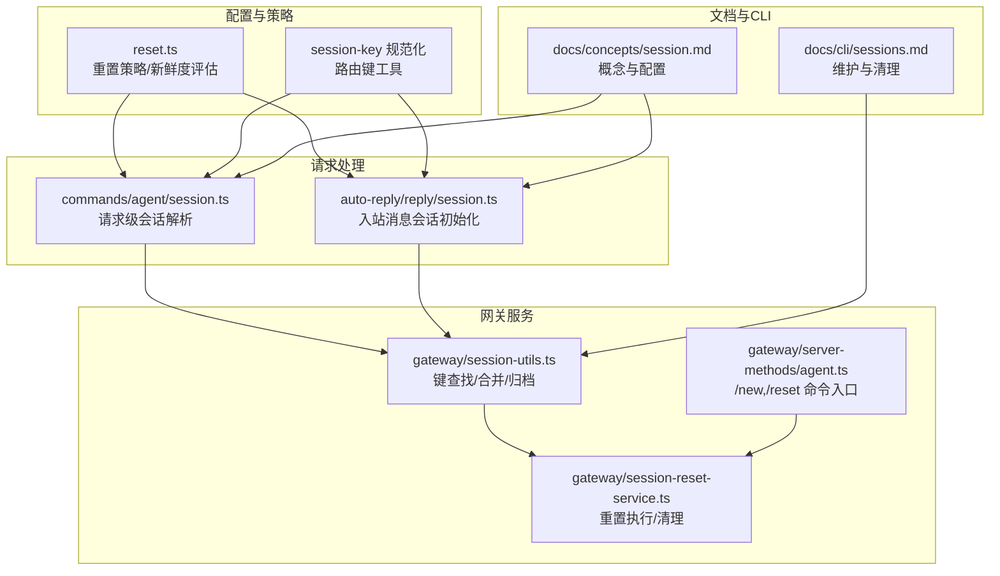
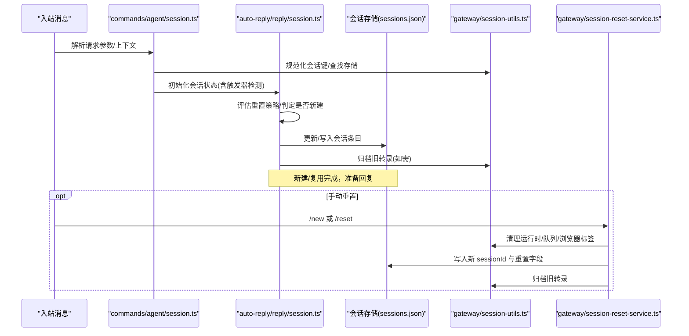
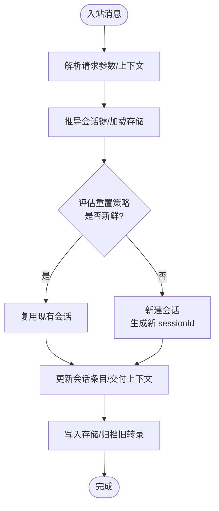
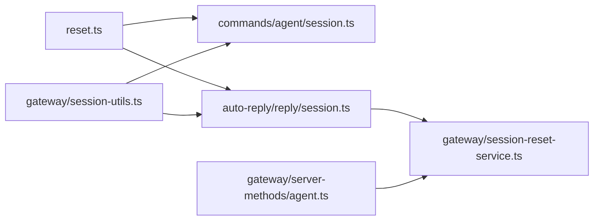

# 会话生命周期

<cite>
**本文引用的文件**
- [reset.ts](file://src/config/sessions/reset.ts)
- [session.ts](file://src/commands/agent/session.ts)
- [session.ts](file://src/auto-reply/reply/session.ts)
- [session-utils.ts](file://src/gateway/session-utils.ts)
- [session-reset-service.ts](file://src/gateway/session-reset-service.ts)
- [agent.ts](file://src/gateway/server-methods/agent.ts)
- [session.md](file://docs/concepts/session.md)
- [sessions.md](file://docs/cli/sessions.md)
- [session-id.ts](file://src/sessions/session-id.ts)
- [secure-random.ts](file://src/infra/secure-random.ts)
</cite>

## 目录
1. [简介](#简介)
2. [项目结构](#项目结构)
3. [核心组件](#核心组件)
4. [架构总览](#架构总览)
5. [详细组件分析](#详细组件分析)
6. [依赖关系分析](#依赖关系分析)
7. [性能考量](#性能考量)
8. [故障排查指南](#故障排查指南)
9. [结论](#结论)
10. [附录](#附录)

## 简介
本文件系统化阐述 OpenClaw 的会话生命周期管理：从会话创建、激活、更新、重置到销毁的完整流程；详解会话重置策略（每日重置、空闲重置、按类型重置、按渠道重置）的工作原理与配置方式；说明会话标识符生成规则、会话键映射机制与状态转换；并提供会话触发器（/new、/reset）的使用方法与行为说明，以及会话生命周期的监控与调试技巧。

## 项目结构
围绕会话生命周期的关键模块分布如下：
- 配置与策略：会话重置策略解析、新鲜度评估、键规范化与映射
- 请求处理：会话解析与初始化（含触发器检测）
- 网关服务：会话重置服务（手动重置）、会话元数据读写与归档
- 文档与 CLI：概念说明与维护命令参考

图表来源
- [reset.ts:1-177](file://src/config/sessions/reset.ts#L1-L177)
- [session.ts:1-173](file://src/commands/agent/session.ts#L1-L173)
- [session.ts:1-621](file://src/auto-reply/reply/session.ts#L1-L621)
- [session-utils.ts:1-800](file://src/gateway/session-utils.ts#L1-L800)
- [session-reset-service.ts:1-347](file://src/gateway/session-reset-service.ts#L1-L347)
- [agent.ts:1-200](file://src/gateway/server-methods/agent.ts#L1-L200)
- [session.md:1-311](file://docs/concepts/session.md#L1-L311)
- [sessions.md:1-111](file://docs/cli/sessions.md#L1-L111)

章节来源
- [reset.ts:1-177](file://src/config/sessions/reset.ts#L1-L177)
- [session.ts:1-173](file://src/commands/agent/session.ts#L1-L173)
- [session.ts:1-621](file://src/auto-reply/reply/session.ts#L1-L621)
- [session-utils.ts:1-800](file://src/gateway/session-utils.ts#L1-L800)
- [session-reset-service.ts:1-347](file://src/gateway/session-reset-service.ts#L1-L347)
- [agent.ts:1-200](file://src/gateway/server-methods/agent.ts#L1-L200)
- [session.md:1-311](file://docs/concepts/session.md#L1-L311)
- [sessions.md:1-111](file://docs/cli/sessions.md#L1-L111)

## 核心组件
- 重置策略与新鲜度评估：定义重置模式（每日/空闲）、计算到期时间、判定会话是否“新鲜”
- 会话键解析与映射：根据上下文与配置推导会话键，支持多代理、主键别名、大小写兼容
- 会话初始化与状态转换：在入站消息时决定是否复用旧会话或新建会话，记录元数据与交付上下文
- 手动重置服务：在网关层执行 /new 或 /reset，清理运行时状态并生成新 sessionId
- 触发器与命令授权：识别 /new、/reset 及自定义触发词，结合授权控制执行

章节来源
- [reset.ts:1-177](file://src/config/sessions/reset.ts#L1-L177)
- [session.ts:1-173](file://src/commands/agent/session.ts#L1-L173)
- [session.ts:1-621](file://src/auto-reply/reply/session.ts#L1-L621)
- [session-reset-service.ts:1-347](file://src/gateway/session-reset-service.ts#L1-L347)
- [agent.ts:1-200](file://src/gateway/server-methods/agent.ts#L1-L200)

## 架构总览
下图展示一次典型入站消息的会话生命周期路径：从消息进入，到会话键解析、重置策略评估、状态更新与持久化，再到可选的手动重置服务调用。

图表来源
- [session.ts:111-173](file://src/commands/agent/session.ts#L111-L173)
- [session.ts:169-621](file://src/auto-reply/reply/session.ts#L169-L621)
- [session-utils.ts:180-217](file://src/gateway/session-utils.ts#L180-L217)
- [session-reset-service.ts:246-347](file://src/gateway/session-reset-service.ts#L246-L347)

## 详细组件分析

### 会话创建与激活
- 请求级解析：根据配置与上下文推导会话键，加载对应存储，决定是否复用现有会话
- 入站初始化：在消息到达时进行重置策略评估，若会话过期则新建；保留用户设置的行为覆盖项（思考级别、详细程度等）
- 元数据与交付上下文：记录最近通道/目标/账号/主题线 ID，用于后续路由与通知

图表来源
- [session.ts:111-173](file://src/commands/agent/session.ts#L111-L173)
- [session.ts:169-621](file://src/auto-reply/reply/session.ts#L169-L621)

章节来源
- [session.ts:43-109](file://src/commands/agent/session.ts#L43-L109)
- [session.ts:169-450](file://src/auto-reply/reply/session.ts#L169-L450)

### 会话更新与状态转换
- 复用条件：若会话“新鲜”，沿用旧 sessionId，并保留部分用户态设置
- 新建条件：若会话过期或显式触发重置，则生成新 sessionId，清空上次运行标记，保留用户态设置
- 状态字段：包括系统提示发送标记、上轮中断标记、模型/提供方、令牌用量、标签、发送策略等

章节来源
- [session.ts:346-374](file://src/auto-reply/reply/session.ts#L346-L374)
- [session.ts:409-442](file://src/auto-reply/reply/session.ts#L409-L442)

### 会话重置策略与配置
- 重置模式
  - 每日重置：以本地时间为基准，计算最近一次重置时刻，超过该时刻即视为过期
  - 空闲重置：基于上次更新时间 + 空闲分钟数，当前时间超过阈值即过期
  - 双重策略：当同时配置每日与空闲时，以先到期者为准
- 重置类型
  - 直接对话（DM）、群组（Group/Channel）、话题/主题（Thread）
  - 类型判定依据键名标记、上下文标志或显式参数
- 渠道覆盖
  - 支持按渠道单独覆盖重置策略，优先于全局与类型级配置
- 默认与兼容
  - 若仅配置了旧版空闲分钟数而无新式重置配置，默认进入空闲模式
  - 保留对旧键名（如 direct 的别名）的向后兼容

章节来源
- [reset.ts:5-120](file://src/config/sessions/reset.ts#L5-L120)
- [reset.ts:139-177](file://src/config/sessions/reset.ts#L139-L177)
- [session.md:207-218](file://docs/concepts/session.md#L207-L218)

### 会话标识符生成规则
- 使用安全随机 UUID 生成新 sessionId，确保唯一性与不可预测性
- 会话 ID 的格式校验由专用正则表达式保障
- 在缺失强随机源时，回退为弱随机生成并发出警告（UI 层亦有类似逻辑）

章节来源
- [session.ts:358-358](file://src/auto-reply/reply/session.ts#L358-L358)
- [secure-random.ts:1-9](file://src/infra/secure-random.ts#L1-L9)
- [session-id.ts:1-5](file://src/sessions/session-id.ts#L1-L5)

### 会话键映射机制
- 键规范化：统一大小写、解析代理前缀、解析主键别名（如 main），并支持“未知/全局”键
- 存储定位：根据键与代理 ID 定位到具体 store 文件；支持模板化路径与多代理聚合
- 混合大小写迁移：扫描并清理历史遗留的大小写变体键，保证一致性
- 跨代理检索：当通过 sessionId 查找但未命中主存储时，遍历其他代理存储以匹配

章节来源
- [session-utils.ts:436-471](file://src/gateway/session-utils.ts#L436-L471)
- [session-utils.ts:554-660](file://src/gateway/session-utils.ts#L554-L660)
- [session-utils.ts:199-217](file://src/gateway/session-utils.ts#L199-L217)
- [session.ts:83-106](file://src/commands/agent/session.ts#L83-L106)

### 会话触发器（/new、/reset）使用与行为
- 触发词匹配：支持大小写不敏感匹配，同时考虑消息正文与去除结构化前缀后的文本
- 授权控制：仅授权发送方可触发重置
- 行为差异
  - /new：新建会话，保留用户态设置（思考/详细/推理/TTS/模型覆盖/标签）
  - /reset：新建会话并注入带时间戳的提示语，便于确认重置生效
- ACP 绑定场景：对于绑定的 ACP 会话，/new 与 /reset 由 ACP 运行时就地重置，避免旋转普通会话

章节来源
- [session.ts:262-295](file://src/auto-reply/reply/session.ts#L262-L295)
- [session.ts:214-246](file://src/auto-reply/reply/session.ts#L214-L246)
- [agent.ts:67-94](file://src/gateway/server-methods/agent.ts#L67-L94)

### 手动重置服务（网关层）
- 清理步骤：停止队列、终止子代理、关闭浏览器标签、取消/关闭 ACP 运行时
- 重置写入：生成新 sessionId，保留用户态设置与模型信息，清零令牌用量
- 归档与事件：归档旧转录，必要时发出生命周期解绑事件

章节来源
- [session-reset-service.ts:246-347](file://src/gateway/session-reset-service.ts#L246-L347)
- [session-reset-service.ts:102-144](file://src/gateway/session-reset-service.ts#L102-L144)

## 依赖关系分析
- 低耦合高内聚
  - 重置策略与新鲜度评估独立于请求处理与网关服务，便于测试与复用
  - 会话键解析与存储定位通过工具函数抽象，避免跨模块重复实现
- 关键依赖链
  - commands/agent/session.ts 依赖 reset.ts 与 session-utils.ts
  - auto-reply/reply/session.ts 依赖 reset.ts 与 session-utils.ts，并调用网关归档与钩子
  - gateway/session-reset-service.ts 依赖 session-utils.ts 与内部钩子/插件系统

图表来源
- [reset.ts:1-177](file://src/config/sessions/reset.ts#L1-L177)
- [session.ts:1-173](file://src/commands/agent/session.ts#L1-L173)
- [session.ts:1-621](file://src/auto-reply/reply/session.ts#L1-L621)
- [session-utils.ts:1-800](file://src/gateway/session-utils.ts#L1-L800)
- [session-reset-service.ts:1-347](file://src/gateway/session-reset-service.ts#L1-L347)
- [agent.ts:1-200](file://src/gateway/server-methods/agent.ts#L1-L200)

章节来源
- [session.ts:1-25](file://src/commands/agent/session.ts#L1-L25)
- [session.ts:1-30](file://src/auto-reply/reply/session.ts#L1-L30)
- [session-utils.ts:1-50](file://src/gateway/session-utils.ts#L1-L50)
- [session-reset-service.ts:1-32](file://src/gateway/session-reset-service.ts#L1-L32)
- [agent.ts:1-66](file://src/gateway/server-methods/agent.ts#L1-L66)

## 性能考量
- 大存储写入成本：维护策略在写入路径执行，大规模 sessions.json 会增加写延迟
- 建议
  - 启用强制模式并设置时间与数量限制，避免无限增长
  - 对磁盘预算启用时，合理设置上限与水位线，优先清理旧转录与会话
  - 使用清理预演验证影响后再强制执行

章节来源
- [session.md:74-120](file://docs/concepts/session.md#L74-L120)
- [sessions.md:54-111](file://docs/cli/sessions.md#L54-L111)

## 故障排查指南
- 会话未按预期重置
  - 检查重置策略配置（全局/按类型/按渠道）与触发词授权
  - 确认消息正文是否被结构化前缀干扰（已做剥离处理）
- 新建会话后令牌统计异常
  - /new 或 /reset 会清零上次会话的令牌用量，属预期行为
- 旧转录未归档
  - 确认会话重置或过期导致的状态变更，系统会在新建/过期时归档
- 手动重置失败
  - 网关可能检测到会话仍在活跃中，等待片刻重试或检查运行时清理结果

章节来源
- [session.ts:545-554](file://src/auto-reply/reply/session.ts#L545-L554)
- [session-reset-service.ts:127-144](file://src/gateway/session-reset-service.ts#L127-L144)
- [session-reset-service.ts:332-344](file://src/gateway/session-reset-service.ts#L332-L344)

## 结论
OpenClaw 的会话生命周期通过“策略驱动 + 键映射 + 状态转换 + 手动重置”的闭环实现，既满足日常对话的连续性需求，又提供灵活的重置与维护能力。建议在生产环境启用强制维护策略，并结合 CLI 工具定期清理与预演，确保会话存储健康可控。

## 附录
- 会话键映射与来源元数据
  - 支持主键别名、代理前缀、大小写兼容与历史遗留键迁移
  - 记录会话来源（通道、账号、主题线等）以便 UI 与诊断
- 重置触发与行为
  - /new 与 /reset 的授权与行为差异
  - ACP 绑定场景下的就地重置策略

章节来源
- [session.md:189-218](file://docs/concepts/session.md#L189-L218)
- [session-utils.ts:291-311](file://src/gateway/session-utils.ts#L291-L311)