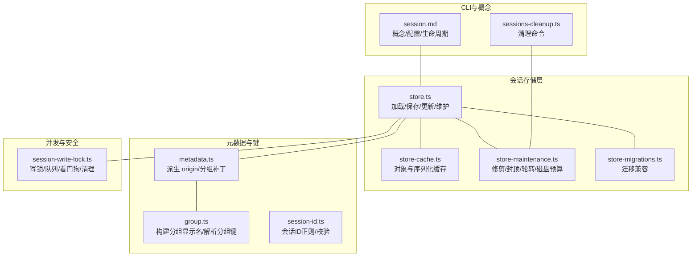
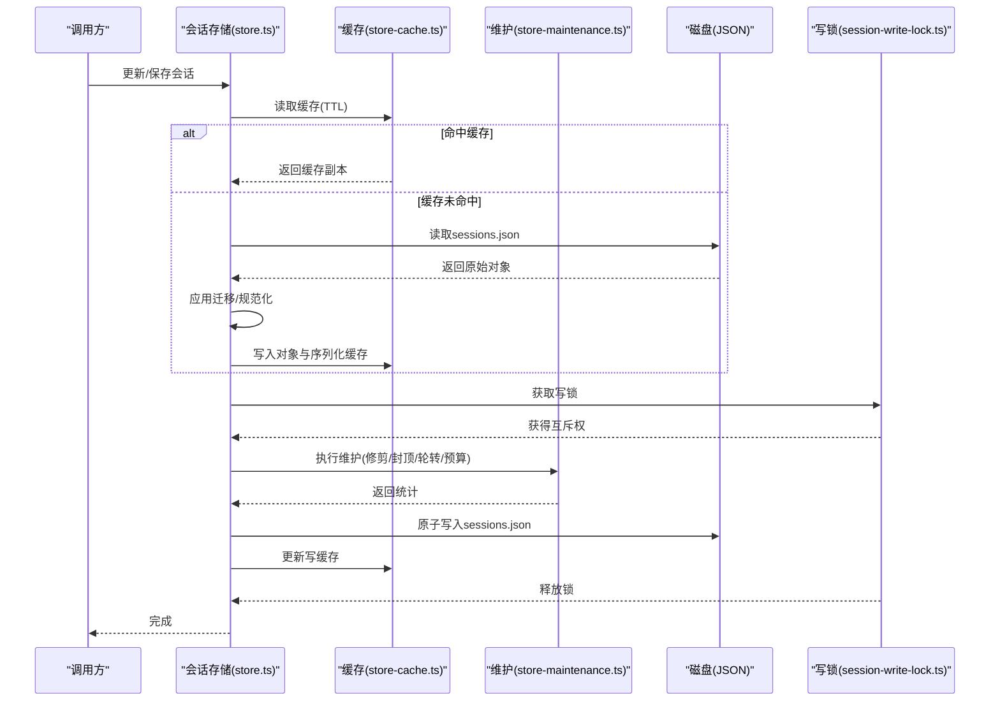
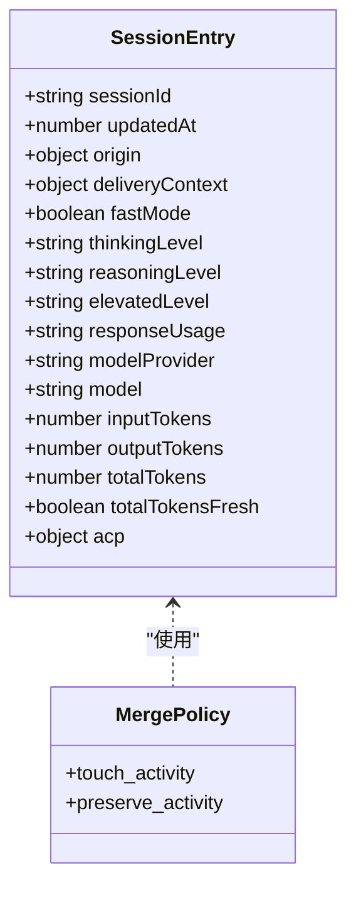
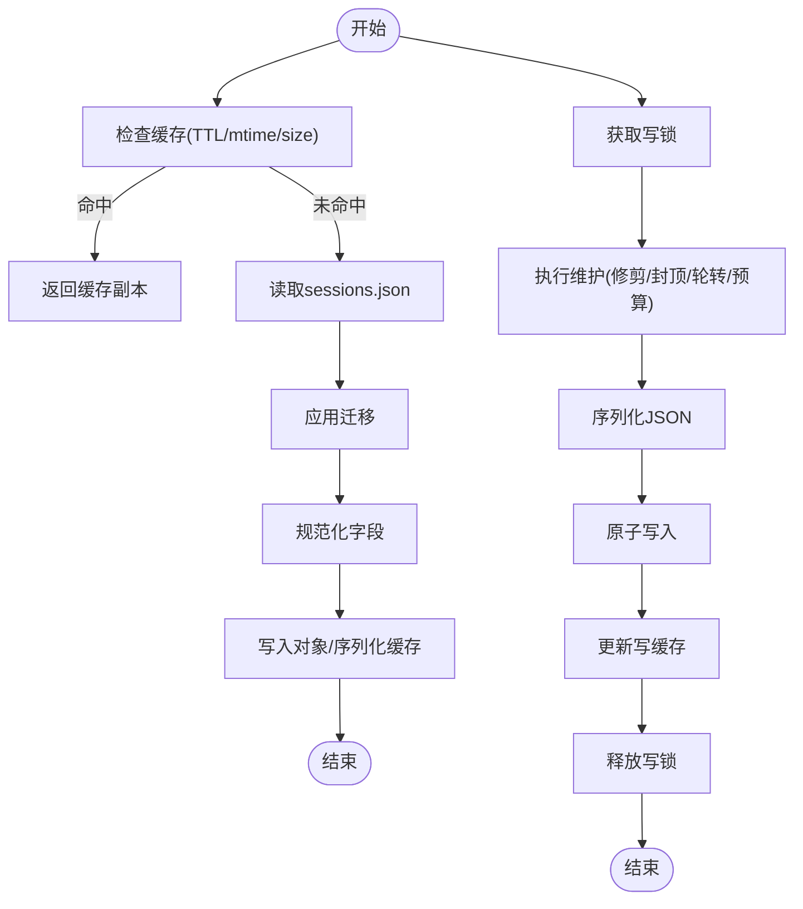
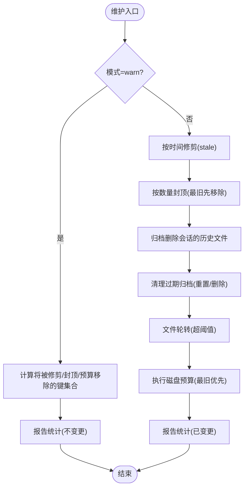
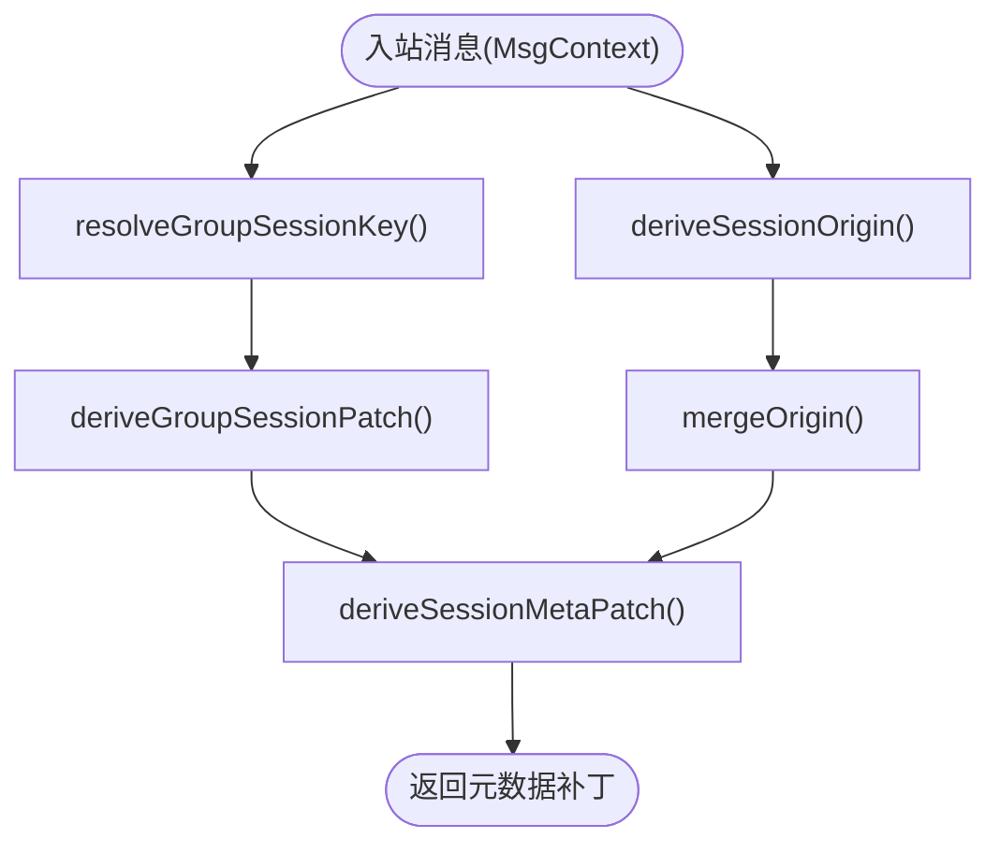
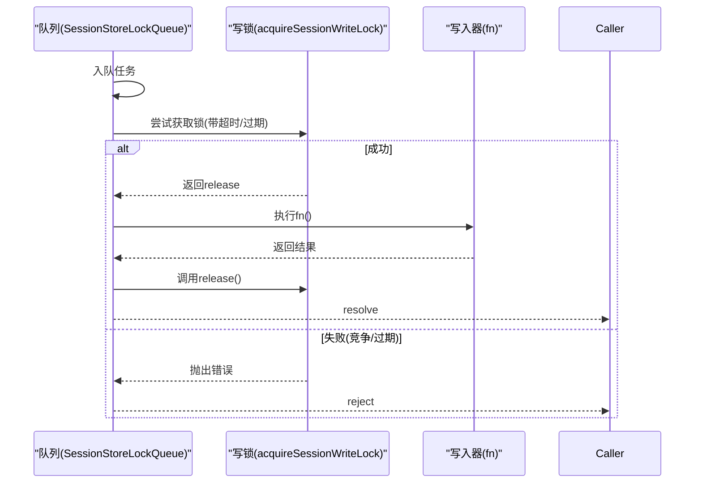
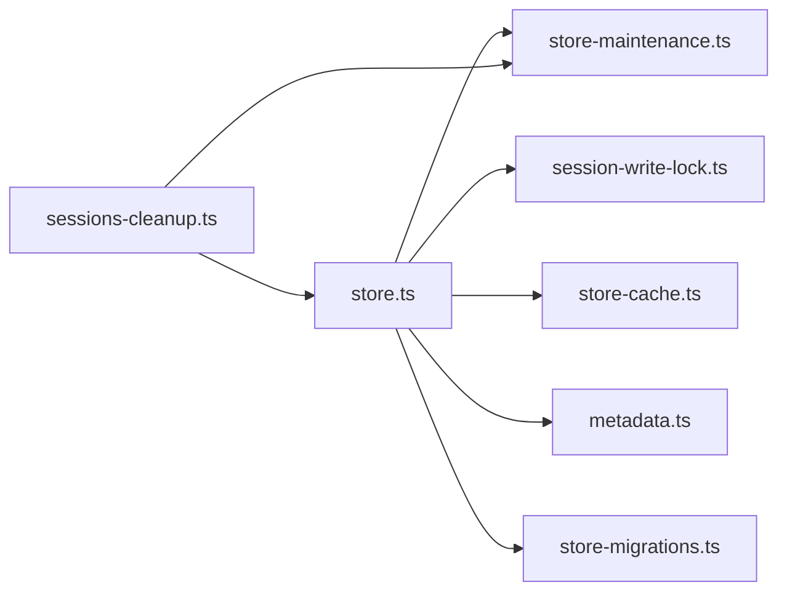

# 会话管理

<cite>
**本文引用的文件**
- [session-id.ts](file://src/sessions/session-id.ts)
- [types.ts](file://src/config/sessions/types.ts)
- [store.ts](file://src/config/sessions/store.ts)
- [store-maintenance.ts](file://src/config/sessions/store-maintenance.ts)
- [store-cache.ts](file://src/config/sessions/store-cache.ts)
- [metadata.ts](file://src/config/sessions/metadata.ts)
- [group.ts](file://src/config/sessions/group.ts)
- [store-migrations.ts](file://src/config/sessions/store-migrations.ts)
- [session-write-lock.ts](file://src/agents/session-write-lock.ts)
- [sessions-cleanup.ts](file://src/commands/sessions-cleanup.ts)
- [session.md](file://docs/concepts/session.md)
</cite>

## 目录
1. [简介](#简介)
2. [项目结构](#项目结构)
3. [核心组件](#核心组件)
4. [架构总览](#架构总览)
5. [详细组件分析](#详细组件分析)
6. [依赖关系分析](#依赖关系分析)
7. [性能考量](#性能考量)
8. [故障排查指南](#故障排查指南)
9. [结论](#结论)
10. [附录](#附录)

## 简介
本文件系统性阐述 OpenClaw 的会话管理系统，覆盖会话创建、维护与销毁流程；会话状态与历史记录的持久化与归档；会话工具调用与去重；会话修剪与内存优化；会话标识符生成与校验；会话隔离与并发写入控制；会话恢复与故障转移；以及配置项与性能调优建议。内容以代码为依据，辅以图示帮助理解。

## 项目结构
围绕“会话”的关键模块分布如下：
- 会话模型与合并策略：types.ts
- 存储读写与缓存：store.ts、store-cache.ts
- 维护策略（修剪、封顶、轮转、磁盘预算）：store-maintenance.ts、sessions-cleanup.ts
- 元数据派生与分组键：metadata.ts、group.ts
- 迁移与兼容：store-migrations.ts
- 并发写锁与队列：session-write-lock.ts
- 会话 ID 校验：session-id.ts
- 概念与配置说明：docs/concepts/session.md

图表来源
- [store.ts:1-800](file://src/config/sessions/store.ts#L1-L800)
- [store-cache.ts:1-81](file://src/config/sessions/store-cache.ts#L1-L81)
- [store-maintenance.ts:1-328](file://src/config/sessions/store-maintenance.ts#L1-L328)
- [store-migrations.ts:1-28](file://src/config/sessions/store-migrations.ts#L1-L28)
- [metadata.ts:1-173](file://src/config/sessions/metadata.ts#L1-L173)
- [group.ts:1-108](file://src/config/sessions/group.ts#L1-L108)
- [session-id.ts:1-6](file://src/sessions/session-id.ts#L1-L6)
- [session-write-lock.ts:1-561](file://src/agents/session-write-lock.ts#L1-L561)
- [sessions-cleanup.ts:1-469](file://src/commands/sessions-cleanup.ts#L1-L469)
- [session.md:1-311](file://docs/concepts/session.md#L1-L311)

章节来源
- [store.ts:1-800](file://src/config/sessions/store.ts#L1-L800)
- [store-maintenance.ts:1-328](file://src/config/sessions/store-maintenance.ts#L1-L328)
- [session.md:1-311](file://docs/concepts/session.md#L1-L311)

## 核心组件
- 会话条目与合并策略：定义会话字段、运行时模型字段规范化、合并策略（保留活动时间戳或触活动务刷新时间戳），并提供新鲜度判定。
- 会话存储：提供加载、更新、保存、原子写入、缓存、维护（修剪、封顶、轮转、磁盘预算）、归档与清理等能力。
- 维护策略：按配置决定模式（告警/强制），执行过期修剪、数量封顶、文件轮转、磁盘预算清理。
- 元数据派生：从入站消息上下文推导 origin、分组键与显示名，用于 UI 展示与溯源。
- 并发写锁：基于文件锁的互斥队列，支持超时、过期回收、看门狗清理、进程退出清理。
- 清理命令：CLI 预览与应用维护策略，输出 JSON 或表格结果。
- 会话 ID 校验：正则匹配 UUID 格式。

章节来源
- [types.ts:68-291](file://src/config/sessions/types.ts#L68-L291)
- [store.ts:195-533](file://src/config/sessions/store.ts#L195-L533)
- [store-maintenance.ts:130-328](file://src/config/sessions/store-maintenance.ts#L130-L328)
- [metadata.ts:45-173](file://src/config/sessions/metadata.ts#L45-L173)
- [session-write-lock.ts:444-553](file://src/agents/session-write-lock.ts#L444-L553)
- [sessions-cleanup.ts:293-469](file://src/commands/sessions-cleanup.ts#L293-L469)
- [session-id.ts:1-6](file://src/sessions/session-id.ts#L1-L6)

## 架构总览
会话管理由“存储层 + 维护层 + 并发控制 + 元数据派生 + CLI 工具”构成。写路径在保存前执行维护策略，读路径可命中缓存；并发通过写锁队列串行化，避免竞态与损坏。

图表来源
- [store.ts:195-533](file://src/config/sessions/store.ts#L195-L533)
- [store-cache.ts:41-81](file://src/config/sessions/store-cache.ts#L41-L81)
- [store-maintenance.ts:130-328](file://src/config/sessions/store-maintenance.ts#L130-L328)
- [session-write-lock.ts:444-553](file://src/agents/session-write-lock.ts#L444-L553)

## 详细组件分析

### 会话模型与合并策略
- 字段设计：包含 sessionId、updatedAt、origin、deliveryContext、运行时开关（思考/快速/详细/推理/提升/语音）、执行策略、令牌用量、ACP 元信息等。
- 规范化：对模型提供方与模型名称进行去空白与裁剪，避免遗留旧字段。
- 合并策略：
  - 默认策略：合并后 updatedAt 取现有/补丁/当前时间的最大值。
  - 保留活动策略：合并后 updatedAt 不被补丁覆盖，确保空转不刷新活跃度。
- 新鲜度判定：totalTokensFresh 为真且数值有效时才视为新鲜，否则视为陈旧。

图表来源
- [types.ts:68-174](file://src/config/sessions/types.ts#L68-L174)
- [types.ts:253-291](file://src/config/sessions/types.ts#L253-L291)

章节来源
- [types.ts:68-291](file://src/config/sessions/types.ts#L68-L291)

### 会话存储与缓存
- 加载：支持缓存命中（TTL + mtime/size 校验）与跨平台容错（Windows 短暂空文件/锁定）。
- 保存：规范化后执行维护，再原子写入；失败重试与回退处理。
- 缓存：同时维护对象缓存与序列化缓存，写入后同步更新。
- 键规范化：大小写与空白统一，兼容历史大小写键。
- 入站元数据：从 MsgContext 派生 origin 与分组信息，支持“保留活动”合并策略。

图表来源
- [store.ts:195-270](file://src/config/sessions/store.ts#L195-L270)
- [store.ts:340-509](file://src/config/sessions/store.ts#L340-L509)
- [store-cache.ts:41-81](file://src/config/sessions/store-cache.ts#L41-L81)
- [store-maintenance.ts:155-259](file://src/config/sessions/store-maintenance.ts#L155-L259)

章节来源
- [store.ts:195-533](file://src/config/sessions/store.ts#L195-L533)
- [store-cache.ts:1-81](file://src/config/sessions/store-cache.ts#L1-L81)
- [store-migrations.ts:1-28](file://src/config/sessions/store-migrations.ts#L1-L28)

### 维护策略与磁盘预算
- 模式：warn（仅告警）、enforce（实际执行）。
- 修剪：按 updatedAt 超过 pruneAfterMs 删除。
- 封顶：按 updatedAt 降序保留最多 maxEntries 条。
- 轮转：超过 rotateBytes 重命名为 .bak.{timestamp}，最多保留 3 个最近备份。
- 磁盘预算：按高水位与上限清理最旧会话与历史文件，支持仅预览（dry-run）。
- 主动清理命令：支持多代理目标、JSON 输出、主动会话键提示。

图表来源
- [store-maintenance.ts:155-328](file://src/config/sessions/store-maintenance.ts#L155-L328)
- [sessions-cleanup.ts:158-240](file://src/commands/sessions-cleanup.ts#L158-L240)

章节来源
- [store-maintenance.ts:130-328](file://src/config/sessions/store-maintenance.ts#L130-L328)
- [sessions-cleanup.ts:293-469](file://src/commands/sessions-cleanup.ts#L293-L469)

### 元数据派生与分组键
- origin：从入站上下文提取标签、提供商、表面、聊天类型、路由 ID、账号、主题等，用于 UI 解释与溯源。
- 分组键：根据 Provider/From/ChatType 推断 group/channel 类型与 ID，构建稳定键。
- 显示名：将频道/空间/主题规范化为短 token，便于 UI 展示。

图表来源
- [metadata.ts:45-173](file://src/config/sessions/metadata.ts#L45-L173)
- [group.ts:54-108](file://src/config/sessions/group.ts#L54-L108)

章节来源
- [metadata.ts:1-173](file://src/config/sessions/metadata.ts#L1-L173)
- [group.ts:1-108](file://src/config/sessions/group.ts#L1-L108)

### 并发写入控制与队列
- 写锁：基于文件锁，携带 pid/starttime/创建时间，支持回收争用锁、看门狗超时释放、进程退出清理。
- 互斥队列：同一 storePath 的任务串行排队，支持超时与过期策略，失败时拒绝后续任务直至队列清空。
- 重入：同进程内可重入计数，减少重复加锁开销。

图表来源
- [session-write-lock.ts:444-553](file://src/agents/session-write-lock.ts#L444-L553)
- [store.ts:549-727](file://src/config/sessions/store.ts#L549-L727)

章节来源
- [session-write-lock.ts:1-561](file://src/agents/session-write-lock.ts#L1-L561)
- [store.ts:549-727](file://src/config/sessions/store.ts#L549-L727)

### 会话工具调用与历史记录
- 工具调用历史：按工具名+参数哈希记录调用序列，限制历史长度，统计总调用次数、唯一模式数与最频繁模式。
- 用途：辅助调试、监控与去重，避免重复执行相同工具调用。

章节来源
- [tool-loop-detection.ts:575-623](file://src/agents/tool-loop-detection.ts#L575-L623)

### 会话标识符生成与校验
- 生成：合并策略默认使用随机 UUID。
- 校验：提供正则表达式与校验函数，识别标准 UUID 格式。

章节来源
- [types.ts:258](file://src/config/sessions/types.ts#L258)
- [session-id.ts:1-6](file://src/sessions/session-id.ts#L1-L6)

### 会话隔离与并发访问控制
- 隔离策略：通过 session.dmScope 控制直接消息隔离级别（主键共享/按发送者/按通道+发送者/按账号+通道+发送者），并支持 identityLinks 将多渠道同一人映射到统一身份。
- 并发：写锁确保同一 storePath 的写操作串行化，避免竞态与损坏；读路径可命中缓存降低锁竞争。

章节来源
- [session.md:10-56](file://docs/concepts/session.md#L10-L56)
- [store.ts:549-727](file://src/config/sessions/store.ts#L549-L727)
- [session-write-lock.ts:444-553](file://src/agents/session-write-lock.ts#L444-L553)

### 会话恢复机制与故障转移
- 恢复：会话状态以 sessions.json 与 JSONL 历史文件形式持久化；删除条目安全，下次入流自动重建。
- 故障转移：磁盘预算清理按“最旧优先”策略移除历史文件与会话，避免单点故障导致无限增长。
- 数据一致性：写入采用原子写，失败重试；维护阶段先修剪/封顶/归档，再轮转/预算，最后原子写入，确保最终一致。

章节来源
- [session.md:64-73](file://docs/concepts/session.md#L64-L73)
- [store.ts:340-509](file://src/config/sessions/store.ts#L340-L509)
- [store-maintenance.ts:275-327](file://src/config/sessions/store-maintenance.ts#L275-L327)

### 会话配置选项与性能调优
- 维护配置：模式、过期时间、最大条目、轮转阈值、重置归档保留、磁盘上限与高水位。
- 性能建议：生产环境使用 enforce 模式；同时设置时间与数量限制；启用磁盘预算并合理设置高水位；使用预览命令评估影响后再强制执行；对大型 store，避免过高的 maxEntries 与过长的 pruneAfter。

章节来源
- [session.md:74-176](file://docs/concepts/session.md#L74-L176)
- [store-maintenance.ts:130-148](file://src/config/sessions/store-maintenance.ts#L130-L148)

## 依赖关系分析
- store.ts 依赖：
  - 并发：session-write-lock.ts（写锁）
  - 维护：store-maintenance.ts（修剪/封顶/轮转/预算）
  - 缓存：store-cache.ts（对象/序列化缓存）
  - 元数据：metadata.ts（origin/分组补丁）
  - 迁移：store-migrations.ts（兼容）
- 维护策略相互独立但顺序执行，保证幂等与可预测性。
- CLI 清理命令复用维护逻辑，支持预览与应用。

图表来源
- [store.ts:1-50](file://src/config/sessions/store.ts#L1-L50)
- [session-write-lock.ts:1-50](file://src/agents/session-write-lock.ts#L1-L50)
- [store-maintenance.ts:1-10](file://src/config/sessions/store-maintenance.ts#L1-L10)
- [store-cache.ts:1-15](file://src/config/sessions/store-cache.ts#L1-L15)
- [metadata.ts:1-10](file://src/config/sessions/metadata.ts#L1-L10)
- [store-migrations.ts:1-5](file://src/config/sessions/store-migrations.ts#L1-L5)
- [sessions-cleanup.ts:1-25](file://src/commands/sessions-cleanup.ts#L1-L25)

章节来源
- [store.ts:1-50](file://src/config/sessions/store.ts#L1-L50)
- [sessions-cleanup.ts:1-25](file://src/commands/sessions-cleanup.ts#L1-L25)

## 性能考量
- 缓存：TTL + mtime/size 校验，减少磁盘 IO；序列化缓存避免重复 stringify。
- 写路径成本：维护工作在写入前执行，大型 store 会增加写延迟；建议合理设置 pruneAfter 与 maxEntries。
- 磁盘预算：启用后清理最旧资产，防止目录膨胀；高水位与上限需平衡吞吐与容量。
- 并发：队列串行化写入，避免锁竞争；重入与看门狗降低资源泄漏风险。

## 故障排查指南
- 写锁超时：检查是否存在长时间持有锁的进程；查看清理信号注册与看门狗状态；必要时手动清理过期锁文件。
- 读取异常：Windows 下短暂停空文件/锁定属正常，系统已内置重试；若持续失败，检查文件权限与磁盘可用性。
- 维护未生效：确认维护模式（warn/enforce）与配置项；使用 CLI 预览（dry-run）验证预期行为。
- 会话丢失：删除 sessions.json 中对应键或删除 JSONL 历史文件，下一条入流会重建。

章节来源
- [session-write-lock.ts:387-442](file://src/agents/session-write-lock.ts#L387-L442)
- [store.ts:213-250](file://src/config/sessions/store.ts#L213-L250)
- [sessions-cleanup.ts:325-361](file://src/commands/sessions-cleanup.ts#L325-L361)

## 结论
OpenClaw 的会话管理以“强一致的存储 + 可预测的维护 + 可靠的并发控制”为核心，结合缓存与磁盘预算实现高性能与可扩展性。通过合理的配置与运维实践，可在多场景下保障会话状态的正确性、可恢复性与资源占用的可控性。

## 附录
- 生命周期与重置策略：见概念文档中的生命周期与重置规则。
- 会话键映射：不同传输方式到 sessionKey 的映射规则。
- CLI 检查与导出：状态查询、会话列表、清理预览与应用、导出 HTML 报告等。

章节来源
- [session.md:177-311](file://docs/concepts/session.md#L177-L311)