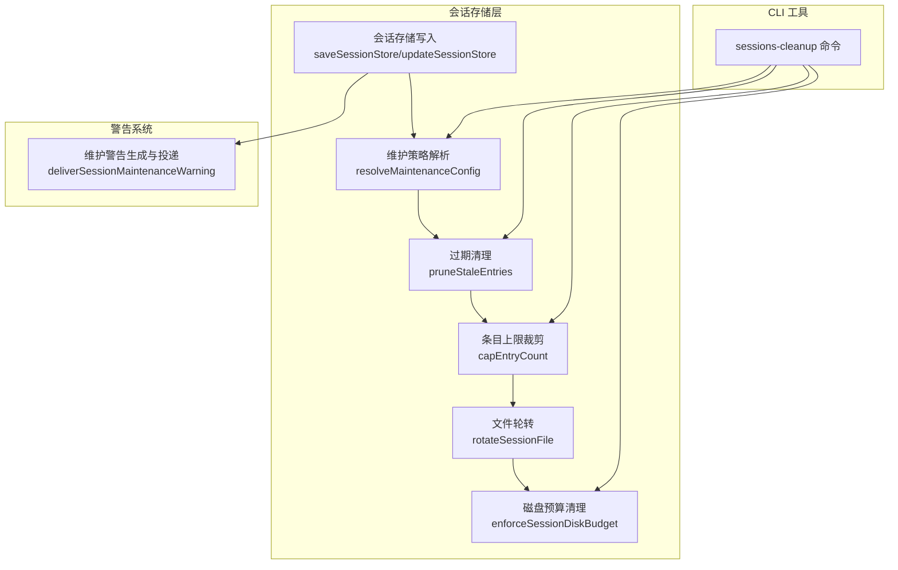
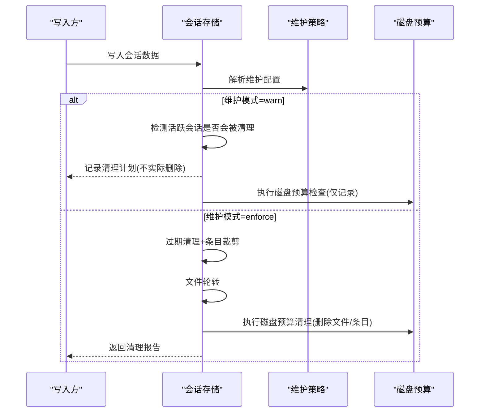
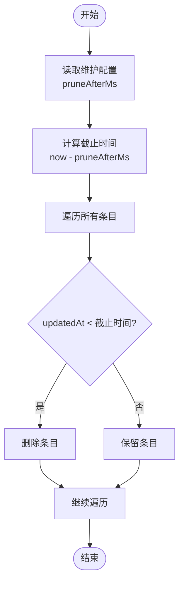
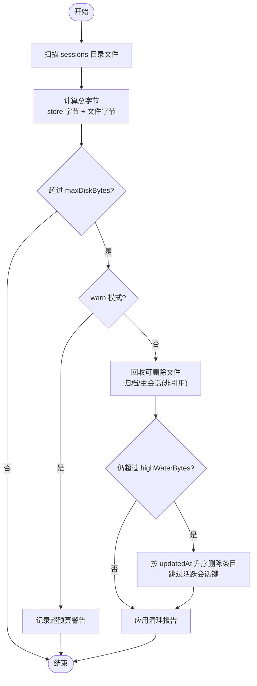
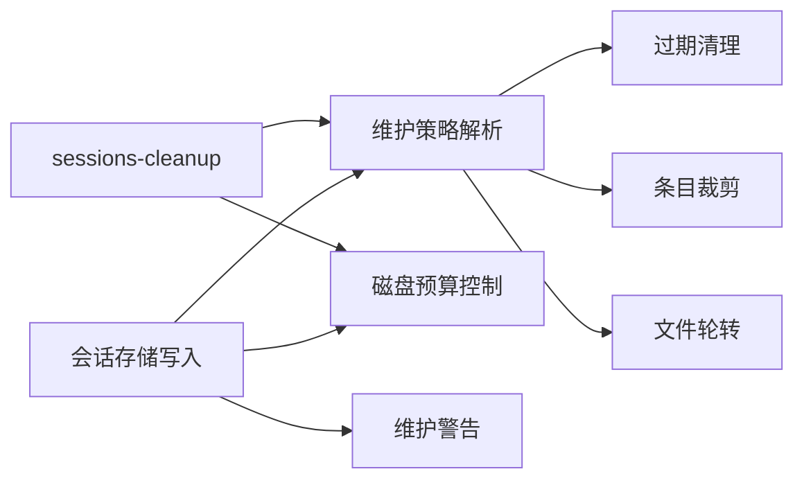

# 会话维护

<cite>
**本文档引用的文件**
- [src/config/sessions/store.ts](file://src/config/sessions/store.ts)
- [src/config/sessions/store-maintenance.ts](file://src/config/sessions/store-maintenance.ts)
- [src/config/sessions/disk-budget.ts](file://src/config/sessions/disk-budget.ts)
- [src/infra/session-maintenance-warning.ts](file://src/infra/session-maintenance-warning.ts)
- [src/commands/sessions-cleanup.ts](file://src/commands/sessions-cleanup.ts)
- [src/config/types.base.ts](file://src/config/types.base.ts)
- [src/config/sessions/store.pruning.test.ts](file://src/config/sessions/store.pruning.test.ts)
- [docs/gateway/configuration-reference.md](file://docs/gateway/configuration-reference.md)
</cite>

## 目录
1. [简介](#简介)
2. [项目结构](#项目结构)
3. [核心组件](#核心组件)
4. [架构总览](#架构总览)
5. [详细组件分析](#详细组件分析)
6. [依赖关系分析](#依赖关系分析)
7. [性能考量](#性能考量)
8. [故障排除指南](#故障排除指南)
9. [结论](#结论)
10. [附录](#附录)

## 简介
本文件系统性阐述会话维护体系的设计与实现，覆盖以下主题：
- 自动清理机制：过期会话删除、条目数量限制、文件大小轮转
- 维护模式差异：warn 与 enforce 的行为边界与适用场景
- 磁盘空间预算管理：高水位线与低水位线控制策略
- 配置参数详解：pruneAfter、maxEntries、rotateBytes、maxDiskBytes、highWaterBytes 等
- 性能调优建议与日志分析方法
- 故障排除与常见问题定位

## 项目结构
会话维护相关代码主要分布在以下模块：
- 会话存储与写入流程：负责加载、维护、序列化会话数据，并在写入前执行清理与轮转
- 维护策略解析与执行：解析配置、计算阈值、执行过期清理、条目上限裁剪、文件轮转
- 磁盘预算控制：按目录维度统计空间占用，超过预算时按策略回收文件与条目
- 警告投递：当维护模式为 warn 且可能影响活跃会话时，向用户渠道投递维护警告
- CLI 清理命令：提供预演与应用清理的能力，支持 JSON 输出与多代理目标

图表来源
- [src/config/sessions/store.ts:340-509](file://src/config/sessions/store.ts#L340-L509)
- [src/config/sessions/store-maintenance.ts:130-148](file://src/config/sessions/store-maintenance.ts#L130-L148)
- [src/config/sessions/disk-budget.ts:188-375](file://src/config/sessions/disk-budget.ts#L188-L375)
- [src/infra/session-maintenance-warning.ts:75-122](file://src/infra/session-maintenance-warning.ts#L75-L122)
- [src/commands/sessions-cleanup.ts:293-468](file://src/commands/sessions-cleanup.ts#L293-L468)

章节来源
- [src/config/sessions/store.ts:340-509](file://src/config/sessions/store.ts#L340-L509)
- [src/config/sessions/store-maintenance.ts:130-148](file://src/config/sessions/store-maintenance.ts#L130-L148)
- [src/config/sessions/disk-budget.ts:188-375](file://src/config/sessions/disk-budget.ts#L188-L375)
- [src/infra/session-maintenance-warning.ts:75-122](file://src/infra/session-maintenance-warning.ts#L75-L122)
- [src/commands/sessions-cleanup.ts:293-468](file://src/commands/sessions-cleanup.ts#L293-L468)

## 核心组件
- 维护策略解析器：从配置中解析 pruneAfter、maxEntries、rotateBytes、maxDiskBytes、highWaterBytes 等参数，并提供默认值
- 过期清理器：移除 updatedAt 早于阈值的会话条目
- 条目上限裁剪器：仅保留最近更新的 N 个条目
- 文件轮转器：当 sessions.json 超过 rotateBytes 时重命名为 .bak.{timestamp}，并清理旧备份
- 磁盘预算控制器：统计 sessions 目录总字节，超过 maxDiskBytes 后按高水位线策略回收
- 维护警告投递器：warn 模式下对可能影响活跃会话的清理进行告警
- CLI 清理命令：提供预演与应用清理，输出 JSON 报告

章节来源
- [src/config/sessions/store-maintenance.ts:38-148](file://src/config/sessions/store-maintenance.ts#L38-L148)
- [src/config/sessions/store.ts:340-509](file://src/config/sessions/store.ts#L340-L509)
- [src/config/sessions/disk-budget.ts:188-375](file://src/config/sessions/disk-budget.ts#L188-L375)
- [src/infra/session-maintenance-warning.ts:75-122](file://src/infra/session-maintenance-warning.ts#L75-L122)
- [src/commands/sessions-cleanup.ts:293-468](file://src/commands/sessions-cleanup.ts#L293-L468)

## 架构总览
会话写入路径在保存前执行“维护三件套”：过期清理、条目裁剪、文件轮转；随后根据配置决定是否执行磁盘预算清理。若维护模式为 warn 且检测到可能影响活跃会话的清理，将发出维护警告。

图表来源
- [src/config/sessions/store.ts:340-509](file://src/config/sessions/store.ts#L340-L509)
- [src/config/sessions/store-maintenance.ts:130-148](file://src/config/sessions/store-maintenance.ts#L130-L148)
- [src/config/sessions/disk-budget.ts:188-375](file://src/config/sessions/disk-budget.ts#L188-L375)

## 详细组件分析

### 维护模式与适用场景
- warn 模式
  - 不实际删除条目或文件，仅记录清理计划
  - 若检测到可能影响活跃会话，会投递维护警告
  - 适合生产环境的“观察式”维护，避免误删
- enforce 模式
  - 实际执行过期清理、条目裁剪、文件轮转与磁盘预算清理
  - 删除旧文件与过期条目，确保不超过配置阈值
  - 适合需要严格控制资源占用的场景

章节来源
- [src/config/sessions/store.ts:353-392](file://src/config/sessions/store.ts#L353-L392)
- [src/infra/session-maintenance-warning.ts:75-122](file://src/infra/session-maintenance-warning.ts#L75-L122)
- [docs/gateway/configuration-reference.md:1612-1619](file://docs/gateway/configuration-reference.md#L1612-L1619)

### 过期会话删除（pruneAfter）
- 触发条件：条目的 updatedAt 早于当前时间减去 pruneAfterMs
- 行为：原地删除满足条件的条目，可选回调通知被删除条目
- 默认值：30 天
- 单元测试验证：移除早于阈值的条目，保留较新的条目

图表来源
- [src/config/sessions/store-maintenance.ts:155-174](file://src/config/sessions/store-maintenance.ts#L155-L174)
- [src/config/sessions/store.pruning.test.ts:34-48](file://src/config/sessions/store.pruning.test.ts#L34-L48)

章节来源
- [src/config/sessions/store-maintenance.ts:155-174](file://src/config/sessions/store-maintenance.ts#L155-L174)
- [src/config/sessions/store.pruning.test.ts:34-48](file://src/config/sessions/store.pruning.test.ts#L34-L48)

### 条目数量限制（maxEntries）
- 触发条件：条目总数超过 maxEntries
- 排序规则：按 updatedAt 降序，未提供 updatedAt 的条目排最后（优先删除）
- 行为：删除超出部分条目，保留最新 N 个
- 默认值：500

章节来源
- [src/config/sessions/store-maintenance.ts:226-259](file://src/config/sessions/store-maintenance.ts#L226-L259)
- [src/config/sessions/store.pruning.test.ts:50-71](file://src/config/sessions/store.pruning.test.ts#L50-L71)

### 文件大小轮转（rotateBytes）
- 触发条件：sessions.json 文件大小超过 rotateBytes
- 行为：将当前文件重命名为 sessions.json.bak.{timestamp}，清理旧备份，最多保留最近 3 份
- 默认值：10 MB
- 测试验证：超过阈值触发轮转，仅保留最多 3 份 .bak 文件

章节来源
- [src/config/sessions/store-maintenance.ts:275-327](file://src/config/sessions/store-maintenance.ts#L275-L327)
- [src/config/sessions/store.pruning.test.ts:73-115](file://src/config/sessions/store.pruning.test.ts#L73-L115)

### 磁盘空间预算管理（maxDiskBytes 与 highWaterBytes）
- 预算范围：以 sessions 目录为单位统计总字节（含内存中的 JSON 字节估算）
- 超预算处理：
  - warn 模式：仅记录超预算状态，不删除任何内容
  - enforce 模式：先删除可回收的归档与主会话文件，再按 updatedAt 升序删除最老条目，直至达到 highWaterBytes
- 高水位线保护：清理后仍超过 highWaterBytes 将发出警告
- 默认高水位线：maxDiskBytes 的 80%

图表来源
- [src/config/sessions/disk-budget.ts:188-375](file://src/config/sessions/disk-budget.ts#L188-L375)
- [src/config/sessions/store.ts:438-454](file://src/config/sessions/store.ts#L438-L454)

章节来源
- [src/config/sessions/disk-budget.ts:188-375](file://src/config/sessions/disk-budget.ts#L188-L375)
- [src/config/sessions/store.ts:438-454](file://src/config/sessions/store.ts#L438-L454)

### 活跃会话保护与维护警告
- 当维护模式为 warn 且检测到活跃会话键可能被清理时，生成警告对象并投递
- 警告文本包含清理原因（过期或超出条目上限），并提示如何切换到 enforce 或调整阈值
- 警告投递遵循渠道可投递性，不可投递时回退至系统事件

章节来源
- [src/config/sessions/store.ts:353-392](file://src/config/sessions/store.ts#L353-L392)
- [src/infra/session-maintenance-warning.ts:75-122](file://src/infra/session-maintenance-warning.ts#L75-L122)

### CLI 清理命令（sessions-cleanup）
- 支持预演（dry-run）与应用两种模式，输出表格化清理计划
- 可选择修复缺失的会话文件引用、设置活跃会话键、强制 enforce 模式
- JSON 输出用于自动化集成，包含清理摘要与每处存储的清理结果

章节来源
- [src/commands/sessions-cleanup.ts:293-468](file://src/commands/sessions-cleanup.ts#L293-L468)

## 依赖关系分析
- 会话存储写入依赖维护策略解析器与磁盘预算控制器
- 过期清理与条目裁剪依赖配置解析器提供的阈值
- 文件轮转独立于配置解析器，直接读取 rotateBytes
- 维护警告依赖会话条目与交付目标解析
- CLI 命令同时依赖维护策略与磁盘预算接口，用于预演与应用

图表来源
- [src/config/sessions/store.ts:340-509](file://src/config/sessions/store.ts#L340-L509)
- [src/config/sessions/store-maintenance.ts:130-148](file://src/config/sessions/store-maintenance.ts#L130-L148)
- [src/config/sessions/disk-budget.ts:188-375](file://src/config/sessions/disk-budget.ts#L188-L375)
- [src/commands/sessions-cleanup.ts:293-468](file://src/commands/sessions-cleanup.ts#L293-L468)

章节来源
- [src/config/sessions/store.ts:340-509](file://src/config/sessions/store.ts#L340-L509)
- [src/config/sessions/store-maintenance.ts:130-148](file://src/config/sessions/store-maintenance.ts#L130-L148)
- [src/config/sessions/disk-budget.ts:188-375](file://src/config/sessions/disk-budget.ts#L188-L375)
- [src/commands/sessions-cleanup.ts:293-468](file://src/commands/sessions-cleanup.ts#L293-L468)

## 性能考量
- 维护操作复杂度
  - 过期清理：O(N) 遍历条目
  - 条目裁剪：O(N log N) 排序 + O(K) 删除 K 个条目
  - 文件轮转：O(1) 重命名 + 最多 O(B) 清理旧备份（B≤3）
  - 磁盘预算：O(F) 列举文件 + O(F log F) 排序 + O(E) 删除条目（E 为待删条目数）
- I/O 优化
  - sessions.json 写入采用原子写，减少并发读取到空文件的概率
  - Windows 平台具备重试与回退逻辑，提升稳定性
- 缓存与一致性
  - 会话存储具备 TTL 缓存，降低重复解析成本
  - 写入前后更新缓存，保证后续读取一致性

[本节为通用性能讨论，无需特定文件引用]

## 故障排除指南
- 维护模式为 warn 但活跃会话被清理
  - 现象：日志提示“维护将清理活跃会话，跳过执行”
  - 处理：将 session.maintenance.mode 设为 enforce，或增大 pruneAfter 与 maxEntries
- 磁盘预算持续超限
  - 现象：清理后仍超过 highWaterBytes，出现“清理后仍高于高水位”警告
  - 处理：提高 maxDiskBytes 或降低 highWaterBytes；检查是否存在大量未引用的归档文件
- 文件轮转未生效
  - 现象：sessions.json 体积持续增长
  - 处理：确认 rotateBytes 设置合理；检查文件权限与磁盘空间
- CLI 预演与实际应用不一致
  - 现象：预演显示将删除，但实际未删除
  - 处理：确认运行模式（dry-run vs 应用）与维护模式（warn/enforce）

章节来源
- [src/config/sessions/store.ts:353-392](file://src/config/sessions/store.ts#L353-L392)
- [src/config/sessions/disk-budget.ts:342-363](file://src/config/sessions/disk-budget.ts#L342-L363)
- [src/config/sessions/store-maintenance.ts:275-327](file://src/config/sessions/store-maintenance.ts#L275-L327)
- [src/commands/sessions-cleanup.ts:325-361](file://src/commands/sessions-cleanup.ts#L325-L361)

## 结论
会话维护系统通过“过期清理 + 条目裁剪 + 文件轮转 + 磁盘预算”的组合拳，在保证活跃会话稳定的同时，有效控制资源占用。warn 模式适用于观察与演练，enforce 模式适用于强约束场景。配合 CLI 预演与 JSON 报告，可安全地进行自动化维护。

[本节为总结性内容，无需特定文件引用]

## 附录

### 配置参数与默认值
- mode：维护模式，默认 "warn"
- pruneAfter：过期阈值，默认 "30d"
- maxEntries：条目上限，默认 500
- rotateBytes：文件轮转阈值，默认 "10mb"
- resetArchiveRetention：重置归档保留周期，默认同 pruneAfter
- maxDiskBytes：目录级磁盘预算，默认无
- highWaterBytes：高水位线，默认 80% 的 maxDiskBytes

章节来源
- [src/config/types.base.ts:140-166](file://src/config/types.base.ts#L140-L166)
- [src/config/sessions/store-maintenance.ts:38-124](file://src/config/sessions/store-maintenance.ts#L38-L124)
- [docs/gateway/configuration-reference.md:1612-1619](file://docs/gateway/configuration-reference.md#L1612-L1619)