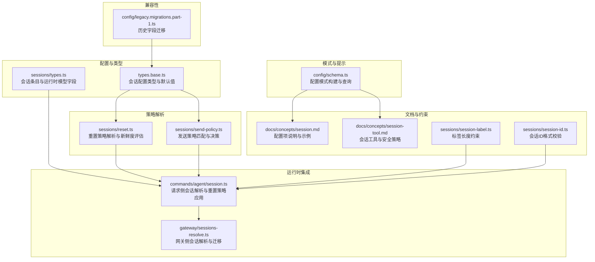
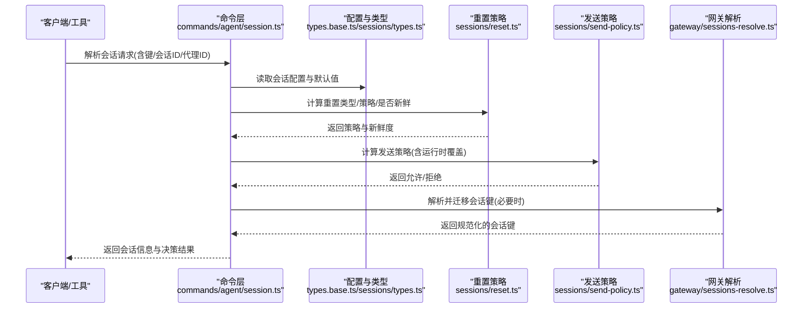
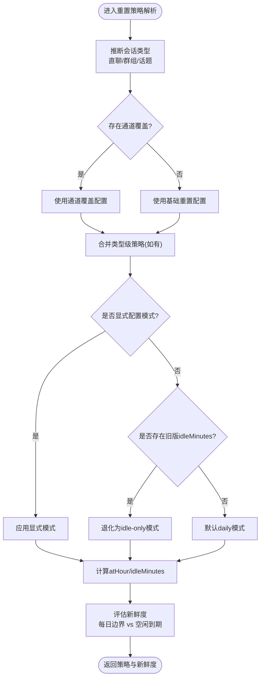
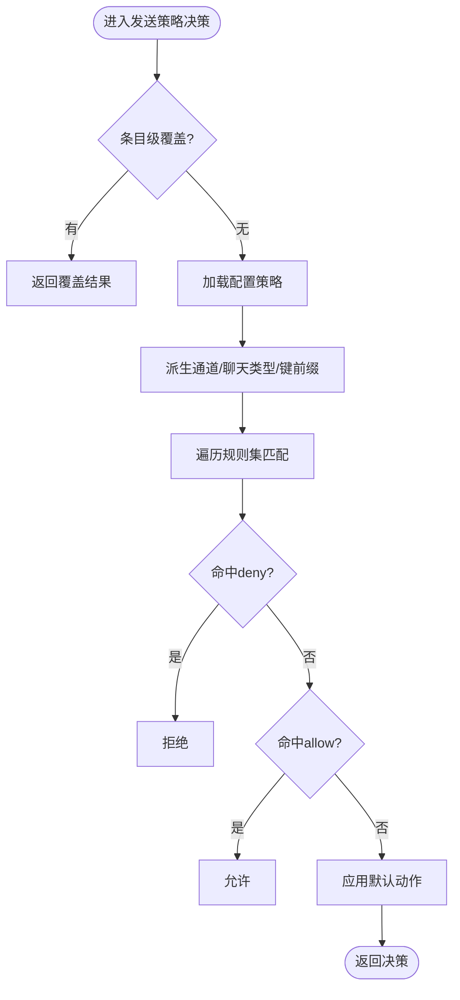
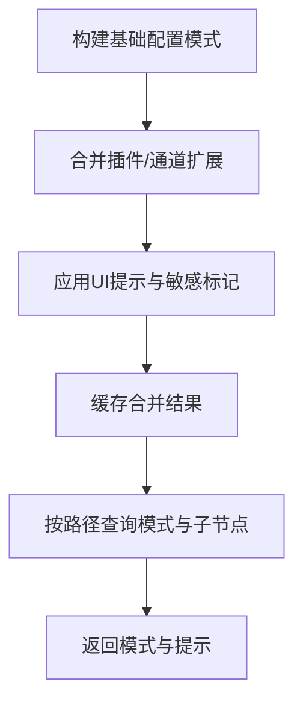
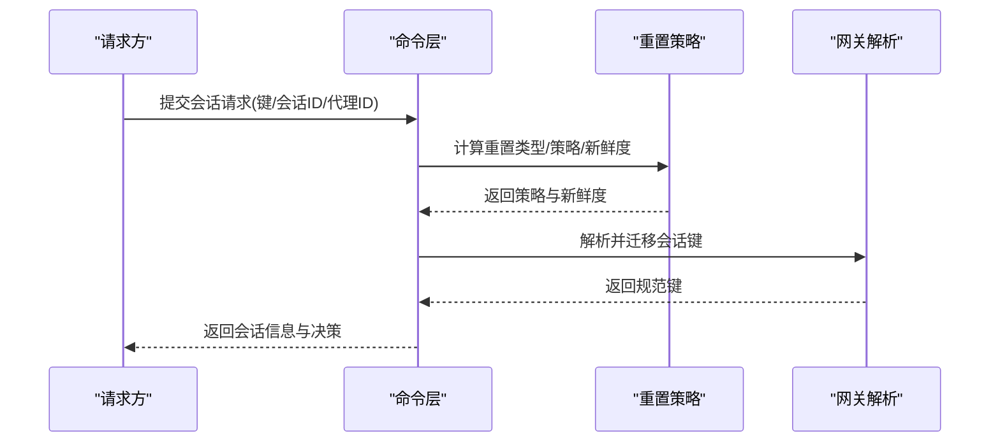
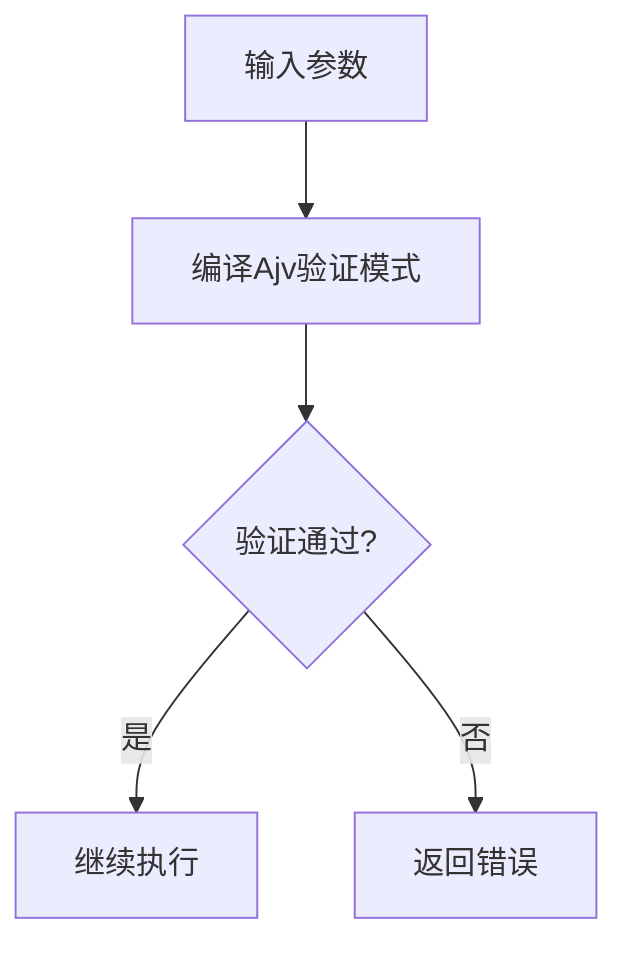
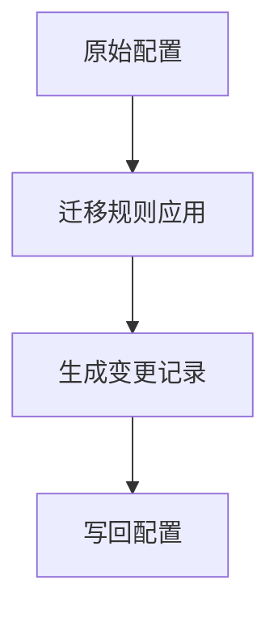
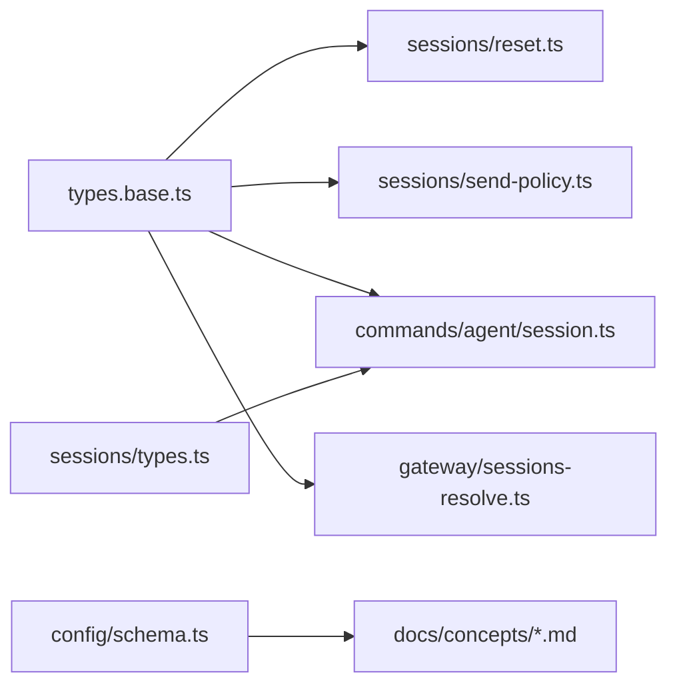

# 会话配置

<cite>
**本文引用的文件**
- [src/config/types.base.ts](file://src/config/types.base.ts)
- [src/config/sessions/types.ts](file://src/config/sessions/types.ts)
- [src/config/sessions/reset.ts](file://src/config/sessions/reset.ts)
- [src/sessions/send-policy.ts](file://src/sessions/send-policy.ts)
- [src/config/schema.ts](file://src/config/schema.ts)
- [docs/concepts/session.md](file://docs/concepts/session.md)
- [docs/concepts/session-tool.md](file://docs/concepts/session-tool.md)
- [src/commands/agent/session.ts](file://src/commands/agent/session.ts)
- [src/gateway/sessions-resolve.ts](file://src/gateway/sessions-resolve.ts)
- [src/sessions/session-label.ts](file://src/sessions/session-label.ts)
- [src/sessions/session-id.ts](file://src/sessions/session-id.ts)
- [src/gateway/protocol/index.ts](file://src/gateway/protocol/index.ts)
- [src/config/legacy.migrations.part-1.ts](file://src/config/legacy.migrations.part-1.ts)
</cite>

## 目录
1. [简介](#简介)
2. [项目结构](#项目结构)
3. [核心组件](#核心组件)
4. [架构总览](#架构总览)
5. [详细组件分析](#详细组件分析)
6. [依赖关系分析](#依赖关系分析)
7. [性能考量](#性能考量)
8. [故障排查指南](#故障排查指南)
9. [结论](#结论)
10. [附录](#附录)

## 简介
本文件系统化梳理 OpenClaw 的会话配置体系，围绕“会话作用域、重置策略、发送策略、存储与维护、运行时更新与迁移”等主题，给出配置项定义、解析流程、最佳实践与排障建议。目标读者既包括需要快速上手的使用者，也包括希望深入理解实现细节的工程师。

## 项目结构
与会话配置直接相关的关键模块分布如下：
- 配置类型与默认值：定义在基础类型与会话专用类型中
- 重置策略解析：集中于会话重置工具函数
- 发送策略决策：集中于会话发送策略模块
- 配置模式与 UI 提示：构建与查询配置模式
- 文档规范：概念文档对配置项进行说明与示例
- 运行时解析与调用：命令层与网关层的集成点
- 兼容性迁移：历史字段迁移逻辑

**图表来源**
- [src/config/types.base.ts](file://src/config/types.base.ts)
- [src/config/sessions/types.ts](file://src/config/sessions/types.ts)
- [src/config/sessions/reset.ts](file://src/config/sessions/reset.ts)
- [src/sessions/send-policy.ts](file://src/sessions/send-policy.ts)
- [src/config/schema.ts](file://src/config/schema.ts)
- [docs/concepts/session.md](file://docs/concepts/session.md)
- [docs/concepts/session-tool.md](file://docs/concepts/session-tool.md)
- [src/commands/agent/session.ts](file://src/commands/agent/session.ts)
- [src/gateway/sessions-resolve.ts](file://src/gateway/sessions-resolve.ts)
- [src/sessions/session-label.ts](file://src/sessions/session-label.ts)
- [src/sessions/session-id.ts](file://src/sessions/session-id.ts)
- [src/config/legacy.migrations.part-1.ts](file://src/config/legacy.migrations.part-1.ts)

**章节来源**
- [src/config/types.base.ts](file://src/config/types.base.ts)
- [src/config/sessions/types.ts](file://src/config/sessions/types.ts)
- [src/config/sessions/reset.ts](file://src/config/sessions/reset.ts)
- [src/sessions/send-policy.ts](file://src/sessions/send-policy.ts)
- [src/config/schema.ts](file://src/config/schema.ts)
- [docs/concepts/session.md](file://docs/concepts/session.md)
- [docs/concepts/session-tool.md](file://docs/concepts/session-tool.md)
- [src/commands/agent/session.ts](file://src/commands/agent/session.ts)
- [src/gateway/sessions-resolve.ts](file://src/gateway/sessions-resolve.ts)
- [src/sessions/session-label.ts](file://src/sessions/session-label.ts)
- [src/sessions/session-id.ts](file://src/sessions/session-id.ts)
- [src/config/legacy.migrations.part-1.ts](file://src/config/legacy.migrations.part-1.ts)

## 核心组件
- 会话配置类型与默认值
  - 定义会话作用域、DM 作用域、重置策略、发送策略、维护策略、主键与存储路径等关键字段
  - 默认重置触发器、默认空闲分钟数等常量
- 重置策略解析
  - 支持按类型（直聊/群组/话题）、按通道、按覆盖策略计算最终重置策略
  - 计算会话是否“新鲜”，决定是否复用或重置
- 发送策略决策
  - 基于规则集与默认动作，按通道、聊天类型、键前缀等匹配，支持运行时覆盖
- 配置模式与 UI 提示
  - 构建可合并的配置模式，支持插件与通道扩展，并生成 UI 提示
- 运行时集成
  - 请求侧根据策略解析会话键与会话 ID；网关侧负责解析与迁移
- 兼容性迁移
  - 将历史字段迁移到新字段，保证配置演进的平滑过渡

**章节来源**
- [src/config/types.base.ts](file://src/config/types.base.ts)
- [src/config/sessions/types.ts](file://src/config/sessions/types.ts)
- [src/config/sessions/reset.ts](file://src/config/sessions/reset.ts)
- [src/sessions/send-policy.ts](file://src/sessions/send-policy.ts)
- [src/config/schema.ts](file://src/config/schema.ts)
- [src/commands/agent/session.ts](file://src/commands/agent/session.ts)
- [src/gateway/sessions-resolve.ts](file://src/gateway/sessions-resolve.ts)
- [src/config/legacy.migrations.part-1.ts](file://src/config/legacy.migrations.part-1.ts)

## 架构总览
下图展示从请求到会话解析、重置策略评估与发送策略决策的整体流程，以及与配置模式、网关解析的关系。

**图表来源**
- [src/commands/agent/session.ts](file://src/commands/agent/session.ts)
- [src/config/types.base.ts](file://src/config/types.base.ts)
- [src/config/sessions/types.ts](file://src/config/sessions/types.ts)
- [src/config/sessions/reset.ts](file://src/config/sessions/reset.ts)
- [src/sessions/send-policy.ts](file://src/sessions/send-policy.ts)
- [src/gateway/sessions-resolve.ts](file://src/gateway/sessions-resolve.ts)

## 详细组件分析

### 组件A：会话重置策略
- 功能要点
  - 按会话键、消息线程标记、显式线程标志推断会话类型（直聊/群组/话题）
  - 支持按类型覆盖（direct/group/thread）与按通道覆盖（如 Discord 的长空闲窗口）
  - 兼容旧版 idleMinutes 设置，若未显式配置则退化为 idle-only 模式
  - 计算“新鲜度”：每日边界与滑动空闲过期时间，二者取先到期者
- 关键流程

**图表来源**
- [src/config/sessions/reset.ts](file://src/config/sessions/reset.ts)
- [src/config/sessions/types.ts](file://src/config/sessions/types.ts)

**章节来源**
- [src/config/sessions/reset.ts](file://src/config/sessions/reset.ts)
- [src/config/sessions/types.ts](file://src/config/sessions/types.ts)

### 组件B：会话发送策略
- 功能要点
  - 规则集支持按通道、聊天类型、键前缀（含原始键前缀）匹配
  - 支持运行时覆盖（每个会话条目可独立设置 allow/deny/继承）
  - 决策顺序：优先检查条目级覆盖，其次配置规则，最后默认动作
- 关键流程

**图表来源**
- [src/sessions/send-policy.ts](file://src/sessions/send-policy.ts)

**章节来源**
- [src/sessions/send-policy.ts](file://src/sessions/send-policy.ts)

### 组件C：配置模式与 UI 提示
- 功能要点
  - 构建基础配置模式，支持插件与通道扩展合并
  - 生成 UI 提示（标签、帮助、敏感字段标记等），并缓存以提升性能
  - 提供配置模式查询能力，支持通配符与子节点枚举
- 关键流程

**图表来源**
- [src/config/schema.ts](file://src/config/schema.ts)

**章节来源**
- [src/config/schema.ts](file://src/config/schema.ts)

### 组件D：运行时会话解析与重置
- 功能要点
  - 命令层根据策略解析会话键与会话 ID，必要时生成新 ID
  - 结合重置策略评估会话是否新鲜，决定复用或重置
  - 网关侧负责会话键规范化与迁移（含历史键映射）
- 关键流程

**图表来源**
- [src/commands/agent/session.ts](file://src/commands/agent/session.ts)
- [src/config/sessions/reset.ts](file://src/config/sessions/reset.ts)
- [src/gateway/sessions-resolve.ts](file://src/gateway/sessions-resolve.ts)

**章节来源**
- [src/commands/agent/session.ts](file://src/commands/agent/session.ts)
- [src/gateway/sessions-resolve.ts](file://src/gateway/sessions-resolve.ts)
- [src/config/sessions/reset.ts](file://src/config/sessions/reset.ts)

### 组件E：配置验证与协议
- 功能要点
  - 使用 Ajv 编译配置参数的验证模式（如 sessions.list/sessions.send 等）
  - 在网关层对配置变更与查询进行参数校验
- 关键流程

**图表来源**
- [src/gateway/protocol/index.ts](file://src/gateway/protocol/index.ts)

**章节来源**
- [src/gateway/protocol/index.ts](file://src/gateway/protocol/index.ts)

### 组件F：兼容性迁移
- 功能要点
  - 将历史字段（如 provider 匹配迁移到 channel）等进行迁移
  - 保持配置演进的向后兼容
- 关键流程

**图表来源**
- [src/config/legacy.migrations.part-1.ts](file://src/config/legacy.migrations.part-1.ts)

**章节来源**
- [src/config/legacy.migrations.part-1.ts](file://src/config/legacy.migrations.part-1.ts)

## 依赖关系分析
- 类型与策略
  - 会话配置类型被重置策略与发送策略共同依赖
  - 会话条目类型影响运行时合并与新鲜度判断
- 运行时集成
  - 命令层依赖类型与策略模块完成解析
  - 网关层负责键规范化与迁移
- 模式与提示
  - 配置模式构建与查询服务于 UI 与 CLI

**图表来源**
- [src/config/types.base.ts](file://src/config/types.base.ts)
- [src/config/sessions/types.ts](file://src/config/sessions/types.ts)
- [src/config/sessions/reset.ts](file://src/config/sessions/reset.ts)
- [src/sessions/send-policy.ts](file://src/sessions/send-policy.ts)
- [src/commands/agent/session.ts](file://src/commands/agent/session.ts)
- [src/gateway/sessions-resolve.ts](file://src/gateway/sessions-resolve.ts)
- [src/config/schema.ts](file://src/config/schema.ts)
- [docs/concepts/session.md](file://docs/concepts/session.md)
- [docs/concepts/session-tool.md](file://docs/concepts/session-tool.md)

**章节来源**
- [src/config/types.base.ts](file://src/config/types.base.ts)
- [src/config/sessions/types.ts](file://src/config/sessions/types.ts)
- [src/config/sessions/reset.ts](file://src/config/sessions/reset.ts)
- [src/sessions/send-policy.ts](file://src/sessions/send-policy.ts)
- [src/commands/agent/session.ts](file://src/commands/agent/session.ts)
- [src/gateway/sessions-resolve.ts](file://src/gateway/sessions-resolve.ts)
- [src/config/schema.ts](file://src/config/schema.ts)
- [docs/concepts/session.md](file://docs/concepts/session.md)
- [docs/concepts/session-tool.md](file://docs/concepts/session-tool.md)

## 性能考量
- 大规模会话存储
  - 维护策略（修剪、上限、轮转、磁盘预算）直接影响写入延迟
  - 建议启用强制模式并在生产环境设置时间与数量双重限制
- 重置策略
  - 同时配置 daily 与 idle 时，二者取先到期者，避免不必要的会话复用
- 发送策略
  - 规则匹配按顺序遍历，建议精简规则集并合理使用默认动作

[本节为通用指导，无需特定文件来源]

## 故障排查指南
- 会话键解析失败
  - 确认键是否存在于会话存储；网关层会尝试迁移历史键
  - 参考：[会话解析与迁移](file://src/gateway/sessions-resolve.ts)
- 会话未按预期重置
  - 检查是否配置了 per-channel 覆盖或 per-type 覆盖
  - 确认 atHour 与 idleMinutes 是否符合预期
  - 参考：[重置策略解析](file://src/config/sessions/reset.ts)
- 发送被意外阻止
  - 检查 sendPolicy 规则与默认动作；确认条目级覆盖
  - 参考：[发送策略决策](file://src/sessions/send-policy.ts)
- 配置变更不生效
  - 确认配置模式构建与缓存；必要时清理缓存或重启服务
  - 参考：[配置模式构建](file://src/config/schema.ts)
- 历史字段导致策略异常
  - 执行迁移脚本或手动修正配置
  - 参考：[兼容性迁移](file://src/config/legacy.migrations.part-1.ts)

**章节来源**
- [src/gateway/sessions-resolve.ts](file://src/gateway/sessions-resolve.ts)
- [src/config/sessions/reset.ts](file://src/config/sessions/reset.ts)
- [src/sessions/send-policy.ts](file://src/sessions/send-policy.ts)
- [src/config/schema.ts](file://src/config/schema.ts)
- [src/config/legacy.migrations.part-1.ts](file://src/config/legacy.migrations.part-1.ts)

## 结论
会话配置系统通过“类型定义—策略解析—运行时集成—模式与提示—兼容性迁移”的完整链路，实现了灵活且可演进的会话管理能力。遵循本文的最佳实践与排障建议，可在多用户共享邮箱、多账户管理等复杂场景下获得稳定可靠的会话行为。

[本节为总结，无需特定文件来源]

## 附录

### A. 配置文件结构与关键字段
- 会话作用域与 DM 作用域
  - scope：per-sender/global
  - dmScope：main/per-peer/per-channel-peer/per-account-channel-peer
  - identityLinks：将平台前缀身份映射到统一 DM 对端
- 重置策略
  - reset：mode（daily/idle）、atHour、idleMinutes
  - resetByType：direct/group/thread 的类型级覆盖
  - resetByChannel：按通道覆盖
  - resetTriggers：触发重置的消息指令列表
  - idleMinutes：旧版空闲重置（兼容）
- 发送策略
  - sendPolicy：rules（action/match）、default
  - 支持按通道、聊天类型、键前缀匹配
- 存储与维护
  - store：会话存储路径
  - maintenance：mode、pruneAfter、maxEntries、rotateBytes、resetArchiveRetention、maxDiskBytes、highWaterBytes
- 主键与运行时
  - mainKey：主会话键名
  - typingIntervalSeconds、typingMode：打字模拟
  - agentToAgent：跨会话交互限制
  - threadBindings：线程绑定路由的全局默认
  - parentForkMaxTokens：父 fork 上下文保护阈值

**章节来源**
- [src/config/types.base.ts](file://src/config/types.base.ts)
- [src/config/sessions/types.ts](file://src/config/sessions/types.ts)
- [docs/concepts/session.md](file://docs/concepts/session.md)

### B. 环境变量与运行时配置更新
- 环境变量覆盖
  - 通过配置模式与 UI 提示，结合运行时注入实现环境变量覆盖
- 运行时更新机制
  - 通过 sessions.patch 或 owner-only 指令（如 /send on/off/inherit）对单个会话进行运行时覆盖
  - 会话工具（sessions_list/sessions_history/sessions_send/sessions_spawn）支持按需访问与跨会话交互

**章节来源**
- [src/sessions/send-policy.ts](file://src/sessions/send-policy.ts)
- [docs/concepts/session-tool.md](file://docs/concepts/session-tool.md)

### C. 不同场景下的最佳配置实践
- 单用户设置
  - 默认 dmScope(main) 即可；按需开启 idle 重置或调整 atHour
- 多用户共享邮箱
  - dmScope 设置为 per-channel-peer 或 per-account-channel-peer；配合 identityLinks 将同一人的多渠道身份归一
- 多账户管理
  - 使用 per-account-channel-peer；确保 accountId 正确传递
- 高频群聊
  - 为群组设置较短 idleMinutes 或仅使用 daily；必要时通过 resetByChannel 对特定通道放宽

**章节来源**
- [docs/concepts/session.md](file://docs/concepts/session.md)

### D. 配置验证与错误处理
- 参数验证
  - 使用 Ajv 编译的验证模式对配置参数进行校验
- 错误处理
  - 无效请求返回标准化错误形状；键不存在时返回明确错误
- 迁移与回滚
  - 历史字段迁移失败不影响运行，但建议尽快修复

**章节来源**
- [src/gateway/protocol/index.ts](file://src/gateway/protocol/index.ts)
- [src/gateway/sessions-resolve.ts](file://src/gateway/sessions-resolve.ts)
- [src/config/legacy.migrations.part-1.ts](file://src/config/legacy.migrations.part-1.ts)

### E. 配置模板与常见问题
- 配置模板
  - 参考概念文档中的示例，涵盖作用域、重置策略、发送策略与维护策略
- 常见问题
  - 会话键解析失败：检查键是否存在与迁移是否成功
  - 发送被阻止：检查 sendPolicy 规则与默认动作
  - 重置未生效：检查 per-type/per-channel 覆盖与 atHour/idleMinutes

**章节来源**
- [docs/concepts/session.md](file://docs/concepts/session.md)
- [docs/concepts/session-tool.md](file://docs/concepts/session-tool.md)