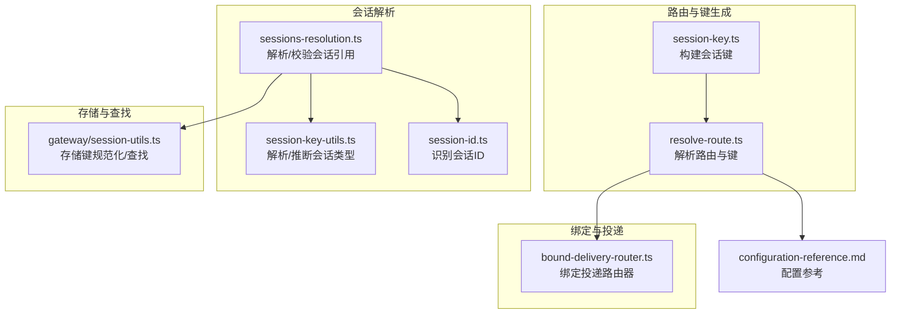
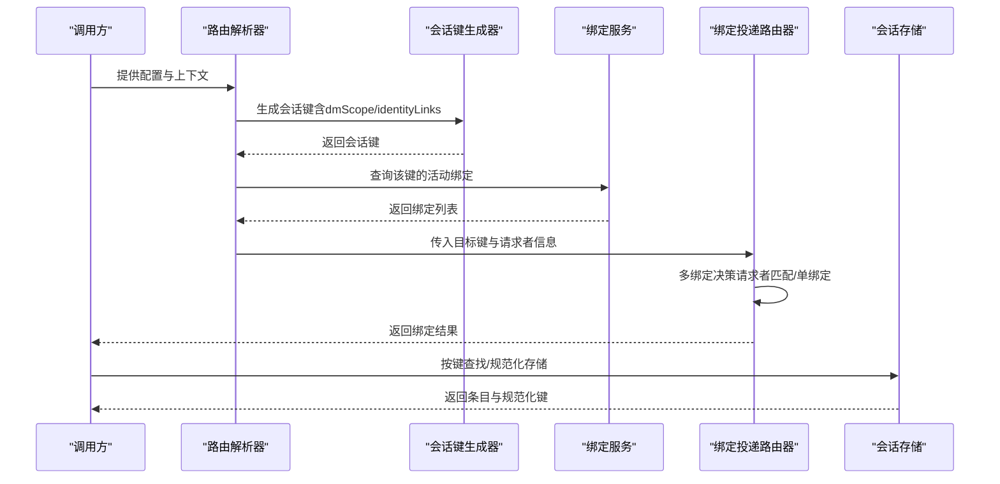
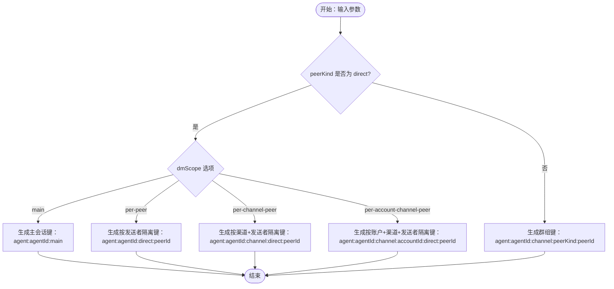
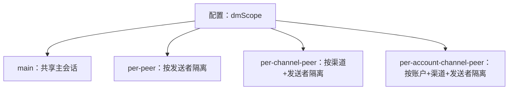
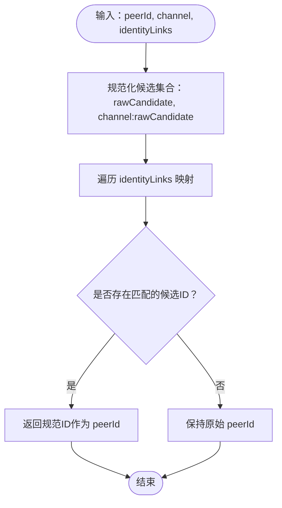
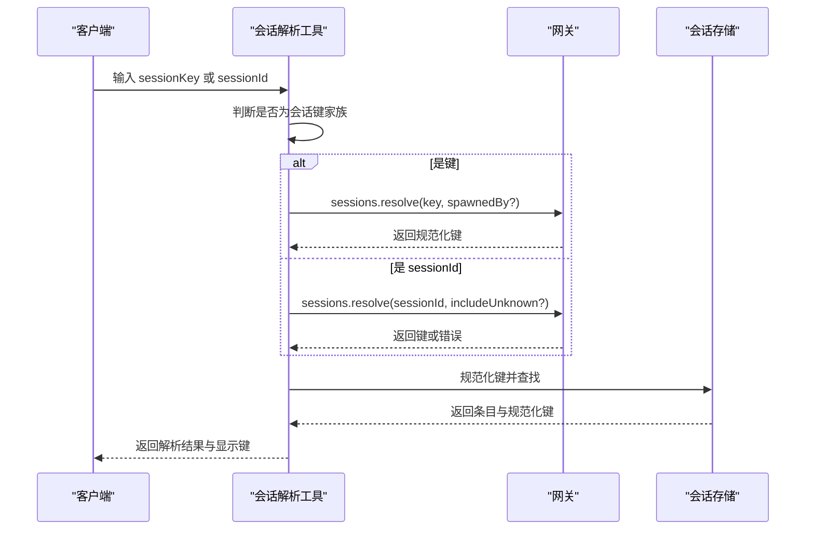
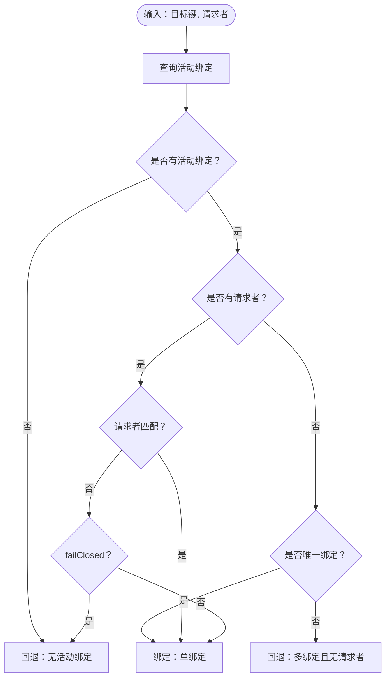
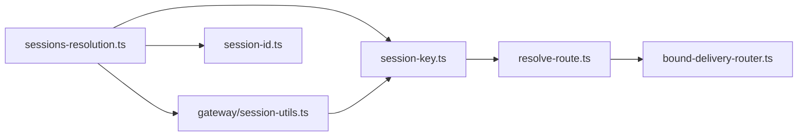

# 会话键管理

<cite>
**本文档引用的文件**
- [src/routing/session-key.ts](file://src/routing/session-key.ts)
- [src/routing/resolve-route.ts](file://src/routing/resolve-route.ts)
- [src/infra/outbound/bound-delivery-router.ts](file://src/infra/outbound/bound-delivery-router.ts)
- [src/agents/tools/sessions-resolution.ts](file://src/agents/tools/sessions-resolution.ts)
- [src/sessions/session-key-utils.ts](file://src/sessions/session-key-utils.ts)
- [src/sessions/session-id.ts](file://src/sessions/session-id.ts)
- [src/gateway/session-utils.ts](file://src/gateway/session-utils.ts)
- [docs/gateway/configuration-reference.md](file://docs/gateway/configuration-reference.md)
- [src/routing/session-key.continuity.test.ts](file://src/routing/session-key.continuity.test.ts)
- [src/routing/resolve-route.test.ts](file://src/routing/resolve-route.test.ts)
</cite>

## 目录
1. [简介](#简介)
2. [项目结构](#项目结构)
3. [核心组件](#核心组件)
4. [架构总览](#架构总览)
5. [详细组件分析](#详细组件分析)
6. [依赖关系分析](#依赖关系分析)
7. [性能考量](#性能考量)
8. [故障排查指南](#故障排查指南)
9. [结论](#结论)
10. [附录](#附录)

## 简介
本文件系统性阐述 OpenClaw 的会话键管理体系，覆盖以下主题：
- 会话键的生成规则与命名规范：包括直接聊天（DM）与群组聊天的键格式差异
- 会话作用域配置（dmScope）对会话隔离的影响：main、per-peer、per-channel-peer、per-account-channel-peer
- 身份链接（identityLinks）机制：将不同渠道的同一用户映射到统一会话
- 会话键的解析、验证与冲突处理机制
- 会话键配置的最佳实践与安全建议

## 项目结构
围绕会话键管理的关键模块分布如下：
- 路由与键生成：负责根据配置与输入参数生成会话键，并进行作用域隔离
- 绑定服务与投递路由：负责将消息绑定到具体会话并处理多绑定场景
- 会话解析工具：支持通过 sessionId 或键名解析目标会话
- 会话存储与查找：负责在会话存储中定位键、处理大小写与兼容键
- 配置参考：提供 dmScope 与 identityLinks 的官方说明

**图表来源**
- [src/routing/session-key.ts:127-174](file://src/routing/session-key.ts#L127-L174)
- [src/routing/resolve-route.ts:91-112](file://src/routing/resolve-route.ts#L91-L112)
- [src/infra/outbound/bound-delivery-router.ts:55-131](file://src/infra/outbound/bound-delivery-router.ts#L55-L131)
- [src/agents/tools/sessions-resolution.ts:260-300](file://src/agents/tools/sessions-resolution.ts#L260-L300)
- [src/sessions/session-key-utils.ts:12-59](file://src/sessions/session-key-utils.ts#L12-L59)
- [src/sessions/session-id.ts:1-5](file://src/sessions/session-id.ts#L1-L5)
- [src/gateway/session-utils.ts:180-217](file://src/gateway/session-utils.ts#L180-L217)
- [docs/gateway/configuration-reference.md:1599-1623](file://docs/gateway/configuration-reference.md#L1599-L1623)

**章节来源**
- [src/routing/session-key.ts:127-174](file://src/routing/session-key.ts#L127-L174)
- [src/routing/resolve-route.ts:91-112](file://src/routing/resolve-route.ts#L91-L112)
- [src/infra/outbound/bound-delivery-router.ts:55-131](file://src/infra/outbound/bound-delivery-router.ts#L55-L131)
- [src/agents/tools/sessions-resolution.ts:260-300](file://src/agents/tools/sessions-resolution.ts#L260-L300)
- [src/sessions/session-key-utils.ts:12-59](file://src/sessions/session-key-utils.ts#L12-L59)
- [src/sessions/session-id.ts:1-5](file://src/sessions/session-id.ts#L1-L5)
- [src/gateway/session-utils.ts:180-217](file://src/gateway/session-utils.ts#L180-L217)
- [docs/gateway/configuration-reference.md:1599-1623](file://docs/gateway/configuration-reference.md#L1599-L1623)

## 核心组件
- 会话键生成器：根据 agentId、channel、accountId、peerKind、peerId、dmScope、identityLinks 构建键；支持 DM 与群组键的差异化格式
- 路由解析器：结合配置与绑定规则选择合适的 agentId，并生成最终会话键
- 绑定投递路由器：在多绑定场景下选择最匹配的会话绑定，或回退到单绑定
- 会话解析工具：区分 sessionId 与键名，优先键解析，必要时回退到 sessionId 解析，并检查可见性
- 存储工具：规范化键、大小写不敏感查找、兼容旧键

**章节来源**
- [src/routing/session-key.ts:127-174](file://src/routing/session-key.ts#L127-L174)
- [src/routing/resolve-route.ts:614-692](file://src/routing/resolve-route.ts#L614-L692)
- [src/infra/outbound/bound-delivery-router.ts:55-131](file://src/infra/outbound/bound-delivery-router.ts#L55-L131)
- [src/agents/tools/sessions-resolution.ts:260-300](file://src/agents/tools/sessions-resolution.ts#L260-L300)
- [src/gateway/session-utils.ts:180-217](file://src/gateway/session-utils.ts#L180-L217)

## 架构总览
会话键管理贯穿“生成—解析—绑定—存储”链路，确保跨渠道、跨账户、跨会话的作用域隔离与一致性。

**图表来源**
- [src/routing/resolve-route.ts:614-692](file://src/routing/resolve-route.ts#L614-L692)
- [src/routing/session-key.ts:127-174](file://src/routing/session-key.ts#L127-L174)
- [src/infra/outbound/bound-delivery-router.ts:55-131](file://src/infra/outbound/bound-delivery-router.ts#L55-L131)
- [src/gateway/session-utils.ts:180-217](file://src/gateway/session-utils.ts#L180-L217)

## 详细组件分析

### 会话键生成与命名规范
- 直接聊天（DM）键格式
  - dmScope = main：统一归入主会话键
  - dmScope = per-peer：按发送者 id 隔离，键包含 direct:peerId
  - dmScope = per-channel-peer：按渠道+发送者隔离，键包含 channel:peerId
  - dmScope = per-account-channel-peer：按账户+渠道+发送者隔离，键包含 accountId:peerId
- 群组聊天键格式：始终包含 channel:peerKind:peerId
- 键前缀与规范化：统一以 agent:agentId: 开头，其余部分小写与标准化

**图表来源**
- [src/routing/session-key.ts:127-174](file://src/routing/session-key.ts#L127-L174)

**章节来源**
- [src/routing/session-key.ts:127-174](file://src/routing/session-key.ts#L127-L174)
- [src/routing/session-key.continuity.test.ts:9-30](file://src/routing/session-key.continuity.test.ts#L9-L30)
- [src/routing/session-key.continuity.test.ts:32-53](file://src/routing/session-key.continuity.test.ts#L32-L53)

### 会话作用域配置（dmScope）与隔离策略
- main：所有 DM 共享主会话，适合单一入口
- per-peer：按发送者 id 隔离，适合多用户入口但需跨渠道合并
- per-channel-peer：按渠道+发送者隔离，推荐多用户邮箱场景
- per-account-channel-peer：按账户+渠道+发送者隔离，推荐多账户场景

**图表来源**
- [docs/gateway/configuration-reference.md:1599-1604](file://docs/gateway/configuration-reference.md#L1599-L1604)

**章节来源**
- [docs/gateway/configuration-reference.md:1599-1604](file://docs/gateway/configuration-reference.md#L1599-L1604)
- [src/routing/resolve-route.test.ts:412-436](file://src/routing/resolve-route.test.ts#L412-L436)

### 身份链接（identityLinks）机制
- 作用：将不同渠道的同一用户映射到统一会话，避免跨渠道重复隔离
- 工作原理：基于 identityLinks 中的“规范ID→候选ID列表”，在非 main dmScope 下解析候选ID为规范ID，再参与键生成
- 影响：当存在映射时，peerId 将被替换为规范ID，从而实现跨渠道会话合并

**图表来源**
- [src/routing/session-key.ts:176-220](file://src/routing/session-key.ts#L176-L220)

**章节来源**
- [src/routing/session-key.ts:176-220](file://src/routing/session-key.ts#L176-L220)
- [docs/gateway/configuration-reference.md:1604](file://docs/gateway/configuration-reference.md#L1604)

### 会话键解析、验证与冲突处理
- 解析与分类
  - 识别是否为会话键家族（如 agent:、cron:、node:、包含 :group/:channel/:direct）
  - 区分 sessionId（UUID）与键名，优先键解析，再回退到 sessionId
- 可见性控制
  - 在沙箱限制下，仅允许访问由当前会话“孵化”的子会话
  - 通过 gateway 的 sessions.resolve 接口执行解析与可见性检查
- 冲突处理
  - 绑定投递路由器在多绑定时，优先请求者匹配；否则在无请求者且多绑定时回退失败
  - 存储层大小写不敏感查找，必要时返回规范化键与遗留键

**图表来源**
- [src/agents/tools/sessions-resolution.ts:260-300](file://src/agents/tools/sessions-resolution.ts#L260-L300)
- [src/agents/tools/sessions-resolution.ts:172-223](file://src/agents/tools/sessions-resolution.ts#L172-L223)
- [src/gateway/session-utils.ts:180-217](file://src/gateway/session-utils.ts#L180-L217)

**章节来源**
- [src/agents/tools/sessions-resolution.ts:260-300](file://src/agents/tools/sessions-resolution.ts#L260-L300)
- [src/agents/tools/sessions-resolution.ts:172-223](file://src/agents/tools/sessions-resolution.ts#L172-L223)
- [src/sessions/session-id.ts:1-5](file://src/sessions/session-id.ts#L1-L5)
- [src/sessions/session-key-utils.ts:12-59](file://src/sessions/session-key-utils.ts#L12-L59)
- [src/gateway/session-utils.ts:180-217](file://src/gateway/session-utils.ts#L180-L217)

### 绑定投递与多绑定决策
- 单绑定：直接使用
- 多绑定：优先请求者匹配（同 channel+accountId+conversationId），否则回退失败
- failClosed：可配置在多绑定且无请求者时是否强制回退

**图表来源**
- [src/infra/outbound/bound-delivery-router.ts:55-131](file://src/infra/outbound/bound-delivery-router.ts#L55-L131)

**章节来源**
- [src/infra/outbound/bound-delivery-router.ts:55-131](file://src/infra/outbound/bound-delivery-router.ts#L55-L131)

## 依赖关系分析
- session-key.ts 依赖 account-id 规范化与键解析工具
- resolve-route.ts 依赖 session-key.ts 生成键，并结合绑定索引与缓存
- bound-delivery-router.ts 依赖 session-binding-service 列表绑定并做决策
- sessions-resolution.ts 依赖 gateway 的 sessions.resolve 与会话键工具
- gateway/session-utils.ts 依赖键解析工具与配置，完成存储键规范化与查找

**图表来源**
- [src/routing/session-key.ts:127-174](file://src/routing/session-key.ts#L127-L174)
- [src/routing/resolve-route.ts:91-112](file://src/routing/resolve-route.ts#L91-L112)
- [src/infra/outbound/bound-delivery-router.ts:55-131](file://src/infra/outbound/bound-delivery-router.ts#L55-L131)
- [src/agents/tools/sessions-resolution.ts:260-300](file://src/agents/tools/sessions-resolution.ts#L260-L300)
- [src/gateway/session-utils.ts:180-217](file://src/gateway/session-utils.ts#L180-L217)

**章节来源**
- [src/routing/session-key.ts:127-174](file://src/routing/session-key.ts#L127-L174)
- [src/routing/resolve-route.ts:91-112](file://src/routing/resolve-route.ts#L91-L112)
- [src/infra/outbound/bound-delivery-router.ts:55-131](file://src/infra/outbound/bound-delivery-router.ts#L55-L131)
- [src/agents/tools/sessions-resolution.ts:260-300](file://src/agents/tools/sessions-resolution.ts#L260-L300)
- [src/gateway/session-utils.ts:180-217](file://src/gateway/session-utils.ts#L180-L217)

## 性能考量
- 缓存策略
  - 路由解析与绑定索引采用弱映射缓存，限制最大键数，避免内存膨胀
- 键生成与解析
  - 使用预编译正则与小写化减少比较成本
  - 会话键家族快速判定，避免不必要的解析
- 存储查找
  - 先精确匹配，后大小写不敏感扫描，降低冲突概率

[本节为通用指导，无需特定文件来源]

## 故障排查指南
- 常见问题
  - 会话键冲突：检查 dmScope 与 identityLinks 配置，确认是否期望跨渠道合并
  - 多绑定导致投递失败：确认请求者信息是否完整，或调整 failClosed 策略
  - 会话不可见：在沙箱限制下，确认目标会话是否由当前会话孵化
- 定位手段
  - 查看路由日志与 matchedBy 字段，判断绑定命中层级
  - 使用 sessions.list 与 sessions.resolve 接口核对键与可见性
  - 校验存储键大小写与规范化结果

**章节来源**
- [src/routing/resolve-route.ts:706-715](file://src/routing/resolve-route.ts#L706-L715)
- [src/infra/outbound/bound-delivery-router.ts:55-131](file://src/infra/outbound/bound-delivery-router.ts#L55-L131)
- [src/agents/tools/sessions-resolution.ts:260-300](file://src/agents/tools/sessions-resolution.ts#L260-L300)

## 结论
会话键管理通过明确的生成规则、灵活的作用域配置与身份链接机制，实现了跨渠道、跨账户的稳定会话隔离与合并。配合绑定投递路由器与会话解析工具，系统在复杂场景下仍能保持一致的路由行为与良好的可维护性。建议在多用户/多账户环境下优先采用 per-channel-peer 或 per-account-channel-peer，并合理配置 identityLinks 以提升用户体验。

[本节为总结，无需特定文件来源]

## 附录

### 会话键配置最佳实践
- 选择合适的 dmScope
  - 单一入口：main
  - 多用户入口：per-channel-peer
  - 多账户入口：per-account-channel-peer
- 启用 identityLinks
  - 将不同渠道的同一用户映射到统一规范ID，避免重复隔离
- 控制可见性
  - 在沙箱环境中，限制对非孵化会话的访问，确保安全边界

**章节来源**
- [docs/gateway/configuration-reference.md:1599-1604](file://docs/gateway/configuration-reference.md#L1599-L1604)
- [src/routing/resolve-route.test.ts:412-436](file://src/routing/resolve-route.test.ts#L412-L436)

### 安全考虑
- 严格区分 sessionId 与键名，避免误判
- 使用 sessions.resolve 接口进行解析与可见性检查
- 对存储键进行规范化与大小写不敏感匹配，防止路径混淆

**章节来源**
- [src/agents/tools/sessions-resolution.ts:172-223](file://src/agents/tools/sessions-resolution.ts#L172-L223)
- [src/gateway/session-utils.ts:180-217](file://src/gateway/session-utils.ts#L180-L217)