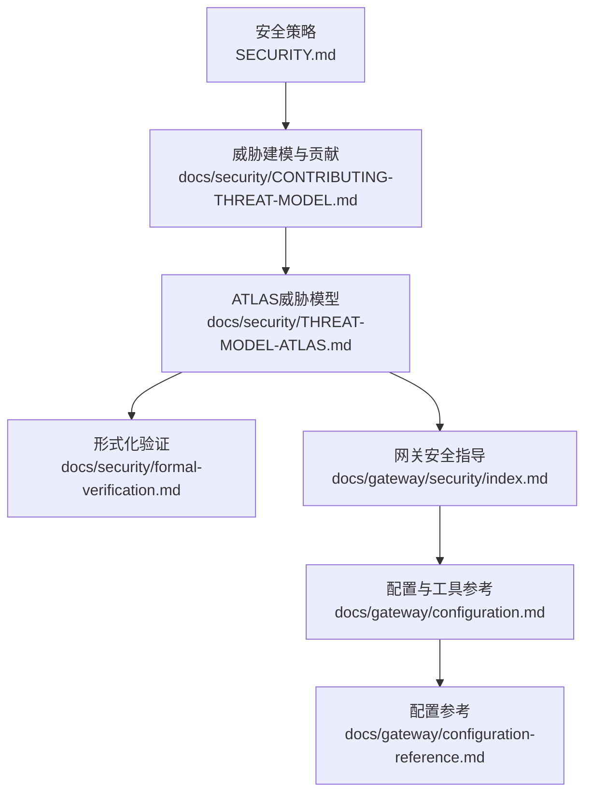
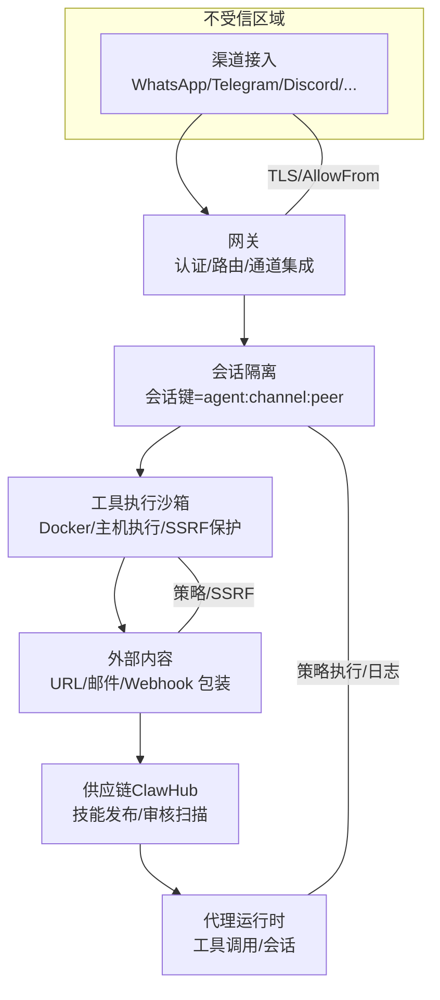
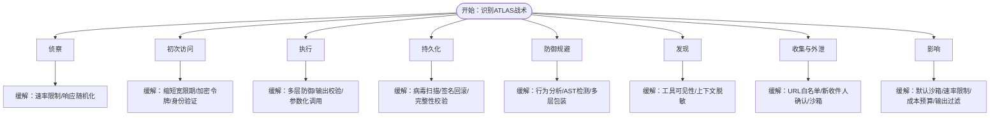
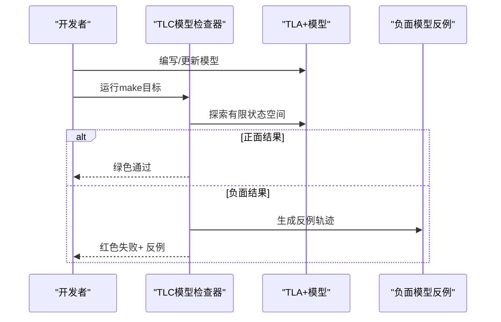
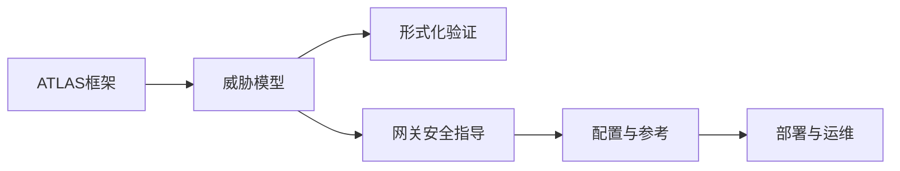
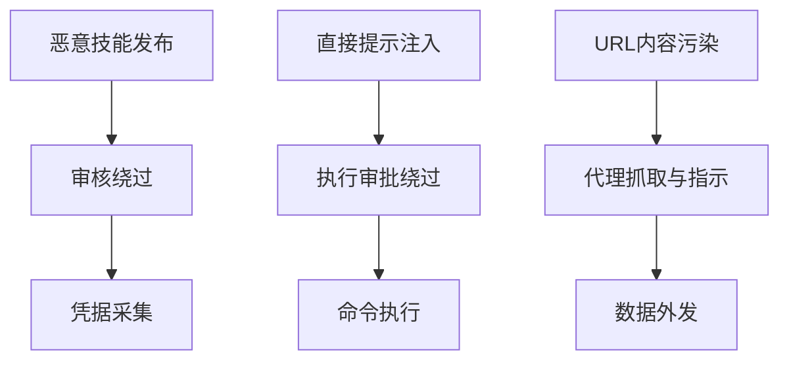

# 威胁建模与风险评估

<cite>
**本文引用的文件**
- [CONTRIBUTING-THREAT-MODEL.md](file://docs/security/CONTRIBUTING-THREAT-MODEL.md)
- [THREAT-MODEL-ATLAS.md](file://docs/security/THREAT-MODEL-ATLAS.md)
- [SECURITY.md](file://SECURITY.md)
- [formal-verification.md](file://docs/security/formal-verification.md)
- [index.md](file://docs/gateway/security/index.md)
- [configuration.md](file://docs/gateway/configuration.md)
- [configuration-reference.md](file://docs/gateway/configuration-reference.md)
</cite>

## 目录
1. [引言](#引言)
2. [项目结构](#项目结构)
3. [核心组件](#核心组件)
4. [架构总览](#架构总览)
5. [详细组件分析](#详细组件分析)
6. [依赖关系分析](#依赖关系分析)
7. [性能考量](#性能考量)
8. [故障排查指南](#故障排查指南)
9. [结论](#结论)
10. [附录](#附录)

## 引言
本文件面向OpenClaw平台，系统化输出威胁建模与风险评估文档，覆盖攻击面分析、攻击向量识别、风险等级评估、安全边界定义、假设场景构建、缓解策略制定、威胁模型图绘制、攻击树分析、安全测试方法（含形式化验证、安全审计与渗透测试）、威胁建模模板、风险评估工具与安全度量指标，以及持续威胁监控与安全事件响应机制。内容以MITRE ATLAS框架为基线，结合项目现有威胁模型与安全策略，形成可操作、可落地的安全部署与运营指南。

## 项目结构
OpenClaw安全相关知识主要沉淀在以下位置：
- 安全策略与漏洞披露：SECURITY.md
- 威胁建模与贡献流程：docs/security/CONTRIBUTING-THREAT-MODEL.md、docs/security/THREAT-MODEL-ATLAS.md
- 形式化验证与安全模型：docs/security/formal-verification.md
- 网关与通道安全指导：docs/gateway/security/index.md
- 配置与工具参考：docs/gateway/configuration.md、docs/gateway/configuration-reference.md

图表来源
- [SECURITY.md:1-293](file://SECURITY.md#L1-L293)
- [CONTRIBUTING-THREAT-MODEL.md:1-91](file://docs/security/CONTRIBUTING-THREAT-MODEL.md#L1-L91)
- [THREAT-MODEL-ATLAS.md:1-604](file://docs/security/THREAT-MODEL-ATLAS.md#L1-L604)
- [formal-verification.md:1-168](file://docs/security/formal-verification.md#L1-L168)
- [index.md:1-800](file://docs/gateway/security/index.md#L1-L800)
- [configuration.md:1-634](file://docs/gateway/configuration.md#L1-L634)
- [configuration-reference.md:1-800](file://docs/gateway/configuration-reference.md#L1-L800)

章节来源
- [SECURITY.md:1-293](file://SECURITY.md#L1-L293)
- [CONTRIBUTING-THREAT-MODEL.md:1-91](file://docs/security/CONTRIBUTING-THREAT-MODEL.md#L1-L91)
- [THREAT-MODEL-ATLAS.md:1-604](file://docs/security/THREAT-MODEL-ATLAS.md#L1-L604)
- [formal-verification.md:1-168](file://docs/security/formal-verification.md#L1-L168)
- [index.md:1-800](file://docs/gateway/security/index.md#L1-L800)
- [configuration.md:1-634](file://docs/gateway/configuration.md#L1-L634)
- [configuration-reference.md:1-800](file://docs/gateway/configuration-reference.md#L1-L800)

## 核心组件
- 威胁建模与治理
  - 贡献入口与评审流程：支持新增威胁、建议缓解、提出攻击链、修复与改进现有内容；使用MITRE ATLAS框架映射，分配威胁ID与风险等级。
  - 风险矩阵与优先级：按“可能性×影响”计算风险等级，并给出P0/P1/P2优先级。
- 安全边界与信任模型
  - 个人助理信任模型：单用户/单网关边界，不支持共享网关的多租户隔离；会话标识仅路由控制，非授权边界。
  - 关键边界：网关认证、会话隔离、工具执行沙箱、外部内容包装、供应链（ClawHub）等。
- 形式化验证
  - 使用TLA+/TLC对关键路径进行可执行的安全回归模型检查，覆盖网关暴露、节点执行流水线、配对存储、入口防护、路由隔离等。
- 网关与通道安全
  - 入站访问控制（DM策略、群组策略、白名单）、工具作用域（拒绝高危工具、工作区限制、执行审批）、网络暴露（绑定、鉴权、反向代理）、浏览器控制暴露、权限与插件管理、模型选择与提示注入风险。
- 配置与工具
  - 严格配置校验、热重载策略、环境变量与密钥引用、工具与媒体安全、会话与心跳、钩子与定时任务等。

章节来源
- [CONTRIBUTING-THREAT-MODEL.md:1-91](file://docs/security/CONTRIBUTING-THREAT-MODEL.md#L1-L91)
- [THREAT-MODEL-ATLAS.md:1-604](file://docs/security/THREAT-MODEL-ATLAS.md#L1-L604)
- [formal-verification.md:1-168](file://docs/security/formal-verification.md#L1-L168)
- [index.md:1-800](file://docs/gateway/security/index.md#L1-L800)
- [configuration.md:1-634](file://docs/gateway/configuration.md#L1-L634)
- [configuration-reference.md:1-800](file://docs/gateway/configuration-reference.md#L1-L800)

## 架构总览
下图展示OpenClaw安全边界与数据流，对应威胁模型中的五道信任边界与关键数据流。

图表来源
- [THREAT-MODEL-ATLAS.md:56-135](file://docs/security/THREAT-MODEL-ATLAS.md#L56-L135)

章节来源
- [THREAT-MODEL-ATLAS.md:56-135](file://docs/security/THREAT-MODEL-ATLAS.md#L56-L135)

## 详细组件分析

### 组件A：MITRE ATLAS威胁分析（按战术）
- 侦察（Reconnaissance）
  - Agent端点发现、渠道探测；建议速率限制与响应随机化。
- 初次访问（Initial Access）
  - 配对码拦截、AllowFrom欺骗、令牌窃取；建议缩短宽限期、加密存储、增强身份验证。
- 执行（Execution）
  - 直接/间接提示注入、工具参数注入、执行审批绕过；建议多层防御、输出校验、参数化调用。
- 持久化（Persistence）
  - 恶意技能安装/更新中毒、代理配置篡改；建议病毒扫描、签名与回滚、完整性校验。
- 防御规避（Defense Evasion）
  - 审核模式绕过、内容包装逃逸；建议行为分析、AST检测、多层包装与输出侧校验。
- 发现（Discovery）
  - 工具枚举、会话数据提取；建议工具可见性控制、上下文敏感数据脱敏。
- 收集与外泄（Collection/Exfiltration）
  - web_fetch外发、消息外发、凭据采集；建议URL白名单、新收件人确认、技能沙箱。
- 影响（Impact）
  - 未授权命令执行、资源耗尽DoS、声誉损害；建议默认沙箱、速率限制、成本预算、输出过滤。

图表来源
- [THREAT-MODEL-ATLAS.md:138-434](file://docs/security/THREAT-MODEL-ATLAS.md#L138-L434)

章节来源
- [THREAT-MODEL-ATLAS.md:138-434](file://docs/security/THREAT-MODEL-ATLAS.md#L138-L434)

### 组件B：关键威胁与推荐缓解（摘要）
- T-EXEC-001（直接提示注入）：关键风险，建议多层防御、输出校验、敏感动作用户确认。
- T-PERSIST-001（恶意技能安装）：关键风险，建议VirusTotal集成、技能沙箱、社区审核。
- T-EXFIL-003（凭据采集）：关键风险，建议技能沙箱、凭据隔离。
- T-IMPACT-001（未授权命令执行）：高风险，建议默认沙箱、改进审批体验。
- T-EXEC-002（间接提示注入）：高风险，建议内容净化、分离执行上下文。
- T-EXFIL-001（web_fetch外发）：高风险，建议URL白名单、数据分类意识。
- T-IMPACT-002（资源耗尽DoS）：高风险，建议每发送者限流、成本预算。
- T-ACCESS-003（令牌窃取）：高风险，建议静态加密、轮换令牌。
- T-EXEC-004（执行审批绕过）：高风险，建议命令规范化、扩展黑名单。
- T-EVADE-001（审核模式绕过）：中风险，建议行为分析与AST检测。
- T-ACCESS-001/002（配对码/AllowFrom欺骗）：中低风险，建议缩短宽限期、加密验证。

章节来源
- [THREAT-MODEL-ATLAS.md:485-527](file://docs/security/THREAT-MODEL-ATLAS.md#L485-L527)

### 组件C：形式化验证（TLA+/TLC）
- 目标：对关键安全属性（授权、会话隔离、工具门禁、误配置安全）进行可执行的攻击者驱动回归检查。
- 关键模型：
  - 网关暴露与误配置
  - 节点执行流水线（命令白名单+实时审批）
  - 配对存储（TTL与并发上限）
  - 入口防护（提及/控制命令绕过）
  - 路由/会话键隔离
  - 并发/重试/追踪一致性（后续模型）

图表来源
- [formal-verification.md:37-168](file://docs/security/formal-verification.md#L37-L168)

章节来源
- [formal-verification.md:1-168](file://docs/security/formal-verification.md#L1-L168)

### 组件D：网关与通道安全（部署与硬化的关键要点）
- 个人助理信任模型：单用户/单网关边界，不支持共享网关的多租户隔离；会话标识仅为路由控制。
- 入站访问控制：DM策略（配对/允许列表/开放/禁用）、群组策略、提及要求；建议最小暴露原则。
- 工具作用域：拒绝高危工具、工作区限制、执行审批；建议默认拒绝+按需放行。
- 网络暴露：绑定到本地回环、强鉴权、反向代理与可信代理头、HSTS与Origin约束。
- 浏览器控制暴露：远程节点/中继端口仅限受信场景；Canvas内容视为不受信。
- 权限与插件：严格文件权限、仅加载可信插件、明确允许清单。
- 模型选择：优先现代/指令硬化模型，降低提示注入风险。

章节来源
- [index.md:1-800](file://docs/gateway/security/index.md#L1-L800)

### 组件E：配置与工具安全（关键字段与建议）
- 配置格式与校验：JSON5，严格校验，未知键/类型错误导致拒绝启动。
- 渠道接入：各渠道DM策略、群组策略、提及要求、历史限制、代理与网络设置。
- 会话与重置：dmScope（主/按对/按频道+对/按账户+频道）、线程绑定、重置策略。
- 沙箱：默认关闭，建议在启用时严格配置网络与卷。
- 工具与媒体：工作区限制、执行审批、浏览器与网络工具谨慎放行。
- 钩子与定时任务：共享密钥、路径前缀、会话键限制、避免不安全外部内容标志。
- 多代理路由：按渠道/账号绑定不同代理，避免跨域越权。

章节来源
- [configuration.md:1-634](file://docs/gateway/configuration.md#L1-L634)
- [configuration-reference.md:1-800](file://docs/gateway/configuration-reference.md#L1-L800)

## 依赖关系分析
- 威胁建模依赖MITRE ATLAS框架与项目内部评审流程，形成威胁ID、ATLAS技术映射与风险矩阵。
- 形式化验证依赖独立仓库的TLA+模型与TLC工具链，作为安全回归的一部分。
- 网关安全指导与配置参考共同构成部署与运维的“安全基线”，决定实际边界与控制强度。
- 配置参考提供字段级约束与默认值，直接影响工具作用域、网络暴露与插件/钩子安全。

图表来源
- [THREAT-MODEL-ATLAS.md:1-604](file://docs/security/THREAT-MODEL-ATLAS.md#L1-L604)
- [formal-verification.md:1-168](file://docs/security/formal-verification.md#L1-L168)
- [index.md:1-800](file://docs/gateway/security/index.md#L1-L800)
- [configuration.md:1-634](file://docs/gateway/configuration.md#L1-L634)
- [configuration-reference.md:1-800](file://docs/gateway/configuration-reference.md#L1-L800)

章节来源
- [THREAT-MODEL-ATLAS.md:1-604](file://docs/security/THREAT-MODEL-ATLAS.md#L1-L604)
- [formal-verification.md:1-168](file://docs/security/formal-verification.md#L1-L168)
- [index.md:1-800](file://docs/gateway/security/index.md#L1-L800)
- [configuration.md:1-634](file://docs/gateway/configuration.md#L1-L634)
- [configuration-reference.md:1-800](file://docs/gateway/configuration-reference.md#L1-L800)

## 性能考量
- 提示注入检测与内容包装可能带来额外处理开销，建议在高吞吐场景下结合缓存与限流策略。
- 沙箱与容器执行提升安全性但增加延迟，应根据风险与性能需求平衡。
- 并发/重试/追踪一致性模型有助于减少重复处理与状态漂移，提高可靠性。

## 故障排查指南
- 常见误报与不适用场景
  - 仅提示注入且无边界绕过
  - 将本地功能误判为远程注入
  - 将受信操作（如canvas.eval/node.invoke）当作漏洞
  - 多用户共享网关的“多租户”假设
  - 仅暴露秘密且非OpenClaw自有或未影响OpenClaw基础设施
- 安全审计与修复
  - 使用`openclaw security audit`定期检查：入站访问、工具范围、网络暴露、浏览器控制暴露、权限、插件、策略漂移、运行期望漂移、模型选择。
  - 关注高信号检查项：状态目录权限、配置文件权限、网关绑定与鉴权、危险工具启用、Tailscale Serve公开暴露、Control UI Origin限制、mDNS信息泄露、Docker网络模式、执行审批与沙箱配置等。
- 报告与处置
  - 漏洞报告需包含标题、严重性评估、影响、受影响组件、技术复现、演示影响、环境、修复建议。
  - 严格区分“威胁模型贡献”与“漏洞披露”，前者在openclaw/trust，后者遵循安全策略与披露流程。

章节来源
- [SECURITY.md:1-293](file://SECURITY.md#L1-L293)
- [index.md:184-262](file://docs/gateway/security/index.md#L184-L262)

## 结论
OpenClaw的安全体系以MITRE ATLAS威胁建模为基础，结合形式化验证、严格的网关与通道安全指导、严谨的配置与工具参考，形成了从“边界定义—攻击向量识别—风险评估—缓解策略—持续监控”的闭环。建议在生产环境中坚持“最小暴露、默认拒绝、强鉴权、强隔离”的原则，并通过安全审计与形式化回归模型持续验证关键安全属性。

## 附录

### 威胁建模模板（步骤）
- 明确系统边界与信任分区（网关、会话、工具执行、外部内容、供应链）。
- 识别关键资产与数据流（消息、工具调用、web_fetch、技能代码）。
- 应用MITRE ATLAS战术与技术，列出潜在攻击向量与利用路径。
- 评估可能性与影响，形成风险矩阵与优先级。
- 输出缓解建议（技术/流程/组织），并纳入安全基线与配置参考。

章节来源
- [CONTRIBUTING-THREAT-MODEL.md:1-91](file://docs/security/CONTRIBUTING-THREAT-MODEL.md#L1-L91)
- [THREAT-MODEL-ATLAS.md:1-604](file://docs/security/THREAT-MODEL-ATLAS.md#L1-L604)

### 攻击树分析示例
- 技能型数据窃取：恶意技能发布 → 审核绕过 → 凭据采集
- 提示注入到RCE：直接提示注入 → 执行审批绕过 → 命令执行
- 间接注入外发：URL内容污染 → 代理抓取与指示 → 数据外发

图表来源
- [THREAT-MODEL-ATLAS.md:505-527](file://docs/security/THREAT-MODEL-ATLAS.md#L505-L527)

章节来源
- [THREAT-MODEL-ATLAS.md:505-527](file://docs/security/THREAT-MODEL-ATLAS.md#L505-L527)

### 安全测试方法
- 形式化验证：TLA+/TLC模型检查，覆盖网关暴露、节点执行、配对存储、入口防护、路由隔离与并发一致性。
- 安全审计：定期运行`openclaw security audit`，关注高信号检查项并自动修复。
- 渗透测试：基于威胁模型与配置基线，重点验证边界绕过、工具滥用、外部内容注入、供应链风险与DoS。

章节来源
- [formal-verification.md:1-168](file://docs/security/formal-verification.md#L1-L168)
- [index.md:26-38](file://docs/gateway/security/index.md#L26-L38)

### 风险评估工具与度量
- 风险矩阵：威胁ID、可能性、影响、风险等级、优先级（P0/P1/P2）。
- 安全度量：配置合规率、暴露面评分、工具启用范围、沙箱覆盖率、执行审批通过率、外部内容包装命中率、形式化模型通过率。

章节来源
- [THREAT-MODEL-ATLAS.md:485-527](file://docs/security/THREAT-MODEL-ATLAS.md#L485-L527)

### 持续威胁监控与事件响应
- 持续监控：安全审计定期扫描、配置变更跟踪、异常行为检测（DoS、异常工具调用、外部内容请求）。
- 事件响应：快速定位受影响组件、评估边界是否被绕过、回滚可疑变更、加固配置与工具策略、补充形式化回归模型。

章节来源
- [SECURITY.md:1-293](file://SECURITY.md#L1-L293)
- [index.md:184-262](file://docs/gateway/security/index.md#L184-L262)