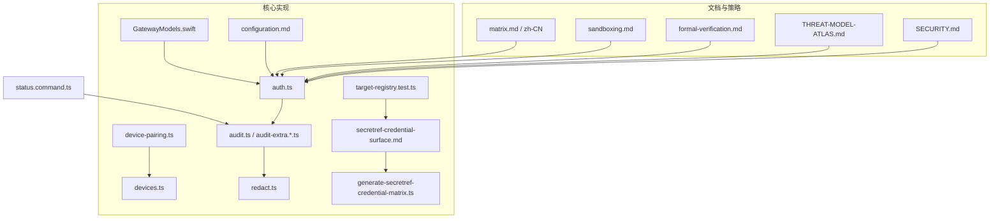
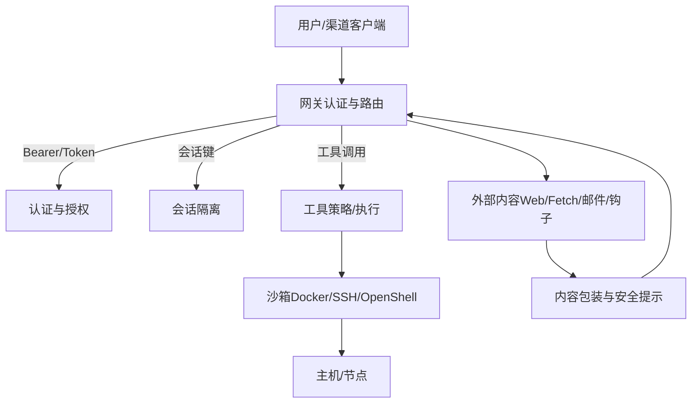
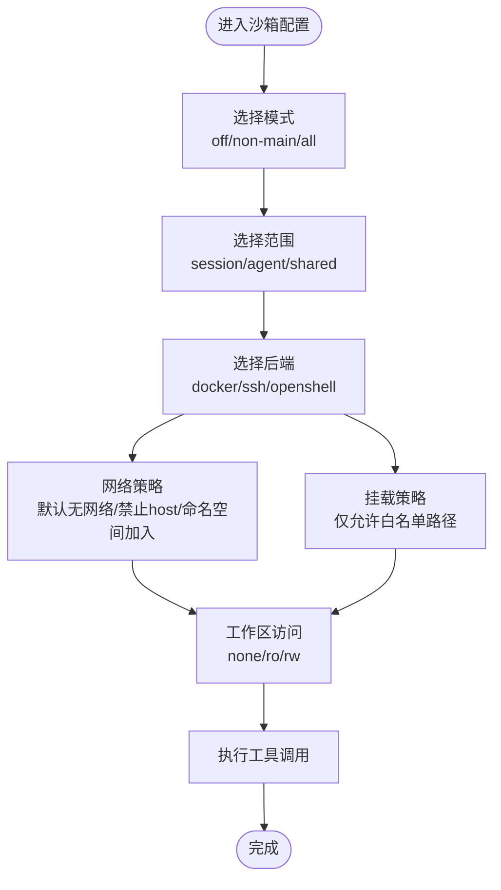
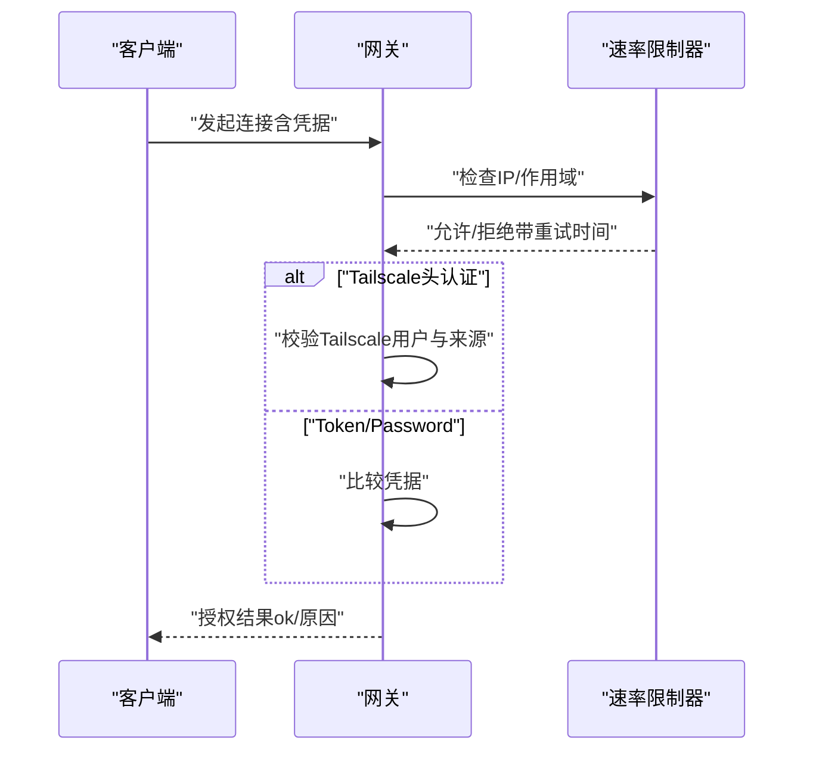
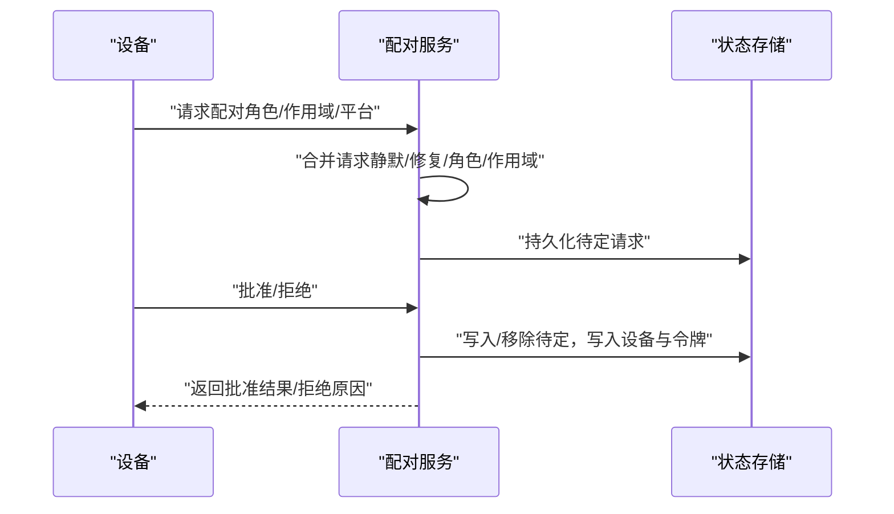
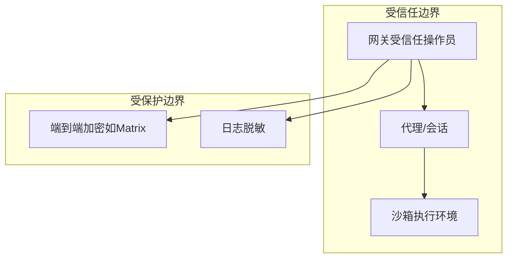
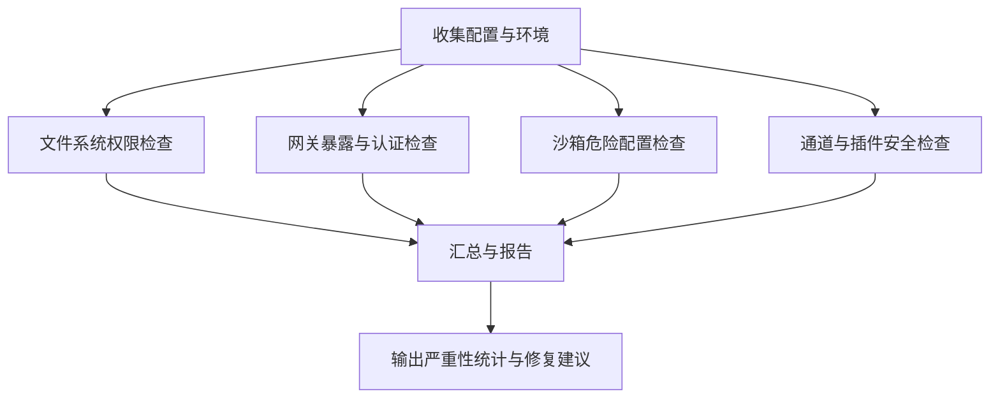
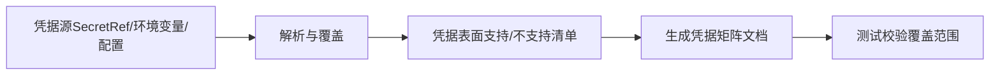
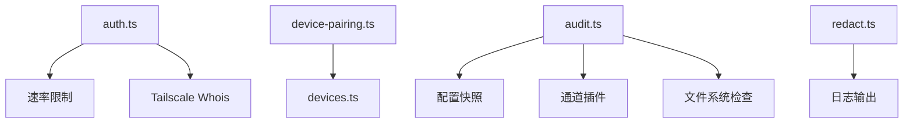

# 安全模型

<cite>
**本文引用的文件**
- [SECURITY.md](file://SECURITY.md)
- [THREAT-MODEL-ATLAS.md](file://docs/security/THREAT-MODEL-ATLAS.md)
- [formal-verification.md](file://docs/security/formal-verification.md)
- [sandboxing.md](file://docs/gateway/sandboxing.md)
- [auth.ts](file://src/gateway/auth.ts)
- [device-pairing.ts](file://src/infra/device-pairing.ts)
- [devices.ts](file://src/gateway/protocol/schema/devices.ts)
- [audit.ts](file://src/security/audit.ts)
- [audit-extra.sync.ts](file://src/security/audit-extra.sync.ts)
- [audit-extra.async.ts](file://src/security/audit-extra.async.ts)
- [redact.ts](file://src/logging/redact.ts)
- [configuration.md](file://docs/gateway/configuration.md)
- [matrix.md](file://docs/channels/matrix.md)
- [matrix.md(zh-CN)](file://docs/zh-CN/channels/matrix.md)
- [status.command.ts](file://src/commands/status.command.ts)
- [secrets.ts](file://src/gateway/protocol/schema/secrets.ts)
- [secretref-credential-surface.md](file://docs/reference/secretref-credential-surface.md)
- [generate-secretref-credential-matrix.ts](file://scripts/generate-secretref-credential-matrix.ts)
- [target-registry.test.ts](file://src/secrets/target-registry.test.ts)
- [GatewayModels.swift](file://apps/shared/OpenClawKit/Sources/OpenClawProtocol/GatewayModels.swift)
- [GatewayModels.swift(macOS)](file://apps/macos/Sources/OpenClawProtocol/GatewayModels.swift)
</cite>

## 目录
1. [简介](#简介)
2. [项目结构](#项目结构)
3. [核心组件](#核心组件)
4. [架构总览](#架构总览)
5. [详细组件分析](#详细组件分析)
6. [依赖关系分析](#依赖关系分析)
7. [性能考量](#性能考量)
8. [故障排查指南](#故障排查指南)
9. [结论](#结论)
10. [附录](#附录)

## 简介
本文件系统化梳理 OpenClaw 的安全模型，覆盖沙箱机制、权限控制、访问管理、设备配对与身份认证、授权流程、安全边界、数据加密与隐私保护、威胁模型与漏洞防护、安全审计与合规建议，以及本地信任建立、远程访问安全与敏感数据处理的最佳实践。

## 项目结构
围绕安全的关键目录与文件：
- 文档与策略
  - 安全策略与信任模型：SECURITY.md
  - 威胁模型（ATLAS）：docs/security/THREAT-MODEL-ATLAS.md
  - 形式化验证说明：docs/security/formal-verification.md
  - 网关沙箱说明：docs/gateway/sandboxing.md
  - 渠道加密（Matrix）：docs/channels/matrix.md 及其中文版
- 核心实现
  - 网关认证与授权：src/gateway/auth.ts
  - 设备配对与令牌管理：src/infra/device-pairing.ts、src/gateway/protocol/schema/devices.ts
  - 安全审计与发现：src/security/audit.ts、audit-extra.*.ts
  - 敏感信息脱敏：src/logging/redact.ts
  - 配置参考：docs/gateway/configuration.md
  - 凭据表面与生成：docs/reference/secretref-credential-surface.md、scripts/generate-secretref-credential-matrix.ts、src/secrets/target-registry.test.ts
  - 协议模型（Swift）：apps/shared/OpenClawKit/Sources/OpenClawProtocol/GatewayModels.swift、apps/macos/Sources/OpenClawProtocol/GatewayModels.swift

图表来源
- [SECURITY.md](file://SECURITY.md)
- [THREAT-MODEL-ATLAS.md](file://docs/security/THREAT-MODEL-ATLAS.md)
- [formal-verification.md](file://docs/security/formal-verification.md)
- [sandboxing.md](file://docs/gateway/sandboxing.md)
- [auth.ts](file://src/gateway/auth.ts)
- [device-pairing.ts](file://src/infra/device-pairing.ts)
- [devices.ts](file://src/gateway/protocol/schema/devices.ts)
- [audit.ts](file://src/security/audit.ts)
- [audit-extra.sync.ts](file://src/security/audit-extra.sync.ts)
- [audit-extra.async.ts](file://src/security/audit-extra.async.ts)
- [redact.ts](file://src/logging/redact.ts)
- [configuration.md](file://docs/gateway/configuration.md)
- [matrix.md](file://docs/channels/matrix.md)
- [matrix.md(zh-CN)](file://docs/zh-CN/channels/matrix.md)
- [status.command.ts](file://src/commands/status.command.ts)
- [secretref-credential-surface.md](file://docs/reference/secretref-credential-surface.md)
- [generate-secretref-credential-matrix.ts](file://scripts/generate-secretref-credential-matrix.ts)
- [target-registry.test.ts](file://src/secrets/target-registry.test.ts)
- [GatewayModels.swift](file://apps/shared/OpenClawKit/Sources/OpenClawProtocol/GatewayModels.swift)
- [GatewayModels.swift(macOS)](file://apps/macos/Sources/OpenClawProtocol/GatewayModels.swift)

章节来源
- [SECURITY.md](file://SECURITY.md)
- [sandboxing.md](file://docs/gateway/sandboxing.md)
- [auth.ts](file://src/gateway/auth.ts)
- [device-pairing.ts](file://src/infra/device-pairing.ts)
- [devices.ts](file://src/gateway/protocol/schema/devices.ts)
- [audit.ts](file://src/security/audit.ts)
- [audit-extra.sync.ts](file://src/security/audit-extra.sync.ts)
- [audit-extra.async.ts](file://src/security/audit-extra.async.ts)
- [redact.ts](file://src/logging/redact.ts)
- [configuration.md](file://docs/gateway/configuration.md)
- [matrix.md](file://docs/channels/matrix.md)
- [matrix.md(zh-CN)](file://docs/zh-CN/channels/matrix.md)
- [status.command.ts](file://src/commands/status.command.ts)
- [secretref-credential-surface.md](file://docs/reference/secretref-credential-surface.md)
- [generate-secretref-credential-matrix.ts](file://scripts/generate-secretref-credential-matrix.ts)
- [target-registry.test.ts](file://src/secrets/target-registry.test.ts)
- [GatewayModels.swift](file://apps/shared/OpenClawKit/Sources/OpenClawProtocol/GatewayModels.swift)
- [GatewayModels.swift(macOS)](file://apps/macos/Sources/OpenClawProtocol/GatewayModels.swift)

## 核心组件
- 沙箱与执行隔离
  - 支持 Docker/SSH/OpenShell 后端，可按会话/代理/共享作用域运行工具调用，限制文件系统与进程访问。
- 身份认证与授权
  - 网关支持 token/password/Tailscale/trusted-proxy 四种模式，严格区分“受信任操作员”与“会话路由标识符”的边界。
- 设备配对与令牌
  - 基于公钥与角色/作用域的设备令牌轮换与校验，支持修复模式与静默模式合并请求。
- 安全审计与告警
  - 提供攻击面汇总、网关暴露、沙箱危险配置、文件系统权限、通道安全等检查，并输出修复建议。
- 数据脱敏与隐私
  - 日志与导出内容的敏感信息脱敏策略，支持正则与掩码。
- 通道加密（示例：Matrix）
  - 支持端到端加密，设备验证与密钥共享流程，加密状态按账户/令牌存储。

章节来源
- [sandboxing.md](file://docs/gateway/sandboxing.md)
- [auth.ts](file://src/gateway/auth.ts)
- [device-pairing.ts](file://src/infra/device-pairing.ts)
- [audit.ts](file://src/security/audit.ts)
- [redact.ts](file://src/logging/redact.ts)
- [matrix.md](file://docs/channels/matrix.md)
- [matrix.md(zh-CN)](file://docs/zh-CN/channels/matrix.md)

## 架构总览
下图展示从外部渠道到工具执行的多层信任边界与控制点，强调“网关认证—会话隔离—工具执行沙箱—外部内容包装”的安全纵深。

图表来源
- [auth.ts](file://src/gateway/auth.ts)
- [sandboxing.md](file://docs/gateway/sandboxing.md)
- [THREAT-MODEL-ATLAS.md](file://docs/security/THREAT-MODEL-ATLAS.md)

## 详细组件分析

### 沙箱机制与执行隔离
- 模式与范围
  - 模式：关闭/仅非主会话/全部会话；范围：按会话/按代理/共享容器；后端：Docker/SSH/OpenShell。
- 容器网络与安全
  - 默认无网络；禁止 host 网络与容器命名空间加入；可选浏览器专用网络与 bind 挂载白名单。
- 工作区访问
  - 通过 workspaceAccess 控制只读/读写；技能与媒体文件在沙箱内镜像或桥接。
- 危险配置检测
  - 对 bind mount、网络模式、seccomp/AppArmor 等高危设置进行审计并给出修复建议。

图表来源
- [sandboxing.md](file://docs/gateway/sandboxing.md)
- [audit-extra.sync.ts](file://src/security/audit-extra.sync.ts)

章节来源
- [sandboxing.md](file://docs/gateway/sandboxing.md)
- [audit-extra.sync.ts](file://src/security/audit-extra.sync.ts)

### 权限控制与访问管理
- 网关认证模式
  - token/password/Tailscale/trusted-proxy；当 mode 为 none 时需严格限制绑定与暴露。
- 速率限制
  - 未配置速率限制时发出警告，避免暴力破解。
- 控制界面与跨域
  - 非 loopback 绑定时需显式 allowedOrigins；禁用 Host 头 Origin 回退。
- 代理信任
  - 仅允许可信代理；配置 userHeader 与可选 allowUsers 白名单。

图表来源
- [auth.ts](file://src/gateway/auth.ts)

章节来源
- [auth.ts](file://src/gateway/auth.ts)

### 设备配对、身份认证与授权流程
- 请求与合并
  - 合并静默/修复场景的请求，保留交互可见性；合并角色与作用域。
- 授权校验
  - 基于 callerScopes 与设备已批准作用域基线进行授权判定。
- 令牌轮换与撤销
  - 角色级令牌轮换，支持撤销与最后使用时间更新。
- 协议模型
  - 设备配对事件结构定义（请求/解决），用于前端与协议一致性。

图表来源
- [device-pairing.ts](file://src/infra/device-pairing.ts)
- [devices.ts](file://src/gateway/protocol/schema/devices.ts)

章节来源
- [device-pairing.ts](file://src/infra/device-pairing.ts)
- [devices.ts](file://src/gateway/protocol/schema/devices.ts)

### 安全边界、数据加密与隐私保护
- 信任模型
  - 不将单网关视为多租户对抗边界；认证过的网关调用被视为受信任操作员。
- 通道加密（Matrix）
  - 支持端到端加密，首次连接请求设备验证，验证后共享密钥；加密状态按账户/令牌存储。
- 日志与导出脱敏
  - 支持正则与掩码策略，对令牌、证书等敏感信息进行脱敏。

图表来源
- [SECURITY.md](file://SECURITY.md)
- [matrix.md](file://docs/channels/matrix.md)
- [matrix.md(zh-CN)](file://docs/zh-CN/channels/matrix.md)
- [redact.ts](file://src/logging/redact.ts)

章节来源
- [SECURITY.md](file://SECURITY.md)
- [matrix.md](file://docs/channels/matrix.md)
- [matrix.md(zh-CN)](file://docs/zh-CN/channels/matrix.md)
- [redact.ts](file://src/logging/redact.ts)

### 威胁模型分析、漏洞防护与安全审计
- 威胁矩阵与关键路径
  - 关注初始访问（配对码拦截、令牌窃取）、执行（直接/间接提示注入、工具参数注入、审批绕过）、持久化（恶意技能安装/更新、配置篡改）、防御规避（审核规则绕过、内容包装逃逸）、发现与采集（工具枚举、会话数据提取）、影响（未授权命令执行、资源耗尽、声誉损害）。
- 形式化验证
  - 使用 TLAPS 进行模型验证，覆盖网关暴露与保护、节点执行管道、配对存储等。
- 安全审计
  - 攻击面汇总、网关暴露、沙箱危险配置、文件系统权限、通道安全、插件与技能安全、小模型风险、SSRF/安全二进制策略等检查项；支持 deep 深度探测与修复建议。

图表来源
- [audit.ts](file://src/security/audit.ts)
- [audit-extra.sync.ts](file://src/security/audit-extra.sync.ts)
- [audit-extra.async.ts](file://src/security/audit-extra.async.ts)
- [THREAT-MODEL-ATLAS.md](file://docs/security/THREAT-MODEL-ATLAS.md)
- [formal-verification.md](file://docs/security/formal-verification.md)

章节来源
- [audit.ts](file://src/security/audit.ts)
- [audit-extra.sync.ts](file://src/security/audit-extra.sync.ts)
- [audit-extra.async.ts](file://src/security/audit-extra.async.ts)
- [THREAT-MODEL-ATLAS.md](file://docs/security/THREAT-MODEL-ATLAS.md)
- [formal-verification.md](file://docs/security/formal-verification.md)

### 凭据管理与凭据表面
- 凭据表面
  - 定义支持与不支持的 SecretRef 凭据范围，明确“用户自供”与“运行时生成/轮换/会话类”凭证的边界。
- 生成与测试
  - 通过脚本生成凭据矩阵文档，单元测试校验文档标记列表与实际覆盖范围一致。

图表来源
- [secretref-credential-surface.md](file://docs/reference/secretref-credential-surface.md)
- [generate-secretref-credential-matrix.ts](file://scripts/generate-secretref-credential-matrix.ts)
- [target-registry.test.ts](file://src/secrets/target-registry.test.ts)

章节来源
- [secretref-credential-surface.md](file://docs/reference/secretref-credential-surface.md)
- [generate-secretref-credential-matrix.ts](file://scripts/generate-secretref-credential-matrix.ts)
- [target-registry.test.ts](file://src/secrets/target-registry.test.ts)

### 远程访问安全与本地信任建立
- 本地优先
  - 默认仅 loopback 绑定；控制界面仅本地使用；Canvas 主机在可信场景下可非 loopback，但需强认证与防火墙/隧道控制。
- 远程访问
  - 推荐 SSH 隧道或 Tailscale serve/funnel（仍保持网关 loopback 绑定）+ 强认证。
- 令牌与轮换
  - 设备令牌按角色与作用域轮换，支持撤销与最后使用时间追踪。

章节来源
- [SECURITY.md](file://SECURITY.md)
- [auth.ts](file://src/gateway/auth.ts)
- [device-pairing.ts](file://src/infra/device-pairing.ts)

## 依赖关系分析
- 组件耦合
  - 网关认证依赖速率限制与代理识别；设备配对依赖状态文件与令牌生成；安全审计依赖配置快照与通道插件。
- 外部依赖
  - Docker/SSH/OpenShell 运行时；Tailscale 身份；Matrix 加密 SDK；日志脱敏正则库。

图表来源
- [auth.ts](file://src/gateway/auth.ts)
- [device-pairing.ts](file://src/infra/device-pairing.ts)
- [devices.ts](file://src/gateway/protocol/schema/devices.ts)
- [audit.ts](file://src/security/audit.ts)
- [redact.ts](file://src/logging/redact.ts)

章节来源
- [auth.ts](file://src/gateway/auth.ts)
- [device-pairing.ts](file://src/infra/device-pairing.ts)
- [devices.ts](file://src/gateway/protocol/schema/devices.ts)
- [audit.ts](file://src/security/audit.ts)
- [redact.ts](file://src/logging/redact.ts)

## 性能考量
- 沙箱初始化成本
  - Docker/SSH/OpenShell 初始化与镜像种子/同步可能带来延迟；镜像与网络策略应权衡安全与性能。
- 审计扫描
  - 深度探测涉及外部连通性与容器运行时检查，建议在维护窗口执行。
- 日志脱敏
  - 正则匹配与掩码处理对大体量日志有 CPU 开销，建议合理配置脱敏模式与正则集合。

## 故障排查指南
- 常见问题定位
  - 网关暴露与认证缺失：检查 bind 与 auth 配置，确保 loopback 或强认证。
  - 沙箱危险配置：关注 bind mount、网络模式、seccomp/AppArmor 设置。
  - 文件系统权限：state/config 目录与文件的权限与可读性。
  - 设备配对失败：核对角色/作用域、令牌轮换与撤销状态。
- CLI 与报告
  - 使用安全审计命令查看严重性统计与修复建议；必要时启用 deep 探测。

章节来源
- [status.command.ts](file://src/commands/status.command.ts)
- [audit.ts](file://src/security/audit.ts)
- [audit-extra.sync.ts](file://src/security/audit-extra.sync.ts)
- [audit-extra.async.ts](file://src/security/audit-extra.async.ts)

## 结论
OpenClaw 的安全模型以“受信任操作员”为核心边界，结合网关认证、会话隔离、工具执行沙箱与外部内容包装形成多层纵深防御。通过严格的设备配对与令牌管理、全面的安全审计与修复建议、以及通道加密与日志脱敏，有效降低提示注入、供应链与执行层面的风险。建议在生产环境中默认启用沙箱、强认证与最小暴露面，并定期执行安全审计与形式化验证以持续改进。

## 附录
- 安全配置要点
  - 网关：默认 loopback 绑定；启用 token/password 或 Tailscale；配置速率限制；控制界面仅本地或严格 allowedOrigins。
  - 沙箱：默认 off 时注意主机执行；启用时选择合适模式/范围/后端；限制网络与挂载。
  - 通道：启用 E2EE（如 Matrix）；严格 DM/群组策略；最小暴露面。
  - 凭据：仅在“用户自供”范围内使用 SecretRef；定期轮换令牌与密钥。
- 合规与披露
  - 遵循安全策略与威胁模型；遵循 MITRE ATLAS 方法学；形式化验证作为设计约束与回归保障。