# 数据加密与隐私

<cite>
**本文引用的文件**
- [src/security/audit.ts](file://src/security/audit.ts)
- [src/security/audit-extra.async.ts](file://src/security/audit-extra.async.ts)
- [src/security/secret-equal.ts](file://src/security/secret-equal.ts)
- [src/config/schema.ts](file://src/config/schema.ts)
- [src/config/schema.hints.ts](file://src/config/schema.hints.ts)
- [src/config/types.secrets.ts](file://src/config/types.secrets.ts)
- [apps/android/app/src/main/java/ai/openclaw/app/gateway/GatewayTls.kt](file://apps/android/app/src/main/java/ai/openclaw/app/gateway/GatewayTls.kt)
- [apps/shared/OpenClawKit/Sources/OpenClawKit/GatewayTLSPinning.swift](file://apps/shared/OpenClawKit/Sources/OpenClawKit/GatewayTLSPinning.swift)
- [apps/ios/Sources/Gateway/GatewayConnectionController.swift](file://apps/ios/Sources/Gateway/GatewayConnectionController.swift)
- [docs/gateway/logging.md](file://docs/gateway/logging.md)
- [src/agents/pi-extensions/compaction-safeguard.test.ts](file://src/agents/pi-extensions/compaction-safeguard.test.ts)
- [src/config/zod-schema.session.ts](file://src/config/zod-schema.session.ts)
- [src/config/sessions/store-maintenance.ts](file://src/config/sessions/store-maintenance.ts)
- [src/plugin-sdk/group-access.ts](file://src/plugin-sdk/group-access.ts)
- [extensions/nostr/src/nostr-bus.fuzz.test.ts](file://extensions/nostr/src/nostr-bus.fuzz.test.ts)
</cite>

## 目录
1. [简介](#简介)
2. [项目结构](#项目结构)
3. [核心组件](#核心组件)
4. [架构总览](#架构总览)
5. [详细组件分析](#详细组件分析)
6. [依赖关系分析](#依赖关系分析)
7. [性能考量](#性能考量)
8. [故障排查指南](#故障排查指南)
9. [结论](#结论)
10. [附录](#附录)

## 简介
本文件聚焦于本仓库中的数据加密与隐私保护实践，系统阐述端到端加密、密钥管理、传输加密、存储加密与内存保护策略，并结合现有实现说明敏感数据分类、访问日志记录与隐私合规要点。文档同时给出加密算法选择建议、密钥轮换与安全存储最佳实践、配置示例路径与工具指引，以及面向 GDPR、CCPA 的合规性要求说明。

## 项目结构
围绕“加密与隐私”的关键目录与文件如下：
- 安全审计与权限检查：src/security/*
- 配置模式与敏感字段标注：src/config/*
- 平台侧 TLS 与连接校验：apps/*/Sources/* 或 *.kt
- 日志与敏感信息脱敏：docs/gateway/logging.md
- 会话与磁盘存储维护：src/config/sessions/*

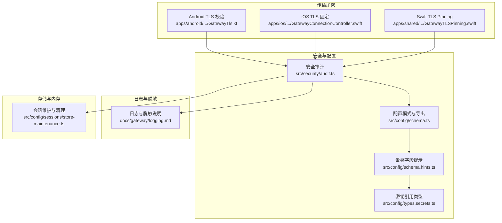

**图表来源**
- [src/security/audit.ts:1-800](file://src/security/audit.ts#L1-L800)
- [src/config/schema.ts:1-712](file://src/config/schema.ts#L1-L712)
- [src/config/schema.hints.ts:1-240](file://src/config/schema.hints.ts#L1-L240)
- [src/config/types.secrets.ts:1-225](file://src/config/types.secrets.ts#L1-L225)
- [apps/android/app/src/main/java/ai/openclaw/app/gateway/GatewayTls.kt:35-66](file://apps/android/app/src/main/java/ai/openclaw/app/gateway/GatewayTls.kt#L35-L66)
- [apps/ios/Sources/Gateway/GatewayConnectionController.swift:685-724](file://apps/ios/Sources/Gateway/GatewayConnectionController.swift#L685-L724)
- [apps/shared/OpenClawKit/Sources/OpenClawKit/GatewayTLSPinning.swift:66-87](file://apps/shared/OpenClawKit/Sources/OpenClawKit/GatewayTLSPinning.swift#L66-L87)
- [docs/gateway/logging.md:1-114](file://docs/gateway/logging.md#L1-L114)
- [src/config/sessions/store-maintenance.ts:38-148](file://src/config/sessions/store-maintenance.ts#L38-L148)

**章节来源**
- [src/security/audit.ts:1-800](file://src/security/audit.ts#L1-L800)
- [src/config/schema.ts:1-712](file://src/config/schema.ts#L1-L712)
- [src/config/schema.hints.ts:1-240](file://src/config/schema.hints.ts#L1-L240)
- [src/config/types.secrets.ts:1-225](file://src/config/types.secrets.ts#L1-L225)
- [apps/android/app/src/main/java/ai/openclaw/app/gateway/GatewayTls.kt:35-66](file://apps/android/app/src/main/java/ai/openclaw/app/gateway/GatewayTls.kt#L35-L66)
- [apps/ios/Sources/Gateway/GatewayConnectionController.swift:685-724](file://apps/ios/Sources/Gateway/GatewayConnectionController.swift#L685-L724)
- [apps/shared/OpenClawKit/Sources/OpenClawKit/GatewayTLSPinning.swift:66-87](file://apps/shared/OpenClawKit/Sources/OpenClawKit/GatewayTLSPinning.swift#L66-L87)
- [docs/gateway/logging.md:1-114](file://docs/gateway/logging.md#L1-L114)
- [src/config/sessions/store-maintenance.ts:38-148](file://src/config/sessions/store-maintenance.ts#L38-L148)

## 核心组件
- 安全审计与风险发现：集中于安全审计入口与文件系统、网关暴露面、浏览器控制等维度的风险识别与修复建议。
- 敏感字段识别与 UI 提示：通过配置模式与启发式规则自动标注敏感字段，辅助 UI 与配置校验。
- 密钥引用与解析：统一的 SecretRef 抽象，支持环境变量、文件与执行器三种来源，避免明文硬编码。
- 传输加密（TLS）：平台侧实现证书固定、指纹校验与受信链信任策略，降低中间人攻击风险。
- 存储与内存保护：会话维护策略（轮转、裁剪、归档保留）、日志脱敏与最小化记录原则。
- 访问控制与分组策略：基于白名单/开放策略的群组访问控制，减少越权传播面。

**章节来源**
- [src/security/audit.ts:1-800](file://src/security/audit.ts#L1-L800)
- [src/config/schema.ts:1-712](file://src/config/schema.ts#L1-L712)
- [src/config/schema.hints.ts:1-240](file://src/config/schema.hints.ts#L1-L240)
- [src/config/types.secrets.ts:1-225](file://src/config/types.secrets.ts#L1-L225)
- [src/config/sessions/store-maintenance.ts:38-148](file://src/config/sessions/store-maintenance.ts#L38-L148)

## 架构总览
下图展示从“配置与密钥”到“传输与存储”的整体隐私与安全路径，以及审计与日志在其中的作用。

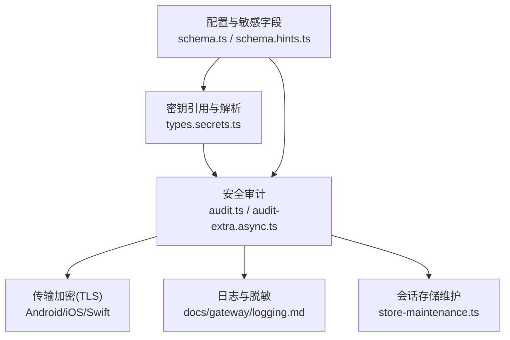

**图表来源**
- [src/config/schema.ts:1-712](file://src/config/schema.ts#L1-L712)
- [src/config/schema.hints.ts:1-240](file://src/config/schema.hints.ts#L1-L240)
- [src/config/types.secrets.ts:1-225](file://src/config/types.secrets.ts#L1-L225)
- [src/security/audit.ts:1-800](file://src/security/audit.ts#L1-L800)
- [src/security/audit-extra.async.ts:983-1026](file://src/security/audit-extra.async.ts#L983-L1026)
- [docs/gateway/logging.md:1-114](file://docs/gateway/logging.md#L1-L114)
- [src/config/sessions/store-maintenance.ts:38-148](file://src/config/sessions/store-maintenance.ts#L38-L148)

## 详细组件分析

### 组件一：安全审计与风险发现
- 文件系统权限与可读写检查：对状态目录、配置文件与日志文件进行权限扫描，识别世界可读/可写等高危配置。
- 网关暴露面与认证：检查绑定地址、反向代理信任、受信代理用户头、速率限制、令牌强度等。
- 浏览器控制认证：确保启用浏览器控制时具备有效认证凭据，避免本地回环或 SSRF 暴露。
- 危险标志与模式：检测配置中可能引入不安全行为的开关项，给出修复建议。

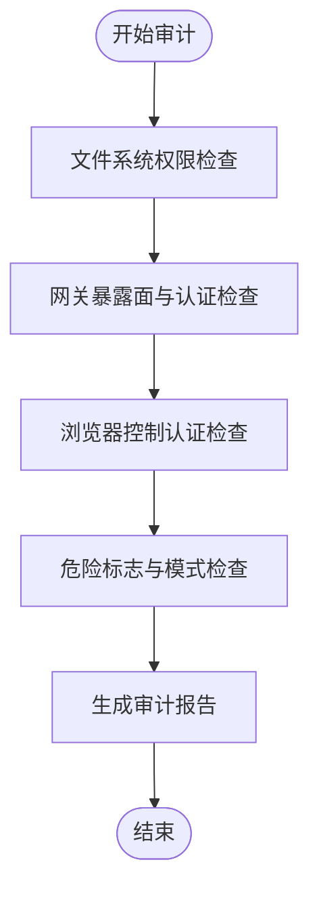

**图表来源**
- [src/security/audit.ts:221-350](file://src/security/audit.ts#L221-L350)
- [src/security/audit.ts:352-701](file://src/security/audit.ts#L352-L701)
- [src/security/audit.ts:732-801](file://src/security/audit.ts#L732-L801)
- [src/security/audit-extra.async.ts:983-1026](file://src/security/audit-extra.async.ts#L983-L1026)

**章节来源**
- [src/security/audit.ts:221-350](file://src/security/audit.ts#L221-L350)
- [src/security/audit.ts:352-701](file://src/security/audit.ts#L352-L701)
- [src/security/audit.ts:732-801](file://src/security/audit.ts#L732-L801)
- [src/security/audit-extra.async.ts:983-1026](file://src/security/audit-extra.async.ts#L983-L1026)

### 组件二：敏感字段识别与 UI 提示
- 基础提示构建：按分组、标签、帮助文本与占位符组织 UI 提示。
- 敏感字段映射：通过正则与白名单规则识别潜在敏感键名；同时尊重已显式标记为敏感的字段。
- 模式驱动标注：遍历 Zod 模式树，递归标注敏感路径，形成最终 UI 提示集。

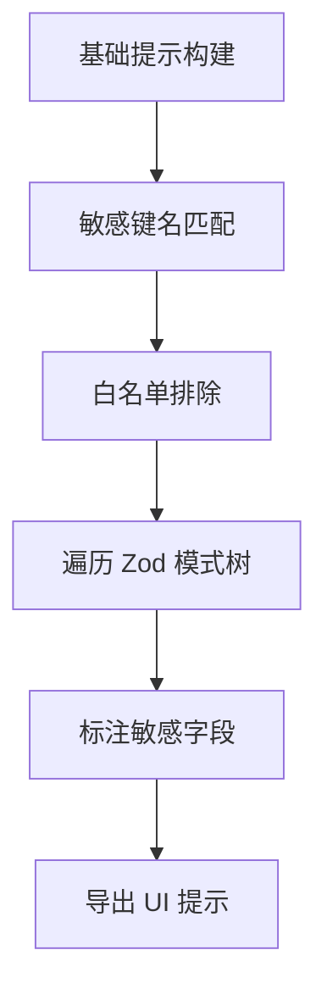

**图表来源**
- [src/config/schema.hints.ts:125-166](file://src/config/schema.hints.ts#L125-L166)
- [src/config/schema.hints.ts:184-234](file://src/config/schema.hints.ts#L184-L234)
- [src/config/schema.ts:429-484](file://src/config/schema.ts#L429-L484)

**章节来源**
- [src/config/schema.hints.ts:125-166](file://src/config/schema.hints.ts#L125-L166)
- [src/config/schema.hints.ts:184-234](file://src/config/schema.hints.ts#L184-L234)
- [src/config/schema.ts:429-484](file://src/config/schema.ts#L429-L484)

### 组件三：密钥引用与解析（SecretRef）
- 支持来源：环境变量、文件（单值或 JSON）、执行器（命令输出）。
- 规范化与校验：对 SecretRef 结构进行严格校验，兼容旧格式并自动补全 provider 别名。
- 解析与默认值：允许为不同来源设置默认 provider，便于在多插件场景下统一管理。

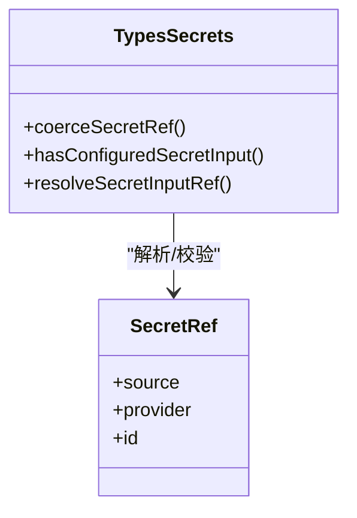

**图表来源**
- [src/config/types.secrets.ts:10-174](file://src/config/types.secrets.ts#L10-L174)

**章节来源**
- [src/config/types.secrets.ts:10-174](file://src/config/types.secrets.ts#L10-L174)

### 组件四：传输加密（TLS）与证书固定
- Android：基于期望指纹与 TOFU（信任新指纹）策略，自定义 X509TrustManager 实现证书校验。
- iOS：在 WebSocket 层触发服务器信任回调，结合主机判定决定是否强制 TLS。
- Swift（共享库）：实现 TLS Pinning，拦截服务器信任挑战以执行自定义校验。

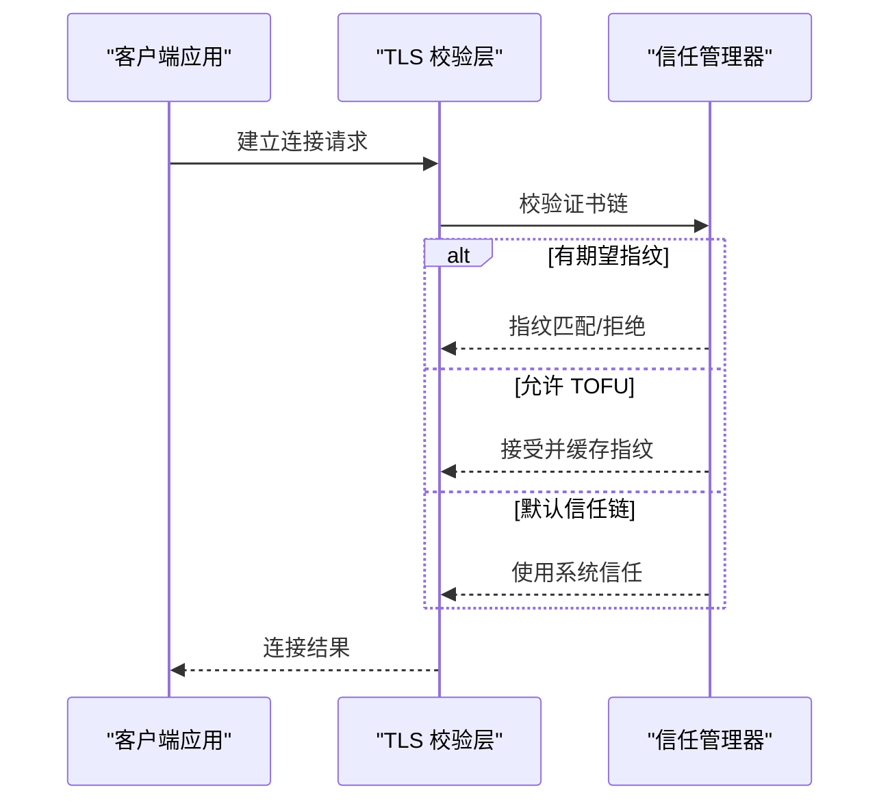

**图表来源**
- [apps/android/app/src/main/java/ai/openclaw/app/gateway/GatewayTls.kt:35-66](file://apps/android/app/src/main/java/ai/openclaw/app/gateway/GatewayTls.kt#L35-L66)
- [apps/ios/Sources/Gateway/GatewayConnectionController.swift:685-724](file://apps/ios/Sources/Gateway/GatewayConnectionController.swift#L685-L724)
- [apps/shared/OpenClawKit/Sources/OpenClawKit/GatewayTLSPinning.swift:66-87](file://apps/shared/OpenClawKit/Sources/OpenClawKit/GatewayTLSPinning.swift#L66-L87)

**章节来源**
- [apps/android/app/src/main/java/ai/openclaw/app/gateway/GatewayTls.kt:35-66](file://apps/android/app/src/main/java/ai/openclaw/app/gateway/GatewayTls.kt#L35-L66)
- [apps/ios/Sources/Gateway/GatewayConnectionController.swift:685-724](file://apps/ios/Sources/Gateway/GatewayConnectionController.swift#L685-L724)
- [apps/shared/OpenClawKit/Sources/OpenClawKit/GatewayTLSPinning.swift:66-87](file://apps/shared/OpenClawKit/Sources/OpenClawKit/GatewayTLSPinning.swift#L66-L87)

### 组件五：日志记录与敏感信息脱敏
- 控制台与文件日志双通道：文件日志级别由配置控制，控制台可独立设置样式与级别。
- 工具摘要脱敏：仅对工具摘要进行敏感令牌掩码，不影响文件日志内容。
- 日志文件权限：审计日志文件可读性风险，建议收紧权限。

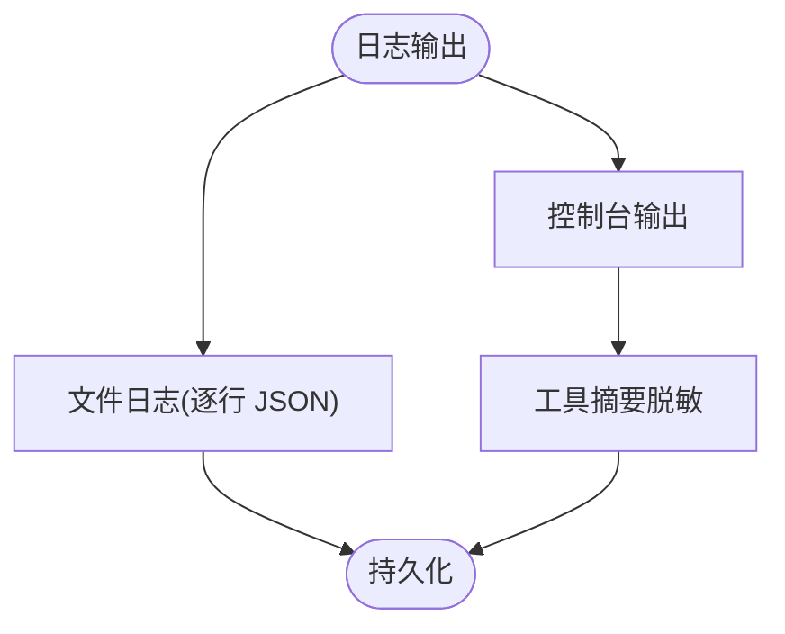

**图表来源**
- [docs/gateway/logging.md:18-63](file://docs/gateway/logging.md#L18-L63)
- [docs/gateway/logging.md:101-114](file://docs/gateway/logging.md#L101-L114)
- [src/security/audit-extra.async.ts:1095-1127](file://src/security/audit-extra.async.ts#L1095-L1127)

**章节来源**
- [docs/gateway/logging.md:18-63](file://docs/gateway/logging.md#L18-L63)
- [docs/gateway/logging.md:101-114](file://docs/gateway/logging.md#L101-L114)
- [src/security/audit-extra.async.ts:1095-1127](file://src/security/audit-extra.async.ts#L1095-L1127)

### 组件六：会话存储维护与内存保护
- 轮转与裁剪：按大小阈值轮转日志文件，按时间窗口裁剪过期会话。
- 归档保留：重置归档保留周期，避免无限增长。
- 内存与磁盘边界：通过会话维护策略约束磁盘占用与水位线，降低资源滥用风险。

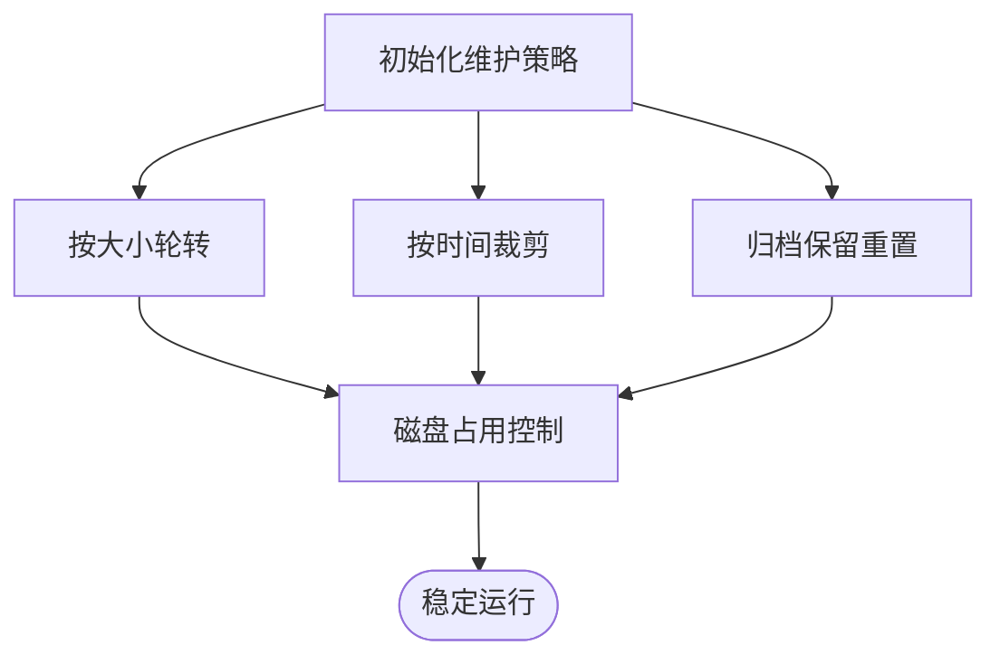

**图表来源**
- [src/config/sessions/store-maintenance.ts:38-148](file://src/config/sessions/store-maintenance.ts#L38-L148)
- [src/config/zod-schema.session.ts:92-131](file://src/config/zod-schema.session.ts#L92-L131)

**章节来源**
- [src/config/sessions/store-maintenance.ts:38-148](file://src/config/sessions/store-maintenance.ts#L38-L148)
- [src/config/zod-schema.session.ts:92-131](file://src/config/zod-schema.session.ts#L92-L131)

### 组件七：访问控制与分组策略
- 白名单/开放策略：根据配置决定是否允许特定发送者进入群组。
- 匹配输入与空白名单处理：缺失匹配输入或空白名单时拒绝，确保最小授权。
- 合规性落地：通过严格的接入控制减少越权传播与数据外泄面。

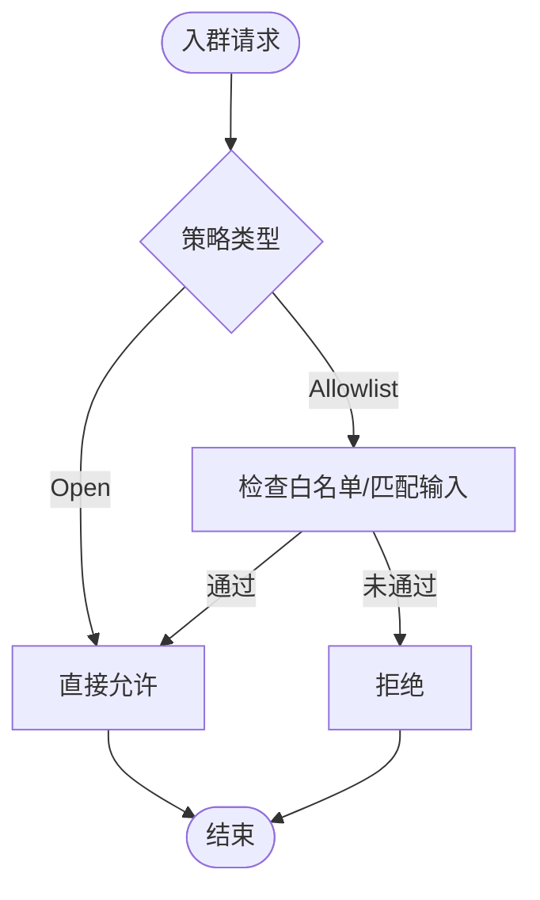

**图表来源**
- [src/plugin-sdk/group-access.ts:114-143](file://src/plugin-sdk/group-access.ts#L114-L143)

**章节来源**
- [src/plugin-sdk/group-access.ts:114-143](file://src/plugin-sdk/group-access.ts#L114-L143)

### 组件八：敏感数据分类与输入校验（示例）
- 字段命名敏感性：通过正则匹配 token、password、secret、api.key 等后缀，识别潜在敏感键。
- 输入校验与攻击防护：针对私钥输入进行 Unicode、RTL、同形异体、组合字符等攻击的防御测试，提升输入健壮性。

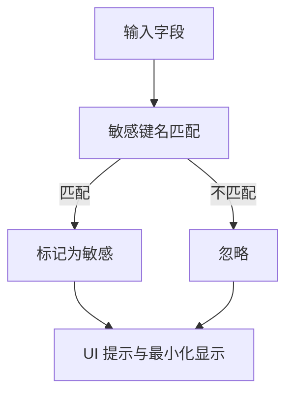

**图表来源**
- [src/config/schema.hints.ts:104-123](file://src/config/schema.hints.ts#L104-L123)
- [extensions/nostr/src/nostr-bus.fuzz.test.ts:36-70](file://extensions/nostr/src/nostr-bus.fuzz.test.ts#L36-L70)

**章节来源**
- [src/config/schema.hints.ts:104-123](file://src/config/schema.hints.ts#L104-L123)
- [extensions/nostr/src/nostr-bus.fuzz.test.ts:36-70](file://extensions/nostr/src/nostr-bus.fuzz.test.ts#L36-L70)

## 依赖关系分析
- 配置层依赖：schema.ts 依赖 schema.hints.ts 与 zod-schema.sensitive，共同完成敏感字段标注与导出。
- 审计层依赖：audit.ts 依赖安全审计扩展模块（文件系统、网关、浏览器控制等），形成闭环检查。
- 平台层依赖：各平台 TLS 实现依赖系统信任链与自定义校验逻辑，确保连接安全。
- 存储层依赖：会话维护策略依赖配置解析与字节/时间单位解析函数，保障磁盘使用可控。

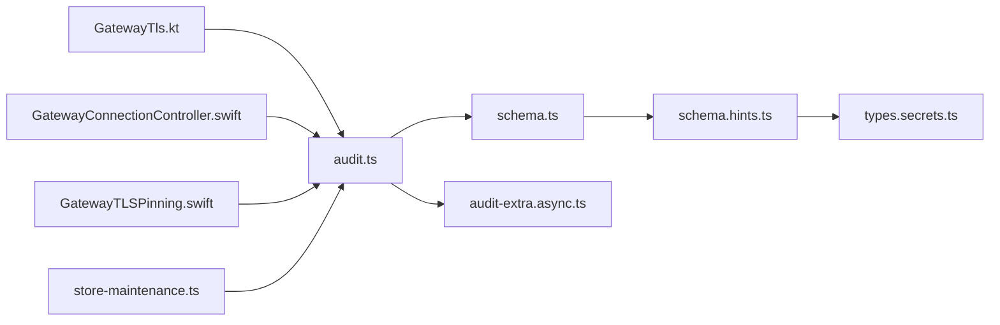

**图表来源**
- [src/config/schema.ts:1-712](file://src/config/schema.ts#L1-L712)
- [src/config/schema.hints.ts:1-240](file://src/config/schema.hints.ts#L1-L240)
- [src/config/types.secrets.ts:1-225](file://src/config/types.secrets.ts#L1-L225)
- [src/security/audit.ts:1-800](file://src/security/audit.ts#L1-L800)
- [src/security/audit-extra.async.ts:983-1026](file://src/security/audit-extra.async.ts#L983-L1026)
- [apps/android/app/src/main/java/ai/openclaw/app/gateway/GatewayTls.kt:35-66](file://apps/android/app/src/main/java/ai/openclaw/app/gateway/GatewayTls.kt#L35-L66)
- [apps/ios/Sources/Gateway/GatewayConnectionController.swift:685-724](file://apps/ios/Sources/Gateway/GatewayConnectionController.swift#L685-L724)
- [apps/shared/OpenClawKit/Sources/OpenClawKit/GatewayTLSPinning.swift:66-87](file://apps/shared/OpenClawKit/Sources/OpenClawKit/GatewayTLSPinning.swift#L66-L87)
- [src/config/sessions/store-maintenance.ts:38-148](file://src/config/sessions/store-maintenance.ts#L38-L148)

**章节来源**
- [src/config/schema.ts:1-712](file://src/config/schema.ts#L1-L712)
- [src/config/schema.hints.ts:1-240](file://src/config/schema.hints.ts#L1-L240)
- [src/config/types.secrets.ts:1-225](file://src/config/types.secrets.ts#L1-L225)
- [src/security/audit.ts:1-800](file://src/security/audit.ts#L1-L800)
- [src/security/audit-extra.async.ts:983-1026](file://src/security/audit-extra.async.ts#L983-L1026)
- [apps/android/app/src/main/java/ai/openclaw/app/gateway/GatewayTls.kt:35-66](file://apps/android/app/src/main/java/ai/openclaw/app/gateway/GatewayTls.kt#L35-L66)
- [apps/ios/Sources/Gateway/GatewayConnectionController.swift:685-724](file://apps/ios/Sources/Gateway/GatewayConnectionController.swift#L685-L724)
- [apps/shared/OpenClawKit/Sources/OpenClawKit/GatewayTLSPinning.swift:66-87](file://apps/shared/OpenClawKit/Sources/OpenClawKit/GatewayTLSPinning.swift#L66-L87)
- [src/config/sessions/store-maintenance.ts:38-148](file://src/config/sessions/store-maintenance.ts#L38-L148)

## 性能考量
- 审计开销：文件系统权限检查与远程探测需合理设置超时与并发，避免阻塞启动。
- 日志级别：生产环境建议将文件日志级别设为 info 或更高，避免过多调试日志影响 I/O。
- 会话维护：轮转与裁剪阈值应结合磁盘容量与流量特征调优，防止频繁轮转造成写放大。
- TLS 校验：平台侧证书校验应尽量复用系统信任，必要时启用指纹缓存以减少握手成本。

[本节为通用指导，无需列出具体文件来源]

## 故障排查指南
- 审计告警：针对“配置文件可读/可写”“状态目录权限不当”“网关无认证绑定非回环”等告警，依据审计报告中的修复建议调整权限与配置。
- 日志脱敏：若发现敏感信息泄露，检查工具摘要脱敏配置与日志级别，必要时收紧文件权限。
- 传输失败：检查 TLS 校验策略与指纹缓存，确认目标证书链与期望指纹一致。
- 会话异常：核对轮转与裁剪阈值，确认磁盘空间与水位线设置合理。

**章节来源**
- [src/security/audit.ts:221-350](file://src/security/audit.ts#L221-L350)
- [src/security/audit.ts:352-701](file://src/security/audit.ts#L352-L701)
- [src/security/audit-extra.async.ts:1095-1127](file://src/security/audit-extra.async.ts#L1095-L1127)
- [apps/android/app/src/main/java/ai/openclaw/app/gateway/GatewayTls.kt:35-66](file://apps/android/app/src/main/java/ai/openclaw/app/gateway/GatewayTls.kt#L35-L66)
- [src/config/sessions/store-maintenance.ts:38-148](file://src/config/sessions/store-maintenance.ts#L38-L148)

## 结论
本仓库在“配置—传输—存储—日志—访问控制”全链路中提供了较为完善的隐私与安全能力：通过敏感字段标注与 SecretRef 管理避免明文泄露；借助 TLS 固定与信任策略强化传输安全；通过会话维护与日志脱敏控制存储与可观测性风险；并通过安全审计持续发现并修复潜在问题。建议在实际部署中结合审计报告与合规要求，进一步完善密钥轮换、最小权限与数据生命周期管理策略。

[本节为总结性内容，无需列出具体文件来源]

## 附录

### 加密算法与密钥管理最佳实践
- 算法选择：优先采用现代对称与非对称算法，结合平台能力启用硬件加速。
- 密钥轮换：建立定期轮换与密钥生命周期管理流程，确保旧密钥及时停用。
- 安全存储：使用受信密钥管理系统或硬件安全模块（HSM），避免明文落盘。
- 最小暴露：仅在必要时加载密钥，使用一次性令牌与短时效授权。

[本节为通用指导，无需列出具体文件来源]

### 配置示例与工具指引
- 安全审计：参考安全审计入口与扩展模块，定位文件系统权限、网关暴露面与浏览器控制认证问题。
- 敏感字段：通过配置模式与提示系统识别敏感键，结合白名单与模式匹配减少误报。
- 日志脱敏：调整工具摘要脱敏策略与日志级别，确保生产环境最小化敏感信息输出。
- 会话维护：根据磁盘容量与业务特征设置轮转与裁剪阈值，避免资源滥用。

**章节来源**
- [src/security/audit.ts:1-800](file://src/security/audit.ts#L1-L800)
- [src/config/schema.ts:1-712](file://src/config/schema.ts#L1-L712)
- [src/config/schema.hints.ts:1-240](file://src/config/schema.hints.ts#L1-L240)
- [docs/gateway/logging.md:1-114](file://docs/gateway/logging.md#L1-L114)
- [src/config/sessions/store-maintenance.ts:38-148](file://src/config/sessions/store-maintenance.ts#L38-L148)

### 隐私合规要求（GDPR、CCPA）
- 数据最小化：仅收集与处理实现功能所必需的数据，避免过度采集。
- 用户同意与透明度：明确告知数据用途与处理方式，提供撤回同意渠道。
- 数据主体权利：支持访问、更正、删除与可携带权，提供自动化工具与人工协助。
- 安全保障：实施技术与组织措施（如 TLS、脱敏、最小权限）保护数据安全。
- 数据泄露通知：建立事件响应流程，按监管要求时限内通知与处置。

[本节为通用指导，无需列出具体文件来源]