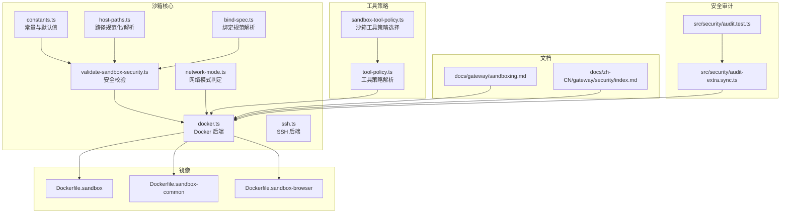
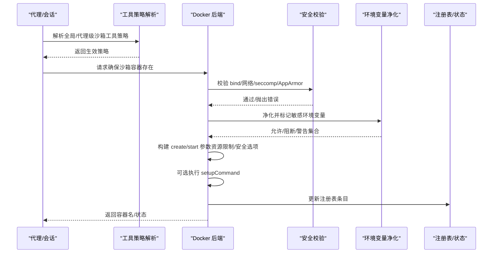
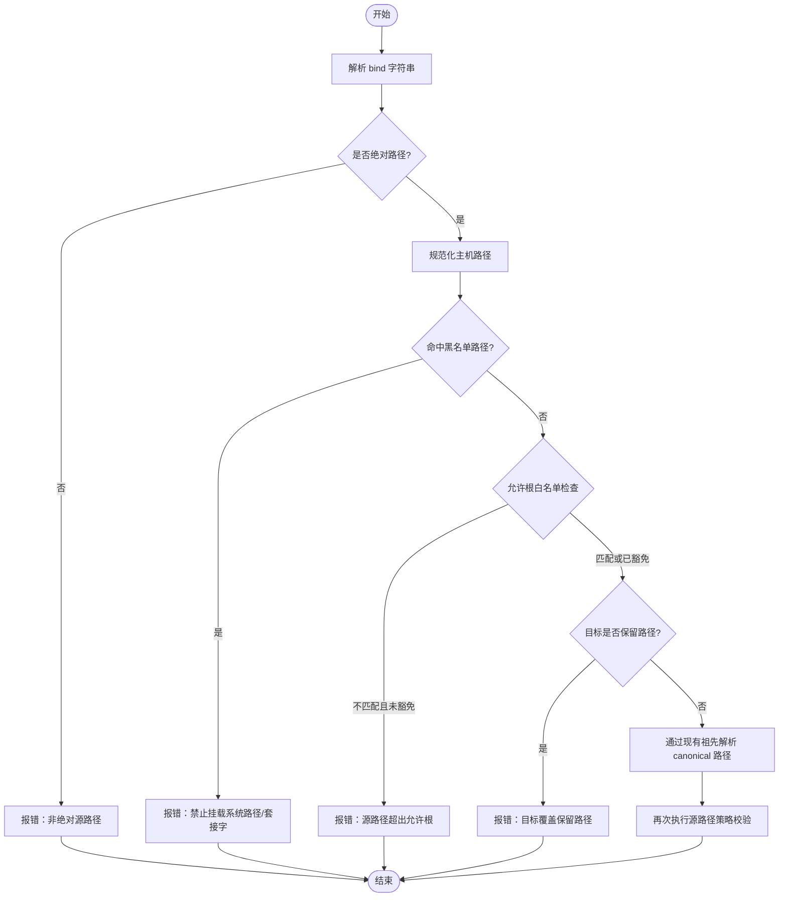
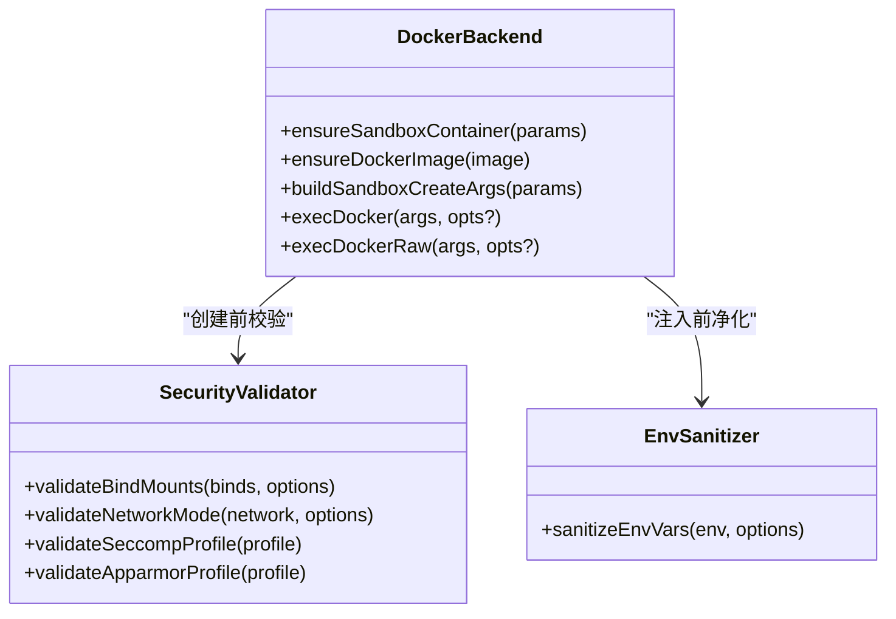
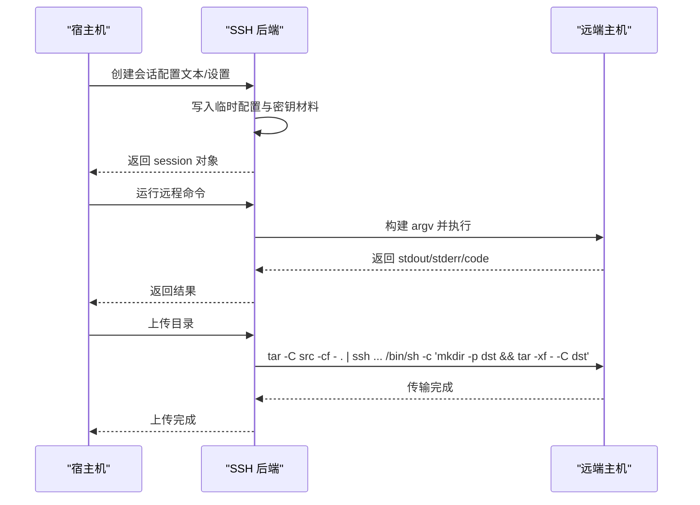
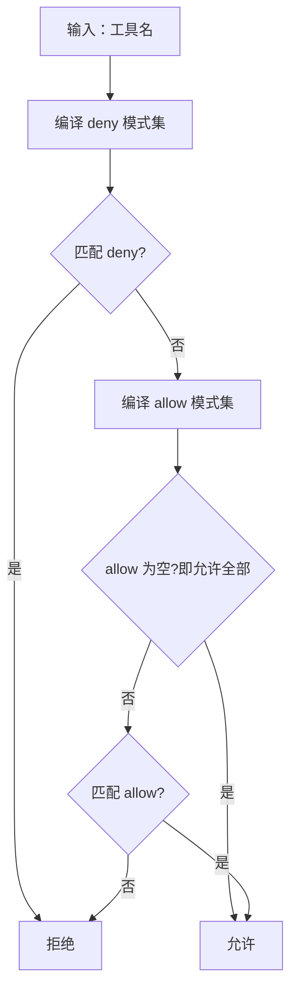
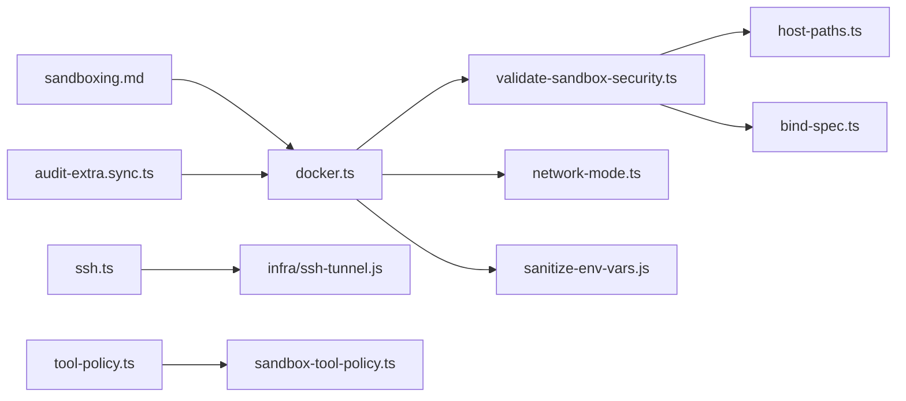

# 沙箱安全机制

<cite>
**本文引用的文件**
- [Dockerfile.sandbox](file://Dockerfile.sandbox)
- [Dockerfile.sandbox-common](file://Dockerfile.sandbox-common)
- [Dockerfile.sandbox-browser](file://Dockerfile.sandbox-browser)
- [src/agents/sandbox/constants.ts](file://src/agents/sandbox/constants.ts)
- [src/agents/sandbox/validate-sandbox-security.ts](file://src/agents/sandbox/validate-sandbox-security.ts)
- [src/agents/sandbox/network-mode.ts](file://src/agents/sandbox/network-mode.ts)
- [src/agents/sandbox/host-paths.ts](file://src/agents/sandbox/host-paths.ts)
- [src/agents/sandbox/bind-spec.ts](file://src/agents/sandbox/bind-spec.ts)
- [src/agents/sandbox/docker.ts](file://src/agents/sandbox/docker.ts)
- [src/agents/sandbox/ssh.ts](file://src/agents/sandbox/ssh.ts)
- [src/agents/sandbox-tool-policy.ts](file://src/agents/sandbox-tool-policy.ts)
- [src/agents/tool-policy.ts](file://src/agents/tool-policy.ts)
- [docs/gateway/sandboxing.md](file://docs/gateway/sandboxing.md)
- [docs/zh-CN/gateway/security/index.md](file://docs/zh-CN/gateway/security/index.md)
- [src/security/audit-extra.sync.ts](file://src/security/audit-extra.sync.ts)
- [src/security/audit.test.ts](file://src/security/audit.test.ts)
</cite>

## 目录
1. [简介](#简介)
2. [项目结构](#项目结构)
3. [核心组件](#核心组件)
4. [架构总览](#架构总览)
5. [详细组件分析](#详细组件分析)
6. [依赖关系分析](#依赖关系分析)
7. [性能考量](#性能考量)
8. [故障排除指南](#故障排除指南)
9. [结论](#结论)
10. [附录](#附录)

## 简介
本文件系统性阐述 OpenClaw 的沙箱安全机制，覆盖容器化沙箱、文件系统隔离、进程限制、工具执行权限控制、网络访问限制、资源配额管理、初始化流程、安全策略配置与运行时监控，并给出逃逸防护、恶意代码检测与异常行为监控建议。同时提供配置示例、性能优化建议与故障排除指南，并说明不同后端（Docker、SSH、OpenShell）的实现差异与兼容性注意事项。

## 项目结构
围绕沙箱的核心代码主要位于 src/agents/sandbox 及其相关模块，配合文档 docs/gateway/sandboxing.md 提供高层配置说明。构建镜像由顶层 Dockerfile.sandbox* 定义，安全审计与告警由 src/security 下的审计模块负责。

**图表来源**
- [src/agents/sandbox/constants.ts:1-56](file://src/agents/sandbox/constants.ts#L1-L56)
- [src/agents/sandbox/validate-sandbox-security.ts:1-344](file://src/agents/sandbox/validate-sandbox-security.ts#L1-L344)
- [src/agents/sandbox/network-mode.ts:1-29](file://src/agents/sandbox/network-mode.ts#L1-L29)
- [src/agents/sandbox/host-paths.ts:1-44](file://src/agents/sandbox/host-paths.ts#L1-L44)
- [src/agents/sandbox/bind-spec.ts:1-35](file://src/agents/sandbox/bind-spec.ts#L1-L35)
- [src/agents/sandbox/docker.ts:1-571](file://src/agents/sandbox/docker.ts#L1-L571)
- [src/agents/sandbox/ssh.ts:1-335](file://src/agents/sandbox/ssh.ts#L1-L335)
- [src/agents/sandbox-tool-policy.ts:1-37](file://src/agents/sandbox-tool-policy.ts#L1-L37)
- [src/agents/tool-policy.ts:1-87](file://src/agents/tool-policy.ts#L1-L87)
- [Dockerfile.sandbox:1-25](file://Dockerfile.sandbox#L1-L25)
- [Dockerfile.sandbox-common:1-49](file://Dockerfile.sandbox-common#L1-L49)
- [Dockerfile.sandbox-browser:1-36](file://Dockerfile.sandbox-browser#L1-L36)
- [docs/gateway/sandboxing.md:1-447](file://docs/gateway/sandboxing.md#L1-L447)
- [docs/zh-CN/gateway/security/index.md:551-568](file://docs/zh-CN/gateway/security/index.md#L551-L568)
- [src/security/audit-extra.sync.ts:898-915](file://src/security/audit-extra.sync.ts#L898-L915)
- [src/security/audit.test.ts:1085-1146](file://src/security/audit.test.ts#L1085-L1146)

**章节来源**
- [docs/gateway/sandboxing.md:1-447](file://docs/gateway/sandboxing.md#L1-L447)
- [Dockerfile.sandbox:1-25](file://Dockerfile.sandbox#L1-L25)
- [Dockerfile.sandbox-common:1-49](file://Dockerfile.sandbox-common#L1-L49)
- [Dockerfile.sandbox-browser:1-36](file://Dockerfile.sandbox-browser#L1-L36)

## 核心组件
- 常量与默认值：定义默认镜像、容器前缀、工作目录、默认工具允许/拒绝列表、浏览器相关默认项等。
- 安全校验：对 bind 挂载、网络模式、seccomp/AppArmor 策略进行强制检查，阻断高危配置。
- 路径与绑定解析：对主机路径进行规范化、同源祖先解析，避免符号链接逃逸；解析 bind 规范 host:container[:mode]。
- Docker 后端：封装 docker 命令调用、容器生命周期管理、环境变量净化、资源限制参数格式化、配置哈希校验与热容器提示。
- SSH 后端：生成临时 SSH 配置与密钥材料，构建远程命令 argv，执行上传/下载与命令执行。
- 工具策略：解析全局与代理级沙箱工具策略，支持通配与组展开，先拒后允。
- 文档与审计：官方沙箱文档提供配置参考；安全审计模块收集危险配置并输出修复建议。

**章节来源**
- [src/agents/sandbox/constants.ts:1-56](file://src/agents/sandbox/constants.ts#L1-L56)
- [src/agents/sandbox/validate-sandbox-security.ts:1-344](file://src/agents/sandbox/validate-sandbox-security.ts#L1-L344)
- [src/agents/sandbox/host-paths.ts:1-44](file://src/agents/sandbox/host-paths.ts#L1-L44)
- [src/agents/sandbox/bind-spec.ts:1-35](file://src/agents/sandbox/bind-spec.ts#L1-L35)
- [src/agents/sandbox/docker.ts:1-571](file://src/agents/sandbox/docker.ts#L1-L571)
- [src/agents/sandbox/ssh.ts:1-335](file://src/agents/sandbox/ssh.ts#L1-L335)
- [src/agents/sandbox-tool-policy.ts:1-37](file://src/agents/sandbox-tool-policy.ts#L1-L37)
- [src/agents/tool-policy.ts:1-87](file://src/agents/tool-policy.ts#L1-L87)
- [docs/gateway/sandboxing.md:1-447](file://docs/gateway/sandboxing.md#L1-L447)
- [src/security/audit-extra.sync.ts:898-915](file://src/security/audit-extra.sync.ts#L898-L915)

## 架构总览
下图展示沙箱初始化与执行的关键交互：配置解析与策略合并、安全校验、容器创建与启动、环境变量净化、资源限制注入、以及可选的 setupCommand 执行。

**图表来源**
- [src/agents/sandbox/docker.ts:317-475](file://src/agents/sandbox/docker.ts#L317-L475)
- [src/agents/sandbox/validate-sandbox-security.ts:328-344](file://src/agents/sandbox/validate-sandbox-security.ts#L328-L344)
- [src/agents/sandbox-tool-policy.ts:21-37](file://src/agents/sandbox-tool-policy.ts#L21-L37)
- [src/agents/tool-policy.ts:35-87](file://src/agents/tool-policy.ts#L35-L87)

## 详细组件分析

### 组件一：安全校验与危险配置阻断
- 绑定挂载校验：禁止挂载系统关键路径（如 /etc、/proc、/sys、/dev、/root、/boot）、Docker 套接字路径；禁止覆盖根目录；禁止非绝对源路径；禁止保留目标路径（/workspace、/agent）；支持白名单源根与“危险覆盖”豁免。
- 网络模式校验：默认阻止 host 与 container:*（命名空间加入）；可通过危险开关允许但需明确信任。
- 安全配置校验：禁止 unconfined 的 seccomp/AppArmor 配置。
- 路径解析：通过现有祖先解析避免符号链接逃逸，二次校验 canonical 路径。

**图表来源**
- [src/agents/sandbox/validate-sandbox-security.ts:96-281](file://src/agents/sandbox/validate-sandbox-security.ts#L96-L281)
- [src/agents/sandbox/host-paths.ts:38-43](file://src/agents/sandbox/host-paths.ts#L38-L43)
- [src/agents/sandbox/bind-spec.ts:7-24](file://src/agents/sandbox/bind-spec.ts#L7-L24)

**章节来源**
- [src/agents/sandbox/validate-sandbox-security.ts:1-344](file://src/agents/sandbox/validate-sandbox-security.ts#L1-L344)
- [src/agents/sandbox/network-mode.ts:1-29](file://src/agents/sandbox/network-mode.ts#L1-L29)
- [src/agents/sandbox/host-paths.ts:1-44](file://src/agents/sandbox/host-paths.ts#L1-L44)
- [src/agents/sandbox/bind-spec.ts:1-35](file://src/agents/sandbox/bind-spec.ts#L1-L35)

### 组件二：Docker 后端与资源配额
- 容器生命周期：ensureSandboxContainer 负责根据配置哈希判断是否需要重建；热容器（近期使用）在配置变更时提示重建；运行中容器仅重启。
- 安全与资源参数：只读根、tmpfs、网络、用户、cap-drop、no-new-privileges、seccomp/AppArmor、DNS、额外 hosts、PID 数限制、内存/swap、CPU、ulimit。
- 环境变量净化：过滤敏感变量，记录阻断与可疑项，标记执行环境键。
- setupCommand：容器创建后一次性执行，适合安装运行时依赖（需网络与可写根）。

**图表来源**
- [src/agents/sandbox/docker.ts:317-475](file://src/agents/sandbox/docker.ts#L317-L475)
- [src/agents/sandbox/docker.ts:477-570](file://src/agents/sandbox/docker.ts#L477-L570)
- [src/agents/sandbox/validate-sandbox-security.ts:328-344](file://src/agents/sandbox/validate-sandbox-security.ts#L328-L344)

**章节来源**
- [src/agents/sandbox/docker.ts:1-571](file://src/agents/sandbox/docker.ts#L1-L571)

### 组件三：SSH 后端与远程执行桥
- 会话建立：从配置文本或设置生成临时 SSH 配置与密钥材料，解析目标主机与端口，支持证书与已知主机文件。
- 远程命令：构建 argv，支持 TTY 强制与环境注入；执行命令并处理 stdout/stderr/close。
- 文件同步：基于 tar + ssh 将本地目录上传到远端指定路径，支持中断信号。

**图表来源**
- [src/agents/sandbox/ssh.ts:104-172](file://src/agents/sandbox/ssh.ts#L104-L172)
- [src/agents/sandbox/ssh.ts:178-224](file://src/agents/sandbox/ssh.ts#L178-L224)
- [src/agents/sandbox/ssh.ts:226-309](file://src/agents/sandbox/ssh.ts#L226-L309)

**章节来源**
- [src/agents/sandbox/ssh.ts:1-335](file://src/agents/sandbox/ssh.ts#L1-L335)

### 组件四：工具执行权限控制与策略合并
- 策略来源优先级：代理级 allow/deny > 全局 allow/deny > 默认 allow/deny。
- 通配与组展开：支持通配符与工具组别名，先拒后允。
- 沙箱工具策略：独立于普通工具策略，可叠加在代理级配置中。

**图表来源**
- [src/agents/tool-policy.ts:16-33](file://src/agents/tool-policy.ts#L16-L33)
- [src/agents/sandbox-tool-policy.ts:21-37](file://src/agents/sandbox-tool-policy.ts#L21-L37)

**章节来源**
- [src/agents/tool-policy.ts:1-87](file://src/agents/tool-policy.ts#L1-L87)
- [src/agents/sandbox-tool-policy.ts:1-37](file://src/agents/sandbox-tool-policy.ts#L1-L37)

### 组件五：镜像与浏览器安全基线
- 基础镜像：debian bookworm slim，安装 bash、ca-certificates、curl、git、jq、python3、ripgrep。
- 通用镜像：在基础镜像上安装 curl/wget/jq/coreutils/grep/nodejs/npm/python3/git/ca-certificates/golang/go/rustc/cargo 等常见工具，并安装 pnpm、bun、Linuxbrew。
- 浏览器镜像：在通用镜像基础上安装 Chromium、novnc/websockify/x11vnc/xvfb，暴露调试与 VNC 端口，提供浏览器入口脚本。
- 浏览器安全启动参数：禁用扩展、崩溃报告、GPU、3D API、软件栅格化等，限制渲染进程数量，支持按需关闭部分安全标志。

**章节来源**
- [Dockerfile.sandbox:1-25](file://Dockerfile.sandbox#L1-L25)
- [Dockerfile.sandbox-common:1-49](file://Dockerfile.sandbox-common#L1-L49)
- [Dockerfile.sandbox-browser:1-36](file://Dockerfile.sandbox-browser#L1-L36)
- [docs/gateway/sandboxing.md:304-371](file://docs/gateway/sandboxing.md#L304-L371)

## 依赖关系分析
- 模块内聚：安全校验、路径解析、绑定解析紧密耦合，共同保证 bind mount 的安全性。
- 外部依赖：Docker 命令行、SSH 客户端、容器网络与卷管理；镜像构建与拉取。
- 风险点：container:* 命名空间加入、host 网络模式、unconfined 安全配置、非绝对源路径、保留目标路径覆盖、未受控的 setupCommand。

**图表来源**
- [src/agents/sandbox/validate-sandbox-security.ts:1-344](file://src/agents/sandbox/validate-sandbox-security.ts#L1-L344)
- [src/agents/sandbox/host-paths.ts:1-44](file://src/agents/sandbox/host-paths.ts#L1-L44)
- [src/agents/sandbox/bind-spec.ts:1-35](file://src/agents/sandbox/bind-spec.ts#L1-L35)
- [src/agents/sandbox/docker.ts:1-571](file://src/agents/sandbox/docker.ts#L1-L571)
- [src/agents/sandbox/network-mode.ts:1-29](file://src/agents/sandbox/network-mode.ts#L1-L29)
- [src/agents/sandbox/ssh.ts:1-335](file://src/agents/sandbox/ssh.ts#L1-L335)
- [src/agents/tool-policy.ts:1-87](file://src/agents/tool-policy.ts#L1-L87)
- [src/agents/sandbox-tool-policy.ts:1-37](file://src/agents/sandbox-tool-policy.ts#L1-L37)
- [docs/gateway/sandboxing.md:1-447](file://docs/gateway/sandboxing.md#L1-L447)
- [src/security/audit-extra.sync.ts:898-915](file://src/security/audit-extra.sync.ts#L898-L915)

**章节来源**
- [src/agents/sandbox/docker.ts:1-571](file://src/agents/sandbox/docker.ts#L1-L571)
- [src/security/audit-extra.sync.ts:898-915](file://src/security/audit-extra.sync.ts#L898-L915)

## 性能考量
- 镜像层缓存：构建脚本利用 apt 缓存 mount，减少重复安装时间。
- 通用镜像复用：common 镜像内置常用工具链，避免每次 exec 安装依赖。
- 容器热复用：最近使用的容器在配置变更时提示重建而非直接删除，降低频繁创建开销。
- 网络与 DNS：默认无网络（none），按需开启 bridge 或自定义网络，减少不必要的出站连接。
- 资源限制：合理设置 CPU、内存、PID 限制与 ulimit，避免资源争用与放大效应。

[本节为通用指导，无需特定文件引用]

## 故障排除指南
- Docker 命令缺失：当 PATH 中找不到 docker 命令时，会提示安装 Docker 或关闭沙箱模式。
- 容器创建失败：检查安全校验错误（危险 bind、网络模式、安全配置）与镜像是否存在。
- 热容器配置变更：若容器近期被使用，配置变更会提示重建命令；否则自动删除旧容器并重建。
- SSH 会话问题：检查临时配置文件权限、密钥材料写入、known_hosts 与 strict host key checking 设置。
- 审计告警：根据审计模块输出的严重级别与修复建议调整配置（如移除 host 网络、禁用 unconfined 安全配置、修正危险 bind）。

**章节来源**
- [src/agents/sandbox/docker.ts:114-125](file://src/agents/sandbox/docker.ts#L114-L125)
- [src/agents/sandbox/docker.ts:534-543](file://src/agents/sandbox/docker.ts#L534-L543)
- [src/agents/sandbox/ssh.ts:174-176](file://src/agents/sandbox/ssh.ts#L174-L176)
- [src/security/audit-extra.sync.ts:898-915](file://src/security/audit-extra.sync.ts#L898-L915)
- [src/security/audit.test.ts:1085-1146](file://src/security/audit.test.ts#L1085-L1146)

## 结论
OpenClaw 的沙箱安全机制通过“强校验 + 最小权限 + 可观测”的设计，在工具执行层面提供了显著的隔离与保护。结合镜像安全基线、严格的网络与安全配置限制、资源配额与环境变量净化，能够有效降低模型驱动的误操作风险与潜在逃逸面。建议在生产环境中默认启用沙箱，严格限制网络与安全配置，定期审计并遵循“最小权限”原则。

[本节为总结，无需特定文件引用]

## 附录

### 沙箱初始化流程（概要）
- 解析策略：合并全局与代理级沙箱工具策略。
- 安全校验：校验 bind、网络、seccomp/AppArmor。
- 环境净化：过滤敏感变量并标记执行环境。
- 容器准备：确保镜像存在、计算配置哈希、必要时重建容器、启动容器。
- 可选设置：执行 setupCommand 安装运行时依赖。

**章节来源**
- [src/agents/sandbox/docker.ts:438-475](file://src/agents/sandbox/docker.ts#L438-L475)
- [src/agents/sandbox/docker.ts:520-570](file://src/agents/sandbox/docker.ts#L520-L570)
- [src/agents/tool-policy.ts:35-87](file://src/agents/tool-policy.ts#L35-L87)

### 安全策略配置要点
- 网络：默认 none；如需外联使用 bridge 或自定义网络；严禁 host 与 container:*。
- 绑定：仅挂载项目路径；避免系统路径与套接字；必要时使用 ro；避免覆盖 /workspace 与 /agent。
- 安全：禁用 unconfined seccomp/AppArmor；启用 cap-drop 与 no-new-privileges。
- 环境：避免注入敏感凭据；通过 secrets 管理；仅传递必要变量。
- 资源：设置 CPU/内存/PID/ulimit，防止资源滥用。

**章节来源**
- [docs/gateway/sandboxing.md:372-404](file://docs/gateway/sandboxing.md#L372-L404)
- [src/agents/sandbox/validate-sandbox-security.ts:283-326](file://src/agents/sandbox/validate-sandbox-security.ts#L283-L326)
- [src/agents/sandbox/docker.ts:371-421](file://src/agents/sandbox/docker.ts#L371-L421)

### 不同后端实现差异与兼容性
- Docker 后端：支持完整容器能力（网络、卷、安全选项、资源限制），默认无网络；支持 setupCommand。
- SSH 后端：远程执行与文件桥接，不支持浏览器沙箱；不复用 docker.* 运行时参数；认证材料可来自文件或 SecretRef。
- OpenShell 后端：复用 SSH 传输，支持 mirror 与 remote 两种工作区模式；生命周期与 Docker 后端一致；当前不支持浏览器与部分 docker.* 绑定。

**章节来源**
- [docs/gateway/sandboxing.md:57-170](file://docs/gateway/sandboxing.md#L57-L170)
- [src/agents/sandbox/ssh.ts:104-172](file://src/agents/sandbox/ssh.ts#L104-L172)

### 逃逸防护与异常行为监控建议
- 逃逸防护：严格限制网络与命名空间加入；避免 unconfined 安全配置；最小化 bind 范围；启用 no-new-privileges 与 cap-drop。
- 恶意代码检测：结合工具策略与审计模块，对危险模式（如 host 网络、container:*、unconfined）进行告警；对异常 exec 行为进行日志与指标监控。
- 异常行为监控：关注容器重启频率、资源使用峰值、网络出站异常、环境变量注入尝试；对沙箱策略变更进行审计与回溯。

**章节来源**
- [src/security/audit-extra.sync.ts:898-915](file://src/security/audit-extra.sync.ts#L898-L915)
- [src/security/audit.test.ts:1085-1146](file://src/security/audit.test.ts#L1085-L1146)
- [docs/zh-CN/gateway/security/index.md:551-568](file://docs/zh-CN/gateway/security/index.md#L551-L568)