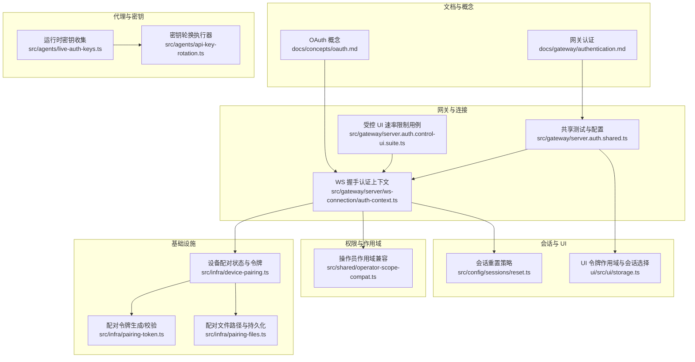
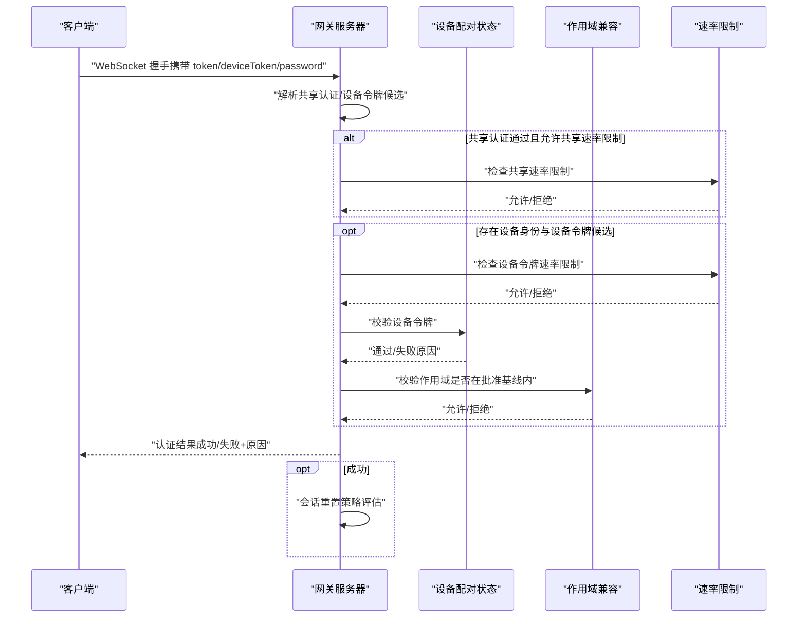
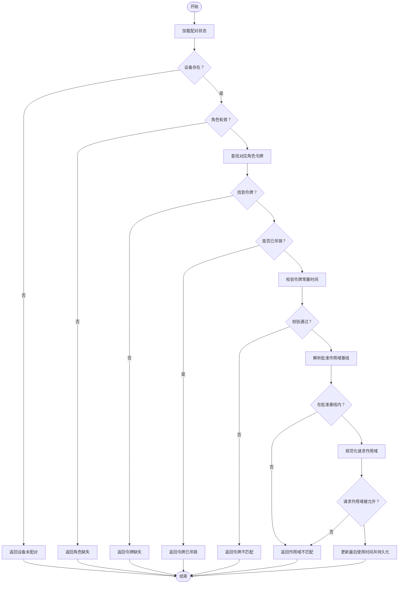
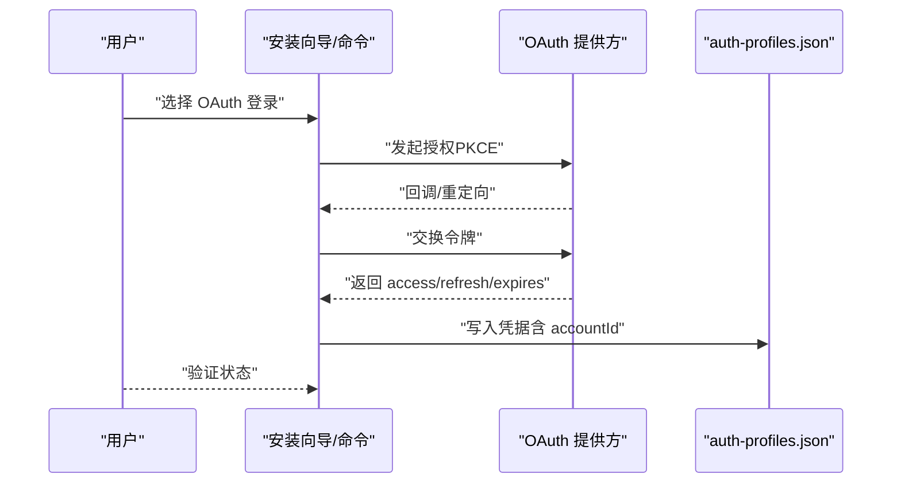
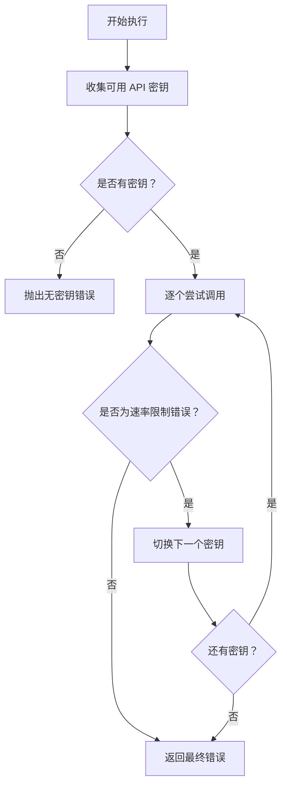
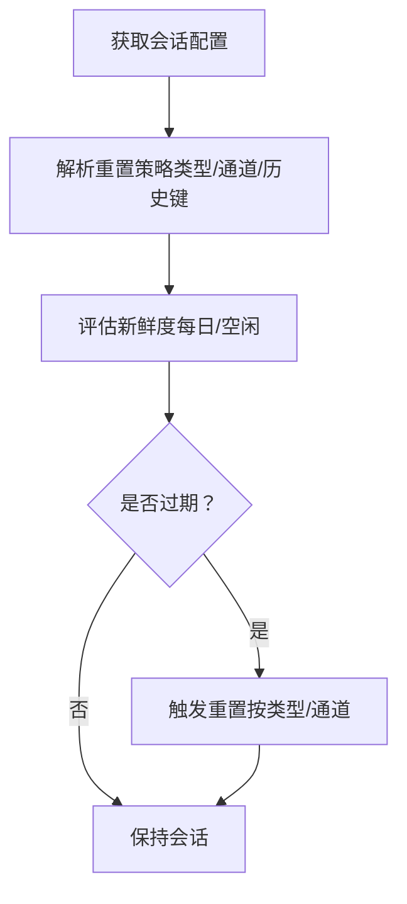
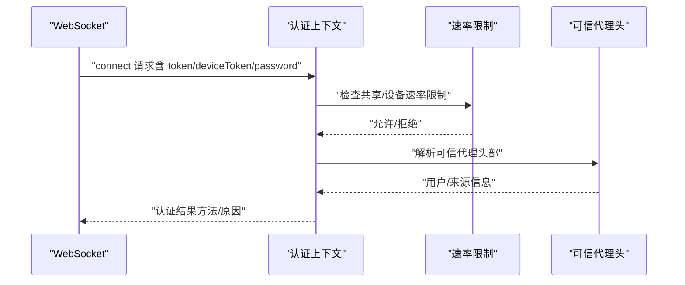
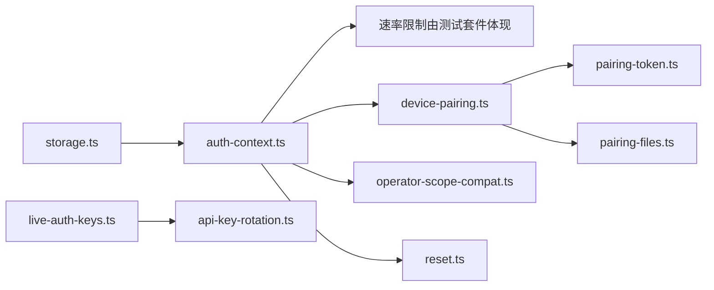

# 认证与授权

<cite>
**本文引用的文件**
- [oauth.md](file://docs/concepts/oauth.md)
- [authentication.md](file://docs/gateway/authentication.md)
- [server.auth.shared.ts](file://src/gateway/server.auth.shared.ts)
- [auth-context.ts](file://src/gateway/server/ws-connection/auth-context.ts)
- [device-pairing.ts](file://src/infra/device-pairing.ts)
- [pairing-token.ts](file://src/infra/pairing-token.ts)
- [pairing-files.ts](file://src/infra/pairing-files.ts)
- [operator-scope-compat.ts](file://src/shared/operator-scope-compat.ts)
- [live-auth-keys.ts](file://src/agents/live-auth-keys.ts)
- [api-key-rotation.ts](file://src/agents/api-key-rotation.ts)
- [reset.ts](file://src/config/sessions/reset.ts)
- [storage.ts](file://ui/src/ui/storage.ts)
- [server.auth.control-ui.suite.ts](file://src/gateway/server.auth.control-ui.suite.ts)
</cite>

## 目录
1. [简介](#简介)
2. [项目结构](#项目结构)
3. [核心组件](#核心组件)
4. [架构总览](#架构总览)
5. [详细组件分析](#详细组件分析)
6. [依赖关系分析](#依赖关系分析)
7. [性能考量](#性能考量)
8. [故障排查指南](#故障排查指南)
9. [结论](#结论)
10. [附录](#附录)

## 简介
本文件系统化梳理 OpenClaw 的认证与授权体系，覆盖设备配对流程、OAuth 授权机制、API 密钥管理、多因素认证思路、会话管理与令牌刷新策略、权限级别与作用域控制、认证中间件与请求拦截、安全头设置、认证配置示例、密钥轮换流程以及安全审计日志建议，并对比不同认证方式的优缺点与适用场景。

## 项目结构
围绕认证与授权的关键模块分布如下：
- 文档层：OAuth 流程与存储、网关认证说明
- 网关层：WebSocket 连接握手与认证上下文、受控 UI 配置与速率限制
- 基础设施层：设备配对状态、设备令牌生成与校验、配对文件读写
- 权限与作用域：操作员作用域兼容与授权判定
- 代理与密钥：运行时 API 密钥收集、轮换与错误识别
- 会话与重置：会话重置策略与新鲜度评估
- UI 存储：网关令牌作用域与会话选择



**图表来源**
- [oauth.md:1-159](file://docs/concepts/oauth.md#L1-L159)
- [authentication.md:1-180](file://docs/gateway/authentication.md#L1-L180)
- [server.auth.shared.ts:1-397](file://src/gateway/server.auth.shared.ts#L1-L397)
- [auth-context.ts:1-263](file://src/gateway/server/ws-connection/auth-context.ts#L1-L263)
- [device-pairing.ts:1-745](file://src/infra/device-pairing.ts#L1-L745)
- [pairing-token.ts:1-16](file://src/infra/pairing-token.ts#L1-L16)
- [pairing-files.ts:1-51](file://src/infra/pairing-files.ts#L1-L51)
- [operator-scope-compat.ts:1-49](file://src/shared/operator-scope-compat.ts#L1-L49)
- [live-auth-keys.ts:1-203](file://src/agents/live-auth-keys.ts#L1-L203)
- [api-key-rotation.ts:1-46](file://src/agents/api-key-rotation.ts#L1-L46)
- [reset.ts:1-177](file://src/config/sessions/reset.ts#L1-L177)
- [storage.ts:79-120](file://ui/src/ui/storage.ts#L79-L120)
- [server.auth.control-ui.suite.ts:475-507](file://src/gateway/server.auth.control-ui.suite.ts#L475-L507)

**章节来源**
- [oauth.md:1-159](file://docs/concepts/oauth.md#L1-L159)
- [authentication.md:1-180](file://docs/gateway/authentication.md#L1-L180)
- [server.auth.shared.ts:1-397](file://src/gateway/server.auth.shared.ts#L1-L397)
- [auth-context.ts:1-263](file://src/gateway/server/ws-connection/auth-context.ts#L1-L263)
- [device-pairing.ts:1-745](file://src/infra/device-pairing.ts#L1-L745)
- [pairing-token.ts:1-16](file://src/infra/pairing-token.ts#L1-L16)
- [pairing-files.ts:1-51](file://src/infra/pairing-files.ts#L1-L51)
- [operator-scope-compat.ts:1-49](file://src/shared/operator-scope-compat.ts#L1-L49)
- [live-auth-keys.ts:1-203](file://src/agents/live-auth-keys.ts#L1-L203)
- [api-key-rotation.ts:1-46](file://src/agents/api-key-rotation.ts#L1-L46)
- [reset.ts:1-177](file://src/config/sessions/reset.ts#L1-L177)
- [storage.ts:79-120](file://ui/src/ui/storage.ts#L79-L120)
- [server.auth.control-ui.suite.ts:475-507](file://src/gateway/server.auth.control-ui.suite.ts#L475-L507)

## 核心组件
- 设备配对与令牌
  - 设备配对状态管理（待批准、已配对）、令牌生成与校验、作用域基线与批准范围、令牌轮换与吊销
- WS 握手认证上下文
  - 共享密钥/密码认证、引导令牌、设备令牌候选、速率限制、认证决策
- OAuth 与 API 密钥
  - OAuth 存储与多账户路由、API 密钥轮换与错误识别
- 会话与重置
  - 会话类型与重置策略、每日/空闲重置、新鲜度评估
- UI 存储与作用域
  - 网关令牌作用域归一化、按作用域选择会话

**章节来源**
- [device-pairing.ts:1-745](file://src/infra/device-pairing.ts#L1-L745)
- [auth-context.ts:1-263](file://src/gateway/server/ws-connection/auth-context.ts#L1-L263)
- [oauth.md:1-159](file://docs/concepts/oauth.md#L1-L159)
- [authentication.md:1-180](file://docs/gateway/authentication.md#L1-L180)
- [live-auth-keys.ts:1-203](file://src/agents/live-auth-keys.ts#L1-L203)
- [api-key-rotation.ts:1-46](file://src/agents/api-key-rotation.ts#L1-L46)
- [reset.ts:1-177](file://src/config/sessions/reset.ts#L1-L177)
- [storage.ts:79-120](file://ui/src/ui/storage.ts#L79-L120)

## 架构总览
下图展示从客户端到网关的认证与授权关键交互，包括设备配对、令牌校验、速率限制与会话重置。



**图表来源**
- [auth-context.ts:84-167](file://src/gateway/server/ws-connection/auth-context.ts#L84-L167)
- [auth-context.ts:169-262](file://src/gateway/server/ws-connection/auth-context.ts#L169-L262)
- [device-pairing.ts:526-574](file://src/infra/device-pairing.ts#L526-L574)
- [operator-scope-compat.ts:31-49](file://src/shared/operator-scope-compat.ts#L31-L49)
- [reset.ts:84-120](file://src/config/sessions/reset.ts#L84-L120)

## 详细组件分析

### 设备配对与令牌管理
- 状态模型
  - 待批准请求与已配对设备记录，支持合并角色与作用域、批准基线与实际作用域分离
- 令牌生命周期
  - 生成新令牌、校验令牌（常量时间比较）、轮换与吊销、最后使用时间更新
- 作用域控制
  - 批准基线与请求作用域的兼容性检查，操作员角色的特殊规则
- 并发与持久化
  - 文件锁保护状态读写，过期请求清理



**图表来源**
- [device-pairing.ts:526-574](file://src/infra/device-pairing.ts#L526-L574)
- [pairing-token.ts:10-15](file://src/infra/pairing-token.ts#L10-L15)
- [operator-scope-compat.ts:31-49](file://src/shared/operator-scope-compat.ts#L31-L49)

**章节来源**
- [device-pairing.ts:1-745](file://src/infra/device-pairing.ts#L1-L745)
- [pairing-token.ts:1-16](file://src/infra/pairing-token.ts#L1-L16)
- [pairing-files.ts:1-51](file://src/infra/pairing-files.ts#L1-L51)
- [operator-scope-compat.ts:1-49](file://src/shared/operator-scope-compat.ts#L1-L49)

### OAuth 授权机制与多账户路由
- 令牌交换与存储
  - 支持 PKCE 的 OAuth 交换、刷新与过期处理；凭据集中存储于每个代理的 auth-profiles.json
- 多账户模式
  - 推荐使用独立代理隔离“个人/工作”等；同一代理内可使用多个 profile 并通过会话覆盖选择
- 订阅型授权
  - Anthropic setup-token 作为订阅授权的兼容路径，但需自行确认当前政策风险



**图表来源**
- [oauth.md:83-159](file://docs/concepts/oauth.md#L83-L159)
- [authentication.md:116-180](file://docs/gateway/authentication.md#L116-L180)

**章节来源**
- [oauth.md:1-159](file://docs/concepts/oauth.md#L1-L159)
- [authentication.md:1-180](file://docs/gateway/authentication.md#L1-L180)

### API 密钥管理与轮换
- 运行时密钥收集
  - 支持单键强制、键列表、主键、前缀键与回退变量，自动去重
- 错误识别与轮换
  - 仅对速率限制类错误进行轮换；非速率限制错误不自动切换
- 轮换策略
  - 优先级顺序与失败回退行为明确，最终返回最后一次尝试的错误



**图表来源**
- [live-auth-keys.ts:100-140](file://src/agents/live-auth-keys.ts#L100-L140)
- [live-auth-keys.ts:150-202](file://src/agents/live-auth-keys.ts#L150-L202)
- [api-key-rotation.ts:40-46](file://src/agents/api-key-rotation.ts#L40-L46)

**章节来源**
- [live-auth-keys.ts:1-203](file://src/agents/live-auth-keys.ts#L1-L203)
- [api-key-rotation.ts:1-46](file://src/agents/api-key-rotation.ts#L1-L46)
- [authentication.md:123-139](file://docs/gateway/authentication.md#L123-L139)

### 会话管理与令牌刷新策略
- 会话重置策略
  - 支持“每日重置”和“空闲重置”，按通道/类型覆盖，兼容历史配置键
- 新鲜度评估
  - 基于更新时间与策略计算是否过期，支持按小时重置点
- 刷新与过期
  - OAuth 凭据存储过期时间戳，运行时在过期前使用，过期后在文件锁下刷新并覆盖



**图表来源**
- [reset.ts:84-120](file://src/config/sessions/reset.ts#L84-L120)
- [reset.ts:139-159](file://src/config/sessions/reset.ts#L139-L159)
- [oauth.md:112-122](file://docs/concepts/oauth.md#L112-L122)

**章节来源**
- [reset.ts:1-177](file://src/config/sessions/reset.ts#L1-L177)
- [oauth.md:112-122](file://docs/concepts/oauth.md#L112-L122)

### 权限级别、角色与作用域控制
- 角色与作用域
  - 操作员角色具备读/写/管理的层级语义；非操作员角色采用精确匹配
- 批准基线与请求作用域
  - 请求作用域必须在批准基线内，且对操作员角色应用特殊满足规则
- 设备令牌作用域
  - 设备令牌的作用域集合与批准基线共同决定授权范围

```mermaid
classDiagram
class OperatorScope {
+normalizeScopeList(scopes) string[]
+operatorScopeSatisfied(requested, granted) bool
+roleScopesAllow(role, requested, allowed) bool
}
class DevicePairing {
+approveDevicePairing(requestId, options?) ApprovedDevicePairingResult
+ensureDeviceToken(deviceId, role, scopes) DeviceAuthToken
+verifyDeviceToken(deviceId, token, role, scopes) {ok, reason}
+rotateDeviceToken(deviceId, role, scopes?) RotateDeviceTokenResult
+revokeDeviceToken(deviceId, role) DeviceAuthToken
}
OperatorScope <.. DevicePairing : "用于作用域判定"
```

**图表来源**
- [operator-scope-compat.ts:1-49](file://src/shared/operator-scope-compat.ts#L1-L49)
- [device-pairing.ts:351-440](file://src/infra/device-pairing.ts#L351-L440)
- [device-pairing.ts:526-574](file://src/infra/device-pairing.ts#L526-L574)

**章节来源**
- [operator-scope-compat.ts:1-49](file://src/shared/operator-scope-compat.ts#L1-L49)
- [device-pairing.ts:236-276](file://src/infra/device-pairing.ts#L236-L276)
- [device-pairing.ts:351-440](file://src/infra/device-pairing.ts#L351-L440)

### 认证中间件、请求拦截与安全头
- 中间件职责
  - 解析握手参数（token/deviceToken/password），判定共享认证与设备令牌候选，执行速率限制与作用域校验
- 请求拦截
  - 在共享认证与设备令牌之间区分处理，确保设备令牌速率限制独立于共享认证
- 安全头
  - 受控 UI 支持可信代理模式，通过特定头部（如 x-forwarded-proto/x-forwarded-user）进行身份断言



**图表来源**
- [auth-context.ts:84-167](file://src/gateway/server/ws-connection/auth-context.ts#L84-L167)
- [auth-context.ts:169-262](file://src/gateway/server/ws-connection/auth-context.ts#L169-L262)
- [server.auth.shared.ts:220-243](file://src/gateway/server.auth.shared.ts#L220-L243)

**章节来源**
- [auth-context.ts:1-263](file://src/gateway/server/ws-connection/auth-context.ts#L1-L263)
- [server.auth.shared.ts:220-243](file://src/gateway/server.auth.shared.ts#L220-L243)

### 多因素认证与会话管理
- 多因素思路
  - 设备身份与设备令牌结合，共享认证（token/password）与设备令牌互斥或叠加；速率限制分别作用于共享与设备令牌
- 会话管理
  - 通过会话重置策略控制会话生命周期，支持按通道/类型差异化配置

**章节来源**
- [auth-context.ts:114-134](file://src/gateway/server/ws-connection/auth-context.ts#L114-L134)
- [reset.ts:84-120](file://src/config/sessions/reset.ts#L84-L120)

### 认证配置示例与密钥轮换流程
- OAuth 配置
  - 使用安装向导或命令行登录，支持多 profile 与会话覆盖
- API 密钥轮换
  - 通过环境变量与前缀键收集密钥，仅在速率限制错误时轮换，失败回退策略明确

**章节来源**
- [oauth.md:123-159](file://docs/concepts/oauth.md#L123-L159)
- [authentication.md:123-139](file://docs/gateway/authentication.md#L123-L139)
- [live-auth-keys.ts:100-140](file://src/agents/live-auth-keys.ts#L100-L140)
- [api-key-rotation.ts:40-46](file://src/agents/api-key-rotation.ts#L40-L46)

### 安全审计日志建议
- 建议记录
  - 认证尝试（成功/失败/速率限制）、设备令牌校验结果、作用域拒绝原因、共享与设备令牌速率限制触发、会话重置事件
- 实施要点
  - 将速率限制与认证决策纳入统一审计流水，便于追踪异常与攻击

[本节为通用建议，无需具体文件引用]

## 依赖关系分析
- 组件耦合
  - 认证上下文依赖速率限制、可信代理配置与设备配对状态
  - 设备配对依赖令牌生成/校验与文件持久化
  - 会话重置策略与配置类型解耦，支持多维度覆盖
- 外部依赖
  - OAuth 提供方、API 提供方的错误语义影响轮换策略
  - UI 存储负责网关令牌作用域与会话选择



**图表来源**
- [auth-context.ts:1-263](file://src/gateway/server/ws-connection/auth-context.ts#L1-L263)
- [device-pairing.ts:1-745](file://src/infra/device-pairing.ts#L1-L745)
- [pairing-token.ts:1-16](file://src/infra/pairing-token.ts#L1-L16)
- [pairing-files.ts:1-51](file://src/infra/pairing-files.ts#L1-L51)
- [operator-scope-compat.ts:1-49](file://src/shared/operator-scope-compat.ts#L1-L49)
- [live-auth-keys.ts:1-203](file://src/agents/live-auth-keys.ts#L1-L203)
- [api-key-rotation.ts:1-46](file://src/agents/api-key-rotation.ts#L1-L46)
- [reset.ts:1-177](file://src/config/sessions/reset.ts#L1-L177)
- [storage.ts:79-120](file://ui/src/ui/storage.ts#L79-L120)

**章节来源**
- [server.auth.control-ui.suite.ts:475-507](file://src/gateway/server.auth.control-ui.suite.ts#L475-L507)

## 性能考量
- 速率限制
  - 分离共享与设备令牌的速率限制，避免相互干扰；在认证成功后及时重置计数
- 并发与持久化
  - 配对状态读写使用文件锁，减少竞争条件；定期清理过期待批准请求
- 会话重置
  - 合理设置每日重置小时与空闲分钟，平衡资源占用与安全性

[本节为通用指导，无需具体文件引用]

## 故障排查指南
- 设备令牌速率限制
  - 当设备令牌与共享认证同时出现时，速率限制分别生效；可通过测试套件复现“设备令牌锁定而共享认证仍可使用”的场景
- OAuth 凭据问题
  - 使用状态检查命令确认 profile 是否过期或缺失；必要时重新登录或粘贴 token
- API 密钥轮换
  - 若非速率限制错误，不会自动轮换；请检查错误消息关键字以判断是否应轮换

**章节来源**
- [server.auth.control-ui.suite.ts:475-507](file://src/gateway/server.auth.control-ui.suite.ts#L475-L507)
- [authentication.md:160-180](file://docs/gateway/authentication.md#L160-L180)
- [live-auth-keys.ts:150-202](file://src/agents/live-auth-keys.ts#L150-L202)

## 结论
OpenClaw 的认证与授权体系以“设备身份+设备令牌”为核心，辅以共享认证与可信代理头实现灵活的身份断言；通过批准基线与作用域兼容保障最小权限；结合会话重置策略与 API 密钥轮换提升安全性与可用性。OAuth 与 API 密钥双轨并行，满足不同场景需求；UI 层面提供作用域化的令牌选择，增强用户体验与安全可控性。

## 附录
- 不同认证方式对比
  - 设备令牌：强绑定设备身份，适合长期稳定连接；需注意速率限制与吊销策略
  - 共享密钥/密码：快速接入，适合临时或运维场景；需严格速率限制
  - OAuth：支持刷新与多账户路由，适合多租户与外部集成；需关注令牌失效与跨客户端冲突
  - API 密钥：最稳定，适合长生命周期服务；需完善的轮换与监控

[本节为通用总结，无需具体文件引用]