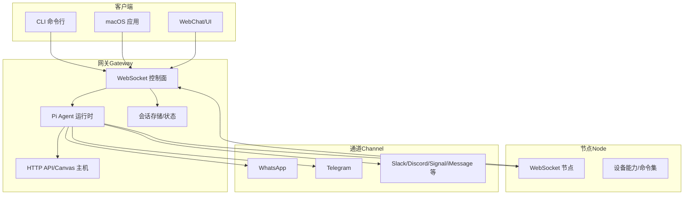
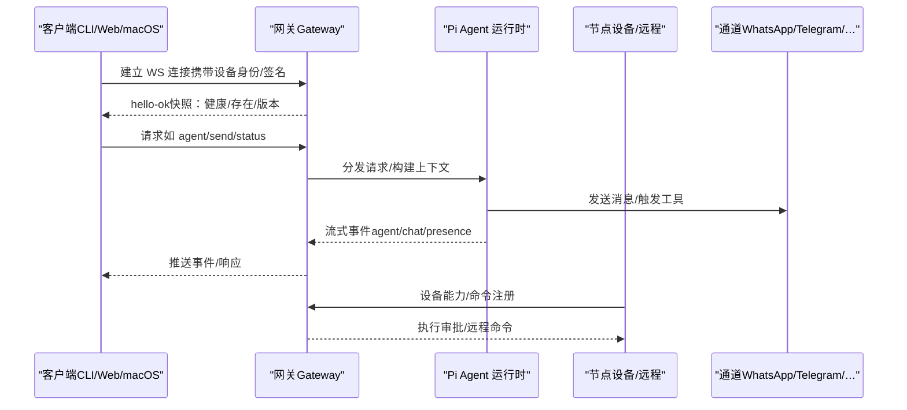
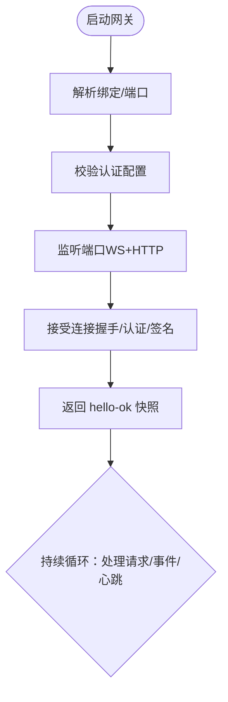
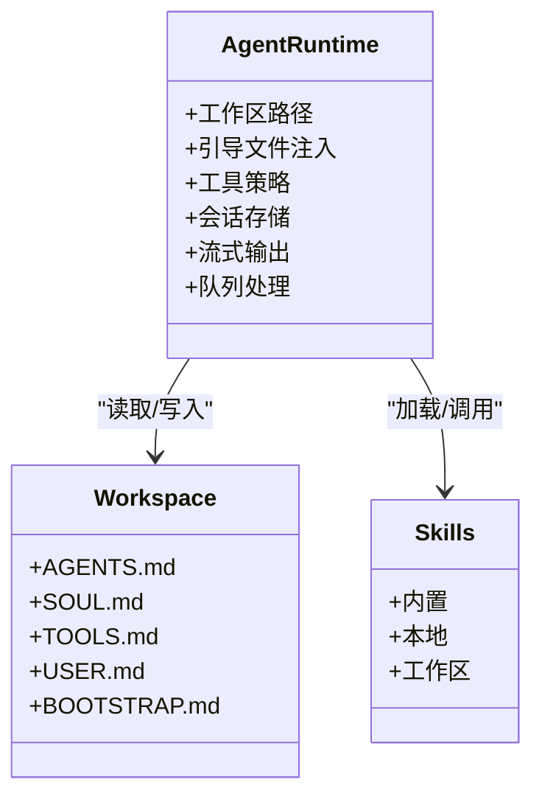
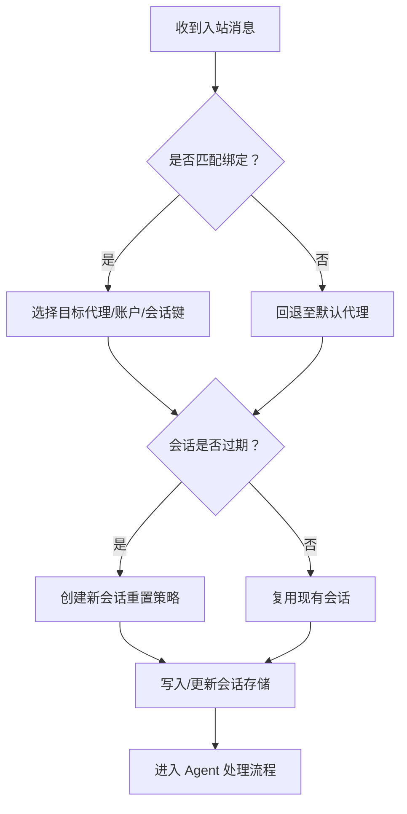
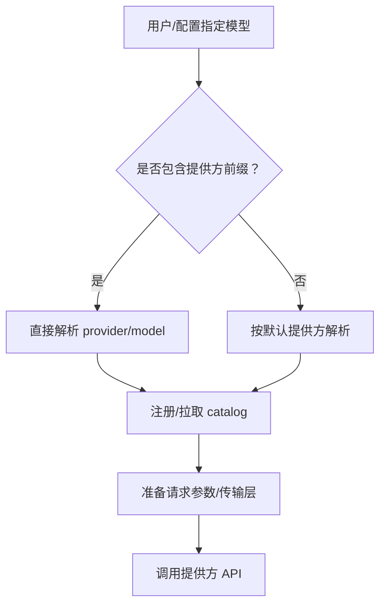
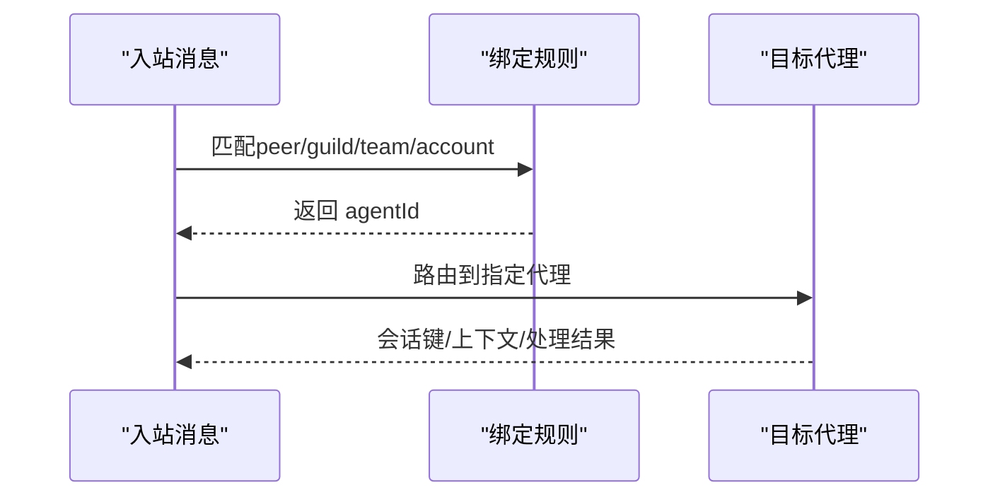
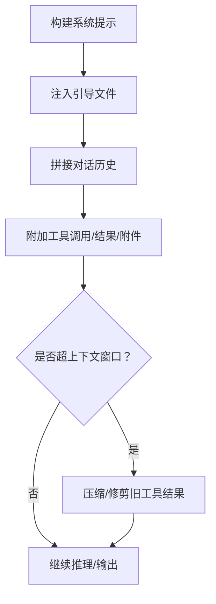
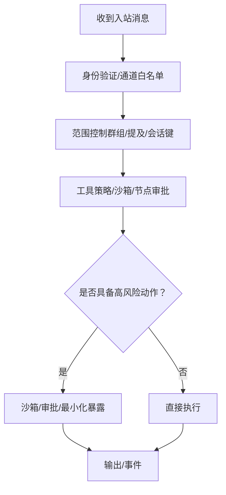
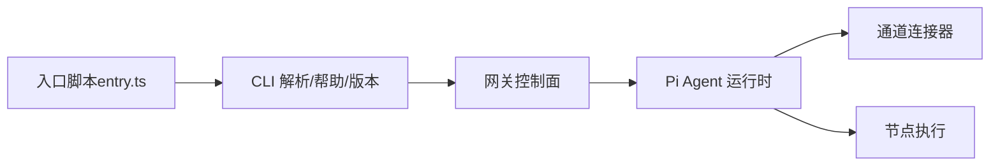

# 核心概念

<cite>
**本文引用的文件**
- [README.md](file://README.md)
- [architecture.md](file://docs/concepts/architecture.md)
- [agent.md](file://docs/concepts/agent.md)
- [session.md](file://docs/concepts/session.md)
- [index.md](file://docs/gateway/index.md)
- [context.md](file://docs/concepts/context.md)
- [multi-agent.md](file://docs/concepts/multi-agent.md)
- [model-providers.md](file://docs/concepts/model-providers.md)
- [index.md](file://docs/gateway/security/index.md)
- [entry.ts](file://src/entry.ts)
</cite>

## 目录
1. [引言](#引言)
2. [项目结构](#项目结构)
3. [核心组件](#核心组件)
4. [架构总览](#架构总览)
5. [详细组件分析](#详细组件分析)
6. [依赖关系分析](#依赖关系分析)
7. [性能考量](#性能考量)
8. [故障排查指南](#故障排查指南)
9. [结论](#结论)
10. [附录](#附录)

## 引言
本篇“核心概念”旨在系统化阐释 OpenClaw 的关键设计与运行机制，围绕以下主题展开：网关控制平面架构、Pi Agent 运行时、会话管理、模型选择策略、多代理路由、上下文管理、安全沙箱等。文档以循序渐进的方式，既给出高层概览，也提供代码级映射与可视化图示，帮助开发者快速理解系统内在逻辑与设计权衡。

## 项目结构
OpenClaw 是一个在本地设备上运行的个人 AI 助手平台，核心由“网关（Gateway）+ 多通道接入 + 多代理运行时 + 工具与技能体系”构成。其入口通过 CLI 启动，随后在单端口上复用 WebSocket 控制面与 HTTP 表面（含 Canvas/A2UI 主机），并以“节点（Node）+ 客户端（macOS/CLI/Web）”的组合实现跨平台控制与执行。

图表来源
- [architecture.md:12-26](file://docs/concepts/architecture.md#L12-L26)
- [index.md:68-77](file://docs/gateway/index.md#L68-L77)

章节来源
- [README.md:185-202](file://README.md#L185-L202)
- [architecture.md:12-26](file://docs/concepts/architecture.md#L12-L26)
- [index.md:68-77](file://docs/gateway/index.md#L68-L77)

## 核心组件
- 网关（Gateway）
  - 单一长连接控制平面，承载通道连接、事件推送、工具调用与 HTTP 服务（Canvas/A2UI）。
  - 默认绑定回环地址，需配置认证；支持 Tailscale/SSH 隧道远程访问。
- Pi Agent 运行时
  - 基于 pi-mono 的嵌入式运行时，负责会话生命周期、工具调度、流式输出与块级分片。
  - 支持阻塞式/非阻塞式工具调用、块级流式输出、队列模式下的消息注入。
- 会话管理
  - 以“会话键（sessionKey）”为维度隔离上下文，支持直接对话（DM）与群组/频道会话的多粒度隔离策略。
  - 提供维护策略（清理、轮转、磁盘预算）、发送策略（按类型/前缀拒绝投递）与生命周期重置规则。
- 模型选择与提供方
  - 统一的模型引用格式（provider/model），内置多提供方插件与自定义 catalog 注册。
  - 支持密钥轮换、传输层选择（WebSocket/SSE）、默认思维层级与缓存 TTL 策略。
- 多代理路由
  - 在同一网关内托管多个“完全隔离”的代理（工作区/状态目录/会话存储），并通过“绑定规则”将入站消息路由到指定代理。
- 上下文管理
  - 明确“上下文”边界：系统提示、对话历史、工具调用/结果、附件与压缩摘要。
  - 提供上下文检查命令与压缩/修剪策略，避免超出模型上下文窗口。
- 安全与沙箱
  - 以“个人助理信任模型”为基础，强调“身份—范围—模型”的三段式安全前置。
  - 支持 per-agent 沙箱与工具策略，节点配对与执行审批，以及反向代理与 mDNS 发现的安全配置建议。

章节来源
- [agent.md:10-124](file://docs/concepts/agent.md#L10-L124)
- [session.md:10-311](file://docs/concepts/session.md#L10-L311)
- [model-providers.md:14-595](file://docs/concepts/model-providers.md#L14-L595)
- [multi-agent.md:10-553](file://docs/concepts/multi-agent.md#L10-L553)
- [context.md:10-170](file://docs/concepts/context.md#L10-L170)
- [index.md:10-800](file://docs/gateway/security/index.md#L10-L800)

## 架构总览
下图展示从客户端到网关、再到通道与节点的整体交互路径，以及控制面与数据面的职责划分。

图表来源
- [architecture.md:59-78](file://docs/concepts/architecture.md#L59-L78)
- [index.md:202-214](file://docs/gateway/index.md#L202-L214)

章节来源
- [architecture.md:12-140](file://docs/concepts/architecture.md#L12-L140)
- [index.md:68-106](file://docs/gateway/index.md#L68-L106)

## 详细组件分析

### 网关控制平面架构
- 单一控制平面
  - 一个网关实例拥有单一 Baileys 会话（主机维度），统一管理所有通道连接与事件。
  - 控制面通过 WebSocket 提供请求/响应与事件推送，HTTP 服务用于 Canvas/A2UI 与工具调用。
- 认证与配对
  - 必须在握手阶段提供认证（令牌/密码/受信代理），且设备身份需签名挑战。
  - 本地连接可自动批准，远程连接仍需显式批准；支持 Tailnet 身份头与受信代理模式。
- 远程访问
  - 推荐使用 Tailscale Serve/Funnel 或 SSH 隧道；隧道内仍需认证。
- 运维快照
  - 启动方式、健康检查、监督与重启、热重载模式（off/hot/restart/hybrid）。

图表来源
- [index.md:27-66](file://docs/gateway/index.md#L27-L66)
- [architecture.md:93-109](file://docs/concepts/architecture.md#L93-L109)

章节来源
- [index.md:68-124](file://docs/gateway/index.md#L68-L124)
- [architecture.md:12-140](file://docs/concepts/architecture.md#L12-L140)

### Pi Agent 运行时机制
- 工作区与引导文件
  - 单一工作区作为工具与上下文的唯一工作目录；首次会话注入 AGENTS/SOUL/TOOLS/USER 等文件内容。
- 工具与技能
  - 内置工具始终可用（受工具策略约束）；技能来自内置/本地/工作区三层，冲突时工作区优先。
- 会话持久化
  - 会话转录以 JSONL 存储于 agents/<agentId>/sessions/<SessionId>.jsonl。
- 流式与块级输出
  - 支持块级流式输出与软合并，减少单行刷屏；队列模式支持“注入当前轮次后继续处理排队消息”。

图表来源
- [agent.md:12-124](file://docs/concepts/agent.md#L12-L124)

章节来源
- [agent.md:10-124](file://docs/concepts/agent.md#L10-L124)

### 会话管理系统
- 会话键与路由
  - 直接对话默认主键（main），也可按通道/账号/发送者进行隔离（per-channel-peer/per-account-channel-peer）。
  - 群组/频道会话独立键空间，支持主题/线程扩展。
- 生命周期与重置
  - 支持按日/空闲重置，或按类型/通道覆盖；/new 与 /reset 可强制新会话。
- 维护策略
  - 清理过期条目、限制条目数量、轮转 sessions.json、磁盘预算与高水位阈值。
- 发送策略
  - 按类型/前缀拒绝投递，支持运行时覆盖（/send on/off/inherit）。

图表来源
- [multi-agent.md:172-186](file://docs/concepts/multi-agent.md#L172-L186)
- [session.md:189-217](file://docs/concepts/session.md#L189-L217)

章节来源
- [session.md:10-311](file://docs/concepts/session.md#L10-L311)
- [multi-agent.md:10-553](file://docs/concepts/multi-agent.md#L10-L553)

### 模型选择策略
- 引用与解析
  - 使用 provider/model 格式；若模型 ID 自带斜杠则需提供前缀；缺省时按默认提供方解析。
- 提供方生态
  - 内置 Anthropic/OpenAI/Gemini/Minimax/Cloudflare 等插件；支持自定义 models.providers 注册。
- 密钥轮换与传输
  - 支持多密钥轮换（按优先级与错误类型重试），并可为模型设置传输层偏好（WebSocket/SSE/auto）。
- 思维层级与缓存
  - 提供方可定义默认思维层级、二进制思维开关、缓存 TTL 与使用查询接口。

图表来源
- [model-providers.md:14-34](file://docs/concepts/model-providers.md#L14-L34)
- [model-providers.md:122-595](file://docs/concepts/model-providers.md#L122-L595)

章节来源
- [model-providers.md:14-595](file://docs/concepts/model-providers.md#L14-L595)

### 多代理路由
- 多代理隔离
  - 每个 agentId 对应独立工作区、状态目录与会话存储；认证资料按代理隔离。
- 绑定规则
  - peer/guildId/teamId/accountId 等多级匹配，最具体者优先；支持通配与继承。
- 平台示例
  - Discord/Telegram/WhatsApp 等渠道可为每个代理配置独立账号与路由规则。

图表来源
- [multi-agent.md:172-193](file://docs/concepts/multi-agent.md#L172-L193)
- [multi-agent.md:217-553](file://docs/concepts/multi-agent.md#L217-L553)

章节来源
- [multi-agent.md:10-553](file://docs/concepts/multi-agent.md#L10-L553)

### 上下文管理
- 上下文边界
  - 系统提示（含工具列表/技能元信息/时间/运行时元数据）、对话历史、工具调用/结果、附件与压缩摘要。
- 注入与限额
  - 引导文件最大长度与总量限制，支持截断警告策略；工具 schema 也会计入上下文。
- 检查与压缩
  - 提供 /context list/detail 与 /compact 命令，支持按贡献者排序与摘要压缩。

图表来源
- [context.md:79-170](file://docs/concepts/context.md#L79-L170)

章节来源
- [context.md:10-170](file://docs/concepts/context.md#L10-L170)

### 安全沙箱与信任模型
- 个人助理信任模型
  - 以“单用户/单网关”为基本信任边界；不适用于多租户对抗场景。
- 三段式安全前置
  - 身份（谁可以触发）→ 范围（允许在何处行动）→ 模型（最小化风险）。
- 工具与节点
  - 工具策略（deny/allow/profile）、节点配对与执行审批、浏览器/Canvas 评估能力需明确启用。
- 配置加固
  - 硬化基线（仅本地绑定/令牌认证/最小工具集/隔离 DM）、审计清单、反向代理与 mDNS 安全建议。

图表来源
- [index.md:15-110](file://docs/gateway/security/index.md#L15-L110)
- [index.md:456-514](file://docs/gateway/security/index.md#L456-L514)

章节来源
- [index.md:10-800](file://docs/gateway/security/index.md#L10-L800)

## 依赖关系分析
- 入口与 CLI
  - 入口脚本负责环境标准化、实验性警告抑制、帮助与版本快速路径、配置档案注入与主程序启动。
- 控制面与运行时
  - 网关控制面负责认证、配对、事件分发；Pi Agent 运行时负责上下文组装、工具调用与流式输出。
- 通道与节点
  - 通道连接器负责消息收发与路由；节点负责设备能力与远程命令执行。

图表来源
- [entry.ts:16-168](file://src/entry.ts#L16-L168)

章节来源
- [entry.ts:1-219](file://src/entry.ts#L1-L219)

## 性能考量
- 会话存储写放大
  - 大规模会话存储会增加写路径延迟；建议启用 enforce 模式并设置时间/数量/磁盘预算上限。
- 上下文窗口与压缩
  - 引导文件截断与工具 schema 大小是主要开销；合理配置 bootstrap 限额与工具策略可降低上下文成本。
- 流式输出与块级合并
  - 块级流式与软合并可显著降低高频小包带来的网络与渲染压力。
- 远程访问与认证
  - Tailscale Serve/Funnel 与受信代理可降低明文暴露风险，但需平衡延迟与可靠性。

## 故障排查指南
- 常见失败信号
  - 未认证绑定、端口占用、远程模式被禁、认证不匹配等。
- 运维检查
  - 通过 openclaw gateway status、channels status、health 命令进行就绪性与连通性检查。
- 安全审计
  - 使用 openclaw security audit 检测暴露面、工具策略、权限与配置漂移问题，并按严重级别修复。

章节来源
- [index.md:235-262](file://docs/gateway/index.md#L235-L262)
- [index.md:26-37](file://docs/gateway/security/index.md#L26-L37)

## 结论
OpenClaw 的核心在于“以网关为控制平面，以 Pi Agent 为运行时，以会话为上下文边界”，通过多代理路由与严格的工具/沙箱策略，在个人助理场景下实现可控、可观测与可扩展的智能体平台。设计强调“身份—范围—模型”的安全前置与运维可见性，既适合个人部署，也为团队协作提供了清晰的隔离与治理路径。

## 附录
- 关键术语
  - 会话键（sessionKey）：路由与上下文选择的标识符。
  - 工具策略：全局/代理级的工具允许/禁止清单与执行边界。
  - 沙箱：容器化/隔离执行环境，限制工具对宿主的影响。
  - 绑定：将入站消息路由到特定代理/账户/会话的规则集合。
- 实践建议
  - 在共享/多用户场景中启用 per-channel-peer DM 隔离与最小工具集。
  - 对工具启用沙箱与执行审批，谨慎开放浏览器/Canvas/系统命令。
  - 使用 enforce 维护策略与磁盘预算，定期审计配置与暴露面。