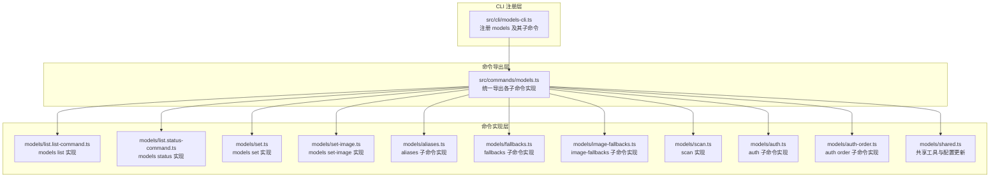
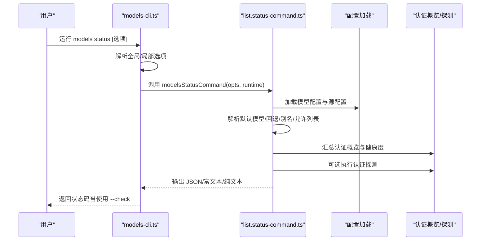
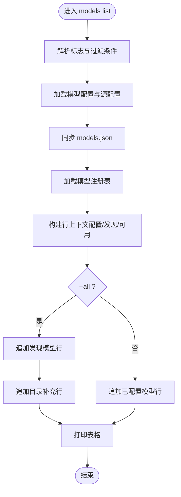
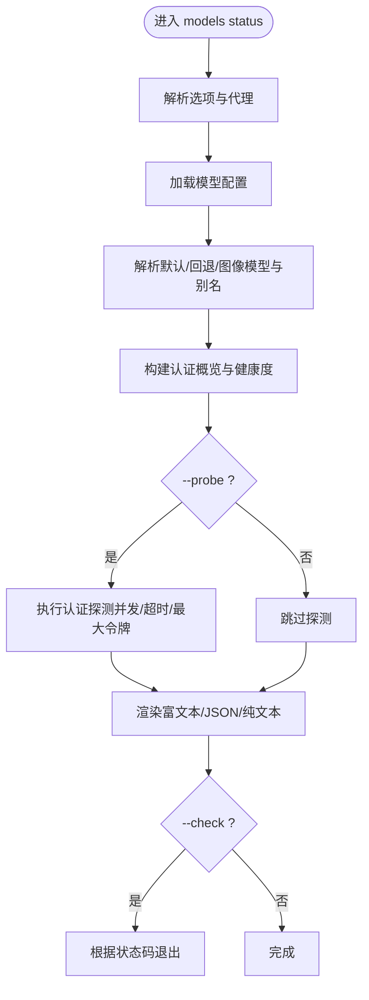
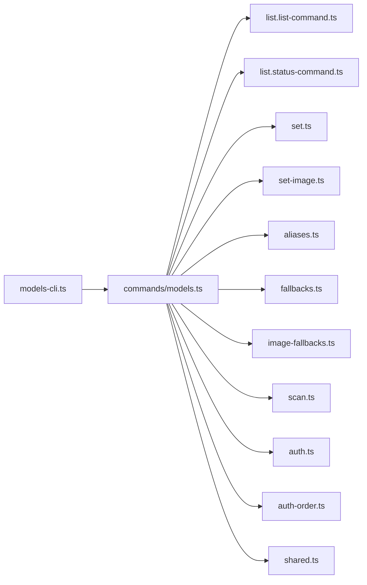

# 模型CLI命令

<cite>
**本文引用的文件**
- [src/cli/models-cli.ts](file://src/cli/models-cli.ts)
- [src/commands/models.ts](file://src/commands/models.ts)
- [src/commands/models/list.list-command.ts](file://src/commands/models/list.list-command.ts)
- [src/commands/models/list.status-command.ts](file://src/commands/models/list.status-command.ts)
- [src/commands/models/set.ts](file://src/commands/models/set.ts)
- [src/commands/models/set-image.ts](file://src/commands/models/set-image.ts)
- [src/commands/models/aliases.ts](file://src/commands/models/aliases.ts)
- [src/commands/models/fallbacks.ts](file://src/commands/models/fallbacks.ts)
- [src/commands/models/image-fallbacks.ts](file://src/commands/models/image-fallbacks.ts)
- [src/commands/models/scan.ts](file://src/commands/models/scan.ts)
- [src/commands/models/auth.ts](file://src/commands/models/auth.ts)
- [src/commands/models/auth-order.ts](file://src/commands/models/auth-order.ts)
- [src/commands/models/shared.ts](file://src/commands/models/shared.ts)
</cite>

## 目录
1. [简介](#简介)
2. [项目结构](#项目结构)
3. [核心组件](#核心组件)
4. [架构总览](#架构总览)
5. [详细组件分析](#详细组件分析)
6. [依赖关系分析](#依赖关系分析)
7. [性能考量](#性能考量)
8. [故障排查指南](#故障排查指南)
9. [结论](#结论)
10. [附录](#附录)

## 简介
本文件系统性地梳理并说明 OpenClaw 的“模型”CLI 命令组（models）及其子命令、参数与使用场景，覆盖以下主题：
- 模型清单与状态查询：列出已配置或全量模型、展示默认模型与回退配置、检查认证状态与可连接性探测
- 别名管理：为模型添加/移除/列出别名，提升可读性与可移植性
- 回退配置：管理文本与图像模型的回退列表，支持增删清空
- 认证与登录：交互式添加认证、登录提供商、粘贴令牌、按代理覆盖认证顺序
- 扫描与推荐：扫描可用模型，结合工具与图像能力筛选候选，支持自动设置默认模型
- 交互式选择器、批量操作与自动化集成：通过 JSON/plain 输出与非交互选项适配自动化流水线
- 最佳实践与常见问题：参数组合、输出格式、错误处理与排障建议
- 扩展与自定义：如何基于现有命令框架扩展新子命令与行为

## 项目结构
models 命令组位于 CLI 注册层与命令实现层之间，遵循“注册命令 → 分发到具体命令模块”的分层设计：
- CLI 层负责解析命令、参数与选项，并将控制权交给对应的命令函数
- 命令实现层封装业务逻辑（配置加载、模型注册表访问、认证状态汇总、探测等）
- 共享模块提供通用的配置更新、别名解析、标志兼容性校验等能力

图表来源
- [src/cli/models-cli.ts:37-443](file://src/cli/models-cli.ts#L37-L443)
- [src/commands/models.ts:1-34](file://src/commands/models.ts#L1-L34)

章节来源
- [src/cli/models-cli.ts:37-443](file://src/cli/models-cli.ts#L37-L443)
- [src/commands/models.ts:1-34](file://src/commands/models.ts#L1-L34)

## 核心组件
- models 命令组：作为入口，提供全局选项（如状态输出格式、代理选择），并将无子命令时的行为映射到 status
- 子命令族：
  - 列表与状态：list、status
  - 默认模型：set、set-image
  - 别名：aliases list/add/remove
  - 回退：fallbacks 与 image-fallbacks 的 list/add/remove/clear
  - 认证：auth add/login/setup-token/paste-token/login-github-copilot；以及 per-agent 的 auth order get/set/clear
  - 扫描：scan（自由模型扫描与候选生成）

章节来源
- [src/cli/models-cli.ts:37-443](file://src/cli/models-cli.ts#L37-L443)

## 架构总览
下面的序列图展示了 models status 的典型调用链：CLI 解析选项 → 运行时环境注入 → 配置加载与模型解析 → 认证健康度汇总与可选探测 → 输出结果。

图表来源
- [src/cli/models-cli.ts:95-115](file://src/cli/models-cli.ts#L95-L115)
- [src/commands/models/list.status-command.ts:61-688](file://src/commands/models/list.status-command.ts#L61-L688)

## 详细组件分析

### 命令组与全局选项
- 命令组：models
- 全局选项：
  - --status-json：等价于 status --json
  - --status-plain：等价于 status --plain
  - --agent <id>：指定要检查的代理目录，覆盖环境变量
- 行为：当直接运行 models 且不带子命令时，等价于 models status

章节来源
- [src/cli/models-cli.ts:37-51](file://src/cli/models-cli.ts#L37-L51)
- [src/cli/models-cli.ts:278-289](file://src/cli/models-cli.ts#L278-L289)

### 子命令：models list
- 功能：列出模型，默认仅显示已配置项；可切换到全量模式
- 关键选项：
  - --all：显示完整模型目录（含发现与补充条目）
  - --local：过滤本地模型
  - --provider <name>：按提供商过滤
  - --json/--plain：输出格式
- 处理流程要点：
  - 同步 models.json 源配置
  - 加载模型注册表与可用性信息
  - 构建行上下文（配置项、发现项、可用性）
  - 生成表格并打印

图表来源
- [src/commands/models/list.list-command.ts:17-119](file://src/commands/models/list.list-command.ts#L17-L119)

章节来源
- [src/cli/models-cli.ts:53-65](file://src/cli/models-cli.ts#L53-L65)
- [src/commands/models/list.list-command.ts:17-119](file://src/commands/models/list.list-command.ts#L17-L119)

### 子命令：models status
- 功能：展示默认模型、回退列表、图像模型与别名、允许列表；汇总认证概览与健康度；可进行实时探测
- 关键选项：
  - --json/--plain：输出格式
  - --check：退出码指示认证状态（过期/缺失=1，将过期=2，正常=0）
  - --probe：对认证配置进行探测
  - --probe-provider <name>：仅探测特定提供商
  - --probe-profile <ids>：限制探测的认证档案 ID（可逗号分隔或多次传入）
  - --probe-timeout <ms>、--probe-concurrency <n>、--probe-max-tokens <n>：探测参数
  - --agent <id>：指定代理
- 输出内容：
  - 配置路径、代理目录、默认模型与来源、回退列表、图像模型与回退、别名与允许列表
  - 认证存储位置、Shell 环境回退开关与应用键
  - 提供商认证概览（档案数、OAuth/Token/API Key 细分）
  - OAuth/Token 状态（过期/未知/静态/正常）
  - 可选：认证探测结果与摘要

图表来源
- [src/commands/models/list.status-command.ts:61-688](file://src/commands/models/list.status-command.ts#L61-L688)

章节来源
- [src/cli/models-cli.ts:67-115](file://src/cli/models-cli.ts#L67-L115)
- [src/commands/models/list.status-command.ts:61-688](file://src/commands/models/list.status-command.ts#L61-L688)

### 子命令：models set 与 models set-image
- models set <model>：设置默认文本模型（支持别名或模型键）
- models set-image <model>：设置默认图像模型
- 行为：更新配置并记录变更，随后打印新的默认值

章节来源
- [src/cli/models-cli.ts:117-135](file://src/cli/models-cli.ts#L117-L135)
- [src/commands/models/set.ts:6-15](file://src/commands/models/set.ts#L6-L15)
- [src/commands/models/set-image.ts:6-15](file://src/commands/models/set-image.ts#L6-L15)

### 子命令：aliases（别名管理）
- aliases list：列出所有别名与其目标模型键
- aliases add <alias> <model>：新增或更新别名；若同名别名已存在则报错
- aliases remove <alias>：移除别名；若不存在则报错
- 输出：支持 JSON 与纯文本格式

章节来源
- [src/cli/models-cli.ts:137-169](file://src/cli/models-cli.ts#L137-L169)
- [src/commands/models/aliases.ts:11-48](file://src/commands/models/aliases.ts#L11-L48)
- [src/commands/models/aliases.ts:50-83](file://src/commands/models/aliases.ts#L50-L83)
- [src/commands/models/aliases.ts:85-119](file://src/commands/models/aliases.ts#L85-L119)

### 子命令：fallbacks（文本模型回退）
- fallbacks list/add/remove/clear：管理默认文本模型的回退列表
- 支持 JSON 与纯文本输出

章节来源
- [src/cli/models-cli.ts:171-211](file://src/cli/models-cli.ts#L171-L211)
- [src/commands/models/fallbacks.ts](file://src/commands/models/fallbacks.ts)

### 子命令：image-fallbacks（图像模型回退）
- image-fallbacks list/add/remove/clear：管理默认图像模型的回退列表
- 支持 JSON 与纯文本输出

章节来源
- [src/cli/models-cli.ts:213-255](file://src/cli/models-cli.ts#L213-L255)
- [src/commands/models/image-fallbacks.ts](file://src/commands/models/image-fallbacks.ts)

### 子命令：scan（扫描与候选生成）
- 功能：扫描 OpenRouter 自由模型，按工具与图像能力筛选候选
- 关键选项：
  - --min-params <b>、--max-age-days <days>、--provider <name>：过滤条件
  - --max-candidates <n>：最大候选数量
  - --timeout <ms>、--concurrency <n>：探测参数
  - --no-probe：仅列出免费候选，不进行实时探测
  - --yes/--no-input：控制交互提示
  - --set-default/--set-image：将首个选择写入默认模型或图像模型
  - --json：输出 JSON
- 行为：构建候选集 → 可选探测 → 输出候选并可自动写入默认模型

章节来源
- [src/cli/models-cli.ts:257-276](file://src/cli/models-cli.ts#L257-L276)
- [src/commands/models/scan.ts](file://src/commands/models/scan.ts)

### 子命令：auth（认证管理）
- auth add：交互式认证助手（setup-token 或 paste token）
- auth login：运行提供商插件认证流程（OAuth/API Key）
  - --provider <id>、--method <id>、--set-default：推荐默认模型
- auth setup-token：通过提供商 CLI 创建/同步令牌（需要 TTY）
  - --provider <name>、--yes
- auth paste-token：粘贴令牌到 auth-profiles.json 并更新配置
  - --provider <name>、--profile-id <id>、--expires-in <duration>
- auth login-github-copilot：通过设备流程登录 GitHub Copilot（需要 TTY）
  - --profile-id <id>、--yes
- auth（全局）：--agent <id> 用于后续 get/set/clear

章节来源
- [src/cli/models-cli.ts:291-379](file://src/cli/models-cli.ts#L291-L379)
- [src/commands/models/auth.ts](file://src/commands/models/auth.ts)

### 子命令：auth order（每代理认证顺序）
- order get：查看某提供商在指定代理上的认证顺序覆盖
  - --provider <name>、--agent <id>、--json
- order set：为某提供商设置代理级认证顺序（锁定轮转）
  - --provider <name>、--agent <id>、<profileIds...>
- order clear：清除代理级覆盖，回到全局配置/轮转
  - --provider <name>、--agent <id>

章节来源
- [src/cli/models-cli.ts:381-442](file://src/cli/models-cli.ts#L381-L442)
- [src/commands/models/auth-order.ts](file://src/commands/models/auth-order.ts)

## 依赖关系分析
- CLI 注册层依赖命令导出层，命令导出层再依赖具体实现模块
- 列表与状态命令依赖配置加载、模型注册表、认证概览与探测模块
- 设置与别名命令依赖共享配置更新工具
- 认证与顺序命令依赖认证存储与配置 IO

图表来源
- [src/cli/models-cli.ts:37-443](file://src/cli/models-cli.ts#L37-L443)
- [src/commands/models.ts:1-34](file://src/commands/models.ts#L1-L34)

章节来源
- [src/cli/models-cli.ts:37-443](file://src/cli/models-cli.ts#L37-L443)
- [src/commands/models.ts:1-34](file://src/commands/models.ts#L1-L34)

## 性能考量
- 探测并发与超时：--probe-concurrency 与 --probe-timeout 影响整体响应时间；建议在 CI 中适当降低并发或增加超时
- 探测最大令牌：--probe-max-tokens 控制探测请求长度，避免过大导致超时或限流
- 全量列表：--all 会加载更多数据并拼接补充条目，建议在需要时使用
- JSON 输出：适合自动化消费，减少解析成本
- 纯文本输出：最小化输出体积，便于管道处理

## 故障排查指南
- 状态检查退出码：
  - --check 为 1：存在过期或缺失的认证，或使用了未配置认证的提供商
  - --check 为 2：存在将过期的认证
  - --check 为 0：认证正常
- 探测失败：
  - 检查 --probe-timeout、--probe-concurrency、--probe-max-tokens 是否合理
  - 使用 --probe-provider 与 --probe-profile 精确缩小范围定位问题
- 别名冲突：
  - 新增别名时若与现有目标冲突会报错；请先移除旧别名或更换别名
- 权限与环境变量：
  - 若 Shell 环境回退开启，确认相关环境变量是否正确设置
- 配置未生效：
  - 确认 --agent 指定的代理 ID 正确，或使用默认代理
  - 查看 JSON 输出中“默认来源/回退来源”字段，确认覆盖是否按预期

章节来源
- [src/commands/models/list.status-command.ts:312-324](file://src/commands/models/list.status-command.ts#L312-L324)
- [src/commands/models/aliases.ts:50-83](file://src/commands/models/aliases.ts#L50-L83)

## 结论
models 命令组提供了从“模型发现/配置”到“认证与回退管理”的完整工具链，既满足日常交互式使用，也支持自动化流水线的 JSON/plain 输出。通过合理的参数组合与探测配置，可在保证稳定性的同时快速定位认证与可用性问题。

## 附录

### 命令速查与最佳实践
- 列出已配置模型并过滤提供商：models list --provider <name>
- 仅输出 JSON 以便脚本消费：models status --json
- 检查认证状态并返回退出码：models status --check
- 为代理设置默认模型：models set <model>；设置图像模型：models set-image <model>
- 添加/移除别名：models aliases add <alias> <model>；models aliases remove <alias>
- 管理回退列表：models fallbacks add/remove/clear；models image-fallbacks add/remove/clear
- 扫描候选并自动设置默认：models scan --set-default --set-image
- 认证登录：models auth login --provider <id> --method <id>；models auth setup-token --provider <name>
- 每代理认证顺序：models auth order set <profileIds...>；models auth order get/clear

### 交互式选择器与自动化集成
- 交互式：--yes 与 --no-input 控制提示；--no-probe 可跳过实时探测
- 自动化：--json 输出结构化数据；--plain 输出简洁行；--check 用于 CI 失败判定
- 批量操作：在 CI 中循环调用 models auth order set，为多个代理设置不同顺序

### 命令扩展与自定义指南
- 新增子命令步骤：
  - 在 src/commands/models 下实现命令函数（参考 set.ts、aliases.ts）
  - 在 src/commands/models.ts 中导出该函数
  - 在 src/cli/models-cli.ts 中注册命令与选项
  - 如需配置更新，请复用 shared.ts 中的 updateConfig 与 applyDefaultModelPrimaryUpdate 等工具
- 参数与选项：
  - 使用 commander 的 option/argument 定义
  - 对于多值选项（如 --probe-profile），支持逗号分隔与重复传入
  - 对于数值类选项，务必做有效性校验（正数、有限值）
- 输出策略：
  - 提供 --json 与 --plain 两种输出，必要时保留富文本输出以提升可读性
- 错误处理：
  - 对非法输入抛出明确错误信息
  - 对外部探测失败保持健壮，避免中断主流程

章节来源
- [src/cli/models-cli.ts:37-443](file://src/cli/models-cli.ts#L37-L443)
- [src/commands/models.ts:1-34](file://src/commands/models.ts#L1-L34)
- [src/commands/models/shared.ts](file://src/commands/models/shared.ts)