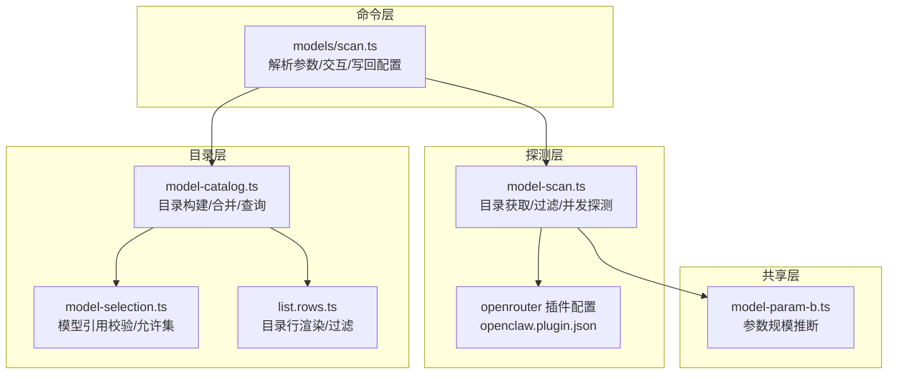
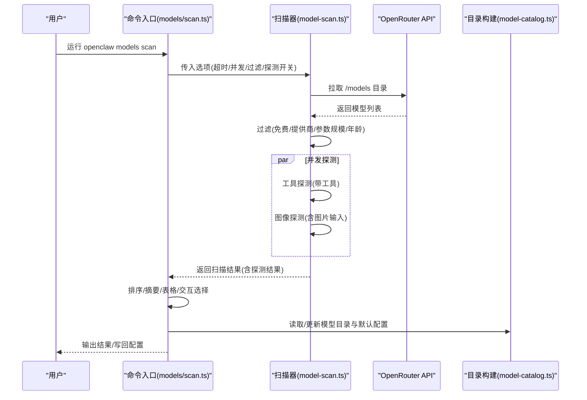
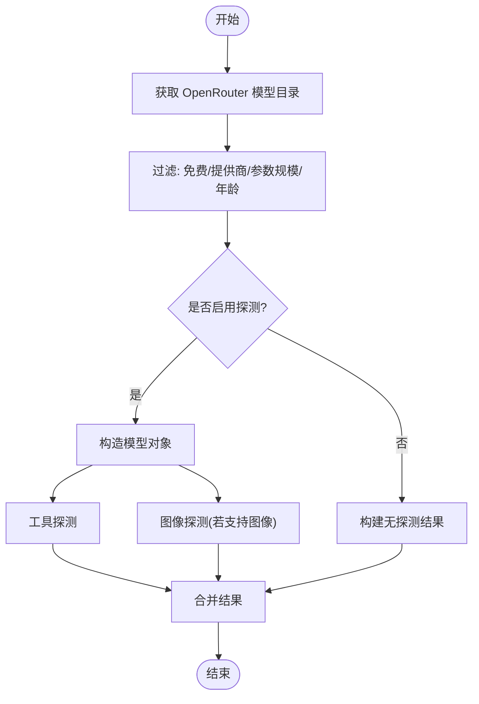
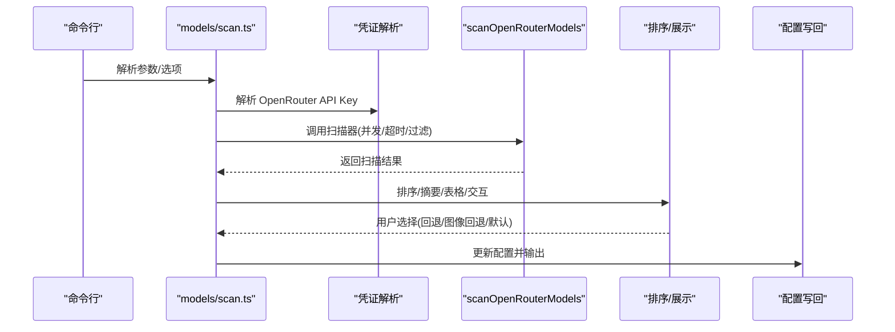
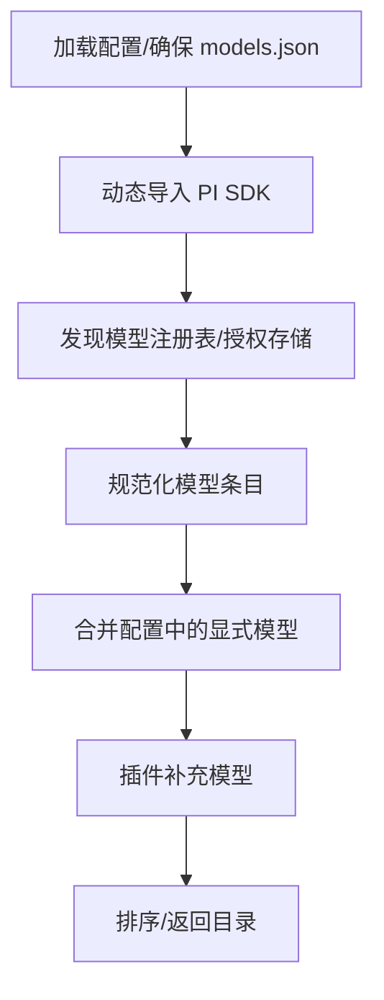
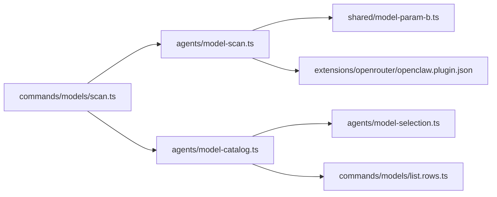

# 模型发现与扫描

<cite>
**本文引用的文件**
- [src/agents/model-scan.ts](file://src/agents/model-scan.ts)
- [src/commands/models/scan.ts](file://src/commands/models/scan.ts)
- [src/agents/model-catalog.ts](file://src/agents/model-catalog.ts)
- [src/shared/model-param-b.ts](file://src/shared/model-param-b.ts)
- [extensions/openrouter/openclaw.plugin.json](file://extensions/openrouter/openclaw.plugin.json)
- [docs/zh-CN/concepts/models.md](file://docs/zh-CN/concepts/models.md)
- [src/agents/model-selection.ts](file://src/agents/model-selection.ts)
- [src/commands/models/list.rows.ts](file://src/commands/models/list.rows.ts)
- [src/agents/venice-models.ts](file://src/agents/venice-models.ts)
- [src/commands/models/scan.ts](file://src/commands/models/scan.ts)
</cite>

## 目录
1. [简介](#简介)
2. [项目结构](#项目结构)
3. [核心组件](#核心组件)
4. [架构总览](#架构总览)
5. [详细组件分析](#详细组件分析)
6. [依赖关系分析](#依赖关系分析)
7. [性能考量](#性能考量)
8. [故障排除指南](#故障排除指南)
9. [结论](#结论)
10. [附录](#附录)

## 简介
本文件面向“模型发现与扫描系统”，聚焦以下目标：
- 深入解释模型扫描机制、OpenRouter 集成与实时探测流程
- 阐述模型目录构建、元数据提取与能力评估过程
- 描述扫描参数配置、过滤条件与排序规则
- 解析扫描结果、缓存策略与性能优化方案
- 提供扫描命令使用示例、自动化集成与故障排除指南

该系统通过拉取 OpenRouter 免费模型目录，结合本地/远程探测，对模型的工具调用能力与图像输入能力进行实时评估，并将结果用于生成回退模型清单与默认模型设置。

## 项目结构
围绕模型发现与扫描的关键模块分布如下：
- 命令层：负责解析用户参数、展示进度、交互式选择与写回配置
- 探测层：负责从 OpenRouter 拉取模型目录、过滤与并发探测
- 目录层：负责统一模型目录构建、合并插件补充与查询
- 共享层：负责参数规模推断等通用逻辑

**图表来源**
- [src/commands/models/scan.ts:132-360](file://src/commands/models/scan.ts#L132-L360)
- [src/agents/model-scan.ts:397-495](file://src/agents/model-scan.ts#L397-L495)
- [src/agents/model-catalog.ts:145-259](file://src/agents/model-catalog.ts#L145-L259)
- [src/shared/model-param-b.ts:1-20](file://src/shared/model-param-b.ts#L1-L20)
- [extensions/openrouter/openclaw.plugin.json:1-12](file://extensions/openrouter/openclaw.plugin.json#L1-L12)
- [src/agents/model-selection.ts:567-603](file://src/agents/model-selection.ts#L567-L603)
- [src/commands/models/list.rows.ts:103-140](file://src/commands/models/list.rows.ts#L103-L140)

**章节来源**
- [src/commands/models/scan.ts:132-360](file://src/commands/models/scan.ts#L132-L360)
- [src/agents/model-scan.ts:397-495](file://src/agents/model-scan.ts#L397-L495)
- [src/agents/model-catalog.ts:145-259](file://src/agents/model-catalog.ts#L145-L259)
- [src/shared/model-param-b.ts:1-20](file://src/shared/model-param-b.ts#L1-L20)
- [extensions/openrouter/openclaw.plugin.json:1-12](file://extensions/openrouter/openclaw.plugin.json#L1-L12)
- [src/agents/model-selection.ts:567-603](file://src/agents/model-selection.ts#L567-L603)
- [src/commands/models/list.rows.ts:103-140](file://src/commands/models/list.rows.ts#L103-L140)

## 核心组件
- OpenRouter 扫描器：负责获取免费模型目录、过滤、并发探测与结果组装
- 模型目录构建器：负责聚合内置与插件提供的模型定义，支持缓存与错误降级
- 命令入口：负责参数解析、进度展示、交互选择、写回配置与输出
- 参数规模推断：从模型标识或名称中提取参数规模（B）
- OpenRouter 插件配置：声明环境变量与提供者能力

**章节来源**
- [src/agents/model-scan.ts:397-495](file://src/agents/model-scan.ts#L397-L495)
- [src/agents/model-catalog.ts:145-259](file://src/agents/model-catalog.ts#L145-L259)
- [src/commands/models/scan.ts:132-360](file://src/commands/models/scan.ts#L132-L360)
- [src/shared/model-param-b.ts:1-20](file://src/shared/model-param-b.ts#L1-L20)
- [extensions/openrouter/openclaw.plugin.json:1-12](file://extensions/openrouter/openclaw.plugin.json#L1-L12)

## 架构总览
模型扫描的整体流程包括：命令解析 → 获取 OpenRouter 模型目录 → 过滤（免费/提供商/参数规模/年龄）→ 并发探测（工具/图像）→ 排序与交互选择 → 写回配置。

**图表来源**
- [src/commands/models/scan.ts:184-211](file://src/commands/models/scan.ts#L184-L211)
- [src/agents/model-scan.ts:413-494](file://src/agents/model-scan.ts#L413-L494)
- [src/agents/model-catalog.ts:145-259](file://src/agents/model-catalog.ts#L145-L259)

## 详细组件分析

### 组件A：OpenRouter 扫描器（model-scan.ts）
职责与流程：
- 获取模型目录：访问 OpenRouter 模型接口，解析为内部元数据结构
- 过滤策略：仅保留免费模型；支持按提供商前缀过滤；支持最小参数规模阈值；支持最大模型年龄
- 并发探测：工具探测与图像探测分别执行，支持超时控制
- 结果组装：将目录条目与探测结果合并为统一扫描结果对象

关键类型与函数：
- OpenRouterScanOptions：扫描选项（API Key、超时、并发、过滤、探测开关、进度回调）
- ModelScanResult：扫描结果（基础元数据 + 工具/图像探测结果）
- scanOpenRouterModels：主扫描函数
- fetchOpenRouterModels：目录获取与清洗
- isFreeOpenRouterModel：免费模型判定
- probeTool/probeImage：实时探测
- mapWithConcurrency：并发映射与进度上报

**图表来源**
- [src/agents/model-scan.ts:397-495](file://src/agents/model-scan.ts#L397-L495)
- [src/agents/model-scan.ts:177-243](file://src/agents/model-scan.ts#L177-L243)
- [src/agents/model-scan.ts:416-440](file://src/agents/model-scan.ts#L416-L440)
- [src/agents/model-scan.ts:450-494](file://src/agents/model-scan.ts#L450-L494)

**章节来源**
- [src/agents/model-scan.ts:397-495](file://src/agents/model-scan.ts#L397-L495)
- [src/agents/model-scan.ts:177-243](file://src/agents/model-scan.ts#L177-L243)
- [src/agents/model-scan.ts:416-440](file://src/agents/model-scan.ts#L416-L440)
- [src/agents/model-scan.ts:450-494](file://src/agents/model-scan.ts#L450-L494)

### 组件B：命令入口（models/scan.ts）
职责与流程：
- 参数解析与校验：最小参数、最大年龄、候选数、超时、并发等
- 凭证解析：在启用探测时解析 OpenRouter API Key
- 调用扫描器：传入选项并处理进度
- 排序与展示：按图像优先、工具延迟、上下文长度、参数规模排序
- 交互选择：在 TTY 环境下提供多选界面，支持预选与提示
- 写回配置：更新 agents.defaults.models 与默认/图像回退模型

**图表来源**
- [src/commands/models/scan.ts:132-360](file://src/commands/models/scan.ts#L132-L360)
- [src/commands/models/scan.ts:38-82](file://src/commands/models/scan.ts#L38-L82)
- [src/commands/models/scan.ts:248-287](file://src/commands/models/scan.ts#L248-L287)

**章节来源**
- [src/commands/models/scan.ts:132-360](file://src/commands/models/scan.ts#L132-L360)
- [src/commands/models/scan.ts:38-82](file://src/commands/models/scan.ts#L38-L82)
- [src/commands/models/scan.ts:248-287](file://src/commands/models/scan.ts#L248-L287)

### 组件C：模型目录构建（model-catalog.ts）
职责与流程：
- 动态加载 PI SDK 模型注册表，读取授权存储与 models.json
- 合并插件提供的补充模型
- 支持缓存与错误降级：失败不污染缓存，必要时返回已有结果
- 提供模型查询与能力判断（视觉/文档）

**图表来源**
- [src/agents/model-catalog.ts:145-259](file://src/agents/model-catalog.ts#L145-L259)
- [src/agents/model-catalog.ts:109-132](file://src/agents/model-catalog.ts#L109-L132)

**章节来源**
- [src/agents/model-catalog.ts:145-259](file://src/agents/model-catalog.ts#L145-L259)
- [src/agents/model-catalog.ts:109-132](file://src/agents/model-catalog.ts#L109-L132)

### 组件D：参数规模推断（model-param-b.ts）
职责与流程：
- 从模型标识或名称中提取“b”单位的参数规模，取最大匹配值
- 用于排序与过滤（例如最小参数规模阈值）

**章节来源**
- [src/shared/model-param-b.ts:1-20](file://src/shared/model-param-b.ts#L1-L20)

### 组件E：OpenRouter 插件配置（openrouter 插件）
职责与流程：
- 声明提供者 openrouter 及其环境变量 OPENROUTER_API_KEY
- 作为扫描器与命令层解析 API Key 的来源之一

**章节来源**
- [extensions/openrouter/openclaw.plugin.json:1-12](file://extensions/openrouter/openclaw.plugin.json#L1-L12)

### 组件F：模型引用校验与目录查询（model-selection.ts、list.rows.ts）
职责与流程：
- 校验模型引用是否在允许集合内（允许任意或在目录中）
- 在目录行渲染阶段应用过滤与去重

**章节来源**
- [src/agents/model-selection.ts:567-603](file://src/agents/model-selection.ts#L567-L603)
- [src/commands/models/list.rows.ts:103-140](file://src/commands/models/list.rows.ts#L103-L140)

## 依赖关系分析
- 命令层依赖扫描器与目录构建器
- 扫描器依赖 OpenRouter API、PI SDK、参数规模推断
- 目录构建器依赖插件运行时与模型抑制逻辑
- 命令层与目录层共同维护 agents.defaults 配置

**图表来源**
- [src/commands/models/scan.ts:1-16](file://src/commands/models/scan.ts#L1-L16)
- [src/agents/model-scan.ts:1-11](file://src/agents/model-scan.ts#L1-L11)
- [src/agents/model-catalog.ts:1-6](file://src/agents/model-catalog.ts#L1-L6)
- [src/shared/model-param-b.ts:1-20](file://src/shared/model-param-b.ts#L1-L20)
- [extensions/openrouter/openclaw.plugin.json:1-12](file://extensions/openrouter/openclaw.plugin.json#L1-L12)
- [src/agents/model-selection.ts:567-603](file://src/agents/model-selection.ts#L567-L603)
- [src/commands/models/list.rows.ts:103-140](file://src/commands/models/list.rows.ts#L103-L140)

**章节来源**
- [src/commands/models/scan.ts:1-16](file://src/commands/models/scan.ts#L1-L16)
- [src/agents/model-scan.ts:1-11](file://src/agents/model-scan.ts#L1-L11)
- [src/agents/model-catalog.ts:1-6](file://src/agents/model-catalog.ts#L1-L6)
- [src/shared/model-param-b.ts:1-20](file://src/shared/model-param-b.ts#L1-L20)
- [extensions/openrouter/openclaw.plugin.json:1-12](file://extensions/openrouter/openclaw.plugin.json#L1-L12)
- [src/agents/model-selection.ts:567-603](file://src/agents/model-selection.ts#L567-L603)
- [src/commands/models/list.rows.ts:103-140](file://src/commands/models/list.rows.ts#L103-L140)

## 性能考量
- 并发控制：通过并发参数限制同时探测任务数，避免资源争用
- 超时控制：为探测请求设置超时，防止阻塞整体流程
- 缓存策略：目录构建器对失败进行缓存降级，避免重复失败；参数规模推断为纯函数，无外部 IO
- 过滤前置：在探测前完成免费/提供商/参数规模/年龄过滤，减少无效探测
- 进度反馈：在探测阶段提供进度回调，改善用户体验

**章节来源**
- [src/agents/model-scan.ts:407-408](file://src/agents/model-scan.ts#L407-L408)
- [src/agents/model-scan.ts:450-494](file://src/agents/model-scan.ts#L450-L494)
- [src/agents/model-catalog.ts:244-255](file://src/agents/model-catalog.ts#L244-L255)

## 故障排除指南
常见问题与建议：
- 缺少 OpenRouter API Key
  - 现象：启用探测时报错提示缺少 Key
  - 处理：设置 OPENROUTER_API_KEY 或在认证配置中添加
  - 参考：[docs/zh-CN/concepts/models.md:162-177](file://docs/zh-CN/concepts/models.md#L162-L177)
- 无工具能力模型
  - 现象：探测后工具探测全部失败
  - 处理：使用 --no-probe 仅查看元数据，或更换提供商/模型
- 非交互环境报错
  - 现象：非 TTY 环境下未传 --yes 报错
  - 处理：传入 --yes 使用默认选择
- 未选择回退模型
  - 现象：交互选择为空导致错误
  - 处理：确保至少选择一个回退模型
- 目录构建失败
  - 现象：目录为空或部分失败
  - 处理：检查依赖安装与权限，等待下次尝试或重启

**章节来源**
- [docs/zh-CN/concepts/models.md:162-177](file://docs/zh-CN/concepts/models.md#L162-L177)
- [src/commands/models/scan.ts:278-287](file://src/commands/models/scan.ts#L278-L287)
- [src/agents/model-catalog.ts:244-255](file://src/agents/model-catalog.ts#L244-L255)

## 结论
该模型发现与扫描系统以 OpenRouter 免费模型为核心，结合本地/远程探测，实现了对模型工具与图像能力的快速评估，并通过交互式选择与配置写回，帮助用户建立可靠的回退与默认模型策略。系统通过并发控制、超时与缓存等手段保障性能与稳定性，同时提供清晰的参数与过滤选项，便于自动化集成与持续维护。

## 附录

### 扫描参数与过滤条件
- 最小参数规模（十亿）：--min-params
- 最大模型年龄（天）：--max-age-days
- 提供商前缀过滤：--provider
- 最大候选数（回退列表大小）：--max-candidates
- 超时（毫秒）：--timeout
- 并发数：--concurrency
- 禁用探测：--no-probe
- 设置默认主模型：--set-default
- 设置图像模型：--set-image
- JSON 输出：--json
- 非交互模式：--yes

排序规则（优先级从高到低）：
1) 图像支持（有图像能力优先）
2) 工具探测延迟（越快越好）
3) 上下文长度（越大越好）
4) 参数规模（越大越好）
5) 模型引用字符串（字母序）

**章节来源**
- [docs/zh-CN/concepts/models.md:162-183](file://docs/zh-CN/concepts/models.md#L162-L183)
- [src/commands/models/scan.ts:38-82](file://src/commands/models/scan.ts#L38-L82)
- [src/commands/models/scan.ts:149-168](file://src/commands/models/scan.ts#L149-L168)

### 扫描命令使用示例
- 仅元数据扫描（不探测）
  - 示例：openclaw models scan --no-probe
- 指定最小参数规模与最大年龄
  - 示例：openclaw models scan --min-params 7 --max-age-days 365
- 指定提供商前缀与并发
  - 示例：openclaw models scan --provider anthropic --concurrency 5
- 设置默认主模型与图像模型
  - 示例：openclaw models scan --set-default --set-image
- 非交互自动化
  - 示例：openclaw models scan --yes --json

**章节来源**
- [docs/zh-CN/concepts/models.md:162-177](file://docs/zh-CN/concepts/models.md#L162-L177)
- [src/commands/models/scan.ts:132-360](file://src/commands/models/scan.ts#L132-L360)

### 自动化集成建议
- 在 CI 中使用 --json 与 --yes，结合 --min-params/--max-candidates 控制候选范围
- 将 OPENROUTER_API_KEY 注入环境变量或使用认证配置
- 定期运行扫描以更新回退列表，结合 --max-age-days 识别过时模型

**章节来源**
- [src/commands/models/scan.ts:170-183](file://src/commands/models/scan.ts#L170-L183)
- [docs/zh-CN/concepts/models.md:162-177](file://docs/zh-CN/concepts/models.md#L162-L177)

### 相关实现参考
- 模型目录构建与查询
  - [src/agents/model-catalog.ts:145-259](file://src/agents/model-catalog.ts#L145-L259)
  - [src/agents/model-catalog.ts:275-290](file://src/agents/model-catalog.ts#L275-L290)
- 模型引用校验
  - [src/agents/model-selection.ts:567-603](file://src/agents/model-selection.ts#L567-L603)
- 目录行渲染与过滤
  - [src/commands/models/list.rows.ts:103-140](file://src/commands/models/list.rows.ts#L103-L140)
- Venice 模型发现（补充参考）
  - [src/agents/venice-models.ts:632-647](file://src/agents/venice-models.ts#L632-L647)