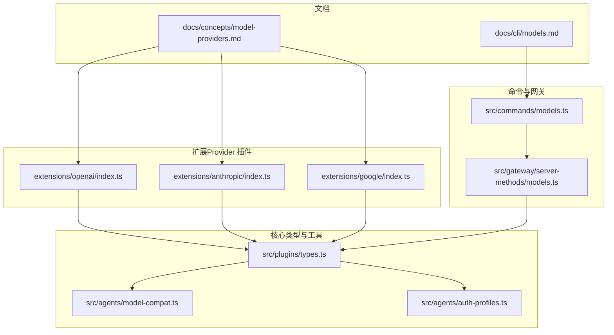
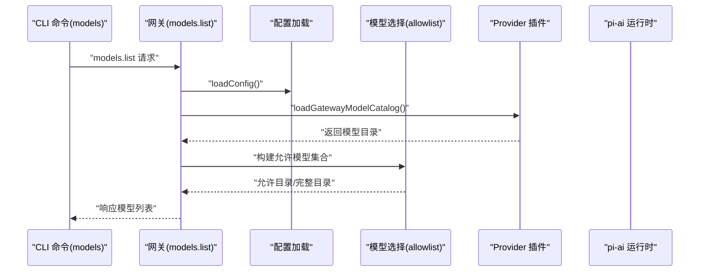
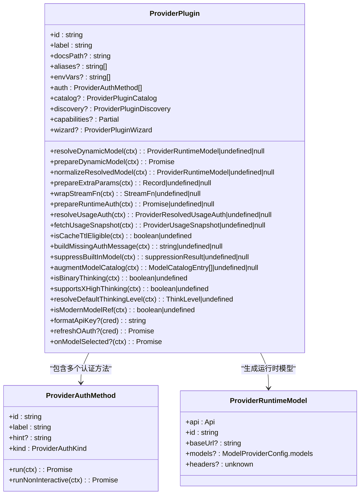
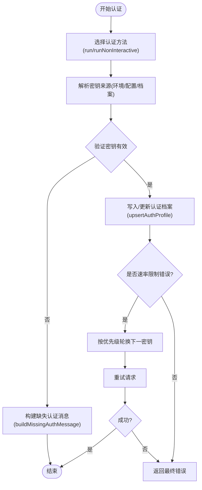
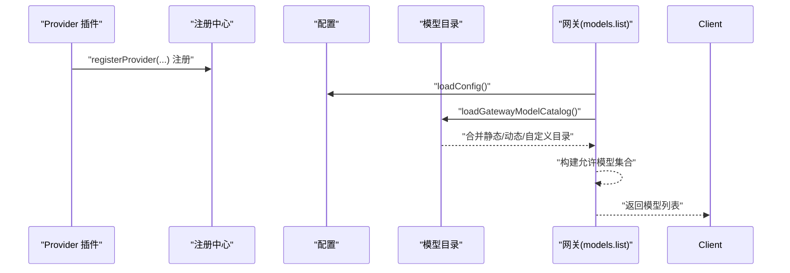
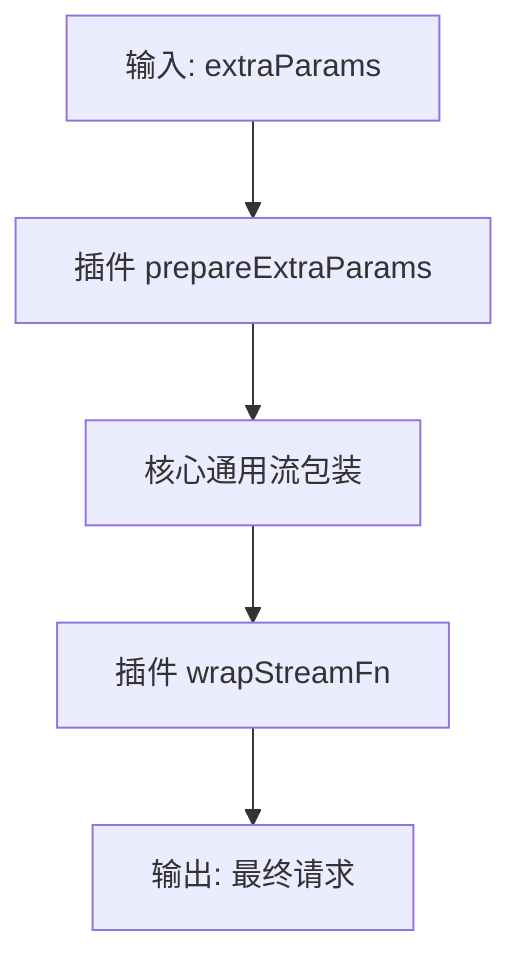
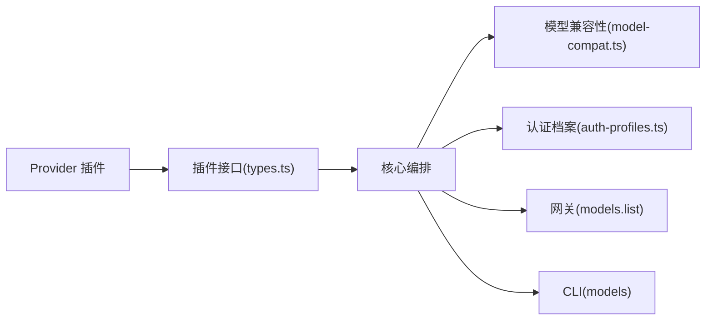

# 模型提供商管理

<cite>
**本文引用的文件**
- [docs/concepts/model-providers.md](file://docs/concepts/model-providers.md)
- [docs/cli/models.md](file://docs/cli/models.md)
- [extensions/openai/index.ts](file://extensions/openai/index.ts)
- [extensions/anthropic/index.ts](file://extensions/anthropic/index.ts)
- [extensions/google/index.ts](file://extensions/google/index.ts)
- [src/commands/models.ts](file://src/commands/models.ts)
- [src/gateway/server-methods/models.ts](file://src/gateway/server-methods/models.ts)
- [src/agents/model-compat.ts](file://src/agents/model-compat.ts)
- [src/agents/auth-profiles.ts](file://src/agents/auth-profiles.ts)
- [src/plugins/types.ts](file://src/plugins/types.ts)
</cite>

## 目录
1. [简介](#简介)
2. [项目结构](#项目结构)
3. [核心组件](#核心组件)
4. [架构总览](#架构总览)
5. [详细组件分析](#详细组件分析)
6. [依赖关系分析](#依赖关系分析)
7. [性能考量](#性能考量)
8. [故障排除指南](#故障排除指南)
9. [结论](#结论)
10. [附录](#附录)

## 简介
本文件面向“模型提供商管理系统”的设计与实现，聚焦以下主题：
- 提供商配置与认证流程（含环境变量、OAuth、令牌等）
- API 密钥轮换与错误重试策略
- 提供商发现机制、动态注册与版本兼容
- 能力映射、参数标准化与错误处理
- 配置示例、最佳实践与安全建议
- 扩展开发指南与故障排除方法

该系统以插件化架构为核心，通过 Provider 插件声明式地注册自身能力、认证方式、动态模型解析、参数标准化、流包装、缓存 TTL、使用配额查询等行为，并由核心在运行时统一编排。

## 项目结构
围绕“模型提供商管理”，相关代码主要分布在如下位置：
- 文档：提供概念说明、CLI 使用与各提供商配置示例
- 扩展（Provider 插件）：如 OpenAI、Anthropic、Google 等
- 命令与网关：models 子命令与网关 models.list 处理器
- 核心类型与工具：Provider 插件接口、认证档案、兼容性归一化

图表来源
- [docs/concepts/model-providers.md:1-595](file://docs/concepts/model-providers.md#L1-L595)
- [docs/cli/models.md:1-82](file://docs/cli/models.md#L1-L82)
- [extensions/openai/index.ts:1-17](file://extensions/openai/index.ts#L1-L17)
- [extensions/anthropic/index.ts:1-319](file://extensions/anthropic/index.ts#L1-L319)
- [extensions/google/index.ts:1-47](file://extensions/google/index.ts#L1-L47)
- [src/commands/models.ts:1-34](file://src/commands/models.ts#L1-L34)
- [src/gateway/server-methods/models.ts:1-40](file://src/gateway/server-methods/models.ts#L1-L40)
- [src/plugins/types.ts:545-738](file://src/plugins/types.ts#L545-L738)
- [src/agents/model-compat.ts:1-96](file://src/agents/model-compat.ts#L1-L96)
- [src/agents/auth-profiles.ts:1-55](file://src/agents/auth-profiles.ts#L1-L55)

章节来源
- [docs/concepts/model-providers.md:1-595](file://docs/concepts/model-providers.md#L1-L595)
- [docs/cli/models.md:1-82](file://docs/cli/models.md#L1-L82)
- [extensions/openai/index.ts:1-17](file://extensions/openai/index.ts#L1-L17)
- [extensions/anthropic/index.ts:1-319](file://extensions/anthropic/index.ts#L1-L319)
- [extensions/google/index.ts:1-47](file://extensions/google/index.ts#L1-L47)
- [src/commands/models.ts:1-34](file://src/commands/models.ts#L1-L34)
- [src/gateway/server-methods/models.ts:1-40](file://src/gateway/server-methods/models.ts#L1-L40)
- [src/plugins/types.ts:545-738](file://src/plugins/types.ts#L545-L738)
- [src/agents/model-compat.ts:1-96](file://src/agents/model-compat.ts#L1-L96)
- [src/agents/auth-profiles.ts:1-55](file://src/agents/auth-profiles.ts#L1-L55)

## 核心组件
- Provider 插件接口与钩子
  - 插件通过 registerProvider 注册自身，声明认证方式、动态模型解析、参数标准化、流包装、缓存 TTL、使用配额查询等能力
  - 关键钩子包括：resolveDynamicModel、prepareDynamicModel、normalizeResolvedModel、prepareExtraParams、wrapStreamFn、isCacheTtlEligible、buildMissingAuthMessage、suppressBuiltInModel、augmentModelCatalog、isBinaryThinking、supportsXHighThinking、resolveDefaultThinkingLevel、isModernModelRef、prepareRuntimeAuth、resolveUsageAuth、fetchUsageSnapshot
- 认证档案与密钥轮换
  - 支持多密钥轮换策略，按优先级选择并仅在速率限制类错误时自动切换
  - 提供认证档案的增删改查、排序、冷却、使用统计等能力
- 模型兼容性归一化
  - 针对 Anthropic、OpenAI 等不同传输与端点，进行 URL 规范化、角色支持、流式用量块、严格模式等兼容性处理
- 网关与 CLI
  - 网关 models.list 返回允许或完整的模型目录
  - CLI models 子命令用于状态查看、扫描、设置默认模型、别名与回退、认证配置等

章节来源
- [src/plugins/types.ts:545-738](file://src/plugins/types.ts#L545-L738)
- [src/agents/auth-profiles.ts:1-55](file://src/agents/auth-profiles.ts#L1-L55)
- [src/agents/model-compat.ts:1-96](file://src/agents/model-compat.ts#L1-L96)
- [src/gateway/server-methods/models.ts:12-39](file://src/gateway/server-methods/models.ts#L12-L39)
- [docs/cli/models.md:18-82](file://docs/cli/models.md#L18-L82)

## 架构总览
下图展示从 CLI 到网关再到 Provider 插件的整体调用链路与职责划分：

图表来源
- [src/gateway/server-methods/models.ts:12-39](file://src/gateway/server-methods/models.ts#L12-L39)
- [src/commands/models.ts:30](file://src/commands/models.ts#L30)
- [src/plugins/types.ts:545-738](file://src/plugins/types.ts#L545-L738)

## 详细组件分析

### 组件A：Provider 插件接口与钩子
- 设计要点
  - 插件通过 registerProvider 注册 Provider 对象，声明认证方法、动态模型解析、参数标准化、流包装、缓存 TTL、使用配额查询等
  - 钩子函数在不同阶段介入：解析动态模型、准备动态模型、规范化模型、准备额外参数、包装流函数、缓存 TTL、缺失认证消息、内置模型抑制、最终目录增强、思维策略、现代模型匹配、运行时认证、使用认证、抓取使用快照
- 数据结构与复杂度
  - ProviderPlugin 类型定义了丰富的可选钩子，便于在不修改核心的情况下扩展行为
  - 动态模型解析应保持同步且无副作用；网络刷新放在 prepareDynamicModel 中异步执行
- 错误处理
  - 缺失认证时可通过 buildMissingAuthMessage 提供更具体的恢复提示
  - 内置模型抑制可用于隐藏过时上游条目或替换为供应商特定提示
- 性能影响
  - 钩子应避免昂贵操作；网络 I/O 放在 prepareDynamicModel 中
  - 缓存 TTL 与目录增强有助于减少重复请求与冗余显示

图表来源
- [src/plugins/types.ts:545-738](file://src/plugins/types.ts#L545-L738)

章节来源
- [src/plugins/types.ts:545-738](file://src/plugins/types.ts#L545-L738)

### 组件B：认证流程与密钥轮换
- 认证方式
  - 插件可声明多种认证方法（OAuth、API Key、Token、设备码等），并在交互或非交互场景中运行
  - 非交互认证通过 runNonInteractive 接口解析密钥来源（环境变量、配置、标志位等）
- 密钥轮换
  - 支持多密钥轮换策略，按优先级选择并仅在速率限制类错误时自动切换
  - 可配置单个实时覆盖密钥、逗号/分号分隔列表、编号列表以及回退到通用 API Key
- 认证档案
  - 支持认证档案的增删改查、排序、冷却、使用统计、修复与存储路径解析
  - 提供认证医生提示与可用性判断

图表来源
- [src/plugins/types.ts:184-193](file://src/plugins/types.ts#L184-L193)
- [src/plugins/types.ts:151-182](file://src/plugins/types.ts#L151-L182)
- [src/agents/auth-profiles.ts:12-32](file://src/agents/auth-profiles.ts#L12-L32)
- [docs/concepts/model-providers.md:108-121](file://docs/concepts/model-providers.md#L108-L121)

章节来源
- [src/plugins/types.ts:108-193](file://src/plugins/types.ts#L108-L193)
- [src/agents/auth-profiles.ts:12-32](file://src/agents/auth-profiles.ts#L12-L32)
- [docs/concepts/model-providers.md:108-121](file://docs/concepts/model-providers.md#L108-L121)

### 组件C：动态注册与模型发现
- 动态注册
  - 插件通过 registerProvider 注册自身，核心在启动时收集所有已安装插件的 Provider 定义
  - 示例：OpenAI 插件同时注册 openai 与 openai-codex 两个 Provider
- 模型发现
  - 网关 models.list 加载模型目录，结合配置构建允许模型集合，返回给客户端
  - Provider 插件可提供 catalog/discovery 钩子注入自定义目录或覆盖默认行为
- 版本兼容
  - 插件可实现 forward-compat 解析逻辑，将新旧模型 ID 映射到模板模型
  - 模型兼容性归一化确保非原生端点正确处理角色、流式用量块与严格模式

图表来源
- [extensions/openai/index.ts:10-13](file://extensions/openai/index.ts#L10-L13)
- [src/gateway/server-methods/models.ts:25-34](file://src/gateway/server-methods/models.ts#L25-L34)
- [src/plugins/types.ts:562-568](file://src/plugins/types.ts#L562-L568)

章节来源
- [extensions/openai/index.ts:10-13](file://extensions/openai/index.ts#L10-L13)
- [src/gateway/server-methods/models.ts:25-34](file://src/gateway/server-methods/models.ts#L25-L34)
- [src/plugins/types.ts:562-568](file://src/plugins/types.ts#L562-L568)

### 组件D：参数标准化与传输适配
- 参数标准化
  - 插件通过 prepareExtraParams 将自有参数映射到统一的 extraParams 结构
  - 通过 wrapStreamFn 在通用包装之后再应用提供商特有的头部/负载改写
- 传输适配
  - 模型兼容性归一化针对 Anthropic 与 OpenAI 的端点差异进行 URL 规范化与兼容开关控制
  - 对于非原生 OpenAI 兼容端点，强制关闭 developer 角色与流式用量块等特性，避免 400 错误

图表来源
- [src/plugins/types.ts:617-627](file://src/plugins/types.ts#L617-L627)
- [src/agents/model-compat.ts:39-95](file://src/agents/model-compat.ts#L39-L95)

章节来源
- [src/plugins/types.ts:617-627](file://src/plugins/types.ts#L617-L627)
- [src/agents/model-compat.ts:39-95](file://src/agents/model-compat.ts#L39-L95)

### 组件E：使用配额与用量快照
- 使用配额认证
  - 插件通过 resolveUsageAuth 解析用量查询所需的令牌或账号信息
- 抓取用量快照
  - 插件通过 fetchUsageSnapshot 发起实际请求并解析返回值，核心负责超时、过滤与汇总格式化
- 典型示例
  - Anthropic 插件通过 OAuth 解析令牌并抓取 Claude 使用数据

章节来源
- [src/plugins/types.ts:646-663](file://src/plugins/types.ts#L646-L663)
- [extensions/anthropic/index.ts:310-313](file://extensions/anthropic/index.ts#L310-L313)

### 组件F：CLI 与网关集成
- CLI models
  - 提供 status、list、set、scan、aliases/fallbacks、auth add/login/setup-token/paste-token 等命令
  - 支持对指定代理或默认代理的认证探针、JSON/Plain 输出、检查过期/即将过期等
- 网关 models.list
  - 校验参数后加载模型目录，构建允许模型集合并返回

章节来源
- [docs/cli/models.md:18-82](file://docs/cli/models.md#L18-L82)
- [src/gateway/server-methods/models.ts:12-39](file://src/gateway/server-methods/models.ts#L12-L39)
- [src/commands/models.ts:1-34](file://src/commands/models.ts#L1-L34)

## 依赖关系分析
- 插件与核心
  - Provider 插件依赖核心提供的上下文与钩子接口；核心不直接耦合具体提供商，而是通过接口与回调解耦
- 认证与配置
  - 认证档案与配置加载相互配合，认证方法解析密钥来源并写入档案
- 模型目录与兼容性
  - Provider 插件提供目录与动态解析；核心在运行前进行兼容性归一化

图表来源
- [src/plugins/types.ts:545-738](file://src/plugins/types.ts#L545-L738)
- [src/agents/model-compat.ts:1-96](file://src/agents/model-compat.ts#L1-L96)
- [src/agents/auth-profiles.ts:1-55](file://src/agents/auth-profiles.ts#L1-L55)
- [src/gateway/server-methods/models.ts:12-39](file://src/gateway/server-methods/models.ts#L12-L39)
- [src/commands/models.ts:30](file://src/commands/models.ts#L30)

章节来源
- [src/plugins/types.ts:545-738](file://src/plugins/types.ts#L545-L738)
- [src/agents/model-compat.ts:1-96](file://src/agents/model-compat.ts#L1-L96)
- [src/agents/auth-profiles.ts:1-55](file://src/agents/auth-profiles.ts#L1-L55)
- [src/gateway/server-methods/models.ts:12-39](file://src/gateway/server-methods/models.ts#L12-L39)
- [src/commands/models.ts:30](file://src/commands/models.ts#L30)

## 性能考量
- 避免在 resolveDynamicModel 中进行网络 I/O；将网络刷新放入 prepareDynamicModel 异步预热
- 合理使用 isCacheTtlEligible 与 augmentModelCatalog 减少重复请求与冗余展示
- 对非原生 OpenAI 兼容端点，禁用 developer 角色与流式用量块可降低解析开销与错误率
- 认证轮换仅在速率限制类错误触发，避免不必要的重试

## 故障排除指南
- 认证失败
  - 使用 models status --probe 或 --probe-provider/--probe-profile 进行实时探针
  - 若为通用“未找到 API Key”错误，插件可通过 buildMissingAuthMessage 提供更具体的恢复提示
- 模型解析异常
  - 检查 Provider 的 resolveDynamicModel 与 normalizeResolvedModel 是否正确映射模型 ID 与基础 URL
  - 对于 Anthropic/Anthropic 兼容端点，确认 baseUrl 不包含多余的 /v1 后缀
- 使用配额不可用
  - 确认 resolveUsageAuth 正确解析令牌或账号信息，fetchUsageSnapshot 能正常解析返回值
- 密钥轮换无效
  - 检查速率限制类错误是否被识别；确认多密钥配置顺序与去重逻辑

章节来源
- [docs/cli/models.md:27-56](file://docs/cli/models.md#L27-L56)
- [src/plugins/types.ts:416-423](file://src/plugins/types.ts#L416-L423)
- [src/agents/model-compat.ts:36-48](file://src/agents/model-compat.ts#L36-L48)
- [extensions/anthropic/index.ts:310-313](file://extensions/anthropic/index.ts#L310-L313)
- [docs/concepts/model-providers.md:108-121](file://docs/concepts/model-providers.md#L108-L121)

## 结论
本系统通过插件化 Provider 接口实现了对多提供商的统一管理与扩展，结合认证档案、密钥轮换、动态模型解析与参数标准化，既保证了灵活性又维持了核心一致性。通过 CLI 与网关的协同，用户可以便捷地完成提供商配置、认证与模型选择，同时具备完善的诊断与故障排除能力。

## 附录
- 配置示例与最佳实践
  - 参考文档中的各提供商配置片段与 CLI 示例，按需启用插件、设置环境变量与模型别名
- 安全考虑
  - 优先使用 API Key 认证而非 Setup Token（Anthropic），并妥善保管密钥与令牌
  - 对于第三方代理端点，遵循兼容性规则，避免传递不受支持的角色或参数
- 扩展开发指南
  - 实现 registerProvider 并至少提供 auth 与 resolveDynamicModel
  - 在 prepareExtraParams 与 wrapStreamFn 中完成参数与负载适配
  - 如需用量查询，实现 resolveUsageAuth 与 fetchUsageSnapshot
  - 使用 isCacheTtlEligible、isModernModelRef、resolveDefaultThinkingLevel 等钩子提升体验

章节来源
- [docs/concepts/model-providers.md:122-595](file://docs/concepts/model-providers.md#L122-L595)
- [extensions/openai/index.ts:10-13](file://extensions/openai/index.ts#L10-L13)
- [extensions/anthropic/index.ts:266-315](file://extensions/anthropic/index.ts#L266-L315)
- [extensions/google/index.ts:16-27](file://extensions/google/index.ts#L16-L27)
- [src/plugins/types.ts:545-738](file://src/plugins/types.ts#L545-L738)