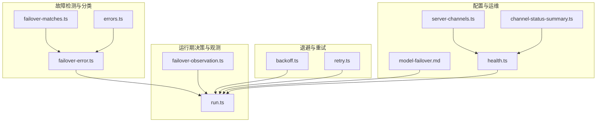
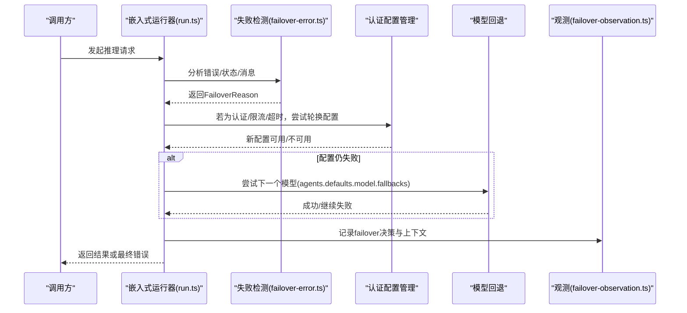
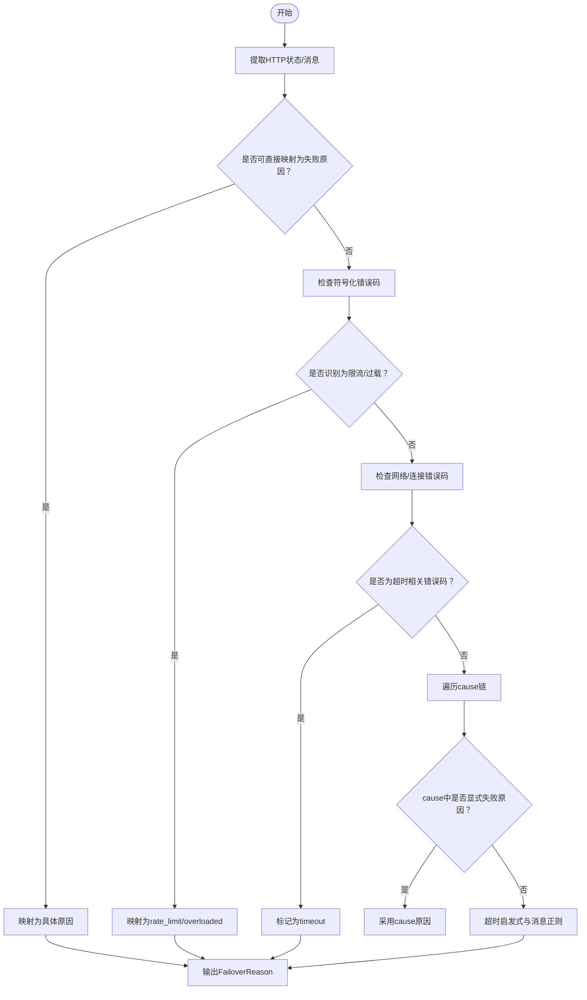
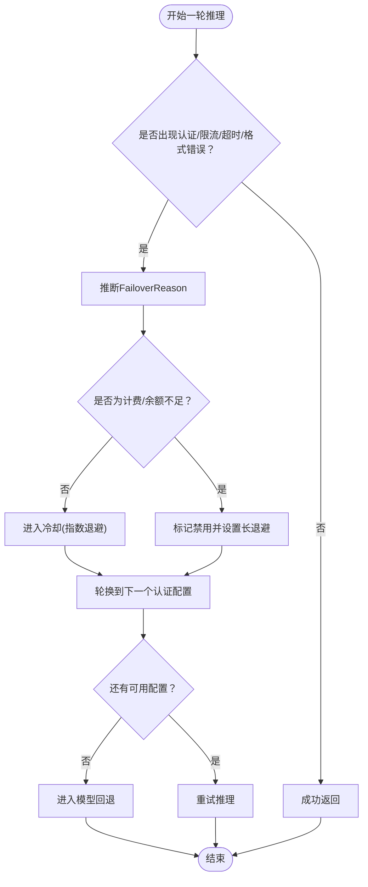
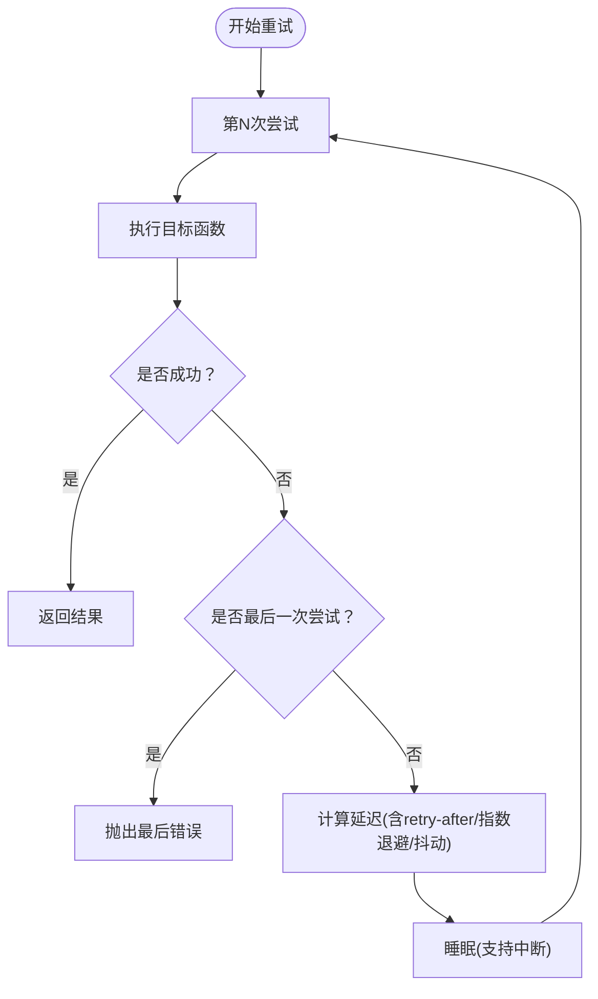
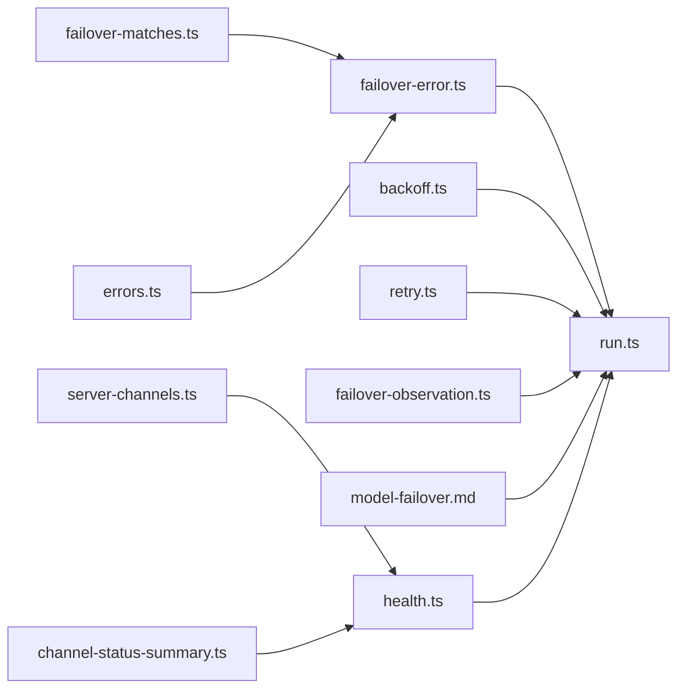

# 模型故障转移

<cite>
**本文引用的文件**
- [failover-error.ts](file://src/agents/failover-error.ts)
- [failover-error.test.ts](file://src/agents/failover-error.test.ts)
- [failover-matches.ts](file://src/agents/pi-embedded-helpers/failover-matches.ts)
- [failover-observation.ts](file://src/agents/pi-embedded-runner/run/failover-observation.ts)
- [backoff.ts](file://src/infra/backoff.ts)
- [retry.ts](file://src/infra/retry.ts)
- [model-failover.md](file://docs/concepts/model-failover.md)
- [run.ts](file://src/agents/pi-embedded-runner/run.ts)
- [errors.ts](file://src/agents/pi-embedded-helpers/errors.ts)
- [status.command.ts](file://src/commands/status.command.ts)
- [health.ts](file://src/commands/health.ts)
- [server-channels.ts](file://src/gateway/server-channels.ts)
- [channel-status-summary.ts](file://extensions/shared/channel-status-summary.ts)
</cite>

## 目录
1. [简介](#简介)
2. [项目结构](#项目结构)
3. [核心组件](#核心组件)
4. [架构总览](#架构总览)
5. [详细组件分析](#详细组件分析)
6. [依赖关系分析](#依赖关系分析)
7. [性能考量](#性能考量)
8. [故障排查指南](#故障排查指南)
9. [结论](#结论)
10. [附录](#附录)

## 简介
本文件系统化梳理 OpenClaw 的“模型故障转移”能力，覆盖以下主题：
- 故障转移策略：认证配置轮换与模型回退的两阶段流程
- 失败检测：基于状态码、错误消息、符号化错误码与超时信号的综合判定
- 自动切换与降级：认证配置冷却、禁用与模型回退的决策路径
- 冷却机制：指数退避与抖动、按失败类型与提供商差异化策略
- 重试逻辑与超时配置：统一的重试器与退避工具
- 监控与日志：故障转移决策观测字段与健康检查通道
- 配置示例、测试方法与运维指南：从配置到可观测性的实践建议

## 项目结构
围绕模型故障转移的关键代码分布在以下模块：
- 故障分类与错误建模：failover-error.ts、failover-matches.ts
- 运行期决策与观测：failover-observation.ts、run.ts
- 退避与重试：backoff.ts、retry.ts
- 文档与概念：model-failover.md
- 健康检查与通道状态：health.ts、server-channels.ts、channel-status-summary.ts

图表来源
- [failover-error.ts:1-331](file://src/agents/failover-error.ts#L1-L331)
- [failover-matches.ts:1-171](file://src/agents/pi-embedded-helpers/failover-matches.ts#L1-L171)
- [failover-observation.ts:1-77](file://src/agents/pi-embedded-runner/run/failover-observation.ts#L1-L77)
- [run.ts:845-878](file://src/agents/pi-embedded-runner/run.ts#L845-L878)
- [backoff.ts:1-29](file://src/infra/backoff.ts#L1-L29)
- [retry.ts:1-137](file://src/infra/retry.ts#L1-L137)
- [model-failover.md:1-153](file://docs/concepts/model-failover.md#L1-L153)
- [health.ts:710-749](file://src/commands/health.ts#L710-L749)
- [server-channels.ts:136-175](file://src/gateway/server-channels.ts#L136-L175)
- [channel-status-summary.ts:1-48](file://extensions/shared/channel-status-summary.ts#L1-L48)

章节来源
- [failover-error.ts:1-331](file://src/agents/failover-error.ts#L1-L331)
- [failover-matches.ts:1-171](file://src/agents/pi-embedded-helpers/failover-matches.ts#L1-L171)
- [failover-observation.ts:1-77](file://src/agents/pi-embedded-runner/run/failover-observation.ts#L1-L77)
- [run.ts:845-878](file://src/agents/pi-embedded-runner/run.ts#L845-L878)
- [backoff.ts:1-29](file://src/infra/backoff.ts#L1-L29)
- [retry.ts:1-137](file://src/infra/retry.ts#L1-L137)
- [model-failover.md:1-153](file://docs/concepts/model-failover.md#L1-L153)
- [health.ts:710-749](file://src/commands/health.ts#L710-L749)
- [server-channels.ts:136-175](file://src/gateway/server-channels.ts#L136-L175)
- [channel-status-summary.ts:1-48](file://extensions/shared/channel-status-summary.ts#L1-L48)

## 核心组件
- 故障原因枚举与错误建模：FailoverError 类承载失败原因、状态码、错误码与上下文信息，支持从任意错误中推断并归一化为 FailoverError。
- 错误分类器：基于 HTTP 状态、错误消息模式、符号化错误码（如 RESOURCE_EXHAUSTED）与超时启发式，将错误映射到“计费/配额/限流/过载/认证/格式/超时/会话过期/模型未找到”等类别。
- 认证配置轮换与冷却：在当前提供者内轮换认证配置（OAuth/API Key），对失败配置施加指数退避冷却或禁用；支持会话粘性与用户覆盖。
- 模型回退：当提供者内所有配置均失败时，按 agents.defaults.model.fallbacks 列表进行模型回退，并在必要时回到主模型。
- 退避与重试：统一的退避计算与可中断睡眠，以及可插拔的重试器，支持 retry-after、抖动与上限控制。
- 决策观测：记录故障转移决策（轮换配置/回退模型/直接上报）与关键上下文，便于诊断与审计。

章节来源
- [failover-error.ts:11-40](file://src/agents/failover-error.ts#L11-L40)
- [failover-error.ts:223-276](file://src/agents/failover-error.ts#L223-L276)
- [failover-error.ts:301-330](file://src/agents/failover-error.ts#L301-L330)
- [failover-matches.ts:6-103](file://src/agents/pi-embedded-helpers/failover-matches.ts#L6-L103)
- [model-failover.md:11-153](file://docs/concepts/model-failover.md#L11-L153)
- [backoff.ts:10-14](file://src/infra/backoff.ts#L10-L14)
- [retry.ts:70-136](file://src/infra/retry.ts#L70-L136)
- [failover-observation.ts:10-76](file://src/agents/pi-embedded-runner/run/failover-observation.ts#L10-L76)

## 架构总览
下图展示从一次推理请求到故障转移决策的端到端流程，包括失败检测、认证轮换、模型回退与观测记录。

图表来源
- [run.ts:845-878](file://src/agents/pi-embedded-runner/run.ts#L845-L878)
- [failover-error.ts:223-276](file://src/agents/failover-error.ts#L223-L276)
- [failover-observation.ts:38-76](file://src/agents/pi-embedded-runner/run/failover-observation.ts#L38-L76)
- [model-failover.md:11-153](file://docs/concepts/model-failover.md#L11-L153)

## 详细组件分析

### 组件A：故障原因分类与错误建模
- FailoverError：封装失败原因、提供者、模型、配置ID、HTTP 状态与错误码，便于统一处理与观测。
- 推断流程：
  - 优先解析 HTTP 状态与消息中的明确信号；
  - 解析符号化错误码（如 RATE_LIMIT、RESOURCE_EXHAUSTED、OVERLOADED）；
  - 匹配常见网络/连接错误码（ETIMEDOUT 等）；
  - 走入错误 cause 链条，避免父错误掩盖子错误的真实语义；
  - 最终通过消息正则匹配与超时启发式确定 timeout。
- 辅助匹配：failover-matches.ts 提供针对“格式/认证/计费/限流/过载/超时”等类别的消息模式集合，提升分类准确性。

图表来源
- [failover-error.ts:223-276](file://src/agents/failover-error.ts#L223-L276)
- [failover-matches.ts:6-103](file://src/agents/pi-embedded-helpers/failover-matches.ts#L6-L103)

章节来源
- [failover-error.ts:11-40](file://src/agents/failover-error.ts#L11-L40)
- [failover-error.ts:223-276](file://src/agents/failover-error.ts#L223-L276)
- [failover-error.ts:301-330](file://src/agents/failover-error.ts#L301-L330)
- [failover-matches.ts:6-103](file://src/agents/pi-embedded-helpers/failover-matches.ts#L6-L103)
- [failover-error.test.ts:43-83](file://src/agents/failover-error.test.ts#L43-L83)

### 组件B：认证配置轮换与冷却机制
- 轮换顺序：显式配置 > 已配置 > 存储项；默认按类型（OAuth 优先于 API Key）与最近使用时间轮转；禁用/冷却的配置排在后面并按到期时间排序。
- 会话粘性：同一会话固定使用选定的认证配置以保持上游缓存友好，除非会话重置、压缩完成或配置进入冷却/禁用。
- 失败冷却：
  - 认证/限流/超时（且看起来像限流）触发冷却，冷却时长采用指数退避（1min → 5min → 25min → 1h）。
  - 计费/余额不足等永久性失败通常禁用配置（更长退避窗口），并在冷却窗口外重置计数。
- 过载保护：在“overloaded”场景前加入可中断的退避等待，避免雪崩。

图表来源
- [model-failover.md:42-153](file://docs/concepts/model-failover.md#L42-L153)
- [run.ts:857-878](file://src/agents/pi-embedded-runner/run.ts#L857-L878)
- [backoff.ts:10-14](file://src/infra/backoff.ts#L10-L14)

章节来源
- [model-failover.md:42-153](file://docs/concepts/model-failover.md#L42-L153)
- [run.ts:845-878](file://src/agents/pi-embedded-runner/run.ts#L845-L878)
- [backoff.ts:10-14](file://src/infra/backoff.ts#L10-L14)

### 组件C：模型回退与优先级
- 当提供者内所有认证配置均失败时，按 agents.defaults.model.fallbacks 列表进行回退；若使用了会话级模型覆盖，回退结束后仍回到主模型。
- 回退仅在认证/限流/超时等“可回退”的失败类型下触发，其他错误（如格式错误）不推进回退。

章节来源
- [model-failover.md:133-141](file://docs/concepts/model-failover.md#L133-L141)

### 组件D：重试逻辑与超时配置
- retry.ts 提供统一的重试器，支持：
  - 最大尝试次数、最小/最大延迟、抖动；
  - 可选的 shouldRetry 过滤；
  - 可选的 retry-after 回调（用于尊重服务端 Retry-After）；
  - 指数退避与抖动混合，确保抖动在允许范围内。
- backoff.ts 提供退避计算与可中断睡眠，支持 AbortSignal 中断。

图表来源
- [retry.ts:70-136](file://src/infra/retry.ts#L70-L136)
- [backoff.ts:16-28](file://src/infra/backoff.ts#L16-L28)

章节来源
- [retry.ts:1-137](file://src/infra/retry.ts#L1-L137)
- [backoff.ts:1-29](file://src/infra/backoff.ts#L1-L29)

### 组件E：故障转移观测与日志
- failover-observation.ts 提供统一的故障转移决策记录器，输出包含：
  - 运行阶段（提示词/助手）、决策（轮换配置/回退模型/直接上报）、失败原因、配置失败原因、提供者/模型/配置ID、是否配置了回退、是否超时/中止、HTTP 状态等。
  - 对敏感标识进行脱敏与清洗，保证日志安全。
- 运行器在关键路径上调用该记录器，形成可追踪的决策轨迹。

章节来源
- [failover-observation.ts:10-76](file://src/agents/pi-embedded-runner/run/failover-observation.ts#L10-L76)

### 组件F：健康检查与通道状态
- 健康命令与通道状态摘要可用于定位通道级问题，辅助判断是否因通道异常导致的“过载/超时”误判。
- 通道健康监控可按账户/通道粒度启用/覆盖，便于精细化治理。

章节来源
- [health.ts:710-749](file://src/commands/health.ts#L710-L749)
- [server-channels.ts:136-175](file://src/gateway/server-channels.ts#L136-L175)
- [channel-status-summary.ts:1-48](file://extensions/shared/channel-status-summary.ts#L1-L48)

## 依赖关系分析
- failover-error.ts 依赖 failover-matches.ts 的消息模式与 errors.ts 的超时启发式，形成“状态/消息/符号化错误码”的多源融合分类。
- 运行器 run.ts 在遇到“overloaded”时调用 backoff.ts 的退避策略，并结合 failover-observation.ts 输出决策日志。
- retry.ts 与 backoff.ts 协作，为重试与退避提供一致的延迟计算与中断能力。
- model-failover.md 作为概念与配置参考，指导认证配置轮换与冷却策略的落地。

图表来源
- [failover-error.ts:1-331](file://src/agents/failover-error.ts#L1-L331)
- [failover-matches.ts:1-171](file://src/agents/pi-embedded-helpers/failover-matches.ts#L1-L171)
- [errors.ts:367-399](file://src/agents/pi-embedded-helpers/errors.ts#L367-L399)
- [run.ts:845-878](file://src/agents/pi-embedded-runner/run.ts#L845-L878)
- [backoff.ts:1-29](file://src/infra/backoff.ts#L1-L29)
- [retry.ts:1-137](file://src/infra/retry.ts#L1-L137)
- [failover-observation.ts:1-77](file://src/agents/pi-embedded-runner/run/failover-observation.ts#L1-L77)
- [model-failover.md:1-153](file://docs/concepts/model-failover.md#L1-L153)
- [health.ts:710-749](file://src/commands/health.ts#L710-L749)
- [server-channels.ts:136-175](file://src/gateway/server-channels.ts#L136-L175)
- [channel-status-summary.ts:1-48](file://extensions/shared/channel-status-summary.ts#L1-L48)

章节来源
- [failover-error.ts:1-331](file://src/agents/failover-error.ts#L1-L331)
- [failover-matches.ts:1-171](file://src/agents/pi-embedded-helpers/failover-matches.ts#L1-L171)
- [errors.ts:367-399](file://src/agents/pi-embedded-helpers/errors.ts#L367-L399)
- [run.ts:845-878](file://src/agents/pi-embedded-runner/run.ts#L845-L878)
- [backoff.ts:1-29](file://src/infra/backoff.ts#L1-L29)
- [retry.ts:1-137](file://src/infra/retry.ts#L1-L137)
- [failover-observation.ts:1-77](file://src/agents/pi-embedded-runner/run/failover-observation.ts#L1-L77)
- [model-failover.md:1-153](file://docs/concepts/model-failover.md#L1-L153)
- [health.ts:710-749](file://src/commands/health.ts#L710-L749)
- [server-channels.ts:136-175](file://src/gateway/server-channels.ts#L136-L175)
- [channel-status-summary.ts:1-48](file://extensions/shared/channel-status-summary.ts#L1-L48)

## 性能考量
- 退避与抖动：指数退避配合抖动可降低“惊群效应”，在过载/限流场景下缓解上游压力。
- 会话粘性：固定认证配置有助于上游缓存命中，减少重复握手与鉴权开销。
- 重试策略：合理设置最小/最大延迟与抖动，避免在瞬时故障上过度重试；尊重服务端 Retry-After 可显著缩短等待时间。
- 日志与观测：统一的观测字段与脱敏策略在保障可观测性的同时避免敏感信息泄露。

## 故障排查指南
- 快速定位
  - 使用健康命令查看通道与账户维度的健康状态，确认是否存在通道级异常。
  - 检查认证配置冷却/禁用状态，确认是否因冷却导致的连续失败。
- 诊断步骤
  - 查看 failover-observation 输出，确认决策阶段（提示词/助手）、失败原因与是否启用回退。
  - 对比 HTTP 状态与错误消息，核对是否被正确分类为 timeout/overloaded/rate_limit/billing 等。
  - 若为超时/过载，评估是否需要延长重试等待或调整回退策略。
- 常见问题
  - “看起来像限流但实际是网络错误”：检查错误 cause 链与超时启发式，避免误判。
  - “计费失败频繁”：确认是否进入禁用状态，必要时手动清理冷却状态或升级配额。

章节来源
- [health.ts:710-749](file://src/commands/health.ts#L710-L749)
- [failover-observation.ts:38-76](file://src/agents/pi-embedded-runner/run/failover-observation.ts#L38-L76)
- [failover-error.ts:223-276](file://src/agents/failover-error.ts#L223-L276)
- [model-failover.md:80-153](file://docs/concepts/model-failover.md#L80-L153)

## 结论
OpenClaw 的模型故障转移体系以“认证配置轮换 + 模型回退”为核心，结合统一的错误分类、指数退避与重试器、以及完善的观测与健康检查，实现了在复杂外部环境下的稳健运行。通过合理的配置与监控，可在保证用户体验的同时最大化系统可用性与稳定性。

## 附录

### 配置示例与最佳实践
- 认证配置轮换
  - 明确指定 auth.order 以固定首选配置，避免在 OAuth 与 API Key 间来回切换。
  - 合理设置冷却窗口与禁用退避参数，平衡恢复速度与上游压力。
- 模型回退
  - 在 agents.defaults.model.fallbacks 中按优先级排列备选模型，确保回退链路清晰。
  - 对会话级覆盖的模型，注意回退结束后回到主模型的策略。
- 重试与超时
  - 为不同阶段设置合适的重试次数与延迟上限，避免在瞬时故障上浪费资源。
  - 启用 retry-after 支持，尊重服务端指示。
- 观测与告警
  - 基于 failover-observation 字段建立告警规则，关注“超时/过载/限流/计费”等高频失败原因。

章节来源
- [model-failover.md:128-153](file://docs/concepts/model-failover.md#L128-L153)
- [retry.ts:45-60](file://src/infra/retry.ts#L45-L60)
- [backoff.ts:3-8](file://src/infra/backoff.ts#L3-L8)
- [failover-observation.ts:10-24](file://src/agents/pi-embedded-runner/run/failover-observation.ts#L10-L24)

### 测试方法
- 单元测试
  - 使用 failover-error.test.ts 中的用例覆盖 HTTP 状态、消息模式、符号化错误码与超时启发式，验证分类准确性。
- 行为测试
  - 使用 retry.test.ts 验证重试器在不同延迟、抖动与 retry-after 下的行为一致性。
- 集成测试
  - 在运行器层面对 failover-observation 输出进行断言，确保决策路径与日志字段完整。

章节来源
- [failover-error.test.ts:1-471](file://src/agents/failover-error.test.ts#L1-L471)
- [retry.ts:1-137](file://src/infra/retry.ts#L1-L137)