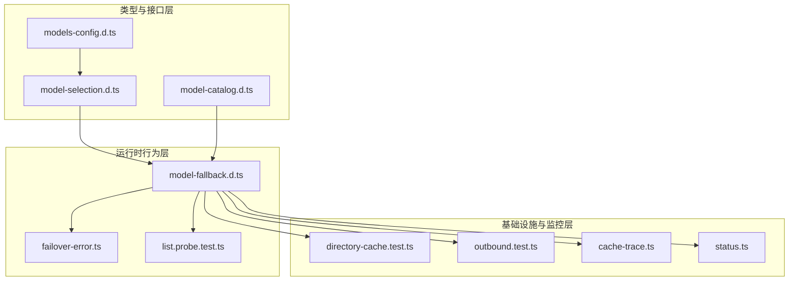
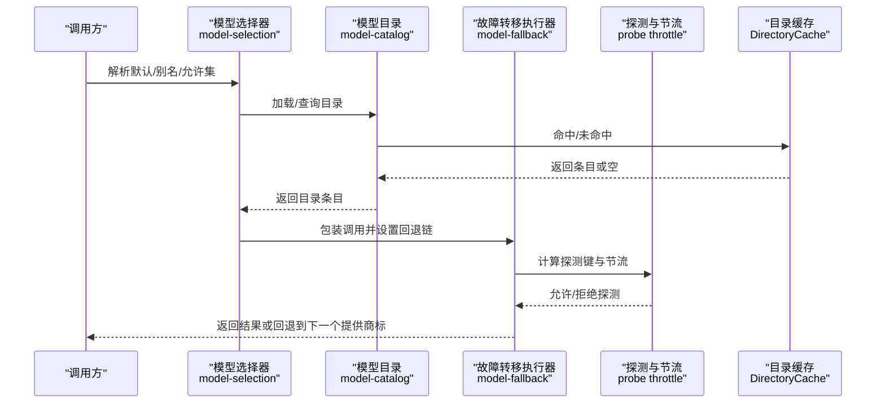
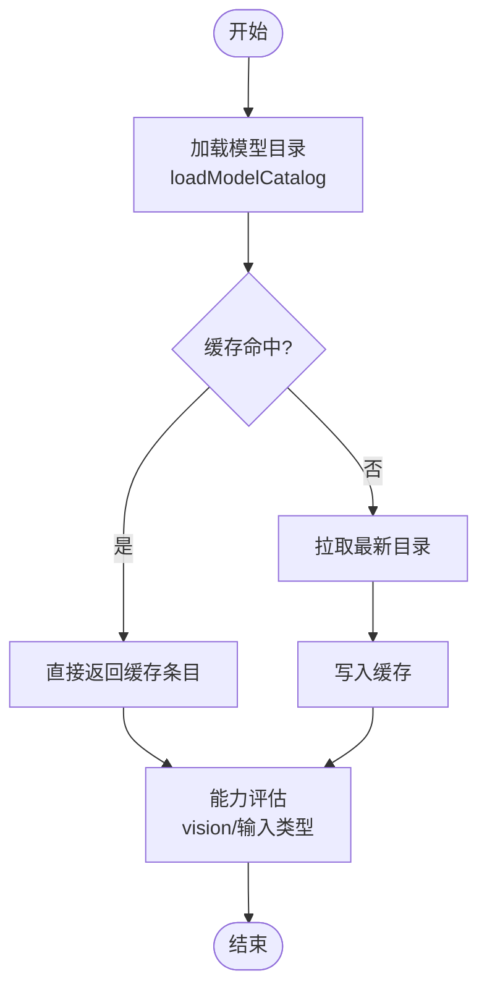
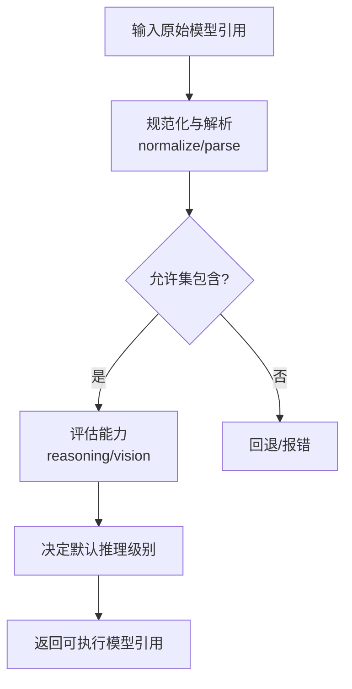
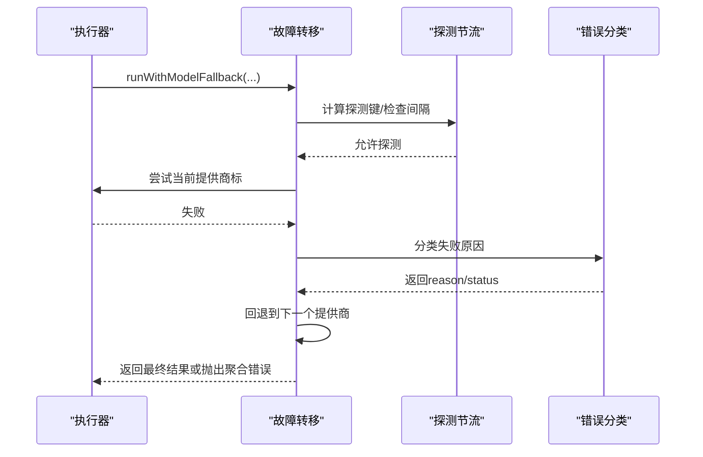
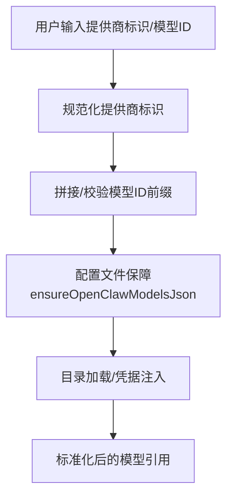
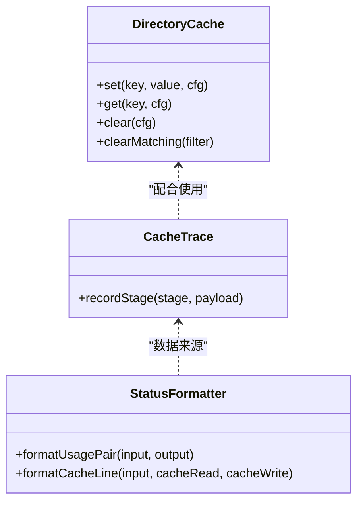
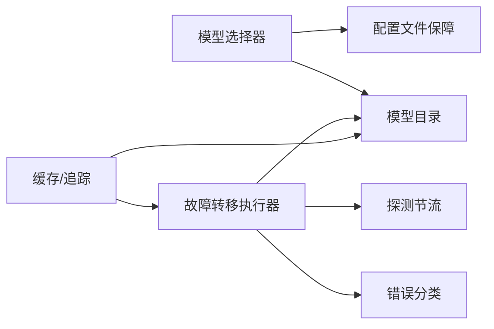

# 模型选择

<cite>
**本文引用的文件**
- [model-selection.d.ts](file://dist/plugin-sdk/agents/model-selection.d.ts)
- [models-config.d.ts](file://dist/plugin-sdk/agents/models-config.d.ts)
- [model-fallback.d.ts](file://dist/plugin-sdk/agents/model-fallback.d.ts)
- [model-catalog.d.ts](file://dist/plugin-sdk/agents/model-catalog.d.ts)
- [failover-error.ts](file://src/agents/failover-error.ts)
- [list.probe.test.ts](file://src/commands/models/list.probe.test.ts)
- [onboard-auth.models.ts](file://src/commands/onboard-auth.models.ts)
- [directory-cache.test.ts](file://src/infra/outbound/directory-cache.test.ts)
- [outbound.test.ts](file://src/infra/outbound/outbound.test.ts)
- [cache-trace.ts](file://src/agents/cache-trace.ts)
- [status.ts](file://src/auto-reply/status.ts)
- [README.md（vLLM 提供商）](file://extensions/vllm/README.md)
- [README.md（Ollama 提供商）](file://extensions/ollama/README.md)
- [ChatViewModel.swift](file://apps/shared/OpenClawKit/Sources/OpenClawChatUI/ChatViewModel.swift)
</cite>

## 目录
1. [简介](#简介)
2. [项目结构](#项目结构)
3. [核心组件](#核心组件)
4. [架构总览](#架构总览)
5. [详细组件分析](#详细组件分析)
6. [依赖关系分析](#依赖关系分析)
7. [性能考量](#性能考量)
8. [故障排查指南](#故障排查指南)
9. [结论](#结论)
10. [附录](#附录)

## 简介
本文件面向“模型选择系统”的设计与实现，围绕以下主题展开：模型发现机制、模型能力评估与目录管理、负载均衡与故障转移策略、模型提供商标准化与认证流程、API 密钥与凭据管理、降级与性能监控、模型配置管理与动态切换、成本优化方案、模型选择算法、缓存策略以及性能基准测试方法。内容基于仓库中已公开的类型定义、错误分类与探测逻辑、缓存与追踪工具、提供商扩展说明及前端模型 ID 规范化实践进行系统化梳理。

## 项目结构
模型选择系统由“类型与接口层”“运行时行为层”“基础设施与监控层”三部分组成：
- 类型与接口层：定义模型引用、别名索引、默认值解析、允许集构建等契约，确保跨模块一致的模型选择语义。
- 运行时行为层：提供“带故障转移的执行器”“模型目录加载与查询”“探测节流控制”等能力，支撑实际推理调用。
- 基础设施与监控层：提供缓存、缓存追踪、使用统计格式化等工具，用于性能优化与可观测性。

图表来源
- [model-selection.d.ts:1-117](file://dist/plugin-sdk/agents/model-selection.d.ts#L1-L117)
- [model-catalog.d.ts:1-26](file://dist/plugin-sdk/agents/model-catalog.d.ts#L1-L26)
- [models-config.d.ts:1-6](file://dist/plugin-sdk/agents/models-config.d.ts#L1-L6)
- [model-fallback.d.ts:1-49](file://dist/plugin-sdk/agents/model-fallback.d.ts#L1-L49)
- [failover-error.ts:301-330](file://src/agents/failover-error.ts#L301-L330)
- [list.probe.test.ts:1-23](file://src/commands/models/list.probe.test.ts#L1-L23)
- [directory-cache.test.ts:50-65](file://src/infra/outbound/directory-cache.test.ts#L50-L65)
- [outbound.test.ts:636-671](file://src/infra/outbound/outbound.test.ts#L636-L671)
- [cache-trace.ts:158-195](file://src/agents/cache-trace.ts#L158-L195)
- [status.ts:307-344](file://src/auto-reply/status.ts#L307-L344)

章节来源
- [model-selection.d.ts:1-117](file://dist/plugin-sdk/agents/model-selection.d.ts#L1-L117)
- [model-catalog.d.ts:1-26](file://dist/plugin-sdk/agents/model-catalog.d.ts#L1-L26)
- [models-config.d.ts:1-6](file://dist/plugin-sdk/agents/models-config.d.ts#L1-L6)
- [model-fallback.d.ts:1-49](file://dist/plugin-sdk/agents/model-fallback.d.ts#L1-L49)
- [failover-error.ts:301-330](file://src/agents/failover-error.ts#L301-L330)
- [list.probe.test.ts:1-23](file://src/commands/models/list.probe.test.ts#L1-L23)
- [directory-cache.test.ts:50-65](file://src/infra/outbound/directory-cache.test.ts#L50-L65)
- [outbound.test.ts:636-671](file://src/infra/outbound/outbound.test.ts#L636-L671)
- [cache-trace.ts:158-195](file://src/agents/cache-trace.ts#L158-L195)
- [status.ts:307-344](file://src/auto-reply/status.ts#L307-L344)

## 核心组件
- 模型引用与规范化
  - 提供模型引用解析、规范化、别名索引与默认模型解析能力，保证在不同上下文（CLI、会话、子代理）下的一致性。
- 模型目录与能力评估
  - 提供目录加载、缓存控制、按能力过滤（如视觉输入支持）、按提供商标识查询等。
- 故障转移与探测
  - 提供带探测节流的多提供商标的回退执行器，结合错误分类与探测映射，实现智能失败恢复。
- 配置与动态切换
  - 提供模型配置文件保障、默认模型解析、允许集构建与动态覆盖，支持运行时切换。
- 缓存与追踪
  - 提供目录缓存、LRU 淘汰、缓存追踪事件记录，辅助性能优化与问题定位。
- 成本与使用统计
  - 提供令牌用量与缓存命中率格式化展示，辅助成本优化与性能监控。

章节来源
- [model-selection.d.ts:15-117](file://dist/plugin-sdk/agents/model-selection.d.ts#L15-L117)
- [model-catalog.d.ts:12-26](file://dist/plugin-sdk/agents/model-catalog.d.ts#L12-L26)
- [model-fallback.d.ts:24-49](file://dist/plugin-sdk/agents/model-fallback.d.ts#L24-L49)
- [models-config.d.ts:1-6](file://dist/plugin-sdk/agents/models-config.d.ts#L1-L6)
- [directory-cache.test.ts:50-65](file://src/infra/outbound/directory-cache.test.ts#L50-L65)
- [outbound.test.ts:636-671](file://src/infra/outbound/outbound.test.ts#L636-L671)
- [cache-trace.ts:158-195](file://src/agents/cache-trace.ts#L158-L195)
- [status.ts:307-344](file://src/auto-reply/status.ts#L307-L344)

## 架构总览
模型选择系统以“类型契约 + 运行时执行 + 基础设施工具”三层协同工作：
- 类型层定义模型引用、别名与默认解析规则；
- 运行时层负责目录加载、能力评估、故障转移与探测节流；
- 基础设施层提供缓存、追踪与统计输出，支撑性能优化与可观测性。

图表来源
- [model-selection.d.ts:22-117](file://dist/plugin-sdk/agents/model-selection.d.ts#L22-L117)
- [model-catalog.d.ts:12-26](file://dist/plugin-sdk/agents/model-catalog.d.ts#L12-L26)
- [model-fallback.d.ts:24-49](file://dist/plugin-sdk/agents/model-fallback.d.ts#L24-L49)
- [directory-cache.test.ts:50-65](file://src/infra/outbound/directory-cache.test.ts#L50-L65)

## 详细组件分析

### 组件一：模型发现与目录管理
- 能力要点
  - 目录加载与缓存：支持启用/禁用缓存、重置缓存、按配置加载。
  - 能力评估：根据目录条目判断模型是否支持视觉输入、按提供商标识查找。
  - 默认解析：从配置、代理标识、子代理覆盖等维度解析默认模型。
- 关键接口路径
  - [loadModelCatalog(...):13-16](file://dist/plugin-sdk/agents/model-catalog.d.ts#L13-L16)
  - [findModelInCatalog(...):22-24](file://dist/plugin-sdk/agents/model-catalog.d.ts#L22-L24)
  - [modelSupportsVision(...):18-20](file://dist/plugin-sdk/agents/model-catalog.d.ts#L18-L20)
  - [resolveDefaultModelForAgent(...):48-52](file://dist/plugin-sdk/agents/model-selection.d.ts#L48-L52)
  - [resolveSubagentSpawnModelSelection(...):57-61](file://dist/plugin-sdk/agents/model-selection.d.ts#L57-L61)

图表来源
- [model-catalog.d.ts:13-26](file://dist/plugin-sdk/agents/model-catalog.d.ts#L13-L26)
- [directory-cache.test.ts:50-65](file://src/infra/outbound/directory-cache.test.ts#L50-L65)

章节来源
- [model-catalog.d.ts:12-26](file://dist/plugin-sdk/agents/model-catalog.d.ts#L12-L26)
- [model-selection.d.ts:48-61](file://dist/plugin-sdk/agents/model-selection.d.ts#L48-L61)
- [directory-cache.test.ts:50-65](file://src/infra/outbound/directory-cache.test.ts#L50-L65)

### 组件二：模型能力评估与负载均衡
- 能力要点
  - 允许集构建：基于配置与目录生成允许模型集合，支持“任意允许”与显式白名单。
  - 别名与规范化：统一模型 ID 前缀与大小写/空白处理，避免歧义。
  - 默认推理/思考级别：根据模型能力自动推断默认推理强度。
- 关键接口路径
  - [buildAllowedModelSet(...):62-71](file://dist/plugin-sdk/agents/model-selection.d.ts#L62-L71)
  - [normalizeModelRef(...):20-21](file://dist/plugin-sdk/agents/model-selection.d.ts#L20-L21)
  - [parseModelRef(...):21-22](file://dist/plugin-sdk/agents/model-selection.d.ts#L21-L22)
  - [resolveThinkingDefault(...):97-102](file://dist/plugin-sdk/agents/model-selection.d.ts#L97-L102)
  - [resolveReasoningDefault(...):104-108](file://dist/plugin-sdk/agents/model-selection.d.ts#L104-L108)

图表来源
- [model-selection.d.ts:20-108](file://dist/plugin-sdk/agents/model-selection.d.ts#L20-L108)

章节来源
- [model-selection.d.ts:20-108](file://dist/plugin-sdk/agents/model-selection.d.ts#L20-L108)

### 组件三：故障转移与探测节流
- 能力要点
  - 多提供商标的顺序回退：在一次调用中依次尝试多个提供商标，失败即回退。
  - 探测节流：对同一提供商标记最后一次探测时间，限制探测频率。
  - 错误分类与映射：将 HTTP 状态码与错误信息映射为失败原因（如超时、限流、过载、鉴权失败等），驱动回退决策。
- 关键接口路径
  - [runWithModelFallback(...):32-41](file://dist/plugin-sdk/agents/model-fallback.d.ts#L32-L41)
  - [runWithImageModelFallback(...):42-47](file://dist/plugin-sdk/agents/model-fallback.d.ts#L42-L47)
  - [coerceToFailoverError(...):301-330](file://src/agents/failover-error.ts#L301-L330)
  - [mapFailoverReasonToProbeStatus(...):1-23](file://src/commands/models/list.probe.test.ts#L1-L23)

图表来源
- [model-fallback.d.ts:32-49](file://dist/plugin-sdk/agents/model-fallback.d.ts#L32-L49)
- [failover-error.ts:301-330](file://src/agents/failover-error.ts#L301-L330)
- [list.probe.test.ts:1-23](file://src/commands/models/list.probe.test.ts#L1-L23)

章节来源
- [model-fallback.d.ts:24-49](file://dist/plugin-sdk/agents/model-fallback.d.ts#L24-L49)
- [failover-error.ts:301-330](file://src/agents/failover-error.ts#L301-L330)
- [list.probe.test.ts:1-23](file://src/commands/models/list.probe.test.ts#L1-L23)

### 组件四：提供商标准化与认证流程
- 提供商标准化
  - 通过“提供商标识规范化”与“模型 ID 前缀统一”，确保跨提供商的一致引用格式。
- 认证与密钥管理
  - 通过“模型目录”与“配置文件保障”机制，确保各提供商的凭据与模型可见性正确注入。
  - 前端层对提供商标识进行清洗与前缀拼接，避免用户输入差异导致的解析错误。
- 关键接口路径
  - [normalizeProviderId(...):16-17](file://dist/plugin-sdk/agents/model-selection.d.ts#L16-L17)
  - [providerQualifiedModelSelectionID(...):745-751](file://apps/shared/OpenClawKit/Sources/OpenClawChatUI/ChatViewModel.swift#L745-L751)
  - [ensureOpenClawModelsJson(...):2-5](file://dist/plugin-sdk/agents/models-config.d.ts#L2-L5)
  - 扩展说明（内置提供商）
    - [vLLM 提供商 README:1-4](file://extensions/vllm/README.md#L1-L4)
    - [Ollama 提供商 README:1-4](file://extensions/ollama/README.md#L1-L4)

图表来源
- [model-selection.d.ts:16-21](file://dist/plugin-sdk/agents/model-selection.d.ts#L16-L21)
- [models-config.d.ts:2-5](file://dist/plugin-sdk/agents/models-config.d.ts#L2-L5)
- [ChatViewModel.swift:739-751](file://apps/shared/OpenClawKit/Sources/OpenClawChatUI/ChatViewModel.swift#L739-L751)
- [README.md（vLLM 提供商）:1-4](file://extensions/vllm/README.md#L1-L4)
- [README.md（Ollama 提供商）:1-4](file://extensions/ollama/README.md#L1-L4)

章节来源
- [model-selection.d.ts:16-21](file://dist/plugin-sdk/agents/model-selection.d.ts#L16-L21)
- [models-config.d.ts:2-5](file://dist/plugin-sdk/agents/models-config.d.ts#L2-L5)
- [ChatViewModel.swift:739-751](file://apps/shared/OpenClawKit/Sources/OpenClawChatUI/ChatViewModel.swift#L739-L751)
- [README.md（vLLM 提供商）:1-4](file://extensions/vllm/README.md#L1-L4)
- [README.md（Ollama 提供商）:1-4](file://extensions/ollama/README.md#L1-L4)

### 组件五：配置管理与动态切换
- 能力要点
  - 配置文件保障：确保模型配置 JSON 存在且可读，必要时写入默认值。
  - 动态覆盖：支持在子代理场景下覆盖默认模型选择，实现动态切换。
  - 允许集构建：支持“任意允许”与显式白名单，便于快速开关。
- 关键接口路径
  - [ensureOpenClawModelsJson(...):2-5](file://dist/plugin-sdk/agents/models-config.d.ts#L2-L5)
  - [resolveSubagentConfiguredModelSelection(...):53-56](file://dist/plugin-sdk/agents/model-selection.d.ts#L53-L56)
  - [buildAllowedModelSet(...):62-71](file://dist/plugin-sdk/agents/model-selection.d.ts#L62-L71)

章节来源
- [models-config.d.ts:2-5](file://dist/plugin-sdk/agents/models-config.d.ts#L2-L5)
- [model-selection.d.ts:53-71](file://dist/plugin-sdk/agents/model-selection.d.ts#L53-L71)

### 组件六：缓存策略与性能监控
- 缓存策略
  - 目录缓存：支持容量上限与 LRU 淘汰，确保热点目录常驻内存。
  - 缓存追踪：记录缓存阶段事件，便于定位性能瓶颈与异常。
- 性能监控
  - 使用统计格式化：输出令牌用量、缓存命中率等指标，辅助成本优化与性能评估。
- 关键接口路径
  - [DirectoryCache 行为验证:50-65](file://src/infra/outbound/directory-cache.test.ts#L50-L65)
  - [缓存追踪事件记录:158-195](file://src/agents/cache-trace.ts#L158-L195)
  - [使用统计与缓存命中率格式化:307-344](file://src/auto-reply/status.ts#L307-L344)

图表来源
- [directory-cache.test.ts:50-65](file://src/infra/outbound/directory-cache.test.ts#L50-L65)
- [cache-trace.ts:158-195](file://src/agents/cache-trace.ts#L158-L195)
- [status.ts:307-344](file://src/auto-reply/status.ts#L307-L344)

章节来源
- [directory-cache.test.ts:50-65](file://src/infra/outbound/directory-cache.test.ts#L50-L65)
- [cache-trace.ts:158-195](file://src/agents/cache-trace.ts#L158-L195)
- [status.ts:307-344](file://src/auto-reply/status.ts#L307-L344)

### 组件七：成本优化方案
- 成本建模
  - 通过“模型目录条目中的成本字段”与“令牌用量统计”进行成本估算与对比。
- 降级策略
  - 在高成本模型不可用时，自动回退到低成本模型；同时结合缓存命中率提升性价比。
- 关键接口路径
  - [onboard-auth.models.ts 中的成本常量与目录条目示例:87-129](file://src/commands/onboard-auth.models.ts#L87-L129)

章节来源
- [onboard-auth.models.ts:87-129](file://src/commands/onboard-auth.models.ts#L87-L129)

## 依赖关系分析
- 组件耦合
  - 模型选择器依赖模型目录与配置；故障转移器依赖错误分类与探测节流；缓存与追踪为两者提供基础设施支持。
- 外部集成点
  - 提供商扩展（如 vLLM、Ollama）通过目录与配置对接系统，遵循统一的模型 ID 前缀与认证注入流程。

图表来源
- [model-selection.d.ts:22-117](file://dist/plugin-sdk/agents/model-selection.d.ts#L22-L117)
- [model-catalog.d.ts:13-26](file://dist/plugin-sdk/agents/model-catalog.d.ts#L13-L26)
- [model-fallback.d.ts:24-49](file://dist/plugin-sdk/agents/model-fallback.d.ts#L24-L49)
- [failover-error.ts:301-330](file://src/agents/failover-error.ts#L301-L330)
- [directory-cache.test.ts:50-65](file://src/infra/outbound/directory-cache.test.ts#L50-L65)

章节来源
- [model-selection.d.ts:22-117](file://dist/plugin-sdk/agents/model-selection.d.ts#L22-L117)
- [model-catalog.d.ts:13-26](file://dist/plugin-sdk/agents/model-catalog.d.ts#L13-L26)
- [model-fallback.d.ts:24-49](file://dist/plugin-sdk/agents/model-fallback.d.ts#L24-L49)
- [failover-error.ts:301-330](file://src/agents/failover-error.ts#L301-L330)
- [directory-cache.test.ts:50-65](file://src/infra/outbound/directory-cache.test.ts#L50-L65)

## 性能考量
- 目录缓存与 LRU 淘汰：减少重复拉取目录带来的网络与解析开销。
- 探测节流：限制探测频率，避免对上游提供商造成压力。
- 缓存追踪：记录关键阶段事件，便于定位慢点与异常。
- 使用统计：通过命中率与令牌用量指导成本优化与资源分配。

## 故障排查指南
- 常见失败原因与回退策略
  - 超时/过载/限流：触发回退至备选提供商或降级模型。
  - 鉴权失败：标记为永久失败，不再尝试该提供商标。
  - 请求格式错误：根据探测状态映射为“格式”类别，避免无效重试。
- 排查步骤
  - 查看探测状态映射与失败原因分类，确认是否被节流或限流。
  - 检查目录缓存是否命中，必要时清空缓存强制刷新。
  - 启用缓存追踪事件，定位具体阶段耗时。
  - 对比令牌用量与缓存命中率，评估是否需要切换更优模型或调整缓存策略。

章节来源
- [failover-error.ts:301-330](file://src/agents/failover-error.ts#L301-L330)
- [list.probe.test.ts:1-23](file://src/commands/models/list.probe.test.ts#L1-L23)
- [outbound.test.ts:636-671](file://src/infra/outbound/outbound.test.ts#L636-L671)
- [cache-trace.ts:158-195](file://src/agents/cache-trace.ts#L158-L195)
- [status.ts:307-344](file://src/auto-reply/status.ts#L307-L344)

## 结论
模型选择系统通过“类型契约 + 运行时执行 + 基础设施工具”的分层设计，在保证跨提供商一致性的同时，提供了完善的发现、评估、回退、缓存与监控能力。结合成本建模与使用统计，可在稳定性与经济性之间取得平衡，并通过动态切换与探测节流持续优化整体性能。

## 附录
- 模型选择算法要点
  - 解析与规范化：统一提供商标识与模型 ID 前缀。
  - 允许集构建：支持任意允许与显式白名单。
  - 默认推理级别：依据模型能力自动推断。
  - 回退链：按优先级顺序尝试多个提供商标，失败即回退。
- 缓存策略建议
  - 目录缓存：设置合理容量与淘汰策略，定期刷新。
  - 缓存追踪：在调试与压测阶段开启，定位性能瓶颈。
- 性能基准测试建议
  - 基准指标：响应时间、吞吐量、缓存命中率、令牌用量、失败率。
  - 测试场景：多提供商并发、高延迟/高错误率、目录热更新、缓存命中波动。
  - 工具：结合缓存追踪与使用统计输出，形成可复现的报告模板。