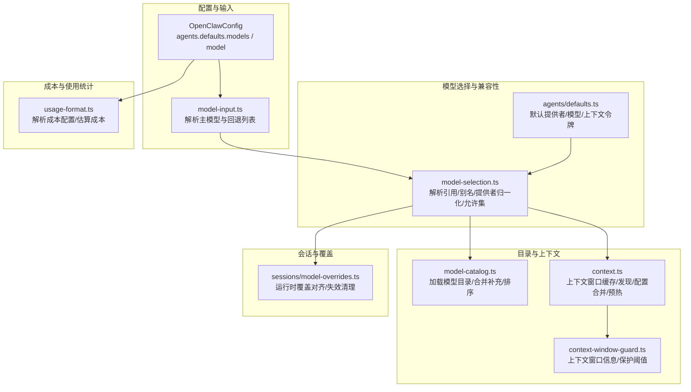
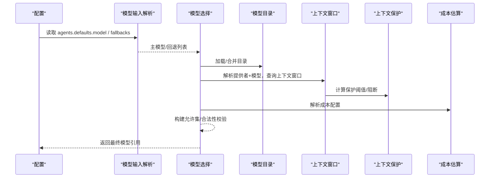
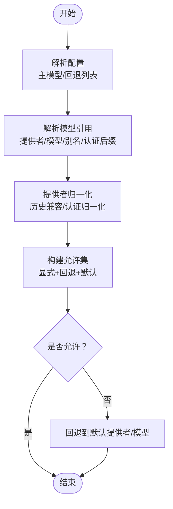
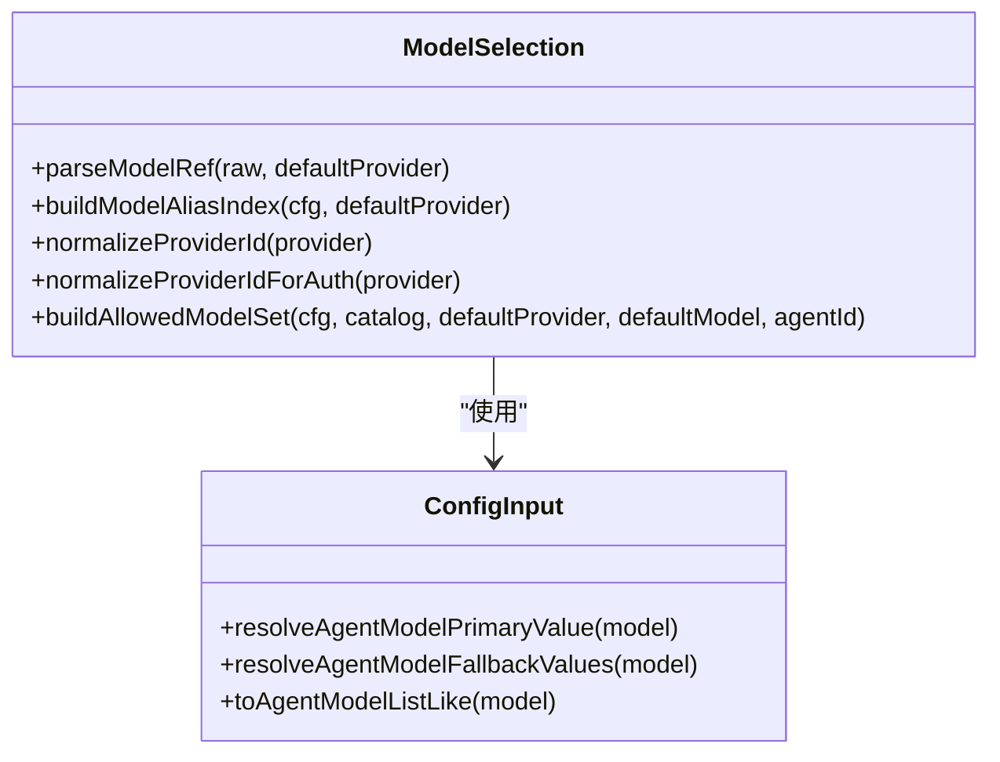
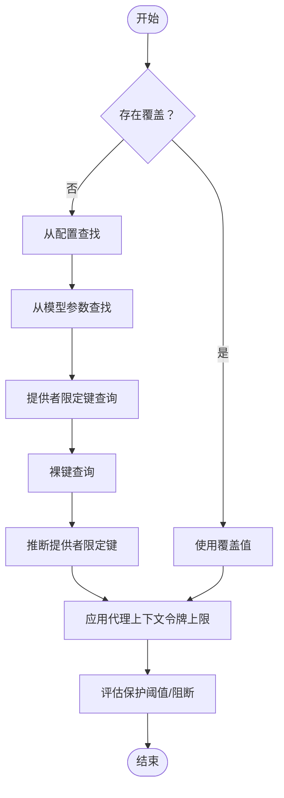
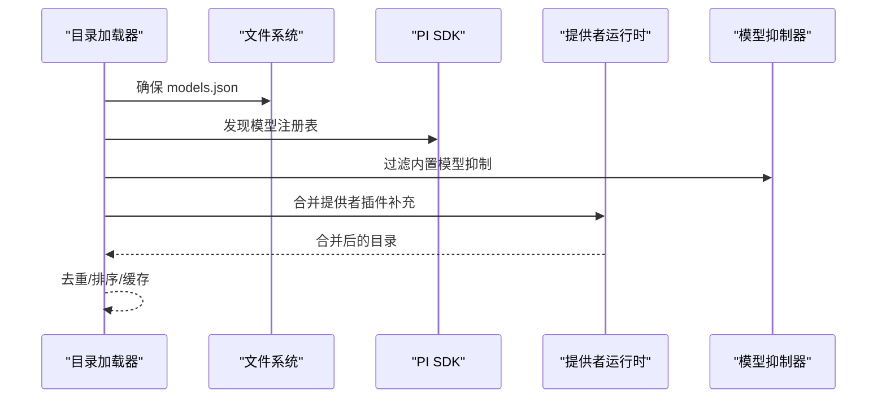
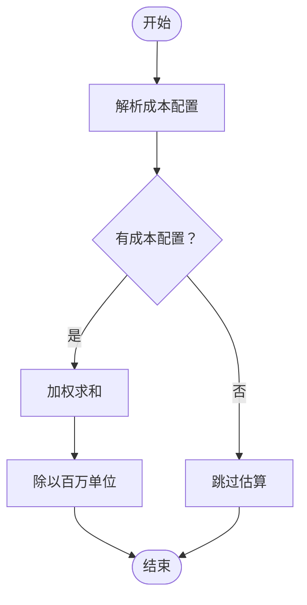
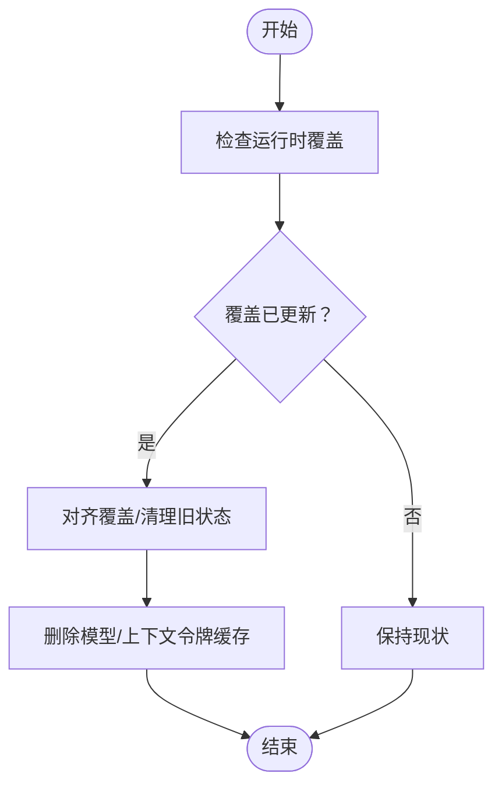
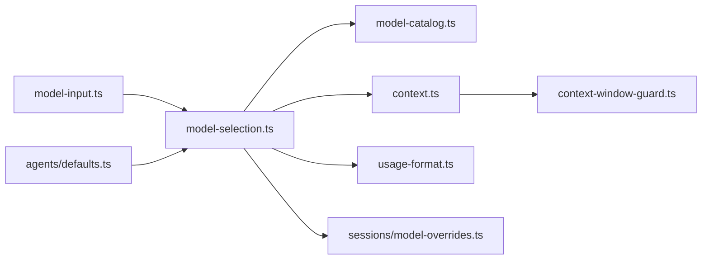

# 模型选择算法

<cite>
**本文引用的文件**
- [src/agents/model-selection.ts](file://src/agents/model-selection.ts)
- [src/agents/context.ts](file://src/agents/context.ts)
- [src/agents/context-window-guard.ts](file://src/agents/context-window-guard.ts)
- [src/agents/model-catalog.ts](file://src/agents/model-catalog.ts)
- [src/agents/defaults.ts](file://src/agents/defaults.ts)
- [src/config/model-input.ts](file://src/config/model-input.ts)
- [src/utils/usage-format.ts](file://src/utils/usage-format.ts)
- [src/sessions/model-overrides.ts](file://src/sessions/model-overrides.ts)
- [src/agents/model-selection.test.ts](file://src/agents/model-selection.test.ts)
- [scripts/bench-cli-startup.ts](file://scripts/bench-cli-startup.ts)
- [scripts/test-perf-budget.mjs](file://scripts/test-perf-budget.mjs)
</cite>

## 目录
1. [引言](#引言)
2. [项目结构](#项目结构)
3. [核心组件](#核心组件)
4. [架构总览](#架构总览)
5. [详细组件分析](#详细组件分析)
6. [依赖关系分析](#依赖关系分析)
7. [性能考量](#性能考量)
8. [故障排查指南](#故障排查指南)
9. [结论](#结论)
10. [附录](#附录)

## 引言
本技术文档聚焦于“模型选择算法”，系统化阐述以下能力与实现细节：
- 模型选择决策树：从配置、别名、回退列表到默认值的解析流程。
- 兼容性检查：允许集构建、别名索引、模型规范化与提供者归一化。
- 上下文窗口评估：配置与发现来源的上下文窗口合并、保护阈值与阻断策略。
- 模型优先级计算、性能权重与成本优化策略：基于配置与目录元数据的综合判定。
- 模型缓存机制、预加载策略与内存管理：按需加载、缓存最小化与热路径优化。
- 算法性能基准、测试用例与优化建议：基准脚本、回归预算与测试覆盖。
- 扩展接口、自定义策略与调试工具：可插拔目录增强、提供者运行时与日志。

## 项目结构
围绕模型选择的关键模块分布如下：
- 配置与输入解析：负责从配置中提取主模型与回退列表，并标准化为统一的数据结构。
- 模型选择与兼容性：解析字符串模型引用、别名映射、提供者归一化、允许集构建与合法性校验。
- 目录与上下文：加载模型目录、合并配置与发现来源的上下文窗口、提供保护阈值与阻断策略。
- 成本与使用统计：从配置中解析成本项，估算使用成本。
- 会话与覆盖：在会话层对运行时覆盖进行对齐与失效处理，确保上下文令牌一致性。

**图表来源**
- [src/config/model-input.ts:1-37](file://src/config/model-input.ts#L1-L37)
- [src/agents/model-selection.ts:1-729](file://src/agents/model-selection.ts#L1-L729)
- [src/agents/model-catalog.ts:1-291](file://src/agents/model-catalog.ts#L1-L291)
- [src/agents/context.ts:1-408](file://src/agents/context.ts#L1-L408)
- [src/agents/context-window-guard.ts:1-75](file://src/agents/context-window-guard.ts#L1-L75)
- [src/utils/usage-format.ts:51-91](file://src/utils/usage-format.ts#L51-L91)
- [src/sessions/model-overrides.ts:44-73](file://src/sessions/model-overrides.ts#L44-L73)

**章节来源**
- [src/agents/model-selection.ts:1-729](file://src/agents/model-selection.ts#L1-L729)
- [src/agents/context.ts:1-408](file://src/agents/context.ts#L1-L408)
- [src/agents/context-window-guard.ts:1-75](file://src/agents/context-window-guard.ts#L1-L75)
- [src/agents/model-catalog.ts:1-291](file://src/agents/model-catalog.ts#L1-L291)
- [src/agents/defaults.ts:1-7](file://src/agents/defaults.ts#L1-L7)
- [src/config/model-input.ts:1-37](file://src/config/model-input.ts#L1-L37)
- [src/utils/usage-format.ts:51-91](file://src/utils/usage-format.ts#L51-L91)
- [src/sessions/model-overrides.ts:44-73](file://src/sessions/model-overrides.ts#L44-L73)

## 核心组件
- 模型引用解析与规范化：支持提供者/模型解析、别名索引、提供者归一化（含历史兼容）、认证归一化。
- 允许集构建：结合显式允许列表、回退列表与默认模型，生成允许集合与合成目录条目。
- 目录加载与合并：动态加载模型目录，合并配置注入与提供者插件补充，保持稳定排序。
- 上下文窗口评估：合并配置与发现来源，提供保护阈值与阻断策略；支持按提供者限定键查询。
- 成本估算：从配置中解析成本项，按输入/输出/缓存读写计费，返回每百万单位成本。
- 会话覆盖对齐：当运行时覆盖变更或不一致时，清理会话中的旧状态与上下文令牌缓存。

**章节来源**
- [src/agents/model-selection.ts:187-388](file://src/agents/model-selection.ts#L187-L388)
- [src/agents/model-catalog.ts:145-259](file://src/agents/model-catalog.ts#L145-L259)
- [src/agents/context.ts:31-407](file://src/agents/context.ts#L31-L407)
- [src/utils/usage-format.ts:51-91](file://src/utils/usage-format.ts#L51-L91)
- [src/sessions/model-overrides.ts:44-73](file://src/sessions/model-overrides.ts#L44-L73)

## 架构总览
模型选择算法由“配置解析—模型选择—目录与上下文—成本与覆盖”四条主线协同完成，形成闭环：
- 配置解析：从 agents.defaults 中提取主模型与回退列表，标准化为统一格式。
- 模型选择：解析字符串引用，应用别名与提供者归一化，构建允许集并校验合法性。
- 目录与上下文：加载目录，合并配置与发现来源，建立上下文窗口缓存，提供保护阈值。
- 成本与覆盖：根据配置解析成本，结合会话覆盖对齐，保证上下文令牌一致性。

**图表来源**
- [src/config/model-input.ts:8-36](file://src/config/model-input.ts#L8-L36)
- [src/agents/model-selection.ts:324-418](file://src/agents/model-selection.ts#L324-L418)
- [src/agents/model-catalog.ts:145-259](file://src/agents/model-catalog.ts#L145-L259)
- [src/agents/context.ts:327-407](file://src/agents/context.ts#L327-L407)
- [src/agents/context-window-guard.ts:21-74](file://src/agents/context-window-guard.ts#L21-L74)
- [src/utils/usage-format.ts:51-91](file://src/utils/usage-format.ts#L51-L91)

## 详细组件分析

### 组件A：模型选择决策树
- 输入：配置对象、默认提供者/模型、模型目录、别名索引。
- 处理：
  - 解析主模型与回退列表，标准化为统一格式。
  - 解析字符串模型引用，支持提供者/模型、别名、认证后缀剥离。
  - 提供者归一化与历史兼容处理，认证归一化以共享认证键。
  - 构建允许集：显式允许列表 + 回退列表 + 默认模型，必要时合成目录条目。
  - 合法性校验：检查是否允许、是否在目录中、是否与默认行为一致。
- 输出：最终模型引用、允许状态、关键信息用于后续流程。

**图表来源**
- [src/config/model-input.ts:8-36](file://src/config/model-input.ts#L8-L36)
- [src/agents/model-selection.ts:187-388](file://src/agents/model-selection.ts#L187-L388)
- [src/agents/model-selection.ts:420-558](file://src/agents/model-selection.ts#L420-L558)

**章节来源**
- [src/agents/model-selection.ts:324-418](file://src/agents/model-selection.ts#L324-L418)
- [src/agents/model-selection.ts:420-558](file://src/agents/model-selection.ts#L420-L558)
- [src/agents/model-selection.test.ts:107-799](file://src/agents/model-selection.test.ts#L107-L799)

### 组件B：兼容性检查与别名索引
- 别名索引：从 agents.defaults.models 构建别名到引用的映射，支持多别名到同一键。
- 字符串解析：支持提供者/模型、仅模型（别名）与认证后缀剥离，保留特殊段如 @cf、@preset。
- 提供者归一化：处理历史名称与变体，确保认证与展示一致。
- 允许集构建：显式允许列表与回退列表均参与，避免目录缺失导致的误判。

**图表来源**
- [src/agents/model-selection.ts:187-388](file://src/agents/model-selection.ts#L187-L388)
- [src/config/model-input.ts:8-36](file://src/config/model-input.ts#L8-L36)

**章节来源**
- [src/agents/model-selection.ts:273-322](file://src/agents/model-selection.ts#L273-L322)
- [src/agents/model-selection.ts:420-558](file://src/agents/model-selection.ts#L420-L558)
- [src/agents/model-selection.test.ts:345-438](file://src/agents/model-selection.test.ts#L345-L438)

### 组件C：上下文窗口评估与保护阈值
- 发现与配置合并：从配置与发现来源收集上下文窗口，按“更小窗口”策略缓存，避免高估导致压缩延迟与溢出。
- 查询策略：优先提供者限定键，其次裸键；支持仅模型调用时的推断提供者场景。
- 保护阈值：提供警告阈值与硬下限，结合代理上下文令牌上限进行裁剪。

**图表来源**
- [src/agents/context.ts:327-407](file://src/agents/context.ts#L327-L407)
- [src/agents/context-window-guard.ts:21-74](file://src/agents/context-window-guard.ts#L21-L74)

**章节来源**
- [src/agents/context.ts:31-55](file://src/agents/context.ts#L31-L55)
- [src/agents/context.ts:159-202](file://src/agents/context.ts#L159-L202)
- [src/agents/context.ts:327-407](file://src/agents/context.ts#L327-L407)
- [src/agents/context-window-guard.ts:21-74](file://src/agents/context-window-guard.ts#L21-L74)

### 组件D：模型目录加载与合并
- 动态加载：确保 models.json 存在，加载 PI SDK 的模型注册表，过滤抑制项。
- 合并策略：合并配置注入的提供者模型与提供者插件补充，去重并排序。
- 缓存与错误处理：失败不污染缓存，首次为空时可再次尝试。

**图表来源**
- [src/agents/model-catalog.ts:145-259](file://src/agents/model-catalog.ts#L145-L259)

**章节来源**
- [src/agents/model-catalog.ts:145-259](file://src/agents/model-catalog.ts#L145-L259)

### 组件E：成本估算与性能权重
- 成本配置解析：从配置中按 provider/model 提取成本项（输入/输出/缓存读写）。
- 成本估算：按使用量加权求和，返回每百万单位成本，处理非有限数情况。

**图表来源**
- [src/utils/usage-format.ts:51-91](file://src/utils/usage-format.ts#L51-L91)

**章节来源**
- [src/utils/usage-format.ts:51-91](file://src/utils/usage-format.ts#L51-L91)

### 组件F：会话覆盖对齐与上下文令牌一致性
- 运行时覆盖对齐：当存在运行时覆盖且与当前选择不一致时，清理会话中的模型与上下文令牌缓存，确保状态一致。
- 会话刷新：避免陈旧上下文令牌导致的压缩延迟与溢出。

**图表来源**
- [src/sessions/model-overrides.ts:44-73](file://src/sessions/model-overrides.ts#L44-L73)

**章节来源**
- [src/sessions/model-overrides.ts:44-73](file://src/sessions/model-overrides.ts#L44-L73)

## 依赖关系分析
- 模块耦合：
  - 模型选择依赖配置输入解析与默认值。
  - 目录加载与上下文窗口评估相互独立但共同服务于模型选择。
  - 成本估算依赖配置中的成本定义。
  - 会话覆盖对齐依赖模型选择结果。
- 外部依赖：
  - PI SDK 用于模型发现与目录加载。
  - 提供者运行时与模型抑制器用于目录增强与过滤。
- 循环依赖：未见直接循环，各模块职责清晰。

**图表来源**
- [src/config/model-input.ts:1-37](file://src/config/model-input.ts#L1-L37)
- [src/agents/model-selection.ts:1-729](file://src/agents/model-selection.ts#L1-L729)
- [src/agents/model-catalog.ts:1-291](file://src/agents/model-catalog.ts#L1-L291)
- [src/agents/context.ts:1-408](file://src/agents/context.ts#L1-L408)
- [src/agents/context-window-guard.ts:1-75](file://src/agents/context-window-guard.ts#L1-L75)
- [src/utils/usage-format.ts:51-91](file://src/utils/usage-format.ts#L51-L91)
- [src/sessions/model-overrides.ts:44-73](file://src/sessions/model-overrides.ts#L44-L73)

**章节来源**
- [src/agents/model-selection.ts:1-729](file://src/agents/model-selection.ts#L1-L729)
- [src/agents/model-catalog.ts:1-291](file://src/agents/model-catalog.ts#L1-L291)
- [src/agents/context.ts:1-408](file://src/agents/context.ts#L1-L408)
- [src/utils/usage-format.ts:51-91](file://src/utils/usage-format.ts#L51-L91)
- [src/sessions/model-overrides.ts:44-73](file://src/sessions/model-overrides.ts#L44-L73)

## 性能考量
- 预热与懒加载：
  - 上下文窗口缓存按需加载并在启动阶段预热，避免冷启动缺失。
  - 目录加载采用动态导入，失败不污染缓存，支持重试与渐进式加载。
- 缓存策略：
  - 上下文窗口缓存采用“更小窗口”策略，避免高估导致压缩延迟与溢出。
  - 目录缓存支持禁用与重置，便于测试与故障排查。
- 性能基准与回归控制：
  - CLI 启动基准脚本：统计平均/中位/95分位耗时与退出状态分布，支持对比两套入口差异。
  - 测试性能预算：通过环境变量设置最大墙钟时间与基线回归阈值，防止回归。

**章节来源**
- [src/agents/context.ts:213-217](file://src/agents/context.ts#L213-L217)
- [src/agents/context.ts:159-202](file://src/agents/context.ts#L159-L202)
- [src/agents/model-catalog.ts:145-156](file://src/agents/model-catalog.ts#L145-L156)
- [scripts/bench-cli-startup.ts:59-200](file://scripts/bench-cli-startup.ts#L59-L200)
- [scripts/test-perf-budget.mjs:1-127](file://scripts/test-perf-budget.mjs#L1-L127)

## 故障排查指南
- 模型引用解析失败：
  - 检查配置中的 agents.defaults.models 是否包含目标模型，确认提供者/模型格式正确。
  - 若使用别名，确认别名索引是否正确构建。
- 允许集校验失败：
  - 显式允许列表与回退列表均参与允许集，若目录缺失，可通过显式允许列表兜底。
- 上下文窗口异常：
  - 检查配置 models.providers 中的 contextWindow 设置，确认提供者归一化是否正确。
  - 使用上下文窗口保护阈值评估，确认是否低于警告/阻断阈值。
- 成本估算异常：
  - 确认配置中是否存在对应 provider/model 的 cost 定义，数值是否为有限数。
- 会话覆盖不一致：
  - 当运行时覆盖变更或与当前选择不一致时，会清理会话中的模型与上下文令牌缓存，确保状态一致。

**章节来源**
- [src/agents/model-selection.test.ts:440-479](file://src/agents/model-selection.test.ts#L440-L479)
- [src/agents/context-window-guard.ts:57-74](file://src/agents/context-window-guard.ts#L57-L74)
- [src/utils/usage-format.ts:69-91](file://src/utils/usage-format.ts#L69-L91)
- [src/sessions/model-overrides.ts:44-73](file://src/sessions/model-overrides.ts#L44-L73)

## 结论
该模型选择算法通过“配置解析—模型选择—目录与上下文—成本与覆盖”的闭环设计，实现了：
- 可靠的模型引用解析与兼容性检查；
- 精准的上下文窗口评估与保护阈值；
- 成本驱动的优化与会话状态一致性保障；
- 可扩展的目录加载与提供者插件集成；
- 完备的性能基准与回归控制。

## 附录
- 扩展接口与自定义策略：
  - 目录增强：通过提供者运行时与模型抑制器实现目录补充与过滤。
  - 自定义提供者：通过 agents.defaults.models 注入自定义提供者模型。
- 调试工具：
  - 日志子系统与测试用例覆盖关键路径，便于定位问题。
  - 性能基准脚本与回归预算脚本用于持续监控。

**章节来源**
- [src/agents/model-catalog.ts:175-236](file://src/agents/model-catalog.ts#L175-L236)
- [src/agents/model-selection.test.ts:1-800](file://src/agents/model-selection.test.ts#L1-L800)
- [scripts/bench-cli-startup.ts:156-198](file://scripts/bench-cli-startup.ts#L156-L198)
- [scripts/test-perf-budget.mjs:1-127](file://scripts/test-perf-budget.mjs#L1-L127)