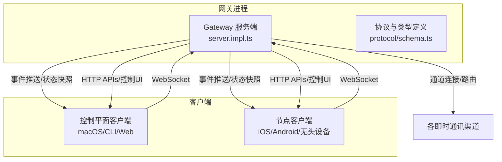
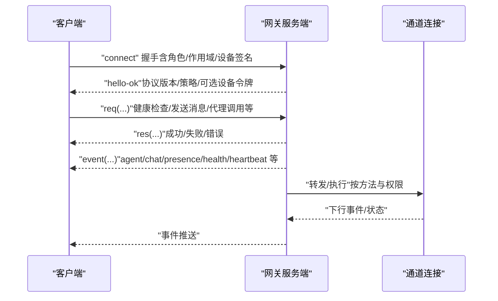
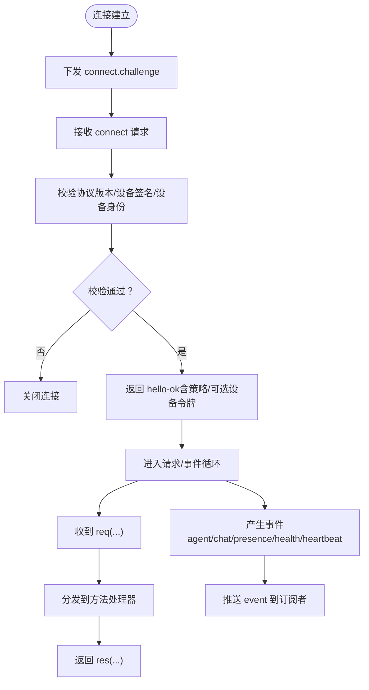
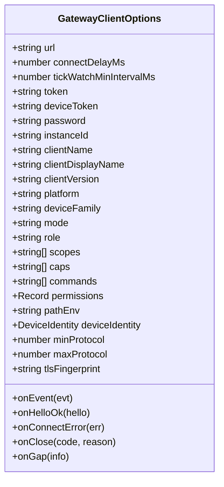
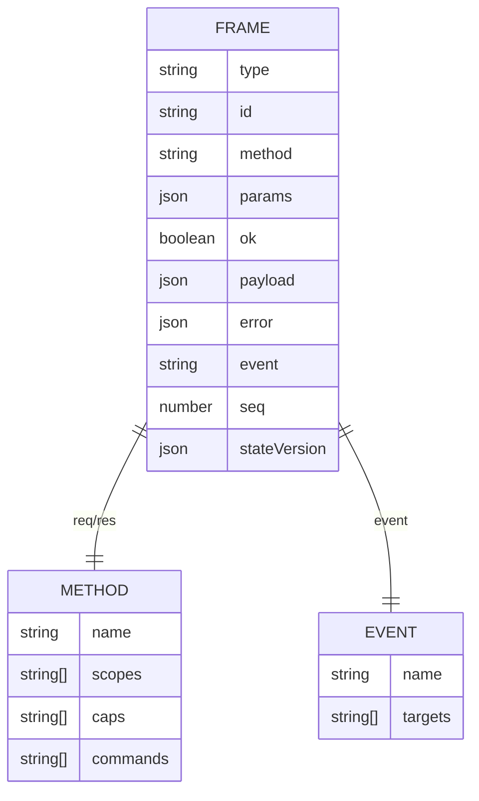
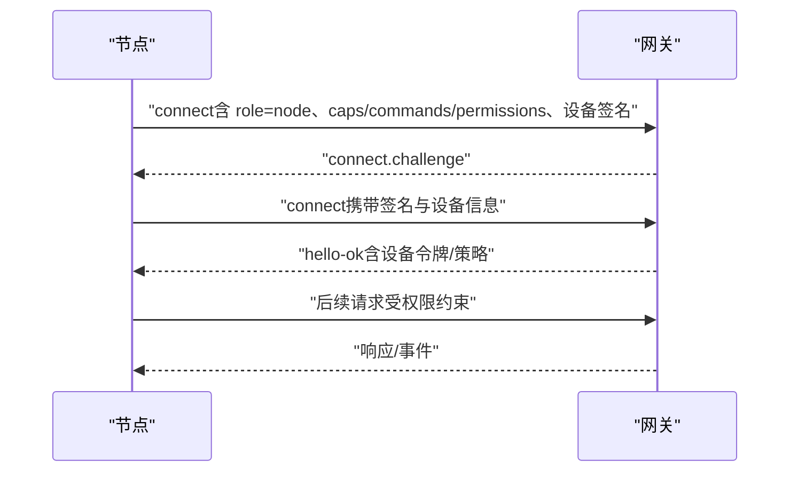
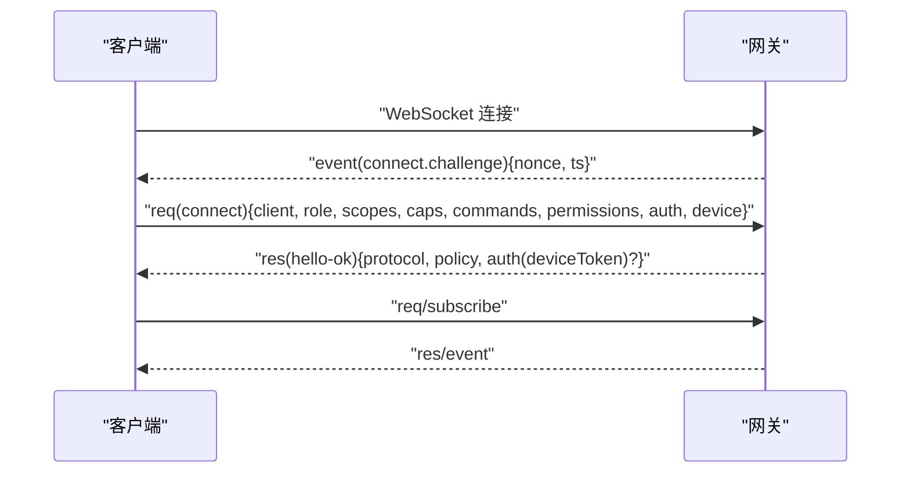
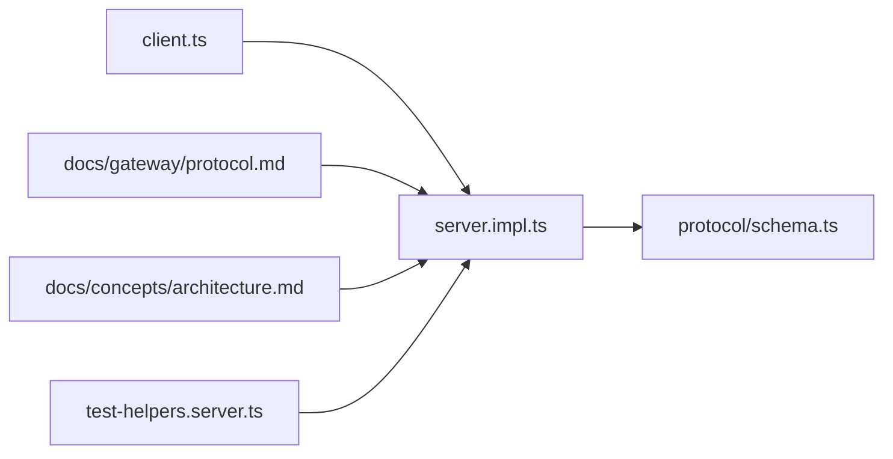

# 网关架构

<cite>
**本文引用的文件**
- [docs/concepts/architecture.md](file://docs/concepts/architecture.md)
- [docs/gateway/index.md](file://docs/gateway/index.md)
- [docs/gateway/protocol.md](file://docs/gateway/protocol.md)
- [docs/gateway/pairing.md](file://docs/gateway/pairing.md)
- [src/gateway/client.ts](file://src/gateway/client.ts)
- [src/gateway/server.ts](file://src/gateway/server.ts)
- [src/gateway/server.impl.ts](file://src/gateway/server.impl.ts)
- [src/gateway/test-helpers.server.ts](file://src/gateway/test-helpers.server.ts)
- [src/gateway/protocol/schema.ts](file://src/gateway/protocol/schema.ts)
- [apps/shared/OpenClawKit/Tests/OpenClawKitTests/GatewayNodeSessionTests.swift](file://apps/shared/OpenClawKit/Tests/OpenClawKitTests/GatewayNodeSessionTests.swift)
</cite>

## 目录
1. [简介](#简介)
2. [项目结构](#项目结构)
3. [核心组件](#核心组件)
4. [架构总览](#架构总览)
5. [详细组件分析](#详细组件分析)
6. [依赖关系分析](#依赖关系分析)
7. [性能考量](#性能考量)
8. [故障排查指南](#故障排查指南)
9. [结论](#结论)
10. [附录](#附录)

## 简介
本技术文档围绕 OpenClaw 的 WebSocket 网关架构展开，系统性阐述单实例网关设计、控制平面与数据平面分离、多即时通讯渠道统一接入、客户端连接生命周期（握手、认证、配对）、节点角色与权限模型、以及协议规范与类型定义。文档同时提供架构图与序列图，帮助开发者快速理解并实现网关相关功能。

## 项目结构
OpenClaw 将“网关”作为单一长期运行的进程，统一承载控制平面与通道连接，并通过 WebSocket 对外暴露 RPC 与事件推送能力。典型部署形态为每台主机仅运行一个网关实例，负责维护各消息平台（如 WhatsApp、Telegram、Slack、Discord、Signal、iMessage、WebChat）的会话与路由。

- 网关服务端入口与对外接口导出位于 src/gateway/server.ts
- 网关服务端实现位于 src/gateway/server.impl.ts
- 客户端类型与选项定义位于 src/gateway/client.ts
- 协议与类型定义由 src/gateway/protocol/schema.ts 聚合导出
- 文档层面的架构与协议说明分别位于 docs/concepts/architecture.md、docs/gateway/protocol.md、docs/gateway/index.md、docs/gateway/pairing.md
- 测试辅助工具位于 src/gateway/test-helpers.server.ts
- Swift 客户端侧测试中包含 hello-ok 帧示例，位于 apps/shared/OpenClawKit/Tests/OpenClawKitTests/GatewayNodeSessionTests.swift

**图表来源**
- [src/gateway/server.ts](file://src/gateway/server.ts#L1-L4)
- [src/gateway/server.impl.ts](file://src/gateway/server.impl.ts)
- [src/gateway/protocol/schema.ts](file://src/gateway/protocol/schema.ts#L1-L19)
- [docs/concepts/architecture.md](file://docs/concepts/architecture.md#L12-L26)

**章节来源**
- [docs/concepts/architecture.md](file://docs/concepts/architecture.md#L12-L26)
- [docs/gateway/index.md](file://docs/gateway/index.md#L68-L77)

## 核心组件
- 网关服务端（Gateway Server）
  - 统一维护各消息平台连接
  - 暴露类型化 WebSocket API（请求、响应、服务器推送事件）
  - 基于 JSON Schema 验证入站帧
  - 发出事件如 agent、chat、presence、health、heartbeat、cron
- 客户端（控制平面/节点）
  - 控制平面客户端：每个客户端一个 WS 连接，发送 health/status/send/agent/system-presence 等请求，订阅 tick/agent/presence/shutdown 等事件
  - 节点客户端：同样通过 WS 连接，声明 role: node 并带有明确的能力/命令
- 协议与类型
  - 协议版本、帧格式、事件类型、方法集等由协议 schema 聚合导出
  - 客户端选项集中定义了连接参数、角色、作用域、能力、权限、TLS 指纹等

**章节来源**
- [docs/concepts/architecture.md](file://docs/concepts/architecture.md#L27-L47)
- [src/gateway/client.ts](file://src/gateway/client.ts#L38-L84)
- [src/gateway/protocol/schema.ts](file://src/gateway/protocol/schema.ts#L1-L19)

## 架构总览
OpenClaw 的网关采用“单实例、多通道”的设计。控制平面（macOS 应用、CLI、Web 界面、自动化）与节点（iOS/Android/无头设备）均通过 WebSocket 连接到同一网关。网关在进程内完成：
- 控制平面 RPC 请求处理
- 通道连接与消息路由
- 事件广播与状态快照
- 身份认证与配对管理（设备级）

**图表来源**
- [docs/gateway/protocol.md](file://docs/gateway/protocol.md#L22-L90)
- [docs/gateway/index.md](file://docs/gateway/index.md#L202-L214)

**章节来源**
- [docs/gateway/protocol.md](file://docs/gateway/protocol.md#L12-L21)
- [docs/gateway/index.md](file://docs/gateway/index.md#L202-L214)

## 详细组件分析

### 组件A：网关服务端（server.impl.ts）
- 职责
  - 启动与监听 WebSocket/HTTP 端口
  - 处理首个帧必须为 connect 的握手流程
  - 校验协议版本范围（minProtocol/maxProtocol）
  - 验证设备签名与设备身份
  - 分发请求到对应处理器（方法路由）
  - 广播事件（agent/chat/presence/health/heartbeat 等）
  - 管理配对状态（节点配对存储）
- 关键流程
  - 连接建立后下发 connect.challenge，等待客户端携带签名与设备信息
  - 返回 hello-ok，包含协议版本、策略（如 tickIntervalMs）与可选设备令牌
  - 基于角色与作用域进行授权与命令白名单校验
  - 对需要审批的方法（如系统执行）广播审批请求事件
- 错误处理
  - 地址占用、非 connect 首帧、协议不匹配、认证失败、设备签名无效等场景下主动关闭连接

**图表来源**
- [docs/gateway/protocol.md](file://docs/gateway/protocol.md#L22-L90)
- [src/gateway/server.impl.ts](file://src/gateway/server.impl.ts)

**章节来源**
- [src/gateway/server.impl.ts](file://src/gateway/server.impl.ts)
- [docs/gateway/protocol.md](file://docs/gateway/protocol.md#L22-L90)

### 组件B：客户端（client.ts）
- 角色与作用域
  - operator：控制平面客户端，具备 operator.read/operator.write/operator.admin/operator.approvals/operator.pairing 等作用域
  - node：节点客户端，声明 caps/commands/permissions，用于能力与命令白名单
- 连接参数
  - 支持 token/deviceToken/password 等认证方式
  - 支持 TLS 证书指纹校验
  - 可设置最小/最大协议版本
  - 可配置心跳间隔、重连延迟、事件回调等
- 生命周期事件
  - onHelloOk：收到 hello-ok 后触发
  - onEvent：接收服务器推送事件
  - onConnectError/onClose/onGap：连接异常与断点恢复提示

**图表来源**
- [src/gateway/client.ts](file://src/gateway/client.ts#L38-L84)

**章节来源**
- [src/gateway/client.ts](file://src/gateway/client.ts#L38-L84)

### 组件C：协议与类型（protocol/schema.ts）
- 协议版本
  - PROTOCOL_VERSION 由 schema 定义，客户端需在 connect 中声明 minProtocol/maxProtocol
- 帧格式
  - 请求：req(id, method, params)
  - 响应：res(id, ok, payload|error)
  - 事件：event(event, payload, seq?, stateVersion?)
- 方法与事件
  - 常见方法：health、status、send、agent、system-presence、exec.approval.resolve 等
  - 常见事件：agent、chat、presence、tick、health、heartbeat、shutdown、node.pair.requested/node.pair.resolved 等
- 类型与校验
  - 所有入站帧基于 JSON Schema 验证，确保数据一致性与安全性

**图表来源**
- [docs/gateway/protocol.md](file://docs/gateway/protocol.md#L127-L134)
- [src/gateway/protocol/schema.ts](file://src/gateway/protocol/schema.ts#L1-L19)

**章节来源**
- [docs/gateway/protocol.md](file://docs/gateway/protocol.md#L127-L134)
- [src/gateway/protocol/schema.ts](file://src/gateway/protocol/schema.ts#L1-L19)

### 组件D：节点角色与权限模型
- 角色
  - operator：控制平面，具备读写/管理/审批/配对等作用域
  - node：能力宿主，声明 caps/commands/permissions
- 权限模型
  - 方法级作用域门禁：部分方法需 operator.admin 或 operator.approvals 等更高权限
  - 命令级细粒度开关：节点 permissions 中的布尔项决定具体能力是否允许
- 设备配对
  - 节点在 connect 时提供稳定的设备标识与签名
  - 网关颁发设备令牌（deviceToken），用于后续连接的身份凭证
  - 新设备首次连接需经配对审批，过期自动清理

**图表来源**
- [docs/gateway/protocol.md](file://docs/gateway/protocol.md#L92-L125)
- [docs/gateway/pairing.md](file://docs/gateway/pairing.md#L27-L35)

**章节来源**
- [docs/gateway/protocol.md](file://docs/gateway/protocol.md#L135-L164)
- [docs/gateway/pairing.md](file://docs/gateway/pairing.md#L10-L35)

### 组件E：客户端连接生命周期（握手、认证、配对）
- 握手阶段
  - 网关下发 connect.challenge（包含随机数 nonce 与时间戳）
  - 客户端使用设备私钥对 v2/v3 签名负载进行签名，并在 connect 中回传 nonce
- 认证与配对
  - 若启用网关令牌（token/password），connect 必须匹配
  - 首次配对成功后，网关返回设备令牌（deviceToken），客户端应持久化以便后续连接
- 断线与恢复
  - 网关支持心跳与事件序号（seq），出现 gap 时建议刷新 health/system-presence 获取最新状态

**图表来源**
- [docs/gateway/protocol.md](file://docs/gateway/protocol.md#L22-L90)
- [src/gateway/test-helpers.server.ts](file://src/gateway/test-helpers.server.ts#L342-L367)

**章节来源**
- [docs/gateway/protocol.md](file://docs/gateway/protocol.md#L22-L90)
- [src/gateway/test-helpers.server.ts](file://src/gateway/test-helpers.server.ts#L342-L367)

### 组件F：控制平面与数据平面分离
- 控制平面
  - 通过 WebSocket 提供 RPC 接口（health/status/send/agent/system-presence 等）
  - 订阅事件以感知系统状态变化
- 数据平面
  - 网关统一维护各即时通讯渠道的连接与消息路由
  - 客户端无需直接对接各平台 SDK，降低复杂度与耦合

**章节来源**
- [docs/concepts/architecture.md](file://docs/concepts/architecture.md#L27-L47)
- [docs/gateway/index.md](file://docs/gateway/index.md#L68-L77)

## 依赖关系分析
- 网关服务端依赖协议 schema 进行入站帧校验与方法路由
- 客户端依赖 server.impl.ts 提供的连接与事件处理能力
- 文档与实现相互印证，确保协议与行为一致

**图表来源**
- [src/gateway/client.ts](file://src/gateway/client.ts#L38-L84)
- [src/gateway/server.impl.ts](file://src/gateway/server.impl.ts)
- [src/gateway/protocol/schema.ts](file://src/gateway/protocol/schema.ts#L1-L19)
- [docs/gateway/protocol.md](file://docs/gateway/protocol.md#L1-L20)
- [docs/concepts/architecture.md](file://docs/concepts/architecture.md#L12-L26)
- [src/gateway/test-helpers.server.ts](file://src/gateway/test-helpers.server.ts#L320-L367)

**章节来源**
- [src/gateway/server.ts](file://src/gateway/server.ts#L1-L4)
- [src/gateway/server.impl.ts](file://src/gateway/server.impl.ts)
- [src/gateway/protocol/schema.ts](file://src/gateway/protocol/schema.ts#L1-L19)

## 性能考量
- 单端口多用途：WebSocket 控制/RPC、HTTP API、控制 UI 共用端口，减少网络栈开销
- 心跳与批处理：通过策略中的 tickIntervalMs 控制事件频率，避免过度推送
- 连接复用：每个客户端/节点仅维持一条 WS 连接，降低资源消耗
- 热重载：支持热安全变更与重启模式，保障运行时稳定性

**章节来源**
- [docs/gateway/index.md](file://docs/gateway/index.md#L68-L93)

## 故障排查指南
- 常见问题与症状
  - 未配置认证即绑定非回环地址：拒绝启动
  - 端口冲突（EADDRINUSE）：自动寻找空闲端口或报错
  - 配置为远程模式但未允许：启动被阻断
  - 连接阶段认证不匹配：被拒绝
- 建议排查步骤
  - 使用 openclaw gateway status 与 channels status --probe 检查健康与通道就绪
  - 在出现事件断点（gap）时，先刷新 health/system-presence 再继续
  - 查看日志并结合文档中的迁移诊断表定位设备签名问题

**章节来源**
- [docs/gateway/index.md](file://docs/gateway/index.md#L235-L244)

## 结论
OpenClaw 的网关通过单实例、多通道、控制平面与数据平面分离的设计，实现了对多种即时通讯渠道的统一接入与高效管理。借助严格的握手、认证与配对机制，以及清晰的角色与权限模型，网关在保证安全性的同时提供了灵活的扩展能力。协议与类型定义的规范化进一步提升了系统的可维护性与可演进性。

## 附录
- 协议快速参考（操作者视角）
  - 首帧必须为 connect
  - 网关返回 hello-ok 快照（presence、health、stateVersion、uptimeMs、limits/policy）
  - 请求：req(method, params) → res(ok/payload|error)
  - 常见事件：connect.challenge、agent、chat、presence、tick、health、heartbeat、shutdown
- 设备配对流程（网关托管）
  - 节点发起配对请求，网关发出 node.pair.requested
  - 操作者批准后发放新令牌，节点使用新令牌重连

**章节来源**
- [docs/gateway/index.md](file://docs/gateway/index.md#L202-L214)
- [docs/gateway/pairing.md](file://docs/gateway/pairing.md#L27-L35)