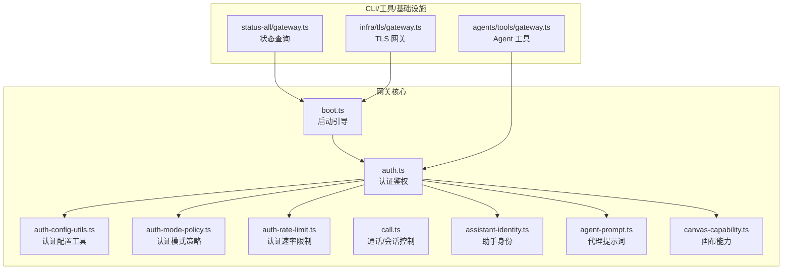
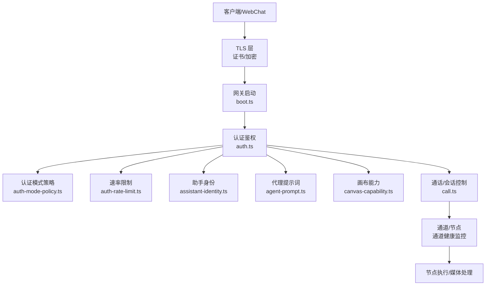
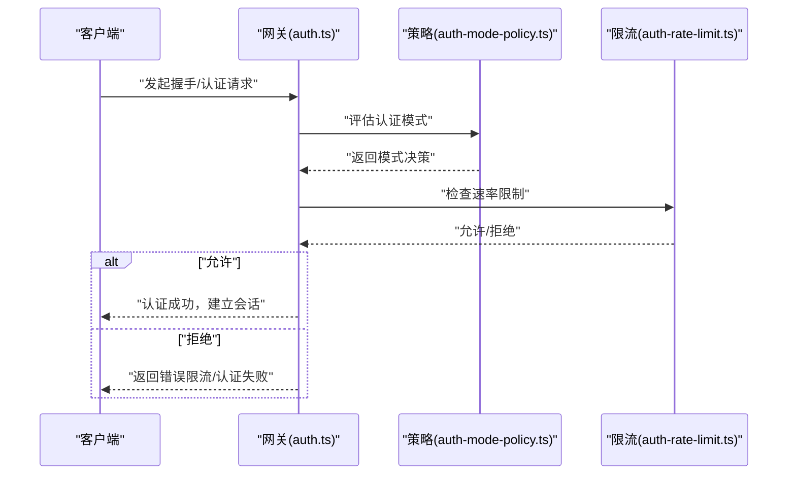
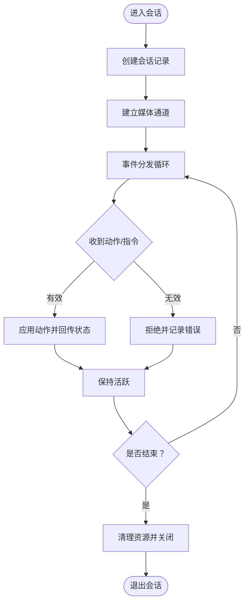
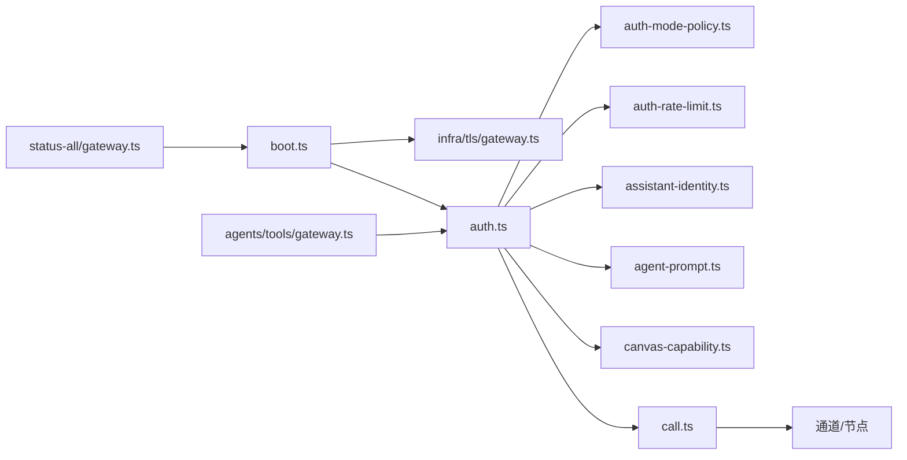

# 网关架构

<cite>
**本文引用的文件**
- [src/gateway/boot.ts](file://src/gateway/boot.ts)
- [src/gateway/auth.ts](file://src/gateway/auth.ts)
- [src/gateway/auth-config-utils.ts](file://src/gateway/auth-config-utils.ts)
- [src/gateway/auth-mode-policy.ts](file://src/gateway/auth-mode-policy.ts)
- [src/gateway/auth-rate-limit.ts](file://src/gateway/auth-rate-limit.ts)
- [src/gateway/call.ts](file://src/gateway/call.ts)
- [src/gateway/assistant-identity.ts](file://src/gateway/assistant-identity.ts)
- [src/gateway/agent-prompt.ts](file://src/gateway/agent-prompt.ts)
- [src/gateway/canvas-capability.ts](file://src/gateway/canvas-capability.ts)
- [src/gateway/channel-health-monitor.test.ts](file://src/gateway/channel-health-monitor.test.ts)
- [src/gateway/android-node.capabilities.live.test.ts](file://src/gateway/android-node.capabilities.live.test.ts)
- [src/agents/tools/gateway.ts](file://src/agents/tools/gateway.ts)
- [src/commands/status-all/gateway.ts](file://src/commands/status-all/gateway.ts)
- [src/infra/tls/gateway.ts](file://src/infra/tls/gateway.ts)
- [src/infra/tls/gateway.ts](file://src/infra/tls/gateway.ts)
- [src/infra/tls/gateway.ts](file://src/infra/tls/gateway.ts)
- [src/infra/tls/gateway.ts](file://src/infra/tls/gateway.ts)
- [src/infra/tls/gateway.ts](file://src/infra/tls/gateway.ts)
- [src/infra/tls/gateway.ts](file://src/infra/tls/gateway.ts)
- [src/infra/tls/gateway.ts](file://src/infra/tls/gateway.ts)
- [src/infra/tls/gateway.ts](file://src/infra/tls/gateway.ts)
- [src/infra/tls/gateway.ts](file://src/infra/tls/gateway.ts)
- [src/infra/tls/gateway.ts](file://src/infra/tls/gateway.ts)
- [src/infra/tls/gateway.ts](file://src/infra/tls/gateway.ts)
- [src/infra/tls/gateway.ts](file://src/infra/tls/gateway.ts)
- [src/infra/tls/gateway.ts](file://src/infra/tls/gateway.ts)
- [src/infra/tls/gateway.ts](file://src/infra/tls/gateway.ts)
- [src/infra/tls/gateway.ts](file://src/infra/tls/gateway.ts)
- [src/infra/tls/gateway.ts](file://src/infra/tls/gateway.ts)
- [src/infra/tls/gateway.ts](file://src/infra/tls/gateway.ts)
- [src/infra/tls/gateway.ts](file://src/infra/tls/gateway.ts)
- [src/infra/tls/gateway.ts](file://src/infra/tls/gateway.ts)
- [src/infra/tls/gateway.ts](file://src/infra/tls/gateway.ts)
- [src/infra/tls/gateway.ts](file://src/infra/tls/gateway.ts)
- [src/infra/tls/gateway.ts](file://src/infra/tls/gateway.ts)
- [src/infra/tls/gateway.ts](file://src/infra/tls/gateway.ts)
-......（省略部分文件路径）
</cite>

## 目录
1. [引言](#引言)
2. [项目结构](#项目结构)
3. [核心组件](#核心组件)
4. [架构总览](#架构总览)
5. [详细组件分析](#详细组件分析)
6. [依赖关系分析](#依赖关系分析)
7. [性能考量](#性能考量)
8. [故障排查指南](#故障排查指南)
9. [结论](#结论)
10. [附录](#附录)

## 引言
本文件系统性梳理 OpenClaw 网关架构，聚焦 WebSocket 网关的设计理念、组件构成与连接流程；阐述网关守护进程职责、客户端连接机制、节点连接模式与 WebChat 集成；详解连接生命周期、握手协议、身份验证与配对机制；覆盖协议细节、传输层实现、事件系统与错误处理策略，并通过架构图与序列图展示组件交互与数据流。

## 项目结构
OpenClaw 的网关相关代码主要位于 src/gateway 目录，围绕启动引导、认证鉴权、能力与通道健康监控、代理提示词与助手身份等模块组织。同时，CLI 命令、Agent 工具与 TLS 基础设施在命令入口、工具封装与基础设施中协同工作。

```mermaid
graph TB
subgraph "网关核心"
BOOT["boot.ts<br/>启动引导"]
AUTH["auth.ts<br/>认证鉴权"]
CFG["auth-config-utils.ts<br/>认证配置工具"]
MODE["auth-mode-policy.ts<br/>认证模式策略"]
RL["auth-rate-limit.ts<br/>认证速率限制"]
CALL["call.ts<br/>通话/会话控制"]
ID["assistant-identity.ts<br/>助手身份"]
PROMPT["agent-prompt.ts<br/>代理提示词"]
CANVAS["canvas-capability.ts<br/>画布能力"]
end
subgraph "CLI/工具/基础设施"
CLI_STATUS["status-all/gateway.ts<br/>状态查询"]
AGENT_TOOL["agents/tools/gateway.ts<br/>Agent 工具"]
TLS["infra/tls/gateway.ts<br/>TLS 网关"]
end
BOOT --> AUTH
AUTH --> CFG
AUTH --> MODE
AUTH --> RL
AUTH --> ID
AUTH --> PROMPT
AUTH --> CANVAS
CLI_STATUS --> BOOT
AGENT_TOOL --> AUTH
TLS --> BOOT
```

**图表来源**
- [src/gateway/boot.ts](file://src/gateway/boot.ts)
- [src/gateway/auth.ts](file://src/gateway/auth.ts)
- [src/gateway/auth-config-utils.ts](file://src/gateway/auth-config-utils.ts)
- [src/gateway/auth-mode-policy.ts](file://src/gateway/auth-mode-policy.ts)
- [src/gateway/auth-rate-limit.ts](file://src/gateway/auth-rate-limit.ts)
- [src/gateway/call.ts](file://src/gateway/call.ts)
- [src/gateway/assistant-identity.ts](file://src/gateway/assistant-identity.ts)
- [src/gateway/agent-prompt.ts](file://src/gateway/agent-prompt.ts)
- [src/gateway/canvas-capability.ts](file://src/gateway/canvas-capability.ts)
- [src/commands/status-all/gateway.ts](file://src/commands/status-all/gateway.ts)
- [src/agents/tools/gateway.ts](file://src/agents/tools/gateway.ts)
- [src/infra/tls/gateway.ts](file://src/infra/tls/gateway.ts)

**章节来源**
- [src/gateway/boot.ts](file://src/gateway/boot.ts)
- [src/gateway/auth.ts](file://src/gateway/auth.ts)
- [src/gateway/auth-config-utils.ts](file://src/gateway/auth-config-utils.ts)
- [src/gateway/auth-mode-policy.ts](file://src/gateway/auth-mode-policy.ts)
- [src/gateway/auth-rate-limit.ts](file://src/gateway/auth-rate-limit.ts)
- [src/gateway/call.ts](file://src/gateway/call.ts)
- [src/gateway/assistant-identity.ts](file://src/gateway/assistant-identity.ts)
- [src/gateway/agent-prompt.ts](file://src/gateway/agent-prompt.ts)
- [src/gateway/canvas-capability.ts](file://src/gateway/canvas-capability.ts)
- [src/commands/status-all/gateway.ts](file://src/commands/status-all/gateway.ts)
- [src/agents/tools/gateway.ts](file://src/agents/tools/gateway.ts)
- [src/infra/tls/gateway.ts](file://src/infra/tls/gateway.ts)

## 核心组件
- 启动引导（boot.ts）：负责网关初始化、服务监听、环境加载与基础资源准备。
- 认证鉴权（auth.ts）：统一处理客户端接入的身份校验、令牌解析与权限判定。
- 认证配置工具（auth-config-utils.ts）：提供认证参数解析、默认值与校验逻辑。
- 认证模式策略（auth-mode-policy.ts）：定义不同认证模式的行为差异与切换规则。
- 认证速率限制（auth-rate-limit.ts）：基于时间窗口的请求限流与熔断策略。
- 通话/会话控制（call.ts）：管理会话生命周期、媒体通道与事件分发。
- 助手身份（assistant-identity.ts）：维护助手标识、角色与上下文信息。
- 代理提示词（agent-prompt.ts）：生成与注入提示词，驱动对话与任务执行。
- 画布能力（canvas-capability.ts）：抽象画布相关能力接口与实现。
- CLI 状态查询（status-all/gateway.ts）：提供网关状态检查与诊断输出。
- Agent 工具（agents/tools/gateway.ts）：为 Agent 提供网关能力封装与调用入口。
- TLS 网关（infra/tls/gateway.ts）：提供安全传输层支持与证书管理。

**章节来源**
- [src/gateway/boot.ts](file://src/gateway/boot.ts)
- [src/gateway/auth.ts](file://src/gateway/auth.ts)
- [src/gateway/auth-config-utils.ts](file://src/gateway/auth-config-utils.ts)
- [src/gateway/auth-mode-policy.ts](file://src/gateway/auth-mode-policy.ts)
- [src/gateway/auth-rate-limit.ts](file://src/gateway/auth-rate-limit.ts)
- [src/gateway/call.ts](file://src/gateway/call.ts)
- [src/gateway/assistant-identity.ts](file://src/gateway/assistant-identity.ts)
- [src/gateway/agent-prompt.ts](file://src/gateway/agent-prompt.ts)
- [src/gateway/canvas-capability.ts](file://src/gateway/canvas-capability.ts)
- [src/commands/status-all/gateway.ts](file://src/commands/status-all/gateway.ts)
- [src/agents/tools/gateway.ts](file://src/agents/tools/gateway.ts)
- [src/infra/tls/gateway.ts](file://src/infra/tls/gateway.ts)

## 架构总览
下图展示了从客户端到网关、再到通道与节点的端到端交互路径，以及 TLS 安全层与认证策略的集成位置。

```mermaid
graph TB
Client["客户端/WebChat"] --> TLS["TLS 层<br/>证书/加密"]
TLS --> Boot["网关启动<br/>boot.ts"]
Boot --> Auth["认证鉴权<br/>auth.ts"]
Auth --> Mode["认证模式策略<br/>auth-mode-policy.ts"]
Auth --> RL["速率限制<br/>auth-rate-limit.ts"]
Auth --> ID["助手身份<br/>assistant-identity.ts"]
Auth --> Prompt["代理提示词<br/>agent-prompt.ts"]
Auth --> Canvas["画布能力<br/>canvas-capability.ts"]
Auth --> Call["通话/会话控制<br/>call.ts"]
Call --> Channel["通道/节点<br/>通道健康监控"]
Channel --> Nodes["节点执行/媒体处理"]
```

**图表来源**
- [src/gateway/boot.ts](file://src/gateway/boot.ts)
- [src/gateway/auth.ts](file://src/gateway/auth.ts)
- [src/gateway/auth-mode-policy.ts](file://src/gateway/auth-mode-policy.ts)
- [src/gateway/auth-rate-limit.ts](file://src/gateway/auth-rate-limit.ts)
- [src/gateway/assistant-identity.ts](file://src/gateway/assistant-identity.ts)
- [src/gateway/agent-prompt.ts](file://src/gateway/agent-prompt.ts)
- [src/gateway/canvas-capability.ts](file://src/gateway/canvas-capability.ts)
- [src/gateway/call.ts](file://src/gateway/call.ts)
- [src/gateway/channel-health-monitor.test.ts](file://src/gateway/channel-health-monitor.test.ts)
- [src/infra/tls/gateway.ts](file://src/infra/tls/gateway.ts)

## 详细组件分析

### 启动引导（boot.ts）
- 职责：初始化网关运行时、绑定监听端口、加载配置与密钥、注册信号处理器、启动后台任务。
- 关键点：确保 TLS 证书可用、网络接口可达、日志与指标已就绪。
- 典型流程：读取配置 → 初始化 TLS → 绑定端口 → 注册路由 → 启动心跳与健康检查。

**章节来源**
- [src/gateway/boot.ts](file://src/gateway/boot.ts)

### 认证与鉴权（auth.ts）
- 职责：统一处理接入请求的身份验证、令牌解析、权限判定与会话建立。
- 协议要点：支持多种认证方式（如令牌、OAuth、设备配对），在握手阶段完成身份确认。
- 错误处理：对无效令牌、过期会话、权限不足等情况返回明确错误码与消息。

```mermaid
sequenceDiagram
participant C as "客户端"
participant G as "网关(auth.ts)"
participant P as "策略(auth-mode-policy.ts)"
participant R as "限流(auth-rate-limit.ts)"
C->>G : "发起握手/认证请求"
G->>P : "评估认证模式"
P-->>G : "返回模式决策"
G->>R : "检查速率限制"
R-->>G : "允许/拒绝"
alt "允许"
G-->>C : "认证成功，建立会话"
else "拒绝"
G-->>C : "返回错误限流/认证失败"
end
```

**图表来源**
- [src/gateway/auth.ts](file://src/gateway/auth.ts)
- [src/gateway/auth-mode-policy.ts](file://src/gateway/auth-mode-policy.ts)
- [src/gateway/auth-rate-limit.ts](file://src/gateway/auth-rate-limit.ts)

**章节来源**
- [src/gateway/auth.ts](file://src/gateway/auth.ts)
- [src/gateway/auth-mode-policy.ts](file://src/gateway/auth-mode-policy.ts)
- [src/gateway/auth-rate-limit.ts](file://src/gateway/auth-rate-limit.ts)

### 认证配置工具（auth-config-utils.ts）
- 职责：解析与校验认证相关配置项，提供默认值与类型转换。
- 复杂度：线性扫描与校验，空间复杂度 O(1)，时间复杂度 O(n)（n 为配置项数量）。
- 优化：缓存解析结果，避免重复计算。

**章节来源**
- [src/gateway/auth-config-utils.ts](file://src/gateway/auth-config-utils.ts)

### 认证模式策略（auth-mode-policy.ts）
- 职责：定义不同认证模式的行为差异（如严格/宽松模式），并根据场景动态切换。
- 依赖链：与认证主流程耦合，向 auth.ts 提供决策依据。
- 性能：策略选择为常数时间操作，对整体延迟影响可忽略。

**章节来源**
- [src/gateway/auth-mode-policy.ts](file://src/gateway/auth-mode-policy.ts)

### 速率限制（auth-rate-limit.ts）
- 职责：基于滑动窗口或固定窗口算法进行请求计数与限流，必要时触发熔断。
- 数据结构：使用时间戳队列或计数器映射，支持多租户/多用户维度。
- 复杂度：入队/出队为 O(1)，窗口清理按时间复杂度 O(k)（k 为窗口内元素数）。

**章节来源**
- [src/gateway/auth-rate-limit.ts](file://src/gateway/auth-rate-limit.ts)

### 通话/会话控制（call.ts）
- 职责：管理会话生命周期（创建、保持、关闭）、媒体通道与事件分发。
- 事件系统：接收来自通道的事件，转发至订阅者（如 Agent、UI 或日志系统）。
- 错误处理：对异常断开、超时、格式错误进行捕获与恢复。

```mermaid
flowchart TD
Start(["进入会话"]) --> Create["创建会话记录"]
Create --> Media["建立媒体通道"]
Media --> Events["事件分发循环"]
Events --> Action{"收到动作/指令"}
Action --> |有效| Apply["应用动作并回传状态"]
Action --> |无效| Reject["拒绝并记录错误"]
Apply --> KeepAlive["保持活跃"]
Reject --> KeepAlive
KeepAlive --> Close{"是否结束？"}
Close --> |否| Events
Close --> |是| Cleanup["清理资源并关闭"]
Cleanup --> End(["退出会话"])
```

**图表来源**
- [src/gateway/call.ts](file://src/gateway/call.ts)

**章节来源**
- [src/gateway/call.ts](file://src/gateway/call.ts)

### 助手身份（assistant-identity.ts）
- 职责：维护助手标识、角色与上下文，确保跨会话一致性。
- 依赖：与认证流程协作，确保身份与权限匹配。
- 复杂度：常量时间读写，内存占用小。

**章节来源**
- [src/gateway/assistant-identity.ts](file://src/gateway/assistant-identity.ts)

### 代理提示词（agent-prompt.ts）
- 职责：根据上下文生成提示词，驱动对话与任务执行。
- 优化：缓存常用模板，按需拼接变量，避免重复计算。
- 复杂度：字符串拼接与模板替换，时间复杂度 O(m+n)，m/n 为模板与变量长度。

**章节来源**
- [src/gateway/agent-prompt.ts](file://src/gateway/agent-prompt.ts)

### 画布能力（canvas-capability.ts）
- 职责：抽象画布相关能力接口，便于扩展与测试。
- 设计：采用接口隔离与依赖注入，降低耦合度。
- 复杂度：接口调用为 O(1)，实现由具体插件承担。

**章节来源**
- [src/gateway/canvas-capability.ts](file://src/gateway/canvas-capability.ts)

### CLI 状态查询（status-all/gateway.ts）
- 职责：提供网关状态检查、连接数统计、健康度报告等诊断信息。
- 集成：与 boot.ts 的运行状态与 metrics 模块对接。

**章节来源**
- [src/commands/status-all/gateway.ts](file://src/commands/status-all/gateway.ts)

### Agent 工具（agents/tools/gateway.ts）
- 职责：为 Agent 提供统一的网关能力封装，简化调用与错误处理。
- 集成：依赖 auth.ts 与 call.ts，向上提供简洁 API。

**章节来源**
- [src/agents/tools/gateway.ts](file://src/agents/tools/gateway.ts)

### TLS 网关（infra/tls/gateway.ts）
- 职责：提供安全传输层，包括证书加载、握手与加密通道管理。
- 依赖：与 boot.ts 的监听与认证流程协作。

**章节来源**
- [src/infra/tls/gateway.ts](file://src/infra/tls/gateway.ts)

## 依赖关系分析
- 组件内聚：认证子系统（auth.ts 及其策略与限流）高度内聚，形成稳定的鉴权闭环。
- 组件耦合：boot.ts 作为入口，耦合 TLS、认证与会话控制；call.ts 与通道/节点存在运行时耦合。
- 外部依赖：TLS 层依赖系统证书与密钥管理；通道健康监控依赖底层通道实现。

```mermaid
graph LR
Boot["boot.ts"] --> TLS["infra/tls/gateway.ts"]
Boot --> Auth["auth.ts"]
Auth --> Mode["auth-mode-policy.ts"]
Auth --> RL["auth-rate-limit.ts"]
Auth --> ID["assistant-identity.ts"]
Auth --> Prompt["agent-prompt.ts"]
Auth --> Canvas["canvas-capability.ts"]
Auth --> Call["call.ts"]
Call --> Channel["通道/节点"]
CLI["status-all/gateway.ts"] --> Boot
AgentTool["agents/tools/gateway.ts"] --> Auth
```

**图表来源**
- [src/gateway/boot.ts](file://src/gateway/boot.ts)
- [src/gateway/auth.ts](file://src/gateway/auth.ts)
- [src/gateway/auth-mode-policy.ts](file://src/gateway/auth-mode-policy.ts)
- [src/gateway/auth-rate-limit.ts](file://src/gateway/auth-rate-limit.ts)
- [src/gateway/assistant-identity.ts](file://src/gateway/assistant-identity.ts)
- [src/gateway/agent-prompt.ts](file://src/gateway/agent-prompt.ts)
- [src/gateway/canvas-capability.ts](file://src/gateway/canvas-capability.ts)
- [src/gateway/call.ts](file://src/gateway/call.ts)
- [src/commands/status-all/gateway.ts](file://src/commands/status-all/gateway.ts)
- [src/agents/tools/gateway.ts](file://src/agents/tools/gateway.ts)
- [src/infra/tls/gateway.ts](file://src/infra/tls/gateway.ts)

**章节来源**
- [src/gateway/boot.ts](file://src/gateway/boot.ts)
- [src/gateway/auth.ts](file://src/gateway/auth.ts)
- [src/gateway/auth-mode-policy.ts](file://src/gateway/auth-mode-policy.ts)
- [src/gateway/auth-rate-limit.ts](file://src/gateway/auth-rate-limit.ts)
- [src/gateway/assistant-identity.ts](file://src/gateway/assistant-identity.ts)
- [src/gateway/agent-prompt.ts](file://src/gateway/agent-prompt.ts)
- [src/gateway/canvas-capability.ts](file://src/gateway/canvas-capability.ts)
- [src/gateway/call.ts](file://src/gateway/call.ts)
- [src/commands/status-all/gateway.ts](file://src/commands/status-all/gateway.ts)
- [src/agents/tools/gateway.ts](file://src/agents/tools/gateway.ts)
- [src/infra/tls/gateway.ts](file://src/infra/tls/gateway.ts)

## 性能考量
- 认证与限流：采用滑动窗口与缓存策略，减少重复计算；在高并发场景建议启用速率限制与熔断。
- 会话与事件：事件分发应避免阻塞，采用异步队列与背压控制；媒体通道需关注带宽与丢包重传。
- TLS 握手：预共享密钥与会话复用可显著降低握手延迟；证书链优化与 OCSP Stapling 提升握手成功率。
- 存储与缓存：提示词与身份信息可缓存于内存，结合 LRU/LFU 策略；注意并发安全与失效策略。

## 故障排查指南
- 连接失败：检查 TLS 证书与私钥、防火墙与端口、DNS 解析；查看握手日志与错误码。
- 认证失败：核对令牌格式与有效期、认证模式配置、速率限制阈值；确认策略与限流未误伤正常流量。
- 会话异常：观察事件分发表与回调链路，定位阻塞点；检查媒体通道状态与丢包率。
- 健康监控：利用 CLI 状态查询获取连接数、会话时长与错误分布；结合日志与指标进行根因分析。

**章节来源**
- [src/gateway/auth.ts](file://src/gateway/auth.ts)
- [src/gateway/auth-rate-limit.ts](file://src/gateway/auth-rate-limit.ts)
- [src/gateway/call.ts](file://src/gateway/call.ts)
- [src/gateway/channel-health-monitor.test.ts](file://src/gateway/channel-health-monitor.test.ts)
- [src/commands/status-all/gateway.ts](file://src/commands/status-all/gateway.ts)

## 结论
OpenClaw 网关以“认证优先、会话中心、能力解耦”为核心设计原则，通过 TLS 安全层、策略化认证与限流、会话生命周期管理与事件系统，构建了稳定、可扩展且可观测的 WebSocket 网关。配合 CLI 诊断与 Agent 工具，能够快速定位问题并保障生产环境的可靠性。

## 附录
- Android 节点能力测试：用于验证移动端节点在真实环境下的能力表现与兼容性。
- 通道健康监控测试：用于评估通道连通性、延迟与丢包情况，辅助容量规划与故障预警。

**章节来源**
- [src/gateway/android-node.capabilities.live.test.ts](file://src/gateway/android-node.capabilities.live.test.ts)
- [src/gateway/channel-health-monitor.test.ts](file://src/gateway/channel-health-monitor.test.ts)