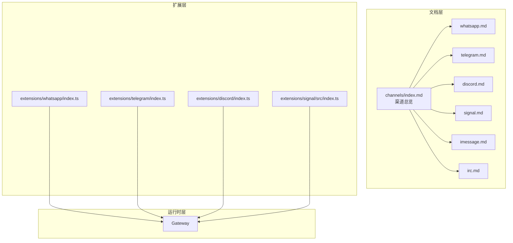
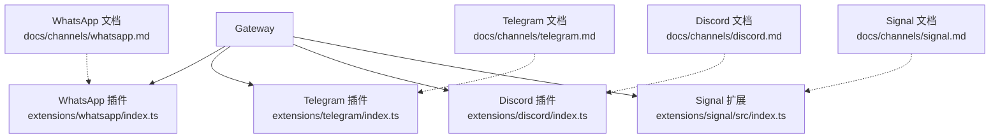
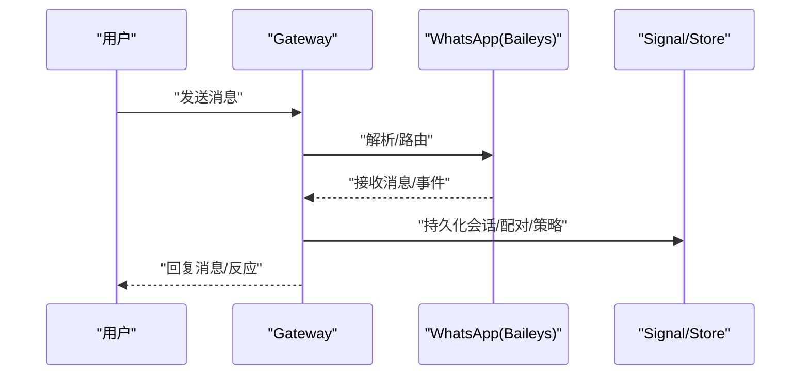
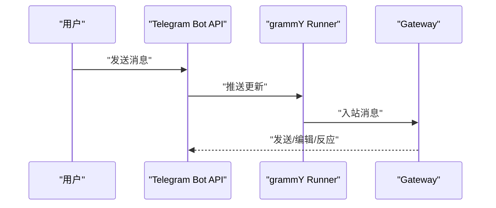
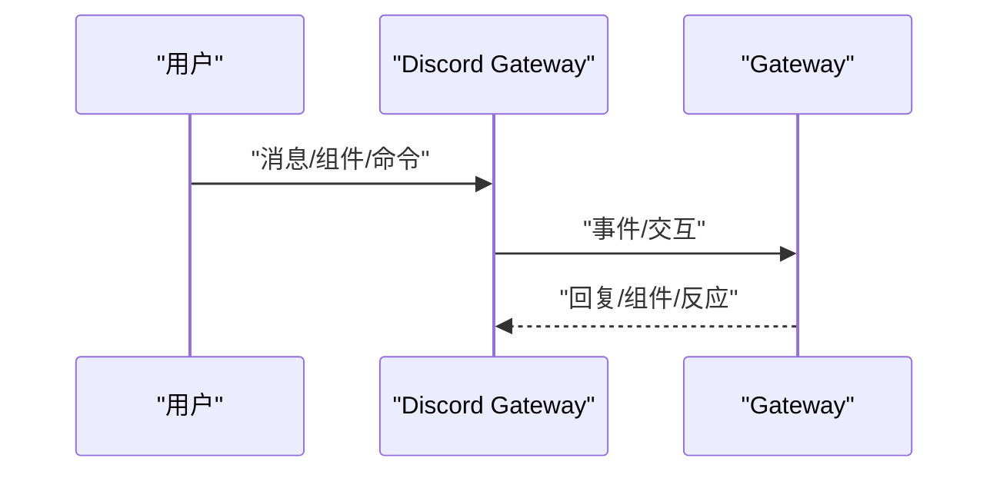
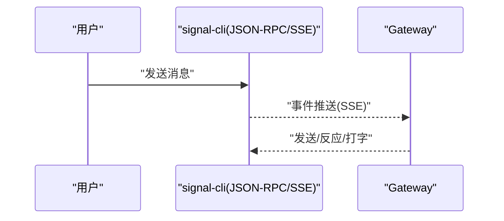
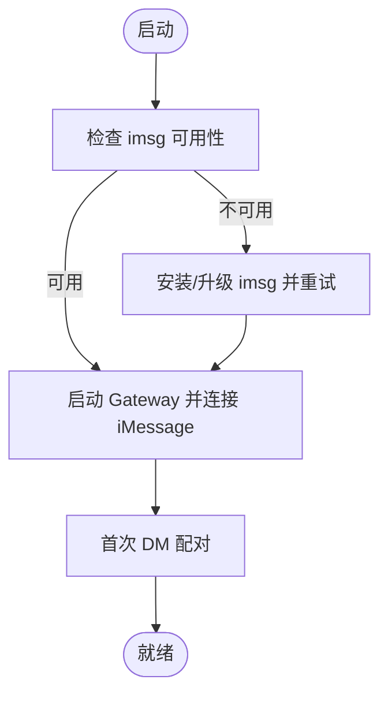
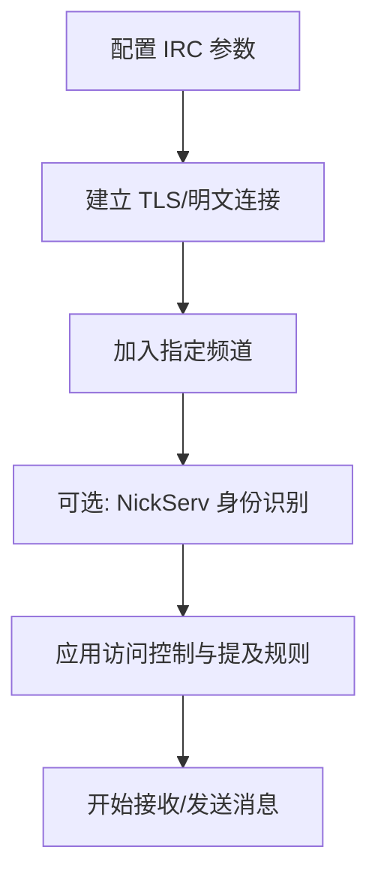
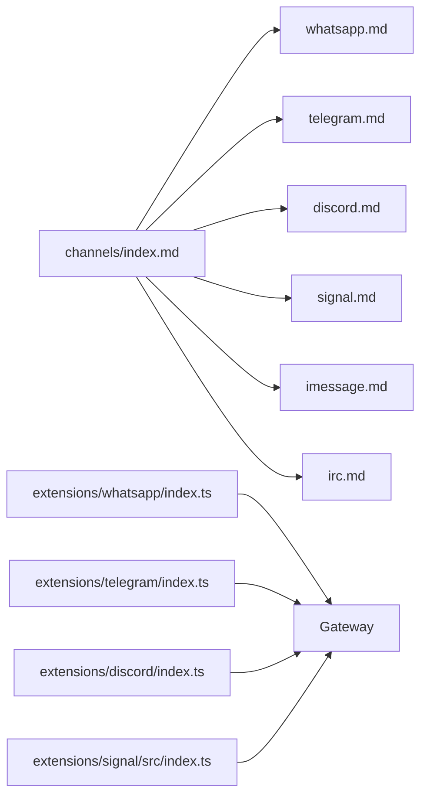

# 支持的渠道列表

<cite>
**本文引用的文件**
- [docs/channels/index.md](file://docs/channels/index.md)
- [docs/channels/whatsapp.md](file://docs/channels/whatsapp.md)
- [docs/channels/telegram.md](file://docs/channels/telegram.md)
- [docs/channels/discord.md](file://docs/channels/discord.md)
- [docs/channels/signal.md](file://docs/channels/signal.md)
- [docs/channels/imessage.md](file://docs/channels/imessage.md)
- [docs/channels/irc.md](file://docs/channels/irc.md)
- [extensions/whatsapp/index.ts](file://extensions/whatsapp/index.ts)
- [extensions/telegram/index.ts](file://extensions/telegram/index.ts)
- [extensions/discord/index.ts](file://extensions/discord/index.ts)
- [extensions/signal/src/index.ts](file://extensions/signal/src/index.ts)
</cite>

## 目录
1. [简介](#简介)
2. [项目结构](#项目结构)
3. [核心组件](#核心组件)
4. [架构总览](#架构总览)
5. [详细组件分析](#详细组件分析)
6. [依赖关系分析](#依赖关系分析)
7. [性能考量](#性能考量)
8. [故障排查指南](#故障排查指南)
9. [结论](#结论)
10. [附录](#附录)

## 简介
本文件汇总了 OpenClaw 支持的所有即时通讯渠道，覆盖 WhatsApp、Telegram、Discord、Signal、iMessage、IRC 等主流平台。针对每个渠道，我们提供简要说明、推荐程度、功能特性与配置复杂度，并解释其技术实现方式（如 Bot API、WebSocket、REST API、JSON-RPC、SSE 等），最后给出渠道选择指南与最佳实践建议。

## 项目结构
OpenClaw 的“渠道”能力由“文档 + 扩展插件 + 运行时”三部分组成：
- 文档层：在 docs/channels 下维护各渠道的官方使用说明与配置参考
- 扩展层：在 extensions/<channel> 下提供插件入口与运行时注册逻辑
- 运行时层：通过插件将具体通道接入 Gateway，统一处理消息收发、会话路由与安全策略

**图表来源**
- [docs/channels/index.md:1-48](file://docs/channels/index.md#L1-L48)
- [extensions/whatsapp/index.ts:1-18](file://extensions/whatsapp/index.ts#L1-L18)
- [extensions/telegram/index.ts:1-18](file://extensions/telegram/index.ts#L1-L18)
- [extensions/discord/index.ts:1-23](file://extensions/discord/index.ts#L1-L23)
- [extensions/signal/src/index.ts:1-6](file://extensions/signal/src/index.ts#L1-L6)

**章节来源**
- [docs/channels/index.md:1-48](file://docs/channels/index.md#L1-L48)

## 核心组件
- 渠道总览与快速对比：见 [channels/index.md:14-37](file://docs/channels/index.md#L14-L37)
- 各渠道详细说明与配置参考：
  - WhatsApp：[whatsapp.md:1-446](file://docs/channels/whatsapp.md#L1-L446)
  - Telegram：[telegram.md:1-982](file://docs/channels/telegram.md#L1-L982)
  - Discord：[discord.md:1-1224](file://docs/channels/discord.md#L1-L1224)
  - Signal：[signal.md:1-330](file://docs/channels/signal.md#L1-L330)
  - iMessage（遗留）：[imessage.md:1-368](file://docs/channels/imessage.md#L1-L368)
  - IRC：[irc.md:1-242](file://docs/channels/irc.md#L1-L242)
- 扩展插件入口：
  - WhatsApp 插件：[extensions/whatsapp/index.ts:1-18](file://extensions/whatsapp/index.ts#L1-L18)
  - Telegram 插件：[extensions/telegram/index.ts:1-18](file://extensions/telegram/index.ts#L1-L18)
  - Discord 插件：[extensions/discord/index.ts:1-23](file://extensions/discord/index.ts#L1-L23)
  - Signal 扩展导出：[extensions/signal/src/index.ts:1-6](file://extensions/signal/src/index.ts#L1-L6)

**章节来源**
- [docs/channels/index.md:14-37](file://docs/channels/index.md#L14-L37)
- [extensions/whatsapp/index.ts:1-18](file://extensions/whatsapp/index.ts#L1-L18)
- [extensions/telegram/index.ts:1-18](file://extensions/telegram/index.ts#L1-L18)
- [extensions/discord/index.ts:1-23](file://extensions/discord/index.ts#L1-L23)
- [extensions/signal/src/index.ts:1-6](file://extensions/signal/src/index.ts#L1-L6)

## 架构总览
下图展示了 Gateway 如何通过各渠道插件对接到不同平台，以及消息在系统内的流转路径。

**图表来源**
- [extensions/whatsapp/index.ts:1-18](file://extensions/whatsapp/index.ts#L1-L18)
- [extensions/telegram/index.ts:1-18](file://extensions/telegram/index.ts#L1-L18)
- [extensions/discord/index.ts:1-23](file://extensions/discord/index.ts#L1-L23)
- [extensions/signal/src/index.ts:1-6](file://extensions/signal/src/index.ts#L1-L6)
- [docs/channels/whatsapp.md:1-10](file://docs/channels/whatsapp.md#L1-L10)
- [docs/channels/telegram.md:1-10](file://docs/channels/telegram.md#L1-L10)
- [docs/channels/discord.md:1-10](file://docs/channels/discord.md#L1-L10)
- [docs/channels/signal.md:1-11](file://docs/channels/signal.md#L1-L11)

## 详细组件分析

### WhatsApp
- 简要说明
  - 基于 Baileys 的 WhatsApp Web 通道，生产可用；支持群组、DM、媒体、回执、提及触发等。
- 推荐程度
  - 高；但需要 QR 登录与本地状态存储，配置复杂度中高。
- 技术实现
  - 客户端：Baileys（WhatsApp Web）
  - 网关职责：持有会话、重连循环、DM/群隔离会话、历史注入、读回执控制
- 功能特性
  - DM/群访问控制、提及触发、消息分片、媒体上传/优化、自聊保护、ACK 反应、多账号凭据管理
- 配置复杂度
  - 中高；需 QR 登录、允许列表、可选个人号自聊模式、账户级凭据目录
- 适用场景
  - 需要强生态集成与丰富媒体能力的用户；建议专用号码以降低冲突风险

**图表来源**
- [docs/channels/whatsapp.md:126-133](file://docs/channels/whatsapp.md#L126-L133)
- [docs/channels/whatsapp.md:343-364](file://docs/channels/whatsapp.md#L343-L364)

**章节来源**
- [docs/channels/whatsapp.md:1-446](file://docs/channels/whatsapp.md#L1-L446)
- [extensions/whatsapp/index.ts:1-18](file://extensions/whatsapp/index.ts#L1-L18)

### Telegram
- 简要说明
  - 基于 Bot API（grammY）的 Telegram 通道，支持长轮询/Webhook、群组/论坛话题、内联按钮、命令菜单、预览流式输出等。
- 推荐程度
  - 高；配置最简单（只需 Bot Token），适合快速上手。
- 技术实现
  - Bot API + grammY Runner；长轮询默认；可选 Webhook
- 功能特性
  - DM/群访问控制、提及触发、流式预览、HTML 解析/回退、内联按钮、命令菜单、论坛话题、贴纸动作、反应通知、投票工具
- 配置复杂度
  - 低；仅需 Token 与 DM 策略，群组策略按需细化
- 适用场景
  - 快速部署、需要丰富 UI 交互与命令系统的团队

**图表来源**
- [docs/channels/telegram.md:248-257](file://docs/channels/telegram.md#L248-L257)
- [docs/channels/telegram.md:732-748](file://docs/channels/telegram.md#L732-L748)

**章节来源**
- [docs/channels/telegram.md:1-982](file://docs/channels/telegram.md#L1-L982)
- [extensions/telegram/index.ts:1-18](file://extensions/telegram/index.ts#L1-L18)

### Discord
- 简要说明
  - 使用官方网关，支持 DM、服务器频道、论坛/媒体频道、线程绑定、交互组件、原生命令等。
- 推荐程度
  - 高；企业/社区协作首选，功能完备。
- 技术实现
  - Discord Bot API + 网关；支持交互组件 v2、线程绑定、原生 Slash 命令
- 功能特性
  - DM/服务器/线程访问控制、提及触发、流式预览、历史上下文、线程绑定会话、反应通知、配置写入、角色路由绑定
- 配置复杂度
  - 中；需开启特权意图、权限配置、服务器/频道白名单
- 适用场景
  - 团队协作、知识库/工作流、多子代理路由

**图表来源**
- [docs/channels/discord.md:255-263](file://docs/channels/discord.md#L255-L263)
- [docs/channels/discord.md:287-298](file://docs/channels/discord.md#L287-L298)

**章节来源**
- [docs/channels/discord.md:1-1224](file://docs/channels/discord.md#L1-L1224)
- [extensions/discord/index.ts:1-23](file://extensions/discord/index.ts#L1-L23)

### Signal
- 简要说明
  - 通过 signal-cli 的 JSON-RPC + SSE 外部集成；推荐独立号码，避免自聊环路。
- 推荐程度
  - 中；隐私优先，但生态与工具链相对受限。
- 技术实现
  - JSON-RPC over HTTP + SSE；支持外设守护进程模式
- 功能特性
  - DM/群访问控制、提及触发（基于正则）、流式预览、媒体限制、反应动作、打字指示、读回执转发
- 配置复杂度
  - 中；需 signal-cli 安装、QR 或短信注册、账户/守护进程配置
- 适用场景
  - 注重隐私与端到端安全的用户或组织

**图表来源**
- [docs/channels/signal.md:11-11](file://docs/channels/signal.md#L11-L11)
- [extensions/signal/src/index.ts:1-6](file://extensions/signal/src/index.ts#L1-L6)

**章节来源**
- [docs/channels/signal.md:1-330](file://docs/channels/signal.md#L1-L330)
- [extensions/signal/src/index.ts:1-6](file://extensions/signal/src/index.ts#L1-L6)

### iMessage（遗留）
- 简要说明
  - 通过 imsg JSON-RPC over stdio 的遗留方案；新部署建议使用 BlueBubbles。
- 推荐程度
  - 低；仅限 macOS 本地或受控远程环境
- 技术实现
  - JSON-RPC over stdio；支持本地/SSH 远程执行、附件抓取
- 功能特性
  - DM/群访问控制、提及触发（基于正则）、附件/媒体、多账号配置
- 配置复杂度
  - 中；需权限配置、数据库路径、可选远程主机与附件根目录
- 适用场景
  - 仅限 macOS 生态且无法迁移到 BlueBubbles 的历史环境

**图表来源**
- [docs/channels/imessage.md:17-17](file://docs/channels/imessage.md#L17-L17)
- [docs/channels/imessage.md:304-360](file://docs/channels/imessage.md#L304-L360)

**章节来源**
- [docs/channels/imessage.md:1-368](file://docs/channels/imessage.md#L1-L368)

### IRC
- 简要说明
  - 经典 IRC 通道，支持公会/私聊、TLS、NickServ、提及触发与工具授权。
- 推荐程度
  - 中；适合开源社区与技术讨论
- 技术实现
  - IRC 协议；TLS 可选；支持 NickServ 身份识别
- 功能特性
  - DM/群访问控制、提及触发、工具按发送者差异化授权、环境变量配置
- 配置复杂度
  - 低；基础连接参数即可运行，进阶策略按需启用
- 适用场景
  - 开源项目、技术社区、无需复杂 UI 的纯文本协作

**图表来源**
- [docs/channels/irc.md:13-44](file://docs/channels/irc.md#L13-L44)
- [docs/channels/irc.md:187-242](file://docs/channels/irc.md#L187-L242)

**章节来源**
- [docs/channels/irc.md:1-242](file://docs/channels/irc.md#L1-L242)

## 依赖关系分析
- 插件注册与运行时绑定
  - 各渠道插件在注册时向 API 提供通道实现与运行时设置，Gateway 在启动后加载对应通道
- 文档与插件的耦合
  - 文档描述渠道能力与配置，插件实现具体协议与行为；二者共同决定渠道可用性与体验

**图表来源**
- [docs/channels/index.md:1-48](file://docs/channels/index.md#L1-L48)
- [extensions/whatsapp/index.ts:1-18](file://extensions/whatsapp/index.ts#L1-L18)
- [extensions/telegram/index.ts:1-18](file://extensions/telegram/index.ts#L1-L18)
- [extensions/discord/index.ts:1-23](file://extensions/discord/index.ts#L1-L23)
- [extensions/signal/src/index.ts:1-6](file://extensions/signal/src/index.ts#L1-L6)

**章节来源**
- [extensions/whatsapp/index.ts:1-18](file://extensions/whatsapp/index.ts#L1-L18)
- [extensions/telegram/index.ts:1-18](file://extensions/telegram/index.ts#L1-L18)
- [extensions/discord/index.ts:1-23](file://extensions/discord/index.ts#L1-L23)
- [extensions/signal/src/index.ts:1-6](file://extensions/signal/src/index.ts#L1-L6)

## 性能考量
- 传输与并发
  - Telegram/WhatsApp/Discord：长轮询/网关驱动，具备并发与流式能力
  - Signal：JSON-RPC + SSE，实时事件推送
  - iMessage：本地 stdio JSON-RPC，延迟低但生态受限
  - IRC：标准协议，资源占用低
- 媒体与分片
  - 各渠道均支持媒体与分片，需结合带宽与平台限额进行调优
- 会话隔离
  - 群组/论坛/线程/DM 分离会话，避免上下文污染与资源竞争

[本节为通用指导，不直接分析具体文件]

## 故障排查指南
- 通用步骤
  - 检查状态与日志：openclaw status/gateway status/logs --follow
  - 运行诊断：openclaw doctor
  - 渠道探测：openclaw channels status --probe
- 各渠道常见问题
  - WhatsApp：未链接/断连/无监听；检查 QR 登录、凭据目录、Bun 兼容性
  - Telegram：隐私模式/权限；长轮询/Webhook；命令菜单溢出
  - Discord：特权意图未启用；服务器/频道白名单；线程绑定
  - Signal：daemon 可达性；DM 配对；注册/验证码流程
  - iMessage：imsg 版本/权限；远程附件 SCP；macOS 权限提示
  - IRC：提及缺失；NickServ 登录；TLS/证书；工具授权

**章节来源**
- [docs/channels/whatsapp.md:374-424](file://docs/channels/whatsapp.md#L374-L424)
- [docs/channels/telegram.md:797-800](file://docs/channels/telegram.md#L797-L800)
- [docs/channels/discord.md:169-172](file://docs/channels/discord.md#L169-L172)
- [docs/channels/signal.md:253-287](file://docs/channels/signal.md#L253-L287)
- [docs/channels/imessage.md:304-360](file://docs/channels/imessage.md#L304-L360)
- [docs/channels/irc.md:237-242](file://docs/channels/irc.md#L237-L242)

## 结论
- 快速上手：Telegram 最易；WhatsApp 次之；Discord 适合团队协作
- 隐私优先：Signal 更合适
- 生态与工具：Discord/Telegram 更丰富；IRC 适合纯文本场景
- 新部署优先：iMessage 建议使用 BlueBubbles；遗留 imsg 仅限历史环境

[本节为总结性内容，不直接分析具体文件]

## 附录

### 渠道选择指南与最佳实践
- 选择建议
  - 小型个人/小团队：Telegram（最简配置）
  - 企业/社区：Discord（功能最全）
  - 全球广泛：WhatsApp（需 QR 登录）
  - 隐私优先：Signal（独立号码）
  - 历史 macOS：iMessage（遗留 imsg，建议迁移 BlueBubbles）
  - 开源社区：IRC（轻量、稳定）
- 最佳实践
  - 明确访问策略：DM/群/提及/工具授权
  - 会话隔离：群组/论坛/线程独立会话
  - 媒体与限额：合理设置分片与大小上限
  - 安全加固：TLS/意图/权限/配对/白名单
  - 可观测性：日志/诊断/探测/状态

[本节为通用指导，不直接分析具体文件]