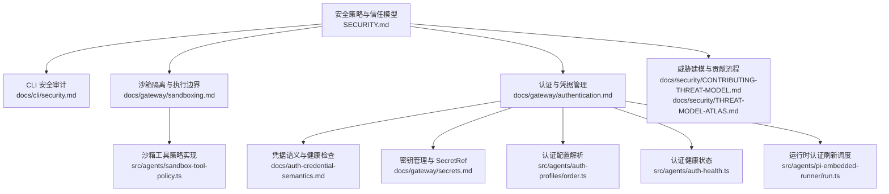
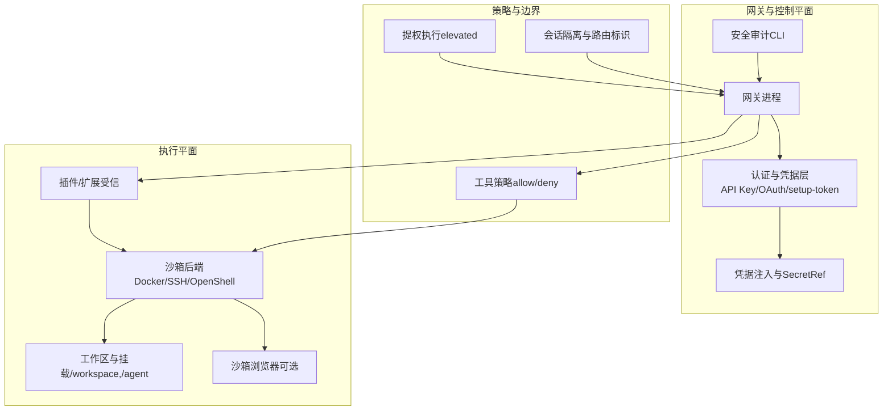
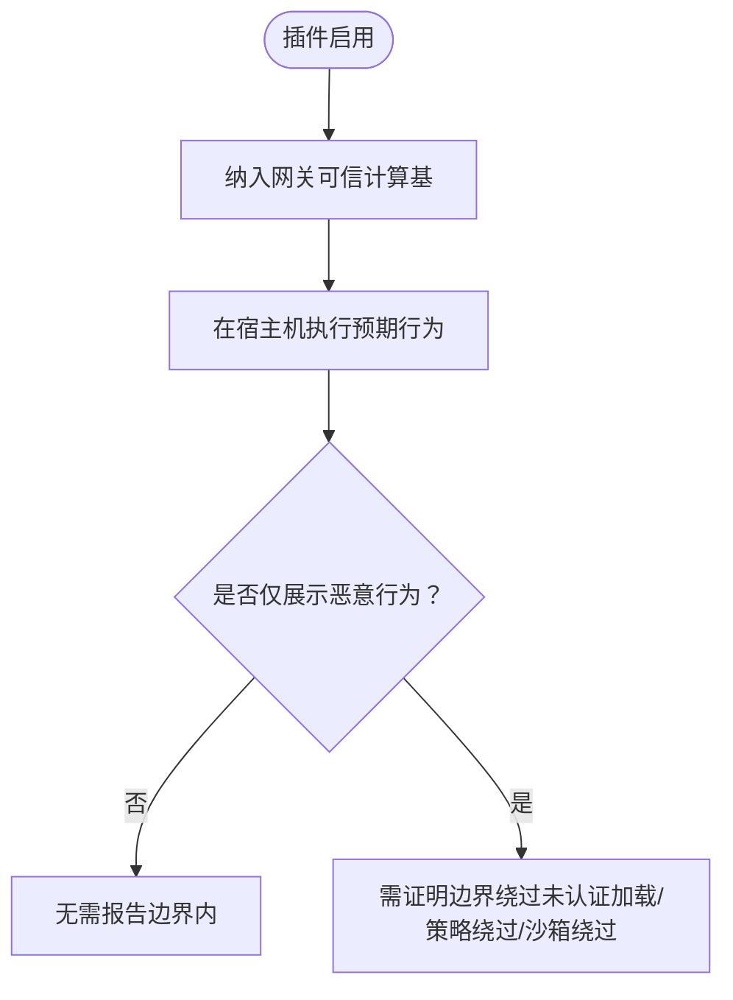
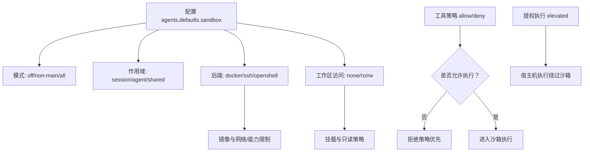
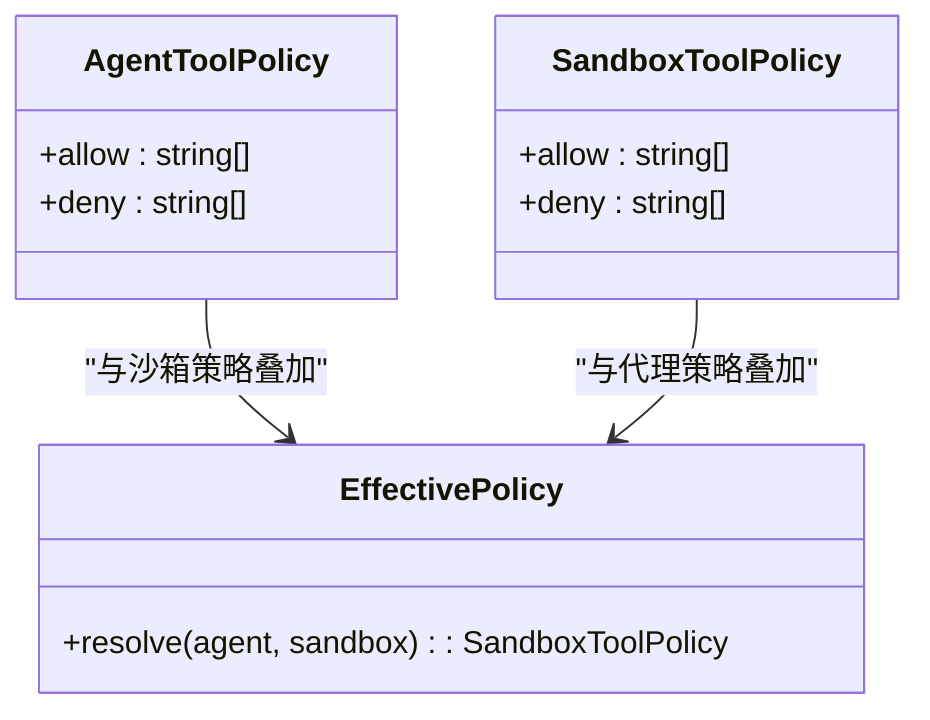
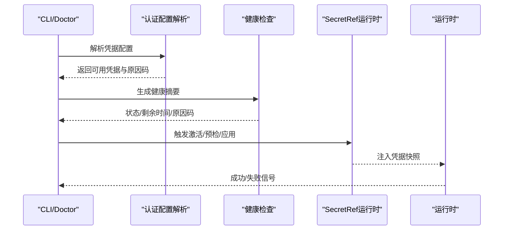
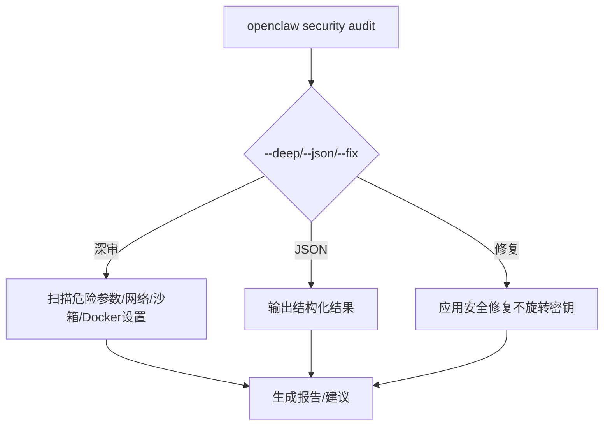
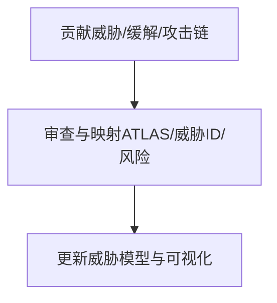
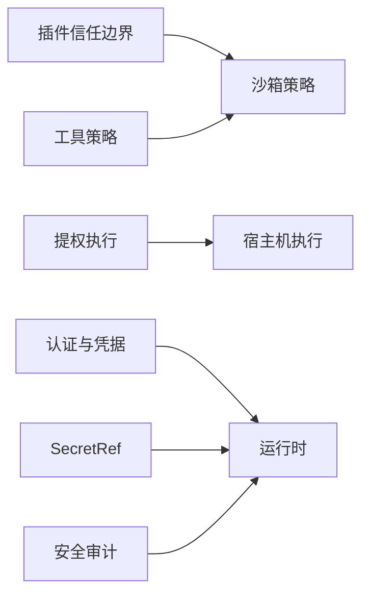

# 插件安全与权限

<cite>
**本文引用的文件**
- [SECURITY.md](file://SECURITY.md)
- [docs/cli/security.md](file://docs/cli/security.md)
- [docs/gateway/sandboxing.md](file://docs/gateway/sandboxing.md)
- [docs/gateway/authentication.md](file://docs/gateway/authentication.md)
- [docs/gateway/secrets.md](file://docs/gateway/secrets.md)
- [docs/auth-credential-semantics.md](file://docs/auth-credential-semantics.md)
- [docs/security/CONTRIBUTING-THREAT-MODEL.md](file://docs/security/CONTRIBUTING-THREAT-MODEL.md)
- [docs/security/THREAT-MODEL-ATLAS.md](file://docs/security/THREAT-MODEL-ATLAS.md)
- [src/agents/sandbox-tool-policy.ts](file://src/agents/sandbox-tool-policy.ts)
- [src/agents/auth-profiles/order.ts](file://src/agents/auth-profiles/order.ts)
- [src/agents/auth-health.ts](file://src/agents/auth-health.ts)
- [src/agents/pi-embedded-runner/run.ts](file://src/agents/pi-embedded-runner/run.ts)
</cite>

## 目录
1. [引言](#引言)
2. [项目结构](#项目结构)
3. [核心组件](#核心组件)
4. [架构总览](#架构总览)
5. [详细组件分析](#详细组件分析)
6. [依赖关系分析](#依赖关系分析)
7. [性能考量](#性能考量)
8. [故障排查指南](#故障排查指南)
9. [结论](#结论)
10. [附录](#附录)

## 引言
本文件面向插件安全与权限管理，系统阐述 OpenClaw 的插件信任边界、沙箱机制、权限模型与访问控制策略，以及认证授权、密钥管理与凭据存储、安全审计与漏洞检测、风险评估与安全更新机制。内容基于仓库中的官方文档与核心实现模块，帮助读者建立从“概念到落地”的完整安全认知。

## 项目结构
围绕“插件安全与权限”，本仓库的关键位置包括：
- 官方安全策略与信任模型：SECURITY.md
- CLI 安全审计工具：docs/cli/security.md
- 沙箱隔离与执行边界：docs/gateway/sandboxing.md
- 认证与凭据管理：docs/gateway/authentication.md、docs/auth-credential-semantics.md、docs/gateway/secrets.md
- 威胁建模与贡献流程：docs/security/CONTRIBUTING-THREAT-MODEL.md、docs/security/THREAT-MODEL-ATLAS.md
- 核心实现模块：src/agents/sandbox-tool-policy.ts、src/agents/auth-profiles/order.ts、src/agents/auth-health.ts、src/agents/pi-embedded-runner/run.ts

**图表来源**
- [SECURITY.md:1-293](file://SECURITY.md#L1-L293)
- [docs/cli/security.md:1-80](file://docs/cli/security.md#L1-L80)
- [docs/gateway/sandboxing.md:1-447](file://docs/gateway/sandboxing.md#L1-L447)
- [docs/gateway/authentication.md:1-180](file://docs/gateway/authentication.md#L1-L180)
- [docs/auth-credential-semantics.md:1-46](file://docs/auth-credential-semantics.md#L1-L46)
- [docs/gateway/secrets.md:1-487](file://docs/gateway/secrets.md#L1-L487)
- [docs/security/CONTRIBUTING-THREAT-MODEL.md:1-91](file://docs/security/CONTRIBUTING-THREAT-MODEL.md#L1-L91)
- [docs/security/THREAT-MODEL-ATLAS.md:168-604](file://docs/security/THREAT-MODEL-ATLAS.md#L168-L604)
- [src/agents/sandbox-tool-policy.ts:1-37](file://src/agents/sandbox-tool-policy.ts#L1-L37)
- [src/agents/auth-profiles/order.ts:25-65](file://src/agents/auth-profiles/order.ts#L25-L65)
- [src/agents/auth-health.ts:98-197](file://src/agents/auth-health.ts#L98-L197)
- [src/agents/pi-embedded-runner/run.ts:541-575](file://src/agents/pi-embedded-runner/run.ts#L541-L575)

**章节来源**
- [SECURITY.md:1-293](file://SECURITY.md#L1-L293)
- [docs/cli/security.md:1-80](file://docs/cli/security.md#L1-L80)
- [docs/gateway/sandboxing.md:1-447](file://docs/gateway/sandboxing.md#L1-L447)
- [docs/gateway/authentication.md:1-180](file://docs/gateway/authentication.md#L1-L180)
- [docs/auth-credential-semantics.md:1-46](file://docs/auth-credential-semantics.md#L1-L46)
- [docs/gateway/secrets.md:1-487](file://docs/gateway/secrets.md#L1-L487)
- [docs/security/CONTRIBUTING-THREAT-MODEL.md:1-91](file://docs/security/CONTRIBUTING-THREAT-MODEL.md#L1-L91)
- [docs/security/THREAT-MODEL-ATLAS.md:168-604](file://docs/security/THREAT-MODEL-ATLAS.md#L168-L604)

## 核心组件
- 插件信任边界与加载策略：插件作为网关可信计算基的一部分，安装/启用即授予与本地代码同等的信任级别，其行为（如读取环境变量/文件、执行主机命令）在该边界内被视为预期。
- 沙箱机制与执行边界：工具执行可在沙箱后端运行，降低文件系统与进程访问风险；默认不启用时，工具在宿主机运行；沙箱模式、作用域、后端类型、工作区访问与自定义挂载共同构成安全边界。
- 权限模型与访问控制：工具策略（allow/deny）、提权执行（elevated）、会话隔离与路由标识符（sessionKey）等共同决定访问范围；严格工具策略与沙箱配合可显著降低越权风险。
- 认证授权与凭据管理：支持 API Key、OAuth 与订阅型 setup-token；凭据语义与健康检查统一评估有效性；SecretRef 提供只读、单向擦除的安全凭据注入能力。
- 安全审计与漏洞检测：CLI 安全审计工具可进行深度扫描、JSON 输出与自动修复建议；结合威胁模型文档进行风险评估与缓解。
- 安全更新与应急响应：安全策略要求报告漏洞、接受“快速分流”门槛、处理重复报告；运营层面提供 Docker 安全加固、Node 版本要求与扫描工具。

**章节来源**
- [SECURITY.md:108-114](file://SECURITY.md#L108-L114)
- [docs/gateway/sandboxing.md:19-37](file://docs/gateway/sandboxing.md#L19-L37)
- [docs/gateway/sandboxing.md:41-56](file://docs/gateway/sandboxing.md#L41-L56)
- [docs/gateway/sandboxing.md:238-257](file://docs/gateway/sandboxing.md#L238-L257)
- [docs/gateway/sandboxing.md:405-413](file://docs/gateway/sandboxing.md#L405-L413)
- [docs/gateway/authentication.md:21-57](file://docs/gateway/authentication.md#L21-L57)
- [docs/auth-credential-semantics.md:12-37](file://docs/auth-credential-semantics.md#L12-L37)
- [docs/gateway/secrets.md:16-27](file://docs/gateway/secrets.md#L16-L27)
- [docs/cli/security.md:17-80](file://docs/cli/security.md#L17-L80)
- [SECURITY.md:82-86](file://SECURITY.md#L82-L86)

## 架构总览
下图展示“插件—沙箱—工具策略—认证凭据—安全审计”的整体交互关系与边界：

**图表来源**
- [docs/gateway/sandboxing.md:19-37](file://docs/gateway/sandboxing.md#L19-L37)
- [docs/gateway/sandboxing.md:238-257](file://docs/gateway/sandboxing.md#L238-L257)
- [docs/gateway/authentication.md:21-57](file://docs/gateway/authentication.md#L21-L57)
- [docs/gateway/secrets.md:16-27](file://docs/gateway/secrets.md#L16-L27)
- [docs/cli/security.md:17-80](file://docs/cli/security.md#L17-L80)
- [SECURITY.md:108-114](file://SECURITY.md#L108-L114)

## 详细组件分析

### 插件信任边界与加载策略
- 插件被视为网关可信计算基的一部分，安装/启用即获得与本地代码相同的信任级别；其在宿主机上的行为（读取环境变量/文件、执行命令）属于该信任边界内的预期行为。
- 安全报告必须证明存在边界绕过（如未认证插件加载、白名单/策略绕过、沙箱/路径安全绕过），而不仅仅是来自已受信插件的恶意行为。

**图表来源**
- [SECURITY.md:108-114](file://SECURITY.md#L108-L114)

**章节来源**
- [SECURITY.md:108-114](file://SECURITY.md#L108-L114)

### 沙箱机制与执行边界
- 沙箱可选，默认关闭时工具在宿主机运行；启用后，工具执行与可选的沙箱浏览器在隔离环境中运行，降低文件系统与进程访问风险。
- 模式（off/non-main/all）、作用域（session/agent/shared）、后端（docker/ssh/openshell）、工作区访问（none/ro/rw）与自定义挂载共同构成边界；危险挂载（如 /etc、/proc、/sys、docker.sock）被阻断。
- 提权执行（tools.elevated）绕过沙箱在宿主机运行；工具策略先于沙箱规则生效，deny 优先。

**图表来源**
- [docs/gateway/sandboxing.md:41-56](file://docs/gateway/sandboxing.md#L41-L56)
- [docs/gateway/sandboxing.md:238-257](file://docs/gateway/sandboxing.md#L238-L257)
- [docs/gateway/sandboxing.md:296-302](file://docs/gateway/sandboxing.md#L296-L302)
- [docs/gateway/sandboxing.md:405-413](file://docs/gateway/sandboxing.md#L405-L413)

**章节来源**
- [docs/gateway/sandboxing.md:19-37](file://docs/gateway/sandboxing.md#L19-L37)
- [docs/gateway/sandboxing.md:41-56](file://docs/gateway/sandboxing.md#L41-L56)
- [docs/gateway/sandboxing.md:238-257](file://docs/gateway/sandboxing.md#L238-L257)
- [docs/gateway/sandboxing.md:296-302](file://docs/gateway/sandboxing.md#L296-L302)
- [docs/gateway/sandboxing.md:405-413](file://docs/gateway/sandboxing.md#L405-L413)

### 权限模型与访问控制
- 工具策略（allow/deny）与沙箱策略叠加，最终以更严格的为准；elevated 为显式逃逸通道，仅对授权发送者生效并按会话持久化。
- 会话标识符（sessionKey）为路由控制，而非用户级授权边界；多用户共享同一网关实例不在推荐模型内。
- 代理工具策略与沙箱工具策略相互作用，遵循“最严格优先”。

**图表来源**
- [src/agents/sandbox-tool-policy.ts:21-37](file://src/agents/sandbox-tool-policy.ts#L21-L37)

**章节来源**
- [src/agents/sandbox-tool-policy.ts:1-37](file://src/agents/sandbox-tool-policy.ts#L1-L37)
- [docs/gateway/sandboxing.md:405-413](file://docs/gateway/sandboxing.md#L405-L413)

### 认证授权与凭据存储
- 支持 API Key、OAuth 与订阅型 setup-token；长期运行建议使用 API Key；Anthropic setup-token 为兼容性支持，需自行评估政策风险。
- 凭据语义与健康检查统一评估有效期、解析失败与不可用原因；提供 per-session 与 per-agent 的凭据选择与顺序控制。
- SecretRef 提供只读、单向擦除的安全凭据注入，支持 env/file/exec 三类提供者；启动失败快返、热重载原子交换、最后已知良好状态回退。

**图表来源**
- [docs/gateway/authentication.md:21-57](file://docs/gateway/authentication.md#L21-L57)
- [docs/auth-credential-semantics.md:12-37](file://docs/auth-credential-semantics.md#L12-L37)
- [src/agents/auth-profiles/order.ts:30-65](file://src/agents/auth-profiles/order.ts#L30-L65)
- [src/agents/auth-health.ts:98-197](file://src/agents/auth-health.ts#L98-L197)
- [docs/gateway/secrets.md:16-27](file://docs/gateway/secrets.md#L16-L27)

**章节来源**
- [docs/gateway/authentication.md:21-57](file://docs/gateway/authentication.md#L21-L57)
- [docs/auth-credential-semantics.md:12-37](file://docs/auth-credential-semantics.md#L12-L37)
- [src/agents/auth-profiles/order.ts:30-65](file://src/agents/auth-profiles/order.ts#L30-L65)
- [src/agents/auth-health.ts:98-197](file://src/agents/auth-health.ts#L98-L197)
- [docs/gateway/secrets.md:16-27](file://docs/gateway/secrets.md#L16-L27)

### 安全审计与漏洞检测
- CLI 安全审计支持浅/深扫描、JSON 输出、自动修复（chmod、收紧默认值、敏感文件权限提升）；可针对 webhook、沙箱、工具策略、通道白名单等场景发出告警。
- 审计输出可用于 CI/Policy 检查；--fix 不会旋转令牌、禁用工具或更改网关暴露策略。

**图表来源**
- [docs/cli/security.md:17-80](file://docs/cli/security.md#L17-L80)

**章节来源**
- [docs/cli/security.md:17-80](file://docs/cli/security.md#L17-L80)

### 威胁建模与风险评估
- 威胁建模采用 MITRE ATLAS 框架，涵盖侦察、初始访问、执行、持久化、规避、发现、窃取、影响等类别；为每项威胁分配威胁 ID 并评估风险等级。
- 贡献流程鼓励新增威胁、建议缓解措施、提出攻击链；维护者负责映射与风险评估。

**图表来源**
- [docs/security/CONTRIBUTING-THREAT-MODEL.md:1-91](file://docs/security/CONTRIBUTING-THREAT-MODEL.md#L1-L91)
- [docs/security/THREAT-MODEL-ATLAS.md:168-604](file://docs/security/THREAT-MODEL-ATLAS.md#L168-L604)

**章节来源**
- [docs/security/CONTRIBUTING-THREAT-MODEL.md:1-91](file://docs/security/CONTRIBUTING-THREAT-MODEL.md#L1-L91)
- [docs/security/THREAT-MODEL-ATLAS.md:168-604](file://docs/security/THREAT-MODEL-ATLAS.md#L168-L604)

### 安全更新机制与应急响应
- 报告漏洞需满足“快速分流”门槛（含脆弱路径、版本信息、可复现 PoC、影响与范围说明等）；重复报告按质量与最早性处理。
- 运维层面提供 Docker 安全加固（只读文件系统、丢弃能力）、Node 版本要求（含特定 CVE）、detect-secrets 秘密扫描工具与基线。

**章节来源**
- [SECURITY.md:33-47](file://SECURITY.md#L33-L47)
- [SECURITY.md:72-77](file://SECURITY.md#L72-L77)
- [SECURITY.md:266-293](file://SECURITY.md#L266-L293)

## 依赖关系分析
- 插件信任边界与沙箱策略耦合：插件在宿主机上拥有与本地代码同等信任，沙箱可降低其潜在风险；elevated 则绕过沙箱。
- 认证与凭据层对运行时与审计路径的影响：SecretRef 运行时快照、健康检查与 CLI 审计均依赖该层；凭据解析失败会影响启动与发送路径。
- 工具策略与沙箱策略的叠加：代理工具策略与沙箱工具策略共同决定最终可执行集合，deny 优先。

**图表来源**
- [SECURITY.md:108-114](file://SECURITY.md#L108-L114)
- [docs/gateway/sandboxing.md:405-413](file://docs/gateway/sandboxing.md#L405-L413)
- [docs/gateway/secrets.md:16-27](file://docs/gateway/secrets.md#L16-L27)
- [docs/cli/security.md:17-80](file://docs/cli/security.md#L17-L80)

**章节来源**
- [SECURITY.md:108-114](file://SECURITY.md#L108-L114)
- [docs/gateway/sandboxing.md:405-413](file://docs/gateway/sandboxing.md#L405-L413)
- [docs/gateway/secrets.md:16-27](file://docs/gateway/secrets.md#L16-L27)
- [docs/cli/security.md:17-80](file://docs/cli/security.md#L17-L80)

## 性能考量
- 沙箱镜像与网络：默认镜像不含 Node，若技能需要运行时，建议构建通用镜像或通过 setupCommand 安装；默认容器无网络，需显式配置。
- 绑定挂载与只读策略：危险挂载（如 /etc、/proc、/sys、docker.sock）被阻断；敏感挂载应设为只读；workspaceAccess: ro 可降低写放大风险。
- 浏览器沙箱：默认保守启动参数与网络限制，如需扩展需自定义镜像或入口点；CDP 入口可通过 CIDR 白名单限制。

**章节来源**
- [docs/gateway/sandboxing.md:304-384](file://docs/gateway/sandboxing.md#L304-L384)
- [docs/gateway/sandboxing.md:296-302](file://docs/gateway/sandboxing.md#L296-L302)
- [docs/gateway/sandboxing.md:329-371](file://docs/gateway/sandboxing.md#L329-L371)

## 故障排查指南
- 安全审计告警定位：根据 CLI 审计输出识别危险参数（如 gateway.auth.mode="none"、sandbox Docker 网络模式、通道白名单不稳定等），结合 JSON 输出筛选严重问题。
- 凭据健康检查：使用 models status 与 doctor 查看凭据状态、到期时间与原因码；对过期/缺失/不可解析的凭据进行修复或轮换。
- SecretRef 激活失败：确认提供者配置、路径权限与命令可执行性；必要时使用 secrets.reload 触发激活；关注“SECRETS_RELOADER_DEGRADED/RECOVERED”事件。
- 运行时认证刷新：检查 refreshable 认证的到期时间与调度逻辑，确保在过期前完成刷新；失败时重试与最小延迟控制保障稳定性。

**章节来源**
- [docs/cli/security.md:17-80](file://docs/cli/security.md#L17-L80)
- [src/agents/auth-health.ts:98-197](file://src/agents/auth-health.ts#L98-L197)
- [docs/gateway/secrets.md:360-375](file://docs/gateway/secrets.md#L360-L375)
- [src/agents/pi-embedded-runner/run.ts:541-575](file://src/agents/pi-embedded-runner/run.ts#L541-L575)

## 结论
OpenClaw 的插件安全与权限体系以“个人助理”信任模型为核心，强调宿主机信任边界与工具策略、沙箱隔离、凭据注入与健康检查的协同。通过 CLI 安全审计、威胁建模与应急响应流程，形成从“设计—实现—运维—响应”的闭环安全实践。建议在生产环境中：
- 启用沙箱并严格限制工具策略；
- 使用 SecretRef 注入凭据，避免明文存储；
- 定期运行安全审计与凭据健康检查；
- 建立威胁建模与缓解跟踪机制，持续改进安全姿态。

## 附录
- 官方安全策略与信任模型：[SECURITY.md](file://SECURITY.md)
- CLI 安全审计参考：[docs/cli/security.md](file://docs/cli/security.md)
- 沙箱隔离与执行边界：[docs/gateway/sandboxing.md](file://docs/gateway/sandboxing.md)
- 认证与凭据管理：[docs/gateway/authentication.md](file://docs/gateway/authentication.md)、[docs/auth-credential-semantics.md](file://docs/auth-credential-semantics.md)、[docs/gateway/secrets.md](file://docs/gateway/secrets.md)
- 威胁建模与贡献流程：[docs/security/CONTRIBUTING-THREAT-MODEL.md](file://docs/security/CONTRIBUTING-THREAT-MODEL.md)、[docs/security/THREAT-MODEL-ATLAS.md](file://docs/security/THREAT-MODEL-ATLAS.md)
- 核心实现模块：[src/agents/sandbox-tool-policy.ts](file://src/agents/sandbox-tool-policy.ts)、[src/agents/auth-profiles/order.ts](file://src/agents/auth-profiles/order.ts)、[src/agents/auth-health.ts](file://src/agents/auth-health.ts)、[src/agents/pi-embedded-runner/run.ts](file://src/agents/pi-embedded-runner/run.ts)