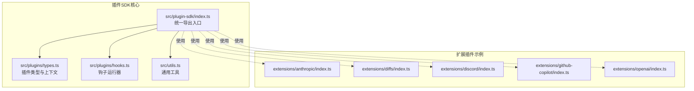
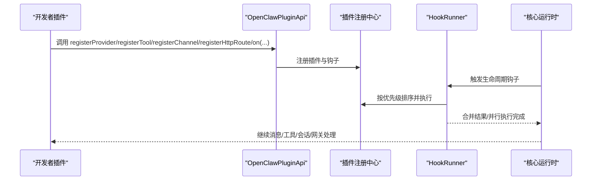
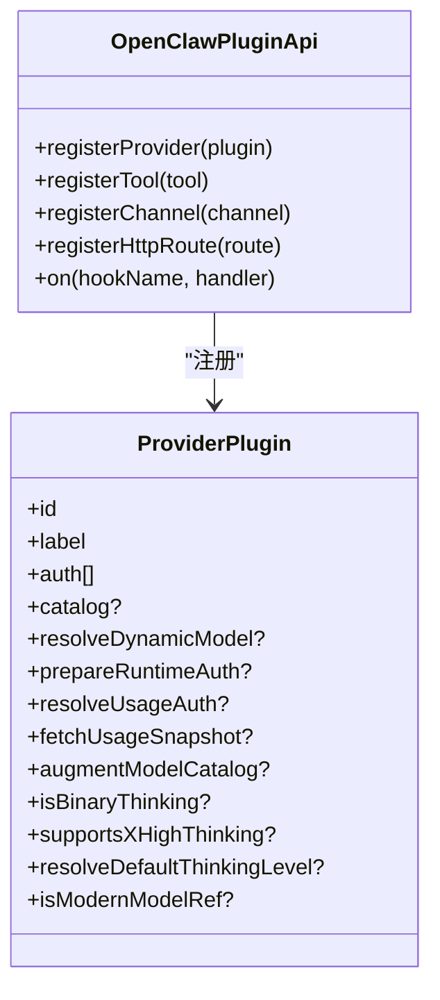
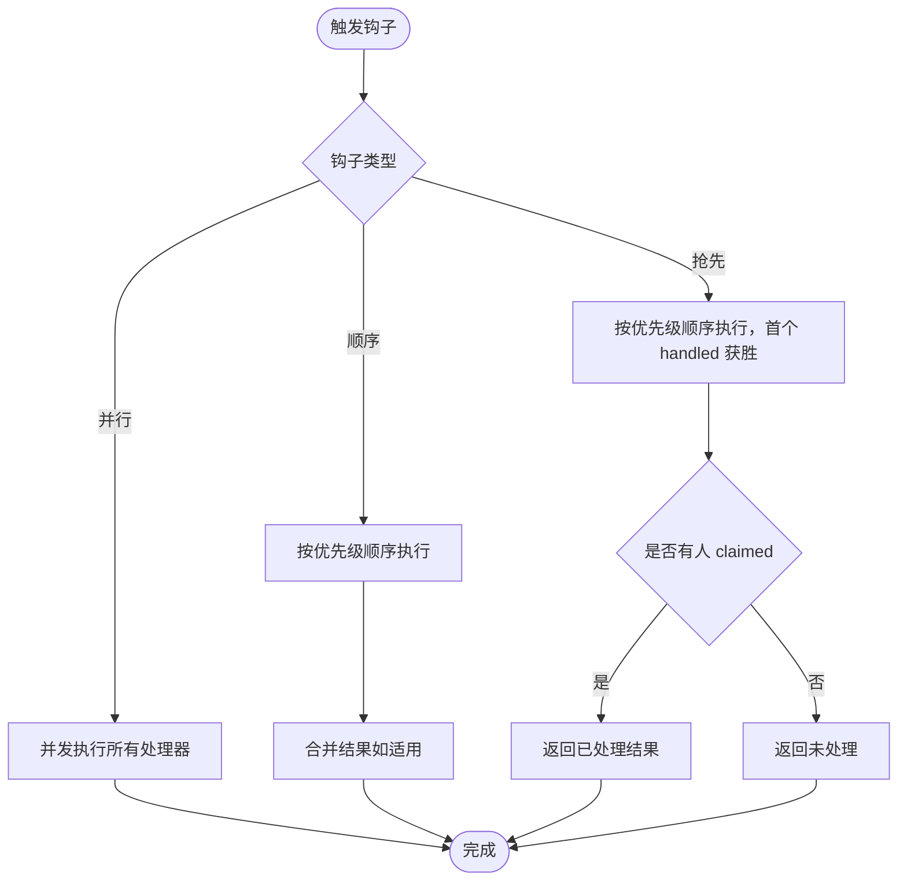
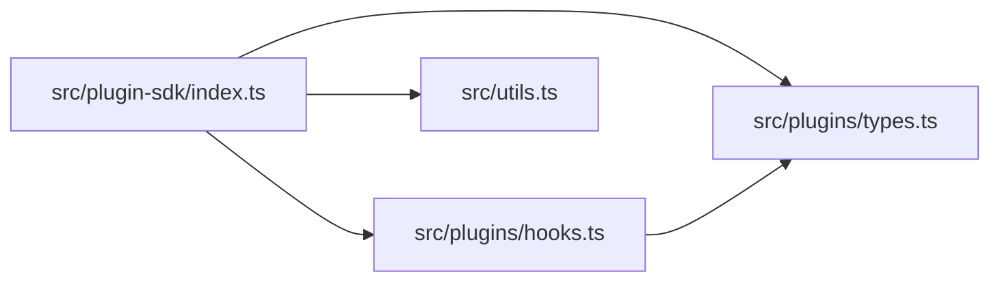

# 插件SDK开发

<cite>
**本文档引用的文件**
- [index.ts](file://src/plugin-sdk/index.ts)
- [types.ts](file://src/plugins/types.ts)
- [hooks.ts](file://src/plugins/hooks.ts)
- [utils.ts](file://src/utils.ts)
- [anthropic/index.ts](file://extensions/anthropic/index.ts)
- [diffs/index.ts](file://extensions/diffs/index.ts)
- [discord/index.ts](file://extensions/discord/index.ts)
- [github-copilot/index.ts](file://extensions/github-copilot/index.ts)
- [openai/index.ts](file://extensions/openai/index.ts)
</cite>

## 目录
1. [简介](#简介)
2. [项目结构](#项目结构)
3. [核心组件](#核心组件)
4. [架构总览](#架构总览)
5. [详细组件分析](#详细组件分析)
6. [依赖关系分析](#依赖关系分析)
7. [性能考量](#性能考量)
8. [故障排查指南](#故障排查指南)
9. [结论](#结论)
10. [附录](#附录)

## 简介
本文件为 OpenClaw 插件SDK开发文档，面向希望基于 OpenClaw 构建插件（工具、通道、提供者、网关方法等）的开发者。内容覆盖插件生命周期钩子、事件处理机制、工具函数与实用模块、开发环境搭建、标准模式与最佳实践、常见陷阱、测试与调试技巧，并通过仓库中的真实插件示例展示不同类型的实现方式。

## 项目结构
OpenClaw 的插件SDK位于 src/plugin-sdk 目录，核心导出通过 src/plugin-sdk/index.ts 汇总；插件类型定义在 src/plugins/types.ts；钩子运行器在 src/plugins/hooks.ts；通用工具在 src/utils.ts。扩展插件示例分布在 extensions/* 下，如 Anthropic、Diffs、Discord、GitHub Copilot、OpenAI 等。

**图表来源**
- [index.ts:1-872](file://src/plugin-sdk/index.ts#L1-L872)
- [types.ts:1-1775](file://src/plugins/types.ts#L1-L1775)
- [hooks.ts:1-963](file://src/plugins/hooks.ts#L1-L963)
- [utils.ts:1-376](file://src/utils.ts#L1-L376)
- [anthropic/index.ts:1-319](file://extensions/anthropic/index.ts#L1-L319)
- [diffs/index.ts:1-45](file://extensions/diffs/index.ts#L1-L45)
- [discord/index.ts:1-23](file://extensions/discord/index.ts#L1-L23)
- [github-copilot/index.ts:1-142](file://extensions/github-copilot/index.ts#L1-L142)
- [openai/index.ts:1-17](file://extensions/openai/index.ts#L1-L17)

**章节来源**
- [index.ts:1-872](file://src/plugin-sdk/index.ts#L1-L872)
- [types.ts:1-1775](file://src/plugins/types.ts#L1-L1775)
- [hooks.ts:1-963](file://src/plugins/hooks.ts#L1-L963)
- [utils.ts:1-376](file://src/utils.ts#L1-L376)

## 核心组件
- 插件API与类型：OpenClawPluginApi、OpenClawPluginConfigSchema、OpenClawPluginToolContext、PluginLogger、ProviderAuth* 系列上下文与结果类型等，定义了插件注册、配置校验、认证流程、模型目录与运行时增强等能力。
- 钩子系统：PluginHookName 列表与 HookRunner 提供统一的生命周期钩子执行模型，支持顺序合并、并行执行、声明式“抢先”处理、同步钩子约束等。
- 工具函数：路径解析、JSON 安全解析、字符串与正则处理、睡眠、截断、配置目录解析、终端链接格式化等，为插件提供基础能力。
- 扩展插件示例：Anthropic 提供者、Diffs 工具与HTTP路由、Discord 通道、GitHub Copilot 提供者、OpenAI 提供者组合等，展示如何使用 SDK 注册提供者、工具、通道与钩子。

**章节来源**
- [types.ts:36-800](file://src/plugins/types.ts#L36-L800)
- [hooks.ts:1-800](file://src/plugins/hooks.ts#L1-L800)
- [utils.ts:1-376](file://src/utils.ts#L1-L376)
- [anthropic/index.ts:1-319](file://extensions/anthropic/index.ts#L1-L319)
- [diffs/index.ts:1-45](file://extensions/diffs/index.ts#L1-L45)
- [discord/index.ts:1-23](file://extensions/discord/index.ts#L1-L23)
- [github-copilot/index.ts:1-142](file://extensions/github-copilot/index.ts#L1-L142)
- [openai/index.ts:1-17](file://extensions/openai/index.ts#L1-L17)

## 架构总览
下图展示了插件SDK的核心交互：插件通过 OpenClawPluginApi 注册提供者、工具、通道、HTTP路由与钩子；钩子运行器按优先级与策略执行；工具函数与通用类型贯穿于插件生命周期。

**图表来源**
- [types.ts:545-738](file://src/plugins/types.ts#L545-L738)
- [hooks.ts:159-420](file://src/plugins/hooks.ts#L159-L420)
- [index.ts:1-200](file://src/plugin-sdk/index.ts#L1-L200)

## 详细组件分析

### 插件API与类型体系
- OpenClawPluginApi：插件注册入口，包含 registerProvider、registerTool、registerChannel、registerHttpRoute、on 等方法。
- OpenClawPluginConfigSchema：插件配置校验与UI提示，支持 Zod 风格或自定义校验。
- OpenClawPluginToolContext：工具调用上下文，包含会话、请求者身份、沙箱状态等。
- ProviderAuthContext/ProviderAuthResult：提供者认证上下文与结果，支持 OAuth、API Key、Token、设备码等。
- ProviderPlugin：提供者插件接口，可实现动态模型解析、运行时认证、使用量查询、目录增强、思考策略等。

**图表来源**
- [types.ts:545-738](file://src/plugins/types.ts#L545-L738)

**章节来源**
- [types.ts:545-738](file://src/plugins/types.ts#L545-L738)

### 钩子系统与事件处理
- 钩子名称：before_model_resolve、before_prompt_build、before_agent_start、agent_end、llm_input、llm_output、before_compaction、after_compaction、before_reset、inbound_claim、message_received、message_sending、message_sent、before_tool_call、after_tool_call、tool_result_persist、before_message_write、session_start、session_end、subagent_* 等。
- 运行策略：
  - 并行 fire-and-forget：agent_end、message_received、message_sent、after_tool_call 等。
  - 顺序合并：before_model_resolve、before_prompt_build、message_sending、tool_result_persist（同步）、before_message_write（同步）。
  - 抢先 claiming：inbound_claim，首个返回 handled 的处理者获胜。
- 结果合并与错误处理：统一的日志与错误捕获策略，支持 catchErrors 选项。

**图表来源**
- [hooks.ts:139-420](file://src/plugins/hooks.ts#L139-L420)

**章节来源**
- [hooks.ts:1-963](file://src/plugins/hooks.ts#L1-L963)

### 工具函数与实用模块
- 路径与配置：resolveConfigDir、resolveUserPath、shortenHomePath、displayPath 等，用于解析与显示用户路径。
- 字符串与安全：escapeRegExp、safeParseJson、truncateUtf16Safe、sliceUtf16Safe、normalizeE164 等。
- 延时与并发：sleep、Promise.all 并行执行。
- 其他：formatTerminalLink、clamp、isRecord、assertWebChannel 等。

**章节来源**
- [utils.ts:1-376](file://src/utils.ts#L1-L376)

### 开发环境搭建
- 语言与包管理：TypeScript + Node.js，使用 pnpm/workspace 管理多包。
- 本地开发步骤（概念性指导）：
  - 克隆仓库并安装依赖。
  - 在 extensions/* 下创建新插件目录与入口文件。
  - 在入口中实现插件对象（id、name、description、configSchema、register(...)），并通过 OpenClawPluginApi 注册提供者/工具/通道/HTTP路由/钩子。
  - 使用 npm/yarn/pnpm link 或工作区发布到本地进行联调。
  - 使用内置测试与日志工具验证行为。
- 构建与调试：
  - 使用 TypeScript 编译与 Vitest/Jest 进行单元/集成测试。
  - 使用调试器附加 Node.js 进程，或在插件中输出日志定位问题。

[本节为通用开发流程说明，不直接分析具体文件]

### 标准模式与最佳实践
- 插件注册顺序：先注册提供者（若需要），再注册工具与通道；HTTP 路由建议以插件前缀命名避免冲突。
- 钩子优先级：合理设置 priority，确保高优先级钩子先于低优先级生效；避免在同步钩子中返回 Promise。
- 错误处理：启用 catchErrors 让插件错误不影响主流程；必要时在插件内部记录详细日志。
- 配置校验：使用 OpenClawPluginConfigSchema.safeParse/parse/validate/uiHints/jsonSchema 提供强健的配置校验与提示。
- 安全与鉴权：优先使用 ProviderAuthContext.oauth/createVpsAwareHandlers 与 resolveOAuthToken；避免在日志中打印敏感信息。
- 性能：避免在钩子中做阻塞操作；并行钩子尽量无副作用；对网络请求设置超时与重试。

[本节为通用最佳实践说明，不直接分析具体文件]

### 常见陷阱
- 在 tool_result_persist 与 before_message_write 中误返回 Promise，会被忽略或抛错。
- 在 message_sending 中返回 cancel 与修改内容时，需确保返回值类型正确。
- inbound_claim 未返回 handled 导致事件被其他插件处理。
- 钩子优先级设置不当导致覆盖顺序不符合预期。
- 配置 Schema 未提供 uiHints，导致用户难以理解参数含义。

[本节为通用陷阱说明，不直接分析具体文件]

### 代码示例与实现模式

#### 提供者插件（Anthropic）
- 功能要点：提供 setup-token 认证方式、动态模型兼容、现代模型识别、默认思考级别、缓存 TTL 支持、使用量查询。
- 关键点：registerProvider 内部实现 resolveDynamicModel、capabilities、isModernModelRef、resolveDefaultThinkingLevel、resolveUsageAuth、fetchUsageSnapshot、isCacheTtlEligible。

**章节来源**
- [anthropic/index.ts:1-319](file://extensions/anthropic/index.ts#L1-L319)

#### 工具与HTTP路由（Diffs）
- 功能要点：注册工具、HTTP 前缀路由、系统提示注入。
- 关键点：registerTool、registerHttpRoute、on("before_prompt_build", ...)。

**章节来源**
- [diffs/index.ts:1-45](file://extensions/diffs/index.ts#L1-L45)

#### 通道插件（Discord）
- 功能要点：设置运行时、注册通道、条件注册子代理钩子。
- 关键点：setDiscordRuntime、registerChannel、条件判断 registrationMode。

**章节来源**
- [discord/index.ts:1-23](file://extensions/discord/index.ts#L1-L23)

#### 提供者插件（GitHub Copilot）
- 功能要点：从 GitHub Token 解析 Copilot API Token，动态模型兼容，X-High 思考支持，使用量查询。
- 关键点：catalog.order="late"、resolveDynamicModel、prepareRuntimeAuth、resolveUsageAuth、fetchUsageSnapshot。

**章节来源**
- [github-copilot/index.ts:1-142](file://extensions/github-copilot/index.ts#L1-L142)

#### 提供者插件（OpenAI）
- 功能要点：注册 OpenAI 与 OpenAICodex 两个提供者。
- 关键点：registerProvider 多次调用。

**章节来源**
- [openai/index.ts:1-17](file://extensions/openai/index.ts#L1-L17)

## 依赖关系分析
- 插件SDK导出入口 index.ts 汇总了大量类型与工具函数，供插件开发时直接使用。
- 插件类型定义 types.ts 为所有插件提供统一的上下文、认证、提供者与工具接口。
- 钩子运行器 hooks.ts 依赖 types.ts 中的 HookRunnerOptions、PluginHookName 等类型。
- 通用工具 utils.ts 为插件提供路径、字符串、安全与并发等基础能力。

**图表来源**
- [index.ts:1-872](file://src/plugin-sdk/index.ts#L1-L872)
- [types.ts:1-1775](file://src/plugins/types.ts#L1-L1775)
- [hooks.ts:1-963](file://src/plugins/hooks.ts#L1-L963)
- [utils.ts:1-376](file://src/utils.ts#L1-L376)

**章节来源**
- [index.ts:1-872](file://src/plugin-sdk/index.ts#L1-L872)
- [types.ts:1-1775](file://src/plugins/types.ts#L1-L1775)
- [hooks.ts:1-963](file://src/plugins/hooks.ts#L1-L963)
- [utils.ts:1-376](file://src/utils.ts#L1-L376)

## 性能考量
- 钩子执行策略：并行钩子提升吞吐，但需保证无副作用；顺序钩子用于需要合并结果的场景。
- 同步钩子限制：tool_result_persist 与 before_message_write 必须同步执行，避免异步返回。
- I/O 优化：网络请求设置合理超时；对频繁调用的钩子避免重复计算，必要时引入缓存。
- 并发控制：对共享资源使用队列或锁，避免竞态。

[本节为通用性能建议，不直接分析具体文件]

## 故障排查指南
- 钩子错误：启用 catchErrors 并检查日志；定位失败的钩子名与插件ID。
- 配置问题：使用 OpenClawPluginConfigSchema.validate 输出错误列表；核对 uiHints 是否完整。
- 认证问题：确认 ProviderAuthContext 中的 secret 存储模式与 resolveOAuthToken 流程。
- 路由冲突：检查 registerHttpRoute 的 path 与匹配策略，避免与其他插件冲突。
- 日志与诊断：使用 PluginLogger.info/warn/error 输出关键路径；结合 Core 的日志查看器定位问题。

**章节来源**
- [hooks.ts:217-236](file://src/plugins/hooks.ts#L217-L236)
- [types.ts:58-70](file://src/plugins/types.ts#L58-L70)

## 结论
OpenClaw 插件SDK提供了完善的类型系统、钩子运行器与工具函数，配合丰富的扩展插件示例，能够帮助开发者快速构建提供者、工具、通道与网关方法。遵循本文档的开发模式、最佳实践与故障排查建议，可显著提升插件质量与稳定性。

## 附录
- 开发环境：Node.js + TypeScript + pnpm workspace；参考仓库根目录 package.json 与各扩展插件 package.json。
- 测试：使用 Vitest/Jest 进行单元与集成测试；在 extensions/* 下有对应测试文件作为参考。
- 文档与规范：参考 docs/ 目录下的 CLI、概念、工具与插件相关文档，获取更广泛的背景知识。

[本节为通用附录说明，不直接分析具体文件]