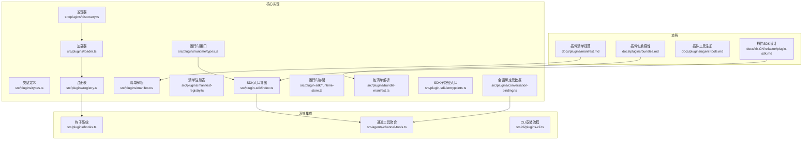
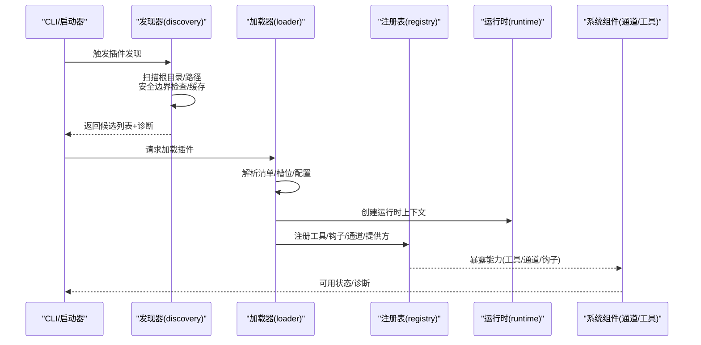
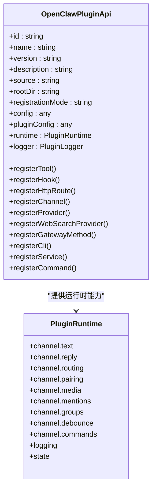
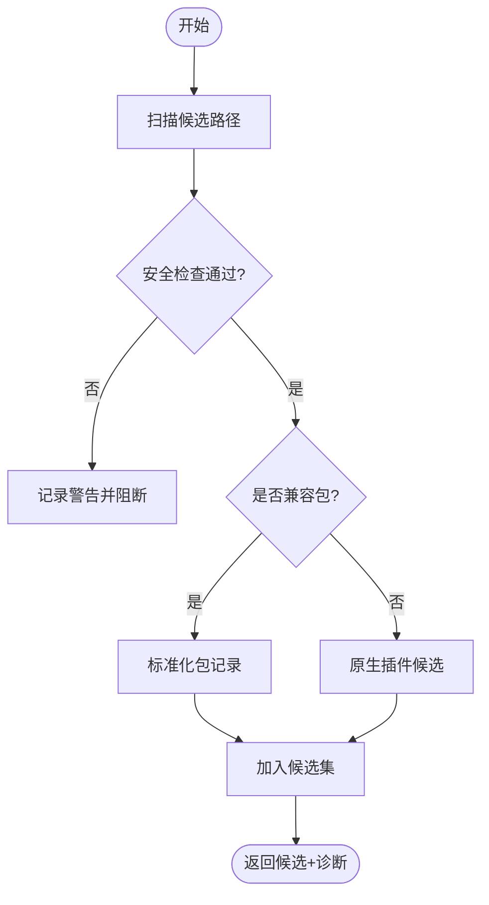
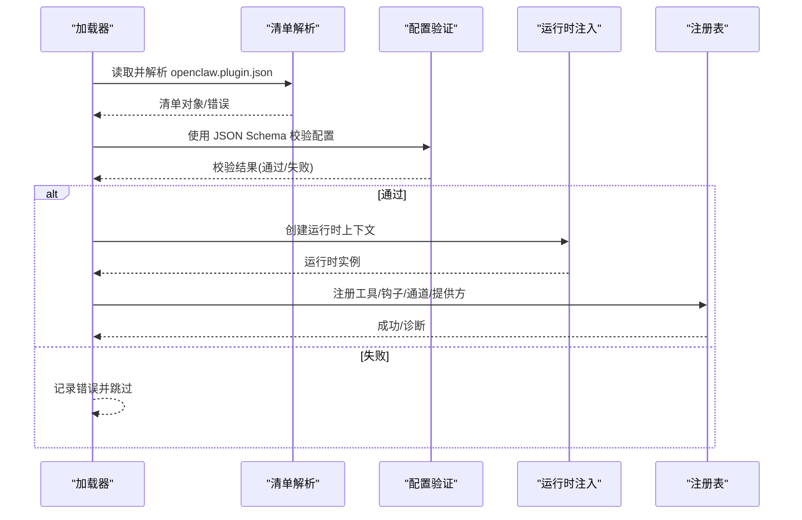
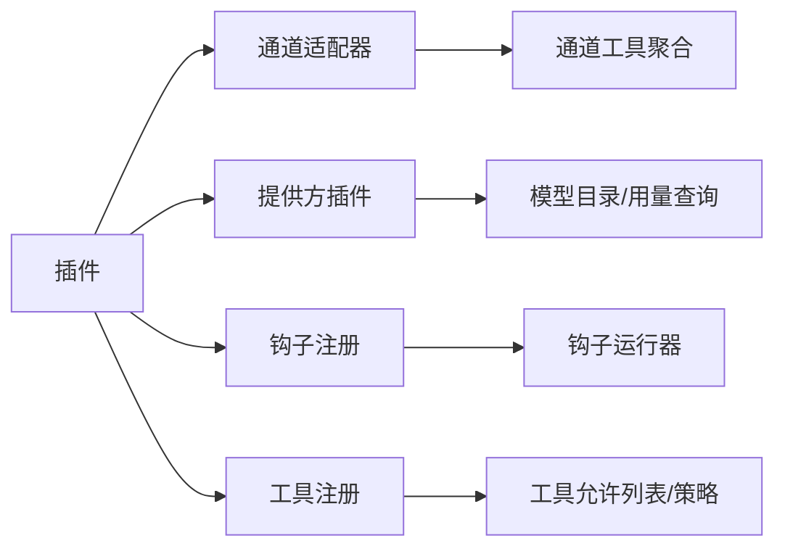
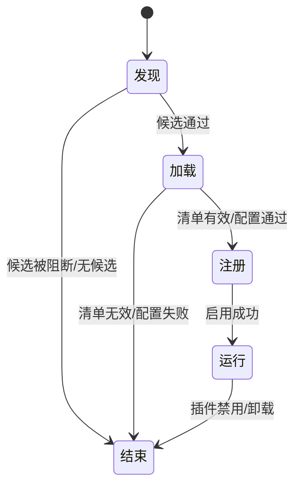
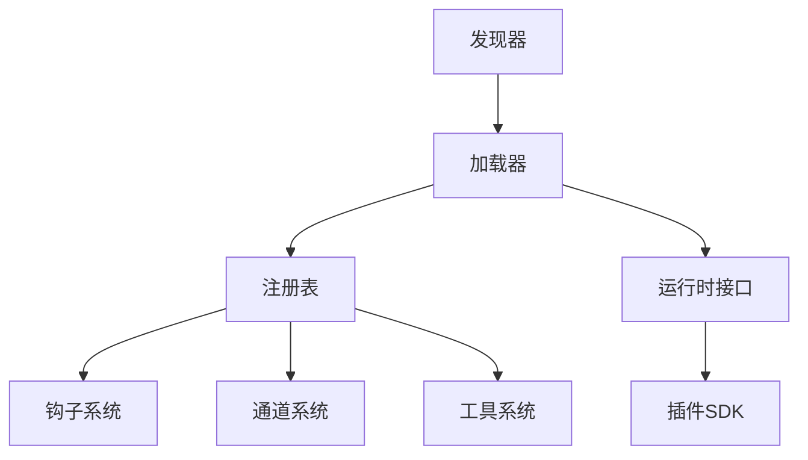

# 插件基础概念

<cite>
**本文档引用的文件**
- [manifest.md](file://docs/plugins/manifest.md)
- [bundles.md](file://docs/plugins/bundles.md)
- [agent-tools.md](file://docs/plugins/agent-tools.md)
- [plugin-sdk.md](file://docs/zh-CN/refactor/plugin-sdk.md)
- [types.ts](file://src/plugins/types.ts)
- [registry.ts](file://src/plugins/registry.ts)
- [discovery.ts](file://src/plugins/discovery.ts)
- [loader.ts](file://src/plugins/loader.ts)
- [manifest.ts](file://src/plugins/manifest.ts)
- [manifest-registry.ts](file://src/plugins/manifest-registry.ts)
- [bundle-manifest.ts](file://src/plugins/bundle-manifest.ts)
- [runtime/types.js](file://src/plugins/runtime/types.js)
- [runtime-store.ts](file://src/plugin-sdk/runtime-store.ts)
- [index.ts](file://src/plugin-sdk/index.ts)
- [entrypoints.ts](file://src/plugin-sdk/entrypoints.ts)
- [conversation-binding.ts](file://src/plugins/conversation-binding.ts)
- [hooks.ts](file://src/plugins/hooks.ts)
- [hooks.test-helpers.ts](file://src/plugins/hooks.test-helpers.ts)
- [channel-tools.ts](file://src/agents/channel-tools.ts)
- [plugins-cli.ts](file://src/cli/plugins-cli.ts)
</cite>

## 目录
1. [引言](#引言)
2. [项目结构](#项目结构)
3. [核心组件](#核心组件)
4. [架构总览](#架构总览)
5. [详细组件分析](#详细组件分析)
6. [依赖关系分析](#依赖关系分析)
7. [性能考虑](#性能考虑)
8. [故障排除指南](#故障排除指南)
9. [结论](#结论)

## 引言
本文件系统性阐述 OpenClaw 插件系统的基础概念，面向插件开发者与维护者，帮助理解插件架构设计原则、类型分类、生命周期、与系统其他组件（代理系统、通道集成、工具系统）的交互方式，以及插件的发现机制、加载流程与验证过程。文中所有技术细节均基于仓库源码与官方文档，确保可追溯与可复现。

## 项目结构
OpenClaw 插件系统由“发现—加载—注册—运行”四阶段构成，配合严格的清单校验与安全边界检查，形成稳定可靠的扩展框架。关键目录与文件职责如下：
- 文档层：插件清单规范、兼容包格式、插件工具注册等文档位于 docs/plugins 与 docs/zh-CN/refactor 下。
- 核心实现：插件类型定义、注册表、发现器、加载器、清单解析、运行时接口等位于 src/plugins 与 src/plugin-sdk。
- 组件集成：与通道系统、工具系统、网关方法等的对接逻辑分布在相应模块中。

图表来源
- [manifest.md:1-100](file://docs/plugins/manifest.md#L1-L100)
- [bundles.md:1-293](file://docs/plugins/bundles.md#L1-L293)
- [plugin-sdk.md:42-152](file://docs/zh-CN/refactor/plugin-sdk.md#L42-L152)
- [types.ts:1-800](file://src/plugins/types.ts#L1-L800)
- [registry.ts:1-800](file://src/plugins/registry.ts#L1-L800)
- [discovery.ts:1-800](file://src/plugins/discovery.ts#L1-L800)
- [loader.ts:1-200](file://src/plugins/loader.ts#L1-L200)
- [manifest.ts:65-108](file://src/plugins/manifest.ts#L65-L108)
- [bundle-manifest.ts:91-132](file://src/plugins/bundle-manifest.ts#L91-L132)
- [runtime/types.js:1-200](file://src/plugins/runtime/types.js#L1-L200)
- [runtime-store.ts:1-26](file://src/plugin-sdk/runtime-store.ts#L1-L26)
- [index.ts:1-800](file://src/plugin-sdk/index.ts#L1-L800)
- [entrypoints.ts:1-36](file://src/plugin-sdk/entrypoints.ts#L1-L36)
- [conversation-binding.ts:343-381](file://src/plugins/conversation-binding.ts#L343-L381)
- [hooks.ts:333-368](file://src/plugins/hooks.ts#L333-L368)
- [channel-tools.ts:31-65](file://src/agents/channel-tools.ts#L31-L65)
- [plugins-cli.ts:161-202](file://src/cli/plugins-cli.ts#L161-L202)

章节来源
- [manifest.md:1-100](file://docs/plugins/manifest.md#L1-L100)
- [bundles.md:1-293](file://docs/plugins/bundles.md#L1-L293)
- [plugin-sdk.md:42-152](file://docs/zh-CN/refactor/plugin-sdk.md#L42-L152)
- [types.ts:1-800](file://src/plugins/types.ts#L1-L800)
- [registry.ts:1-800](file://src/plugins/registry.ts#L1-L800)
- [discovery.ts:1-800](file://src/plugins/discovery.ts#L1-L800)
- [loader.ts:1-200](file://src/plugins/loader.ts#L1-L200)

## 核心组件
本节从系统视角梳理插件系统的关键构件及其职责。

- 插件类型与能力
  - 类型定义涵盖插件工具、通道适配、提供方插件、网关方法、命令、服务、HTTP 路由、钩子等，统一抽象为 OpenClawPluginApi 的能力面。
  - 运行时接口通过 PluginRuntime 暴露通道文本处理、回复派发、路由解析、媒体下载与保存、提及匹配、群组策略、防抖、命令授权等能力。
  - SDK 提供最小但完整的运行时访问面，确保插件不直接导入核心 src/**，并通过 openclaw/plugin-sdk 发布与版本化管理。

- 注册表与钩子
  - 注册表记录插件的工具、钩子、通道、提供方、Web 搜索提供方、网关方法、HTTP 路由、CLI 注册器、服务、命令等，支持诊断信息收集与冲突检测。
  - 钩子系统支持事件驱动的扩展点，既支持传统事件注册，也支持强类型的钩子注册与优先级控制。

- 发现与加载
  - 发现器扫描工作区、配置扩展目录、内置包等多源路径，识别原生插件与兼容包布局，进行安全边界检查与缓存优化。
  - 加载器根据配置与槽位决策选择启用插件，执行清单校验、配置验证、运行时注入与注册，最终建立全局插件注册表。

- 清单与包兼容
  - 原生插件必须提供 openclaw.plugin.json 清单，包含 id 与 configSchema 等字段；兼容包（Codex/Claude/Cursor）通过标准化映射进入系统。

章节来源
- [types.ts:1-800](file://src/plugins/types.ts#L1-L800)
- [registry.ts:1-800](file://src/plugins/registry.ts#L1-L800)
- [discovery.ts:1-800](file://src/plugins/discovery.ts#L1-L800)
- [loader.ts:1-200](file://src/plugins/loader.ts#L1-L200)
- [manifest.md:1-100](file://docs/plugins/manifest.md#L1-L100)
- [bundles.md:1-293](file://docs/plugins/bundles.md#L1-L293)
- [plugin-sdk.md:42-152](file://docs/zh-CN/refactor/plugin-sdk.md#L42-L152)

## 架构总览
下图展示插件系统在启动阶段的端到端流程：从发现候选插件，到加载与注册，再到运行时可用。

图表来源
- [discovery.ts:750-800](file://src/plugins/discovery.ts#L750-L800)
- [loader.ts:1-200](file://src/plugins/loader.ts#L1-L200)
- [registry.ts:234-350](file://src/plugins/registry.ts#L234-L350)
- [runtime/types.js:1-200](file://src/plugins/runtime/types.js#L1-L200)

章节来源
- [discovery.ts:750-800](file://src/plugins/discovery.ts#L750-L800)
- [loader.ts:1-200](file://src/plugins/loader.ts#L1-L200)
- [registry.ts:234-350](file://src/plugins/registry.ts#L234-L350)

## 详细组件分析

### 插件类型与运行时接口
- 插件类型体系
  - 工具：插件可注册一个或多个工具，支持必选与可选两类；可按插件维度或具体工具名加入允许列表。
  - 通道：插件可声明通道适配器，参与消息收发、登录、配对、提及、群组策略等。
  - 提供方：插件可声明模型提供方，提供认证、目录、动态模型解析、流封装、用量查询等钩子。
  - 网关方法：插件可注册网关请求处理器，扩展后端能力。
  - 命令与服务：插件可注册 CLI 命令与内部服务，参与命令表与服务表。
  - HTTP 路由：插件可注册受控 HTTP 路由，支持精确匹配与认证策略。
  - 钩子：插件可注册事件钩子，参与代理启动、提示构建、入站处理等生命周期事件。

- 运行时接口
  - 通道能力：文本分块、长度限制、控制命令识别、回复派发、路由解析、配对、媒体拉取与保存、提及正则、群组策略、入站防抖、命令授权。
  - 日志与状态：日志开关、子日志器、状态目录解析。
  - 典型使用场景：在工具执行上下文中注入会话键、账户标识、沙箱标记等，确保工具调用具备上下文感知与安全隔离。

图表来源
- [types.ts:1-800](file://src/plugins/types.ts#L1-L800)
- [runtime/types.js:1-200](file://src/plugins/runtime/types.js#L1-L200)

章节来源
- [types.ts:1-800](file://src/plugins/types.ts#L1-L800)
- [runtime/types.js:1-200](file://src/plugins/runtime/types.js#L1-L200)
- [plugin-sdk.md:42-152](file://docs/zh-CN/refactor/plugin-sdk.md#L42-L152)

### 插件发现机制与安全边界
- 发现范围
  - 支持工作区目录、配置扩展目录、内置包目录、用户指定路径等多种来源。
  - 对于兼容包（Codex/Claude/Cursor），自动识别包布局并标准化为内部记录。

- 安全边界
  - 路径逃逸检测：确保候选源位于插件根内。
  - 权限与所有权：禁止世界可写目录；在非 Windows 平台检查目录 UID 一致性。
  - 硬链接拒绝：避免跨文件系统硬链接带来的安全风险。
  - 缓存优化：发现结果按环境变量与根路径组合缓存，减少重复扫描。

图表来源
- [discovery.ts:121-276](file://src/plugins/discovery.ts#L121-L276)
- [discovery.ts:404-444](file://src/plugins/discovery.ts#L404-L444)
- [discovery.ts:750-800](file://src/plugins/discovery.ts#L750-L800)

章节来源
- [discovery.ts:121-276](file://src/plugins/discovery.ts#L121-L276)
- [discovery.ts:404-444](file://src/plugins/discovery.ts#L404-L444)
- [discovery.ts:750-800](file://src/plugins/discovery.ts#L750-L800)

### 插件加载流程与验证
- 加载阶段
  - 解析插件槽位决策（如 memory/context-engine），确定启用集合。
  - 读取并校验 openclaw.plugin.json 清单，生成配置模式与 UI 提示。
  - 校验插件配置值，失败则记录错误并跳过该插件。
  - 动态加载插件模块，注入运行时与 API，执行注册。

- 关键校验点
  - 清单存在性与必需字段（id、configSchema）。
  - 配置值严格遵循 JSON Schema。
  - 插件导出必须包含 register/activate 函数。
  - 清单与配置变更触发模式缓存键更新，保障一致性。

图表来源
- [loader.ts:1227-1261](file://src/plugins/loader.ts#L1227-L1261)
- [manifest.ts:65-108](file://src/plugins/manifest.ts#L65-L108)
- [manifest-registry.ts:322-340](file://src/plugins/manifest-registry.ts#L322-L340)

章节来源
- [loader.ts:1227-1261](file://src/plugins/loader.ts#L1227-L1261)
- [manifest.ts:65-108](file://src/plugins/manifest.ts#L65-L108)
- [manifest-registry.ts:322-340](file://src/plugins/manifest-registry.ts#L322-L340)

### 插件与系统组件的交互
- 与通道系统的集成
  - 通道插件通过注册表暴露消息适配器、登录、配对、提及、群组策略等能力。
  - 通道工具聚合函数从已启用通道插件中收集动作与工具，统一对外呈现。

- 与工具系统的集成
  - 插件可注册工具，工具可按插件维度或具体名称加入允许列表；可选工具需显式授权。
  - 工具执行上下文包含会话键、账户标识、沙箱标记等，确保工具在安全可控的环境中运行。

- 与钩子系统的交互
  - 插件可注册事件钩子，参与代理生命周期事件；支持强类型钩子与优先级控制。
  - 提供钩子策略约束（如禁止提示注入），确保安全与一致性。

图表来源
- [channel-tools.ts:31-65](file://src/agents/channel-tools.ts#L31-L65)
- [agent-tools.md:1-100](file://docs/plugins/agent-tools.md#L1-L100)
- [hooks.ts:333-368](file://src/plugins/hooks.ts#L333-L368)
- [registry.ts:706-753](file://src/plugins/registry.ts#L706-L753)

章节来源
- [channel-tools.ts:31-65](file://src/agents/channel-tools.ts#L31-L65)
- [agent-tools.md:1-100](file://docs/plugins/agent-tools.md#L1-L100)
- [hooks.ts:333-368](file://src/plugins/hooks.ts#L333-L368)
- [registry.ts:706-753](file://src/plugins/registry.ts#L706-L753)

### 插件生命周期
- 发现阶段：扫描候选、安全检查、兼容包识别、缓存命中。
- 加载阶段：槽位决策、清单解析、配置校验、模块加载、运行时注入。
- 注册阶段：注册工具、钩子、通道、提供方、HTTP 路由、CLI 命令、服务等。
- 运行阶段：系统组件通过注册表调用插件能力；钩子按事件触发；工具按允许列表执行。

图表来源
- [discovery.ts:750-800](file://src/plugins/discovery.ts#L750-L800)
- [loader.ts:1227-1261](file://src/plugins/loader.ts#L1227-L1261)
- [registry.ts:234-350](file://src/plugins/registry.ts#L234-L350)

章节来源
- [discovery.ts:750-800](file://src/plugins/discovery.ts#L750-L800)
- [loader.ts:1227-1261](file://src/plugins/loader.ts#L1227-L1261)
- [registry.ts:234-350](file://src/plugins/registry.ts#L234-L350)

### 插件开发基本术语
- 插件 ID：插件唯一标识，来源于清单 id 字段。
- 插件清单：openclaw.plugin.json，包含 id、configSchema、kind、channels、providers、skills 等。
- 插件种类：如 memory、context-engine，通过槽位选择。
- 插件配置：基于 JSON Schema 的配置对象，运行前严格校验。
- 插件工具：通过 registerTool 注册的 JSON Schema 工具，支持必选与可选。
- 钩子：事件扩展点，支持字符串事件与强类型钩子。
- 运行时：通过 OpenClawPluginApi.runtime 访问的通道、日志、状态等能力。
- 兼容包：Codex/Claude/Cursor 包，经标准化映射进入系统。

章节来源
- [manifest.md:1-100](file://docs/plugins/manifest.md#L1-L100)
- [agent-tools.md:1-100](file://docs/plugins/agent-tools.md#L1-L100)
- [plugin-sdk.md:42-152](file://docs/zh-CN/refactor/plugin-sdk.md#L42-L152)
- [types.ts:1-800](file://src/plugins/types.ts#L1-L800)

## 依赖关系分析
- 组件耦合
  - 发现器与加载器解耦：发现仅负责候选与诊断，加载负责执行与注册。
  - 注册表集中管理插件能力，降低系统组件对插件实现细节的耦合。
  - 运行时接口通过 SDK 暴露，避免插件直接依赖核心 src/**。

- 外部依赖与集成点
  - CLI 安装流程与插件槽位联动，安装后自动启用并写回配置。
  - 通道系统通过注册表聚合插件能力，统一对外暴露。
  - 钩子系统作为横切关注点，贯穿代理生命周期。

图表来源
- [discovery.ts:750-800](file://src/plugins/discovery.ts#L750-L800)
- [loader.ts:1-200](file://src/plugins/loader.ts#L1-L200)
- [registry.ts:234-350](file://src/plugins/registry.ts#L234-L350)
- [hooks.ts:333-368](file://src/plugins/hooks.ts#L333-L368)
- [index.ts:1-800](file://src/plugin-sdk/index.ts#L1-L800)

章节来源
- [discovery.ts:750-800](file://src/plugins/discovery.ts#L750-L800)
- [loader.ts:1-200](file://src/plugins/loader.ts#L1-L200)
- [registry.ts:234-350](file://src/plugins/registry.ts#L234-L350)
- [hooks.ts:333-368](file://src/plugins/hooks.ts#L333-L368)
- [index.ts:1-800](file://src/plugin-sdk/index.ts#L1-L800)

## 性能考虑
- 发现缓存：通过环境变量控制缓存窗口，合并启动期突发重载，减少磁盘扫描与权限检查开销。
- 注册表缓存：加载器维护注册表缓存条目上限，避免内存膨胀。
- 安全检查前置：在加载前完成路径与权限检查，尽早失败，减少无效加载成本。
- 钩子执行：强类型钩子与优先级控制有助于减少不必要的事件传播与重复处理。

章节来源
- [discovery.ts:40-70](file://src/plugins/discovery.ts#L40-L70)
- [loader.ts:61-68](file://src/plugins/loader.ts#L61-L68)

## 故障排除指南
- 清单缺失或非法
  - 现象：插件未被识别或报错。
  - 排查：确认 openclaw.plugin.json 存在且包含 id 与 configSchema；检查 JSON Schema 有效性。
- 配置校验失败
  - 现象：插件被禁用或出现诊断警告。
  - 排查：核对配置值是否符合 JSON Schema；查看诊断输出中的错误列表。
- 安全边界告警
  - 现象：发现器报告路径逃逸、世界可写、可疑所有权等。
  - 排查：修正目录权限与归属；避免硬链接；确保候选位于插件根内。
- 兼容包能力未生效
  - 现象：某些能力被检测但未执行。
  - 排查：参考兼容包文档，确认当前版本支持映射范围与限制。

章节来源
- [manifest.md:74-100](file://docs/plugins/manifest.md#L74-L100)
- [bundles.md:240-293](file://docs/plugins/bundles.md#L240-L293)
- [discovery.ts:241-252](file://src/plugins/discovery.ts#L241-L252)

## 结论
OpenClaw 插件系统以“安全边界 + 清单校验 + 运行时注入 + 集中式注册表”为核心设计，既保证扩展能力的开放性，又确保系统稳定与安全。通过清晰的类型抽象与 SDK 边界，插件开发得以在统一接口下进行；通过发现与加载的分层设计，系统在启动性能与可维护性之间取得平衡。建议插件开发者严格遵循清单规范与配置 Schema，合理使用工具允许列表与钩子策略，充分利用运行时提供的通道与媒体能力，构建安全、可靠、可维护的扩展。