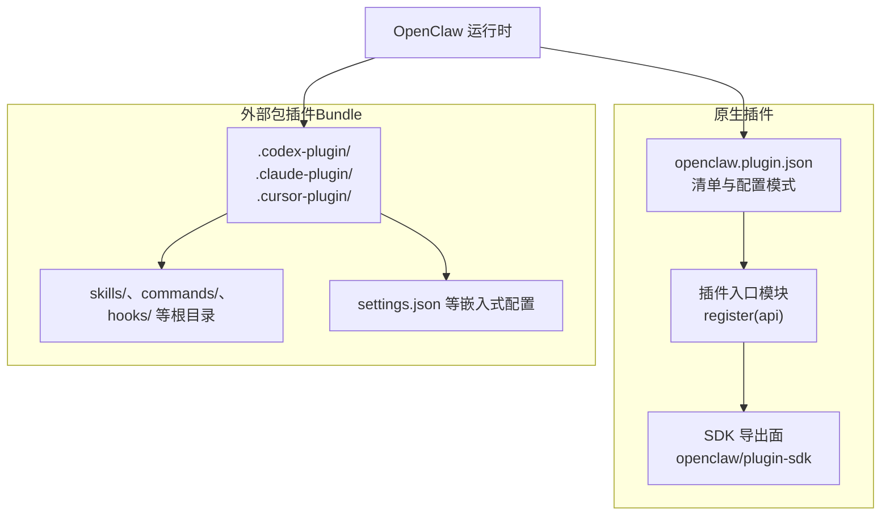
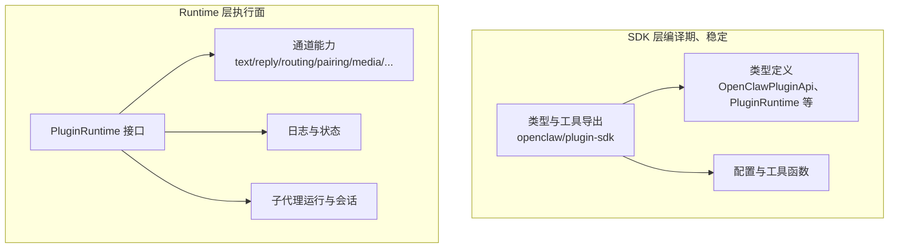
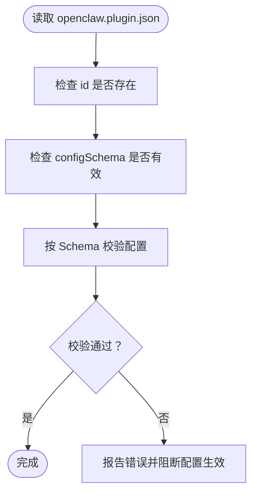
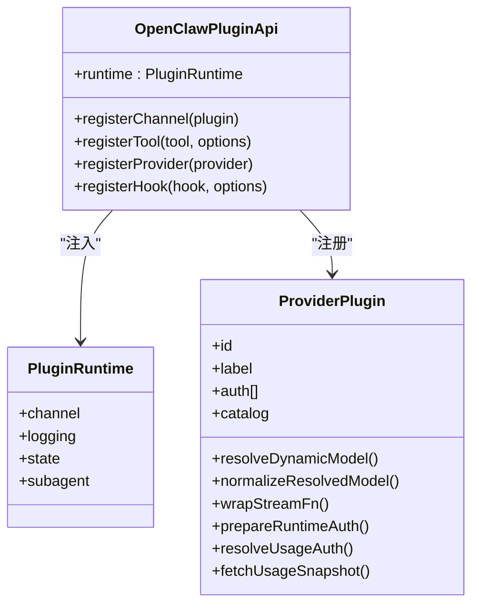
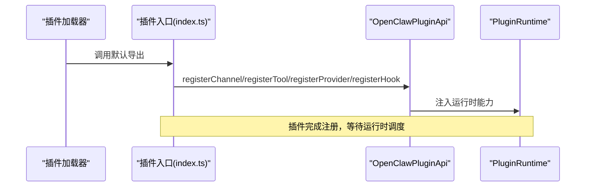
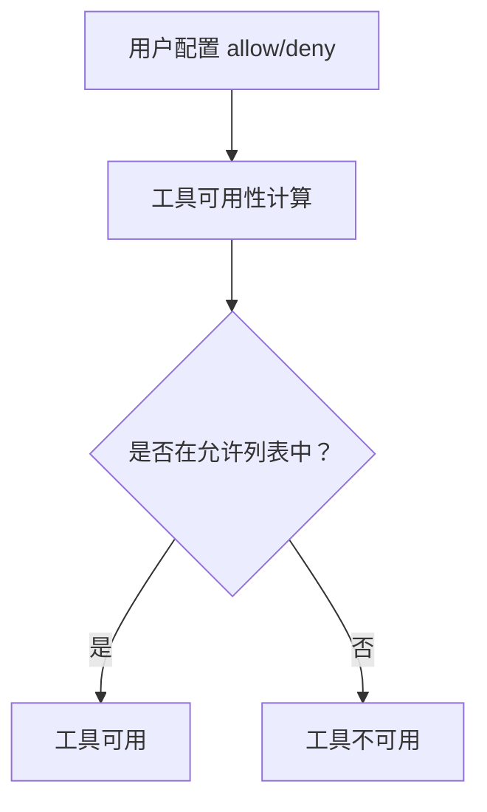
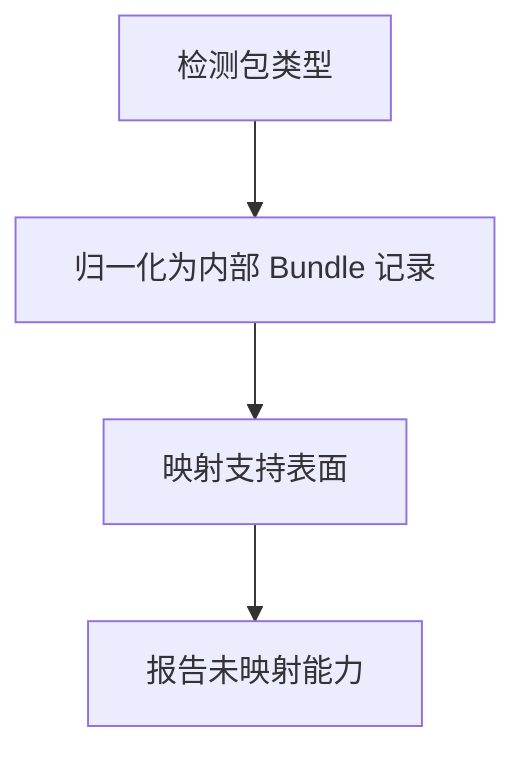
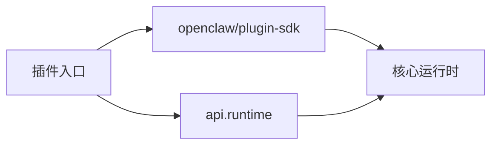

# 插件开发指南

<cite>
**本文引用的文件**
- [docs/plugins/manifest.md](file://docs/plugins/manifest.md)
- [docs/plugins/agent-tools.md](file://docs/plugins/agent-tools.md)
- [docs/refactor/plugin-sdk.md](file://docs/refactor/plugin-sdk.md)
- [src/plugin-sdk/index.ts](file://src/plugin-sdk/index.ts)
- [src/plugins/types.ts](file://src/plugins/types.ts)
- [src/plugins/runtime/types.ts](file://src/plugins/runtime/types.ts)
- [extensions/anthropic/openclaw.plugin.json](file://extensions/anthropic/openclaw.plugin.json)
- [extensions/discord/openclaw.plugin.json](file://extensions/discord/openclaw.plugin.json)
- [extensions/anthropic/index.ts](file://extensions/anthropic/index.ts)
- [extensions/discord/index.ts](file://extensions/discord/index.ts)
- [docs/plugins/bundles.md](file://docs/plugins/bundles.md)
- [docs/plugins/community.md](file://docs/plugins/community.md)
- [docs/plugins/voice-call.md](file://docs/plugins/voice-call.md)
</cite>

## 目录
1. [简介](#简介)
2. [项目结构](#项目结构)
3. [核心组件](#核心组件)
4. [架构总览](#架构总览)
5. [详细组件分析](#详细组件分析)
6. [依赖关系分析](#依赖关系分析)
7. [性能考量](#性能考量)
8. [故障排查指南](#故障排查指南)
9. [结论](#结论)
10. [附录](#附录)

## 简介
本指南面向希望在 OpenClaw 中开发与集成插件的开发者，系统讲解插件架构设计、开发环境与项目结构、接口规范、生命周期与事件处理、调试与测试策略、性能优化以及打包分发与版本管理最佳实践。内容基于仓库中的官方文档与源码实现，确保可操作性与一致性。

## 项目结构
OpenClaw 的插件体系由“原生插件”和“外部包插件（Bundle）”两类组成：
- 原生插件：以 openclaw.plugin.json 为清单，通过 SDK 注册能力（通道、工具、提供者等），在运行时被加载与验证。
- 外部包插件（Bundle）：以内容/元数据包形式存在，OpenClaw 解析其元数据并映射到技能、钩子、MCP 等能力。

图表来源
- [docs/plugins/bundles.md](file://docs/plugins/bundles.md)
- [docs/plugins/manifest.md](file://docs/plugins/manifest.md)

章节来源
- [docs/plugins/bundles.md](file://docs/plugins/bundles.md)
- [docs/plugins/manifest.md](file://docs/plugins/manifest.md)

## 核心组件
- 插件清单（openclaw.plugin.json）
  - 必填字段：id、configSchema
  - 可选字段：kind、channels、providers、providerAuthEnvVars、skills、name、description、uiHints、version
  - 清单用于在不执行插件代码的前提下进行配置校验与发现
- 插件 SDK
  - 提供类型、工具函数、配置辅助、运行时注入点等稳定接口
  - 通过 openclaw/plugin-sdk 导出，避免直接导入 src/** 内部实现
- 插件运行时
  - 通过 api.runtime 暴露通道、日志、状态、子代理等运行时能力
  - 严格区分 SDK（编译期稳定）与 Runtime（执行面）

章节来源
- [docs/plugins/manifest.md](file://docs/plugins/manifest.md)
- [docs/refactor/plugin-sdk.md](file://docs/refactor/plugin-sdk.md)
- [src/plugin-sdk/index.ts](file://src/plugin-sdk/index.ts)
- [src/plugins/runtime/types.ts](file://src/plugins/runtime/types.ts)

## 架构总览
OpenClaw 插件系统采用“两层”设计：
- SDK 层：类型、工具、配置辅助，无运行时状态与副作用
- Runtime 层：访问核心运行时行为，通过 api.runtime 注入

图表来源
- [docs/refactor/plugin-sdk.md](file://docs/refactor/plugin-sdk.md)
- [src/plugin-sdk/index.ts](file://src/plugin-sdk/index.ts)
- [src/plugins/runtime/types.ts](file://src/plugins/runtime/types.ts)

章节来源
- [docs/refactor/plugin-sdk.md](file://docs/refactor/plugin-sdk.md)
- [src/plugin-sdk/index.ts](file://src/plugin-sdk/index.ts)
- [src/plugins/runtime/types.ts](file://src/plugins/runtime/types.ts)

## 详细组件分析

### 组件 A：插件清单与配置模式
- 必填项
  - id：插件唯一标识
  - configSchema：内联 JSON Schema，用于配置读写时的严格校验
- 可选项
  - kind：插件种类（如 memory、context-engine）
  - channels/providers：注册的通道/提供者 ID 列表
  - providerAuthEnvVars：从环境变量解析认证所需的键名
  - skills：相对插件根目录的技能目录列表
  - name/description/uiHints/version：展示与元数据
- 验证行为
  - 未知 channels.* 或插件 id 不可发现将报错
  - 禁用但配置存在的插件仅警告

图表来源
- [docs/plugins/manifest.md](file://docs/plugins/manifest.md)

章节来源
- [docs/plugins/manifest.md](file://docs/plugins/manifest.md)

### 组件 B：插件 SDK 与运行时接口
- SDK 导出面
  - 类型：OpenClawPluginApi、PluginRuntime、ProviderPlugin 等
  - 工具：配置构建、鉴权、SSRF 策略、媒体处理、允许列表匹配等
- 运行时接口
  - channel：文本、回复、路由、配对、媒体、提及、群组、防抖、命令授权等
  - logging：日志开关与子日志器
  - state：状态目录解析

图表来源
- [src/plugin-sdk/index.ts](file://src/plugin-sdk/index.ts)
- [src/plugins/types.ts](file://src/plugins/types.ts)
- [src/plugins/runtime/types.ts](file://src/plugins/runtime/types.ts)

章节来源
- [src/plugin-sdk/index.ts](file://src/plugin-sdk/index.ts)
- [src/plugins/types.ts](file://src/plugins/types.ts)
- [src/plugins/runtime/types.ts](file://src/plugins/runtime/types.ts)

### 组件 C：插件生命周期与事件处理
- 生命周期
  - 发现：扫描 openclaw.plugin.json 与包布局
  - 验证：按清单 Schema 校验配置
  - 注册：调用插件入口 register(api)，注册通道/工具/提供者/钩子
  - 执行：通过 api.runtime 访问运行时能力
- 事件处理
  - 钩子：通过 api.registerHook 注册，支持入口、名称、描述与是否默认注册
  - 子代理：通过 api.runtime.subagent.run/waitForRun/getSession/deleteSession 管理会话与消息

图表来源
- [extensions/discord/index.ts](file://extensions/discord/index.ts)
- [extensions/anthropic/index.ts](file://extensions/anthropic/index.ts)
- [src/plugins/types.ts](file://src/plugins/types.ts)

章节来源
- [extensions/discord/index.ts](file://extensions/discord/index.ts)
- [extensions/anthropic/index.ts](file://extensions/anthropic/index.ts)
- [src/plugins/types.ts](file://src/plugins/types.ts)

### 组件 D：Agent 工具与可选工具
- 工具注册
  - 必需工具：直接可用
  - 可选工具：需在 agents[].tools.allow 或 tools.allow 中显式启用
- 允许策略
  - 支持按工具名、插件 id、插件组启用
  - 支持按提供者分组控制
  - 支持沙箱工具策略

图表来源
- [docs/plugins/agent-tools.md](file://docs/plugins/agent-tools.md)

章节来源
- [docs/plugins/agent-tools.md](file://docs/plugins/agent-tools.md)

### 组件 E：外部包插件（Bundle）兼容性
- 支持生态：Codex、Claude、Cursor
- 行为：检测包类型 → 归一化记录 → 映射支持表面（技能、钩子、MCP、嵌入式 Pi 设置）
- 安全边界：不执行任意包内运行时代码，仅映射已支持能力

图表来源
- [docs/plugins/bundles.md](file://docs/plugins/bundles.md)

章节来源
- [docs/plugins/bundles.md](file://docs/plugins/bundles.md)

### 组件 F：插件开发示例（基础模板与清单）
- 基础模板要点
  - 在插件根目录提供 openclaw.plugin.json
  - 在入口模块中实现默认导出函数，接收 api 并注册能力
  - 使用 emptyPluginConfigSchema 或自定义 JSON Schema
- 示例清单字段
  - anthropic：声明 providers 与 providerAuthEnvVars
  - discord：声明 channels

章节来源
- [extensions/anthropic/openclaw.plugin.json](file://extensions/anthropic/openclaw.plugin.json)
- [extensions/discord/openclaw.plugin.json](file://extensions/discord/openclaw.plugin.json)
- [extensions/anthropic/index.ts](file://extensions/anthropic/index.ts)
- [extensions/discord/index.ts](file://extensions/discord/index.ts)

## 依赖关系分析
- 插件对 SDK 的依赖
  - 严禁直接导入 src/**；所有依赖通过 openclaw/plugin-sdk 或运行时注入
- 运行时耦合
  - 仅通过 api.runtime 访问核心行为，保证稳定性与可替换性
- 版本与兼容
  - SDK 语义化版本；运行时随核心发布；插件声明所需运行时范围

图表来源
- [docs/refactor/plugin-sdk.md](file://docs/refactor/plugin-sdk.md)
- [src/plugin-sdk/index.ts](file://src/plugin-sdk/index.ts)

章节来源
- [docs/refactor/plugin-sdk.md](file://docs/refactor/plugin-sdk.md)
- [src/plugin-sdk/index.ts](file://src/plugin-sdk/index.ts)

## 性能考量
- 配置校验前置：通过清单 Schema 在配置读写阶段即完成校验，减少运行时开销
- 运行时最小暴露：SDK 小而稳定，Runtime 仅暴露必要接口，降低耦合与热路径复杂度
- 工具与钩子的按需启用：通过允许列表与提供者策略控制，避免不必要的执行
- 媒体与网络请求：使用 SDK 提供的媒体处理与 SSRF 策略工具，减少重复实现与安全风险

## 故障排查指南
- 清单与配置错误
  - 缺失或无效 openclaw.plugin.json 会导致配置验证失败
  - 未知 channels.* 或插件 id 不可发现将报错
- 工具不可用
  - 可选工具未在 allow 列表中启用
  - 提供者策略限制导致工具被屏蔽
- 运行时问题
  - 通过 api.runtime 的日志接口输出诊断信息
  - 使用子代理接口管理会话，避免并发与状态不一致

章节来源
- [docs/plugins/manifest.md](file://docs/plugins/manifest.md)
- [docs/plugins/agent-tools.md](file://docs/plugins/agent-tools.md)
- [src/plugins/runtime/types.ts](file://src/plugins/runtime/types.ts)

## 结论
OpenClaw 的插件体系以“SDK + Runtime”的清晰分层为核心，结合严格的清单与配置 Schema 校验，提供了稳定、可扩展且安全的插件开发框架。遵循本文档的结构与最佳实践，开发者可以快速构建高质量的原生插件，并在需要时兼容外部包插件（Bundle）生态。

## 附录

### A. 开发环境与项目结构建议
- 使用 openclaw/plugin-sdk 导出面，避免直接导入 src/**
- 在插件根目录提供 openclaw.plugin.json，并编写最小可用的 JSON Schema
- 在入口模块中实现 register(api)，按需注册通道、工具、提供者与钩子
- 通过 api.runtime 访问运行时能力，保持插件与核心解耦

章节来源
- [docs/refactor/plugin-sdk.md](file://docs/refactor/plugin-sdk.md)
- [docs/plugins/manifest.md](file://docs/plugins/manifest.md)

### B. 插件调试技巧
- 使用 Doctor 与日志输出定位清单与配置问题
- 通过子代理接口管理会话，观察消息流转与状态变化
- 对外网请求与媒体处理使用 SDK 工具，减少环境差异带来的不确定性

章节来源
- [src/plugins/runtime/types.ts](file://src/plugins/runtime/types.ts)

### C. 测试策略
- 单元测试：针对运行时适配器与工具函数进行适配测试
- 黄金测试：每个插件进行端到端样本测试，确保行为不漂移
- CI 集成：包含安装、运行与冒烟测试流程

章节来源
- [docs/refactor/plugin-sdk.md](file://docs/refactor/plugin-sdk.md)

### D. 打包、分发与版本管理
- 原生插件
  - 通过 npm 发布，遵循语义化版本
  - 在 openclaw.plugins 中声明所需运行时范围
- 外部包插件（Bundle）
  - 支持 Codex/Claude/Cursor 布局，OpenClaw 自动识别并映射支持能力
  - 未映射能力会在诊断中提示
- 社区插件
  - 需满足质量门槛并在社区页列出

章节来源
- [docs/plugins/bundles.md](file://docs/plugins/bundles.md)
- [docs/plugins/community.md](file://docs/plugins/community.md)

### E. 实战参考：语音通话插件
- 安装与配置
  - 支持 npm 安装与本地开发安装
  - 配置包含提供商参数、Webhook 服务器、公网暴露方式、TTS 覆盖等
- CLI 与工具
  - 提供 voice_call 工具与 Gateway RPC 接口
- 安全与超时
  - 提供过期呼叫清理、Webhook 安全校验与重放保护

章节来源
- [docs/plugins/voice-call.md](file://docs/plugins/voice-call.md)