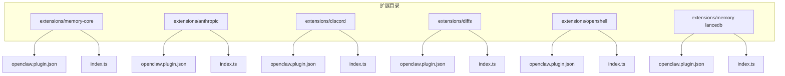
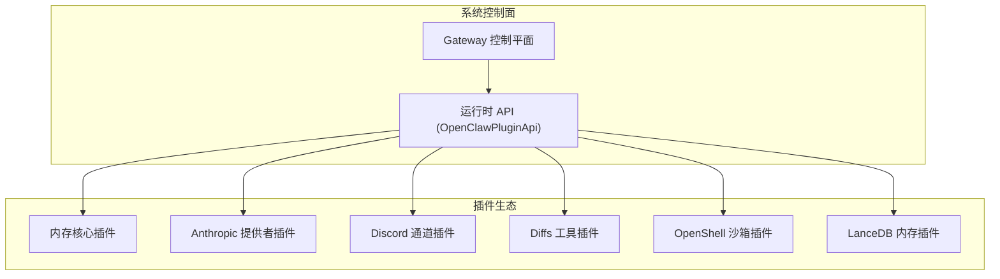
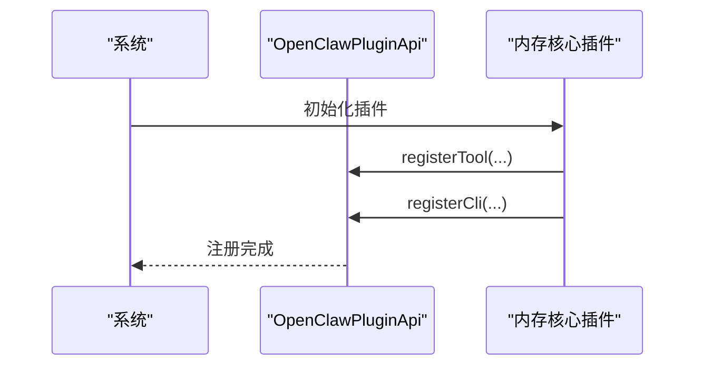
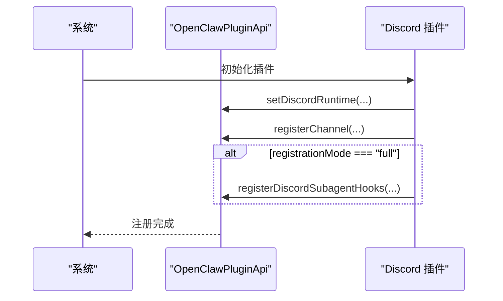
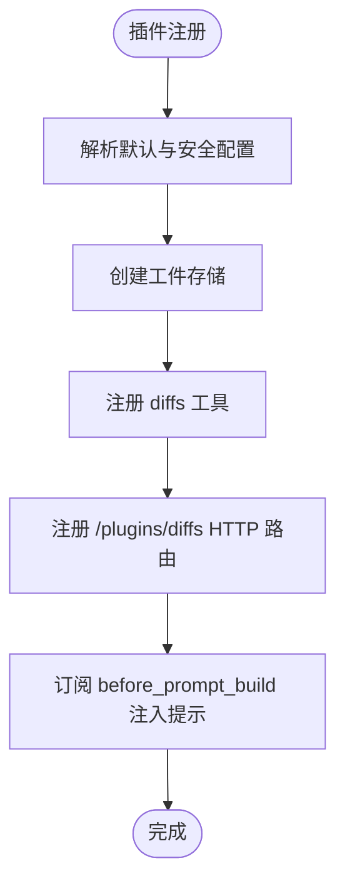
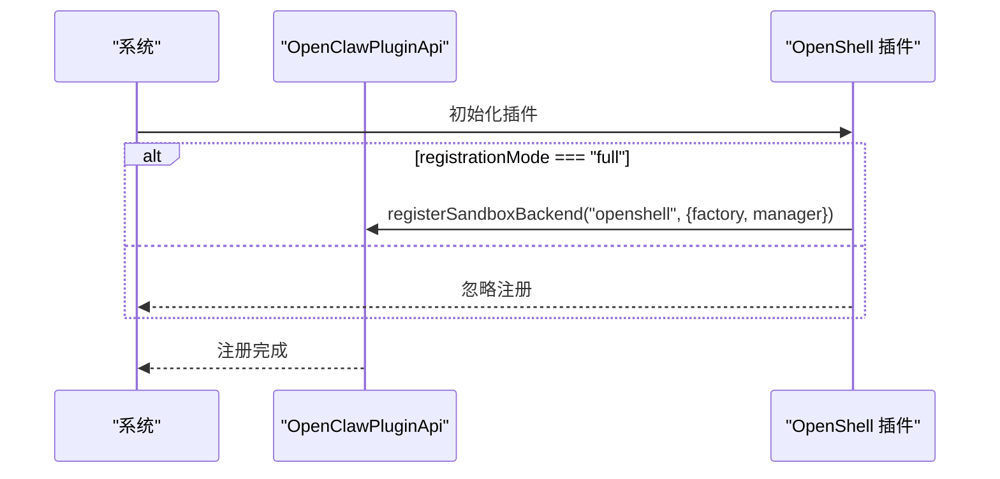
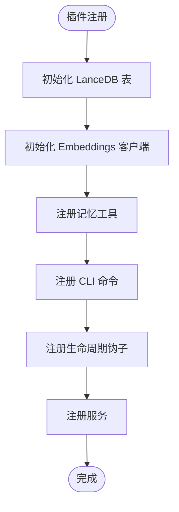
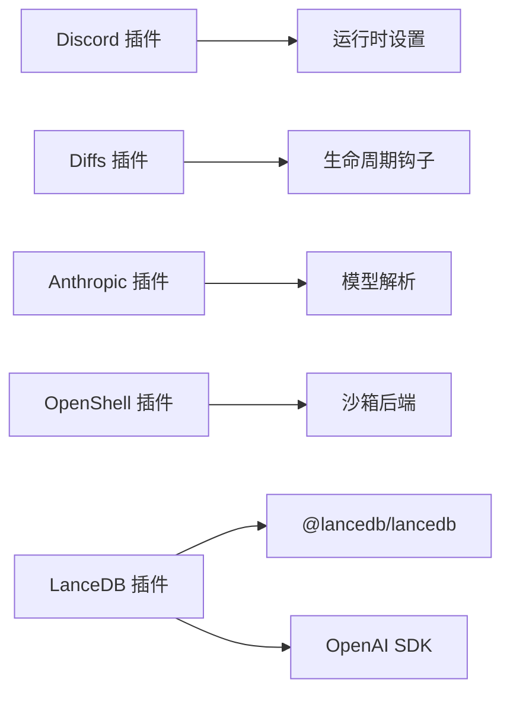

# 插件开发示例

<cite>
**本文档引用的文件**
- [README.md](file://README.md)
- [extensions/memory-core/openclaw.plugin.json](file://extensions/memory-core/openclaw.plugin.json)
- [extensions/memory-core/index.ts](file://extensions/memory-core/index.ts)
- [extensions/anthropic/openclaw.plugin.json](file://extensions/anthropic/openclaw.plugin.json)
- [extensions/anthropic/index.ts](file://extensions/anthropic/index.ts)
- [extensions/discord/openclaw.plugin.json](file://extensions/discord/openclaw.plugin.json)
- [extensions/discord/index.ts](file://extensions/discord/index.ts)
- [extensions/diffs/openclaw.plugin.json](file://extensions/diffs/openclaw.plugin.json)
- [extensions/diffs/index.ts](file://extensions/diffs/index.ts)
- [extensions/openshell/openclaw.plugin.json](file://extensions/openshell/openclaw.plugin.json)
- [extensions/openshell/index.ts](file://extensions/openshell/index.ts)
- [extensions/memory-lancedb/openclaw.plugin.json](file://extensions/memory-lancedb/openclaw.plugin.json)
- [extensions/memory-lancedb/index.ts](file://extensions/memory-lancedb/index.ts)
</cite>

## 目录
1. [简介](#简介)
2. [项目结构](#项目结构)
3. [核心组件](#核心组件)
4. [架构总览](#架构总览)
5. [详细组件分析](#详细组件分析)
6. [依赖关系分析](#依赖关系分析)
7. [性能考虑](#性能考虑)
8. [故障排除指南](#故障排除指南)
9. [结论](#结论)
10. [附录](#附录)

## 简介
本示例文档面向希望在 OpenClaw 平台上开发插件的开发者，提供从基础到复杂的一系列插件开发案例与最佳实践。通过解析现有插件（内存插件、通道插件、工具插件、提供者插件、沙箱插件）的实现结构与注册流程，帮助你快速掌握不同插件类型的开发模式，并给出可直接参考的模板与集成测试思路。

## 项目结构
OpenClaw 的插件生态以“扩展”为单位组织，每个扩展通常包含一个描述文件（openclaw.plugin.json）与入口脚本（index.ts），并通过 SDK 提供的注册接口向系统注入能力（工具、通道、提供者、HTTP 路由、生命周期钩子等）。



图表来源
- [extensions/memory-core/openclaw.plugin.json:1-10](file://extensions/memory-core/openclaw.plugin.json#L1-L10)
- [extensions/anthropic/openclaw.plugin.json:1-13](file://extensions/anthropic/openclaw.plugin.json#L1-L13)
- [extensions/discord/openclaw.plugin.json:1-10](file://extensions/discord/openclaw.plugin.json#L1-L10)
- [extensions/diffs/openclaw.plugin.json:1-183](file://extensions/diffs/openclaw.plugin.json#L1-L183)
- [extensions/openshell/openclaw.plugin.json:1-100](file://extensions/openshell/openclaw.plugin.json#L1-L100)
- [extensions/memory-lancedb/openclaw.plugin.json:1-89](file://extensions/memory-lancedb/openclaw.plugin.json#L1-L89)

章节来源
- [README.md:1-560](file://README.md#L1-L560)

## 核心组件
- 插件清单（openclaw.plugin.json）
  - 定义插件标识、类型（如 memory、channels、providers、sandbox）、配置模式（configSchema）以及 UI 提示（uiHints）等元数据。
- 插件入口（index.ts）
  - 使用 OpenClaw 插件 SDK 注册能力：工具、通道、提供者、HTTP 路由、生命周期钩子、服务、CLI 命令等。
- 插件 SDK
  - 提供统一的注册 API 与上下文（api），包括运行时、日志、路径解析、事件订阅等。

章节来源
- [extensions/memory-core/openclaw.plugin.json:1-10](file://extensions/memory-core/openclaw.plugin.json#L1-L10)
- [extensions/memory-core/index.ts:1-39](file://extensions/memory-core/index.ts#L1-L39)
- [extensions/anthropic/openclaw.plugin.json:1-13](file://extensions/anthropic/openclaw.plugin.json#L1-L13)
- [extensions/anthropic/index.ts:261-319](file://extensions/anthropic/index.ts#L261-L319)
- [extensions/discord/openclaw.plugin.json:1-10](file://extensions/discord/openclaw.plugin.json#L1-L10)
- [extensions/discord/index.ts:1-23](file://extensions/discord/index.ts#L1-L23)
- [extensions/diffs/openclaw.plugin.json:1-183](file://extensions/diffs/openclaw.plugin.json#L1-L183)
- [extensions/diffs/index.ts:1-45](file://extensions/diffs/index.ts#L1-L45)
- [extensions/openshell/openclaw.plugin.json:1-100](file://extensions/openshell/openclaw.plugin.json#L1-L100)
- [extensions/openshell/index.ts:1-31](file://extensions/openshell/index.ts#L1-L31)
- [extensions/memory-lancedb/openclaw.plugin.json:1-89](file://extensions/memory-lancedb/openclaw.plugin.json#L1-L89)
- [extensions/memory-lancedb/index.ts:292-679](file://extensions/memory-lancedb/index.ts#L292-L679)

## 架构总览
下图展示了插件在系统中的角色与交互方式：插件通过 SDK 注册能力，系统在运行期调用这些能力完成工具执行、通道收发、提供者认证与模型解析、HTTP 访问、生命周期事件处理等。



图表来源
- [extensions/memory-core/index.ts:10-36](file://extensions/memory-core/index.ts#L10-L36)
- [extensions/anthropic/index.ts:266-315](file://extensions/anthropic/index.ts#L266-L315)
- [extensions/discord/index.ts:12-20](file://extensions/discord/index.ts#L12-L20)
- [extensions/diffs/index.ts:19-42](file://extensions/diffs/index.ts#L19-L42)
- [extensions/openshell/index.ts:14-27](file://extensions/openshell/index.ts#L14-L27)
- [extensions/memory-lancedb/index.ts:299-676](file://extensions/memory-lancedb/index.ts#L299-L676)

## 详细组件分析

### 基础插件模板（内存核心）
- 元数据
  - 类型：memory
  - 配置：空配置模式（emptyPluginConfigSchema）
- 能力注册
  - 注册工具：memory_search、memory_get
  - 注册 CLI：memory 子命令
- 设计要点
  - 使用 api.registerTool 批量注册工具函数
  - 使用 api.registerCli 注入命令行入口
  - 通过 api.runtime.tools.* 获取工具工厂



图表来源
- [extensions/memory-core/index.ts:10-36](file://extensions/memory-core/index.ts#L10-L36)

章节来源
- [extensions/memory-core/openclaw.plugin.json:1-10](file://extensions/memory-core/openclaw.plugin.json#L1-L10)
- [extensions/memory-core/index.ts:1-39](file://extensions/memory-core/index.ts#L1-L39)

### 通道插件（Discord）
- 元数据
  - channels: ["discord"]
  - 配置：空配置模式
- 能力注册
  - 设置运行时（setDiscordRuntime）
  - 注册通道（registerChannel）
  - 在完整注册模式下注册子代理钩子（registerDiscordSubagentHooks）



图表来源
- [extensions/discord/index.ts:12-20](file://extensions/discord/index.ts#L12-L20)

章节来源
- [extensions/discord/openclaw.plugin.json:1-10](file://extensions/discord/openclaw.plugin.json#L1-L10)
- [extensions/discord/index.ts:1-23](file://extensions/discord/index.ts#L1-L23)

### 工具插件（Diffs）
- 元数据
  - 提供技能（skills）、UI 提示（uiHints）、配置模式（configSchema）
- 能力注册
  - 注册工具：diffs 工具
  - 注册 HTTP 路由：/plugins/diffs（前缀匹配，插件鉴权）
  - 生命周期钩子：before_prompt_build 注入系统上下文
- 设计要点
  - 使用 DiffArtifactStore 管理临时工件
  - 通过 resolveDiffsPluginDefaults/resolveDiffsPluginSecurity 解析配置
  - 通过 api.on 订阅事件并动态注入上下文



图表来源
- [extensions/diffs/index.ts:19-42](file://extensions/diffs/index.ts#L19-L42)

章节来源
- [extensions/diffs/openclaw.plugin.json:1-183](file://extensions/diffs/openclaw.plugin.json#L1-L183)
- [extensions/diffs/index.ts:1-45](file://extensions/diffs/index.ts#L1-L45)

### 提供者插件（Anthropic）
- 元数据
  - providers: ["anthropic"]
  - providerAuthEnvVars: 支持 OAuth Token 与 API Key
  - 配置：空配置模式
- 能力注册
  - 注册提供者：id、标签、文档路径、环境变量、认证方案（setup-token）
  - 动态模型解析：兼容旧版模型 ID，映射到模板模型
  - 现代模型识别与思考级别策略
  - 使用 OAuth 获取用量授权，抓取 Claude 用量
- 设计要点
  - 使用 api.registerProvider 注册提供者能力
  - 通过 resolveDynamicModel 实现模型兼容性
  - 通过 wizard.setup 集成向导选择

```mermaid
sequenceDiagram
participant Sys as "系统"
participant Api as "OpenClawPluginApi"
participant AN as "Anthropic 插件"
Sys->>AN : 初始化插件
AN->>Api : registerProvider({
id, label, envVars, auth, resolveDynamicModel, ...
})
Api-->>Sys : 注册完成
```

图表来源
- [extensions/anthropic/index.ts:266-315](file://extensions/anthropic/index.ts#L266-L315)

章节来源
- [extensions/anthropic/openclaw.plugin.json:1-13](file://extensions/anthropic/openclaw.plugin.json#L1-L13)
- [extensions/anthropic/index.ts:1-319](file://extensions/anthropic/index.ts#L1-L319)

### 沙箱插件（OpenShell）
- 元数据
  - 提供配置模式与 UI 提示（命令、网关、端点、源、策略、GPU、自动提供者、远程工作区、超时等）
- 能力注册
  - 在完整注册模式下注册沙箱后端（registerSandboxBackend）
  - 通过工厂与管理器创建沙箱实例
- 设计要点
  - 仅在完整注册模式下生效，避免轻量加载时的额外开销
  - 通过 resolveOpenShellPluginConfig 解析插件配置



图表来源
- [extensions/openshell/index.ts:14-27](file://extensions/openshell/index.ts#L14-L27)

章节来源
- [extensions/openshell/openclaw.plugin.json:1-100](file://extensions/openshell/openclaw.plugin.json#L1-L100)
- [extensions/openshell/index.ts:1-31](file://extensions/openshell/index.ts#L1-L31)

### 内存插件（LanceDB）
- 元数据
  - 类型：memory
  - 配置：嵌套对象（embedding、dbPath、autoCapture、autoRecall、captureMaxChars）
  - UI 提示：敏感字段标记、占位符、高级选项
- 能力注册
  - 注册工具：memory_recall、memory_store、memory_forget
  - 注册 CLI：ltm 子命令（list/search/stats）
  - 生命周期钩子：before_agent_start（自动召回）、agent_end（自动捕获）
  - 注册服务：启动/停止日志
- 设计要点
  - 使用 MemoryDB 封装 LanceDB 表操作
  - 使用 Embeddings 封装 OpenAI embeddings
  - 规则过滤与 Prompt 注入防护
  - 事件驱动的自动记忆管理



图表来源
- [extensions/memory-lancedb/index.ts:299-676](file://extensions/memory-lancedb/index.ts#L299-L676)

章节来源
- [extensions/memory-lancedb/openclaw.plugin.json:1-89](file://extensions/memory-lancedb/openclaw.plugin.json#L1-L89)
- [extensions/memory-lancedb/index.ts:1-679](file://extensions/memory-lancedb/index.ts#L1-L679)

## 依赖关系分析
- 插件间耦合
  - 通道插件依赖运行时设置（如 Discord 运行时）
  - 工具插件可独立存在，但可与生命周期钩子协作（如 Diffs 注入系统上下文）
  - 提供者插件与模型解析、认证流程强关联
  - 沙箱插件仅在完整注册模式下启用，避免不必要的依赖
  - 内存插件使用外部库（LanceDB、OpenAI），需注意平台兼容性与错误处理
- 外部依赖
  - LanceDB：在 macOS 可能缺少原生绑定，需捕获加载异常
  - OpenAI：嵌入模型与维度配置需一致
  - HTTP 路由：插件鉴权与前缀匹配



图表来源
- [extensions/discord/index.ts:13-14](file://extensions/discord/index.ts#L13-L14)
- [extensions/diffs/index.ts:38-41](file://extensions/diffs/index.ts#L38-L41)
- [extensions/anthropic/index.ts:296-296](file://extensions/anthropic/index.ts#L296-L296)
- [extensions/openshell/index.ts:19-26](file://extensions/openshell/index.ts#L19-L26)
- [extensions/memory-lancedb/index.ts:27-37](file://extensions/memory-lancedb/index.ts#L27-L37)
- [extensions/memory-lancedb/index.ts:16-20](file://extensions/memory-lancedb/index.ts#L16-L20)

章节来源
- [extensions/memory-lancedb/index.ts:27-37](file://extensions/memory-lancedb/index.ts#L27-L37)

## 性能考虑
- 工具调用
  - 合理限制搜索结果数量（如 LanceDB recall 的 limit 参数）
  - 对高维向量进行序列化前清理，避免传输与克隆开销
- I/O 与网络
  - LanceDB 表延迟初始化，首次访问时建立连接与表结构
  - OpenAI 嵌入请求带维度参数，避免不必要转换
- 生命周期钩子
  - 自动召回与捕获应限制频率与条数，避免过度写入与查询
- HTTP 路由
  - 使用前缀匹配减少路由冲突，插件鉴权确保安全

## 故障排除指南
- LanceDB 加载失败（macOS 原生绑定缺失）
  - 现象：初始化时报错，提示无法加载 LanceDB
  - 处理：检查平台支持或切换兼容提供者；捕获异常并记录原因
- OpenAI 嵌入维度不匹配
  - 现象：嵌入维度与表结构不一致导致插入失败
  - 处理：显式指定 dimensions 或使用标准模型
- 记忆工具重复存储
  - 现象：相似内容被重复存储
  - 处理：使用高相似度阈值去重后再写入
- HTTP 路由访问受限
  - 现象：非本地访问被拒绝
  - 处理：根据安全配置调整 allowRemoteViewer 或使用本地回环

章节来源
- [extensions/memory-lancedb/index.ts:33-36](file://extensions/memory-lancedb/index.ts#L33-L36)
- [extensions/memory-lancedb/index.ts:175-185](file://extensions/memory-lancedb/index.ts#L175-L185)
- [extensions/memory-lancedb/index.ts:392-407](file://extensions/memory-lancedb/index.ts#L392-L407)
- [extensions/diffs/openclaw.plugin.json:63-67](file://extensions/diffs/openclaw.plugin.json#L63-L67)

## 结论
通过以上示例，你可以看到 OpenClaw 插件体系如何以统一的 SDK 接口注入多种能力：工具、通道、提供者、HTTP 路由、生命周期钩子与服务。不同类型的插件在职责与复杂度上差异较大，但都遵循相同的注册模式与生命周期。建议从最简单的内存核心插件开始，逐步扩展到通道、工具与提供者，最终实现复杂场景（如 LanceDB 内存与 OpenShell 沙箱）。

## 附录
- 渐进式开发路线
  - 第一步：基础插件模板（内存核心）
  - 第二步：通道插件（Discord）
  - 第三步：工具插件（Diffs）
  - 第四步：提供者插件（Anthropic）
  - 第五步：沙箱插件（OpenShell）
  - 第六步：内存插件（LanceDB）
- 配置示例定位
  - 内存核心：空配置模式
    - [extensions/memory-core/openclaw.plugin.json:1-10](file://extensions/memory-core/openclaw.plugin.json#L1-L10)
  - Diffs：丰富的 uiHints 与 configSchema
    - [extensions/diffs/openclaw.plugin.json:1-183](file://extensions/diffs/openclaw.plugin.json#L1-L183)
  - OpenShell：多字段配置与高级选项
    - [extensions/openshell/openclaw.plugin.json:1-100](file://extensions/openshell/openclaw.plugin.json#L1-L100)
  - LanceDB：嵌套对象配置与敏感字段
    - [extensions/memory-lancedb/openclaw.plugin.json:1-89](file://extensions/memory-lancedb/openclaw.plugin.json#L1-L89)
- 集成测试建议
  - 工具插件：验证工具执行返回、错误处理与参数校验
  - 通道插件：模拟消息收发与权限设置
  - 提供者插件：认证流程（setup-token）、模型解析与用量抓取
  - 沙箱插件：沙箱创建/销毁、命令执行与工作区同步
  - 内存插件：召回准确性、自动捕获触发条件与去重逻辑