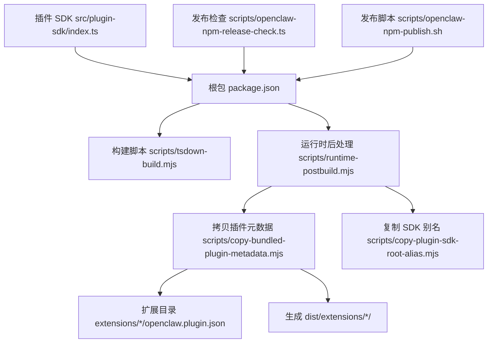
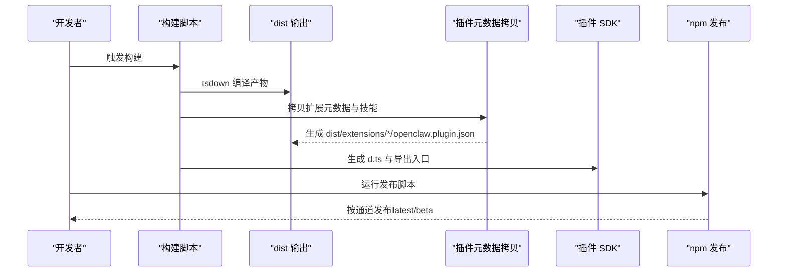
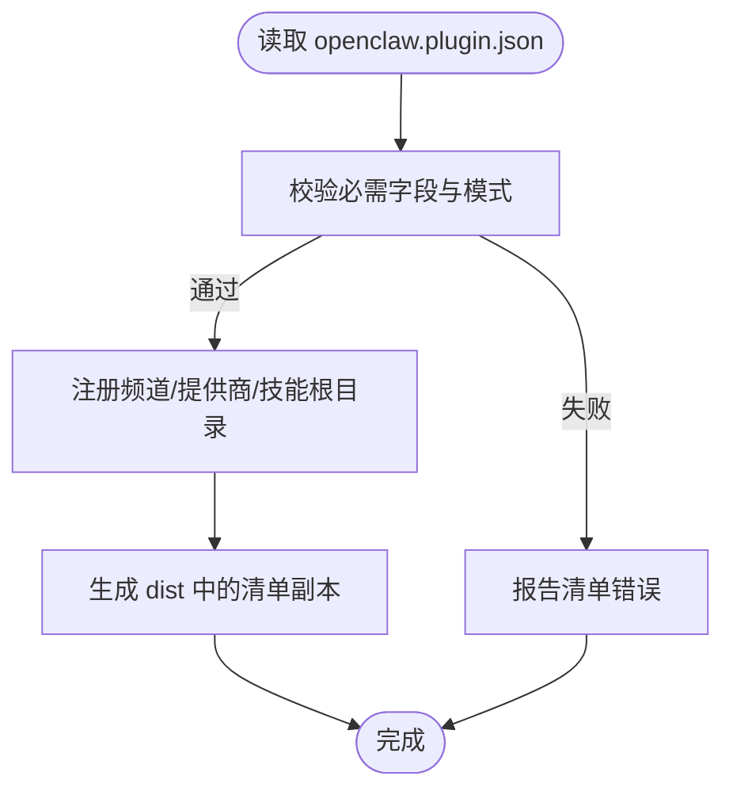
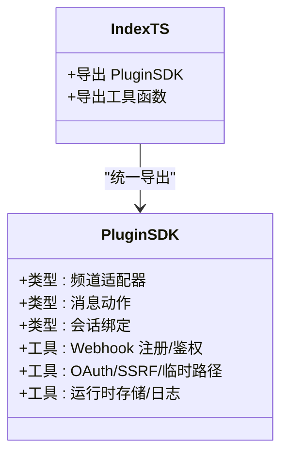
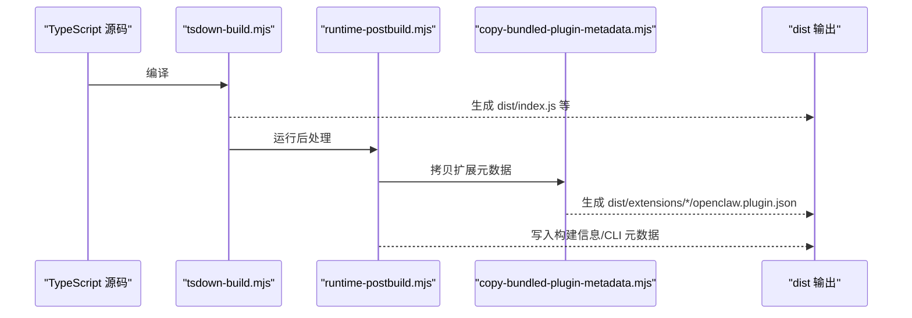
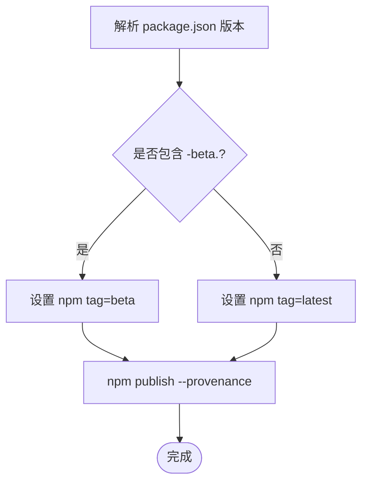
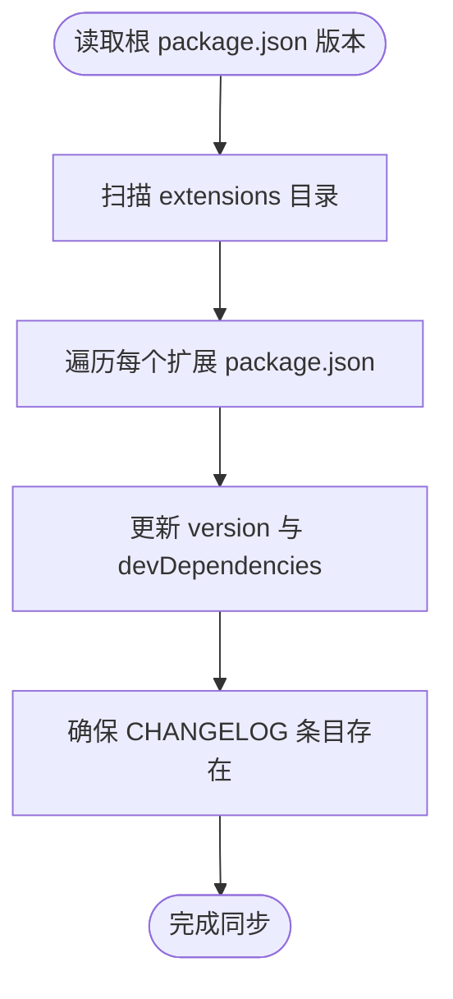
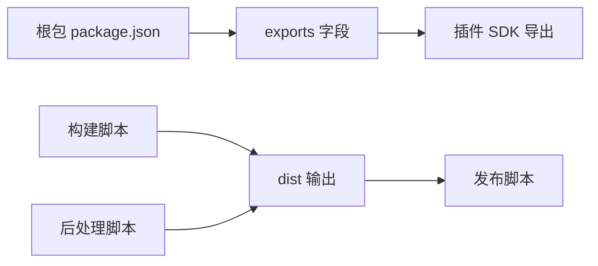

# 插件打包与发布

<cite>
**本文档引用的文件**
- [package.json](file://package.json)
- [README.md](file://README.md)
- [openclaw-npm-publish.sh](file://scripts/openclaw-npm-publish.sh)
- [openclaw-npm-release-check.ts](file://scripts/openclaw-npm-release-check.ts)
- [copy-bundled-plugin-metadata.mjs](file://scripts/copy-bundled-plugin-metadata.mjs)
- [sync-plugin-versions.ts](file://scripts/sync-plugin-versions.ts)
- [tsdown-build.mjs](file://scripts/tsdown-build.mjs)
- [runtime-postbuild.mjs](file://scripts/runtime-postbuild.mjs)
- [index.ts](file://src/plugin-sdk/index.ts)
- [manifest.md](file://docs/plugins/manifest.md)
- [bundles.md](file://docs/plugins/bundles.md)
- [RELEASING.md](file://docs/reference/RELEASING.md)
</cite>

## 目录
1. [简介](#简介)
2. [项目结构](#项目结构)
3. [核心组件](#核心组件)
4. [架构总览](#架构总览)
5. [详细组件分析](#详细组件分析)
6. [依赖关系分析](#依赖关系分析)
7. [性能考虑](#性能考虑)
8. [故障排除指南](#故障排除指南)
9. [结论](#结论)
10. [附录](#附录)

## 简介
本文件面向插件开发者与维护者，系统化阐述 OpenClaw 插件的打包、版本管理与发布策略。内容覆盖：
- 插件包结构规范与元数据组织
- 依赖管理与构建流程
- 版本命名与发布通道
- 自动化打包与发布脚本
- 插件更新机制、向后兼容性与升级策略
- 插件市场发布指南与质量标准

## 项目结构
OpenClaw 采用多语言混合工程：核心以 TypeScript 构建，插件生态通过 npm 包与扩展目录协同工作。关键目录与文件如下：
- 扩展目录 extensions：每个子目录代表一个插件，包含 openclaw.plugin.json 元数据与可选的 package.json
- 根级 package.json：定义主包导出、构建脚本与发布配置
- scripts：包含构建、拷贝插件元数据、同步版本、发布检查等脚本
- docs/plugins：官方插件文档，含清单与包格式规范
- src/plugin-sdk：插件 SDK 导出入口，统一对外 API

图表来源
- [package.json:1-481](file://package.json#L1-L481)
- [tsdown-build.mjs:1-21](file://scripts/tsdown-build.mjs#L1-L21)
- [runtime-postbuild.mjs:1-13](file://scripts/runtime-postbuild.mjs#L1-L13)
- [copy-bundled-plugin-metadata.mjs:1-206](file://scripts/copy-bundled-plugin-metadata.mjs#L1-L206)
- [index.ts:1-800](file://src/plugin-sdk/index.ts#L1-L800)

章节来源
- [package.json:1-481](file://package.json#L1-L481)
- [README.md:83-90](file://README.md#L83-L90)

## 核心组件
- 插件清单（openclaw.plugin.json）：定义插件 id、频道/提供商注册、认证环境变量、配置模式、技能根目录等。清单在不执行插件代码的前提下进行严格校验。
- 插件 SDK：集中导出插件开发所需类型、工具函数与适配器，统一跨频道能力接口。
- 构建与打包：通过 tsdown 编译、拷贝插件元数据到 dist、生成 d.ts、写入构建信息与 CLI 启动元数据。
- 发布与版本：遵循 CalVer 命名，区分 stable/beta/dev 三通道；发布脚本使用 GitHub OIDC 受信发布。

章节来源
- [manifest.md:1-100](file://docs/plugins/manifest.md#L1-L100)
- [bundles.md:1-293](file://docs/plugins/bundles.md#L1-L293)
- [index.ts:1-800](file://src/plugin-sdk/index.ts#L1-L800)
- [package.json:214-346](file://package.json#L214-L346)

## 架构总览
下图展示从源码到发布包的关键路径，以及插件清单与 SDK 的协作关系：

图表来源
- [tsdown-build.mjs:1-21](file://scripts/tsdown-build.mjs#L1-L21)
- [runtime-postbuild.mjs:1-13](file://scripts/runtime-postbuild.mjs#L1-L13)
- [copy-bundled-plugin-metadata.mjs:1-206](file://scripts/copy-bundled-plugin-metadata.mjs#L1-L206)
- [openclaw-npm-publish.sh:1-34](file://scripts/openclaw-npm-publish.sh#L1-L34)

## 详细组件分析

### 组件A：插件清单与元数据组织
- 必填字段：id、configSchema
- 可选字段：kind、channels、providers、providerAuthEnvVars、skills、name、description、uiHints、version
- 清单用于在不加载插件模块的情况下完成配置校验与发现
- 支持“捆绑包”布局（Codex/Claude/Cursor），但 OpenClaw 仅映射已支持的功能

图表来源
- [manifest.md:36-100](file://docs/plugins/manifest.md#L36-L100)
- [copy-bundled-plugin-metadata.mjs:129-201](file://scripts/copy-bundled-plugin-metadata.mjs#L129-L201)

章节来源
- [manifest.md:1-100](file://docs/plugins/manifest.md#L1-L100)
- [bundles.md:1-293](file://docs/plugins/bundles.md#L1-L293)

### 组件B：插件 SDK 类型与工具
- 集中导出：频道适配器、消息动作、会话绑定、Webhook 路由、OAuth 工具、SSRF 策略、运行时工具等
- 为插件提供统一的类型约束与运行时能力，降低跨频道差异带来的复杂度

图表来源
- [index.ts:1-800](file://src/plugin-sdk/index.ts#L1-L800)

章节来源
- [index.ts:1-800](file://src/plugin-sdk/index.ts#L1-L800)

### 组件C：构建与打包流水线
- 构建阶段：tsdown 编译、生成 d.ts、写入构建信息与 CLI 元数据
- 后处理阶段：复制插件元数据与技能、生成 SDK 根别名
- 文件输出：dist 目录包含编译后的 JS、类型声明与扩展清单

图表来源
- [tsdown-build.mjs:1-21](file://scripts/tsdown-build.mjs#L1-L21)
- [runtime-postbuild.mjs:1-13](file://scripts/runtime-postbuild.mjs#L1-L13)
- [copy-bundled-plugin-metadata.mjs:1-206](file://scripts/copy-bundled-plugin-metadata.mjs#L1-L206)

章节来源
- [package.json:214-346](file://package.json#L214-L346)

### 组件D：版本管理与发布通道
- 版本命名：稳定版 YYYY.M.D；预发行 beta YYYY.M.D-beta.N；dev 对应 main 分支
- 发布通道：stable → latest；beta → beta；dev → dev（按需）
- 发布脚本：自动识别 beta 版本并设置 npm tag；使用受信发布（GitHub OIDC）

图表来源
- [openclaw-npm-publish.sh:1-34](file://scripts/openclaw-npm-publish.sh#L1-L34)
- [RELEASING.md:11-26](file://docs/reference/RELEASING.md#L11-L26)

章节来源
- [openclaw-npm-publish.sh:1-34](file://scripts/openclaw-npm-publish.sh#L1-L34)
- [openclaw-npm-release-check.ts:1-322](file://scripts/openclaw-npm-release-check.ts#L1-L322)
- [RELEASING.md:1-43](file://docs/reference/RELEASING.md#L1-L43)

### 组件E：插件版本同步与变更记录
- 同步策略：将核心版本同步至各扩展包，确保一致性
- 变更记录：为每个扩展生成或前置版本条目，便于发布追踪

图表来源
- [sync-plugin-versions.ts:1-109](file://scripts/sync-plugin-versions.ts#L1-L109)

章节来源
- [sync-plugin-versions.ts:1-109](file://scripts/sync-plugin-versions.ts#L1-L109)

### 组件F：插件更新机制与向后兼容
- 更新策略：通过版本对齐与变更记录保证插件与核心版本一致
- 兼容性建议：
  - 使用 JSON Schema 严格约束配置，避免破坏性变更
  - 提供 providerAuthEnvVars 以减少运行时初始化成本
  - 保持 channels/providers 列表稳定，必要时通过 slots 或插件槽位选择替代实现

章节来源
- [manifest.md:54-100](file://docs/plugins/manifest.md#L54-L100)
- [sync-plugin-versions.ts:1-109](file://scripts/sync-plugin-versions.ts#L1-L109)

### 组件G：插件市场发布指南与质量标准
- 清单与包格式：遵循 openclaw.plugin.json 与 bundles 规范
- 质量标准：
  - 清单必须通过校验
  - 配置模式必须完整且最小化
  - 技能根目录与钩子包布局需在插件根内
  - 第三方包的安全边界：仅映射已支持功能，不执行任意运行时代码

章节来源
- [manifest.md:1-100](file://docs/plugins/manifest.md#L1-L100)
- [bundles.md:240-293](file://docs/plugins/bundles.md#L240-L293)

## 依赖关系分析
- 根包导出：通过 package.json 的 exports 字段暴露插件 SDK 子模块，便于外部消费
- 构建链路：构建脚本依赖 tsdown，后处理脚本依赖拷贝与 SDK 别名生成
- 发布链路：发布脚本依赖版本解析与通道判断，配合受信发布

图表来源
- [package.json:37-213](file://package.json#L37-L213)
- [tsdown-build.mjs:1-21](file://scripts/tsdown-build.mjs#L1-L21)
- [runtime-postbuild.mjs:1-13](file://scripts/runtime-postbuild.mjs#L1-L13)
- [openclaw-npm-publish.sh:1-34](file://scripts/openclaw-npm-publish.sh#L1-L34)

章节来源
- [package.json:1-481](file://package.json#L1-L481)

## 性能考虑
- 构建性能：tsdown 编译与后处理并行化，减少重复 I/O
- 插件加载：清单校验在加载前完成，避免无效插件影响启动时间
- 安全边界：捆绑包不执行任意运行时代码，降低运行时开销与风险

## 故障排除指南
- 发布失败
  - 检查版本命名与通道：确保 CalVer 格式正确且与标签匹配
  - 使用发布检查脚本验证 package.json 与标签一致性
- 清单校验失败
  - 确认 openclaw.plugin.json 字段完整且 JSON Schema 有效
  - 检查 channels/providers/skills 是否在插件根内
- 版本不同步
  - 使用版本同步脚本将核心版本应用到各扩展
  - 确保每个扩展 CHANGELOG 已包含对应版本条目

章节来源
- [openclaw-npm-release-check.ts:170-283](file://scripts/openclaw-npm-release-check.ts#L170-L283)
- [manifest.md:74-100](file://docs/plugins/manifest.md#L74-L100)
- [sync-plugin-versions.ts:10-27](file://scripts/sync-plugin-versions.ts#L10-L27)

## 结论
OpenClaw 的插件体系通过严格的清单校验、统一的 SDK 导出与清晰的发布通道，实现了可维护、可扩展与安全可控的插件生态。遵循本文档的打包与发布流程，可确保插件在质量、兼容性与安全性方面达到预期标准。

## 附录
- 自动化脚本示例路径
  - 构建：[构建脚本:1-21](file://scripts/tsdown-build.mjs#L1-L21)
  - 后处理：[后处理脚本:1-13](file://scripts/runtime-postbuild.mjs#L1-L13)
  - 拷贝插件元数据：[拷贝脚本:1-206](file://scripts/copy-bundled-plugin-metadata.mjs#L1-L206)
  - 同步插件版本：[同步脚本:1-109](file://scripts/sync-plugin-versions.ts#L1-L109)
  - 发布检查：[发布检查脚本:1-322](file://scripts/openclaw-npm-release-check.ts#L1-L322)
  - 发布执行：[发布脚本:1-34](file://scripts/openclaw-npm-publish.sh#L1-L34)
- 文档参考
  - 插件清单规范：[清单文档:1-100](file://docs/plugins/manifest.md#L1-L100)
  - 插件包格式：[包格式文档:1-293](file://docs/plugins/bundles.md#L1-L293)
  - 发布策略：[发布策略文档:1-43](file://docs/reference/RELEASING.md#L1-L43)