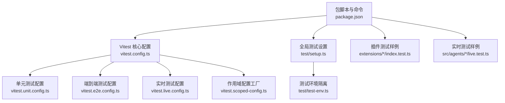
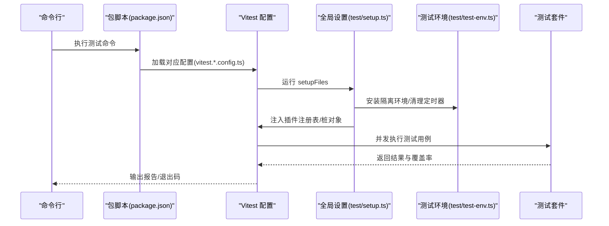
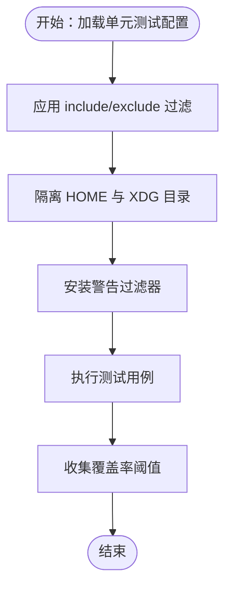
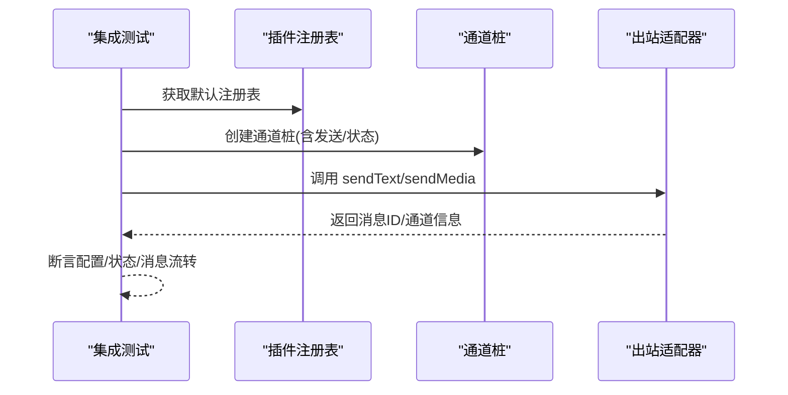
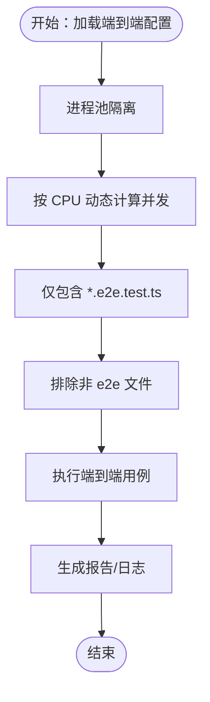
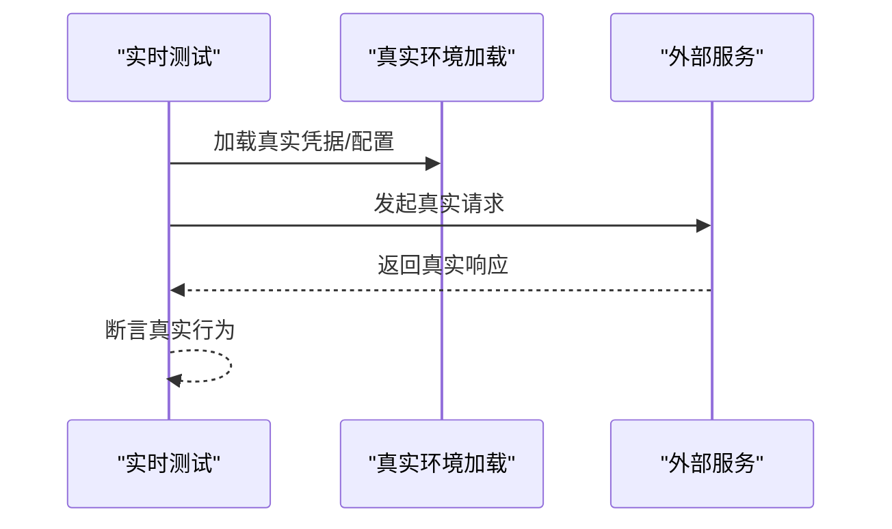
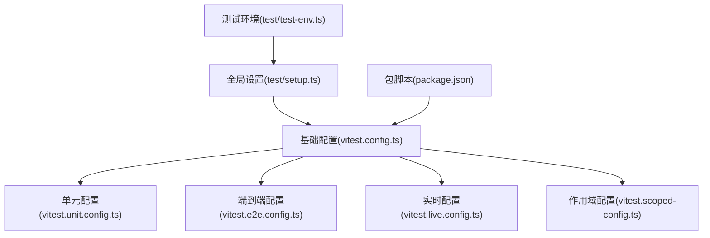

# 插件测试与调试

<cite>
**本文引用的文件**
- [vitest.config.ts](file://vitest.config.ts)
- [vitest.unit.config.ts](file://vitest.unit.config.ts)
- [vitest.e2e.config.ts](file://vitest.e2e.config.ts)
- [vitest.live.config.ts](file://vitest.live.config.ts)
- [vitest.scoped-config.ts](file://vitest.scoped-config.ts)
- [test/setup.ts](file://test/setup.ts)
- [test/global-setup.ts](file://test/global-setup.ts)
- [test/test-env.ts](file://test/test-env.ts)
- [package.json](file://package.json)
- [extensions/*/index.test.ts](file://extensions/anthropic/index.test.ts)
- [extensions/*/index.test.ts](file://extensions/github-copilot/index.test.ts)
- [extensions/*/index.test.ts](file://extensions/firecrawl/index.test.ts)
- [extensions/*/index.test.ts](file://extensions/google/oauth.test.ts)
- [extensions/*/index.test.ts](file://extensions/openai/index.test.ts)
- [extensions/*/index.test.ts](file://extensions/telegram/src/bot.media.downloads-media-file-path-no-file-download.e2e.test.ts)
- [extensions/*/index.test.ts](file://extensions/whatsapp/src/auto-reply.web-auto-reply.connection-and-logging.e2e.test.ts)
- [src/agents/*/live.test.ts](file://src/agents/anthropic.setup-token.live.test.ts)
- [src/agents/*/live.test.ts](file://src/agents/google-gemini-switch.live.test.ts)
- [src/agents/*/live.test.ts](file://src/media-understanding/providers/deepgram/audio.live.test.ts)
</cite>

## 目录
1. [引言](#引言)
2. [项目结构](#项目结构)
3. [核心组件](#核心组件)
4. [架构总览](#架构总览)
5. [详细组件分析](#详细组件分析)
6. [依赖分析](#依赖分析)
7. [性能考虑](#性能考虑)
8. [故障排查指南](#故障排查指南)
9. [结论](#结论)
10. [附录](#附录)

## 引言
本文件面向插件开发者与测试工程师，系统化介绍 OpenClaw 的插件测试与调试体系，覆盖单元测试、集成测试、端到端测试与实时（Live）测试的策略与实践；提供调试技巧、日志记录与问题排查方法；并给出测试工具、模拟环境与测试数据准备的使用说明，以及性能、安全与兼容性测试的最佳实践。

## 项目结构
OpenClaw 采用多包工作区，测试框架以 Vitest 为核心，结合多种配置文件实现不同粒度的测试隔离与执行策略。测试相关的关键目录与文件如下：
- 测试运行与配置：vitest.config.ts、vitest.unit.config.ts、vitest.e2e.config.ts、vitest.live.config.ts、vitest.scoped-config.ts
- 全局测试设置：test/setup.ts、test/global-setup.ts、test/test-env.ts
- 包脚本与测试命令：package.json 中的 scripts 节点
- 插件测试样例：extensions/*/index.test.ts 等
- 实时测试样例：src/agents/*/live.test.ts 等

**图示来源**
- [vitest.config.ts:1-156](file://vitest.config.ts#L1-L156)
- [vitest.unit.config.ts:1-28](file://vitest.unit.config.ts#L1-L28)
- [vitest.e2e.config.ts:1-33](file://vitest.e2e.config.ts#L1-L33)
- [vitest.live.config.ts:1-17](file://vitest.live.config.ts#L1-L17)
- [vitest.scoped-config.ts:1-18](file://vitest.scoped-config.ts#L1-L18)
- [test/setup.ts:1-194](file://test/setup.ts#L1-L194)
- [test/test-env.ts:1-148](file://test/test-env.ts#L1-L148)
- [package.json:214-345](file://package.json#L214-L345)

**章节来源**
- [vitest.config.ts:1-156](file://vitest.config.ts#L1-L156)
- [package.json:214-345](file://package.json#L214-L345)

## 核心组件
- 测试框架与配置
  - Vitest 核心配置定义了别名解析、超时、池类型、并发与覆盖率策略等。
  - 单元测试配置通过过滤 include/exclude 缩小范围，聚焦纯函数与模块级逻辑。
  - 端到端测试配置强调进程隔离与确定性执行，适合跨进程/跨服务场景。
  - 实时测试配置限制并发为 1，适合需要真实外部服务交互的场景。
  - 作用域配置工厂用于快速生成针对特定子树的测试配置。
- 全局测试设置
  - 安装测试环境、隔离 HOME/XDG 目录、注入警告过滤器、预置插件注册表、清理定时器等。
  - 提供默认通道插件桩，便于在无真实通道令牌的情况下进行发送与状态检查。
- 包脚本与命令
  - 提供统一入口：test、test:fast、test:e2e、test:live、test:coverage 等，支持并行与分层测试。

**章节来源**
- [vitest.config.ts:12-156](file://vitest.config.ts#L12-L156)
- [vitest.unit.config.ts:11-27](file://vitest.unit.config.ts#L11-L27)
- [vitest.e2e.config.ts:20-32](file://vitest.e2e.config.ts#L20-L32)
- [vitest.live.config.ts:8-16](file://vitest.live.config.ts#L8-L16)
- [test/setup.ts:34-194](file://test/setup.ts#L34-L194)
- [test/test-env.ts:54-148](file://test/test-env.ts#L54-L148)
- [package.json:306-345](file://package.json#L306-L345)

## 架构总览
下图展示测试生命周期与关键组件之间的交互关系：

**图示来源**
- [package.json:306-345](file://package.json#L306-L345)
- [vitest.config.ts:30-61](file://vitest.config.ts#L30-L61)
- [test/setup.ts:34-194](file://test/setup.ts#L34-L194)
- [test/test-env.ts:54-148](file://test/test-env.ts#L54-L148)

## 详细组件分析

### 单元测试（Unit Test）
- 目标与范围
  - 验证纯函数、工具函数、模型与配置解析等可独立验证的逻辑。
  - 通过缩小 include/exclude 范围，避免引入大面集成模块导致的不稳定。
- 关键策略
  - 使用作用域配置工厂按需筛选文件，减少无关模块干扰。
  - 在 setup 中安装警告过滤器与隔离 HOME，避免跨文件污染。
  - 利用环境变量控制缓存与监听上限，提升稳定性。
- 常见用例
  - 插件配置校验、Schema 校验、账户解析、消息路由等。
  - 参考路径：[extensions/*/index.test.ts](file://extensions/anthropic/index.test.ts)

**图示来源**
- [vitest.unit.config.ts:6-26](file://vitest.unit.config.ts#L6-L26)
- [test/setup.ts:13-23](file://test/setup.ts#L13-L23)
- [test/test-env.ts:54-148](file://test/test-env.ts#L54-L148)

**章节来源**
- [vitest.unit.config.ts:1-28](file://vitest.unit.config.ts#L1-L28)
- [test/setup.ts:13-23](file://test/setup.ts#L13-L23)
- [extensions/anthropic/index.test.ts](file://extensions/anthropic/index.test.ts)

### 集成测试（Integration Test）
- 目标与范围
  - 验证模块间协作、适配器与通道的组合行为，关注配置解析、会话管理与消息投递。
- 关键策略
  - 在 setup 中预置默认插件注册表与通道桩，确保发送/状态检查可用。
  - 通过环境隔离避免真实凭据泄漏与状态污染。
- 常见用例
  - 渠道配置解析、账户选择、消息发送与媒体发送、状态汇总等。
  - 参考路径：[test/setup.ts:83-175](file://test/setup.ts#L83-L175)

**图示来源**
- [test/setup.ts:83-175](file://test/setup.ts#L83-L175)

**章节来源**
- [test/setup.ts:83-175](file://test/setup.ts#L83-L175)

### 端到端测试（E2E Test）
- 目标与范围
  - 模拟真实用户流程，覆盖跨进程、跨服务与真实网络交互。
- 关键策略
  - 使用进程池（forks）保证文件间状态隔离，避免 vmForks 导致的状态泄漏。
  - 支持通过环境变量控制并发与输出详细程度，便于 CI 与本地调试。
  - 仅包含 e2e 文件，排除非 e2e 文件，确保测试集聚焦。
- 常见用例
  - 插件与渠道的完整消息链路、媒体下载、自动回复连接与日志等。
  - 参考路径：[extensions/*/index.test.ts](file://extensions/telegram/src/bot.media.downloads-media-file-path-no-file-download.e2e.test.ts)

**图示来源**
- [vitest.e2e.config.ts:20-32](file://vitest.e2e.config.ts#L20-L32)

**章节来源**
- [vitest.e2e.config.ts:1-33](file://vitest.e2e.config.ts#L1-L33)
- [extensions/telegram/src/bot.media.downloads-media-file-path-no-file-download.e2e.test.ts](file://extensions/telegram/src/bot.media.downloads-media-file-path-no-file-download.e2e.test.ts)

### 实时测试（Live Test）
- 目标与范围
  - 与真实外部服务交互，验证认证、模型切换、媒体流等真实场景。
- 关键策略
  - 限制并发为 1，避免资源竞争与状态冲突。
  - 通过全局设置加载用户真实环境（如 ~/.profile），确保真实凭据可用。
- 常见用例
  - 认证轮换、模型切换、音频流等。
  - 参考路径：[src/agents/*/live.test.ts](file://src/agents/anthropic.setup-token.live.test.ts)

**图示来源**
- [vitest.live.config.ts:8-16](file://vitest.live.config.ts#L8-L16)
- [test/test-env.ts:54-65](file://test/test-env.ts#L54-L65)

**章节来源**
- [vitest.live.config.ts:1-17](file://vitest.live.config.ts#L1-L17)
- [test/test-env.ts:54-65](file://test/test-env.ts#L54-L65)
- [src/agents/anthropic.setup-token.live.test.ts](file://src/agents/anthropic.setup-token.live.test.ts)

### 测试工具与模拟环境
- 环境隔离
  - 通过临时 HOME 与 XDG 目录隔离真实状态，避免端口冲突与凭据泄漏。
  - 支持在 LIVE 模式下加载用户真实环境变量。
- 插件注册表与通道桩
  - 默认注册表包含多个通道插件，便于在无真实令牌情况下进行发送与状态检查。
  - 通道桩支持直连与网关两种投递模式，并提供媒体发送能力。
- 警告过滤与定时器清理
  - 安装警告过滤器降低噪音，清理假定时器避免跨文件泄漏。

**章节来源**
- [test/test-env.ts:54-148](file://test/test-env.ts#L54-L148)
- [test/setup.ts:34-194](file://test/setup.ts#L34-L194)

### 测试数据准备与环境配置
- 数据准备
  - 使用通道桩构造最小化输入，复用默认注册表，减少外部依赖。
  - 对于需要真实数据的场景，使用实时测试并在安全环境下运行。
- 环境配置
  - 通过环境变量控制测试行为（如并发、输出详细程度、是否使用真实环境）。
  - 在 CI 中自动调整并发与超时，确保稳定与可重复。

**章节来源**
- [vitest.e2e.config.ts:6-15](file://vitest.e2e.config.ts#L6-L15)
- [test/test-env.ts:54-148](file://test/test-env.ts#L54-L148)

## 依赖分析
- 组件耦合
  - 测试配置之间通过继承与组合形成清晰层次：核心配置 -> 单元/端到端/实时/作用域配置。
  - 全局设置对环境隔离与注册表初始化有强依赖，确保测试稳定性。
- 外部依赖
  - 通过包脚本统一调度，便于在 CI 与本地一致地执行测试。
  - 覆盖率策略仅统计实际被测试套件覆盖的源文件，避免过度排除。

**图示来源**
- [vitest.config.ts:12-156](file://vitest.config.ts#L12-L156)
- [vitest.unit.config.ts:11-27](file://vitest.unit.config.ts#L11-L27)
- [vitest.e2e.config.ts:20-32](file://vitest.e2e.config.ts#L20-L32)
- [vitest.live.config.ts:8-16](file://vitest.live.config.ts#L8-L16)
- [vitest.scoped-config.ts:4-17](file://vitest.scoped-config.ts#L4-L17)
- [test/setup.ts:34-194](file://test/setup.ts#L34-L194)
- [test/test-env.ts:54-148](file://test/test-env.ts#L54-L148)
- [package.json:306-345](file://package.json#L306-L345)

**章节来源**
- [vitest.config.ts:12-156](file://vitest.config.ts#L12-L156)
- [package.json:306-345](file://package.json#L306-L345)

## 性能考虑
- 并发与池类型
  - 单元测试使用进程池（forks）与合理的工作线程数，平衡速度与稳定性。
  - 端到端测试默认串行或低并发，确保跨进程隔离与可重复性。
  - 实时测试固定为 1 并发，避免资源争用。
- 超时与稳定性
  - 根据平台与 CI 环境动态调整钩子与测试超时，减少误判。
- 覆盖率与开销
  - 仅统计被实际测试覆盖的源文件，避免不必要的排除列表增长。

**章节来源**
- [vitest.config.ts:30-40](file://vitest.config.ts#L30-L40)
- [vitest.e2e.config.ts:6-15](file://vitest.e2e.config.ts#L6-L15)
- [vitest.live.config.ts:10-12](file://vitest.live.config.ts#L10-L12)

## 故障排查指南
- 环境变量与凭据
  - 若测试访问真实服务失败，确认是否处于实时测试模式且已正确加载用户环境。
  - 避免在非实时测试中泄露真实凭据，使用通道桩与隔离环境。
- 跨文件污染
  - 若出现假定时器或环境泄漏，检查是否在 afterEach 中恢复默认注册表与实时时钟。
- 并发与隔离
  - 端到端测试若出现不稳定，尝试降低并发或启用详细输出以便定位。
- 日志与报告
  - 使用详细输出开关与覆盖率报告定位未覆盖路径，补充针对性用例。

**章节来源**
- [test/test-env.ts:54-148](file://test/test-env.ts#L54-L148)
- [test/setup.ts:185-194](file://test/setup.ts#L185-L194)
- [vitest.e2e.config.ts:15-29](file://vitest.e2e.config.ts#L15-L29)

## 结论
OpenClaw 的测试体系通过分层配置与严格的环境隔离，实现了从单元到端到端与实时测试的全链路覆盖。配合通道桩与默认注册表，开发者可以在不依赖真实凭据的情况下完成大部分验证；同时通过实时测试保障与外部服务的真实交互质量。建议在日常开发中优先编写单元与集成测试，必要时再扩展端到端与实时测试，以获得更高的性价比与稳定性。

## 附录
- 快速参考
  - 单元测试：使用 test:fast 或 test:coverage 命令，聚焦 src 与 extensions 下的纯逻辑。
  - 端到端测试：使用 test:e2e 命令，注意并发与输出详细程度。
  - 实时测试：使用 test:live 命令，确保凭据与网络环境可用。
  - 插件测试样例：参考 extensions/*/index.test.ts 与 e2e 测试文件。
  - 实时测试样例：参考 src/agents/*/live.test.ts。

**章节来源**
- [package.json:306-345](file://package.json#L306-L345)
- [extensions/anthropic/index.test.ts](file://extensions/anthropic/index.test.ts)
- [extensions/telegram/src/bot.media.downloads-media-file-path-no-file-download.e2e.test.ts](file://extensions/telegram/src/bot.media.downloads-media-file-path-no-file-download.e2e.test.ts)
- [src/agents/anthropic.setup-token.live.test.ts](file://src/agents/anthropic.setup-token.live.test.ts)