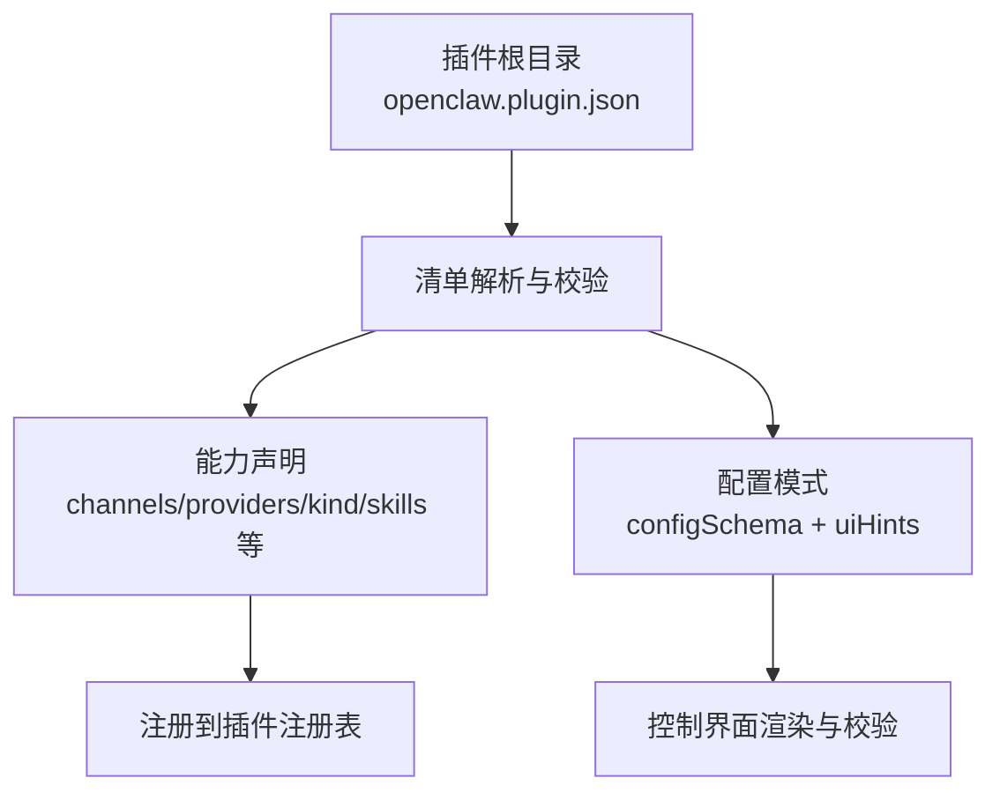
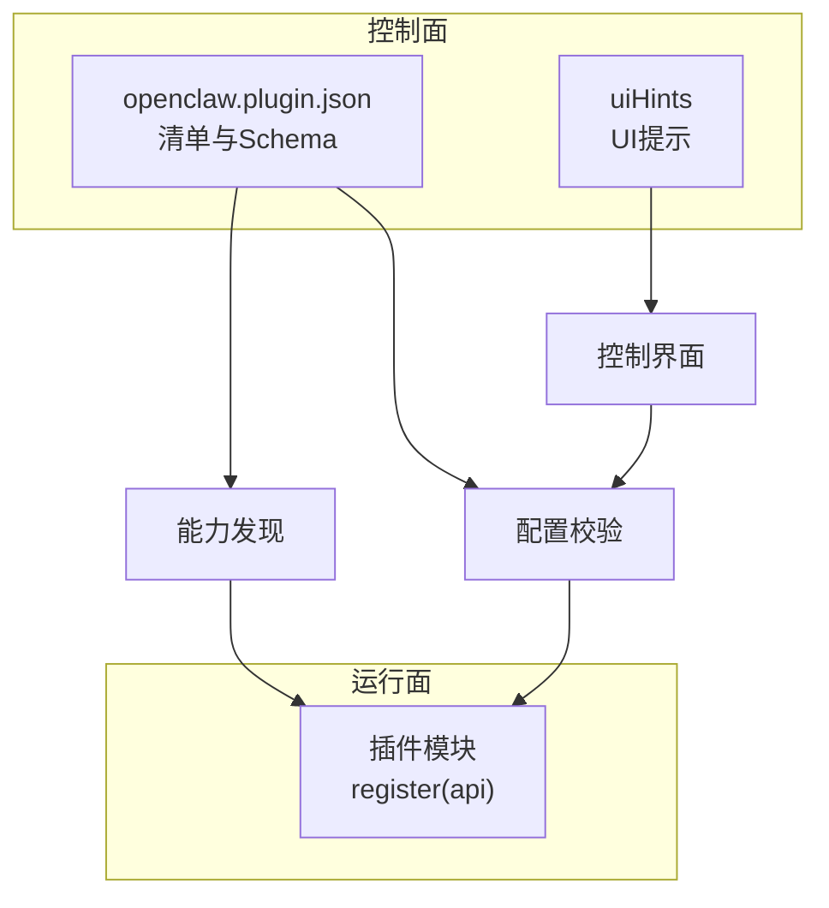
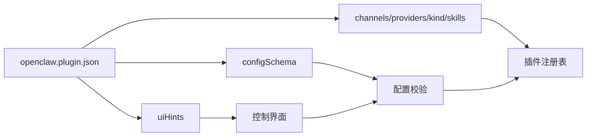

# 插件清单文件

<cite>
**本文引用的文件**
- [docs/plugins/manifest.md](file://docs/plugins/manifest.md)
- [docs/tools/plugin.md](file://docs/tools/plugin.md)
- [extensions/anthropic/openclaw.plugin.json](file://extensions/anthropic/openclaw.plugin.json)
- [extensions/discord/openclaw.plugin.json](file://extensions/discord/openclaw.plugin.json)
- [extensions/google/openclaw.plugin.json](file://extensions/google/openclaw.plugin.json)
- [extensions/brave/openclaw.plugin.json](file://extensions/brave/openclaw.plugin.json)
- [extensions/firecrawl/openclaw.plugin.json](file://extensions/firecrawl/openclaw.plugin.json)
- [extensions/openshell/openclaw.plugin.json](file://extensions/openshell/openclaw.plugin.json)
- [extensions/memory-core/openclaw.plugin.json](file://extensions/memory-core/openclaw.plugin.json)
- [extensions/diffs/openclaw.plugin.json](file://extensions/diffs/openclaw.plugin.json)
- [extensions/voice-call/openclaw.plugin.json](file://extensions/voice-call/openclaw.plugin.json)
- [extensions/memory-lancedb/openclaw.plugin.json](file://extensions/memory-lancedb/openclaw.plugin.json)
</cite>

## 目录
1. [简介](#简介)
2. [项目结构](#项目结构)
3. [核心组件](#核心组件)
4. [架构总览](#架构总览)
5. [详细组件分析](#详细组件分析)
6. [依赖关系分析](#依赖关系分析)
7. [性能考量](#性能考量)
8. [故障排查指南](#故障排查指南)
9. [结论](#结论)
10. [附录](#附录)

## 简介
本文件系统性阐述 OpenClaw 原生插件清单文件 openclaw.plugin.json 的完整结构与字段定义，覆盖必需字段与可选字段、JSON Schema 验证规则、插件 ID 规范、配置模式与 UI 提示设置，并提供语法检查、错误诊断与最佳实践建议。同时通过多类插件清单示例，展示不同插件类型（如通道、提供商、内存插件等）在配置上的差异。

## 项目结构
OpenClaw 将原生插件清单文件放置于每个插件根目录，作为“清单 + 发现”的元数据来源。官方文档对清单位置、发现顺序、启用规则与安全边界有明确约束，确保在不执行插件代码的前提下完成配置校验与能力声明。

图示来源
- [docs/tools/plugin.md:64-86](file://docs/tools/plugin.md#L64-L86)
- [docs/plugins/manifest.md:29-34](file://docs/plugins/manifest.md#L29-L34)

章节来源
- [docs/tools/plugin.md:64-86](file://docs/tools/plugin.md#L64-L86)
- [docs/plugins/manifest.md:29-34](file://docs/plugins/manifest.md#L29-L34)

## 核心组件
- 清单文件：位于插件根目录，声明插件标识、能力、配置模式与 UI 提示。
- 配置模式：通过 JSON Schema 定义插件配置的结构、类型、默认值与约束。
- UI 提示：为控制界面生成标签、帮助文本、占位符与敏感标记，支持高级配置折叠。
- 能力声明：channels（通道）、providers（提供商）、skills（技能目录）、kind（插件种类）等。

章节来源
- [docs/plugins/manifest.md:36-67](file://docs/plugins/manifest.md#L36-L67)
- [docs/tools/plugin.md:199-214](file://docs/tools/plugin.md#L199-L214)

## 架构总览
清单驱动的插件系统分为四层：清单与发现、启用与校验、运行时加载、表面消费。清单是控制面的权威来源，用于识别插件、发现能力、校验配置并增强 UI 标签。

图示来源
- [docs/tools/plugin.md:458-470](file://docs/tools/plugin.md#L458-L470)
- [docs/plugins/manifest.md:68-84](file://docs/plugins/manifest.md#L68-L84)

章节来源
- [docs/tools/plugin.md:458-470](file://docs/tools/plugin.md#L458-L470)
- [docs/plugins/manifest.md:68-84](file://docs/plugins/manifest.md#L68-L84)

## 详细组件分析

### 字段定义与规范
- 必需字段
  - id：插件的规范标识（字符串），用于在配置与启用中引用。
  - configSchema：内联 JSON Schema，用于校验插件配置；即使无配置也必须提供空对象模式。
- 可选字段
  - kind：插件种类（如 memory、context-engine），用于独占槽位选择。
  - channels：该插件注册的通道标识数组。
  - providers：该插件注册的提供商标识数组。
  - providerAuthEnvVars：按提供商分组的认证环境变量名列表，便于在不加载运行时的情况下进行环境探测。
  - skills：相对插件根目录的技能目录数组。
  - name/description：显示名称与简述。
  - uiHints：配置项的 UI 提示集合，支持 label/help/placeholder/sensitive/advanced 等键。
  - version：插件版本（信息性）。

章节来源
- [docs/plugins/manifest.md:36-67](file://docs/plugins/manifest.md#L36-L67)
- [docs/plugins/manifest.md:68-72](file://docs/plugins/manifest.md#L68-L72)

### JSON Schema 要求与验证行为
- 每个插件必须提供 JSON Schema，且在配置读写时进行严格校验，而非运行时。
- 未知通道键或未知插件 id 引用将被视为错误。
- 若清单缺失、损坏或 schema 不合法，Doctor 会报告插件错误；禁用状态下的配置会被保留并在 Doctor 与日志中给出警告。

章节来源
- [docs/plugins/manifest.md:68-84](file://docs/plugins/manifest.md#L68-L84)

### 插件 ID 规范
- id 为字符串，应具备唯一性与可引用性，用于 plugins.entries.<id>.config、plugins.slots.* 以及 Doctor 报告中引用。
- 同一 id 的多个插件源按优先级覆盖，工作区插件可有意覆盖内置扩展。

章节来源
- [docs/plugins/manifest.md:76-83](file://docs/plugins/manifest.md#L76-L83)
- [docs/tools/plugin.md:753-752](file://docs/tools/plugin.md#L753-L752)

### 配置模式定义
- configSchema 使用 JSON Schema 对配置进行强类型约束，支持：
  - 类型：string/number/boolean/array/object
  - 约束：enum、minimum、maximum、pattern、additionalProperties=false 等
  - 结构：嵌套对象与 required 字段
- 示例涵盖从极简空模式到复杂多层嵌套的场景。

章节来源
- [extensions/anthropic/openclaw.plugin.json:1-13](file://extensions/anthropic/openclaw.plugin.json#L1-L13)
- [extensions/discord/openclaw.plugin.json:1-10](file://extensions/discord/openclaw.plugin.json#L1-L10)
- [extensions/google/openclaw.plugin.json:1-13](file://extensions/google/openclaw.plugin.json#L1-L13)
- [extensions/brave/openclaw.plugin.json:1-9](file://extensions/brave/openclaw.plugin.json#L1-L9)
- [extensions/firecrawl/openclaw.plugin.json:1-9](file://extensions/firecrawl/openclaw.plugin.json#L1-L9)
- [extensions/openshell/openclaw.plugin.json:1-100](file://extensions/openshell/openclaw.plugin.json#L1-L100)
- [extensions/diffs/openclaw.plugin.json:68-182](file://extensions/diffs/openclaw.plugin.json#L68-L182)
- [extensions/memory-lancedb/openclaw.plugin.json:48-88](file://extensions/memory-lancedb/openclaw.plugin.json#L48-L88)

### UI 提示设置
- uiHints 支持：
  - label：字段标签
  - help：帮助说明
  - placeholder：占位符
  - sensitive：敏感字段（如密钥）
  - advanced：高级配置（默认折叠）
- 复杂插件（如 voice-call、memory-lancedb、diffs）展示了丰富的 UI 提示层次与分组。

章节来源
- [extensions/voice-call/openclaw.plugin.json:3-161](file://extensions/voice-call/openclaw.plugin.json#L3-L161)
- [extensions/memory-lancedb/openclaw.plugin.json:4-47](file://extensions/memory-lancedb/openclaw.plugin.json#L4-L47)
- [extensions/diffs/openclaw.plugin.json:6-67](file://extensions/diffs/openclaw.plugin.json#L6-L67)

### 典型插件类型与配置差异
- 通道插件（如 discord）：声明 channels 并提供最小化配置模式。
- 提供商插件（如 anthropic、google）：声明 providers 与 providerAuthEnvVars，便于凭据环境变量探测。
- 内存插件（如 memory-core、memory-lancedb）：声明 kind 为 memory，并提供嵌入式模型与数据库路径等配置。
- 工具/沙箱插件（如 openshell）：提供命令、网关、策略、超时等参数的配置模式与 UI 提示。
- 复杂 UI 插件（如 diffs、voice-call）：多层次嵌套配置与大量 UI 提示，覆盖主题、布局、远程访问、流式通话等。

章节来源
- [extensions/discord/openclaw.plugin.json:1-10](file://extensions/discord/openclaw.plugin.json#L1-L10)
- [extensions/anthropic/openclaw.plugin.json:1-13](file://extensions/anthropic/openclaw.plugin.json#L1-L13)
- [extensions/google/openclaw.plugin.json:1-13](file://extensions/google/openclaw.plugin.json#L1-L13)
- [extensions/memory-core/openclaw.plugin.json:1-10](file://extensions/memory-core/openclaw.plugin.json#L1-L10)
- [extensions/memory-lancedb/openclaw.plugin.json:1-89](file://extensions/memory-lancedb/openclaw.plugin.json#L1-L89)
- [extensions/openshell/openclaw.plugin.json:1-100](file://extensions/openshell/openclaw.plugin.json#L1-L100)
- [extensions/diffs/openclaw.plugin.json:1-183](file://extensions/diffs/openclaw.plugin.json#L1-L183)
- [extensions/voice-call/openclaw.plugin.json:1-612](file://extensions/voice-call/openclaw.plugin.json#L1-L612)

## 依赖关系分析
- 清单与能力声明
  - channels/providers/kind/skills/uiHints 由清单声明，影响启用决策与 UI 呈现。
- 清单与配置模式
  - configSchema 与 uiHints 共同决定配置校验与 UI 渲染。
- 清单与运行时
  - 运行时模块负责实际注册工具、HTTP 路由、服务等，但清单阶段已完成发现与校验。

图示来源
- [docs/tools/plugin.md:458-470](file://docs/tools/plugin.md#L458-L470)
- [docs/plugins/manifest.md:68-84](file://docs/plugins/manifest.md#L68-L84)

章节来源
- [docs/tools/plugin.md:458-470](file://docs/tools/plugin.md#L458-L470)
- [docs/plugins/manifest.md:68-84](file://docs/plugins/manifest.md#L68-L84)

## 性能考量
- 清单与发现使用短生命周期缓存，减少启动与重复命令的开销；可通过环境变量禁用或调整缓存窗口。
- 在大规模插件场景下，保持 configSchema 精简与合理分组，有助于提升 Doctor 与 UI 的响应速度。

章节来源
- [docs/tools/plugin.md:649-657](file://docs/tools/plugin.md#L649-L657)

## 故障排查指南
- 常见错误
  - 缺失或非法清单：导致安装/启用失败，Doctor 报错。
  - 未知通道键或未知插件 id：在配置引用中出现将被判定为错误。
  - 禁用插件仍存在配置：会保留并在 Doctor 中给出警告。
- 排查步骤
  - 使用 Doctor 检查插件错误与警告。
  - 校验 configSchema 是否与实际配置一致。
  - 检查 uiHints 的键是否与 configSchema 对齐。
  - 确认 id 唯一且未与其他插件冲突。

章节来源
- [docs/plugins/manifest.md:74-84](file://docs/plugins/manifest.md#L74-L84)

## 结论
openclaw.plugin.json 是 OpenClaw 插件系统的控制面核心，承担“发现 + 校验 + UI 增强”的职责。遵循本文档的字段规范、Schema 设计与 UI 提示约定，可显著提升插件质量与用户体验；同时，严格的验证与安全边界保障了系统稳定性与安全性。

## 附录

### 字段一览与示例路径
- 必需字段
  - id：示例路径参见 [extensions/anthropic/openclaw.plugin.json](file://extensions/anthropic/openclaw.plugin.json#L2)、[extensions/discord/openclaw.plugin.json](file://extensions/discord/openclaw.plugin.json#L2)
  - configSchema：示例路径参见 [extensions/anthropic/openclaw.plugin.json:7-11](file://extensions/anthropic/openclaw.plugin.json#L7-L11)、[extensions/openshell/openclaw.plugin.json:5-47](file://extensions/openshell/openclaw.plugin.json#L5-L47)
- 可选字段
  - kind：示例路径参见 [extensions/memory-core/openclaw.plugin.json](file://extensions/memory-core/openclaw.plugin.json#L3)
  - channels/providers：示例路径参见 [extensions/discord/openclaw.plugin.json](file://extensions/discord/openclaw.plugin.json#L3)、[extensions/anthropic/openclaw.plugin.json:3-6](file://extensions/anthropic/openclaw.plugin.json#L3-L6)
  - providerAuthEnvVars：示例路径参见 [extensions/anthropic/openclaw.plugin.json:4-6](file://extensions/anthropic/openclaw.plugin.json#L4-L6)
  - skills：示例路径参见 [extensions/diffs/openclaw.plugin.json](file://extensions/diffs/openclaw.plugin.json#L5)
  - name/description/version：示例路径参见 [extensions/diffs/openclaw.plugin.json:3-4](file://extensions/diffs/openclaw.plugin.json#L3-L4)
  - uiHints：示例路径参见 [extensions/voice-call/openclaw.plugin.json:3-161](file://extensions/voice-call/openclaw.plugin.json#L3-L161)、[extensions/memory-lancedb/openclaw.plugin.json:4-47](file://extensions/memory-lancedb/openclaw.plugin.json#L4-L47)

### JSON Schema 示例与验证规则
- 最小 Schema（无配置）
  - 示例路径：[extensions/brave/openclaw.plugin.json:3-7](file://extensions/brave/openclaw.plugin.json#L3-L7)、[extensions/firecrawl/openclaw.plugin.json:3-7](file://extensions/firecrawl/openclaw.plugin.json#L3-L7)
- 复杂 Schema（含嵌套与枚举）
  - 示例路径：[extensions/openshell/openclaw.plugin.json:5-47](file://extensions/openshell/openclaw.plugin.json#L5-L47)
  - 示例路径：[extensions/diffs/openclaw.plugin.json:68-182](file://extensions/diffs/openclaw.plugin.json#L68-L182)
  - 示例路径：[extensions/memory-lancedb/openclaw.plugin.json:48-88](file://extensions/memory-lancedb/openclaw.plugin.json#L48-L88)
  - 示例路径：[extensions/voice-call/openclaw.plugin.json:162-610](file://extensions/voice-call/openclaw.plugin.json#L162-L610)
- 验证规则
  - additionalProperties=false：禁止未声明字段
  - enum/minimum/maximum/pattern：约束取值范围与格式
  - required：声明必填子对象或属性

章节来源
- [extensions/brave/openclaw.plugin.json:3-7](file://extensions/brave/openclaw.plugin.json#L3-L7)
- [extensions/firecrawl/openclaw.plugin.json:3-7](file://extensions/firecrawl/openclaw.plugin.json#L3-L7)
- [extensions/openshell/openclaw.plugin.json:5-47](file://extensions/openshell/openclaw.plugin.json#L5-L47)
- [extensions/diffs/openclaw.plugin.json:68-182](file://extensions/diffs/openclaw.plugin.json#L68-L182)
- [extensions/memory-lancedb/openclaw.plugin.json:48-88](file://extensions/memory-lancedb/openclaw.plugin.json#L48-L88)
- [extensions/voice-call/openclaw.plugin.json:162-610](file://extensions/voice-call/openclaw.plugin.json#L162-L610)
- [docs/plugins/manifest.md:68-72](file://docs/plugins/manifest.md#L68-L72)

### 插件类型示例对比
- 通道插件（discord）
  - 关注 channels 与最小配置模式
  - 示例路径：[extensions/discord/openclaw.plugin.json:1-10](file://extensions/discord/openclaw.plugin.json#L1-L10)
- 提供商插件（anthropic、google）
  - 关注 providers 与 providerAuthEnvVars
  - 示例路径：[extensions/anthropic/openclaw.plugin.json:1-13](file://extensions/anthropic/openclaw.plugin.json#L1-L13)、[extensions/google/openclaw.plugin.json:1-13](file://extensions/google/openclaw.plugin.json#L1-L13)
- 内存插件（memory-core、memory-lancedb）
  - 关注 kind 与嵌入式配置
  - 示例路径：[extensions/memory-core/openclaw.plugin.json:1-10](file://extensions/memory-core/openclaw.plugin.json#L1-L10)、[extensions/memory-lancedb/openclaw.plugin.json:1-89](file://extensions/memory-lancedb/openclaw.plugin.json#L1-L89)
- 工具/沙箱插件（openshell）
  - 关注命令、网关、策略、超时等
  - 示例路径：[extensions/openshell/openclaw.plugin.json:1-100](file://extensions/openshell/openclaw.plugin.json#L1-L100)
- 复杂 UI 插件（diffs、voice-call）
  - 展示丰富 uiHints 与多层 configSchema
  - 示例路径：[extensions/diffs/openclaw.plugin.json:1-183](file://extensions/diffs/openclaw.plugin.json#L1-L183)、[extensions/voice-call/openclaw.plugin.json:1-612](file://extensions/voice-call/openclaw.plugin.json#L1-L612)

章节来源
- [extensions/discord/openclaw.plugin.json:1-10](file://extensions/discord/openclaw.plugin.json#L1-L10)
- [extensions/anthropic/openclaw.plugin.json:1-13](file://extensions/anthropic/openclaw.plugin.json#L1-L13)
- [extensions/google/openclaw.plugin.json:1-13](file://extensions/google/openclaw.plugin.json#L1-L13)
- [extensions/memory-core/openclaw.plugin.json:1-10](file://extensions/memory-core/openclaw.plugin.json#L1-L10)
- [extensions/memory-lancedb/openclaw.plugin.json:1-89](file://extensions/memory-lancedb/openclaw.plugin.json#L1-L89)
- [extensions/openshell/openclaw.plugin.json:1-100](file://extensions/openshell/openclaw.plugin.json#L1-L100)
- [extensions/diffs/openclaw.plugin.json:1-183](file://extensions/diffs/openclaw.plugin.json#L1-L183)
- [extensions/voice-call/openclaw.plugin.json:1-612](file://extensions/voice-call/openclaw.plugin.json#L1-L612)