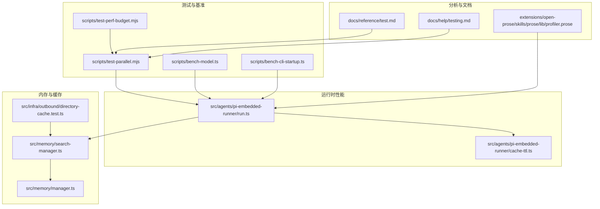
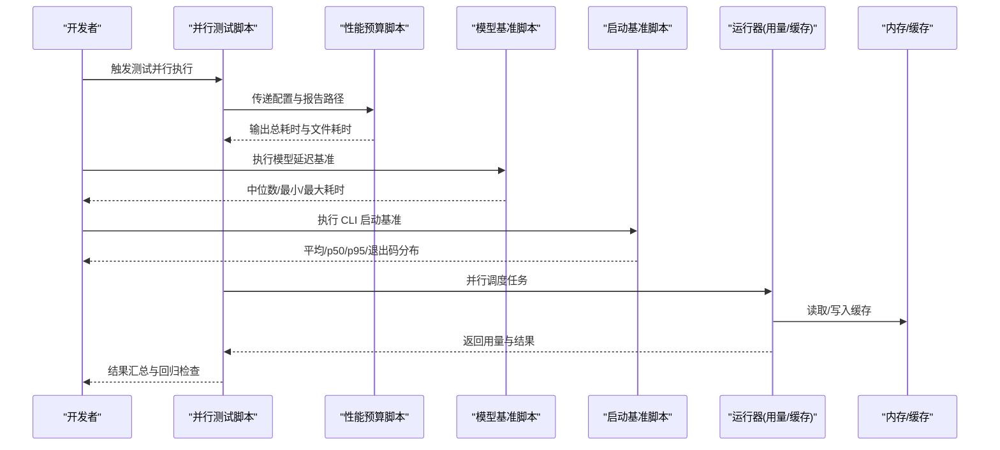
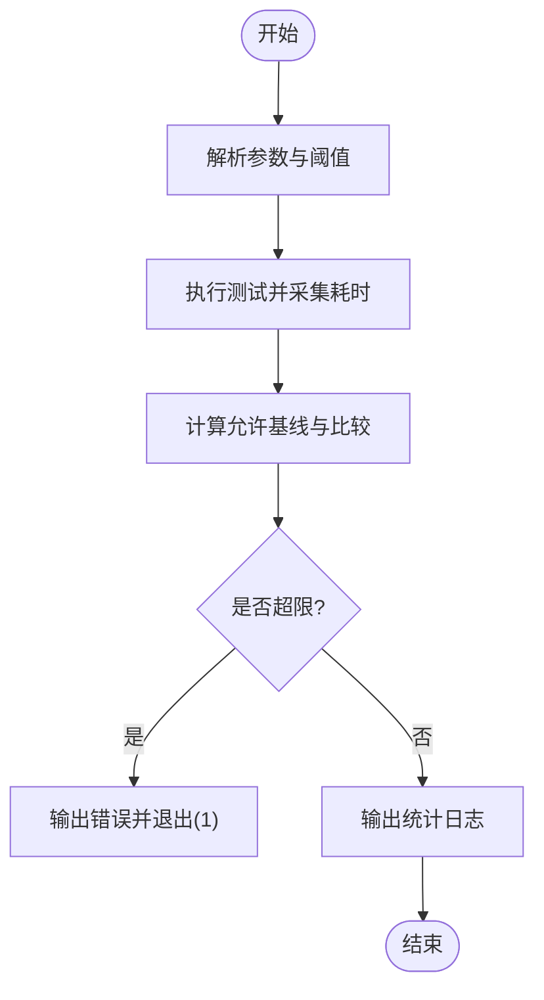
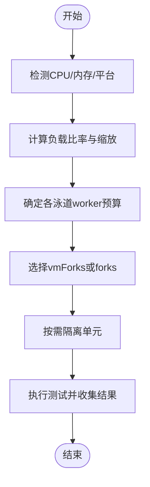
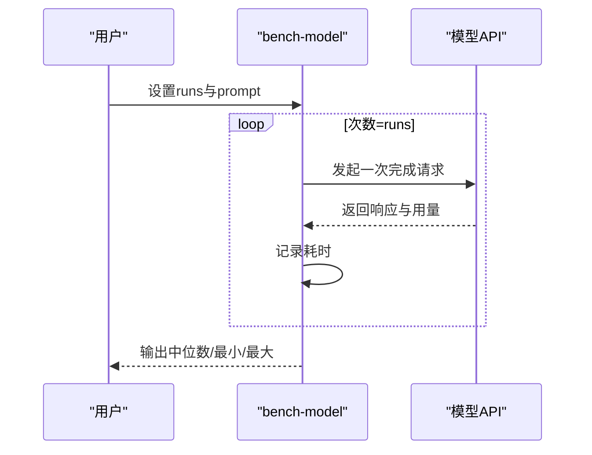
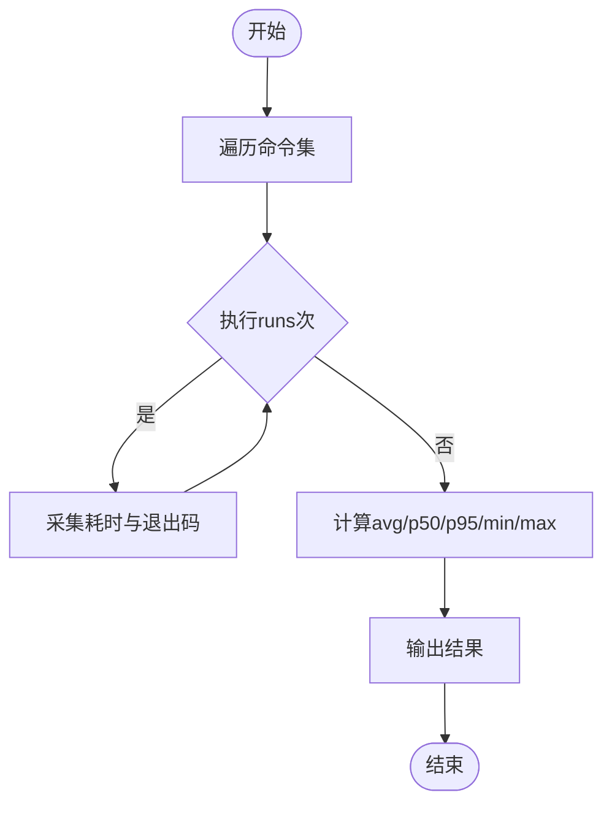
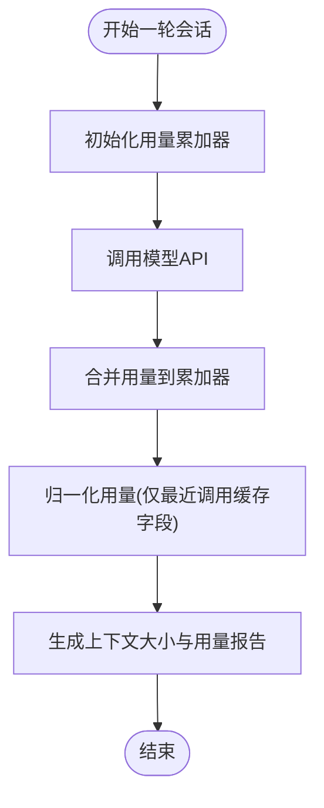
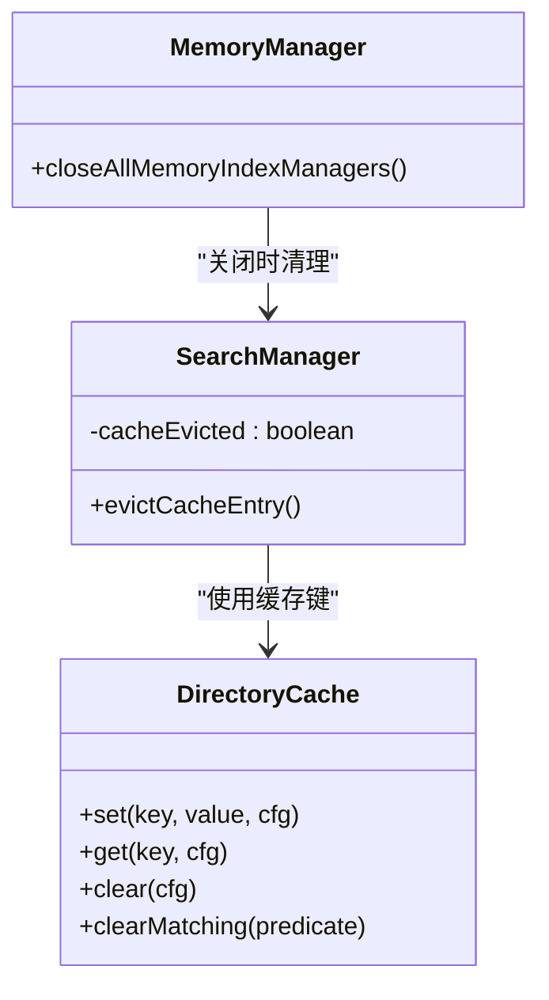
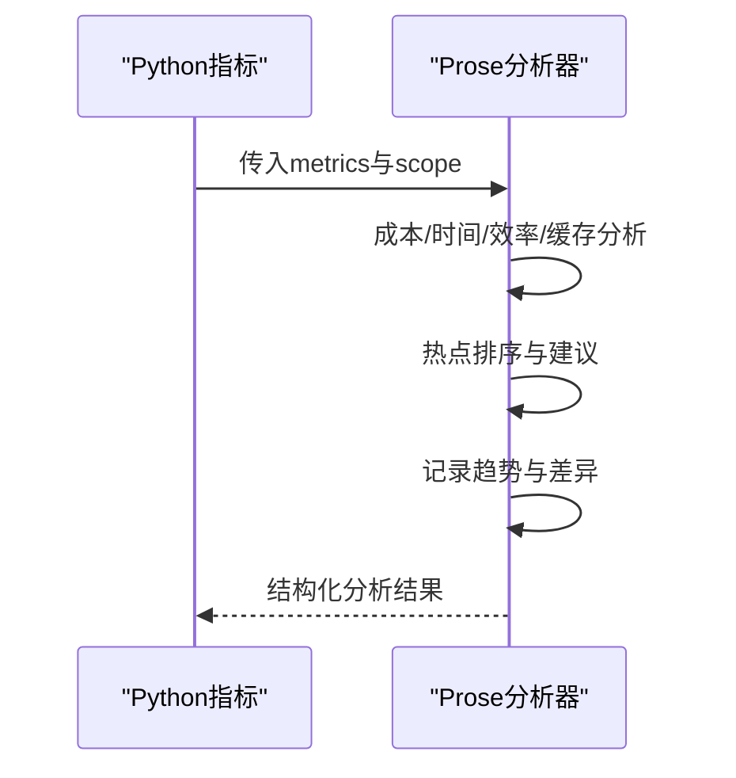
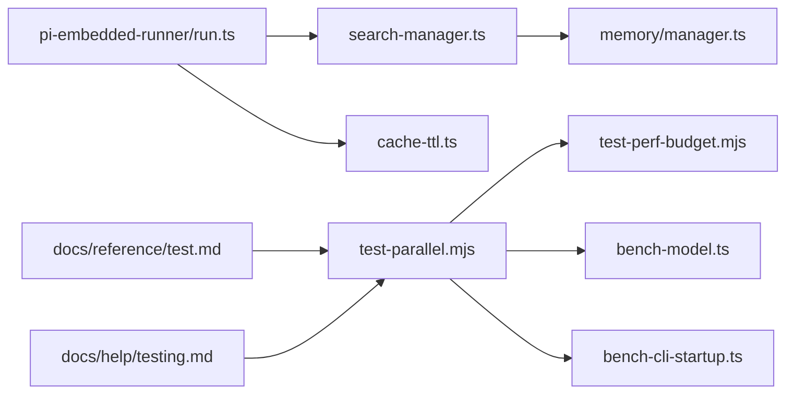

# 插件性能优化

<cite>
**本文引用的文件**
- [scripts/test-perf-budget.mjs](file://scripts/test-perf-budget.mjs)
- [scripts/test-parallel.mjs](file://scripts/test-parallel.mjs)
- [scripts/bench-model.ts](file://scripts/bench-model.ts)
- [scripts/bench-cli-startup.ts](file://scripts/bench-cli-startup.ts)
- [src/agents/pi-embedded-runner/run.ts](file://src/agents/pi-embedded-runner/run.ts)
- [src/agents/pi-embedded-runner/cache-ttl.ts](file://src/agents/pi-embedded-runner/cache-ttl.ts)
- [src/memory/search-manager.ts](file://src/memory/search-manager.ts)
- [src/memory/manager.ts](file://src/memory/manager.ts)
- [src/infra/outbound/directory-cache.test.ts](file://src/infra/outbound/directory-cache.test.ts)
- [docs/reference/test.md](file://docs/reference/test.md)
- [docs/help/testing.md](file://docs/help/testing.md)
- [extensions/open-prose/skills/prose/lib/profiler.prose](file://extensions/open-prose/skills/prose/lib/profiler.prose)
</cite>

## 目录
1. [简介](#简介)
2. [项目结构](#项目结构)
3. [核心组件](#核心组件)
4. [架构总览](#架构总览)
5. [详细组件分析](#详细组件分析)
6. [依赖关系分析](#依赖关系分析)
7. [性能考量](#性能考量)
8. [故障排查指南](#故障排查指南)
9. [结论](#结论)
10. [附录](#附录)

## 简介
本指南面向插件开发者与平台工程师，系统化阐述在 OpenClaw 体系中如何进行插件性能优化。内容覆盖性能监控指标、瓶颈识别、内存与 CPU 优化、网络 I/O 调优、缓存策略、异步与并发控制、资源限制与扩展性设计，并提供性能测试工具、基准测试脚本与持续优化流程的最佳实践。

## 项目结构
OpenClaw 的性能优化涉及多层能力：
- 测试与基准：通过统一的并行测试脚本与专用基准脚本，对单元、端到端与启动冷启动进行性能度量与回归控制。
- 运行时性能：嵌入式代理运行器对用量统计、缓存 TTL 记录、重试与退避策略进行精细化控制。
- 内存与缓存：内存索引管理器、目录缓存与 QMD 缓存键构建，确保高命中与低抖动。
- 分析与趋势：内置剖析提示词，支持成本、时间、效率与热点分析，并记录趋势以便持续优化。

**图表来源**
- [scripts/test-parallel.mjs:131-201](file://scripts/test-parallel.mjs#L131-L201)
- [scripts/test-perf-budget.mjs:61-82](file://scripts/test-perf-budget.mjs#L61-L82)
- [scripts/bench-model.ts:50-79](file://scripts/bench-model.ts#L50-L79)
- [scripts/bench-cli-startup.ts:68-96](file://scripts/bench-cli-startup.ts#L68-L96)
- [src/agents/pi-embedded-runner/run.ts:119-215](file://src/agents/pi-embedded-runner/run.ts#L119-L215)
- [src/agents/pi-embedded-runner/cache-ttl.ts:42-80](file://src/agents/pi-embedded-runner/cache-ttl.ts#L42-L80)
- [src/memory/search-manager.ts:240-253](file://src/memory/search-manager.ts#L240-L253)
- [src/memory/manager.ts:40-59](file://src/memory/manager.ts#L40-L59)
- [src/infra/outbound/directory-cache.test.ts:27-65](file://src/infra/outbound/directory-cache.test.ts#L27-L65)
- [extensions/open-prose/skills/prose/lib/profiler.prose:317-400](file://extensions/open-prose/skills/prose/lib/profiler.prose#L317-L400)
- [docs/reference/test.md:35-68](file://docs/reference/test.md#L35-L68)
- [docs/help/testing.md:40-95](file://docs/help/testing.md#L40-L95)

**章节来源**
- [scripts/test-parallel.mjs:131-201](file://scripts/test-parallel.mjs#L131-L201)
- [docs/reference/test.md:35-68](file://docs/reference/test.md#L35-L68)
- [docs/help/testing.md:40-95](file://docs/help/testing.md#L40-L95)

## 核心组件
- 性能预算与回归控制：通过性能预算脚本对测试总耗时与基线回归进行阈值控制，避免性能回退。
- 并行测试调度：根据主机 CPU、内存与平台特性动态选择 worker 数量、池类型与隔离模式，降低竞争与 OOM 风险。
- 模型延迟基准：对真实模型进行多次调用，统计中位数、最小/最大耗时，形成稳定对比。
- CLI 启动冷启动基准：测量关键命令的平均、分位与退出码分布，定位启动路径瓶颈。
- 运行时用量统计与缓存 TTL：对输入/输出/缓存读写进行归一化统计，记录最后一次 API 调用的缓存字段，避免上下文膨胀。
- 内存索引与缓存键：通过稳定键构建与 LRU/淘汰策略，提升检索命中率与稳定性。
- 剖析与趋势：基于提示词的分析阶段，输出成本、时间、效率与热点建议，并记录历史趋势。

**章节来源**
- [scripts/test-perf-budget.mjs:98-127](file://scripts/test-perf-budget.mjs#L98-L127)
- [scripts/test-parallel.mjs:499-553](file://scripts/test-parallel.mjs#L499-L553)
- [scripts/bench-model.ts:38-48](file://scripts/bench-model.ts#L38-L48)
- [scripts/bench-cli-startup.ts:47-66](file://scripts/bench-cli-startup.ts#L47-L66)
- [src/agents/pi-embedded-runner/run.ts:119-215](file://src/agents/pi-embedded-runner/run.ts#L119-L215)
- [src/agents/pi-embedded-runner/cache-ttl.ts:42-80](file://src/agents/pi-embedded-runner/cache-ttl.ts#L42-L80)
- [src/memory/search-manager.ts:240-253](file://src/memory/search-manager.ts#L240-L253)
- [extensions/open-prose/skills/prose/lib/profiler.prose:317-400](file://extensions/open-prose/skills/prose/lib/profiler.prose#L317-L400)

## 架构总览
下图展示从测试到运行时的关键交互路径，以及性能度量与优化闭环：

**图表来源**
- [scripts/test-parallel.mjs:600-651](file://scripts/test-parallel.mjs#L600-L651)
- [scripts/test-perf-budget.mjs:61-82](file://scripts/test-perf-budget.mjs#L61-L82)
- [scripts/bench-model.ts:50-79](file://scripts/bench-model.ts#L50-L79)
- [scripts/bench-cli-startup.ts:68-96](file://scripts/bench-cli-startup.ts#L68-L96)
- [src/agents/pi-embedded-runner/run.ts:119-215](file://src/agents/pi-embedded-runner/run.ts#L119-L215)
- [src/memory/search-manager.ts:240-253](file://src/memory/search-manager.ts#L240-L253)

## 详细组件分析

### 组件A：性能预算与回归控制（test-perf-budget）
- 功能要点
  - 解析环境变量与参数，确定最大墙钟时间与基线回归阈值。
  - 通过子进程运行测试套件，采集总耗时与文件级耗时。
  - 对比阈值并输出日志；若超限则退出码非零，便于 CI 回归检测。
- 关键路径
  - 参数解析与阈值计算：[parseArgs:15-55](file://scripts/test-perf-budget.mjs#L15-L55)，[allowedByBaseline:98-101](file://scripts/test-perf-budget.mjs#L98-L101)
  - 子进程执行与耗时采集：[spawnSync:73-78](file://scripts/test-perf-budget.mjs#L73-L78)，[elapsedMs](file://scripts/test-perf-budget.mjs#L78)
  - 回归判定与输出：[failed:103-117](file://scripts/test-perf-budget.mjs#L103-L117)，[console.log:119-123](file://scripts/test-perf-budget.mjs#L119-L123)

**图表来源**
- [scripts/test-perf-budget.mjs:15-55](file://scripts/test-perf-budget.mjs#L15-L55)
- [scripts/test-perf-budget.mjs:73-82](file://scripts/test-perf-budget.mjs#L73-L82)
- [scripts/test-perf-budget.mjs:98-127](file://scripts/test-perf-budget.mjs#L98-L127)

**章节来源**
- [scripts/test-perf-budget.mjs:15-55](file://scripts/test-perf-budget.mjs#L15-L55)
- [scripts/test-perf-budget.mjs:73-82](file://scripts/test-perf-budget.mjs#L73-L82)
- [scripts/test-perf-budget.mjs:98-127](file://scripts/test-perf-budget.mjs#L98-L127)

### 组件B：并行测试调度与资源限制（test-parallel）
- 功能要点
  - 自适应 worker 数量：依据 CPU 数、内存等级、平台与负载比率动态缩放。
  - 池类型选择：Node 22-24 默认 vmForks，Node 25+ 回退 forks；可强制开关。
  - 隔离策略：区分“快速单元”与“隔离单元”，避免共享资源竞争。
  - 容器化与分片：支持分片运行与 CI 环境下的稳定输出。
- 关键路径
  - 负载感知与 worker 计算：[loadRatio:502-508](file://scripts/test-parallel.mjs#L502-L508)，[localWorkers:508-508](file://scripts/test-parallel.mjs#L508-L508)
  - worker 预算与平台适配：[defaultWorkerBudget:509-553](file://scripts/test-parallel.mjs#L509-L553)
  - 池类型与隔离：[useVmForks:114-117](file://scripts/test-parallel.mjs#L114-L117)，[runOnce:600-651](file://scripts/test-parallel.mjs#L600-L651)

**图表来源**
- [scripts/test-parallel.mjs:499-553](file://scripts/test-parallel.mjs#L499-L553)
- [scripts/test-parallel.mjs:600-651](file://scripts/test-parallel.mjs#L600-L651)

**章节来源**
- [scripts/test-parallel.mjs:499-553](file://scripts/test-parallel.mjs#L499-L553)
- [scripts/test-parallel.mjs:600-651](file://scripts/test-parallel.mjs#L600-L651)

### 组件C：模型延迟基准（bench-model）
- 功能要点
  - 多次调用模型完成接口，统计每次耗时与用量。
  - 输出中位数、最小/最大耗时，便于跨模型对比。
- 关键路径
  - 运行循环与耗时采集：[runModel:50-79](file://scripts/bench-model.ts#L50-L79)
  - 统计与摘要：[median:38-48](file://scripts/bench-model.ts#L38-L48)，[summarize:130-136](file://scripts/bench-model.ts#L130-L136)

**图表来源**
- [scripts/bench-model.ts:50-79](file://scripts/bench-model.ts#L50-L79)
- [scripts/bench-model.ts:38-48](file://scripts/bench-model.ts#L38-L48)

**章节来源**
- [scripts/bench-model.ts:38-48](file://scripts/bench-model.ts#L38-L48)
- [scripts/bench-model.ts:50-79](file://scripts/bench-model.ts#L50-L79)

### 组件D：CLI 启动冷启动基准（bench-cli-startup）
- 功能要点
  - 测量关键命令的平均、分位与退出码分布，定位启动路径瓶颈。
- 关键路径
  - 命令集与样本采集：[DEFAULT_CASES:20-26](file://scripts/bench-cli-startup.ts#L20-L26)，[runCase:68-96](file://scripts/bench-cli-startup.ts#L68-L96)
  - 统计与对比：[summarize:98-111](file://scripts/bench-cli-startup.ts#L98-L111)，[percentile:59-66](file://scripts/bench-cli-startup.ts#L59-L66)

**图表来源**
- [scripts/bench-cli-startup.ts:68-96](file://scripts/bench-cli-startup.ts#L68-L96)
- [scripts/bench-cli-startup.ts:98-111](file://scripts/bench-cli-startup.ts#L98-L111)

**章节来源**
- [scripts/bench-cli-startup.ts:20-26](file://scripts/bench-cli-startup.ts#L20-L26)
- [scripts/bench-cli-startup.ts:68-96](file://scripts/bench-cli-startup.ts#L68-L96)
- [scripts/bench-cli-startup.ts:98-111](file://scripts/bench-cli-startup.ts#L98-L111)

### 组件E：运行时用量统计与缓存 TTL（pi-embedded-runner）
- 功能要点
  - 定义用量累加器，归一化输入/输出/缓存读写与总令牌，避免上下文膨胀。
  - 记录最后一次 API 调用的缓存字段，用于准确上下文大小报告。
  - 提供缓存 TTL 时间戳读取与追加，辅助诊断与审计。
- 关键路径
  - 用量归一化与上下文修正：[toNormalizedUsage:189-215](file://src/agents/pi-embedded-runner/run.ts#L189-L215)
  - 最近调用缓存字段使用：[lastCacheRead/lastCacheWrite:189-215](file://src/agents/pi-embedded-runner/run.ts#L189-L215)
  - TTL 读取与追加：[readLastCacheTtlTimestamp:42-66](file://src/agents/pi-embedded-runner/cache-ttl.ts#L42-L66)，[appendCacheTtlTimestamp:68-80](file://src/agents/pi-embedded-runner/cache-ttl.ts#L68-L80)

**图表来源**
- [src/agents/pi-embedded-runner/run.ts:119-215](file://src/agents/pi-embedded-runner/run.ts#L119-L215)
- [src/agents/pi-embedded-runner/cache-ttl.ts:42-80](file://src/agents/pi-embedded-runner/cache-ttl.ts#L42-L80)

**章节来源**
- [src/agents/pi-embedded-runner/run.ts:119-215](file://src/agents/pi-embedded-runner/run.ts#L119-L215)
- [src/agents/pi-embedded-runner/cache-ttl.ts:42-80](file://src/agents/pi-embedded-runner/cache-ttl.ts#L42-L80)

### 组件F：内存索引与缓存键（memory）
- 功能要点
  - 内存索引管理器全局缓存与关闭流程，避免重复创建与泄漏。
  - 搜索管理器的缓存淘汰与键构建，保证热路径稳定。
  - 目录缓存具备 TTL、容量限制与匹配清理能力。
- 关键路径
  - 全局索引管理与关闭：[closeAllMemoryIndexManagers:45-59](file://src/memory/manager.ts#L45-L59)
  - 缓存淘汰与回调：[evictCacheEntry:240-246](file://src/memory/search-manager.ts#L240-L246)
  - 键构建与稳定性：[buildQmdCacheKey:249-253](file://src/memory/search-manager.ts#L249-L253)
  - 目录缓存行为验证：[DirectoryCache 测试:27-65](file://src/infra/outbound/directory-cache.test.ts#L27-L65)

**图表来源**
- [src/memory/manager.ts:45-59](file://src/memory/manager.ts#L45-L59)
- [src/memory/search-manager.ts:240-253](file://src/memory/search-manager.ts#L240-L253)
- [src/infra/outbound/directory-cache.test.ts:27-65](file://src/infra/outbound/directory-cache.test.ts#L27-L65)

**章节来源**
- [src/memory/manager.ts:45-59](file://src/memory/manager.ts#L45-L59)
- [src/memory/search-manager.ts:240-253](file://src/memory/search-manager.ts#L240-L253)
- [src/infra/outbound/directory-cache.test.ts:27-65](file://src/infra/outbound/directory-cache.test.ts#L27-L65)

### 组件G：剖析与趋势（open-prose profiler）
- 功能要点
  - 将 Python 计算的指标交由 LLM 进行成本、时间、效率、缓存效率与热点分析。
  - 支持单次运行与多轮对比、趋势追踪，输出结构化建议。
- 关键路径
  - 分析阶段提示词与上下文注入：[Phase 4 Analyze:317-376](file://extensions/open-prose/skills/prose/lib/profiler.prose#L317-L376)
  - 趋势记录与比较：[Phase 5 Track:383-396](file://extensions/open-prose/skills/prose/lib/profiler.prose#L383-L396)

**图表来源**
- [extensions/open-prose/skills/prose/lib/profiler.prose:317-376](file://extensions/open-prose/skills/prose/lib/profiler.prose#L317-L376)
- [extensions/open-prose/skills/prose/lib/profiler.prose:383-396](file://extensions/open-prose/skills/prose/lib/profiler.prose#L383-L396)

**章节来源**
- [extensions/open-prose/skills/prose/lib/profiler.prose:317-376](file://extensions/open-prose/skills/prose/lib/profiler.prose#L317-L376)
- [extensions/open-prose/skills/prose/lib/profiler.prose:383-396](file://extensions/open-prose/skills/prose/lib/profiler.prose#L383-L396)

## 依赖关系分析
- 测试脚本依赖
  - 并行脚本驱动性能预算脚本与基准脚本，形成“执行-度量-回归”的闭环。
  - 文档指引定义了测试套件与运行方式，为脚本提供约束与期望。
- 运行时组件依赖
  - 运行器依赖缓存 TTL 记录与用量统计，保障上下文大小与用量准确性。
  - 内存与缓存组件相互协作，通过稳定键与淘汰策略提升命中率与稳定性。

**图表来源**
- [scripts/test-parallel.mjs:131-201](file://scripts/test-parallel.mjs#L131-L201)
- [scripts/test-perf-budget.mjs:61-82](file://scripts/test-perf-budget.mjs#L61-L82)
- [scripts/bench-model.ts:50-79](file://scripts/bench-model.ts#L50-L79)
- [scripts/bench-cli-startup.ts:68-96](file://scripts/bench-cli-startup.ts#L68-L96)
- [src/agents/pi-embedded-runner/run.ts:119-215](file://src/agents/pi-embedded-runner/run.ts#L119-L215)
- [src/agents/pi-embedded-runner/cache-ttl.ts:42-80](file://src/agents/pi-embedded-runner/cache-ttl.ts#L42-L80)
- [src/memory/search-manager.ts:240-253](file://src/memory/search-manager.ts#L240-L253)
- [src/memory/manager.ts:45-59](file://src/memory/manager.ts#L45-L59)
- [docs/reference/test.md:35-68](file://docs/reference/test.md#L35-L68)
- [docs/help/testing.md:40-95](file://docs/help/testing.md#L40-L95)

**章节来源**
- [scripts/test-parallel.mjs:131-201](file://scripts/test-parallel.mjs#L131-L201)
- [docs/reference/test.md:35-68](file://docs/reference/test.md#L35-L68)
- [docs/help/testing.md:40-95](file://docs/help/testing.md#L40-L95)

## 性能考量
- 内存管理
  - 使用全局索引管理器与稳定键构建，减少重复初始化与 GC 抖动。
  - 在高内存主机优先并行，低内存主机降低 worker 数以避免 OOM。
- CPU 使用
  - Node 版本适配：22-24 使用 vmForks，25+ 回退 forks；必要时强制切换。
  - 负载感知：根据系统负载动态缩放 worker，极端压力下降速。
- 网络 I/O
  - 通过模型与 CLI 基准脚本量化端到端延迟，识别慢点。
  - 在测试中启用静默模式与分片，降低控制台 I/O 开销。
- 缓存策略
  - 使用目录缓存与 QMD 缓存键，结合 TTL 与容量限制，提升命中率。
  - 利用缓存 TTL 记录与用量归一化，避免上下文膨胀导致的额外网络与计算。
- 异步与并发
  - 并行测试脚本按套件拆分与隔离，避免共享资源竞争。
  - 运行器内部通过队列与 lane 控制并发，避免过载。
- 资源限制与扩展性
  - 通过 worker 预算与池类型选择，平衡吞吐与稳定性。
  - 在 CI 与本地环境采用不同默认策略，兼顾速度与可靠性。

[本节为通用指导，不直接分析具体文件]

## 故障排查指南
- 测试超时或回归
  - 使用性能预算脚本定位总耗时与文件级耗时异常，检查阈值设置与基线变化。
  - 参考测试文档中的“本地 PR gate”与“低配置主机”运行建议。
- 并发与隔离问题
  - 检查并行脚本的池类型与 worker 数设置，必要时强制禁用隔离或回退到 forks。
  - 在 Windows CI 或 macOS CI 下调整默认策略，避免不稳定。
- 内存与缓存
  - 若出现 OOM，降低 worker 数或启用隔离；检查内存索引管理器关闭流程。
  - 目录缓存与 QMD 缓存键行为可通过测试用例验证，确认 TTL 与容量限制生效。
- 运行时用量与上下文
  - 若上下文大小异常膨胀，检查用量归一化逻辑与缓存 TTL 记录是否正确。
  - 对比最近调用的缓存字段与累计值，确保上下文计算准确。

**章节来源**
- [scripts/test-perf-budget.mjs:98-127](file://scripts/test-perf-budget.mjs#L98-L127)
- [docs/reference/test.md:31-34](file://docs/reference/test.md#L31-L34)
- [scripts/test-parallel.mjs:555-577](file://scripts/test-parallel.mjs#L555-L577)
- [src/memory/manager.ts:45-59](file://src/memory/manager.ts#L45-L59)
- [src/infra/outbound/directory-cache.test.ts:27-65](file://src/infra/outbound/directory-cache.test.ts#L27-L65)
- [src/agents/pi-embedded-runner/run.ts:189-215](file://src/agents/pi-embedded-runner/run.ts#L189-L215)

## 结论
通过统一的并行测试调度、性能预算与回归控制、模型与 CLI 基准脚本、运行时用量统计与缓存 TTL、以及内存与缓存的稳定键与淘汰策略，OpenClaw 形成了从测试到运行时的全链路性能优化体系。配合剖析与趋势分析，可实现持续的性能治理与优化闭环。

[本节为总结，不直接分析具体文件]

## 附录
- 性能测试工具与脚本
  - 并行测试：[scripts/test-parallel.mjs:131-201](file://scripts/test-parallel.mjs#L131-L201)
  - 性能预算：[scripts/test-perf-budget.mjs:61-82](file://scripts/test-perf-budget.mjs#L61-L82)
  - 模型延迟基准：[scripts/bench-model.ts:50-79](file://scripts/bench-model.ts#L50-L79)
  - CLI 启动基准：[scripts/bench-cli-startup.ts:68-96](file://scripts/bench-cli-startup.ts#L68-L96)
- 文档参考
  - 测试说明：[docs/reference/test.md:35-68](file://docs/reference/test.md#L35-L68)
  - 测试指南：[docs/help/testing.md:40-95](file://docs/help/testing.md#L40-L95)
- 运行时与缓存
  - 运行器用量与 TTL：[src/agents/pi-embedded-runner/run.ts:119-215](file://src/agents/pi-embedded-runner/run.ts#L119-L215)，[src/agents/pi-embedded-runner/cache-ttl.ts:42-80](file://src/agents/pi-embedded-runner/cache-ttl.ts#L42-L80)
  - 内存与缓存：[src/memory/search-manager.ts:240-253](file://src/memory/search-manager.ts#L240-L253)，[src/memory/manager.ts:45-59](file://src/memory/manager.ts#L45-L59)
  - 目录缓存测试：[src/infra/outbound/directory-cache.test.ts:27-65](file://src/infra/outbound/directory-cache.test.ts#L27-L65)
- 剖析与趋势
  - [extensions/open-prose/skills/prose/lib/profiler.prose:317-400](file://extensions/open-prose/skills/prose/lib/profiler.prose#L317-L400)

[本节为附录，不直接分析具体文件]