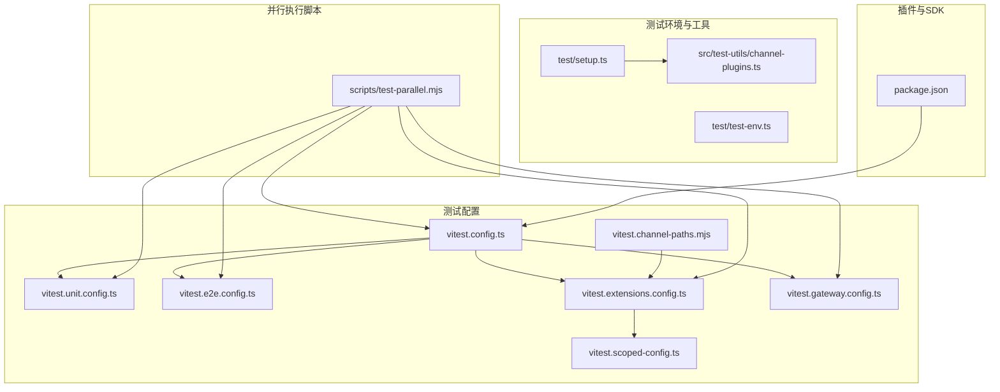
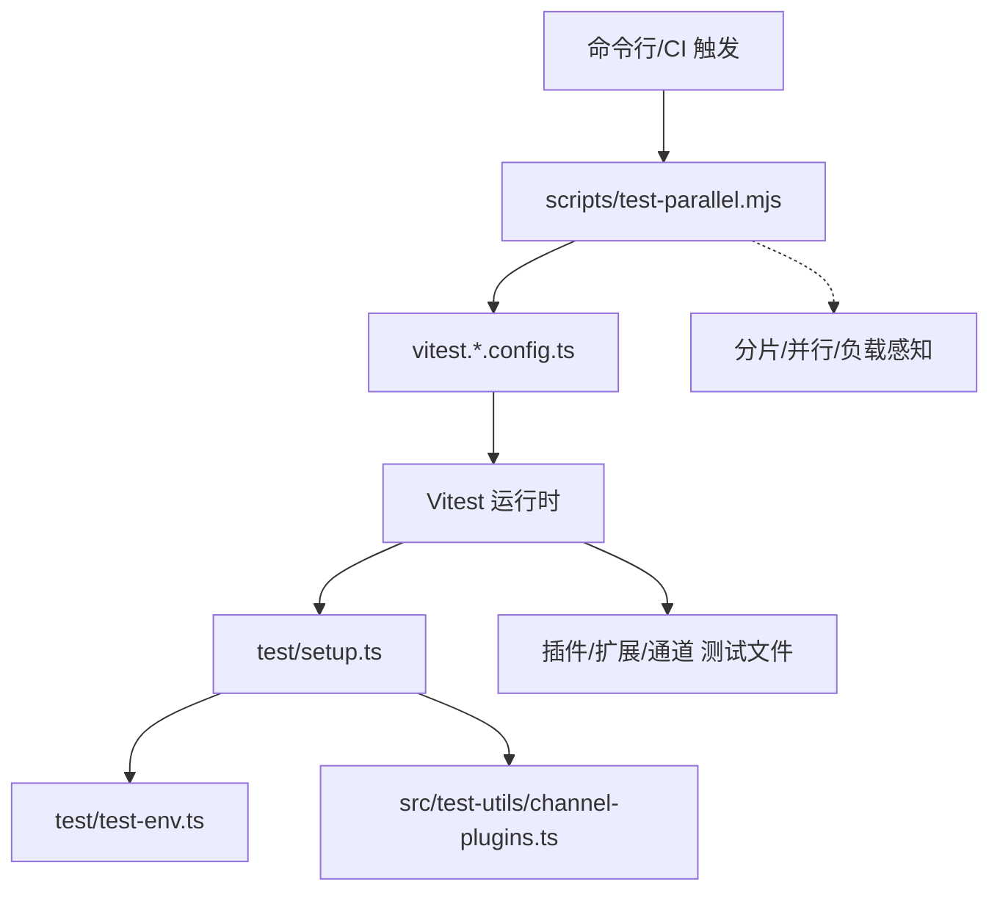
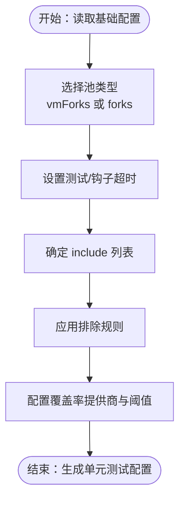
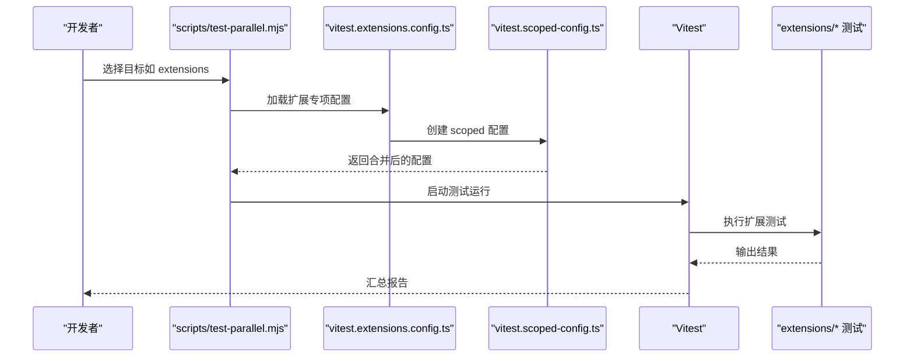
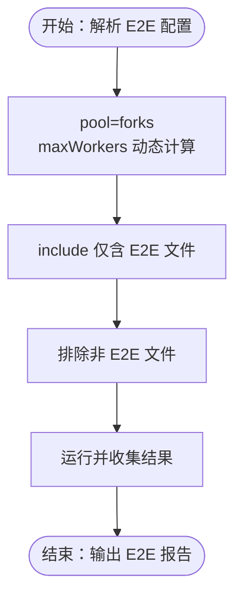
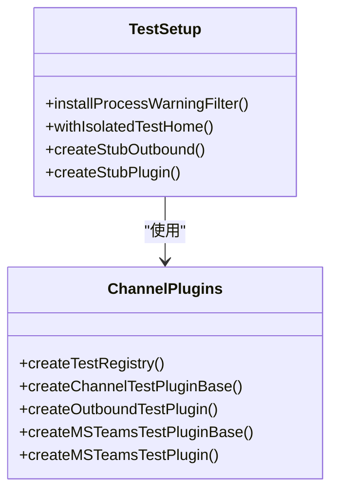
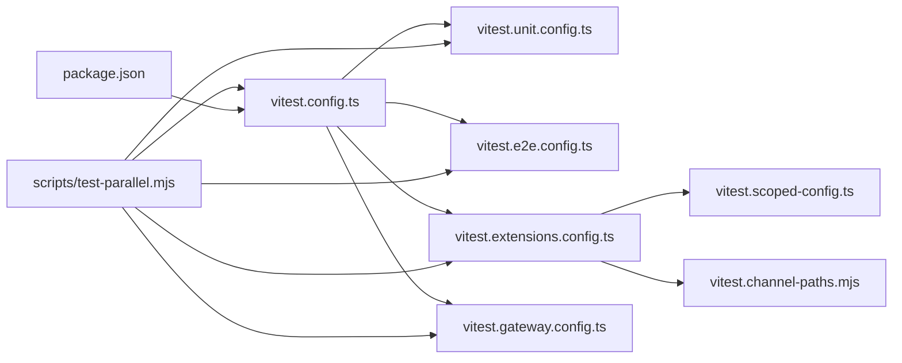

# 插件测试与调试

<cite>
**本文引用的文件**
- [vitest.config.ts](file://vitest.config.ts)
- [vitest.unit.config.ts](file://vitest.unit.config.ts)
- [vitest.e2e.config.ts](file://vitest.e2e.config.ts)
- [vitest.extensions.config.ts](file://vitest.extensions.config.ts)
- [vitest.gateway.config.ts](file://vitest.gateway.config.ts)
- [vitest.scoped-config.ts](file://vitest.scoped-config.ts)
- [vitest.channel-paths.mjs](file://vitest.channel-paths.mjs)
- [test/setup.ts](file://test/setup.ts)
- [test/test-env.ts](file://test/test-env.ts)
- [src/test-utils/channel-plugins.ts](file://src/test-utils/channel-plugins.ts)
- [scripts/test-parallel.mjs](file://scripts/test-parallel.mjs)
- [package.json](file://package.json)
</cite>

## 目录
1. [引言](#引言)
2. [项目结构](#项目结构)
3. [核心组件](#核心组件)
4. [架构总览](#架构总览)
5. [详细组件分析](#详细组件分析)
6. [依赖关系分析](#依赖关系分析)
7. [性能考量](#性能考量)
8. [故障排查指南](#故障排查指南)
9. [结论](#结论)
10. [附录](#附录)

## 引言
本指南面向插件开发者与测试工程师，系统讲解如何在该仓库中开展插件的单元测试、集成测试与端到端测试（E2E）。内容覆盖测试框架配置、模拟对象与测试数据管理、调试技巧、日志与性能监控、测试覆盖率策略、持续集成与自动化测试流程，以及常见问题诊断与解决。

## 项目结构
该仓库采用多包工作区与分层组织方式：
- 核心运行时与SDK位于 src/，插件SDK导出通过 package.json 的 exports 字段暴露。
- 测试配置集中在根目录的 vitest.*.config.ts 与 scripts/test-parallel.mjs。
- 扩展（插件）位于 extensions/，每个插件通常自带测试文件。
- 测试辅助工具位于 src/test-utils/ 与 test/，用于构建测试桩、隔离环境与通道插件注册。

**图表来源**
- [vitest.config.ts:1-156](file://vitest.config.ts#L1-L156)
- [vitest.unit.config.ts:1-28](file://vitest.unit.config.ts#L1-L28)
- [vitest.e2e.config.ts:1-33](file://vitest.e2e.config.ts#L1-L33)
- [vitest.extensions.config.ts:1-10](file://vitest.extensions.config.ts#L1-L10)
- [vitest.gateway.config.ts:1-4](file://vitest.gateway.config.ts#L1-L4)
- [vitest.scoped-config.ts:1-18](file://vitest.scoped-config.ts#L1-L18)
- [vitest.channel-paths.mjs:1-15](file://vitest.channel-paths.mjs#L1-L15)
- [test/setup.ts:1-194](file://test/setup.ts#L1-L194)
- [test/test-env.ts:1-148](file://test/test-env.ts#L1-L148)
- [src/test-utils/channel-plugins.ts:1-112](file://src/test-utils/channel-plugins.ts#L1-L112)
- [scripts/test-parallel.mjs:1-744](file://scripts/test-parallel.mjs#L1-L744)
- [package.json:1-200](file://package.json#L1-L200)

**章节来源**
- [vitest.config.ts:1-156](file://vitest.config.ts#L1-L156)
- [scripts/test-parallel.mjs:1-744](file://scripts/test-parallel.mjs#L1-L744)
- [package.json:1-200](file://package.json#L1-L200)

## 核心组件
- 测试框架与配置
  - 基础配置：统一别名、超时、池类型、并发、覆盖率阈值与排除范围。
  - 单元测试配置：限定 include/exclude，聚焦纯单元测试。
  - E2E 配置：进程池隔离、可选并发与静默输出。
  - 专项配置：扩展、网关、通道等按需创建的 scoped 配置。
- 测试环境与工具
  - 全局 setup：安装警告过滤、隔离 HOME、创建默认插件注册表、创建通道桩适配器。
  - 环境隔离：withIsolatedTestHome 将状态目录、缓存目录与端口等隔离到临时目录。
  - 通道插件工具：快速构造测试用插件与注册表，便于通道实现的单元测试。
- 并行执行与分片
  - 多泳道并行：unit-fast、unit-isolated、extensions、gateway 等。
  - 负载感知与平台差异：根据 CPU、内存、负载与平台动态调整 worker 数量。
  - 分片支持：支持按分片索引与总数进行分片执行，便于 CI 并行。

**章节来源**
- [vitest.config.ts:1-156](file://vitest.config.ts#L1-L156)
- [vitest.unit.config.ts:1-28](file://vitest.unit.config.ts#L1-L28)
- [vitest.e2e.config.ts:1-33](file://vitest.e2e.config.ts#L1-L33)
- [vitest.extensions.config.ts:1-10](file://vitest.extensions.config.ts#L1-L10)
- [vitest.gateway.config.ts:1-4](file://vitest.gateway.config.ts#L1-L4)
- [vitest.scoped-config.ts:1-18](file://vitest.scoped-config.ts#L1-L18)
- [test/setup.ts:1-194](file://test/setup.ts#L1-L194)
- [test/test-env.ts:1-148](file://test/test-env.ts#L1-L148)
- [src/test-utils/channel-plugins.ts:1-112](file://src/test-utils/channel-plugins.ts#L1-L112)
- [scripts/test-parallel.mjs:1-744](file://scripts/test-parallel.mjs#L1-L744)

## 架构总览
下图展示测试体系的关键交互：配置驱动、并行调度、环境隔离与通道桩适配器协作。

**图表来源**
- [scripts/test-parallel.mjs:1-744](file://scripts/test-parallel.mjs#L1-L744)
- [vitest.config.ts:1-156](file://vitest.config.ts#L1-L156)
- [test/setup.ts:1-194](file://test/setup.ts#L1-L194)
- [test/test-env.ts:1-148](file://test/test-env.ts#L1-L148)
- [src/test-utils/channel-plugins.ts:1-112](file://src/test-utils/channel-plugins.ts#L1-L112)

## 详细组件分析

### 单元测试框架与策略
- 配置要点
  - 池类型：默认 fork；vmForks 在 Node 24 及以下更稳定，但对全局状态敏感的测试会回退为 fork。
  - 超时：测试与钩子超时按平台与 CI 环境差异化设置。
  - 排除：大量集成/入口/UI/CLI 等模块不计入核心覆盖率，避免“虚假达标”。
  - 覆盖率：以 v8 提供商，报告 text 与 lcov；阈值为行/函数/分支/语句 70%/70%/55%/70%，仅统计 src/ 下实际被测文件。
- 单元专项配置
  - 通过 vitest.unit.config.ts 过滤掉 gateway、browser、line、agents、auto-reply、commands 等集成面，聚焦纯单元逻辑。

**图表来源**
- [vitest.config.ts:30-156](file://vitest.config.ts#L30-L156)
- [vitest.unit.config.ts:11-27](file://vitest.unit.config.ts#L11-L27)

**章节来源**
- [vitest.config.ts:30-156](file://vitest.config.ts#L30-L156)
- [vitest.unit.config.ts:11-27](file://vitest.unit.config.ts#L11-L27)

### 集成测试策略
- 通道（Channel）测试
  - 通道实现位于 extensions/* 与 src/browser、src/line 等目录，测试路径由 vitest.channel-paths.mjs 统一定义。
  - 通过 vitest.extensions.config.ts 与 createScopedVitestConfig 生成专用配置，结合 channelTestExclude 控制排除范围。
- 网关（Gateway）测试
  - 使用 vitest.gateway.config.ts 生成针对 src/gateway 的测试配置，确保全局状态与环境模拟的稳定性。
- 扩展（Extensions）测试
  - 通过 vitest.extensions.config.ts 限定 include，并排除通道实现（通道测试由 channels 配置负责）。

**图表来源**
- [scripts/test-parallel.mjs:171-201](file://scripts/test-parallel.mjs#L171-L201)
- [vitest.extensions.config.ts:1-10](file://vitest.extensions.config.ts#L1-L10)
- [vitest.scoped-config.ts:4-17](file://vitest.scoped-config.ts#L4-L17)

**章节来源**
- [vitest.extensions.config.ts:1-10](file://vitest.extensions.config.ts#L1-L10)
- [vitest.gateway.config.ts:1-4](file://vitest.gateway.config.ts#L1-L4)
- [vitest.scoped-config.ts:1-18](file://vitest.scoped-config.ts#L1-L18)
- [vitest.channel-paths.mjs:1-15](file://vitest.channel-paths.mjs#L1-L15)

### 端到端测试方法
- 配置与隔离
  - E2E 使用进程池（forks），避免 vmForks 导致的跨文件状态泄漏。
  - 支持通过环境变量控制并发与输出详细程度。
- 文件范围
  - include 仅限 test/**/*.e2e.test.ts 与 src/**/*.e2e.test.ts，确保 E2E 与单元测试分离。
- 并行与分片
  - 通过 scripts/test-parallel.mjs 的 targetedEntries 机制，可按文件或目录精确调度 E2E 子集。

**图表来源**
- [vitest.e2e.config.ts:20-32](file://vitest.e2e.config.ts#L20-L32)
- [scripts/test-parallel.mjs:439-444](file://scripts/test-parallel.mjs#L439-L444)

**章节来源**
- [vitest.e2e.config.ts:1-33](file://vitest.e2e.config.ts#L1-L33)
- [scripts/test-parallel.mjs:439-444](file://scripts/test-parallel.mjs#L439-L444)

### 测试工具使用与模拟对象
- 全局 setup
  - 安装进程警告过滤，提升稳定性。
  - 设置 OPENCLAW_PLUGIN_MANIFEST_CACHE_MS，减少插件清单扫描开销。
  - 通过 withIsolatedTestHome 隔离 HOME 与状态目录，避免污染真实用户环境。
  - 创建默认通道插件注册表，包含 Discord、Slack、Telegram、WhatsApp、Signal、iMessage 等常用通道桩。
  - 提供 createStubOutbound 与 createStubPlugin，便于通道发送与配置解析的测试。
- 通道插件工具
  - createTestRegistry：快速构建测试用插件注册表。
  - createChannelTestPluginBase/createOutboundTestPlugin：构造通道插件基座与出站适配器。
  - MSTeams 特化：提供 Microsoft Teams 插件基座与别名支持。

**图表来源**
- [test/setup.ts:34-194](file://test/setup.ts#L34-L194)
- [src/test-utils/channel-plugins.ts:15-112](file://src/test-utils/channel-plugins.ts#L15-L112)

**章节来源**
- [test/setup.ts:1-194](file://test/setup.ts#L1-L194)
- [src/test-utils/channel-plugins.ts:1-112](file://src/test-utils/channel-plugins.ts#L1-L112)

### 测试数据管理
- 环境隔离
  - withIsolatedTestHome 将 HOME、XDG_*、OPENCLAW_STATE_DIR 等变量重定向至临时目录，清理时自动回收。
  - 支持 LIVE 模式加载用户真实环境变量，便于需要真实密钥或配置的场景。
- 插件清单缓存
  - 通过 OPENCLAW_PLUGIN_MANIFEST_CACHE_MS 缓存插件清单，降低重复扫描成本。
- 通道账户解析
  - 通道插件的 listAccountIds/resolveAccount 在测试中返回稳定值，便于断言。

**章节来源**
- [test/test-env.ts:54-148](file://test/test-env.ts#L54-L148)
- [test/setup.ts:14-23](file://test/setup.ts#L14-L23)
- [test/setup.ts:102-126](file://test/setup.ts#L102-L126)

### 调试技巧与日志分析
- 虚拟时钟与定时器
  - setup 中确保 vi.useRealTimers() 在 afterEach 恢复，避免跨文件定时器泄漏。
- 警告过滤
  - 安装进程警告过滤，减少噪音干扰。
- 日志与输出
  - E2E 支持通过环境变量控制详细输出；并行脚本支持静默通过项与危险忽略错误模式（CI Windows）。
- 并行与分片
  - 使用 OPENCLAW_TEST_SHARDS 与 OPENCLAW_TEST_SHARD_INDEX 实现分片执行，便于定位问题与加速回归。

**章节来源**
- [test/setup.ts:181-194](file://test/setup.ts#L181-L194)
- [scripts/test-parallel.mjs:267-269](file://scripts/test-parallel.mjs#L267-L269)
- [scripts/test-parallel.mjs:653-668](file://scripts/test-parallel.mjs#L653-L668)

### 性能监控与覆盖率
- 覆盖率策略
  - 仅统计 src/ 下被实际测试覆盖的文件，排除 extensions/、apps/、ui/、test/ 等。
  - 关键阈值：lines/functions/statements 70%，branches 55%。
  - 排除入口与大集成面（如 agents、channels、gateway 等），通过 E2E/手动验证替代。
- 并行与资源分配
  - 根据 CPU、内存、负载与平台动态分配 workers，CI 上 macOS 限制为 1，Linux/Windows 更倾向 Vitest 默认。
  - 支持通过 OPENCLAW_TEST_WORKERS、OPENCLAW_TEST_PROFILE 等环境变量微调。

**章节来源**
- [vitest.config.ts:62-153](file://vitest.config.ts#L62-L153)
- [scripts/test-parallel.mjs:509-577](file://scripts/test-parallel.mjs#L509-L577)

### 持续集成与自动化测试流程
- 并行执行脚本
  - 自动识别测试类型（unit、extensions、gateway、channels、e2e、live），分别调度到对应配置。
  - 支持分片、单次运行、传参透传、信号处理与退出码聚合。
- CI 行为
  - Windows CI 开启危险忽略未捕获错误；macOS CI 限制 worker 数为 1。
  - 支持通过 OPENCLAW_TEST_MAX_OLD_SPACE_SIZE_MB 调整堆大小，缓解大套件内存压力。

**章节来源**
- [scripts/test-parallel.mjs:131-201](file://scripts/test-parallel.mjs#L131-L201)
- [scripts/test-parallel.mjs:586-598](file://scripts/test-parallel.mjs#L586-L598)

## 依赖关系分析
- 配置依赖
  - vitest.unit.config.ts/vitest.e2e.config.ts/vitest.extensions.config.ts/vitest.gateway.config.ts 均基于 vitest.config.ts 的基础配置。
  - vitest.extensions.config.ts 依赖 vitest.scoped-config.ts 与 vitest.channel-paths.mjs。
- 运行时依赖
  - scripts/test-parallel.mjs 解析测试文件、推断目标、生成运行条目并执行。
  - package.json 的 exports 暴露插件 SDK，供扩展与测试使用。

**图表来源**
- [vitest.config.ts:1-156](file://vitest.config.ts#L1-L156)
- [vitest.unit.config.ts:1-28](file://vitest.unit.config.ts#L1-L28)
- [vitest.e2e.config.ts:1-33](file://vitest.e2e.config.ts#L1-L33)
- [vitest.extensions.config.ts:1-10](file://vitest.extensions.config.ts#L1-L10)
- [vitest.gateway.config.ts:1-4](file://vitest.gateway.config.ts#L1-L4)
- [vitest.scoped-config.ts:1-18](file://vitest.scoped-config.ts#L1-L18)
- [vitest.channel-paths.mjs:1-15](file://vitest.channel-paths.mjs#L1-L15)
- [scripts/test-parallel.mjs:1-744](file://scripts/test-parallel.mjs#L1-L744)
- [package.json:1-200](file://package.json#L1-L200)

**章节来源**
- [vitest.config.ts:1-156](file://vitest.config.ts#L1-L156)
- [scripts/test-parallel.mjs:1-744](file://scripts/test-parallel.mjs#L1-L744)
- [package.json:1-200](file://package.json#L1-L200)

## 性能考量
- 池类型选择
  - Node 24 及以下优先 vmForks；否则回退 forks，避免全局状态泄漏导致的不稳定。
- 并发与资源
  - 本地高内存主机优先 gateway 并行；低内存主机限制扩展与单元并发，防止 OOM。
  - macOS CI 严格限制 worker 数，Linux/Windows 更倾向默认并发。
- 内存与垃圾回收
  - 通过 OPENCLAW_TEST_MAX_OLD_SPACE_SIZE_MB 调整堆大小，CI 默认 4GB。
- 负载感知
  - 在非 Windows 且未禁用时，根据系统负载比例缩放 workers，极端负载下降低并发。

**章节来源**
- [scripts/test-parallel.mjs:502-508](file://scripts/test-parallel.mjs#L502-L508)
- [scripts/test-parallel.mjs:557-577](file://scripts/test-parallel.mjs#L557-L577)
- [scripts/test-parallel.mjs:586-598](file://scripts/test-parallel.mjs#L586-L598)

## 故障排查指南
- 跨文件状态泄漏
  - 确认使用 process 池（forks）而非 vmForks；必要时在 scripts/test-parallel.mjs 中强制 forks。
  - 在 afterEach 中恢复 vi.useRealTimers()，避免定时器泄漏。
- 环境变量污染
  - 使用 withIsolatedTestHome 隔离 HOME/XDG/状态目录；Live 模式除外。
  - 清理敏感变量（如 TELEGRAM_BOT_TOKEN、DISCORD_BOT_TOKEN 等）。
- 并行冲突
  - 避免在 vmForks 下共享全局状态；将高风险文件移入 isolated lane。
  - 使用 OPENCLAW_TEST_SHARDS 与 OPENCLAW_TEST_SHARD_INDEX 分片执行，缩小问题范围。
- 覆盖率异常
  - 确认被测文件位于 src/ 且未被 exclude 列表误伤；检查 include 路径是否正确。
- CI 行为差异
  - Windows CI 开启危险忽略未捕获错误；macOS CI 限制 worker 数为 1；按平台特性调整参数。

**章节来源**
- [test/setup.ts:181-194](file://test/setup.ts#L181-L194)
- [test/test-env.ts:54-148](file://test/test-env.ts#L54-L148)
- [scripts/test-parallel.mjs:605-608](file://scripts/test-parallel.mjs#L605-L608)
- [scripts/test-parallel.mjs:267-269](file://scripts/test-parallel.mjs#L267-L269)
- [vitest.config.ts:62-153](file://vitest.config.ts#L62-L153)

## 结论
本指南提供了从配置到执行、从工具到流程的完整测试与调试方案。通过合理的配置分层、严格的环境隔离、可控的并行与分片策略，以及完善的覆盖率与 CI 集成，能够高效保障插件质量与稳定性。建议在开发过程中优先编写单元测试，配合通道桩与注册表工具快速迭代；对关键集成面采用 E2E 验证，并在 CI 中落实分片与覆盖率门槛。

## 附录
- 常用环境变量
  - OPENCLAW_TEST_WORKERS：自定义最大并发
  - OPENCLAW_TEST_PROFILE：low/normal/max/serial
  - OPENCLAW_TEST_SHARDS/OPENCLAW_TEST_SHARD_INDEX：分片执行
  - OPENCLAW_TEST_MAX_OLD_SPACE_SIZE_MB：Node 堆大小
  - OPENCLAW_E2E_WORKERS/OPENCLAW_E2E_VERBOSE：E2E 并发与详细输出
  - OPENCLAW_TEST_VM_FORKS：强制启用 vmForks
  - OPENCLAW_TEST_NO_ISOLATE：关闭隔离
  - OPENCLAW_TEST_INCLUDE_EXTENSIONS/OPENCLAW_TEST_INCLUDE_GATEWAY：包含扩展/网关测试
  - OPENCLAW_TEST_SERIAL_GATEWAY：串行网关测试
  - OPENCLAW_TEST_PARALLEL_GATEWAY：并行网关测试
  - OPENCLAW_TEST_SHOW_PASSED_LOGS：显示通过日志
  - OPENCLAW_TEST_PROFILE：低/正常/最大/串行
  - OPENCLAW_TEST_LOAD_AWARE：是否启用负载感知
  - OPENCLAW_TEST_PERF_BUDGET：性能预算（脚本中存在）
- 插件 SDK 导出
  - package.json 的 exports 字段提供多通道 SDK 导出，便于插件开发与测试。

**章节来源**
- [scripts/test-parallel.mjs:586-598](file://scripts/test-parallel.mjs#L586-L598)
- [package.json:37-200](file://package.json#L37-L200)