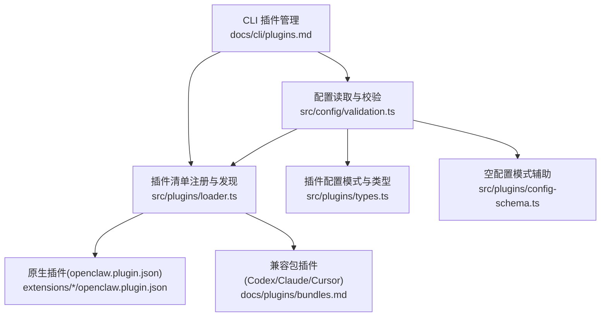
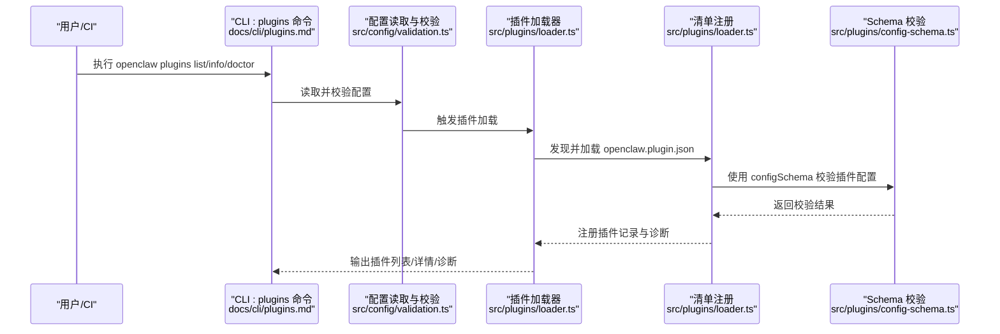
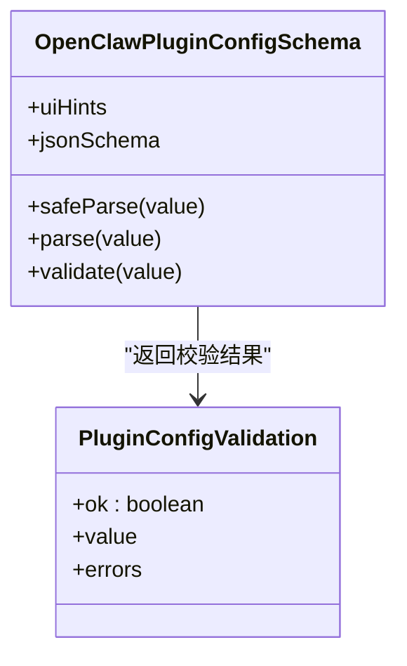
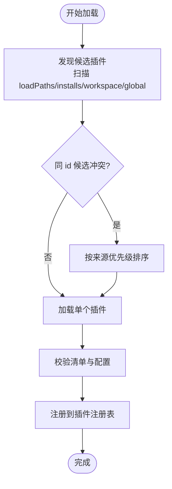
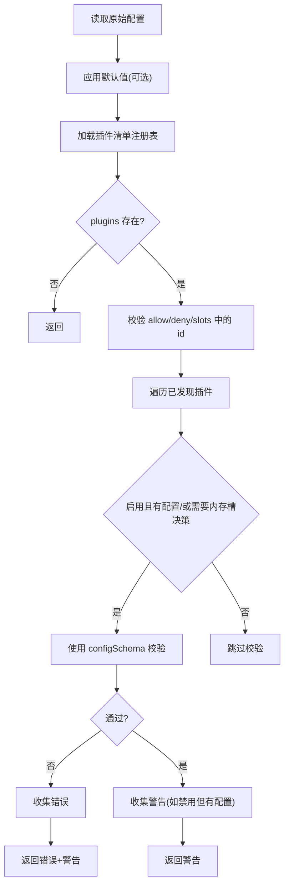
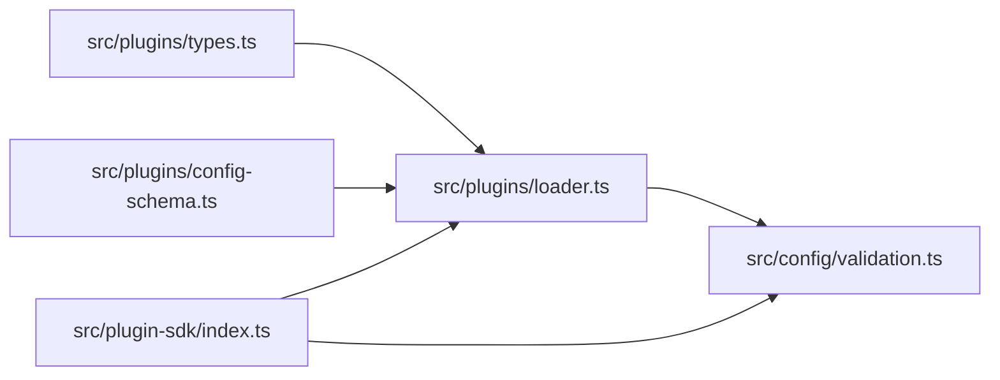

# 插件配置管理

<cite>
**本文档引用的文件**
- [docs/plugins/manifest.md](file://docs/plugins/manifest.md)
- [docs/plugins/bundles.md](file://docs/plugins/bundles.md)
- [docs/cli/plugins.md](file://docs/cli/plugins.md)
- [src/plugins/types.ts](file://src/plugins/types.ts)
- [src/plugins/config-schema.ts](file://src/plugins/config-schema.ts)
- [src/plugins/loader.ts](file://src/plugins/loader.ts)
- [src/config/validation.ts](file://src/config/validation.ts)
- [src/config/config.ts](file://src/config/config.ts)
- [src/plugin-sdk/index.ts](file://src/plugin-sdk/index.ts)
- [extensions/anthropic/openclaw.plugin.json](file://extensions/anthropic/openclaw.plugin.json)
- [extensions/discord/openclaw.plugin.json](file://extensions/discord/openclaw.plugin.json)
</cite>

## 目录
1. [简介](#简介)
2. [项目结构](#项目结构)
3. [核心组件](#核心组件)
4. [架构总览](#架构总览)
5. [详细组件分析](#详细组件分析)
6. [依赖关系分析](#依赖关系分析)
7. [性能考量](#性能考量)
8. [故障排查指南](#故障排查指南)
9. [结论](#结论)
10. [附录](#附录)

## 简介
本文件系统化阐述 OpenClaw 的插件配置管理体系，覆盖插件清单（manifest）格式与校验、配置参数定义与验证、依赖与版本管理、加载顺序与作用域控制、动态配置更新与热重载、配置迁移策略，以及常见问题排查与故障恢复方法。内容面向不同技术背景读者，既提供高层概览也包含代码级映射与图示。

## 项目结构
OpenClaw 将“插件”分为两类：
- 原生插件：以 openclaw.plugin.json 为清单，内置 JSON Schema 校验，支持工具、钩子、通道、提供商等能力注册。
- 兼容包插件（Bundle）：对 Codex/Claude/Cursor 生态的统一归一化处理，仅映射部分能力到原生运行面，不执行包内运行时代码。

图表来源
- [src/config/validation.ts](file://src/config/validation.ts)
- [src/plugins/loader.ts](file://src/plugins/loader.ts)
- [docs/plugins/bundles.md](file://docs/plugins/bundles.md)
- [docs/cli/plugins.md](file://docs/cli/plugins.md)

章节来源
- [docs/plugins/manifest.md](file://docs/plugins/manifest.md)
- [docs/plugins/bundles.md](file://docs/plugins/bundles.md)
- [docs/cli/plugins.md](file://docs/cli/plugins.md)

## 核心组件
- 插件清单与模式
  - 清单字段：id、configSchema（必填）、kind、channels、providers、providerAuthEnvVars、skills、name、description、uiHints、version 等。
  - 校验要求：每个原生插件必须提供 JSON Schema；空配置可用空对象 schema；清单在配置读写时即被严格校验。
- 配置模式与类型
  - OpenClawPluginConfigSchema 支持 safeParse/parse/validate/uiHints/jsonSchema。
  - 插件工具上下文、钩子选项、提供商认证方法、网关方法等类型定义集中于插件类型模块。
- 加载器与注册表
  - 发现与加载：扫描工作区/全局/捆绑路径，解析 openclaw.plugin.json，构建插件记录，按优先级解决重复项。
  - 注册表：维护已加载插件集合、诊断信息、状态（loaded/error/disabled）。
- 配置校验与诊断
  - 对 plugins.entries.*.config 进行 schema 校验；对 plugins.allow/deny/slots 中的插件 id 进行存在性校验；未知通道 id、心跳目标校验等。
  - 未启用但存在配置会给出警告；缺失 schema 的原生插件报错。

章节来源
- [src/plugins/types.ts](file://src/plugins/types.ts)
- [src/plugins/config-schema.ts](file://src/plugins/config-schema.ts)
- [src/plugins/loader.ts](file://src/plugins/loader.ts)
- [src/config/validation.ts](file://src/config/validation.ts)

## 架构总览
下图展示从配置到插件加载与校验的关键流程：

图表来源
- [docs/cli/plugins.md](file://docs/cli/plugins.md)
- [src/config/validation.ts](file://src/config/validation.ts)
- [src/plugins/loader.ts](file://src/plugins/loader.ts)
- [src/plugins/config-schema.ts](file://src/plugins/config-schema.ts)

## 详细组件分析

### 组件A：插件清单与配置模式
- 清单字段与约束
  - 必填：id、configSchema。
  - 可选：kind、channels、providers、providerAuthEnvVars、skills、name、description、uiHints、version。
  - 行为：未知 channels.* 与 plugins.* 引用需可发现，否则为错误；禁用插件仍保留配置并告警。
- 配置模式
  - OpenClawPluginConfigSchema 提供多层校验入口（safeParse/parse/validate），并可携带 UI 提示与 JSON Schema。
  - 空配置模式：emptyPluginConfigSchema 用于无参数插件的严格空对象校验。

图表来源
- [src/plugins/types.ts](file://src/plugins/types.ts)
- [src/plugins/config-schema.ts](file://src/plugins/config-schema.ts)

章节来源
- [docs/plugins/manifest.md](file://docs/plugins/manifest.md)
- [src/plugins/types.ts](file://src/plugins/types.ts)
- [src/plugins/config-schema.ts](file://src/plugins/config-schema.ts)

### 组件B：插件加载与注册
- 发现与去重
  - 按来源优先级（config > global 显式安装 > bundled > workspace）选择候选，同 id 不同来源按秩排序，避免意外覆盖。
- 安全边界
  - 严格路径边界检查，确保插件根目录与受支持的子树在插件根内。
- 诊断与缓存
  - 记录错误与警告；基于工作区/根目录/安装记录/环境变量构建缓存键，限制最大缓存条目数。

图表来源
- [src/plugins/loader.ts](file://src/plugins/loader.ts)

章节来源
- [src/plugins/loader.ts](file://src/plugins/loader.ts)

### 组件C：配置校验与诊断
- 插件配置校验
  - 对 plugins.entries.<id>.config 应用对应插件的 configSchema；缺失 schema 的原生插件报错；bundle 插件当前视为无 schema 能力包。
- 插件引用校验
  - plugins.allow/deny/slots 中的 id 必须可发现；未知 id 报错或警告（移除的插件按警告处理）。
- 通道与心跳目标校验
  - channels.* 与心跳目标需在已知通道集合中，未知通道或目标报错。
- 警告与错误分离
  - 未启用但存在配置给出警告；缺失 schema 或未知引用报错。

图表来源
- [src/config/validation.ts](file://src/config/validation.ts)

章节来源
- [src/config/validation.ts](file://src/config/validation.ts)

### 组件D：CLI 插件管理与安全
- 命令集：list、info、enable、disable、uninstall、doctor、update。
- 安装策略：本地路径/归档自动检测原生与兼容包；npm 安装仅支持精确版本或稳定 dist-tag；支持 --link 与 --pin。
- 卸载与更新：清理 entries/installs/allowlist 与链接路径；仅对受跟踪的 npm 插件生效。

章节来源
- [docs/cli/plugins.md](file://docs/cli/plugins.md)

### 组件E：兼容包插件（Bundle）
- 归一化模型：Codex/Claude/Cursor 三类生态统一为一个内部记录，映射受支持的能力（技能、钩子、MCP、嵌入 Pi 设置等）。
- 安全边界：不执行包内运行时代码，仅读取与边界检查；未映射能力显示为“已检测但未执行”。

章节来源
- [docs/plugins/bundles.md](file://docs/plugins/bundles.md)

## 依赖关系分析
- 类型与模式
  - 插件类型定义集中于 src/plugins/types.ts，作为所有插件能力的契约。
  - 配置模式与空模式位于 src/plugins/config-schema.ts，为插件 schema 的基础实现。
- 加载与校验
  - 插件加载器 src/plugins/loader.ts 依赖清单注册与路径安全工具，并调用 schema 校验器。
  - 配置校验 src/config/validation.ts 依赖插件清单注册表与通道常量，负责跨配置维度的强一致校验。
- SDK 导出
  - src/plugin-sdk/index.ts 汇总导出插件相关工具、类型与运行时接口，供插件开发与集成使用。

图表来源
- [src/plugins/types.ts](file://src/plugins/types.ts)
- [src/plugins/config-schema.ts](file://src/plugins/config-schema.ts)
- [src/plugins/loader.ts](file://src/plugins/loader.ts)
- [src/config/validation.ts](file://src/config/validation.ts)
- [src/plugin-sdk/index.ts](file://src/plugin-sdk/index.ts)

章节来源
- [src/plugins/types.ts](file://src/plugins/types.ts)
- [src/plugins/config-schema.ts](file://src/plugins/config-schema.ts)
- [src/plugins/loader.ts](file://src/plugins/loader.ts)
- [src/config/validation.ts](file://src/config/validation.ts)
- [src/plugin-sdk/index.ts](file://src/plugin-sdk/index.ts)

## 性能考量
- 缓存策略
  - 插件注册表采用基于关键输入的缓存键，限制最大缓存条目，避免频繁重建注册表带来的开销。
- 校验优化
  - 在配置读取阶段即进行严格 schema 校验，避免运行期昂贵的动态校验。
- 路径与边界
  - 严格的路径边界检查与预扫描减少运行期 IO 异常与越界风险。

[本节为通用指导，无需特定文件引用]

## 故障排查指南
- 清单与 schema 错误
  - 症状：插件未加载或启动失败。
  - 排查：确认 openclaw.plugin.json 是否存在且包含合法 configSchema；使用 openclaw plugins doctor 查看诊断。
- 未知插件引用
  - 症状：plugins.allow/deny/slots 中的 id 无效。
  - 排查：使用 openclaw plugins list 获取可发现插件 id；确保拼写与大小写正确。
- 通道与心跳目标错误
  - 症状：channels.<id> 或 agents.*.heartbeat.target 报未知通道。
  - 排查：核对通道 id 是否在已知集合中；若为自定义通道，需在插件清单中声明 channels。
- 禁用插件仍有配置
  - 症状：出现“插件禁用但配置存在”的警告。
  - 处理：删除或注释掉该插件的配置段，或启用插件。
- 兼容包能力未执行
  - 症状：某些能力被检测但未执行。
  - 说明：当前产品限制所致，非安装错误；可在 info 输出中查看“detected but not wired”能力。

章节来源
- [src/config/validation.ts](file://src/config/validation.ts)
- [docs/cli/plugins.md](file://docs/cli/plugins.md)

## 结论
OpenClaw 的插件配置管理以“清单 + JSON Schema”为核心，结合严格的加载顺序与安全边界、全面的配置校验与诊断、以及 CLI 管理工具，形成从安装、启用、校验到故障排查的完整闭环。对于原生插件，清单与 schema 是启动前的唯一权威；对于兼容包，系统以最小执行面映射受支持能力，兼顾安全性与扩展性。

[本节为总结性内容，无需特定文件引用]

## 附录

### A. 插件清单示例与最佳实践
- 示例清单字段
  - anthropic 插件清单包含 id、providers、providerAuthEnvVars、空 configSchema。
  - discord 插件清单包含 id、channels、空 configSchema。
- 最佳实践
  - 为每个插件提供明确的 configSchema，即使为空对象。
  - 使用 uiHints 提升配置界面友好度。
  - 通过 channels/providers 字段声明能力，便于 Doctor 与校验识别。
  - 对需要凭据的提供商，使用 providerAuthEnvVars 提前暴露环境变量名，避免加载插件运行时再解析。

章节来源
- [extensions/anthropic/openclaw.plugin.json](file://extensions/anthropic/openclaw.plugin.json)
- [extensions/discord/openclaw.plugin.json](file://extensions/discord/openclaw.plugin.json)
- [docs/plugins/manifest.md](file://docs/plugins/manifest.md)

### B. 动态配置更新与热重载
- 配置读写与刷新
  - 配置 IO 与快照管理由配置模块提供；当配置变更时，建议触发重新加载插件注册表与校验流程。
- 热重载策略
  - 建议在 CI/本地开发场景中，先 validate 再 reload；生产环境建议通过重启服务或显式触发重载流程，确保一致性。

章节来源
- [src/config/config.ts](file://src/config/config.ts)
- [src/config/validation.ts](file://src/config/validation.ts)
- [src/plugins/loader.ts](file://src/plugins/loader.ts)

### C. 版本兼容性与迁移
- 版本与兼容
  - 插件清单包含 version 字段（信息性），用于追踪与审计；CLI 文档强调 npm 安装需精确版本或稳定标签。
- 迁移策略
  - 当插件移除或重命名时，配置中残留条目会被标记为“已移除/未找到”，建议清理旧条目；对 schema 变更，应提供向后兼容的空 schema 或迁移脚本。

章节来源
- [docs/plugins/manifest.md](file://docs/plugins/manifest.md)
- [docs/cli/plugins.md](file://docs/cli/plugins.md)
- [src/config/validation.ts](file://src/config/validation.ts)