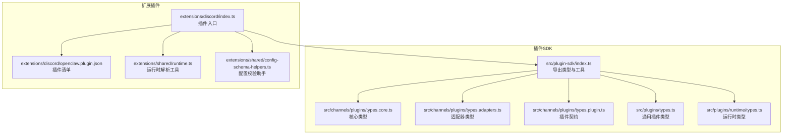
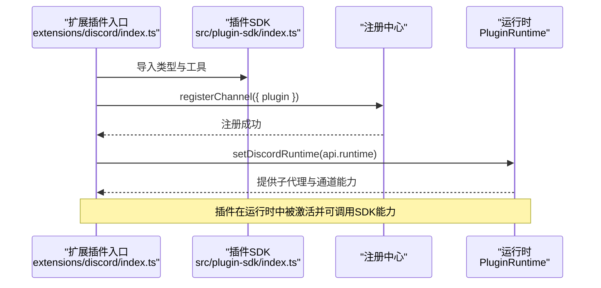
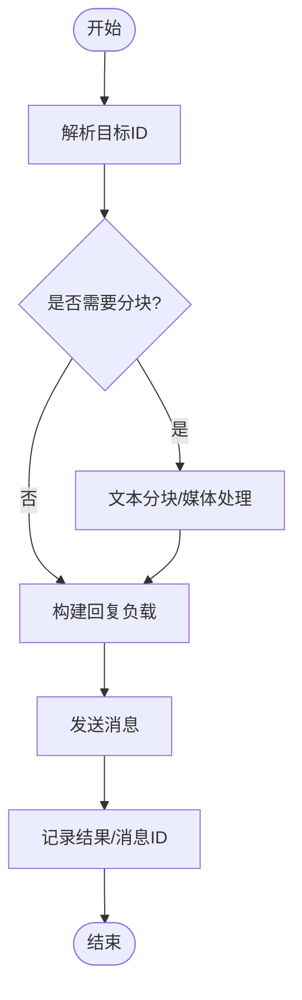
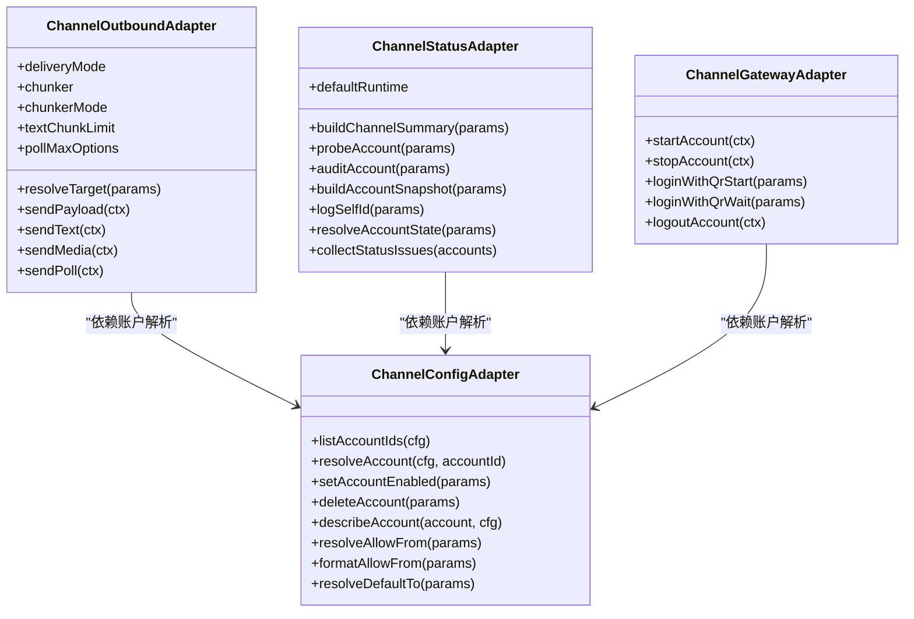
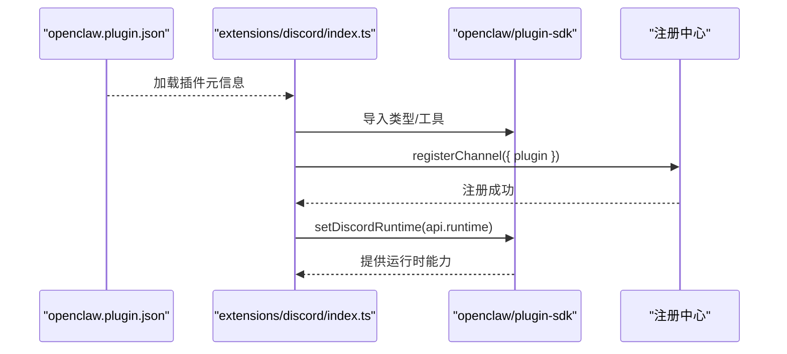
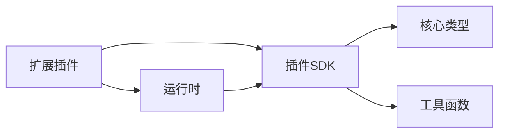

# 渠道插件系统

<cite>
**本文档引用的文件**
- [index.ts](file://src/plugin-sdk/index.ts)
- [types.plugin.ts](file://src/channels/plugins/types.plugin.ts)
- [types.adapters.ts](file://src/channels/plugins/types.adapters.ts)
- [types.core.ts](file://src/channels/plugins/types.core.ts)
- [types.ts](file://src/plugins/types.ts)
- [runtime/types.ts](file://src/plugins/runtime/types.ts)
- [openclaw.plugin.json](file://extensions/discord/openclaw.plugin.json)
- [index.ts](file://extensions/discord/index.ts)
- [runtime.ts](file://extensions/shared/runtime.ts)
- [config-schema-helpers.ts](file://extensions/shared/config-schema-helpers.ts)
</cite>

## 目录
1. [简介](#简介)
2. [项目结构](#项目结构)
3. [核心组件](#核心组件)
4. [架构总览](#架构总览)
5. [详细组件分析](#详细组件分析)
6. [依赖关系分析](#依赖关系分析)
7. [性能考虑](#性能考虑)
8. [故障排除指南](#故障排除指南)
9. [结论](#结论)
10. [附录](#附录)

## 简介
本文件面向开发者与使用者，系统性介绍 OpenClaw 的渠道插件系统：从插件架构、接口规范到生命周期管理；从注册机制、配置管理到依赖处理；并提供可直接参考的开发模板、测试调试流程以及安全与性能优化建议。目标是帮助你在最短时间内理解并高效开发、集成与维护渠道插件。

## 项目结构
OpenClaw 将“插件 SDK”与“扩展插件”分层组织：
- 插件 SDK（核心能力）位于 `src/plugin-sdk/index.ts` 及其子模块，提供统一的类型、工具函数与运行时接口。
- 扩展插件（如 Discord、Slack、Telegram 等）位于 `extensions/<channel>/` 目录，每个插件通过 `openclaw.plugin.json` 声明元数据并通过入口文件注册。

**图表来源**
- [index.ts:1-872](file://src/plugin-sdk/index.ts#L1-L872)
- [types.core.ts:1-410](file://src/channels/plugins/types.core.ts#L1-L410)
- [types.adapters.ts:1-386](file://src/channels/plugins/types.adapters.ts#L1-L386)
- [types.plugin.ts:1-85](file://src/channels/plugins/types.plugin.ts#L1-L85)
- [types.ts:1-800](file://src/plugins/types.ts#L1-L800)
- [runtime/types.ts:1-64](file://src/plugins/runtime/types.ts#L1-L64)
- [index.ts:1-23](file://extensions/discord/index.ts#L1-L23)
- [openclaw.plugin.json:1-10](file://extensions/discord/openclaw.plugin.json#L1-L10)
- [runtime.ts:1-15](file://extensions/shared/runtime.ts#L1-L15)
- [config-schema-helpers.ts:1-26](file://extensions/shared/config-schema-helpers.ts#L1-L26)

**章节来源**
- [index.ts:1-872](file://src/plugin-sdk/index.ts#L1-L872)
- [types.plugin.ts:1-85](file://src/channels/plugins/types.plugin.ts#L1-L85)
- [types.adapters.ts:1-386](file://src/channels/plugins/types.adapters.ts#L1-L386)
- [types.core.ts:1-410](file://src/channels/plugins/types.core.ts#L1-L410)
- [types.ts:1-800](file://src/plugins/types.ts#L1-L800)
- [runtime/types.ts:1-64](file://src/plugins/runtime/types.ts#L1-L64)
- [index.ts:1-23](file://extensions/discord/index.ts#L1-L23)
- [openclaw.plugin.json:1-10](file://extensions/discord/openclaw.plugin.json#L1-L10)
- [runtime.ts:1-15](file://extensions/shared/runtime.ts#L1-L15)
- [config-schema-helpers.ts:1-26](file://extensions/shared/config-schema-helpers.ts#L1-L26)

## 核心组件
- 插件契约（ChannelPlugin）
  - 定义插件标识、元信息、能力集、默认行为、配置模式、适配器集合等。
  - 关键字段包括：id、meta、capabilities、config、configSchema、setup、pairing、security、groups、mentions、outbound、status、gatewayMethods、gateway、auth、elevated、commands、streaming、threading、messaging、agentPrompt、directory、resolver、actions、heartbeat、agentTools 等。
- 适配器集合（Adapters）
  - 配置适配器（ConfigAdapter）：账户列表、解析、启用/禁用、删除、描述快照等。
  - 外发适配器（OutboundAdapter）：目标解析、文本/媒体发送、轮询消息发送、分块策略等。
  - 状态适配器（StatusAdapter）：探针、审计、快照构建、状态汇总、问题收集等。
  - 网关适配器（GatewayAdapter）：账户启动/停止、二维码登录、登出等。
  - 其他适配器：命令、安全、目录、解析、提及、流式、线程、消息、心跳等。
- 运行时（PluginRuntime）
  - 提供子代理运行、等待、会话消息查询、会话删除等能力，并暴露 channel 子域以复用 SDK 能力。
- 插件 SDK 导出
  - 统一导出类型、工具函数（如 webhook 注册、SSRF 保护、允许列表匹配、回复负载构建、运行时解析等），便于扩展插件快速接入。

**章节来源**
- [types.plugin.ts:49-84](file://src/channels/plugins/types.plugin.ts#L49-L84)
- [types.adapters.ts:24-386](file://src/channels/plugins/types.adapters.ts#L24-L386)
- [types.core.ts:184-410](file://src/channels/plugins/types.core.ts#L184-L410)
- [runtime/types.ts:51-63](file://src/plugins/runtime/types.ts#L51-L63)
- [index.ts:1-872](file://src/plugin-sdk/index.ts#L1-L872)

## 架构总览
下图展示插件注册与运行时交互的关键路径：扩展插件通过入口文件调用 SDK 的注册 API，注入通道实现；运行时通过 SDK 暴露的能力完成消息路由、回复派发、会话管理、媒体处理等。

**图表来源**
- [index.ts:12-20](file://extensions/discord/index.ts#L12-L20)
- [index.ts:1-872](file://src/plugin-sdk/index.ts#L1-L872)
- [runtime/types.ts:51-63](file://src/plugins/runtime/types.ts#L51-L63)

**章节来源**
- [index.ts:1-23](file://extensions/discord/index.ts#L1-L23)
- [index.ts:1-872](file://src/plugin-sdk/index.ts#L1-L872)
- [runtime/types.ts:1-64](file://src/plugins/runtime/types.ts#L1-L64)

## 详细组件分析

### 插件契约与生命周期
- 契约定义
  - ChannelPlugin 是通道插件的核心契约，包含 id、meta、capabilities、config、configSchema、各适配器与 agentTools 等。
  - defaults.reload 支持按前缀热重载；gatewayMethods 用于声明网关方法；heartbeat 用于健康检查。
- 生命周期阶段
  - 初始化：加载配置、解析账户、构建适配器实例。
  - 运行期：接收/发送消息、状态探针、审计、心跳检查。
  - 停止：清理资源、断开连接、注销账户。
- 典型流程（以外发为例）
  - 解析目标 -> 文本/媒体分块 -> 发送 -> 记录结果 -> 回传消息ID。

**图表来源**
- [types.adapters.ts:110-127](file://src/channels/plugins/types.adapters.ts#L110-L127)
- [types.core.ts:294-317](file://src/channels/plugins/types.core.ts#L294-L317)

**章节来源**
- [types.plugin.ts:49-84](file://src/channels/plugins/types.plugin.ts#L49-L84)
- [types.adapters.ts:110-127](file://src/channels/plugins/types.adapters.ts#L110-L127)
- [types.core.ts:294-317](file://src/channels/plugins/types.core.ts#L294-L317)

### 适配器详解
- 配置适配器（ConfigAdapter）
  - 列举账户、解析账户、默认账户、启用/禁用、删除、描述快照、allowFrom/defaultTo 解析与格式化等。
- 外发适配器（OutboundAdapter）
  - deliveryMode 支持 direct/gateway/hybrid；支持分块器、轮询消息发送、文本/媒体发送。
- 状态适配器（StatusAdapter）
  - 探针（probe）、审计（audit）、快照构建、状态汇总、问题收集。
- 网关适配器（GatewayAdapter）
  - 启动/停止账户、二维码登录、登出；可选 channelRuntime 以获得 SDK 能力。
- 其他适配器
  - 安全（resolveDmPolicy、collectWarnings）、目录（self/listPeers/listGroups/listGroupMembers）、解析（resolveTargets）、提及（stripRegexes/stripPatterns/stripMentions）、流式（blockStreamingCoalesceDefaults）、线程（resolveReplyToMode/buildToolContext）、消息（normalizeTarget/targetResolver/formatTargetDisplay）、心跳（checkReady/resolveRecipients）。

**图表来源**
- [types.adapters.ts:52-386](file://src/channels/plugins/types.adapters.ts#L52-L386)

**章节来源**
- [types.adapters.ts:52-386](file://src/channels/plugins/types.adapters.ts#L52-L386)

### 插件注册机制与清单
- 插件清单（openclaw.plugin.json）
  - 包含 id、channels/providers、providerAuthEnvVars、configSchema 等元信息。
  - 示例：Discord 插件声明其 channels 为 ["discord"]，并提供空配置模式。
- 插件入口（index.ts）
  - 导入 SDK 类型与工具，设置运行时，注册通道插件；在 full 模式下注册子代理钩子。
- 共享运行时解析
  - shared/runtime.ts 提供 resolveLoggerBackedRuntime，当外部插件未提供 runtime 时，自动回退到 SDK 创建的运行时。

**图表来源**
- [openclaw.plugin.json:1-10](file://extensions/discord/openclaw.plugin.json#L1-L10)
- [index.ts:1-23](file://extensions/discord/index.ts#L1-L23)
- [runtime.ts:1-15](file://extensions/shared/runtime.ts#L1-L15)

**章节来源**
- [openclaw.plugin.json:1-10](file://extensions/discord/openclaw.plugin.json#L1-L10)
- [index.ts:1-23](file://extensions/discord/index.ts#L1-L23)
- [runtime.ts:1-15](file://extensions/shared/runtime.ts#L1-L15)

### 配置管理与依赖处理
- 配置模式
  - ChannelConfigSchema 提供 JSON Schema 与 UI 提示（label/help/tags/advanced/sensitive/placeholder/itemTemplate）。
  - emptyPluginConfigSchema 提供空配置模式，便于无配置需求的插件。
- 允许列表与安全策略
  - requireChannelOpenAllowFrom 辅助校验开放 DM 策略必须包含通配条目。
  - 安全上下文（ChannelSecurityContext）与 DM 策略（ChannelSecurityDmPolicy）用于解析与收集警告。
- 依赖与运行时
  - 运行时（PluginRuntime）提供子代理运行、等待、会话消息查询、会话删除等；channel 子域提供回复派发、路由、文本处理、会话管理、媒体处理、命令授权、群组策略、配对等能力。
  - shared/runtime.ts 的 resolveLoggerBackedRuntime 保证外部插件在缺少 runtime 时也能正常工作。

**章节来源**
- [types.plugin.ts:33-46](file://src/channels/plugins/types.plugin.ts#L33-L46)
- [index.ts:166-166](file://src/plugin-sdk/index.ts#L166-L166)
- [config-schema-helpers.ts:11-25](file://extensions/shared/config-schema-helpers.ts#L11-L25)
- [types.adapters.ts:380-385](file://src/channels/plugins/types.adapters.ts#L380-L385)
- [runtime/types.ts:51-63](file://src/plugins/runtime/types.ts#L51-L63)
- [runtime.ts:3-14](file://extensions/shared/runtime.ts#L3-L14)

### 开发示例与模板
- 最小化插件模板
  - 使用 emptyPluginConfigSchema 定义空配置；
  - 在入口文件中导入 SDK 类型与工具，注册通道插件；
  - 如需网关能力，可在 full 模式下注册子代理钩子。
- 配置校验模板
  - 使用 requireChannelOpenAllowFrom 校验开放 DM 策略；
  - 通过 ChannelSecurityAdapter 的 resolveDmPolicy 与 collectWarnings 实现策略解析与告警收集。
- 运行时使用模板
  - 通过 resolveLoggerBackedRuntime 获取运行时，确保在外部插件场景下的兼容性。

**章节来源**
- [index.ts:1-23](file://extensions/discord/index.ts#L1-L23)
- [openclaw.plugin.json:1-10](file://extensions/discord/openclaw.plugin.json#L1-L10)
- [config-schema-helpers.ts:11-25](file://extensions/shared/config-schema-helpers.ts#L11-L25)
- [runtime.ts:3-14](file://extensions/shared/runtime.ts#L3-L14)

### 测试、调试与发布流程
- 测试
  - 单元测试：针对适配器与工具函数编写测试用例，覆盖目标解析、发送、状态探针等。
  - 集成测试：模拟完整生命周期，验证注册、运行、停止流程。
  - 性能测试：评估分块、并发发送、会话查询等操作的吞吐与延迟。
- 调试
  - 使用 SDK 提供的日志与诊断事件接口输出调试信息；
  - 通过 StatusAdapter 的问题收集与日志记录定位异常。
- 发布
  - 更新 openclaw.plugin.json 中的元信息与配置模式；
  - 确保依赖版本与 SDK 版本兼容；
  - 提供最小可运行示例与文档链接。

[本节为通用流程说明，不直接分析具体文件，故无“章节来源”]

## 依赖关系分析
- 内聚与耦合
  - 插件 SDK 对外仅暴露 types 与工具函数，降低扩展插件对内部实现的耦合。
  - 适配器之间通过 OpenClawConfig 与账户解析弱耦合，提升内聚性。
- 外部依赖
  - 插件通过 SDK 的运行时能力访问网络、文件系统、会话存储等基础设施。
  - webhook 注册与请求守卫、SSRF 保护、媒体下载等由 SDK 统一封装。
- 循环依赖
  - 插件入口仅导入 SDK 类型与工具，避免循环依赖风险。

**图表来源**
- [index.ts:1-872](file://src/plugin-sdk/index.ts#L1-L872)
- [types.ts:1-800](file://src/plugins/types.ts#L1-L800)

**章节来源**
- [index.ts:1-872](file://src/plugin-sdk/index.ts#L1-L872)
- [types.ts:1-800](file://src/plugins/types.ts#L1-L800)

## 性能考虑
- 分块与限流
  - 合理设置文本分块大小与模式，减少单次发送失败的影响。
  - 使用 SDK 提供的内存守卫与速率限制器控制 webhook 并发。
- 缓存与预热
  - 对动态模型解析与令牌交换进行缓存与预热，减少冷启动开销。
- I/O 优化
  - 媒体下载采用临时路径与原子写入，避免中间态损坏。
- 并发控制
  - 使用 keyed 异步队列与任务排队，避免资源争用。

[本节提供通用指导，不直接分析具体文件，故无“章节来源”]

## 故障排除指南
- 常见问题
  - 配置错误：检查 allowFrom 与 DM 策略一致性；使用 requireChannelOpenAllowFrom 辅助校验。
  - 权限不足：通过 SecurityAdapter 的 collectWarnings 收集策略告警。
  - 发送失败：查看 OutboundAdapter 的返回结果与错误日志。
  - 状态异常：利用 StatusAdapter 的 probe/audit 与问题收集功能定位。
- 调试技巧
  - 启用诊断事件与日志传输，观察消息入站/出站与会话状态变化。
  - 使用运行时的会话查询与子代理等待接口确认执行链路。

**章节来源**
- [config-schema-helpers.ts:11-25](file://extensions/shared/config-schema-helpers.ts#L11-L25)
- [types.adapters.ts:380-385](file://src/channels/plugins/types.adapters.ts#L380-L385)
- [types.adapters.ts:129-168](file://src/channels/plugins/types.adapters.ts#L129-L168)
- [types.ts:644-666](file://src/plugins/types.ts#L644-L666)

## 结论
OpenClaw 的渠道插件系统以清晰的契约与强大的 SDK 工具链为核心，既保证了内置通道的一致性，又为外部扩展提供了充分的自由度。通过标准化的适配器、完善的生命周期管理与丰富的运行时能力，开发者可以快速构建稳定、可维护且高性能的渠道插件。

## 附录
- 快速参考
  - 插件清单字段：id、channels、providers、providerAuthEnvVars、configSchema。
  - 入口文件职责：导入 SDK 类型与工具、设置运行时、注册通道、按需注册子代理钩子。
  - 配置校验：使用 requireChannelOpenAllowFrom 与 SecurityAdapter 的策略解析。
  - 运行时能力：子代理运行、等待、会话查询、会话删除、通道能力复用。

[本节为补充说明，不直接分析具体文件，故无“章节来源”]