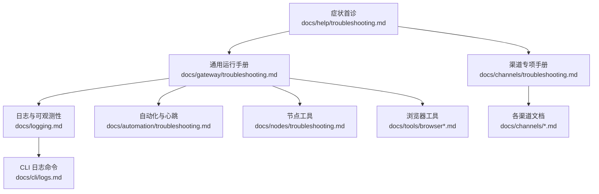
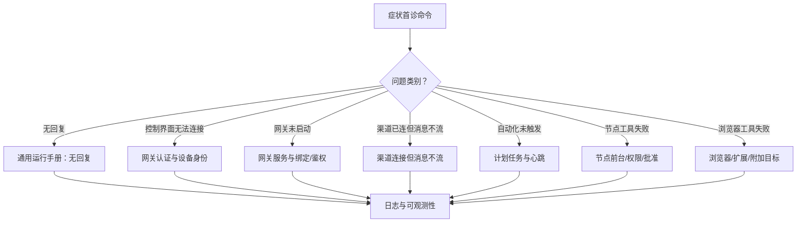
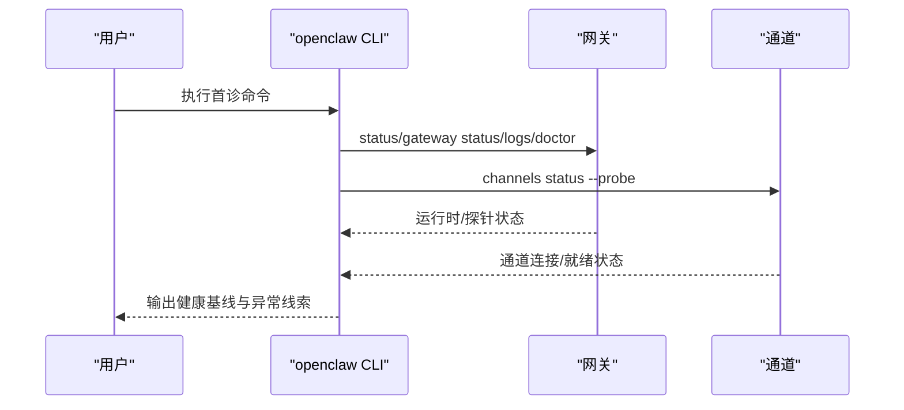
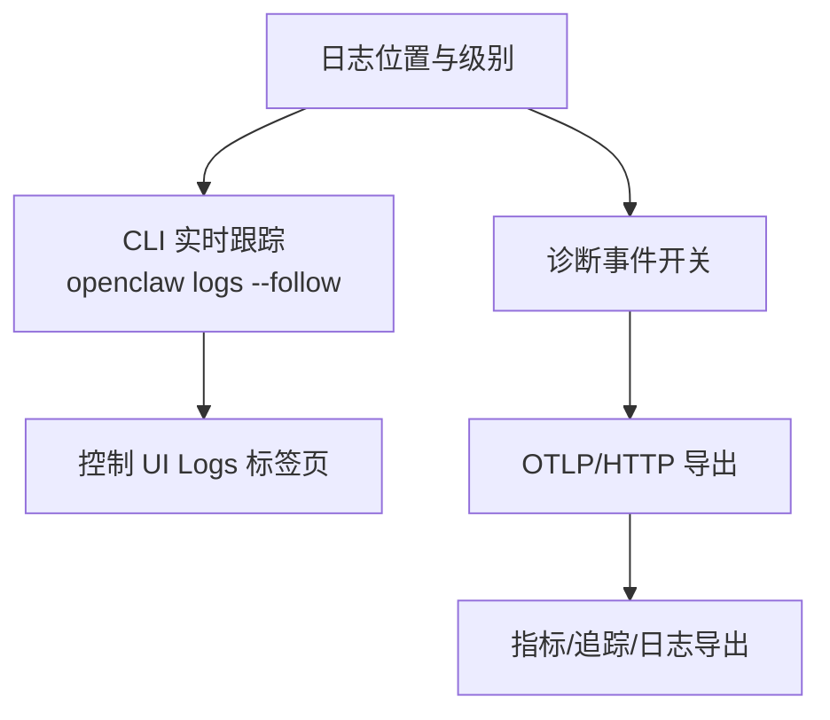
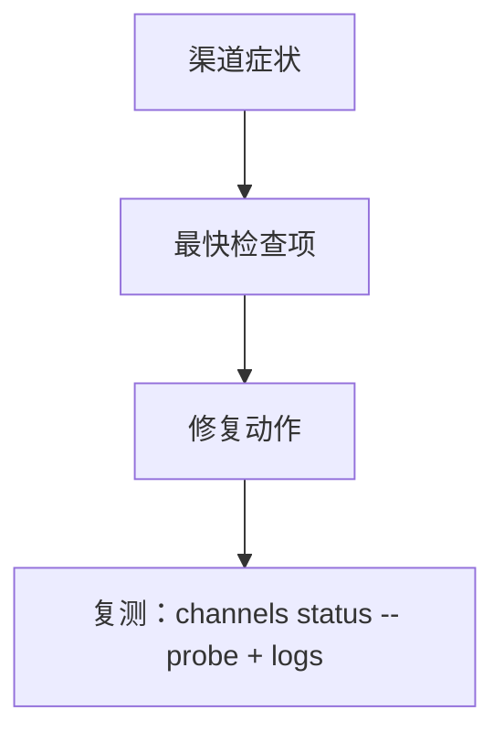
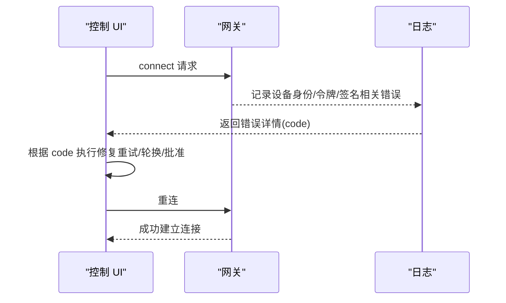
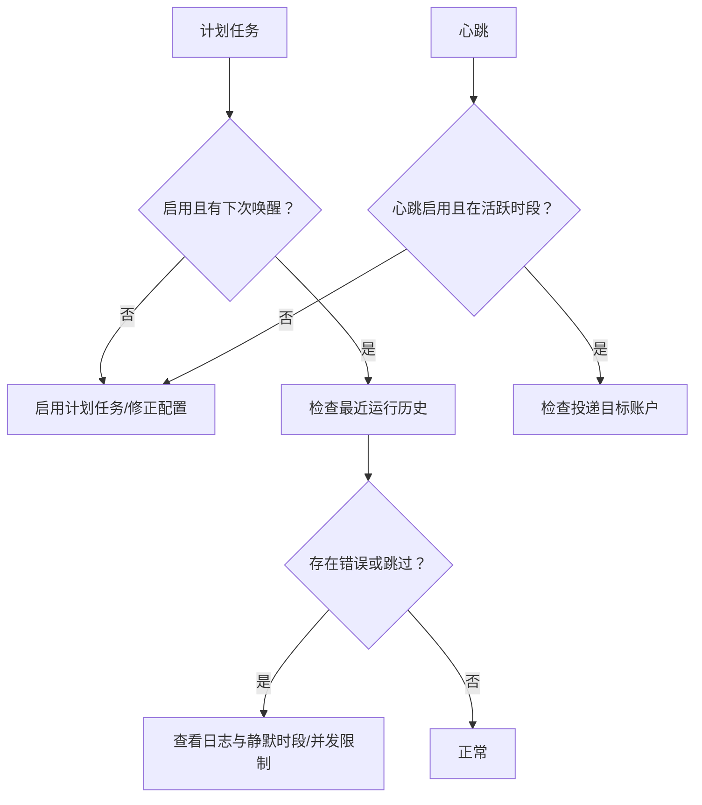
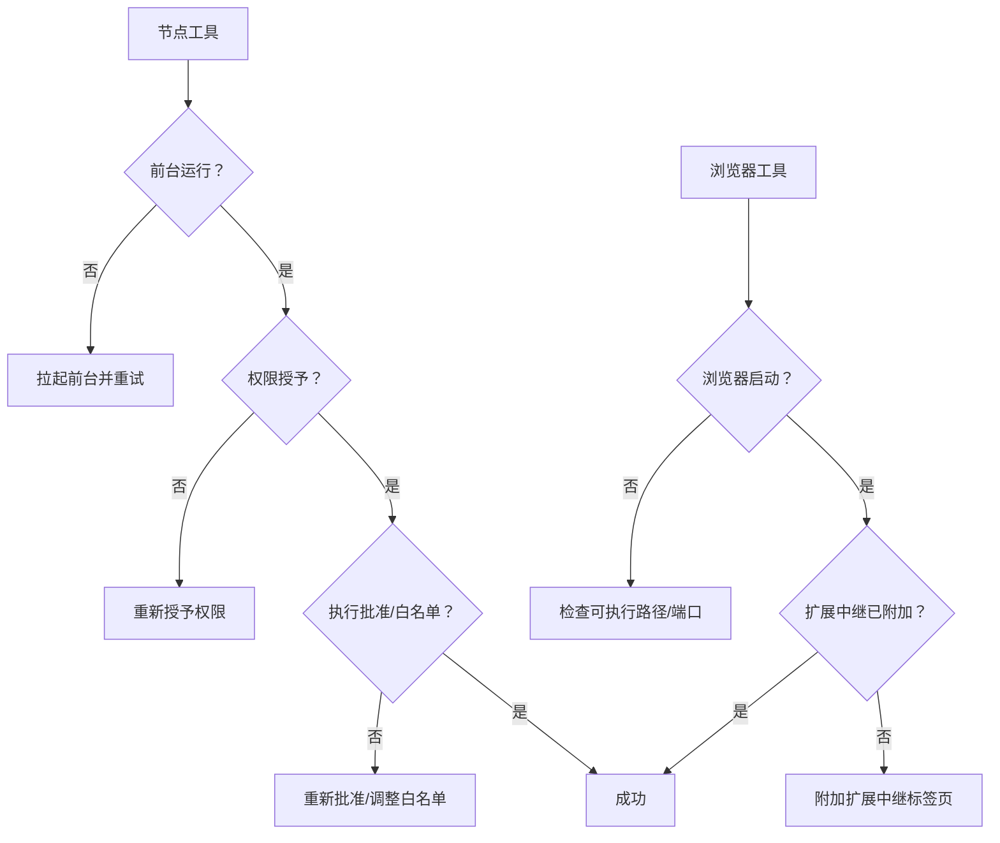
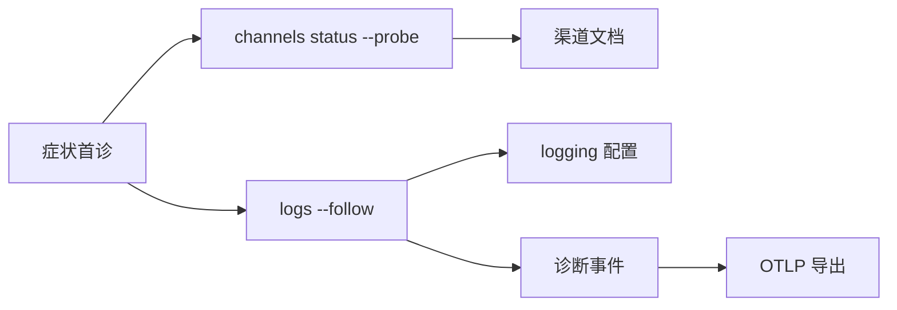

# 渠道故障排除

<cite>
**本文引用的文件**
- [docs/help/troubleshooting.md](file://docs/help/troubleshooting.md)
- [docs/channels/troubleshooting.md](file://docs/channels/troubleshooting.md)
- [docs/gateway/troubleshooting.md](file://docs/gateway/troubleshooting.md)
- [docs/logging.md](file://docs/logging.md)
- [docs/gateway/logging.md](file://docs/gateway/logging.md)
- [docs/cli/logs.md](file://docs/cli/logs.md)
- [docs/nodes/troubleshooting.md](file://docs/nodes/troubleshooting.md)
- [docs/gateway/heartbeat.md](file://docs/gateway/heartbeat.md)
- [docs/automation/troubleshooting.md](file://docs/automation/troubleshooting.md)
- [docs/web/control-ui.md](file://docs/web/control-ui.md)
- [docs/gateway/authentication.md](file://docs/gateway/authentication.md)
- [docs/gateway/background-process.md](file://docs/gateway/background-process.md)
- [docs/gateway/configuration.md](file://docs/gateway/configuration.md)
- [docs/gateway/doctor.md](file://docs/gateway/doctor.md)
- [docs/tools/browser.md](file://docs/tools/browser.md)
- [docs/tools/browser-linux-troubleshooting.md](file://docs/tools/browser-linux-troubleshooting.md)
- [docs/tools/browser-wsl2-windows-remote-cdp-troubleshooting.md](file://docs/tools/browser-wsl2-windows-remote-cdp-troubleshooting.md)
- [docs/tools/chrome-extension.md](file://docs/tools/chrome-extension.md)
- [docs/channels/pairing.md](file://docs/channels/pairing.md)
- [docs/channels/groups.md](file://docs/channels/groups.md)
- [docs/channels/whatsapp.md](file://docs/channels/whatsapp.md)
- [docs/channels/telegram.md](file://docs/channels/telegram.md)
- [docs/channels/discord.md](file://docs/channels/discord.md)
- [docs/channels/signal.md](file://docs/channels/signal.md)
- [docs/channels/matrix.md](file://docs/channels/matrix.md)
- [docs/channels/imessage.md](file://docs/channels/imessage.md)
- [docs/channels/bluebubbles.md](file://docs/channels/bluebubbles.md)
</cite>

## 目录
1. [简介](#简介)
2. [项目结构](#项目结构)
3. [核心组件](#核心组件)
4. [架构总览](#架构总览)
5. [详细组件分析](#详细组件分析)
6. [依赖分析](#依赖分析)
7. [性能考虑](#性能考虑)
8. [故障排除指南](#故障排除指南)
9. [结论](#结论)
10. [附录](#附录)

## 简介
本指南面向在使用 OpenClaw 的过程中遇到“渠道（Channel）”相关问题的用户与运维人员，提供系统化的诊断流程、命令清单、日志分析方法、调试工具与监控指标说明，并按常见问题类型给出快速修复清单与预防性维护建议。内容覆盖连接失败、消息丢失、认证错误、权限缺失、策略阻断、网关不可达、自动化调度异常、节点工具执行失败以及浏览器工具问题等场景。

## 项目结构
OpenClaw 将“故障排除”拆分为三层：
- 快速三板斧：症状导向的首诊流程，帮助在 2 分钟内定位问题类别。
- 深入运行手册：针对具体问题类别的深度诊断与修复步骤。
- 工具与日志：日志采集、格式化、导出与可观测性增强。

图表来源
- [docs/help/troubleshooting.md:1-299](file://docs/help/troubleshooting.md#L1-L299)
- [docs/gateway/troubleshooting.md:1-380](file://docs/gateway/troubleshooting.md#L1-L380)
- [docs/channels/troubleshooting.md:1-119](file://docs/channels/troubleshooting.md#L1-L119)
- [docs/logging.md:1-353](file://docs/logging.md#L1-L353)
- [docs/cli/logs.md:1-29](file://docs/cli/logs.md#L1-L29)

章节来源
- [docs/help/troubleshooting.md:1-299](file://docs/help/troubleshooting.md#L1-L299)
- [docs/gateway/troubleshooting.md:1-380](file://docs/gateway/troubleshooting.md#L1-L380)
- [docs/channels/troubleshooting.md:1-119](file://docs/channels/troubleshooting.md#L1-L119)
- [docs/logging.md:1-353](file://docs/logging.md#L1-L353)
- [docs/cli/logs.md:1-29](file://docs/cli/logs.md#L1-L29)

## 核心组件
- 症状首诊流程：通过一组固定命令快速判断问题类别（无回复、控制界面无法连接、网关未启动、渠道已连但消息不流动、自动化未触发、节点工具失败、浏览器工具失败）。
- 渠道专项手册：按渠道列出典型症状、最快检查项与修复动作，涵盖 WhatsApp、Telegram、Discord、Slack、iMessage/BlueBubbles、Signal、Matrix 等。
- 日志与可观测性：统一的日志位置、格式与 CLI 命令；支持 JSON/TTY/紧凑模式；可启用诊断事件与 OpenTelemetry 导出。
- 自动化与心跳：验证计划任务与心跳状态、跳过原因与投递目标。
- 节点与浏览器：节点前台要求、权限矩阵、批准与执行白名单；浏览器 CDP 启动、扩展中继与附加目标。

章节来源
- [docs/help/troubleshooting.md:68-299](file://docs/help/troubleshooting.md#L68-L299)
- [docs/channels/troubleshooting.md:13-119](file://docs/channels/troubleshooting.md#L13-L119)
- [docs/logging.md:100-353](file://docs/logging.md#L100-L353)
- [docs/gateway/troubleshooting.md:213-380](file://docs/gateway/troubleshooting.md#L213-L380)
- [docs/nodes/troubleshooting.md:13-115](file://docs/nodes/troubleshooting.md#L13-L115)
- [docs/tools/browser.md:1-299](file://docs/tools/browser.md#L1-L299)

## 架构总览
下图展示从“症状首诊”到“深入运行手册”的决策路径，以及与“日志与可观测性”的关系。

图表来源
- [docs/help/troubleshooting.md:68-299](file://docs/help/troubleshooting.md#L68-L299)
- [docs/gateway/troubleshooting.md:14-380](file://docs/gateway/troubleshooting.md#L14-L380)
- [docs/logging.md:100-353](file://docs/logging.md#L100-L353)

## 详细组件分析

### 组件A：症状首诊与命令阶梯
- 首诊命令顺序与健康基线：status、gateway status、logs --follow、doctor、channels status --probe。
- 健康信号：Runtime 运行中、RPC 探针 OK、通道探针显示 connected/ready。
- 针对性深挖：根据首诊结果进入相应运行手册章节。

图表来源
- [docs/help/troubleshooting.md:13-36](file://docs/help/troubleshooting.md#L13-L36)
- [docs/gateway/troubleshooting.md:14-31](file://docs/gateway/troubleshooting.md#L14-L31)

章节来源
- [docs/help/troubleshooting.md:13-36](file://docs/help/troubleshooting.md#L13-L36)
- [docs/gateway/troubleshooting.md:14-31](file://docs/gateway/troubleshooting.md#L14-L31)

### 组件B：日志与可观测性
- 日志位置与格式：默认滚动文件位于 /tmp/openclaw/openclaw-YYYY-MM-DD.log；支持 JSON Lines 文件与 CLI/控制 UI 实时跟踪。
- CLI 命令：openclaw logs 支持 --follow、--json、--limit、--local-time 等。
- 控制 UI：通过 logs.tail 实时查看。
- 诊断事件与 OpenTelemetry：可启用诊断事件、设置 flags、导出至 OTLP/HTTP 收集器，导出指标与追踪。

图表来源
- [docs/logging.md:20-114](file://docs/logging.md#L20-L114)
- [docs/gateway/logging.md:13-114](file://docs/gateway/logging.md#L13-L114)
- [docs/cli/logs.md:9-29](file://docs/cli/logs.md#L9-L29)

章节来源
- [docs/logging.md:20-114](file://docs/logging.md#L20-L114)
- [docs/gateway/logging.md:13-114](file://docs/gateway/logging.md#L13-L114)
- [docs/cli/logs.md:9-29](file://docs/cli/logs.md#L9-L29)

### 组件C：渠道专项故障排除清单
- 通用症状与修复要点：配对状态、提及策略、允许列表、权限范围、网络与 API 可达性、升级后策略变更。
- 典型渠道清单（节选）：
  - WhatsApp：DM 未回复、群组忽略、随机断开重登。
  - Telegram：/start 无可用回复流、隐私模式、DNS/IPv6/代理到 api.telegram.org、setMyCommands 被拒、升级后允许列表阻断。
  - Discord：公会无回复、提及策略阻断、DM 配对缺失。
  - Slack：Socket 模式已连但无响应、DM 阻断、频道忽略。
  - iMessage/BlueBubbles：无入站事件、macOS 权限、DM 发送方阻断。
  - Signal：守护进程可达但静默、DM 阻断、群组回复不触发。
  - Matrix：登录但忽略房间消息、加密房间失败。

图表来源
- [docs/channels/troubleshooting.md:31-119](file://docs/channels/troubleshooting.md#L31-L119)

章节来源
- [docs/channels/troubleshooting.md:31-119](file://docs/channels/troubleshooting.md#L31-L119)

### 组件D：网关认证与设备身份
- 控制 UI 连接失败常见原因：URL/端口错误、非安全上下文、设备身份/签名/随机数不匹配、共享令牌漂移。
- 快速定位：gateway status、logs --follow、doctor、gateway status --json。
- 处理步骤：更新客户端以正确完成挑战-应答流程；必要时轮换/重新批准设备令牌；核对 auth 模式与令牌一致性。

图表来源
- [docs/gateway/troubleshooting.md:91-151](file://docs/gateway/troubleshooting.md#L91-L151)
- [docs/web/control-ui.md:1-299](file://docs/web/control-ui.md#L1-L299)
- [docs/gateway/authentication.md:1-299](file://docs/gateway/authentication.md#L1-L299)

章节来源
- [docs/gateway/troubleshooting.md:91-151](file://docs/gateway/troubleshooting.md#L91-L151)
- [docs/web/control-ui.md:1-299](file://docs/web/control-ui.md#L1-L299)
- [docs/gateway/authentication.md:1-299](file://docs/gateway/authentication.md#L1-L299)

### 组件E：自动化与心跳
- 关注点：计划任务是否启用、下次唤醒时间、最近运行历史、心跳跳过原因（静默时段/请求进行中/告警关闭）、投递目标账户有效性。
- 命令：cron status/list/runs、system heartbeat last、logs --follow。
- 常见签名：cron: scheduler disabled、heartbeat skipped、unknown accountId。

图表来源
- [docs/gateway/troubleshooting.md:213-244](file://docs/gateway/troubleshooting.md#L213-L244)
- [docs/gateway/heartbeat.md:1-299](file://docs/gateway/heartbeat.md#L1-L299)
- [docs/automation/troubleshooting.md:1-299](file://docs/automation/troubleshooting.md#L1-L299)

章节来源
- [docs/gateway/troubleshooting.md:213-244](file://docs/gateway/troubleshooting.md#L213-L244)
- [docs/gateway/heartbeat.md:1-299](file://docs/gateway/heartbeat.md#L1-L299)
- [docs/automation/troubleshooting.md:1-299](file://docs/automation/troubleshooting.md#L1-L299)

### 组件F：节点工具与浏览器工具
- 节点工具：前台要求（iOS/Android 的 canvas/camera/screen），权限矩阵（相机/屏幕/位置/系统运行），批准与执行白名单。
- 浏览器工具：本地浏览器启动失败、可执行路径无效、扩展中继未附加、仅附加模式无可达目标。

图表来源
- [docs/nodes/troubleshooting.md:37-115](file://docs/nodes/troubleshooting.md#L37-L115)
- [docs/tools/browser.md:1-299](file://docs/tools/browser.md#L1-L299)
- [docs/tools/browser-linux-troubleshooting.md:1-299](file://docs/tools/browser-linux-troubleshooting.md#L1-L299)
- [docs/tools/browser-wsl2-windows-remote-cdp-troubleshooting.md:1-299](file://docs/tools/browser-wsl2-windows-remote-cdp-troubleshooting.md#L1-L299)
- [docs/tools/chrome-extension.md:1-299](file://docs/tools/chrome-extension.md#L1-L299)

章节来源
- [docs/nodes/troubleshooting.md:37-115](file://docs/nodes/troubleshooting.md#L37-L115)
- [docs/tools/browser.md:1-299](file://docs/tools/browser.md#L1-L299)
- [docs/tools/browser-linux-troubleshooting.md:1-299](file://docs/tools/browser-linux-troubleshooting.md#L1-L299)
- [docs/tools/browser-wsl2-windows-remote-cdp-troubleshooting.md:1-299](file://docs/tools/browser-wsl2-windows-remote-cdp-troubleshooting.md#L1-L299)
- [docs/tools/chrome-extension.md:1-299](file://docs/tools/chrome-extension.md#L1-L299)

## 依赖分析
- 诊断依赖：症状首诊依赖 channels status --probe 与 logs --follow；渠道专项依赖各渠道文档；网关认证依赖 gateway status 与日志；自动化依赖 cron/status/list/runs 与 heartbeat last。
- 观测依赖：日志与诊断事件依赖 logging 配置与 CLI 命令；OTLP 导出依赖 diagnostics-otel 插件与环境变量。

图表来源
- [docs/help/troubleshooting.md:13-36](file://docs/help/troubleshooting.md#L13-L36)
- [docs/logging.md:100-353](file://docs/logging.md#L100-L353)
- [docs/gateway/troubleshooting.md:14-31](file://docs/gateway/troubleshooting.md#L14-L31)

章节来源
- [docs/help/troubleshooting.md:13-36](file://docs/help/troubleshooting.md#L13-L36)
- [docs/logging.md:100-353](file://docs/logging.md#L100-L353)
- [docs/gateway/troubleshooting.md:14-31](file://docs/gateway/troubleshooting.md#L14-L31)

## 性能考虑
- 降低日志体积：合理设置 logging.level 与 consoleLevel；在高吞吐场景优先使用 OTLP 收集器采样与过滤。
- 诊断事件采样：通过 diagnostics.otel.sampleRate 与 flushIntervalMs 控制导出频率与样本比例。
- 通道与模型：避免不必要的长上下文请求（如 Anthropic 长上下文需额外用量）；在失败时切换回常规上下文窗口或配置回退模型。
- 自动化：确保 cron 与心跳在活跃时段运行，减少静默时段跳过导致的延迟。

章节来源
- [docs/logging.md:268-353](file://docs/logging.md#L268-L353)
- [docs/gateway/troubleshooting.md:32-60](file://docs/gateway/troubleshooting.md#L32-L60)

## 故障排除指南

### 通用问题：无回复
- 快速检查：status、gateway status、channels status --probe、pairing list、logs --follow。
- 常见签名：mention required、pairing request、blocked/allowlist。
- 修复方向：配对审批、提及策略、允许列表、权限范围。

章节来源
- [docs/gateway/troubleshooting.md:61-90](file://docs/gateway/troubleshooting.md#L61-L90)
- [docs/help/troubleshooting.md:90-118](file://docs/help/troubleshooting.md#L90-L118)

### 通用问题：控制 UI 无法连接
- 快速检查：gateway status、status、logs --follow、doctor、gateway status --json。
- 常见签名：device identity required、AUTH_TOKEN_MISMATCH、gateway connect failed。
- 修复方向：校验 URL/端口、认证模式与令牌一致性、完成设备身份挑战流程。

章节来源
- [docs/gateway/troubleshooting.md:91-151](file://docs/gateway/troubleshooting.md#L91-L151)
- [docs/web/control-ui.md:1-299](file://docs/web/control-ui.md#L1-L299)

### 通用问题：网关未启动或服务未运行
- 快速检查：gateway status、status、logs --follow、doctor、gateway status --deep。
- 常见签名：Gateway start blocked、refusing to bind、EADDRINUSE。
- 修复方向：启用本地模式、配置非环回绑定的认证、释放端口冲突。

章节来源
- [docs/gateway/troubleshooting.md:152-181](file://docs/gateway/troubleshooting.md#L152-L181)
- [docs/gateway/background-process.md:1-299](file://docs/gateway/background-process.md#L1-L299)
- [docs/gateway/configuration.md:1-299](file://docs/gateway/configuration.md#L1-L299)

### 通用问题：渠道已连但消息不流
- 快速检查：channels status --probe、pairing list、status --deep、logs --follow、config get channels。
- 常见签名：mention required、pairing/pending、missing_scope/not_in_channel/401/403。
- 修复方向：调整提及策略、配对/允许列表、补充权限范围。

章节来源
- [docs/gateway/troubleshooting.md:182-212](file://docs/gateway/troubleshooting.md#L182-L212)
- [docs/channels/troubleshooting.md:31-119](file://docs/channels/troubleshooting.md#L31-L119)

### 通用问题：自动化未触发或未送达
- 快速检查：cron status/list/runs、system heartbeat last、logs --follow。
- 常见签名：scheduler disabled、heartbeat skipped、unknown accountId。
- 修复方向：启用计划任务、调整活跃时段、修正投递目标账户。

章节来源
- [docs/gateway/troubleshooting.md:213-244](file://docs/gateway/troubleshooting.md#L213-L244)
- [docs/gateway/heartbeat.md:1-299](file://docs/gateway/heartbeat.md#L1-L299)
- [docs/automation/troubleshooting.md:1-299](file://docs/automation/troubleshooting.md#L1-L299)

### 通用问题：节点工具失败
- 快速检查：nodes status/describe、approvals get、logs --follow、status。
- 常见签名：NODE_BACKGROUND_UNAVAILABLE、*_PERMISSION_REQUIRED、SYSTEM_RUN_DENIED。
- 修复方向：前台运行、重新授予权限、重新批准执行与调整白名单。

章节来源
- [docs/gateway/troubleshooting.md:245-275](file://docs/gateway/troubleshooting.md#L245-L275)
- [docs/nodes/troubleshooting.md:37-115](file://docs/nodes/troubleshooting.md#L37-L115)

### 通用问题：浏览器工具失败
- 快速检查：browser status、browser start、browser profiles、logs --follow、doctor。
- 常见签名：Failed to start Chrome CDP、executablePath not found、extension relay not attached、attachOnly not reachable。
- 修复方向：修正可执行路径、启动浏览器、附加扩展中继标签页、启用可访问的目标。

章节来源
- [docs/gateway/troubleshooting.md:276-306](file://docs/gateway/troubleshooting.md#L276-L306)
- [docs/tools/browser.md:1-299](file://docs/tools/browser.md#L1-L299)
- [docs/tools/browser-linux-troubleshooting.md:1-299](file://docs/tools/browser-linux-troubleshooting.md#L1-L299)
- [docs/tools/browser-wsl2-windows-remote-cdp-troubleshooting.md:1-299](file://docs/tools/browser-wsl2-windows-remote-cdp-troubleshooting.md#L1-L299)
- [docs/tools/chrome-extension.md:1-299](file://docs/tools/chrome-extension.md#L1-L299)

### 升级后突然失效
- 行为变化：auth 与 URL 覆盖行为、绑定与鉴权门槛收紧、配对与设备身份状态变化。
- 快速检查：gateway status、config get、logs --follow、doctor。
- 修复方向：确认 gateway.mode 与远程 URL、配置非环回绑定的认证、重新批准设备与 DM 配对。

章节来源
- [docs/gateway/troubleshooting.md:307-380](file://docs/gateway/troubleshooting.md#L307-L380)

## 结论
通过“症状首诊—命令阶梯—日志与可观测性—深入运行手册—快速修复”的闭环流程，可以高效定位并解决 OpenClaw 的渠道相关问题。建议在日常运维中：
- 固化首诊命令清单，形成标准化排障流程；
- 启用诊断事件与 OTLP 导出，构建统一监控看板；
- 定期回顾升级影响与策略变更，提前识别风险；
- 对关键渠道与自动化配置进行定期健康巡检。

## 附录

### 常用命令速查
- 症状首诊：openclaw status、openclaw gateway status、openclaw logs --follow、openclaw doctor、openclaw channels status --probe。
- 日志：openclaw logs、openclaw logs --follow、openclaw logs --json、openclaw logs --limit N、openclaw logs --local-time。
- 渠道日志：openclaw channels logs --channel <channel>。
- 节点：openclaw nodes status/describe、openclaw approvals get。
- 浏览器：openclaw browser status/start/profiles。
- 自动化：openclaw cron status/list/runs、openclaw system heartbeat last。

章节来源
- [docs/help/troubleshooting.md:13-36](file://docs/help/troubleshooting.md#L13-L36)
- [docs/cli/logs.md:9-29](file://docs/cli/logs.md#L9-L29)
- [docs/nodes/troubleshooting.md:13-29](file://docs/nodes/troubleshooting.md#L13-L29)
- [docs/gateway/troubleshooting.md:213-306](file://docs/gateway/troubleshooting.md#L213-L306)