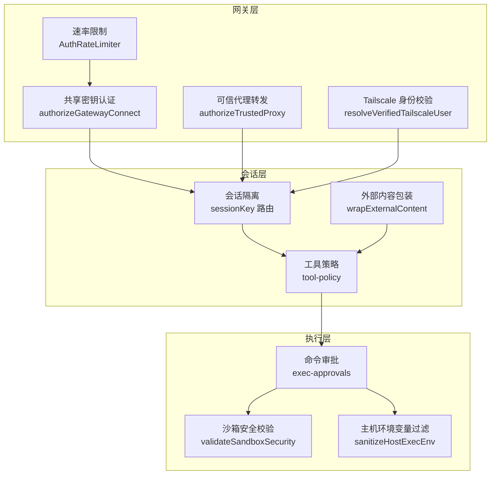
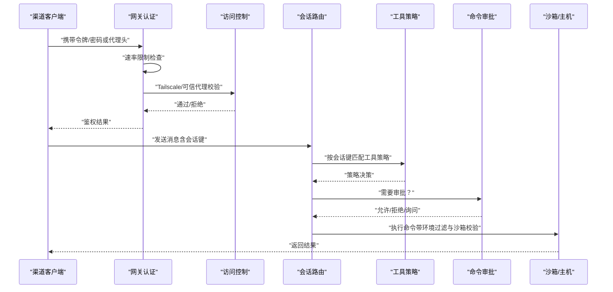
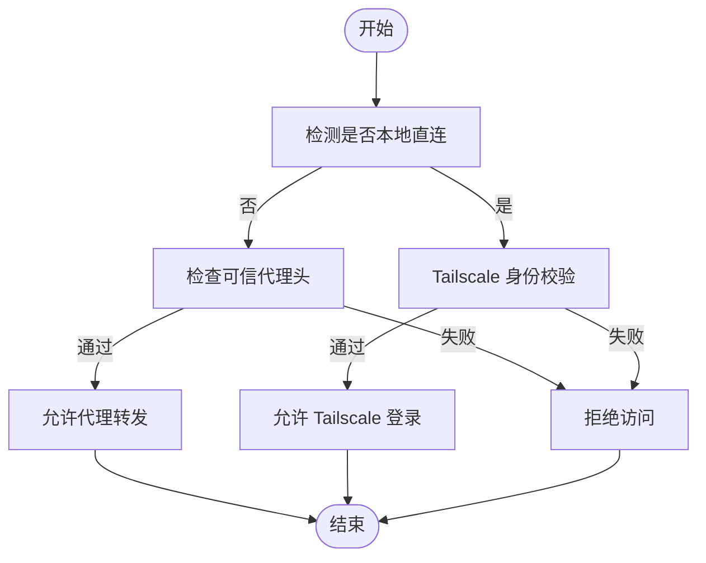
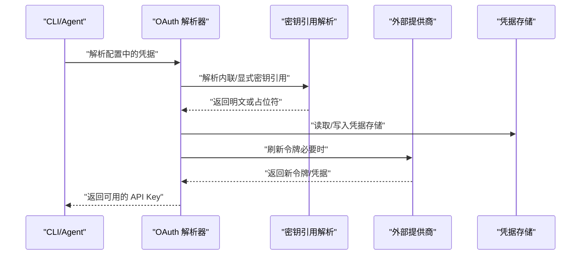
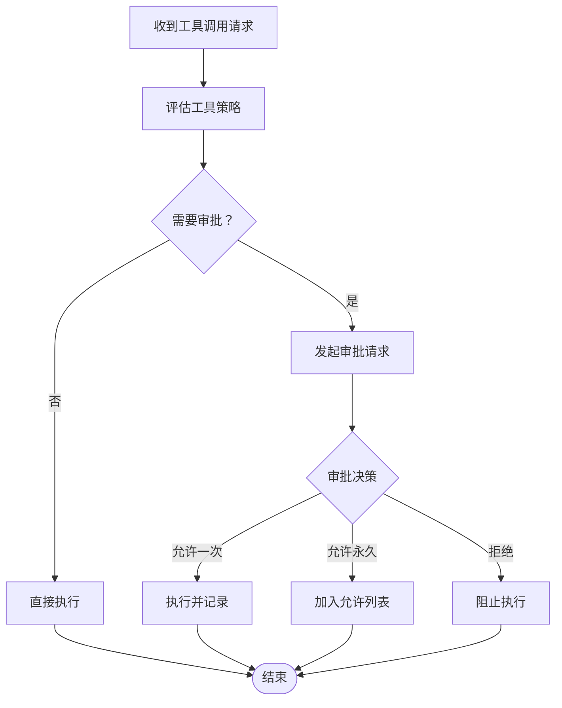
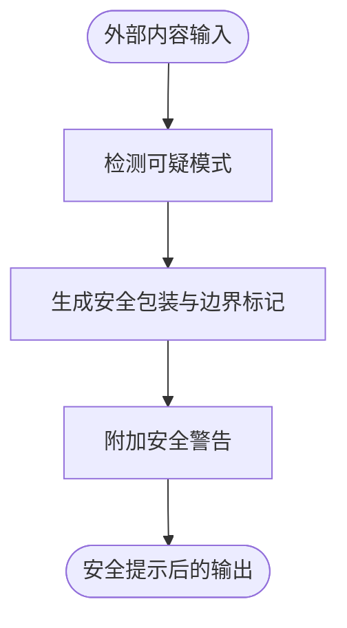
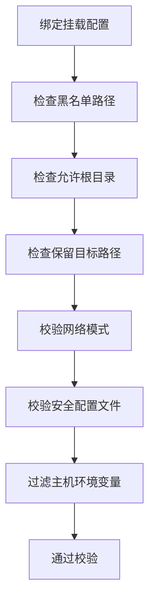
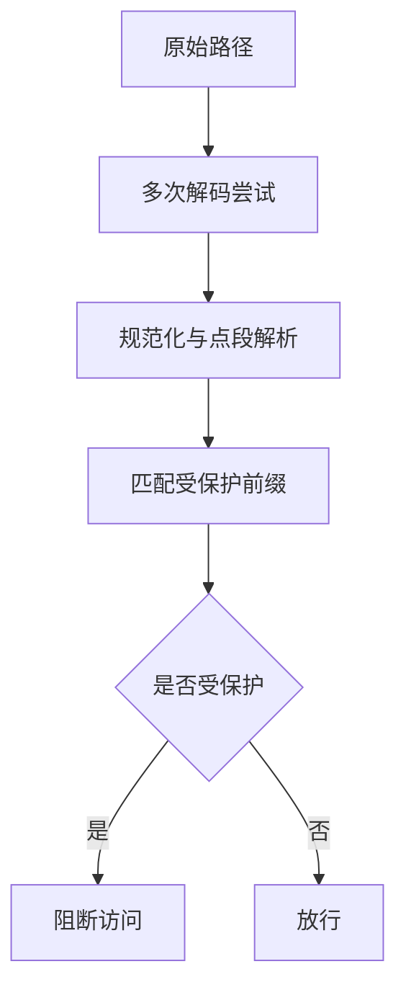
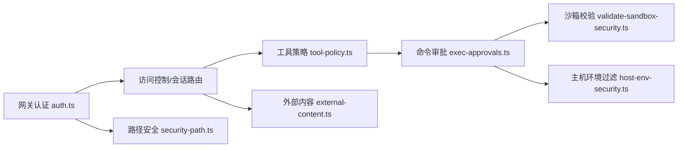

# 渠道认证与安全

<cite>
**本文档引用的文件**
- [SECURITY.md](file://SECURITY.md)
- [THREAT-MODEL-ATLAS.md](file://docs/security/THREAT-MODEL-ATLAS.md)
- [CONTRIBUTING-THREAT-MODEL.md](file://docs/security/CONTRIBUTING-THREAT-MODEL.md)
- [auth.ts](file://src/gateway/auth.ts)
- [exec-approvals.ts](file://src/infra/exec-approvals.ts)
- [external-content.ts](file://src/security/external-content.ts)
- [validate-sandbox-security.ts](file://src/agents/sandbox/validate-sandbox-security.ts)
- [security-path.ts](file://src/gateway/security-path.ts)
- [host-env-security.ts](file://src/infra/host-env-security.ts)
- [doctor-security.ts](file://src/commands/doctor-security.ts)
- [oauth.ts](file://src/agents/auth-profiles/oauth.ts)
- [google/oauth.ts](file://extensions/google/oauth.ts)
- [google/oauth.flow.ts](file://extensions/google/oauth.flow.ts)
- [google/oauth.token.ts](file://extensions/google/oauth.token.ts)
</cite>

## 目录
1. [简介](#简介)
2. [项目结构](#项目结构)
3. [核心组件](#核心组件)
4. [架构总览](#架构总览)
5. [详细组件分析](#详细组件分析)
6. [依赖关系分析](#依赖关系分析)
7. [性能考量](#性能考量)
8. [故障排查指南](#故障排查指南)
9. [结论](#结论)
10. [附录](#附录)

## 简介
本文件系统性阐述 OpenClaw 的渠道认证与安全机制，覆盖设备配对、OAuth 认证、API 密钥管理、允许列表与命令门控、安全策略与信任模型，并对比不同渠道的安全实现差异，给出统一安全模型、配置示例与最佳实践，以及常见威胁与防护建议。

## 项目结构
围绕“网关—会话—执行”三层信任边界，OpenClaw 将认证与安全控制点分布在：
- 网关层：共享密钥（令牌/密码）认证、可信代理转发、Tailscale 身份校验、速率限制
- 会话层：基于会话键的路由隔离、工具策略与输出过滤
- 执行层：沙箱容器安全、主机环境变量白名单、命令审批与路径绑定约束

图示来源
- [auth.ts:369-494](file://src/gateway/auth.ts#L369-L494)
- [exec-approvals.ts:412-482](file://src/infra/exec-approvals.ts#L412-L482)
- [external-content.ts:247-354](file://src/security/external-content.ts#L247-L354)
- [validate-sandbox-security.ts:328-343](file://src/agents/sandbox/validate-sandbox-security.ts#L328-L343)
- [host-env-security.ts:100-135](file://src/infra/host-env-security.ts#L100-L135)

章节来源
- [auth.ts:1-495](file://src/gateway/auth.ts#L1-L495)
- [exec-approvals.ts:1-590](file://src/infra/exec-approvals.ts#L1-L590)
- [external-content.ts:1-355](file://src/security/external-content.ts#L1-L355)
- [validate-sandbox-security.ts:1-344](file://src/agents/sandbox/validate-sandbox-security.ts#L1-L344)
- [host-env-security.ts:1-157](file://src/infra/host-env-security.ts#L1-L157)

## 核心组件
- 网关认证与访问控制
  - 共享密钥模式（令牌/密码）与可信代理模式
  - Tailscale 身份校验与本地直连检测
  - 速率限制与失败计数
- 外部内容处理
  - 安全包装与边界标记、可疑模式检测、来源标签
- 命令审批与工具策略
  - 审批请求、默认策略、允许列表、UI 交互
- 沙箱与主机安全
  - 绑定挂载黑名单、保留目标路径、网络模式限制、安全配置文件校验
  - 主机环境变量白名单与覆盖限制
- OAuth 与 API 密钥管理
  - OAuth 凭据刷新与兼容模式、API Key 解析与密钥引用解析
- 路径安全与通道保护
  - URL 路径规范化与前缀匹配、受保护插件路由前缀

章节来源
- [auth.ts:208-494](file://src/gateway/auth.ts#L208-L494)
- [external-content.ts:1-355](file://src/security/external-content.ts#L1-L355)
- [exec-approvals.ts:1-590](file://src/infra/exec-approvals.ts#L1-L590)
- [validate-sandbox-security.ts:1-344](file://src/agents/sandbox/validate-sandbox-security.ts#L1-L344)
- [host-env-security.ts:1-157](file://src/infra/host-env-security.ts#L1-L157)
- [oauth.ts:1-492](file://src/agents/auth-profiles/oauth.ts#L1-L492)
- [security-path.ts:1-162](file://src/gateway/security-path.ts#L1-L162)

## 架构总览
下图展示从渠道到执行的端到端安全流：

图示来源
- [auth.ts:369-494](file://src/gateway/auth.ts#L369-L494)
- [exec-approvals.ts:484-590](file://src/infra/exec-approvals.ts#L484-L590)
- [validate-sandbox-security.ts:328-343](file://src/agents/sandbox/validate-sandbox-security.ts#L328-L343)
- [host-env-security.ts:100-135](file://src/infra/host-env-security.ts#L100-L135)

## 详细组件分析

### 设备配对流程与信任模型
- 配对窗口与过期
  - 设备配对在短期宽限期内有效，降低拦截风险
- 本地直连与环回检测
  - 仅当满足本地直连条件且无异常转发时才视为可信
- Tailscale 身份校验
  - 通过反向查询与头部用户信息比对，确保来源与身份一致
- 可信代理转发
  - 限定必需头、用户白名单与代理地址范围

图示来源
- [auth.ts:116-137](file://src/gateway/auth.ts#L116-L137)
- [auth.ts:369-494](file://src/gateway/auth.ts#L369-L494)

章节来源
- [auth.ts:116-137](file://src/gateway/auth.ts#L116-L137)
- [auth.ts:369-494](file://src/gateway/auth.ts#L369-L494)

### OAuth 认证与 API 密钥管理
- 支持的模式
  - OAuth 与原始令牌/API Key 在承载层可互换（Bearer）
- 凭据解析与兼容
  - 自动采用主代理更新鲜凭据；支持降级回退（如特定提供商刷新失败时使用缓存访问令牌）
- 刷新流程
  - 并发加锁避免竞态；针对不同提供商（如 Qwen Portal、Chutes）定制刷新逻辑
- 密钥引用解析
  - 支持内联与显式密钥引用，结合缓存与错误日志

图示来源
- [oauth.ts:309-491](file://src/agents/auth-profiles/oauth.ts#L309-L491)
- [google/oauth.ts:15-90](file://extensions/google/oauth.ts#L15-L90)
- [google/oauth.flow.ts:11-31](file://extensions/google/oauth.flow.ts#L11-L31)
- [google/oauth.token.ts:6-57](file://extensions/google/oauth.token.ts#L6-L57)

章节来源
- [oauth.ts:1-492](file://src/agents/auth-profiles/oauth.ts#L1-L492)
- [google/oauth.ts:1-91](file://extensions/google/oauth.ts#L1-L91)
- [google/oauth.flow.ts:1-153](file://extensions/google/oauth.flow.ts#L1-L153)
- [google/oauth.token.ts:1-58](file://extensions/google/oauth.token.ts#L1-L58)

### 允许列表机制与命令门控
- 审批策略
  - 安全级别（deny/allowlist/full）、询问策略（off/on-miss/always）、默认与代理级合并
  - 允许列表条目去重与时间戳记录
- 审批请求与交互
  - 通过 Unix Socket 传递审批请求，等待决策
- 执行绑定与计划
  - 绑定命令参数、工作目录、环境快照，用于 UI 展示与二次确认

图示来源
- [exec-approvals.ts:484-590](file://src/infra/exec-approvals.ts#L484-L590)

章节来源
- [exec-approvals.ts:1-590](file://src/infra/exec-approvals.ts#L1-L590)

### 外部内容安全与提示注入防护
- 包装与警告
  - 使用唯一边界标记与安全提示，标注来源与元数据
- 检测与清洗
  - 检测可疑模式；对边界标记进行同形字符折叠与清洗
- 钩子来源识别
  - 识别钩子会话类型并按需增强警告

图示来源
- [external-content.ts:17-45](file://src/security/external-content.ts#L17-L45)
- [external-content.ts:247-354](file://src/security/external-content.ts#L247-L354)

章节来源
- [external-content.ts:1-355](file://src/security/external-content.ts#L1-L355)

### 沙箱与主机安全
- 绑定挂载校验
  - 黑名单路径、非绝对源路径、越权根目录、保留目标路径
- 网络模式限制
  - 禁止 host 网络与容器命名空间加入
- 安全配置校验
  - 禁止禁用 seccomp/AppArmor 的配置
- 主机环境变量过滤
  - 合并基础环境，剔除危险键值；严格限制 PATH 覆盖

图示来源
- [validate-sandbox-security.ts:96-281](file://src/agents/sandbox/validate-sandbox-security.ts#L96-L281)
- [validate-sandbox-security.ts:283-343](file://src/agents/sandbox/validate-sandbox-security.ts#L283-L343)
- [host-env-security.ts:100-135](file://src/infra/host-env-security.ts#L100-L135)

章节来源
- [validate-sandbox-security.ts:1-344](file://src/agents/sandbox/validate-sandbox-security.ts#L1-L344)
- [host-env-security.ts:1-157](file://src/infra/host-env-security.ts#L1-L157)

### 路径安全与通道保护
- URL 规范化与解码
  - 多次解码上限、点段解析、大小写归一化
- 前缀匹配与受保护路径
  - 对插件路由前缀进行保护，防止路径遍历与越权访问

图示来源
- [security-path.ts:45-90](file://src/gateway/security-path.ts#L45-L90)
- [security-path.ts:137-161](file://src/gateway/security-path.ts#L137-L161)

章节来源
- [security-path.ts:1-162](file://src/gateway/security-path.ts#L1-L162)

### 不同渠道的安全实现差异与统一模型
- 差异点
  - 渠道可能采用不同的身份验证方式（如号码/用户名/邮箱），允许列表策略与钩子来源存在差异
- 统一模型
  - 以“会话键=代理:渠道:对端”作为路由隔离边界，工具策略与输出过滤在会话层统一
  - 外部内容统一包装与安全提示，减少提示注入影响面
  - 命令审批与沙箱策略在执行层统一

章节来源
- [THREAT-MODEL-ATLAS.md:56-123](file://docs/security/THREAT-MODEL-ATLAS.md#L56-L123)
- [external-content.ts:247-354](file://src/security/external-content.ts#L247-L354)
- [exec-approvals.ts:412-482](file://src/infra/exec-approvals.ts#L412-L482)

## 依赖关系分析

图示来源
- [auth.ts:1-495](file://src/gateway/auth.ts#L1-L495)
- [exec-approvals.ts:1-590](file://src/infra/exec-approvals.ts#L1-L590)
- [validate-sandbox-security.ts:1-344](file://src/agents/sandbox/validate-sandbox-security.ts#L1-L344)
- [host-env-security.ts:1-157](file://src/infra/host-env-security.ts#L1-L157)
- [external-content.ts:1-355](file://src/security/external-content.ts#L1-L355)
- [security-path.ts:1-162](file://src/gateway/security-path.ts#L1-L162)

章节来源
- [auth.ts:1-495](file://src/gateway/auth.ts#L1-L495)
- [exec-approvals.ts:1-590](file://src/infra/exec-approvals.ts#L1-L590)
- [validate-sandbox-security.ts:1-344](file://src/agents/sandbox/validate-sandbox-security.ts#L1-L344)
- [host-env-security.ts:1-157](file://src/infra/host-env-security.ts#L1-L157)
- [external-content.ts:1-355](file://src/security/external-content.ts#L1-L355)
- [security-path.ts:1-162](file://src/gateway/security-path.ts#L1-L162)

## 性能考量
- 认证与审批
  - 速率限制与失败计数避免暴力破解；审批请求通过本地 Socket 低延迟交互
- 外部内容处理
  - 包装与清洗为纯文本操作，开销可控；建议对大体量内容分块处理
- 沙箱与主机安全
  - 路径解析与黑名单检查为常量时间操作；建议预构建允许根目录集合以提升性能

## 故障排查指南
- 网关暴露与认证缺失
  - 若网关对外网暴露且未配置共享密钥，将触发严重警告；建议改为环回绑定并启用强认证
- 速率限制触发
  - 连续错误会触发速率限制；检查客户端 IP 与限流范围
- OAuth 刷新失败
  - 提供商接口异常或凭据失效时，系统会尝试降级回退或从主代理继承凭据
- 命令审批
  - 审批 UI 未响应时，检查 Socket 文件权限与令牌一致性
- 沙箱配置不当
  - 绑定挂载黑名单命中或网络模式受限时，根据错误提示修正配置

章节来源
- [doctor-security.ts:51-239](file://src/commands/doctor-security.ts#L51-L239)
- [auth.ts:406-476](file://src/gateway/auth.ts#L406-L476)
- [oauth.ts:459-491](file://src/agents/auth-profiles/oauth.ts#L459-L491)
- [exec-approvals.ts:559-589](file://src/infra/exec-approvals.ts#L559-L589)
- [validate-sandbox-security.ts:182-227](file://src/agents/sandbox/validate-sandbox-security.ts#L182-L227)

## 结论
OpenClaw 通过“网关认证—会话隔离—执行门控”的分层安全设计，结合 OAuth 与 API 密钥管理、命令审批、沙箱与主机环境过滤、外部内容包装与路径安全校验，形成统一而可扩展的安全模型。不同渠道在承载层存在差异，但统一的会话与执行边界确保了整体安全一致性。

## 附录

### 认证配置示例与最佳实践
- 网关绑定与认证
  - 默认绑定环回；远程访问优先使用 Tailscale 或 SSH 隧道
  - 强制设置共享密钥（令牌或密码），避免无认证暴露
- 速率限制
  - 启用速率限制，防止暴力破解
- OAuth 与 API 密钥
  - 使用密钥引用解析，避免明文硬编码
  - 定期轮换与监控刷新状态
- 命令审批
  - 默认 deny + allowlist，谨慎开启 full
  - 为高危命令建立明确的允许列表与审批流程
- 沙箱与主机
  - 严格限制绑定挂载与网络模式
  - 仅允许必要的环境变量覆盖，禁止 PATH 覆盖

章节来源
- [SECURITY.md:212-250](file://SECURITY.md#L212-L250)
- [SECURITY.md:251-293](file://SECURITY.md#L251-L293)
- [auth.ts:208-283](file://src/gateway/auth.ts#L208-L283)
- [exec-approvals.ts:146-154](file://src/infra/exec-approvals.ts#L146-L154)
- [validate-sandbox-security.ts:283-343](file://src/agents/sandbox/validate-sandbox-security.ts#L283-L343)
- [host-env-security.ts:121-135](file://src/infra/host-env-security.ts#L121-L135)

### 威胁建模与缓解
- 主要威胁与缓解
  - 配对代码截获：缩短宽限期、增加确认步骤
  - 允许列表欺骗：多层审批与参数校验
  - 外部内容注入：统一包装与边界标记、内容清洗
  - 供应链攻击：技能发布审核与行为分析
  - 资源耗尽：速率限制与成本预算
- 攻击链与关键路径
  - 技能持久化→规避审核→凭证窃取
  - 提示注入→绕过审批→远程命令执行
  - 间接注入→抓取内容→外发数据

章节来源
- [THREAT-MODEL-ATLAS.md:170-205](file://docs/security/THREAT-MODEL-ATLAS.md#L170-L205)
- [THREAT-MODEL-ATLAS.md:505-527](file://docs/security/THREAT-MODEL-ATLAS.md#L505-L527)