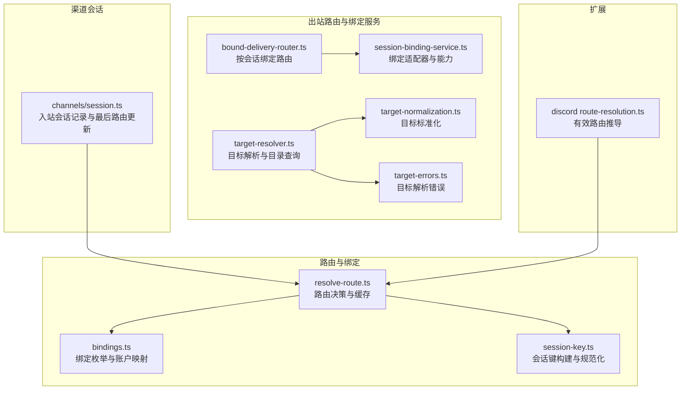
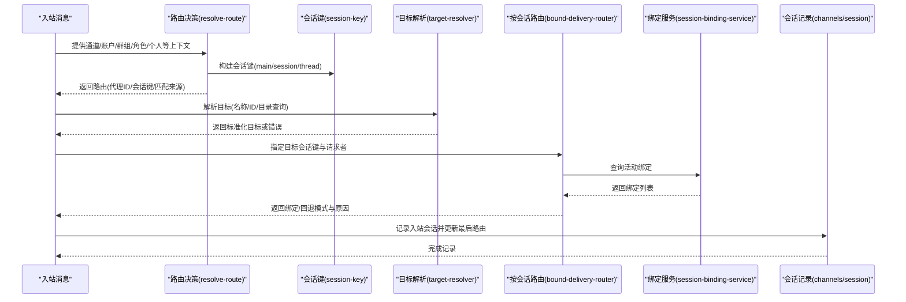
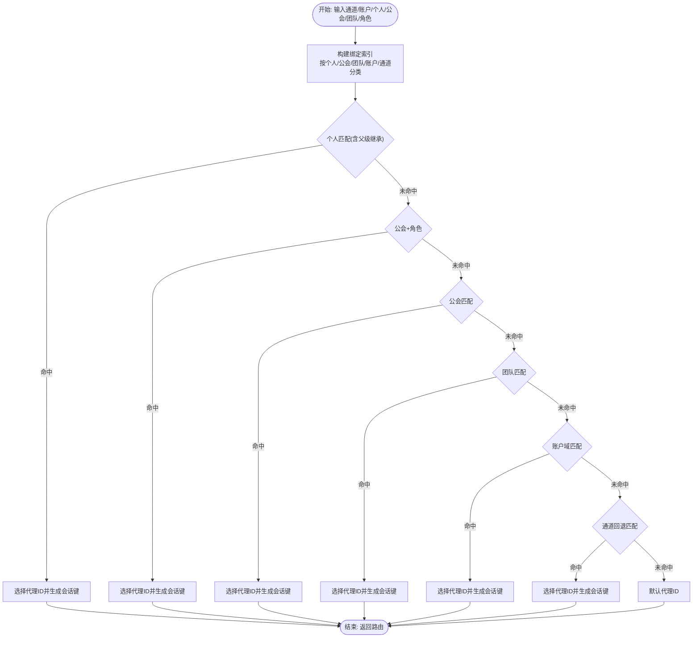
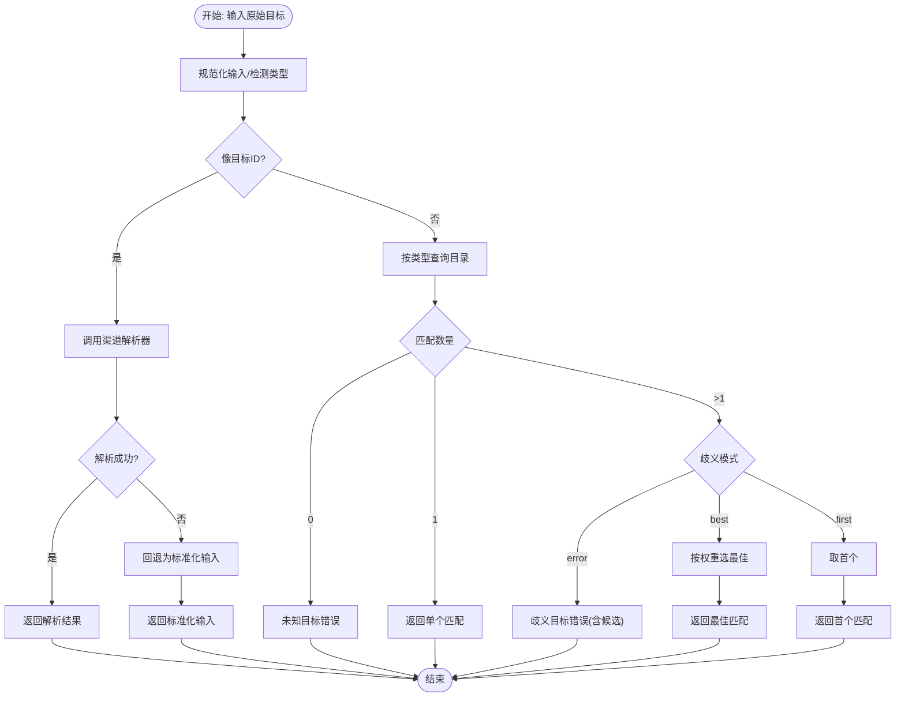
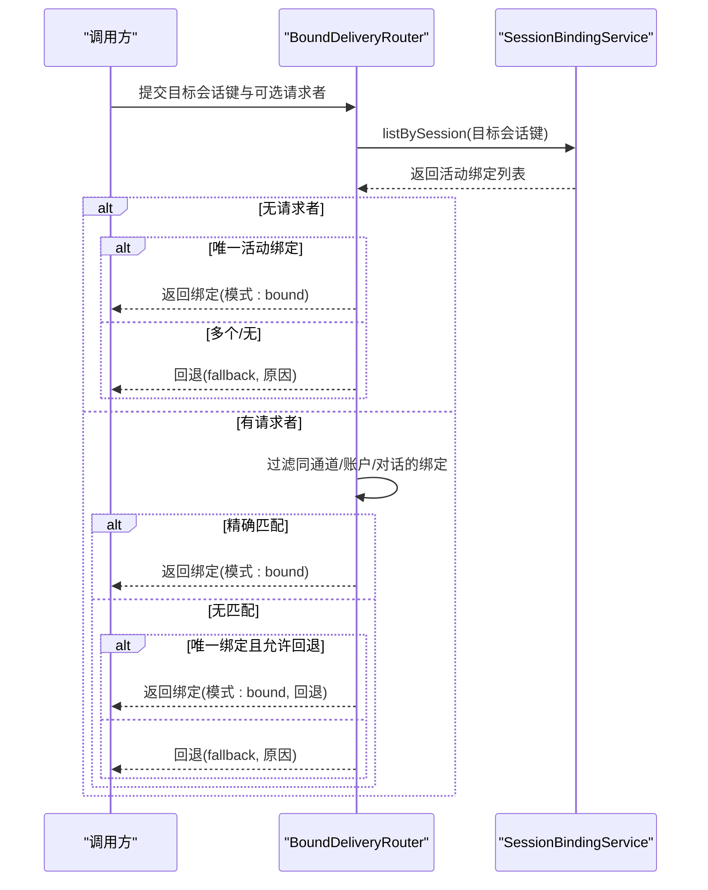
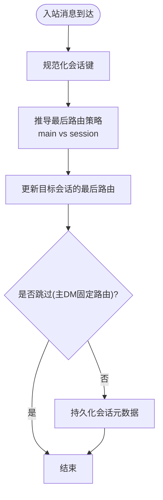
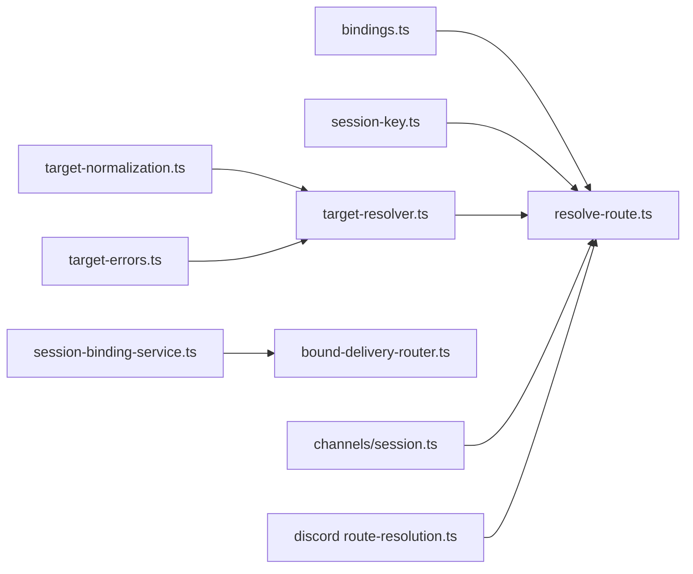

# 渠道路由机制

<cite>
**本文档引用的文件**
- [src/routing/resolve-route.ts](file://src/routing/resolve-route.ts)
- [src/routing/bindings.ts](file://src/routing/bindings.ts)
- [src/routing/session-key.ts](file://src/routing/session-key.ts)
- [src/channels/session.ts](file://src/channels/session.ts)
- [src/infra/outbound/bound-delivery-router.ts](file://src/infra/outbound/bound-delivery-router.ts)
- [src/infra/outbound/target-resolver.ts](file://src/infra/outbound/target-resolver.ts)
- [src/infra/outbound/target-normalization.ts](file://src/infra/outbound/target-normalization.ts)
- [src/infra/outbound/target-errors.ts](file://src/infra/outbound/target-errors.ts)
- [src/infra/outbound/session-binding-service.ts](file://src/infra/outbound/session-binding-service.ts)
- [extensions/discord/src/monitor/route-resolution.ts](file://extensions/discord/src/monitor/route-resolution.ts)
</cite>

## 目录
1. [简介](#简介)
2. [项目结构](#项目结构)
3. [核心组件](#核心组件)
4. [架构总览](#架构总览)
5. [详细组件分析](#详细组件分析)
6. [依赖关系分析](#依赖关系分析)
7. [性能考量](#性能考量)
8. [故障处理与排障指南](#故障处理与排障指南)
9. [结论](#结论)
10. [附录：配置模板与示例路径](#附录配置模板与示例路径)

## 简介
本文件系统性阐述 OpenClaw 中“渠道路由机制”的设计与实现，覆盖消息在不同渠道之间的路由与分发流程，包括会话管理、目标解析、消息转发、路由规则配置、优先级与缓存策略、以及故障处理与错误恢复机制。文档以代码为依据，辅以图示帮助读者快速理解从输入到输出的完整链路。

## 项目结构
围绕“渠道路由”，相关代码主要分布在以下模块：
- 路由与绑定：src/routing（路由决策、绑定索引、会话键生成）
- 出站路由与绑定服务：src/infra/outbound（目标解析、会话绑定、按会话路由）
- 渠道会话记录：src/channels（入站会话元数据与最后路由更新）
- 扩展路由策略：extensions/*/src/monitor（如 Discord 的有效路由推导）

**图表来源**
- [src/routing/resolve-route.ts:1-805](file://src/routing/resolve-route.ts#L1-L805)
- [src/routing/bindings.ts:1-115](file://src/routing/bindings.ts#L1-L115)
- [src/routing/session-key.ts:1-254](file://src/routing/session-key.ts#L1-L254)
- [src/infra/outbound/bound-delivery-router.ts:1-132](file://src/infra/outbound/bound-delivery-router.ts#L1-L132)
- [src/infra/outbound/session-binding-service.ts:1-333](file://src/infra/outbound/session-binding-service.ts#L1-L333)
- [src/infra/outbound/target-resolver.ts:1-551](file://src/infra/outbound/target-resolver.ts#L1-L551)
- [src/infra/outbound/target-normalization.ts:1-62](file://src/infra/outbound/target-normalization.ts#L1-L62)
- [src/infra/outbound/target-errors.ts:1-32](file://src/infra/outbound/target-errors.ts#L1-L32)
- [src/channels/session.ts:1-82](file://src/channels/session.ts#L1-L82)
- [extensions/discord/src/monitor/route-resolution.ts:80-100](file://extensions/discord/src/monitor/route-resolution.ts#L80-L100)

**章节来源**
- [src/routing/resolve-route.ts:1-805](file://src/routing/resolve-route.ts#L1-L805)
- [src/routing/bindings.ts:1-115](file://src/routing/bindings.ts#L1-L115)
- [src/routing/session-key.ts:1-254](file://src/routing/session-key.ts#L1-L254)
- [src/infra/outbound/bound-delivery-router.ts:1-132](file://src/infra/outbound/bound-delivery-router.ts#L1-L132)
- [src/infra/outbound/session-binding-service.ts:1-333](file://src/infra/outbound/session-binding-service.ts#L1-L333)
- [src/infra/outbound/target-resolver.ts:1-551](file://src/infra/outbound/target-resolver.ts#L1-L551)
- [src/infra/outbound/target-normalization.ts:1-62](file://src/infra/outbound/target-normalization.ts#L1-L62)
- [src/infra/outbound/target-errors.ts:1-32](file://src/infra/outbound/target-errors.ts#L1-L32)
- [src/channels/session.ts:1-82](file://src/channels/session.ts#L1-L82)
- [extensions/discord/src/monitor/route-resolution.ts:80-100](file://extensions/discord/src/monitor/route-resolution.ts#L80-L100)

## 核心组件
- 路由决策与缓存：根据通道、账户、群组/频道/个人、角色等维度匹配绑定，生成会话键并决定“最后路由”策略。
- 绑定与索引：对配置中的路由绑定进行预处理、索引与合并，支持账户域与全通道回退。
- 会话键与会话管理：规范化的 agent 会话键、主会话键、线程会话键、身份链接映射。
- 目标解析：将用户输入的目标字符串解析为渠道可识别的 ID，并支持目录查询与歧义处理。
- 按会话绑定路由：基于当前会话绑定状态，选择合适的对话上下文进行出站投递。
- 绑定服务与适配器：统一的绑定生命周期管理、能力探测与跨适配器聚合。
- 入站会话记录：记录入站消息元数据，并按“最后路由”策略更新目标。

**章节来源**
- [src/routing/resolve-route.ts:614-800](file://src/routing/resolve-route.ts#L614-L800)
- [src/routing/bindings.ts:17-115](file://src/routing/bindings.ts#L17-L115)
- [src/routing/session-key.ts:118-254](file://src/routing/session-key.ts#L118-L254)
- [src/infra/outbound/target-resolver.ts:32-551](file://src/infra/outbound/target-resolver.ts#L32-L551)
- [src/infra/outbound/bound-delivery-router.ts:55-132](file://src/infra/outbound/bound-delivery-router.ts#L55-L132)
- [src/infra/outbound/session-binding-service.ts:70-333](file://src/infra/outbound/session-binding-service.ts#L70-L333)
- [src/channels/session.ts:41-82](file://src/channels/session.ts#L41-L82)

## 架构总览
下图展示从“输入参数”到“路由结果”的端到端流程，包括路由决策、目标解析、按会话绑定路由与会话记录更新。

**图表来源**
- [src/routing/resolve-route.ts:614-800](file://src/routing/resolve-route.ts#L614-L800)
- [src/routing/session-key.ts:118-174](file://src/routing/session-key.ts#L118-L174)
- [src/infra/outbound/target-resolver.ts:32-551](file://src/infra/outbound/target-resolver.ts#L32-L551)
- [src/infra/outbound/bound-delivery-router.ts:55-132](file://src/infra/outbound/bound-delivery-router.ts#L55-L132)
- [src/infra/outbound/session-binding-service.ts:205-317](file://src/infra/outbound/session-binding-service.ts#L205-L317)
- [src/channels/session.ts:41-82](file://src/channels/session.ts#L41-L82)

## 详细组件分析

### 路由决策与绑定匹配
- 输入参数：通道、账户、个人/群组/频道、父级个人、公会/团队、成员角色。
- 匹配层级（优先级从高到低）：
  1) 直接个人匹配（含线程父级继承）
  2) 公会+角色匹配
  3) 公会匹配
  4) 团队匹配
  5) 账户域匹配
  6) 通道回退匹配（通配账户）
- 选择逻辑：一旦某层级命中即返回；否则继续下一层级。
- 会话键生成：支持多种 DM 作用域与身份链接映射，保证会话收敛与并发安全。
- 缓存策略：对已评估绑定、索引与路由结果进行弱引用缓存，避免重复扫描与计算。

**图表来源**
- [src/routing/resolve-route.ts:723-781](file://src/routing/resolve-route.ts#L723-L781)
- [src/routing/resolve-route.ts:661-692](file://src/routing/resolve-route.ts#L661-L692)
- [src/routing/session-key.ts:118-174](file://src/routing/session-key.ts#L118-L174)

**章节来源**
- [src/routing/resolve-route.ts:614-800](file://src/routing/resolve-route.ts#L614-L800)
- [src/routing/session-key.ts:118-174](file://src/routing/session-key.ts#L118-L174)

### 目标解析与目录查询
- 输入规范化：去除前后缀、保留大小写敏感（特定渠道例外）、标准化前缀。
- 解析策略：
  - 若输入像目标 ID（含前缀、提及、电话号码等），优先调用渠道插件的解析器。
  - 否则按首选类型（个人/群组）查询目录，进行模糊匹配，支持“最佳/首个”策略。
- 缓存：目录查询结果带 TTL，支持按渠道/账户粒度清理。
- 错误处理：未知目标与歧义目标抛出带提示的错误对象。

**图表来源**
- [src/infra/outbound/target-resolver.ts:379-512](file://src/infra/outbound/target-resolver.ts#L379-L512)
- [src/infra/outbound/target-normalization.ts:32-61](file://src/infra/outbound/target-normalization.ts#L32-L61)
- [src/infra/outbound/target-errors.ts:1-32](file://src/infra/outbound/target-errors.ts#L1-L32)

**章节来源**
- [src/infra/outbound/target-resolver.ts:32-551](file://src/infra/outbound/target-resolver.ts#L32-L551)
- [src/infra/outbound/target-normalization.ts:1-62](file://src/infra/outbound/target-normalization.ts#L1-L62)
- [src/infra/outbound/target-errors.ts:1-32](file://src/infra/outbound/target-errors.ts#L1-L32)

### 按会话绑定路由
- 场景：任务完成等事件需要投递到“绑定的会话”而非默认路由。
- 逻辑：
  - 若仅一个活动绑定，直接使用。
  - 若有请求者，则按通道/账户/对话 ID 精确匹配；若无精确匹配且允许多路回退，可回退到唯一绑定。
  - 多个绑定时，若无请求者或无法精确定位，回退为“fallback”模式并返回原因。
- 与绑定服务交互：通过统一服务列出指定会话的所有活动绑定，再按请求者过滤。

**图表来源**
- [src/infra/outbound/bound-delivery-router.ts:55-132](file://src/infra/outbound/bound-delivery-router.ts#L55-L132)
- [src/infra/outbound/session-binding-service.ts:205-317](file://src/infra/outbound/session-binding-service.ts#L205-L317)

**章节来源**
- [src/infra/outbound/bound-delivery-router.ts:1-132](file://src/infra/outbound/bound-delivery-router.ts#L1-L132)
- [src/infra/outbound/session-binding-service.ts:70-333](file://src/infra/outbound/session-binding-service.ts#L70-L333)

### 会话管理与最后路由更新
- 会话键：支持 agent:agentId:main 或 agent:agentId:direct:peerId 等多种形态，DM 作用域可配置。
- 最后路由策略：当 sessionKey 与 mainSessionKey 相等时，入站消息应更新 main 会话的 lastRoute；否则更新当前 session。
- 入站记录：记录消息元数据，并按策略更新 lastRoute，支持跳过主 DM 的特定场景。

**图表来源**
- [src/channels/session.ts:41-82](file://src/channels/session.ts#L41-L82)
- [src/routing/resolve-route.ts:63-75](file://src/routing/resolve-route.ts#L63-L75)

**章节来源**
- [src/channels/session.ts:1-82](file://src/channels/session.ts#L1-L82)
- [src/routing/resolve-route.ts:614-692](file://src/routing/resolve-route.ts#L614-L692)

### 扩展路由策略（以 Discord 为例）
- 在存在绑定会话键时，优先使用绑定会话键作为最终路由，同时推导代理 ID 与最后路由策略，确保一致性。

**章节来源**
- [extensions/discord/src/monitor/route-resolution.ts:80-100](file://extensions/discord/src/monitor/route-resolution.ts#L80-L100)

## 依赖关系分析
- 路由决策依赖绑定与会话键工具，形成“配置→索引→匹配→会话键→路由”的闭环。
- 目标解析依赖渠道插件与目录服务，失败时返回明确错误信息。
- 按会话路由依赖绑定服务的适配器注册与能力探测。
- 入站会话记录依赖路由决策的最后路由策略。

**图表来源**
- [src/routing/bindings.ts:17-115](file://src/routing/bindings.ts#L17-L115)
- [src/routing/resolve-route.ts:614-800](file://src/routing/resolve-route.ts#L614-L800)
- [src/routing/session-key.ts:118-174](file://src/routing/session-key.ts#L118-L174)
- [src/infra/outbound/target-resolver.ts:32-551](file://src/infra/outbound/target-resolver.ts#L32-L551)
- [src/infra/outbound/target-normalization.ts:1-62](file://src/infra/outbound/target-normalization.ts#L1-L62)
- [src/infra/outbound/target-errors.ts:1-32](file://src/infra/outbound/target-errors.ts#L1-L32)
- [src/infra/outbound/session-binding-service.ts:205-317](file://src/infra/outbound/session-binding-service.ts#L205-L317)
- [src/infra/outbound/bound-delivery-router.ts:55-132](file://src/infra/outbound/bound-delivery-router.ts#L55-L132)
- [src/channels/session.ts:41-82](file://src/channels/session.ts#L41-L82)
- [extensions/discord/src/monitor/route-resolution.ts:80-100](file://extensions/discord/src/monitor/route-resolution.ts#L80-L100)

**章节来源**
- [src/routing/resolve-route.ts:1-805](file://src/routing/resolve-route.ts#L1-L805)
- [src/infra/outbound/target-resolver.ts:1-551](file://src/infra/outbound/target-resolver.ts#L1-L551)
- [src/infra/outbound/bound-delivery-router.ts:1-132](file://src/infra/outbound/bound-delivery-router.ts#L1-L132)
- [src/infra/outbound/session-binding-service.ts:1-333](file://src/infra/outbound/session-binding-service.ts#L1-L333)
- [src/channels/session.ts:1-82](file://src/channels/session.ts#L1-L82)

## 性能考量
- 已评估绑定与索引缓存：按通道+账户维度缓存，超过阈值时清空并重建，避免内存膨胀。
- 路由结果缓存：按多维键缓存，包含 peer、parentPeer、guild/team、角色集合与 DM 作用域，命中后直接返回。
- 目录查询缓存：带 TTL，miss 时可回退到实时查询并同步缓存。
- 绑定服务聚合：遍历所有适配器去重，减少重复操作。

优化建议
- 对高频绑定场景，合理设置 DM 作用域，减少会话键分支。
- 针对目录查询，尽量提供更精确的输入以降低模糊匹配成本。
- 在大规模绑定场景中，关注缓存阈值与重建频率，必要时调整缓存策略。

**章节来源**
- [src/routing/resolve-route.ts:202-212](file://src/routing/resolve-route.ts#L202-L212)
- [src/routing/resolve-route.ts:508-526](file://src/routing/resolve-route.ts#L508-L526)
- [src/infra/outbound/target-resolver.ts:81-100](file://src/infra/outbound/target-resolver.ts#L81-L100)
- [src/infra/outbound/session-binding-service.ts:274-315](file://src/infra/outbound/session-binding-service.ts#L274-L315)

## 故障处理与排障指南
常见问题与处理
- 目标解析失败
  - 未知目标：检查输入格式、是否缺少前缀或渠道不支持该 ID 类型。
  - 歧义目标：提供更精确名称或显式 ID；或调整歧义处理模式。
  - 缺少目标：某些渠道要求显式目标，需在配置或调用处提供。
- 路由匹配失败
  - 无活动绑定：确认会话绑定是否建立、是否过期。
  - 请求者不匹配：核对请求者的通道/账户/对话 ID 是否一致。
  - 多个绑定但无请求者：在无请求者场景下回退为 fallback，需明确策略。
- 会话记录异常
  - 主 DM 固定路由跳过：检查 pinned 配置是否符合预期。
  - 最后路由未更新：确认 lastRoute 策略与会话键是否正确。

定位步骤
- 开启调试日志，观察路由决策过程与匹配来源。
- 使用目标解析的“显示格式化”功能辅助核对解析结果。
- 检查绑定服务的能力与适配器注册情况。

**章节来源**
- [src/infra/outbound/target-errors.ts:1-32](file://src/infra/outbound/target-errors.ts#L1-L32)
- [src/infra/outbound/bound-delivery-router.ts:59-129](file://src/infra/outbound/bound-delivery-router.ts#L59-L129)
- [src/channels/session.ts:26-39](file://src/channels/session.ts#L26-L39)

## 结论
OpenClaw 的渠道路由机制通过“配置驱动的绑定匹配 + 规范化的会话键 + 目标解析 + 绑定服务聚合”的组合，实现了高可扩展、可缓存、可诊断的路由体系。其优先级清晰、容错明确，并提供了丰富的扩展点（如渠道插件、绑定适配器、最后路由策略）。在生产环境中，建议结合缓存阈值、DM 作用域与目录查询策略进行调优，以获得更佳的吞吐与稳定性。

## 附录：配置模板与示例路径
- 路由绑定配置（示例路径）
  - [src/commands/agents.bindings.ts:75-227](file://src/commands/agents.bindings.ts#L75-L227)：绑定增删改查与冲突处理
- 会话键与 DM 作用域
  - [src/routing/session-key.ts:118-174](file://src/routing/session-key.ts#L118-L174)：会话键构建与 DM 作用域
- 目标解析与歧义处理
  - [src/infra/outbound/target-resolver.ts:379-512](file://src/infra/outbound/target-resolver.ts#L379-L512)：目标解析与歧义策略
- 按会话绑定路由
  - [src/infra/outbound/bound-delivery-router.ts:55-132](file://src/infra/outbound/bound-delivery-router.ts#L55-L132)：绑定路由决策
- 绑定服务与适配器
  - [src/infra/outbound/session-binding-service.ts:205-317](file://src/infra/outbound/session-binding-service.ts#L205-L317)：绑定生命周期与能力
- 入站会话记录与最后路由
  - [src/channels/session.ts:41-82](file://src/channels/session.ts#L41-L82)：入站记录与最后路由更新
- 扩展路由策略（Discord）
  - [extensions/discord/src/monitor/route-resolution.ts:80-100](file://extensions/discord/src/monitor/route-resolution.ts#L80-L100)：有效路由推导