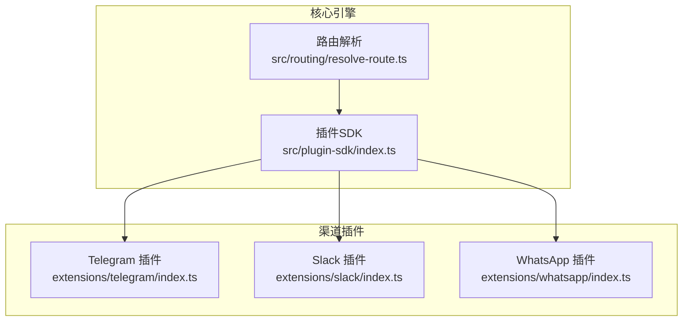
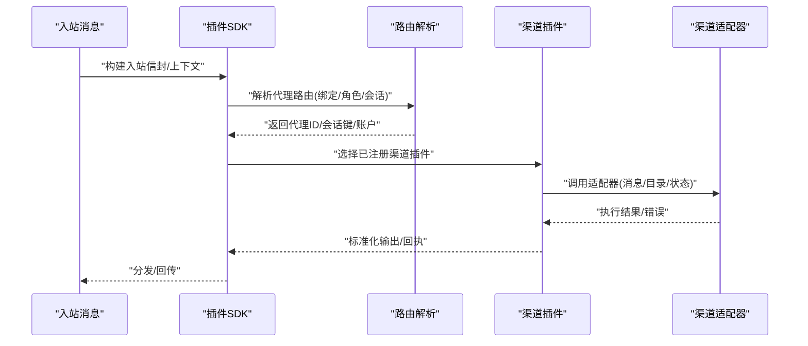
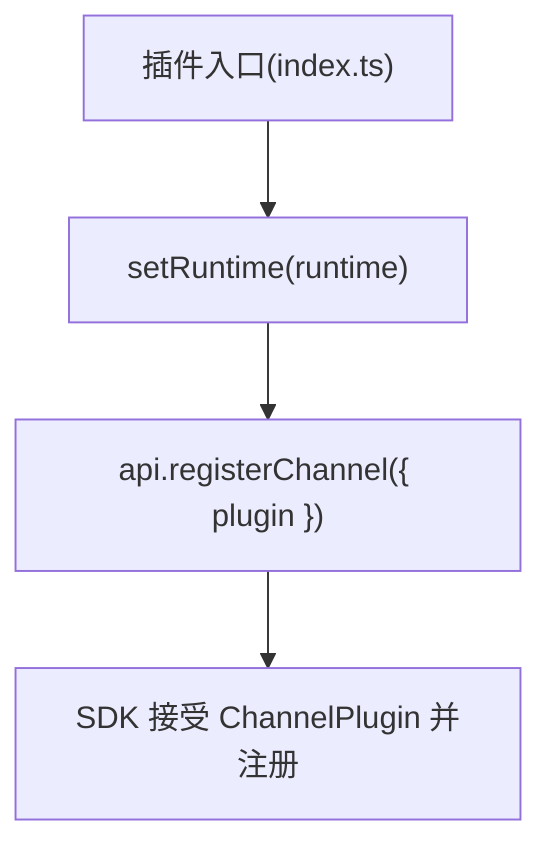
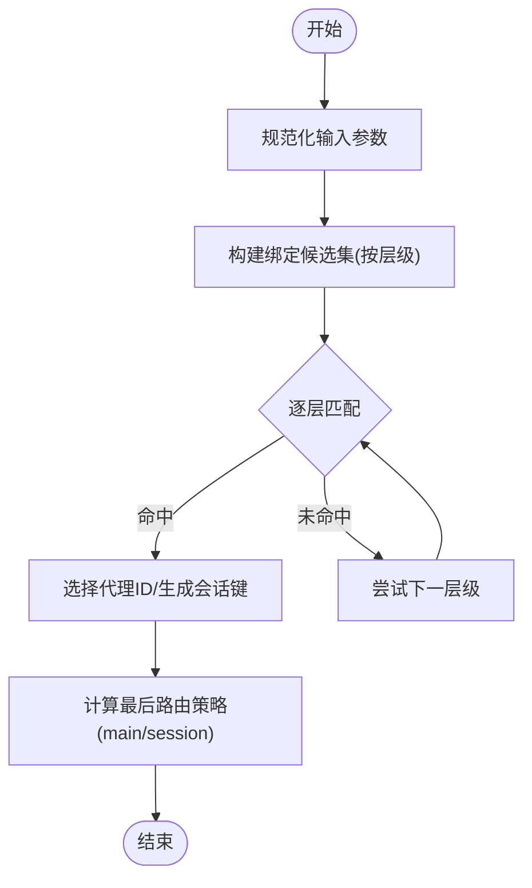
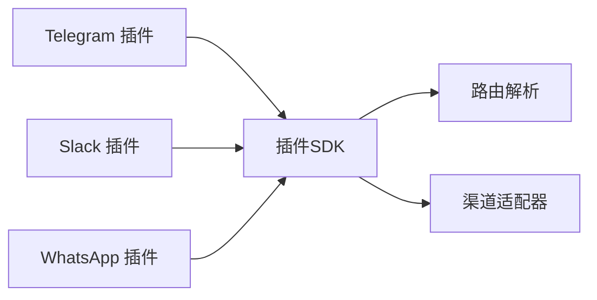

# 渠道集成

<cite>
**本文引用的文件**
- [extensions/telegram/index.ts](file://extensions/telegram/index.ts)
- [extensions/slack/index.ts](file://extensions/slack/index.ts)
- [extensions/whatsapp/index.ts](file://extensions/whatsapp/index.ts)
- [src/plugin-sdk/index.ts](file://src/plugin-sdk/index.ts)
- [src/channels/plugins/types.ts](file://src/channels/plugins/types.ts)
- [src/routing/resolve-route.ts](file://src/routing/resolve-route.ts)
- [extensions/shared/runtime.ts](file://extensions/shared/runtime.ts)
</cite>

## 目录
1. [简介](#简介)
2. [项目结构](#项目结构)
3. [核心组件](#核心组件)
4. [架构总览](#架构总览)
5. [详细组件分析](#详细组件分析)
6. [依赖分析](#依赖分析)
7. [性能考虑](#性能考虑)
8. [故障排除指南](#故障排除指南)
9. [结论](#结论)
10. [附录](#附录)

## 简介
本文件面向 OpenClaw 的渠道集成系统，聚焦于即时通讯平台的插件化接入与统一运行时管理。本文档覆盖以下要点：
- 支持的即时通讯平台：Telegram、Slack、WhatsApp 等渠道插件的注册与运行时注入方式
- 渠道路由机制：基于绑定规则的代理路由解析、会话键生成与继承策略
- 消息分发策略：入站消息到代理的路由选择、线程/父级继承、角色约束匹配
- 连接管理：渠道适配器接口、心跳与状态、安全与鉴权门禁
- 群组消息处理、提及过滤与回复标签系统：提及门禁、工具策略、回复前缀与媒体分片
- 渠道特定配置项、认证流程与故障排除
- 新渠道插件开发指南与最佳实践

## 项目结构
OpenClaw 采用“核心引擎 + 插件生态”的架构。渠道插件位于 extensions/<channel>/ 目录下，每个插件通过统一的插件 SDK 注册自身，并注入运行时以完成消息收发、状态上报、配置解析等能力。

图表来源
- [src/plugin-sdk/index.ts](file://src/plugin-sdk/index.ts)
- [src/routing/resolve-route.ts](file://src/routing/resolve-route.ts)
- [extensions/telegram/index.ts](file://extensions/telegram/index.ts)
- [extensions/slack/index.ts](file://extensions/slack/index.ts)
- [extensions/whatsapp/index.ts](file://extensions/whatsapp/index.ts)

章节来源
- [src/plugin-sdk/index.ts](file://src/plugin-sdk/index.ts)
- [src/routing/resolve-route.ts](file://src/routing/resolve-route.ts)
- [extensions/telegram/index.ts](file://extensions/telegram/index.ts)
- [extensions/slack/index.ts](file://extensions/slack/index.ts)
- [extensions/whatsapp/index.ts](file://extensions/whatsapp/index.ts)

## 核心组件
- 插件 SDK：定义渠道适配器接口、运行时契约、配置模式、Webhook 目标解析、提及门禁、回复前缀、会话键与路由等通用能力
- 渠道插件：各平台插件在注册阶段注入运行时并注册 ChannelPlugin，实现平台特定的消息收发、目录解析、状态上报等
- 路由系统：根据绑定规则、账户、频道、群组/团队、成员角色等维度解析代理路由，生成会话键并决定最后路由更新策略

章节来源
- [src/plugin-sdk/index.ts](file://src/plugin-sdk/index.ts)
- [src/channels/plugins/types.ts](file://src/channels/plugins/types.ts)
- [src/routing/resolve-route.ts](file://src/routing/resolve-route.ts)

## 架构总览
下图展示从入站消息到代理路由、再到渠道适配器的调用链路与职责边界。

图表来源
- [src/plugin-sdk/index.ts](file://src/plugin-sdk/index.ts)
- [src/routing/resolve-route.ts](file://src/routing/resolve-route.ts)
- [src/channels/plugins/types.ts](file://src/channels/plugins/types.ts)

## 详细组件分析

### 渠道插件注册与运行时注入
- Telegram 插件：在注册时设置运行时并注册 ChannelPlugin
- Slack 插件：同上，注入运行时并注册插件
- WhatsApp 插件：同上，注入运行时并注册插件
- 共享运行时：若外部未提供运行时，使用带日志的运行时包装作为后备

图表来源
- [extensions/telegram/index.ts](file://extensions/telegram/index.ts)
- [extensions/slack/index.ts](file://extensions/slack/index.ts)
- [extensions/whatsapp/index.ts](file://extensions/whatsapp/index.ts)
- [extensions/shared/runtime.ts](file://extensions/shared/runtime.ts)

章节来源
- [extensions/telegram/index.ts](file://extensions/telegram/index.ts)
- [extensions/slack/index.ts](file://extensions/slack/index.ts)
- [extensions/whatsapp/index.ts](file://extensions/whatsapp/index.ts)
- [extensions/shared/runtime.ts](file://extensions/shared/runtime.ts)

### 渠道适配器接口与能力
- 适配器类型：认证、命令、配置、目录、解析、提升权限、网关、群组、心跳、登出、消息动作、消息发送、安全、设置、状态、流式传输、线程、工具发送、轮询等
- 插件契约：ChannelPlugin 定义插件对外暴露的能力集合，供 SDK 统一调度

```mermaid
classDiagram
class ChannelPlugin {
+register(api)
}
class ChannelAuthAdapter
class ChannelCommandAdapter
class ChannelConfigAdapter
class ChannelDirectoryAdapter
class ChannelResolverAdapter
class ChannelElevatedAdapter
class ChannelGatewayAdapter
class ChannelGroupAdapter
class ChannelHeartbeatAdapter
class ChannelLogoutAdapter
class ChannelMessageActionAdapter
class ChannelMessagingAdapter
class ChannelOutboundAdapter
class ChannelPairingAdapter
class ChannelSecurityAdapter
class ChannelSetupAdapter
class ChannelStatusAdapter
class ChannelStreamingAdapter
class ChannelThreadingAdapter
class ChannelToolSend
class ChannelPollAdapter
ChannelPlugin --> ChannelAuthAdapter
ChannelPlugin --> ChannelCommandAdapter
ChannelPlugin --> ChannelConfigAdapter
ChannelPlugin --> ChannelDirectoryAdapter
ChannelPlugin --> ChannelResolverAdapter
ChannelPlugin --> ChannelElevatedAdapter
ChannelPlugin --> ChannelGatewayAdapter
ChannelPlugin --> ChannelGroupAdapter
ChannelPlugin --> ChannelHeartbeatAdapter
ChannelPlugin --> ChannelLogoutAdapter
ChannelPlugin --> ChannelMessageActionAdapter
ChannelPlugin --> ChannelMessagingAdapter
ChannelPlugin --> ChannelOutboundAdapter
ChannelPlugin --> ChannelPairingAdapter
ChannelPlugin --> ChannelSecurityAdapter
ChannelPlugin --> ChannelSetupAdapter
ChannelPlugin --> ChannelStatusAdapter
ChannelPlugin --> ChannelStreamingAdapter
ChannelPlugin --> ChannelThreadingAdapter
ChannelPlugin --> ChannelToolSend
ChannelPlugin --> ChannelPollAdapter
```

图表来源
- [src/channels/plugins/types.ts](file://src/channels/plugins/types.ts)
- [src/plugin-sdk/index.ts](file://src/plugin-sdk/index.ts)

章节来源
- [src/channels/plugins/types.ts](file://src/channels/plugins/types.ts)
- [src/plugin-sdk/index.ts](file://src/plugin-sdk/index.ts)

### 路由机制与会话键
- 输入参数：渠道、账户、对端（含线程父级）、群组/团队、成员角色
- 匹配层级：对端匹配 → 父对端匹配 → 群组+角色 → 群组 → 团队 → 账户 → 频道
- 会话键：按代理、主键、渠道、账户、对端类型/ID、DM 作用域、身份映射生成
- 最后路由策略：当会话键等于主会话键时，最后路由更新走主会话键；否则走当前会话键

图表来源
- [src/routing/resolve-route.ts](file://src/routing/resolve-route.ts)

章节来源
- [src/routing/resolve-route.ts](file://src/routing/resolve-route.ts)

### 消息分发策略与线程/父级继承
- 线程场景：若当前对端不匹配，回退到父对端进行绑定匹配，确保线程归属正确
- 会话键生成：支持多种 DM 作用域策略，用于控制直接对话的会话聚合粒度
- 身份链接：可将不同身份关联到同一会话键，实现跨身份一致性

章节来源
- [src/routing/resolve-route.ts](file://src/routing/resolve-route.ts)

### 提及过滤与回复标签系统
- 提及门禁：针对不同渠道解析提及过滤策略，支持绕过逻辑
- 工具策略：按群组/发送者解析工具使用策略，避免越权
- 回复前缀：为不同渠道构造回复前缀上下文，保证格式一致
- 媒体分片：长文本与媒体分片发送，确保平台兼容性

章节来源
- [src/plugin-sdk/index.ts](file://src/plugin-sdk/index.ts)

### 渠道特定配置与认证
- 配置模式：各渠道提供配置 Schema，统一由 SDK 的空配置模式辅助或自定义 Schema
- 认证流程：通过 SDK 的 Provider/通道适配器与 OAuth 工具协作，完成令牌解析与鉴权
- 安全策略：DM 策略、允许列表解析、SSRF 策略、Webhook 内存守卫等

章节来源
- [src/plugin-sdk/index.ts](file://src/plugin-sdk/index.ts)

## 依赖分析
- 插件到 SDK：插件通过 SDK 注册 ChannelPlugin，使用运行时、配置模式、Webhook 解析、提及门禁、回复前缀等能力
- SDK 到路由：SDK 在处理入站消息时调用路由解析，得到代理与会话键
- 插件到适配器：插件内部调用具体适配器实现消息收发、状态上报、目录解析等

图表来源
- [src/plugin-sdk/index.ts](file://src/plugin-sdk/index.ts)
- [src/routing/resolve-route.ts](file://src/routing/resolve-route.ts)
- [extensions/telegram/index.ts](file://extensions/telegram/index.ts)
- [extensions/slack/index.ts](file://extensions/slack/index.ts)
- [extensions/whatsapp/index.ts](file://extensions/whatsapp/index.ts)

章节来源
- [src/plugin-sdk/index.ts](file://src/plugin-sdk/index.ts)
- [src/routing/resolve-route.ts](file://src/routing/resolve-route.ts)
- [extensions/telegram/index.ts](file://extensions/telegram/index.ts)
- [extensions/slack/index.ts](file://extensions/slack/index.ts)
- [extensions/whatsapp/index.ts](file://extensions/whatsapp/index.ts)

## 性能考虑
- 路由缓存：对评估后的绑定、索引与路由结果进行弱引用缓存，限制最大键数，避免内存膨胀
- 文本分片：长文本与媒体分片发送，降低单次发送失败概率
- Webhook 限流与异常追踪：固定窗口限流、计数器与异常状态码监控，保障高并发稳定性
- SSRF 与请求体限制：HTTPS 主机白名单、请求体大小限制，防止资源滥用

章节来源
- [src/routing/resolve-route.ts](file://src/routing/resolve-route.ts)
- [src/plugin-sdk/index.ts](file://src/plugin-sdk/index.ts)

## 故障排除指南
- 运行时缺失：若未提供运行时，系统会自动创建带日志的运行时包装，确保插件仍可工作
- 路由不生效：检查绑定规则是否正确、对端/父对端是否匹配、群组/团队与角色约束是否满足
- 提及/工具策略异常：确认渠道提及门禁与工具策略配置是否启用，以及允许列表解析是否正确
- Webhook 异常：检查请求体大小、内容类型、速率限制与异常追踪计数，定位瓶颈或攻击行为
- SSL/网络问题：核对 HTTPS 白名单与私有地址限制，避免 SSRF 风险

章节来源
- [extensions/shared/runtime.ts](file://extensions/shared/runtime.ts)
- [src/plugin-sdk/index.ts](file://src/plugin-sdk/index.ts)
- [src/routing/resolve-route.ts](file://src/routing/resolve-route.ts)

## 结论
OpenClaw 的渠道集成以插件 SDK 为核心，统一了多平台适配器接口与运行时管理，结合强大的路由解析与会话键体系，实现了灵活、可扩展且高性能的跨渠道消息分发。通过提及门禁、工具策略与回复前缀等机制，系统在功能与安全之间取得平衡。对于新渠道接入，遵循 SDK 的注册与适配器契约，即可快速完成集成与上线。

## 附录

### 新渠道插件开发指南与最佳实践
- 插件骨架
  - 使用 SDK 的空配置模式或自定义 Schema 定义配置
  - 在注册函数中注入运行时并注册 ChannelPlugin
- 适配器实现
  - 至少实现消息发送、解析、状态与安全适配器
  - 若涉及交互式操作，补充消息动作与线程适配器
- 路由与会话
  - 明确对端类型与 ID 规范化策略
  - 合理设计 DM 作用域与身份链接，确保会话一致性
- 安全与合规
  - 启用提及门禁与工具策略
  - 遵循 HTTPS 白名单与请求体限制
  - 使用 Webhook 内存守卫与异常追踪
- 测试与验证
  - 编写单元测试与集成测试，覆盖路由、适配器与配置
  - 使用 SDK 的日志与诊断事件进行问题定位

章节来源
- [src/plugin-sdk/index.ts](file://src/plugin-sdk/index.ts)
- [src/channels/plugins/types.ts](file://src/channels/plugins/types.ts)
- [src/routing/resolve-route.ts](file://src/routing/resolve-route.ts)