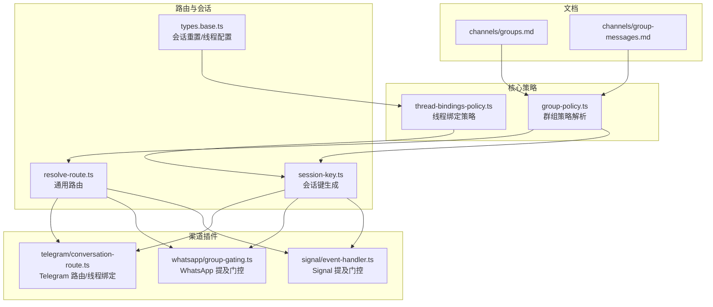
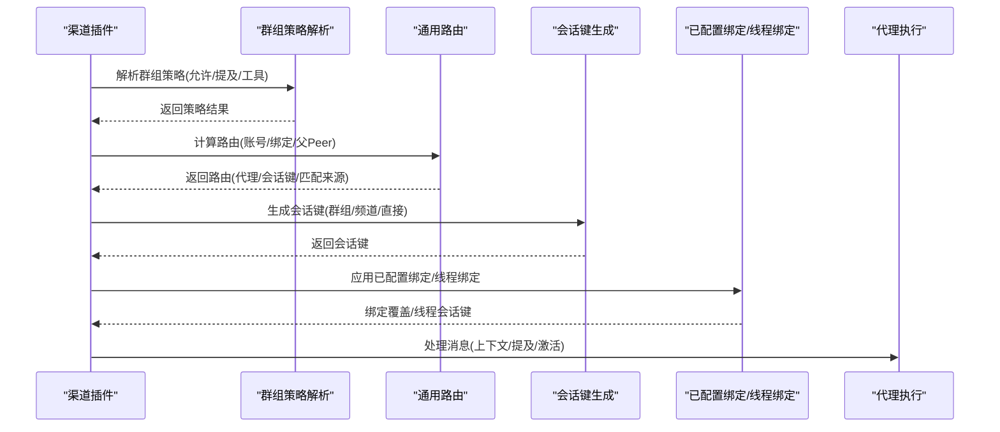
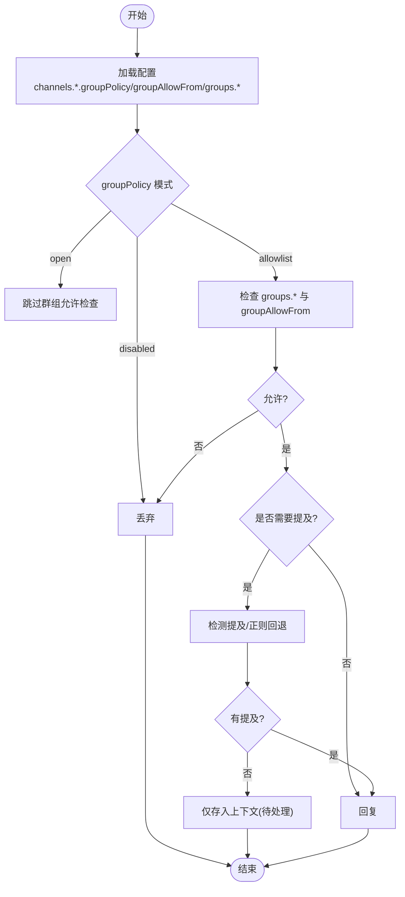
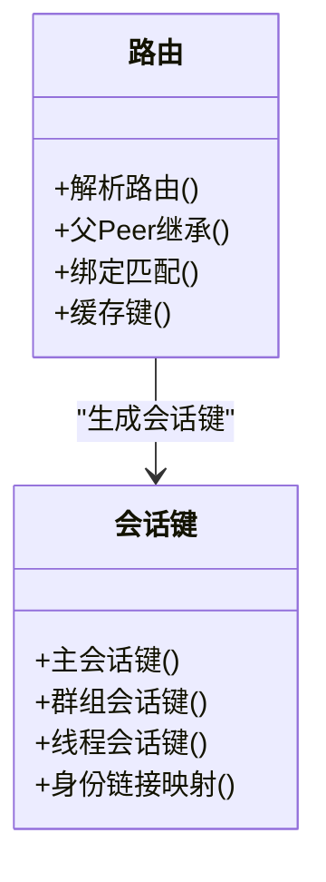
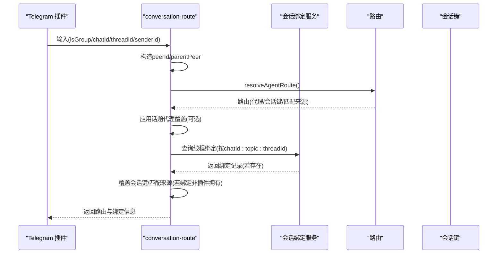
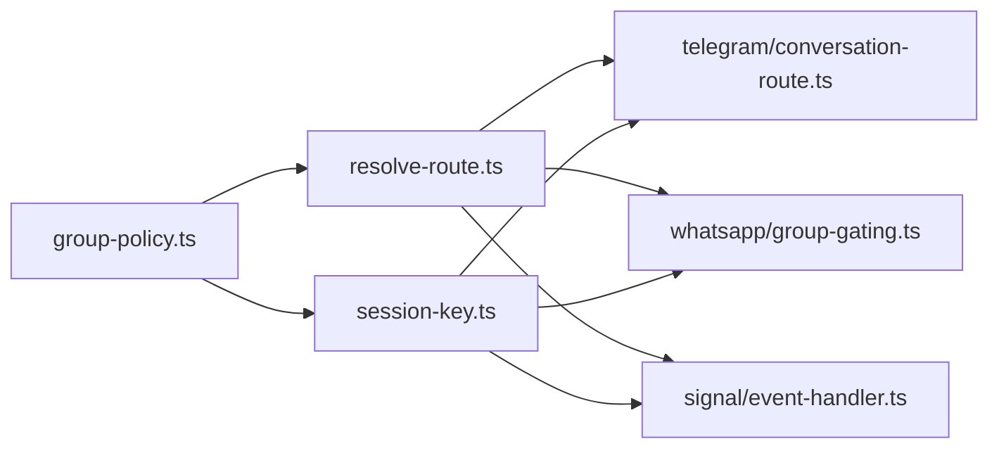

# 群组管理

<cite>
**本文引用的文件**
- [docs/channels/groups.md](file://docs/channels/groups.md)
- [docs/channels/group-messages.md](file://docs/channels/group-messages.md)
- [src/config/group-policy.ts](file://src/config/group-policy.ts)
- [src/routing/resolve-route.ts](file://src/routing/resolve-route.ts)
- [src/routing/session-key.ts](file://src/routing/session-key.ts)
- [extensions/telegram/src/conversation-route.ts](file://extensions/telegram/src/conversation-route.ts)
- [extensions/telegram/src/bot-message-context.ts](file://extensions/telegram/src/bot-message-context.ts)
- [extensions/whatsapp/src/auto-reply/monitor/group-gating.ts](file://extensions/whatsapp/src/auto-reply/monitor/group-gating.ts)
- [extensions/whatsapp/src/auto-reply/monitor/on-message.ts](file://extensions/whatsapp/src/auto-reply/monitor/on-message.ts)
- [extensions/signal/src/monitor/event-handler.ts](file://extensions/signal/src/monitor/event-handler.ts)
- [src/channels/thread-bindings-policy.ts](file://src/channels/thread-bindings-policy.ts)
- [src/config/types.base.ts](file://src/config/types.base.ts)
</cite>

## 目录
1. [简介](#简介)
2. [项目结构](#项目结构)
3. [核心组件](#核心组件)
4. [架构总览](#架构总览)
5. [详细组件分析](#详细组件分析)
6. [依赖关系分析](#依赖关系分析)
7. [性能考量](#性能考量)
8. [故障排查指南](#故障排查指南)
9. [结论](#结论)
10. [附录](#附录)

## 简介
本文件系统性阐述群组管理在 OpenClaw 中的实现与使用，覆盖以下主题：
- 群组消息处理流程与统一策略
- 线程绑定与话题（Telegram Forum）会话隔离
- 聊天类型管理（群组/频道/直接对话）
- 不同渠道的群组行为差异与统一处理机制
- 群组配置、权限管理与成员管理
- 消息路由、提及过滤与回复标签
- 配置示例与最佳实践

目标是帮助读者快速理解并正确配置群组行为，确保在多渠道环境下获得一致且可预测的体验。

## 项目结构
围绕群组管理的关键模块分布如下：
- 文档层：channels 分类下的群组与群组消息文档，定义默认策略、配置键与行为说明
- 核心策略层：群组策略解析与工具策略解析，负责跨渠道统一的策略决策
- 路由层：通用路由与会话键生成，支持群组/频道/直接对话的差异化路由与会话隔离
- 渠道插件层：以 Telegram、WhatsApp、Signal 等为例，展示如何应用统一策略进行入站消息处理
- 线程绑定层：针对支持话题/子线程的渠道，提供线程级会话绑定与生命周期控制

图表来源
- [docs/channels/groups.md:1-380](file://docs/channels/groups.md#L1-L380)
- [src/config/group-policy.ts:1-429](file://src/config/group-policy.ts#L1-L429)
- [src/routing/resolve-route.ts:1-805](file://src/routing/resolve-route.ts#L1-L805)
- [src/routing/session-key.ts:1-254](file://src/routing/session-key.ts#L1-L254)
- [src/channels/thread-bindings-policy.ts:53-107](file://src/channels/thread-bindings-policy.ts#L53-L107)
- [src/config/types.base.ts:71-103](file://src/config/types.base.ts#L71-L103)
- [extensions/telegram/src/conversation-route.ts:1-151](file://extensions/telegram/src/conversation-route.ts#L1-L151)
- [extensions/whatsapp/src/auto-reply/monitor/group-gating.ts:1-156](file://extensions/whatsapp/src/auto-reply/monitor/group-gating.ts#L1-L156)
- [extensions/signal/src/monitor/event-handler.ts:630-671](file://extensions/signal/src/monitor/event-handler.ts#L630-L671)

章节来源
- [docs/channels/groups.md:1-380](file://docs/channels/groups.md#L1-L380)
- [docs/channels/group-messages.md:1-85](file://docs/channels/group-messages.md#L1-L85)

## 核心组件
- 群组策略解析器：统一解析各渠道的群组策略（允许模式、提及要求、工具策略），并支持按群组或默认配置覆盖
- 通用路由与会话键：根据聊天类型与绑定规则选择代理、生成会话键，并区分群组/频道/直接对话的会话隔离
- 渠道适配器：在 Telegram、WhatsApp、Signal 等渠道中应用统一策略，完成消息路由、提及检测与上下文注入
- 线程绑定策略：为支持话题/子线程的渠道提供线程级会话绑定、空闲超时与最大寿命控制

章节来源
- [src/config/group-policy.ts:325-429](file://src/config/group-policy.ts#L325-L429)
- [src/routing/resolve-route.ts:614-805](file://src/routing/resolve-route.ts#L614-L805)
- [src/routing/session-key.ts:118-254](file://src/routing/session-key.ts#L118-L254)
- [src/channels/thread-bindings-policy.ts:75-107](file://src/channels/thread-bindings-policy.ts#L75-L107)

## 架构总览
下图展示了从入站消息到最终处理的端到端流程，强调跨渠道的一致性与差异化处理点：

图表来源
- [src/config/group-policy.ts:325-429](file://src/config/group-policy.ts#L325-L429)
- [src/routing/resolve-route.ts:614-805](file://src/routing/resolve-route.ts#L614-L805)
- [src/routing/session-key.ts:118-254](file://src/routing/session-key.ts#L118-L254)
- [extensions/telegram/src/conversation-route.ts:22-151](file://extensions/telegram/src/conversation-route.ts#L22-L151)

## 详细组件分析

### 群组策略与统一处理
- 策略来源与优先级
  - 渠道级策略：groupPolicy（open/allowlist/disabled）、groupAllowFrom、groups.*
  - 默认策略：channels.*.groups."*"
  - 覆盖顺序：按群组配置优先，其次默认配置；提及要求可前置或后置覆盖
- 提及门控
  - 默认启用（requireMention=true），可通过 groups."*" 或具体群组关闭
  - 支持显式提及检测与正则模式回退
- 工具策略
  - 支持按群组与默认配置设置 tools/toolsBySender
  - sender 匹配支持 id/e164/username/name 前缀，兼容遗留未带前缀键
- 会话键与沙箱
  - 群组会话键包含 agentId、channel、groupKind 与 peerId
  - 可通过沙箱配置对群组通道限制工具集

图表来源
- [src/config/group-policy.ts:303-389](file://src/config/group-policy.ts#L303-L389)
- [docs/channels/groups.md:196-201](file://docs/channels/groups.md#L196-L201)

章节来源
- [src/config/group-policy.ts:14-429](file://src/config/group-policy.ts#L14-L429)
- [docs/channels/groups.md:128-294](file://docs/channels/groups.md#L128-L294)

### 路由与会话键（群组/频道/直接）
- 路由决策
  - 依据绑定规则（peer/guild/team/account/channel）与角色约束匹配
  - 支持父 Peer 继承（线程场景）
  - 缓存优化：按配置与输入构建缓存键，避免重复计算
- 会话键生成
  - 群组/频道：agent:<agentId>:<channel>:group:<id> 或 agent:<agentId>:<channel>:channel:<id>
  - 直接对话：支持 per-peer/per-channel-peer/per-account-channel-peer/main 等作用域
  - 线程：在基础会话键后追加 :thread:<threadId>
- 心跳与会话重置
  - 群组会话跳过心跳
  - 支持按类型（direct/dm/group/thread）配置重置策略

图表来源
- [src/routing/resolve-route.ts:614-805](file://src/routing/resolve-route.ts#L614-L805)
- [src/routing/session-key.ts:118-254](file://src/routing/session-key.ts#L118-L254)
- [src/config/types.base.ts:71-103](file://src/config/types.base.ts#L71-L103)

章节来源
- [src/routing/resolve-route.ts:614-805](file://src/routing/resolve-route.ts#L614-L805)
- [src/routing/session-key.ts:118-254](file://src/routing/session-key.ts#L118-L254)
- [src/config/types.base.ts:71-103](file://src/config/types.base.ts#L71-L103)

### 线程绑定与话题（Telegram Forum）
- 话题路由
  - 使用父 Peer 与 resolvedThreadId 构造群组 Peer ID，确保每个话题独立会话
  - 支持为话题指定固定代理 ID，保持会话稳定
- 已配置绑定与线程绑定
  - 若存在线程绑定记录，覆盖会话键与匹配来源，忽略已配置绑定
  - 记录访问时间，维持绑定活跃状态
- 策略与配置
  - 线程绑定开关、空闲超时、最大寿命可由渠道或会话配置决定

图表来源
- [extensions/telegram/src/conversation-route.ts:22-151](file://extensions/telegram/src/conversation-route.ts#L22-L151)

章节来源
- [extensions/telegram/src/conversation-route.ts:22-151](file://extensions/telegram/src/conversation-route.ts#L22-L151)
- [src/channels/thread-bindings-policy.ts:75-107](file://src/channels/thread-bindings-policy.ts#L75-L107)

### 聊天类型管理（群组/频道/直接）
- 类型识别与路由
  - peer.kind 支持 group/channel/direct
  - 绑定匹配同时兼容 group/channel 互换（如 group:123 与 channel:123）
- 会话隔离
  - 群组/频道使用独立会话键，避免与直接对话混淆
  - 直接对话支持多种 DM 作用域，便于跨账号/跨渠道隔离

章节来源
- [src/routing/resolve-route.ts:576-612](file://src/routing/resolve-route.ts#L576-L612)
- [src/routing/session-key.ts:127-174](file://src/routing/session-key.ts#L127-L174)

### 不同渠道的群组行为差异与统一处理
- Telegram
  - 支持 Forum 话题，会话键包含 topic
  - 支持已配置绑定与线程绑定覆盖
- WhatsApp
  - 提及门控与激活命令（/activation mention/always）
  - 上下文注入（历史条目、发送者标注）
- Signal
  - 基于正则的提及检测与门控
- 共同点
  - 统一的 groupPolicy、requireMention、tools 策略
  - 会话键与路由的跨渠道一致性

章节来源
- [extensions/telegram/src/bot-message-context.ts:77-109](file://extensions/telegram/src/bot-message-context.ts#L77-L109)
- [extensions/whatsapp/src/auto-reply/monitor/group-gating.ts:123-156](file://extensions/whatsapp/src/auto-reply/monitor/group-gating.ts#L123-L156)
- [extensions/signal/src/monitor/event-handler.ts:630-671](file://extensions/signal/src/monitor/event-handler.ts#L630-L671)
- [docs/channels/groups.md:10-380](file://docs/channels/groups.md#L10-L380)

### 群组消息路由、提及过滤与回复标签
- 路由
  - 通过 resolveAgentRoute 与 resolveConfiguredAcpRoute 完成代理选择与绑定覆盖
  - 父 Peer 继承用于线程场景
- 提及过滤
  - 通过 resolveChannelGroupRequireMention 决定是否强制提及
  - 通过 resolveMentionGatingWithBypass 或 resolveMentionGating 控制是否跳过处理
- 回复标签
  - 在 WhatsApp 中，回复触发被视为隐式提及
  - 在 Telegram/WhatsApp/Slack/Discord/Microsoft Teams 中，回复元数据可用于隐式提及判定

章节来源
- [extensions/telegram/src/conversation-route.ts:96-151](file://extensions/telegram/src/conversation-route.ts#L96-L151)
- [extensions/signal/src/monitor/event-handler.ts:638-658](file://extensions/signal/src/monitor/event-handler.ts#L638-L658)
- [extensions/whatsapp/src/auto-reply/monitor/group-gating.ts:123-156](file://extensions/whatsapp/src/auto-reply/monitor/group-gating.ts#L123-L156)
- [docs/channels/groups.md:202-252](file://docs/channels/groups.md#L202-L252)

### 配置示例与最佳实践
- 全局策略
  - groupPolicy、groupAllowFrom、groups."*".requireMention
- 工具策略
  - groups."*".tools 与 toolsBySender 的解析与优先级
- 会话与沙箱
  - 群组会话键格式、心跳跳过、按类型重置
  - 沙箱模式与工具白名单在群组中的应用
- 最佳实践
  - 单代理模式下，DM 与群组分别使用不同会话键，结合沙箱实现“个人/公共”分离
  - 使用线程绑定控制话题会话生命周期，避免长期占用资源

章节来源
- [docs/channels/groups.md:50-122](file://docs/channels/groups.md#L50-L122)
- [src/config/group-policy.ts:391-429](file://src/config/group-policy.ts#L391-L429)
- [src/routing/session-key.ts:222-254](file://src/routing/session-key.ts#L222-L254)

## 依赖关系分析
- 策略依赖
  - 群组策略解析依赖配置加载与账户入口解析
  - 工具策略解析依赖 sender 键规范化与桶式匹配
- 路由依赖
  - 路由解析依赖绑定列表、聊天类型与角色集合
  - 会话键生成依赖代理 ID、渠道、账号与 peer 信息
- 渠道插件依赖
  - Telegram 依赖父 Peer 与线程绑定服务
  - WhatsApp/Signal 依赖提及检测与门控策略

图表来源
- [src/config/group-policy.ts:1-429](file://src/config/group-policy.ts#L1-L429)
- [src/routing/resolve-route.ts:1-805](file://src/routing/resolve-route.ts#L1-L805)
- [src/routing/session-key.ts:1-254](file://src/routing/session-key.ts#L1-L254)
- [extensions/telegram/src/conversation-route.ts:1-151](file://extensions/telegram/src/conversation-route.ts#L1-L151)
- [extensions/whatsapp/src/auto-reply/monitor/group-gating.ts:1-156](file://extensions/whatsapp/src/auto-reply/monitor/group-gating.ts#L1-L156)
- [extensions/signal/src/monitor/event-handler.ts:630-671](file://extensions/signal/src/monitor/event-handler.ts#L630-L671)

章节来源
- [src/config/group-policy.ts:1-429](file://src/config/group-policy.ts#L1-L429)
- [src/routing/resolve-route.ts:1-805](file://src/routing/resolve-route.ts#L1-L805)
- [src/routing/session-key.ts:1-254](file://src/routing/session-key.ts#L1-L254)
- [extensions/telegram/src/conversation-route.ts:1-151](file://extensions/telegram/src/conversation-route.ts#L1-L151)
- [extensions/whatsapp/src/auto-reply/monitor/group-gating.ts:1-156](file://extensions/whatsapp/src/auto-reply/monitor/group-gating.ts#L1-L156)
- [extensions/signal/src/monitor/event-handler.ts:630-671](file://extensions/signal/src/monitor/event-handler.ts#L630-L671)

## 性能考量
- 路由与绑定缓存
  - 通过弱引用缓存与键空间限制，减少重复计算
- 会话键与线程绑定
  - 合理设置线程绑定空闲超时与最大寿命，避免资源泄漏
- 提及检测
  - 正则安全校验与缓存，避免高成本重复匹配

## 故障排查指南
- 群组消息未被处理
  - 检查 groupPolicy 与 groups.allow 是否允许该群组
  - 确认 requireMention 设置与提及检测是否生效
  - 查看日志中的入站消息标记（WasMentioned、from: 等）
- 会话键异常
  - 核对群组/频道/直接对话的会话键格式
  - 检查 DM 作用域配置（per-peer/per-channel-peer 等）
- 线程绑定不生效
  - 确认 conversationId 是否符合 chatId:topic:threadId 格式
  - 检查绑定记录是否为插件拥有，以及是否被覆盖

章节来源
- [extensions/telegram/src/conversation-route.ts:114-143](file://extensions/telegram/src/conversation-route.ts#L114-L143)
- [extensions/whatsapp/src/auto-reply/monitor/on-message.ts:127-170](file://extensions/whatsapp/src/auto-reply/monitor/on-message.ts#L127-L170)
- [docs/channels/group-messages.md:72-85](file://docs/channels/group-messages.md#L72-L85)

## 结论
OpenClaw 通过统一的群组策略解析与通用路由/会话键机制，在多渠道环境中实现了稳定的群组管理能力。结合线程绑定与工具策略，既能满足“个人/公共”场景的隔离需求，也能在话题/子线程层面提供细粒度的会话控制。建议在生产环境遵循本文的最佳实践，合理配置策略与沙箱，确保安全性与可维护性。

## 附录
- 相关文档
  - 群组与群组消息：见 channels 分类文档
  - 会话与线程配置：见 types.base.ts 与 thread-bindings-policy.ts
- 关键路径参考
  - 策略解析：src/config/group-policy.ts
  - 路由与会话键：src/routing/resolve-route.ts、src/routing/session-key.ts
  - Telegram 路由与线程绑定：extensions/telegram/src/conversation-route.ts
  - WhatsApp 提及门控：extensions/whatsapp/src/auto-reply/monitor/group-gating.ts
  - Signal 提及门控：extensions/signal/src/monitor/event-handler.ts