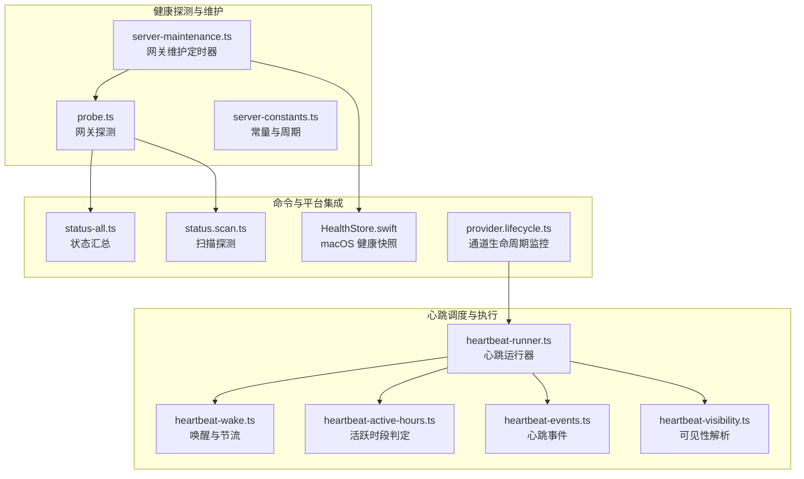
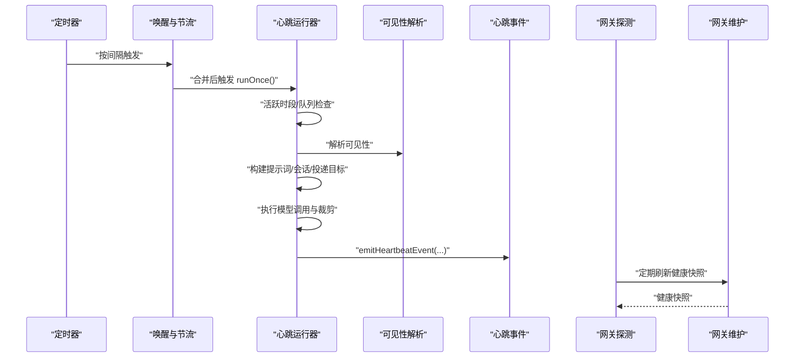
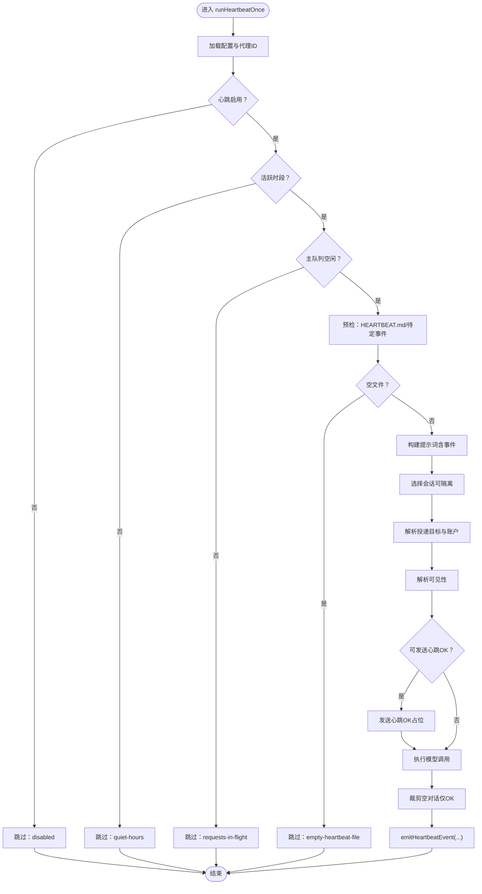
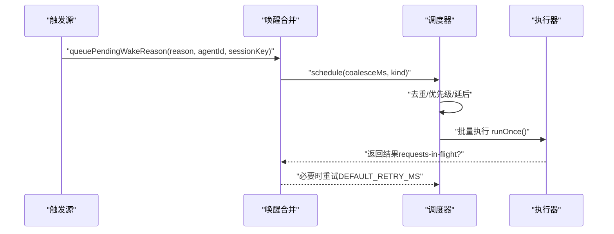
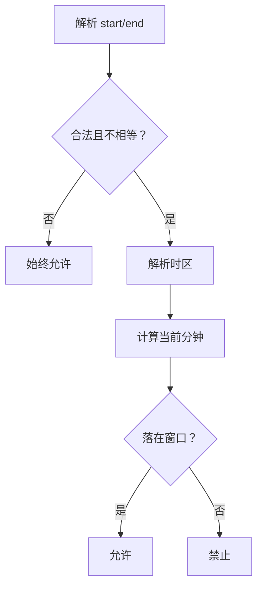
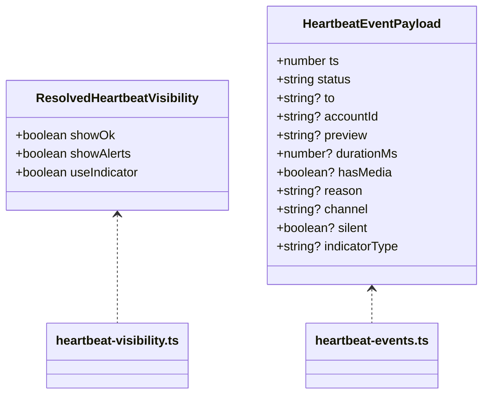
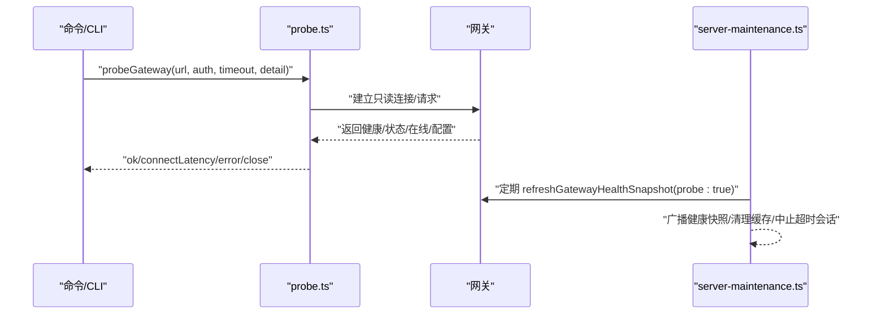
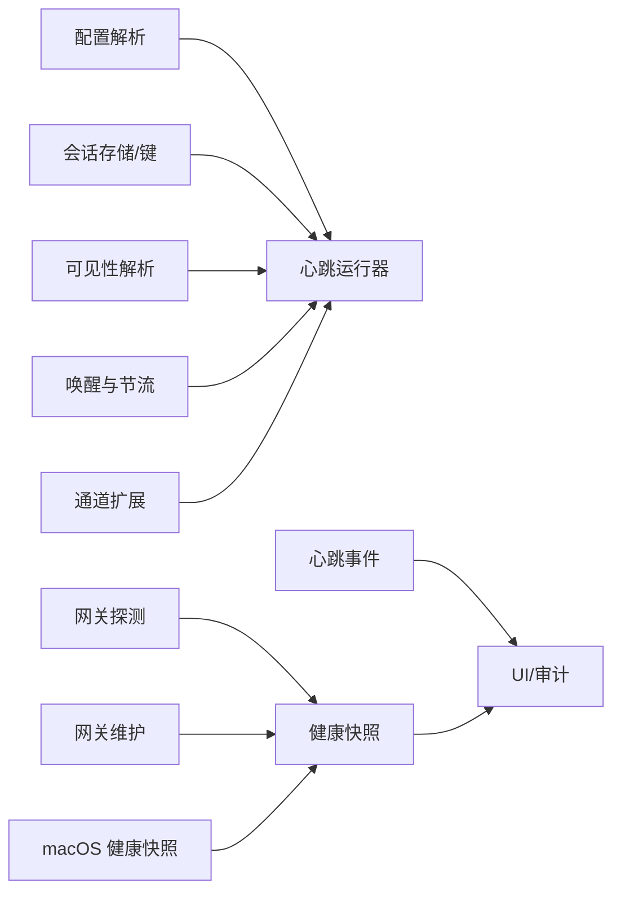

# 心跳监控

<cite>
**本文引用的文件**
- [heartbeat.md](file://docs/gateway/heartbeat.md)
- [heartbeat-runner.ts](file://src/infra/heartbeat-runner.ts)
- [heartbeat-wake.ts](file://src/infra/heartbeat-wake.ts)
- [heartbeat-active-hours.ts](file://src/infra/heartbeat-active-hours.ts)
- [heartbeat-events.ts](file://src/infra/heartbeat-events.ts)
- [heartbeat-visibility.ts](file://src/infra/heartbeat-visibility.ts)
- [heartbeat-runner.scheduler.test.ts](file://src/infra/heartbeat-runner.scheduler.test.ts)
- [probe.ts](file://src/gateway/probe.ts)
- [server-maintenance.ts](file://src/gateway/server-maintenance.ts)
- [server-constants.ts](file://src/gateway/server-constants.ts)
- [status-all.ts](file://src/commands/status-all.ts)
- [status.scan.ts](file://src/commands/status.scan.ts)
- [HealthStore.swift](file://apps/macos/Sources/OpenClaw/HealthStore.swift)
- [provider.lifecycle.ts](file://extensions/discord/src/monitor/provider.lifecycle.ts)
</cite>

## 目录
1. [简介](#简介)
2. [项目结构](#项目结构)
3. [核心组件](#核心组件)
4. [架构总览](#架构总览)
5. [详细组件分析](#详细组件分析)
6. [依赖关系分析](#依赖关系分析)
7. [性能考量](#性能考量)
8. [故障排查指南](#故障排查指南)
9. [结论](#结论)
10. [附录](#附录)

## 简介
本文件系统化阐述网关心跳监控体系：心跳机制的设计原理、监控策略与健康检查流程；心跳间隔配置、超时处理与故障检测算法；心跳事件的格式规范、状态同步机制与异常恢复策略；以及心跳监控与代理状态跟踪、通道连接监控、资源使用监控等系统组件的集成方式。同时提供最佳实践、性能调优建议与故障排除方法，并给出心跳日志分析、监控仪表板集成与告警配置指南。

## 项目结构
心跳监控由“调度与执行层（心跳运行器）”、“触发与合并层（唤醒与节流）”、“可见性与事件层（可见性解析与事件广播）”、“健康探测与维护层（网关探测与定时维护）”四大部分组成，并通过配置解析与会话上下文贯穿到通道插件与消息投递链路中。

图示来源
- [heartbeat-runner.ts:1-1273](file://src/infra/heartbeat-runner.ts#L1-L1273)
- [heartbeat-wake.ts:1-273](file://src/infra/heartbeat-wake.ts#L1-L273)
- [heartbeat-active-hours.ts:1-100](file://src/infra/heartbeat-active-hours.ts#L1-L100)
- [heartbeat-events.ts:1-59](file://src/infra/heartbeat-events.ts#L1-L59)
- [heartbeat-visibility.ts:1-74](file://src/infra/heartbeat-visibility.ts#L1-L74)
- [probe.ts:1-163](file://src/gateway/probe.ts#L1-L163)
- [server-maintenance.ts:1-165](file://src/gateway/server-maintenance.ts#L1-L165)
- [server-constants.ts:1-38](file://src/gateway/server-constants.ts#L1-L38)
- [status-all.ts:170-275](file://src/commands/status-all.ts#L170-L275)
- [status.scan.ts:91-125](file://src/commands/status.scan.ts#L91-L125)
- [HealthStore.swift:147-163](file://apps/macos/Sources/OpenClaw/HealthStore.swift#L147-L163)
- [provider.lifecycle.ts:151-204](file://extensions/discord/src/monitor/provider.lifecycle.ts#L151-L204)

章节来源
- [heartbeat-runner.ts:1-1273](file://src/infra/heartbeat-runner.ts#L1-L1273)
- [heartbeat-wake.ts:1-273](file://src/infra/heartbeat-wake.ts#L1-L273)
- [heartbeat-active-hours.ts:1-100](file://src/infra/heartbeat-active-hours.ts#L1-L100)
- [heartbeat-events.ts:1-59](file://src/infra/heartbeat-events.ts#L1-L59)
- [heartbeat-visibility.ts:1-74](file://src/infra/heartbeat-visibility.ts#L1-L74)
- [probe.ts:1-163](file://src/gateway/probe.ts#L1-L163)
- [server-maintenance.ts:1-165](file://src/gateway/server-maintenance.ts#L1-L165)
- [server-constants.ts:1-38](file://src/gateway/server-constants.ts#L1-L38)
- [status-all.ts:170-275](file://src/commands/status-all.ts#L170-L275)
- [status.scan.ts:91-125](file://src/commands/status.scan.ts#L91-L125)
- [HealthStore.swift:147-163](file://apps/macos/Sources/OpenClaw/HealthStore.swift#L147-L163)
- [provider.lifecycle.ts:151-204](file://extensions/discord/src/monitor/provider.lifecycle.ts#L151-L204)

## 核心组件
- 心跳运行器：负责按配置解析心跳间隔、活跃时段、提示词与交付目标，执行一次心跳并产出结果与事件；支持隔离会话、轻量上下文、裁剪空对话等优化。
- 唤醒与节流：统一接收“定时触发、手动唤醒、事件驱动”等多源触发，进行优先级与去抖合并，避免队列繁忙导致的重复触发。
- 可见性与事件：根据通道与账户配置决定是否显示“心跳 OK”“告警内容”“指示事件”，并广播心跳事件供 UI 与审计使用。
- 健康探测与维护：对网关进行连通性、就绪性、健康状态探测；服务端定期发送心跳包与健康刷新，维持缓存与清理任务。
- 平台与扩展集成：macOS 健康快照聚合通道探针；通道扩展（如 Discord）在连接状态变化时联动心跳状态。

章节来源
- [heartbeat-runner.ts:609-800](file://src/infra/heartbeat-runner.ts#L609-L800)
- [heartbeat-wake.ts:119-194](file://src/infra/heartbeat-wake.ts#L119-L194)
- [heartbeat-visibility.ts:22-73](file://src/infra/heartbeat-visibility.ts#L22-L73)
- [heartbeat-events.ts:36-59](file://src/infra/heartbeat-events.ts#L36-L59)
- [probe.ts:32-163](file://src/gateway/probe.ts#L32-L163)
- [server-maintenance.ts:58-76](file://src/gateway/server-maintenance.ts#L58-L76)
- [HealthStore.swift:147-163](file://apps/macos/Sources/OpenClaw/HealthStore.swift#L147-L163)
- [provider.lifecycle.ts:151-204](file://extensions/discord/src/monitor/provider.lifecycle.ts#L151-L204)

## 架构总览
心跳监控以“配置驱动 + 事件驱动”的双轨机制运行：定时器按心跳间隔触发；唤醒层合并多源触发；运行器在满足条件（活跃时段、队列空闲、可见性允许）下执行；完成后通过事件层广播状态，供 UI 与审计消费；网关侧通过探测与维护定时器保障健康快照与连接稳定。

图示来源
- [heartbeat-runner.ts:609-800](file://src/infra/heartbeat-runner.ts#L609-L800)
- [heartbeat-wake.ts:119-194](file://src/infra/heartbeat-wake.ts#L119-L194)
- [heartbeat-events.ts:36-59](file://src/infra/heartbeat-events.ts#L36-L59)
- [probe.ts:32-163](file://src/gateway/probe.ts#L32-L163)
- [server-maintenance.ts:58-76](file://src/gateway/server-maintenance.ts#L58-L76)

## 详细组件分析

### 心跳运行器（heartbeat-runner）
- 配置解析与摘要：支持全局默认、按代理覆盖、按通道与账户覆盖；生成心跳摘要（间隔、提示词、目标、模型、ACK 最大字符数）。
- 间隔与活跃时段：解析“every”为毫秒；结合活跃时段判定函数，不在窗口内则跳过。
- 队列与会话：若主队列有请求在途，则跳过；可选“隔离会话”每次运行新建会话，避免历史上下文成本。
- 提示词与上下文：根据是否存在执行完成事件或计划任务事件动态拼装提示词；可注入当前时间行；支持轻量上下文与响应前缀。
- 投递与可见性：解析投递目标与账户；根据可见性决定是否发送“心跳 OK”占位消息；最终裁剪空对话以减少上下文污染。
- 结果与事件：返回“已运行/已跳过/失败”三态；广播心跳事件（含状态、原因、耗时、通道、指示类型等）。

图示来源
- [heartbeat-runner.ts:609-800](file://src/infra/heartbeat-runner.ts#L609-L800)

章节来源
- [heartbeat-runner.ts:152-198](file://src/infra/heartbeat-runner.ts#L152-L198)
- [heartbeat-runner.ts:215-242](file://src/infra/heartbeat-runner.ts#L215-L242)
- [heartbeat-runner.ts:501-559](file://src/infra/heartbeat-runner.ts#L501-L559)
- [heartbeat-runner.ts:609-800](file://src/infra/heartbeat-runner.ts#L609-L800)

### 唤醒与节流（heartbeat-wake）
- 多源触发：定时触发、手动唤醒、事件驱动（如执行完成、计划任务、动作触发）。
- 优先级与合并：按“重试/间隔/默认/动作”优先级合并；同目标键（代理ID+会话键）去重，保留更高优先级与更早请求时间。
- 节流与回退：默认合并窗口与重试冷却；当运行中或队列繁忙时，自动延后并重试，确保不丢失触发意图。
- 生命周期安全：支持注册/注销唤醒处理器，防止旧生命周期残留状态影响新实例。

图示来源
- [heartbeat-wake.ts:84-194](file://src/infra/heartbeat-wake.ts#L84-L194)

章节来源
- [heartbeat-wake.ts:119-194](file://src/infra/heartbeat-wake.ts#L119-L194)
- [heartbeat-wake.ts:238-250](file://src/infra/heartbeat-wake.ts#L238-L250)
- [heartbeat-runner.scheduler.test.ts:180-231](file://src/infra/heartbeat-runner.scheduler.test.ts#L180-L231)

### 活跃时段判定（heartbeat-active-hours）
- 时间窗解析：支持 HH:mm 与 24:00 特例；起止不等且合法时有效。
- 时区解析：支持“用户时区”“本地时区”“IANA 时区标识”；非法标识回退到用户时区。
- 当前时刻换算：按指定时区换算当前分钟数，判断落入区间（跨午夜场景）。

图示来源
- [heartbeat-active-hours.ts:70-99](file://src/infra/heartbeat-active-hours.ts#L70-L99)

章节来源
- [heartbeat-active-hours.ts:1-100](file://src/infra/heartbeat-active-hours.ts#L1-L100)

### 可见性与事件（heartbeat-visibility 与 heartbeat-events）
- 可见性解析：按“账户 > 通道 > 通道默认 > 全局默认”层级解析 showOk、showAlerts、useIndicator。
- 事件格式：心跳事件包含时间戳、状态（已发送/空OK/仅令牌/已跳过/失败）、目标、账户、预览、耗时、媒体标记、原因、通道、静默标记、指示类型等。
- 指示类型：根据状态映射为“正常/提醒/错误”，用于 UI 状态展示。

图示来源
- [heartbeat-visibility.ts:5-15](file://src/infra/heartbeat-visibility.ts#L5-L15)
- [heartbeat-events.ts:3-18](file://src/infra/heartbeat-events.ts#L3-L18)

章节来源
- [heartbeat-visibility.ts:22-73](file://src/infra/heartbeat-visibility.ts#L22-L73)
- [heartbeat-events.ts:20-34](file://src/infra/heartbeat-events.ts#L20-L34)
- [heartbeat-events.ts:36-59](file://src/infra/heartbeat-events.ts#L36-L59)

### 网关探测与维护（probe 与 server-maintenance）
- 探测：建立只读客户端，支持“无详情/仅在线信息/完整详情”三种模式；超时与连接错误统一收敛；成功时返回健康、状态、在线列表、配置快照。
- 维护：周期发送“心跳包”与“健康刷新”，预热缓存；清理去重表、超时中止会话、过期运行记录；可选媒体清理。

图示来源
- [probe.ts:32-163](file://src/gateway/probe.ts#L32-L163)
- [server-maintenance.ts:58-76](file://src/gateway/server-maintenance.ts#L58-L76)
- [server-constants.ts:34-38](file://src/gateway/server-constants.ts#L34-L38)

章节来源
- [probe.ts:1-163](file://src/gateway/probe.ts#L1-L163)
- [server-maintenance.ts:1-165](file://src/gateway/server-maintenance.ts#L1-L165)
- [server-constants.ts:1-38](file://src/gateway/server-constants.ts#L1-L38)

### 平台与扩展集成
- macOS 健康快照：通道健康状态聚合逻辑，缺失探针视为“已配置但未知健康”，超时或状态缺失时描述为“超时”。
- 通道扩展（Discord）：在 WebSocket 连接断开/重连时更新心跳状态，ARM/ disarm 重连停滞看门狗，清理 HELLO 连接轮询，保持连接健康感知。

章节来源
- [HealthStore.swift:147-163](file://apps/macos/Sources/OpenClaw/HealthStore.swift#L147-L163)
- [provider.lifecycle.ts:151-204](file://extensions/discord/src/monitor/provider.lifecycle.ts#L151-L204)

## 依赖关系分析
- 配置与会话：心跳运行器依赖配置解析、会话存储与会话键规范化；可见性解析依赖通道与账户配置。
- 触发与调度：唤醒层解耦触发源与执行器，避免重复执行与队列拥塞。
- 健康与状态：网关探测与维护定时器为 UI 与命令行提供健康快照；心跳事件为 UI 提供指示类型。
- 平台与扩展：macOS 将通道探针整合进健康快照；通道扩展在连接状态变化时联动心跳状态。

图示来源
- [heartbeat-runner.ts:1-1273](file://src/infra/heartbeat-runner.ts#L1-L1273)
- [heartbeat-wake.ts:1-273](file://src/infra/heartbeat-wake.ts#L1-L273)
- [heartbeat-visibility.ts:1-74](file://src/infra/heartbeat-visibility.ts#L1-L74)
- [heartbeat-events.ts:1-59](file://src/infra/heartbeat-events.ts#L1-L59)
- [probe.ts:1-163](file://src/gateway/probe.ts#L1-L163)
- [server-maintenance.ts:1-165](file://src/gateway/server-maintenance.ts#L1-L165)
- [HealthStore.swift:147-163](file://apps/macos/Sources/OpenClaw/HealthStore.swift#L147-L163)
- [provider.lifecycle.ts:151-204](file://extensions/discord/src/monitor/provider.lifecycle.ts#L151-L204)

章节来源
- [heartbeat-runner.ts:1-1273](file://src/infra/heartbeat-runner.ts#L1-L1273)
- [heartbeat-wake.ts:1-273](file://src/infra/heartbeat-wake.ts#L1-L273)
- [heartbeat-visibility.ts:1-74](file://src/infra/heartbeat-visibility.ts#L1-L74)
- [heartbeat-events.ts:1-59](file://src/infra/heartbeat-events.ts#L1-L59)
- [probe.ts:1-163](file://src/gateway/probe.ts#L1-L163)
- [server-maintenance.ts:1-165](file://src/gateway/server-maintenance.ts#L1-L165)
- [HealthStore.swift:147-163](file://apps/macos/Sources/OpenClaw/HealthStore.swift#L147-L163)
- [provider.lifecycle.ts:151-204](file://extensions/discord/src/monitor/provider.lifecycle.ts#L151-L204)

## 性能考量
- 降低 Token 成本：启用“隔离会话”与“轻量上下文”，避免发送完整历史；缩短提示词与上下文大小。
- 减少无效运行：利用活跃时段限制与“空心跳文件”短路；在队列繁忙时跳过并重试。
- 事件与投递优化：仅在可见性允许时发送“心跳 OK”占位；对纯空回复进行上下文裁剪，避免零信息对话污染。
- 定时器与冷却：合理设置合并窗口与重试冷却，避免高频抖动；维护定时器周期与 TTL 控制内存占用。

## 故障排查指南
- 常见跳过原因
  - disabled：心跳被禁用或间隔无效。
  - quiet-hours：当前时间不在活跃时段。
  - requests-in-flight：主队列繁忙，心跳被跳过并在稍后重试。
  - alerts-disabled：可见性配置导致不发送任何消息。
  - empty-heartbeat-file：HEARTBEAT.md 为空或仅空白，直接跳过。
- 网关可达性与健康
  - 使用探测接口获取健康/状态/在线/配置快照；关注连接延迟、关闭原因与错误信息。
  - 服务端维护定时器会定期刷新健康快照并广播，若长时间未收到“健康”事件，检查维护定时器与广播链路。
- 平台与通道
  - macOS 健康快照：缺失探针视为“已配置但未知健康”；超时或状态缺失时描述为“超时”。
  - 通道扩展：在连接断开/重连时更新心跳状态，注意重连停滞看门狗与 HELLO 连接轮询的 ARM/DISARM 行为。

章节来源
- [heartbeat-runner.ts:625-660](file://src/infra/heartbeat-runner.ts#L625-L660)
- [heartbeat-wake.ts:166-175](file://src/infra/heartbeat-wake.ts#L166-L175)
- [probe.ts:144-158](file://src/gateway/probe.ts#L144-L158)
- [server-maintenance.ts:65-76](file://src/gateway/server-maintenance.ts#L65-L76)
- [HealthStore.swift:153-163](file://apps/macos/Sources/OpenClaw/HealthStore.swift#L153-L163)
- [provider.lifecycle.ts:151-204](file://extensions/discord/src/monitor/provider.lifecycle.ts#L151-L204)

## 结论
心跳监控体系通过“配置驱动 + 事件驱动”的双轨机制，在保证低开销与高可靠的同时，提供了灵活的可见性控制与可观测性输出。结合网关探测与维护定时器，系统能够持续提供健康快照与稳定连接；平台与扩展的深度集成进一步增强了对代理状态与通道连接的实时感知能力。遵循本文的最佳实践与排障建议，可在不同规模与复杂度的部署中获得稳定的心跳体验。

## 附录

### 心跳事件格式规范
- 字段
  - ts：事件时间戳
  - status：事件状态（sent/ok-empty/ok-token/skipped/failed）
  - to：目标通道标识
  - accountId：账户标识
  - preview：消息预览
  - durationMs：执行耗时（毫秒）
  - hasMedia：是否包含媒体
  - reason：触发原因（如 interval/retry/exec-event/cron 等）
  - channel：发送通道
  - silent：是否静默（showOk=false 时）
  - indicatorType：指示类型（ok/alert/error）

章节来源
- [heartbeat-events.ts:3-18](file://src/infra/heartbeat-events.ts#L3-L18)

### 心跳配置与最佳实践
- 间隔与活跃时段
  - 默认间隔：30 分钟；OAuth/setup-token 场景为 1 小时；可通过 agents.defaults.heartbeat.every 或 per-agent 覆盖。
  - 活跃时段：支持 start/end 与 timezone；24:00 仅允许 end 使用；起止相等为零宽窗口，始终跳过。
- 可见性控制
  - showOk：是否发送“心跳 OK”
  - showAlerts：是否发送告警内容
  - useIndicator：是否发出指示事件
  - 优先级：账户 > 通道 > 通道默认 > 全局默认
- 成本优化
  - isolatedSession：每次运行新建会话，避免历史上下文
  - lightContext：仅注入 HEARTBEAT.md
  - 更便宜模型与更短提示词
  - target: "none" 仅内部更新
- 手动唤醒
  - 支持立即执行或等待下次心跳；可指定 agentId 与 sessionKey 精确路由

章节来源
- [heartbeat.md:48-171](file://docs/gateway/heartbeat.md#L48-L171)
- [heartbeat.md:257-318](file://docs/gateway/heartbeat.md#L257-L318)
- [heartbeat.md:358-394](file://docs/gateway/heartbeat.md#L358-L394)
- [heartbeat-visibility.ts:22-73](file://src/infra/heartbeat-visibility.ts#L22-L73)

### 监控仪表板与告警配置
- 事件监听：通过心跳事件监听器订阅 lastHeartbeat 事件，提取状态、原因、耗时与指示类型，用于 UI 状态与告警。
- 健康快照：服务端维护定时器定期刷新健康快照并广播；命令行与 UI 可据此展示网关健康与连接状态。
- 告警规则建议
  - 连续多次 requests-in-flight 跳过
  - 超时或失败事件
  - 活跃时段外的异常跳过
  - 通道连接断开/重连事件

章节来源
- [heartbeat-events.ts:51-59](file://src/infra/heartbeat-events.ts#L51-L59)
- [server-maintenance.ts:48-56](file://src/gateway/server-maintenance.ts#L48-L56)
- [status-all.ts:272-275](file://src/commands/status-all.ts#L272-L275)