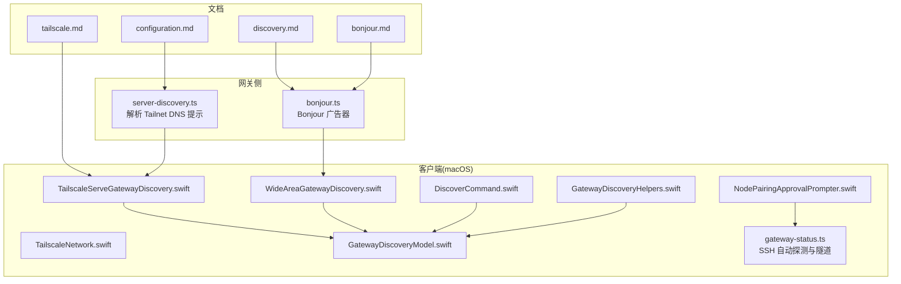
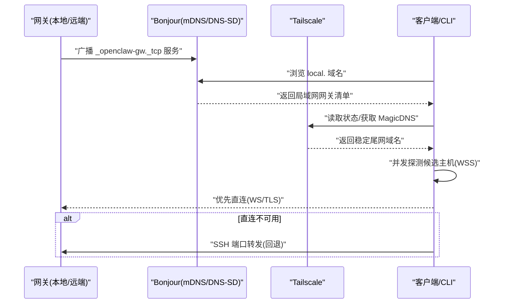
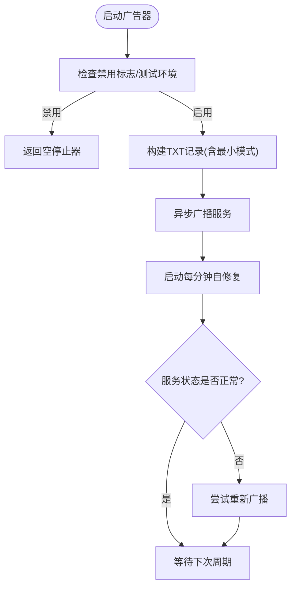
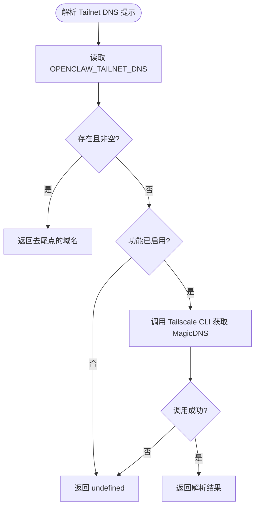
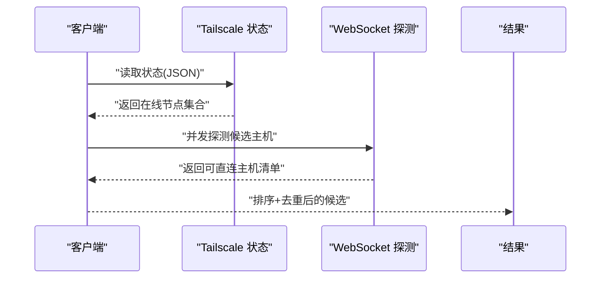
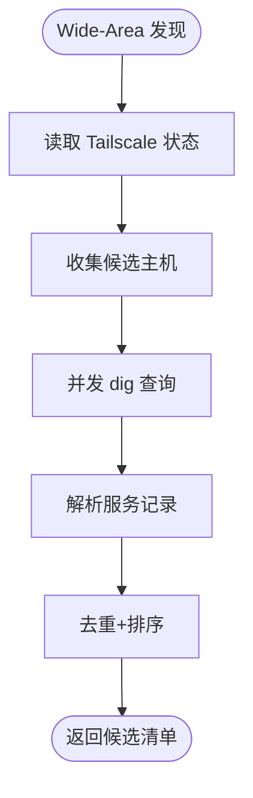
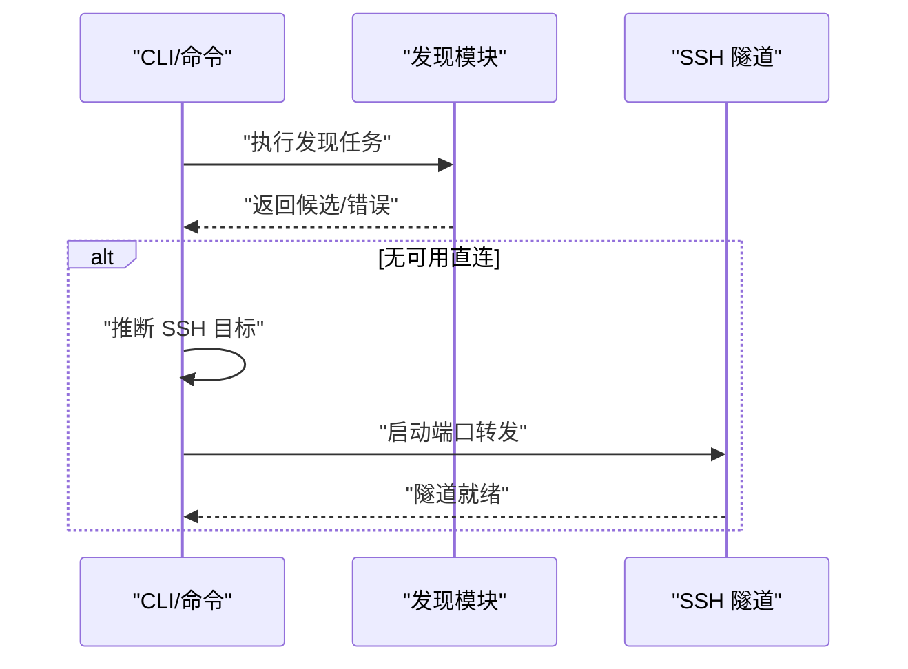
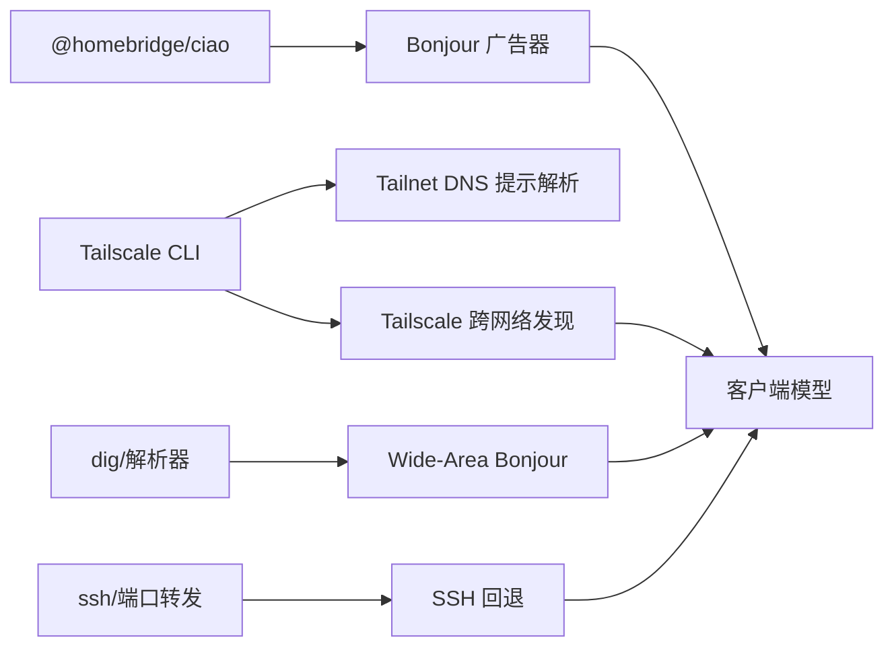

# 服务发现

<cite>
**本文引用的文件**
- [discovery.md](file://docs/gateway/discovery.md)
- [bonjour.md](file://docs/gateway/bonjour.md)
- [tailscale.md](file://docs/gateway/tailscale.md)
- [configuration.md](file://docs/gateway/configuration.md)
- [server-discovery.ts](file://src/gateway/server-discovery.ts)
- [bonjour.ts](file://src/infra/bonjour.ts)
- [TailscaleNetwork.swift](file://apps/macos/Sources/OpenClawDiscovery/TailscaleNetwork.swift)
- [TailscaleServeGatewayDiscovery.swift](file://apps/macos/Sources/OpenClawDiscovery/TailscaleServeGatewayDiscovery.swift)
- [WideAreaGatewayDiscovery.swift](file://apps/macos/Sources/OpenClawDiscovery/WideAreaGatewayDiscovery.swift)
- [GatewayDiscoveryModel.swift](file://apps/macos/Sources/OpenClawDiscovery/GatewayDiscoveryModel.swift)
- [DiscoverCommand.swift](file://apps/macos/Sources/OpenClawMacCLI/DiscoverCommand.swift)
- [gateway-status.ts](file://src/commands/gateway-status.ts)
- [NodePairingApprovalPrompter.swift](file://apps/macos/Sources/OpenClaw/NodePairingApprovalPrompter.swift)
- [GatewayDiscoveryHelpers.swift](file://apps/macos/Sources/OpenClaw/GatewayDiscoveryHelpers.swift)
</cite>

## 目录
1. [简介](#简介)
2. [项目结构](#项目结构)
3. [核心组件](#核心组件)
4. [架构总览](#架构总览)
5. [详细组件分析](#详细组件分析)
6. [依赖关系分析](#依赖关系分析)
7. [性能考量](#性能考量)
8. [故障排除指南](#故障排除指南)
9. [结论](#结论)
10. [附录](#附录)

## 简介
本文件系统化梳理 OpenClaw 网关服务发现体系，覆盖 Bonjour DNS-SD 局域网发现、跨网络的 Tailscale 跨网络发现与 Wide-Area Bonjour（基于 Split DNS 的 Unicast DNS-SD），以及 SSH 回退路径。文档重点解释：
- 服务注册与注销：网关通过 mDNS/DNS-SD 广播服务记录；客户端在后台自动维护与清理。
- 动态服务列表更新：Bonjour 服务状态监控与自修复；Tailscale 节点变化时的增量刷新。
- 多网关策略：按优先级选择直连或 SSH；在多网关环境中进行负载均衡与故障转移。
- 远程访问与跨网络：Tailscale Serve/Funnel、Wide-Area Bonjour、SSH 隧道。
- 安全与合规：TXT 记录非认证、路由应以 SRV/A 解析结果为准；TLS Pinning 不得被广告覆盖。

## 项目结构
围绕服务发现的关键目录与文件：
- 文档层：gateway 子文档（discovery、bonjour、tailscale）提供高层设计与操作指引。
- 网关侧实现：基础设施层（Bonjour 广告）、服务端解析与提示（Tailnet DNS 提示解析）。
- 客户端实现：macOS 平台的发现模块（Tailscale、Wide-Area、本地 Bonjour）、命令行与 UI 模型。

**图表来源**
- [discovery.md:1-124](file://docs/gateway/discovery.md#L1-L124)
- [bonjour.md:1-178](file://docs/gateway/bonjour.md#L1-L178)
- [tailscale.md:1-133](file://docs/gateway/tailscale.md#L1-L133)
- [configuration.md:1-634](file://docs/gateway/configuration.md#L1-L634)
- [server-discovery.ts:1-91](file://src/gateway/server-discovery.ts#L1-L91)
- [bonjour.ts:1-282](file://src/infra/bonjour.ts#L1-L282)
- [TailscaleNetwork.swift:1-22](file://apps/macos/Sources/OpenClawDiscovery/TailscaleNetwork.swift#L1-L22)
- [TailscaleServeGatewayDiscovery.swift:1-330](file://apps/macos/Sources/OpenClawDiscovery/TailscaleServeGatewayDiscovery.swift#L1-L330)
- [WideAreaGatewayDiscovery.swift:1-40](file://apps/macos/Sources/OpenClawDiscovery/WideAreaGatewayDiscovery.swift#L1-L40)
- [GatewayDiscoveryModel.swift:38-66](file://apps/macos/Sources/OpenClawDiscovery/GatewayDiscoveryModel.swift#L38-L66)
- [DiscoverCommand.swift:1-55](file://apps/macos/Sources/OpenClawMacCLI/DiscoverCommand.swift#L1-L55)
- [gateway-status.ts:75-146](file://src/commands/gateway-status.ts#L75-L146)
- [NodePairingApprovalPrompter.swift:456-479](file://apps/macos/Sources/OpenClaw/NodePairingApprovalPrompter.swift#L456-L479)
- [GatewayDiscoveryHelpers.swift:1-39](file://apps/macos/Sources/OpenClaw/GatewayDiscoveryHelpers.swift#L1-L39)

**章节来源**
- [discovery.md:1-124](file://docs/gateway/discovery.md#L1-L124)
- [bonjour.md:1-178](file://docs/gateway/bonjour.md#L1-L178)
- [tailscale.md:1-133](file://docs/gateway/tailscale.md#L1-L133)
- [configuration.md:1-634](file://docs/gateway/configuration.md#L1-L634)

## 核心组件
- Bonjour 广告器（网关侧）
  - 负责在本地网络广播网关服务，生成服务实例名、TXT 记录键值，并在异常状态下进行自修复重试。
  - 支持最小模式（minimal）隐藏敏感字段，降低信息泄露风险。
- Tailnet DNS 提示解析（网关侧）
  - 在启用时从 Tailscale 获取稳定 MagicDNS 名称作为跨网络提示，供客户端在 Wide-Area Bonjour 中使用。
- Tailscale 跨网络发现（客户端）
  - 通过读取 Tailscale 状态，收集在线节点，对候选主机发起 WebSocket 探测，确认其为网关后返回可用目标。
- Wide-Area Bonjour（客户端）
  - 基于 Split DNS 的 Unicast DNS-SD 浏览指定域名下的服务记录，支持并发解析与超时控制。
- 本地 Bonjour（客户端）
  - 在同一局域网内浏览 local. 域名下的服务，作为首选直连路径。
- SSH 回退（客户端/CLI）
  - 当无直连可用时，自动推断 SSH 目标并启动端口转发隧道，确保远程可达性。

**章节来源**
- [bonjour.ts:84-282](file://src/infra/bonjour.ts#L84-L282)
- [server-discovery.ts:67-91](file://src/gateway/server-discovery.ts#L67-L91)
- [TailscaleServeGatewayDiscovery.swift:27-86](file://apps/macos/Sources/OpenClawDiscovery/TailscaleServeGatewayDiscovery.swift#L27-L86)
- [WideAreaGatewayDiscovery.swift:33-40](file://apps/macos/Sources/OpenClawDiscovery/WideAreaGatewayDiscovery.swift#L33-L40)
- [gateway-status.ts:75-146](file://src/commands/gateway-status.ts#L75-L146)

## 架构总览
下图展示从“网关广播”到“客户端选择与连接”的整体流程，包括直连优先、跨网络与 SSH 回退策略。

**图表来源**
- [discovery.md:100-108](file://docs/gateway/discovery.md#L100-L108)
- [bonjour.ts:148-160](file://src/infra/bonjour.ts#L148-L160)
- [TailscaleServeGatewayDiscovery.swift:27-86](file://apps/macos/Sources/OpenClawDiscovery/TailscaleServeGatewayDiscovery.swift#L27-L86)
- [gateway-status.ts:75-146](file://src/commands/gateway-status.ts#L75-L146)

## 详细组件分析

### 组件A：Bonjour 广告与自修复
- 实现要点
  - 服务类型与 TXT 键：role、lanHost、gatewayPort、gatewayTls、gatewayTlsSha256、canvasPort、sshPort、transport、cliPath、tailnetDns。
  - 最小模式：可隐藏 cliPath、sshPort，减少信息泄露。
  - 自修复：定时检查服务状态，若非 announced/announcing，则尝试重新广播。
  - 环境开关：可通过环境变量禁用广告（测试/CI 场景默认禁用）。
- 关键行为
  - 启动即异步广播，不阻塞网关启动。
  - 日志记录广告成功/失败与名称冲突事件。
  - watchdog 每分钟扫描一次，30 秒内同实例不重复尝试修复。

**图表来源**
- [bonjour.ts:84-282](file://src/infra/bonjour.ts#L84-L282)

**章节来源**
- [bonjour.ts:12-26](file://src/infra/bonjour.ts#L12-L26)
- [bonjour.ts:112-146](file://src/infra/bonjour.ts#L112-L146)
- [bonjour.ts:215-259](file://src/infra/bonjour.ts#L215-L259)

### 组件B：Tailnet DNS 提示解析
- 目标
  - 在网关侧提供稳定的跨网络提示（MagicDNS），供客户端在 Wide-Area Bonjour 中使用。
- 行为
  - 优先读取环境变量中的 tailnet 域名；否则调用 Tailscale CLI 获取当前主机的 MagicDNS 名称。
  - 可通过配置开关禁用该功能，此时直接返回环境变量值或 undefined。
- 与客户端协作
  - 客户端在 Wide-Area Bonjour 浏览阶段使用该提示，结合 Split DNS 解析服务记录。

**图表来源**
- [server-discovery.ts:67-91](file://src/gateway/server-discovery.ts#L67-L91)

**章节来源**
- [server-discovery.ts:67-91](file://src/gateway/server-discovery.ts#L67-L91)

### 组件C：Tailscale 跨网络发现
- 目标
  - 在不同网络环境下，通过 Tailscale 的在线节点集合，探测潜在网关主机，返回可直连的目标。
- 行为
  - 读取 Tailscale 状态，过滤在线节点，构造候选集。
  - 并发探测候选主机的 WebSocket Challenge，命中则认为是网关。
  - 返回排序后的去重候选列表。
- 与客户端协作
  - 客户端在 Wide-Area Bonjour 失败或无局域网直连时，优先尝试该路径。

**图表来源**
- [TailscaleServeGatewayDiscovery.swift:27-86](file://apps/macos/Sources/OpenClawDiscovery/TailscaleServeGatewayDiscovery.swift#L27-L86)

**章节来源**
- [TailscaleServeGatewayDiscovery.swift:27-86](file://apps/macos/Sources/OpenClawDiscovery/TailscaleServeGatewayDiscovery.swift#L27-L86)
- [TailscaleNetwork.swift:1-22](file://apps/macos/Sources/OpenClawDiscovery/TailscaleNetwork.swift#L1-L22)

### 组件D：Wide-Area Bonjour（Unicast DNS-SD）
- 目标
  - 在 Split DNS 配置下，浏览指定域名下的 _openclaw-gw._tcp 服务记录，实现跨网络直连发现。
- 行为
  - 使用 dig 或系统解析器并发查询，限制超时与并发度，收集候选并去重。
  - 将解析到的主机、端口、显示名等封装为发现模型。

**图表来源**
- [WideAreaGatewayDiscovery.swift:33-40](file://apps/macos/Sources/OpenClawDiscovery/WideAreaGatewayDiscovery.swift#L33-L40)

**章节来源**
- [WideAreaGatewayDiscovery.swift:1-40](file://apps/macos/Sources/OpenClawDiscovery/WideAreaGatewayDiscovery.swift#L1-L40)

### 组件E：本地 Bonjour（局域网直连）
- 目标
  - 在同一局域网内浏览 local. 域名下的服务，作为首选直连路径。
- 行为
  - 客户端模型聚合本地与跨网络发现结果，优先展示最近一次直连成功的网关。

**章节来源**
- [GatewayDiscoveryModel.swift:38-66](file://apps/macos/Sources/OpenClawDiscovery/GatewayDiscoveryModel.swift#L38-L66)

### 组件F：SSH 回退与自动探测
- 目标
  - 当无直连可用时，自动推断 SSH 目标并启动端口转发隧道，确保远程可达。
- 行为
  - CLI 在无直连时尝试解析候选 SSH 目标，必要时启动隧道；同时支持用户交互式配对与 SSH 目标确认。

**图表来源**
- [gateway-status.ts:75-146](file://src/commands/gateway-status.ts#L75-L146)
- [NodePairingApprovalPrompter.swift:456-479](file://apps/macos/Sources/OpenClaw/NodePairingApprovalPrompter.swift#L456-L479)

**章节来源**
- [gateway-status.ts:75-146](file://src/commands/gateway-status.ts#L75-L146)
- [NodePairingApprovalPrompter.swift:456-479](file://apps/macos/Sources/OpenClaw/NodePairingApprovalPrompter.swift#L456-L479)

## 依赖关系分析
- 网关侧依赖
  - Bonjour 广告器依赖 @homebridge/ciao；日志与未处理拒绝统一处理。
  - Tailnet DNS 提示解析依赖 Tailscale CLI 执行与解析。
- 客户端依赖
  - Tailscale 跨网络发现依赖 Tailscale 状态解析与 WebSocket 探测。
  - Wide-Area Bonjour 依赖系统 dig 或解析器，受 Split DNS 影响。
  - 本地 Bonjour 依赖系统浏览能力。
  - SSH 回退依赖系统 ssh 与端口转发能力。

**图表来源**
- [bonjour.ts:91-92](file://src/infra/bonjour.ts#L91-L92)
- [server-discovery.ts:82-86](file://src/gateway/server-discovery.ts#L82-L86)
- [TailscaleServeGatewayDiscovery.swift:147-163](file://apps/macos/Sources/OpenClawDiscovery/TailscaleServeGatewayDiscovery.swift#L147-L163)
- [WideAreaGatewayDiscovery.swift:18-19](file://apps/macos/Sources/OpenClawDiscovery/WideAreaGatewayDiscovery.swift#L18-L19)
- [gateway-status.ts:101-114](file://src/commands/gateway-status.ts#L101-L114)

**章节来源**
- [bonjour.ts:1-282](file://src/infra/bonjour.ts#L1-L282)
- [server-discovery.ts:1-91](file://src/gateway/server-discovery.ts#L1-L91)
- [TailscaleServeGatewayDiscovery.swift:1-330](file://apps/macos/Sources/OpenClawDiscovery/TailscaleServeGatewayDiscovery.swift#L1-L330)
- [WideAreaGatewayDiscovery.swift:1-40](file://apps/macos/Sources/OpenClawDiscovery/WideAreaGatewayDiscovery.swift#L1-L40)
- [gateway-status.ts:75-146](file://src/commands/gateway-status.ts#L75-L146)

## 性能考量
- 广告与浏览
  - Bonjour 广告采用异步广播，避免阻塞启动；watchdog 仅在状态异常时重试，频率可控。
  - 客户端并发控制：Tailscale 跨网络发现与 Wide-Area Bonjour 设置了最大候选数与并发度，避免资源耗尽。
- 超时与抖动
  - 客户端对单次探测设置上限超时，剩余时间动态分配给后续任务，提升整体吞吐。
- 热加载与重启
  - 网关配置热加载模式影响变更生效策略，避免不必要的重启。

**章节来源**
- [bonjour.ts:192-213](file://src/infra/bonjour.ts#L192-L213)
- [TailscaleServeGatewayDiscovery.swift:12-14](file://apps/macos/Sources/OpenClawDiscovery/TailscaleServeGatewayDiscovery.swift#L12-L14)
- [WideAreaGatewayDiscovery.swift:17-20](file://apps/macos/Sources/OpenClawDiscovery/WideAreaGatewayDiscovery.swift#L17-L20)
- [configuration.md:436-474](file://docs/gateway/configuration.md#L436-L474)

## 故障排除指南
- Bonjour 不跨网络
  - 使用 Tailscale 或 SSH 回退；在 Wide-Area Bonjour 下配置 Split DNS。
- Multicast 被阻断
  - 某些 Wi-Fi 网络会禁用 mDNS，导致浏览工作但解析失败。建议改用 Tailscale 或 SSH。
- 主机名复杂导致解析失败
  - 简化机器名（避免表情符号或特殊字符），重启网关后重试。
- 服务未公告或状态异常
  - 观察网关日志中 bonjour: watchdog/advertise 相关条目；确认环境禁用标志与测试环境变量。
- SSH 目标无法连接
  - CLI 会尝试自动推断 SSH 目标并启动隧道；若失败，检查 SSH 可达性与端口转发权限。

**章节来源**
- [discovery.md:149-157](file://docs/gateway/discovery.md#L149-L157)
- [bonjour.md:149-157](file://docs/gateway/bonjour.md#L149-L157)
- [bonjour.ts:215-259](file://src/infra/bonjour.ts#L215-L259)
- [gateway-status.ts:75-146](file://src/commands/gateway-status.ts#L75-L146)

## 结论
OpenClaw 的服务发现体系以“网关负责广播、客户端负责消费”为核心，结合 Bonjour 局域网直连、Tailscale 跨网络直连与 SSH 回退，形成稳健的多场景接入路径。通过 Tailnet DNS 提示与 Wide-Area Bonjour，系统在跨网络环境下仍能保持一致的发现体验；通过最小模式与严格的路由策略，兼顾安全与可用性。

## 附录

### 服务发现策略与负载均衡/故障转移
- 客户端策略（推荐）
  - 已保存的直连端点优先；否则局域网 Bonjour；再者 Tailnet DNS/IP；最后 SSH。
- 多网关环境
  - 客户端聚合多个来源的候选，按显示名排序并去重；可结合最近一次直连成功记录进行优先级调整。
- 故障转移
  - 直连失败自动切换至 SSH；跨网络直连失败时尝试其他候选或回退至 SSH。

**章节来源**
- [discovery.md:100-108](file://docs/gateway/discovery.md#L100-L108)
- [GatewayDiscoveryModel.swift:38-66](file://apps/macos/Sources/OpenClawDiscovery/GatewayDiscoveryModel.swift#L38-L66)

### 远程访问与跨网络实现
- Tailscale Serve/Funnel
  - Serve：仅尾网访问，HTTPS 由 Tailscale 提供，可注入身份头。
  - Funnel：公网 HTTPS，需满足版本与属性要求，仅暴露特定端口。
- Wide-Area Bonjour
  - 在网关侧开启 Wide-Area 发布与 Split DNS；客户端浏览指定域名下的服务记录。
- SSH 隧道
  - CLI 自动推断 SSH 目标并启动隧道，确保远程可达。

**章节来源**
- [tailscale.md:15-109](file://docs/gateway/tailscale.md#L15-L109)
- [bonjour.md:15-68](file://docs/gateway/bonjour.md#L15-L68)
- [gateway-status.ts:75-146](file://src/commands/gateway-status.ts#L75-L146)

### 网络配置与安全建议
- 网络配置
  - 局域网：确保 mDNS 可用；如被阻断，使用 Tailscale 或 SSH。
  - 跨网络：配置 Split DNS 与 Wide-Area Bonjour；或使用 Tailscale Serve/Funnel。
- 安全建议
  - TXT 记录为非认证提示，路由应以 SRV/A 解析结果为准。
  - TLS Pinning 不得被广告覆盖；首次指纹需经用户确认。
  - 最小模式隐藏敏感字段，降低信息泄露风险。

**章节来源**
- [discovery.md:71-84](file://docs/gateway/discovery.md#L71-L84)
- [bonjour.md:103-109](file://docs/gateway/bonjour.md#L103-L109)
- [bonjour.ts:130-134](file://src/infra/bonjour.ts#L130-L134)