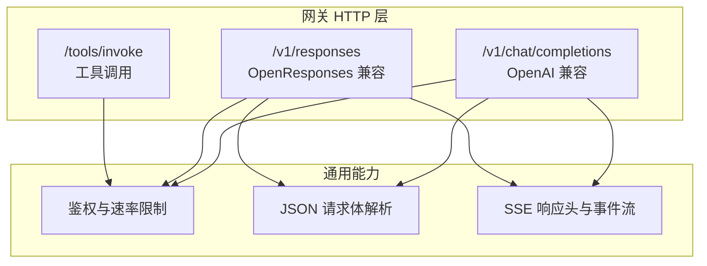
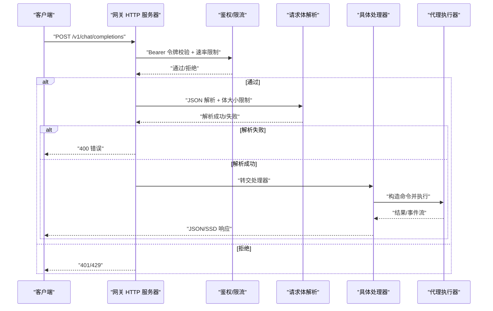
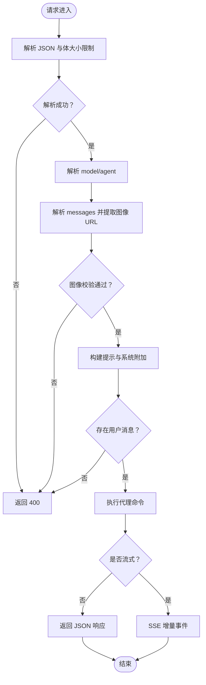
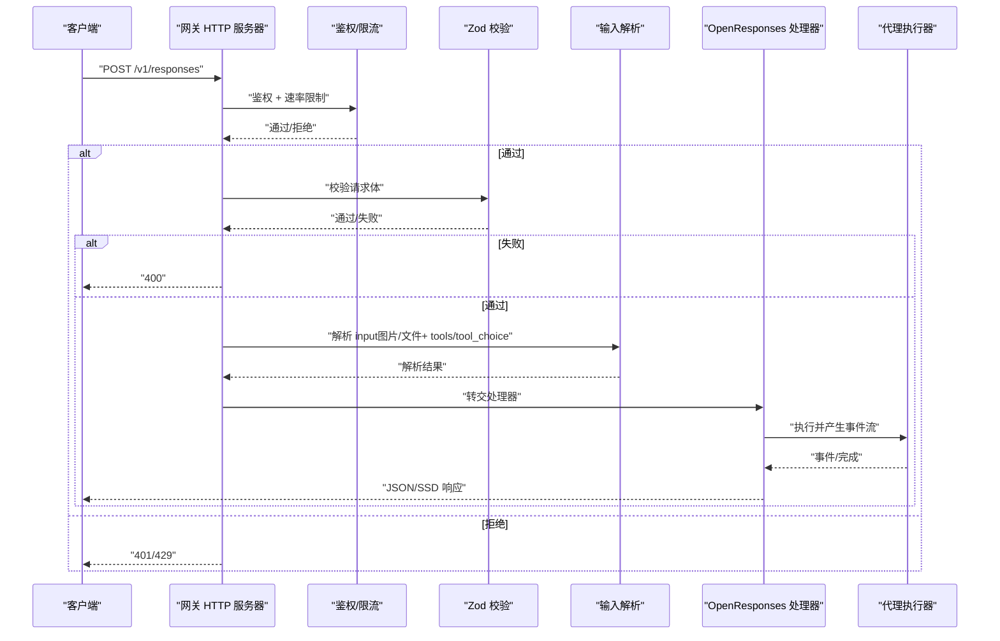
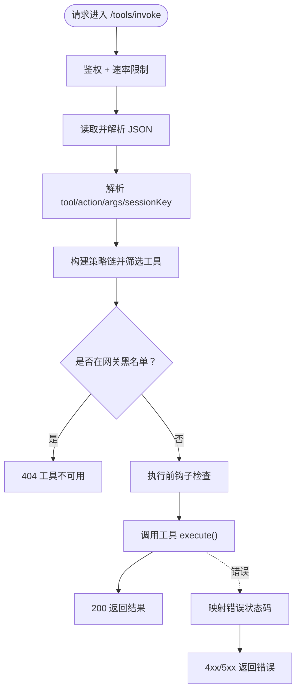
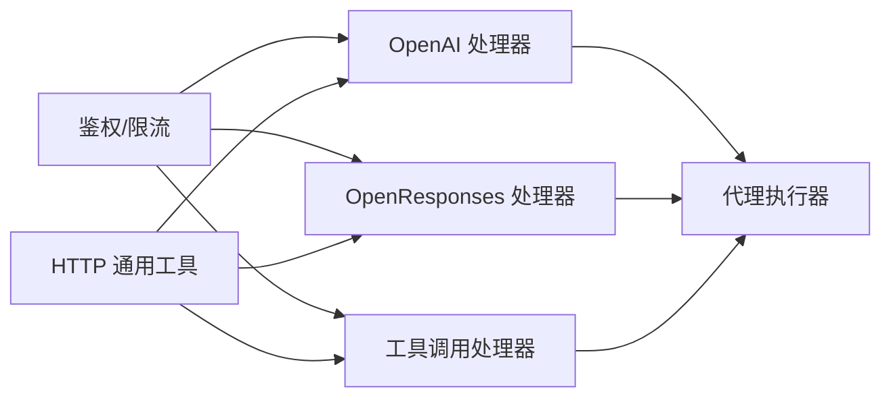

# HTTP API 接口

<cite>
**本文引用的文件**
- [openai-http-api.md](file://docs/gateway/openai-http-api.md)
- [openresponses-http-api.md](file://docs/zh-CN/gateway/openresponses-http-api.md)
- [tools-invoke-http-api.md](file://docs/gateway/tools-invoke-http-api.md)
- [openai-http.ts](file://src/gateway/openai-http.ts)
- [openresponses-http.ts](file://src/gateway/openresponses-http.ts)
- [tools-invoke-http.ts](file://src/gateway/tools-invoke-http.ts)
- [http-common.ts](file://src/gateway/http-common.ts)
- [auth.ts](file://src/gateway/auth.ts)
- [auth-rate-limit.ts](file://src/gateway/auth-rate-limit.ts)
- [openresponses-http-api.md](file://docs/experiments/plans/openresponses-gateway.md)
</cite>

## 目录
1. [简介](#简介)
2. [项目结构](#项目结构)
3. [核心组件](#核心组件)
4. [架构总览](#架构总览)
5. [详细组件分析](#详细组件分析)
6. [依赖关系分析](#依赖关系分析)
7. [性能考量](#性能考量)
8. [故障排查指南](#故障排查指南)
9. [结论](#结论)
10. [附录](#附录)

## 简介
本文件面向集成 OpenAI 兼容 API 的开发者，系统性阐述 OpenClaw Gateway 的 HTTP API 实现，覆盖以下主题：
- OpenAI 兼容端点映射与参数转换
- OpenResponses 兼容端点与消息流式传输
- 工具调用 HTTP API 的规范、工具发现、参数校验与执行流程
- 响应 API 的实现机制（含 SSE 事件流与状态查询思路）
- API 版本管理、向后兼容与迁移建议
- 认证机制、速率限制与错误处理策略
- 完整 API 参考、示例与集成最佳实践

## 项目结构
Gateway 的 HTTP API 由三个主要模块构成：
- OpenAI 兼容端点：/v1/chat/completions
- OpenResponses 兼容端点：/v1/responses
- 工具调用端点：/tools/invoke

这些端点均通过统一的 HTTP 中间件与认证/限流机制接入，请求在进入具体处理器前完成鉴权与请求体解析。

图表来源
- [openai-http.ts:408-613](file://src/gateway/openai-http.ts#L408-L613)
- [openresponses-http.ts:265-800](file://src/gateway/openresponses-http.ts#L265-L800)
- [tools-invoke-http.ts:136-361](file://src/gateway/tools-invoke-http.ts#L136-L361)
- [http-common.ts:36-71](file://src/gateway/http-common.ts#L36-L71)

章节来源
- [openai-http.ts:1-613](file://src/gateway/openai-http.ts#L1-L613)
- [openresponses-http.ts:1-800](file://src/gateway/openresponses-http.ts#L1-L800)
- [tools-invoke-http.ts:1-361](file://src/gateway/tools-invoke-http.ts#L1-L361)
- [http-common.ts:36-71](file://src/gateway/http-common.ts#L36-L71)

## 核心组件
- OpenAI 兼容端点（/v1/chat/completions）
  - 支持非流式与 SSE 流式响应
  - 参数映射：model → 代理选择；messages → 系统/用户/助手/工具消息；user → 会话键稳定化
  - 图像输入：支持 data URL 与 URL，限制数量与总字节数
- OpenResponses 兼容端点（/v1/responses）
  - 支持非流式与 SSE 流式响应
  - 参数映射：input → 基于 item 的输入；tools/tool_choice → 客户端工具定义与选择；instructions → 系统提示拼接；max_output_tokens → 令牌上限
  - 文件/图片输入：支持 base64 与 URL，具备 MIME 白名单与大小限制
- 工具调用端点（/tools/invoke）
  - 直接调用单个工具，受策略链与网关工具黑名单约束
  - 支持 action 映射到 args，支持 sessionKey 与可选上下文头（渠道、账号等）

章节来源
- [openai-http-api.md:1-133](file://docs/gateway/openai-http-api.md#L1-L133)
- [openresponses-http-api.md:1-318](file://docs/zh-CN/gateway/openresponses-http-api.md#L1-L318)
- [tools-invoke-http-api.md:1-111](file://docs/gateway/tools-invoke-http-api.md#L1-L111)

## 架构总览
下图展示 HTTP 请求从接入到执行的关键路径与关键决策点。

图表来源
- [openai-http.ts:408-613](file://src/gateway/openai-http.ts#L408-L613)
- [openresponses-http.ts:265-800](file://src/gateway/openresponses-http.ts#L265-L800)
- [tools-invoke-http.ts:136-361](file://src/gateway/tools-invoke-http.ts#L136-L361)
- [http-common.ts:36-71](file://src/gateway/http-common.ts#L36-L71)
- [auth.ts:439-476](file://src/gateway/auth.ts#L439-L476)
- [auth-rate-limit.ts:25-117](file://src/gateway/auth-rate-limit.ts#L25-L117)

## 详细组件分析

### OpenAI 兼容端点（/v1/chat/completions）
- 端点启用与禁用
  - 通过配置项开启/关闭，默认禁用
- 认证与安全
  - 使用网关认证模式（token/password），支持速率限制
- 会话行为
  - 默认每请求无状态；若提供 user 字段则派生稳定会话键
- 参数映射与转换
  - model → 代理选择（支持 openclaw:<agentId> 或 agent:<agentId>）
  - messages → 系统/用户/助手/工具消息解析；支持 image_url 内容解析与校验
  - user → 会话键稳定化
- 响应格式
  - 非流式：标准 OpenAI chat.completion
  - 流式：SSE，事件包含角色与内容增量
- 错误处理
  - 缺失 user 消息、无效 image_url、内部错误分别返回 400/500

图表来源
- [openai-http.ts:408-613](file://src/gateway/openai-http.ts#L408-L613)

章节来源
- [openai-http-api.md:1-133](file://docs/gateway/openai-http-api.md#L1-L133)
- [openai-http.ts:1-613](file://src/gateway/openai-http.ts#L1-L613)

### OpenResponses 兼容端点（/v1/responses）
- 端点启用与禁用
  - 通过配置项开启/关闭，默认禁用
- 认证与安全
  - 使用网关认证模式（token/password），支持速率限制
- 会话行为
  - 默认每请求无状态；若提供 user 字段则派生稳定会话键
- 参数映射与转换
  - input → 基于 item 的输入（message、input_image、input_file 等）
  - tools/tool_choice → 客户端工具定义与选择（none/required/function）
  - instructions → 系统提示拼接
  - max_output_tokens → 令牌上限
- 输入限制
  - 文件/图片：MIME 白名单、大小限制、URL 数量限制、超时与重定向限制
- 响应格式
  - 非流式：OpenResponses 响应资源（包含 output、usage、status）
  - 流式：SSE 事件序列（response.created、response.in_progress、response.output_item.added、response.content_part.added、response.output_text.delta、response.output_text.done、response.content_part.done、response.output_item.done、response.completed、response.failed）
- 错误处理
  - 无效请求体、工具配置错误、内部错误分别返回 400/400/500

图表来源
- [openresponses-http.ts:265-800](file://src/gateway/openresponses-http.ts#L265-L800)
- [openresponses-http-api.md:1-318](file://docs/zh-CN/gateway/openresponses-http-api.md#L1-L318)

章节来源
- [openresponses-http-api.md:1-318](file://docs/zh-CN/gateway/openresponses-http-api.md#L1-L318)
- [openresponses-http.ts:1-800](file://src/gateway/openresponses-http.ts#L1-L800)

### 工具调用 HTTP API（/tools/invoke）
- 端点特性
  - 总是启用，但受网关认证与工具策略链限制
- 认证与安全
  - 使用网关认证模式（token/password），支持速率限制
- 请求体字段
  - tool（必填）、action（可选）、args（可选）、sessionKey（可选，默认 main）、dryRun（保留）
- 工具发现与策略
  - 组合多级策略：profile/provider allow、agents.<id>.tools.allow、组策略、子代理策略
  - 网关 HTTP 黑名单默认禁止若干高风险工具，可通过配置覆盖
- 执行流程
  - 合并 action 到 args（若工具 schema 支持）
  - 执行前钩子检查（循环检测等）
  - 调用工具并返回结果；错误按类型映射为 400/403/500

图表来源
- [tools-invoke-http.ts:136-361](file://src/gateway/tools-invoke-http.ts#L136-L361)
- [tools-invoke-http-api.md:1-111](file://docs/gateway/tools-invoke-http-api.md#L1-L111)

章节来源
- [tools-invoke-http-api.md:1-111](file://docs/gateway/tools-invoke-http-api.md#L1-L111)
- [tools-invoke-http.ts:1-361](file://src/gateway/tools-invoke-http.ts#L1-L361)

## 依赖关系分析
- 鉴权与速率限制
  - 统一鉴权入口负责 token/password 校验与速率限制记录/判定
  - 速率限制器支持多作用域（默认、共享密钥、设备令牌、钩子认证）
- HTTP 通用工具
  - 统一的错误响应与方法不允许响应
  - SSE 响应头与 [DONE] 结束标记
- 端点共性
  - 所有端点均通过统一的 JSON 解析与体大小限制中间件
  - 流式响应统一采用 SSE，事件类型在各端点内定义

图表来源
- [auth.ts:439-476](file://src/gateway/auth.ts#L439-L476)
- [auth-rate-limit.ts:25-117](file://src/gateway/auth-rate-limit.ts#L25-L117)
- [http-common.ts:36-71](file://src/gateway/http-common.ts#L36-L71)
- [openai-http.ts:408-613](file://src/gateway/openai-http.ts#L408-L613)
- [openresponses-http.ts:265-800](file://src/gateway/openresponses-http.ts#L265-L800)
- [tools-invoke-http.ts:136-361](file://src/gateway/tools-invoke-http.ts#L136-L361)

章节来源
- [auth.ts:439-476](file://src/gateway/auth.ts#L439-L476)
- [auth-rate-limit.ts:25-117](file://src/gateway/auth-rate-limit.ts#L25-L117)
- [http-common.ts:36-71](file://src/gateway/http-common.ts#L36-L71)

## 性能考量
- 体大小限制
  - OpenAI 端点默认 20MB，OpenResponses 端点默认 20MB，可根据配置上调
  - 图片/文件输入存在独立上限（如图片最大字节、文件最大字节、URL 数量）
- 流式传输
  - SSE 事件逐段推送，避免一次性大响应造成内存压力
- 代理执行
  - 代理执行器按事件驱动推送增量文本，减少中间缓冲
- 速率限制
  - 鉴权失败与速率限制触发 429，带 Retry-After 建议

## 故障排查指南
- 常见错误与定位
  - 401 未授权：检查 Authorization 头与网关认证配置
  - 400 请求无效：检查 JSON 结构、必填字段与输入限制
  - 403 工具调用被拦截：检查工具策略链与网关 HTTP 黑名单
  - 404 工具不存在：确认工具名与策略允许
  - 429 速率限制：检查客户端重试策略与 Retry-After
  - 500 内部错误：查看服务日志，关注处理器异常分支
- 诊断建议
  - 开启网关日志，观察 openai-compat 与 openresponses 的警告信息
  - 使用最小复现请求体，逐步排除输入限制问题
  - 对于工具调用，优先验证策略链与黑名单配置

章节来源
- [http-common.ts:36-71](file://src/gateway/http-common.ts#L36-L71)
- [auth.ts:439-476](file://src/gateway/auth.ts#L439-L476)
- [auth-rate-limit.ts:25-117](file://src/gateway/auth-rate-limit.ts#L25-L117)
- [openai-http.ts:448-466](file://src/gateway/openai-http.ts#L448-L466)
- [openresponses-http.ts:292-300](file://src/gateway/openresponses-http.ts#L292-L300)
- [tools-invoke-http.ts:117-134](file://src/gateway/tools-invoke-http.ts#L117-L134)

## 结论
本文件梳理了 OpenClaw Gateway 的三类 HTTP API：OpenAI 兼容、OpenResponses 兼容与工具调用。它们共享统一的鉴权、速率限制与通用 HTTP 工具，同时在参数映射、输入限制与响应格式上满足不同场景需求。建议在生产环境中：
- 严格启用网关认证与速率限制
- 明确端点启用策略与体大小限制
- 在工具调用场景下完善策略链与黑名单配置
- 使用 SSE 流式传输提升用户体验与资源利用效率

## 附录

### API 参考与示例

- OpenAI 兼容（/v1/chat/completions）
  - 端点：POST /v1/chat/completions
  - 认证：Authorization: Bearer <token>
  - 会话：model=openclaw:<agentId> 或 x-openclaw-agent-id
  - 流式：stream=true，SSE 事件包含角色与内容增量
  - 示例参考：[示例:105-133](file://docs/gateway/openai-http-api.md#L105-L133)

- OpenResponses 兼容（/v1/responses）
  - 端点：POST /v1/responses
  - 认证：Authorization: Bearer <token>
  - 会话：model=openclaw:<agentId> 或 x-openclaw-agent-id
  - 流式：stream=true，SSE 事件类型丰富（created/in_progress/output_item.*、completed/failed 等）
  - 示例参考：[示例:290-318](file://docs/zh-CN/gateway/openresponses-http-api.md#L290-L318)

- 工具调用（/tools/invoke）
  - 端点：POST /tools/invoke
  - 认证：Authorization: Bearer <token>
  - 请求体字段：tool、action、args、sessionKey、dryRun
  - 响应：200 返回 { ok: true, result }；错误映射至 4xx/5xx
  - 示例参考：[示例:99-111](file://docs/gateway/tools-invoke-http-api.md#L99-L111)

章节来源
- [openai-http-api.md:1-133](file://docs/gateway/openai-http-api.md#L1-L133)
- [openresponses-http-api.md:1-318](file://docs/zh-CN/gateway/openresponses-http-api.md#L1-L318)
- [tools-invoke-http-api.md:1-111](file://docs/gateway/tools-invoke-http-api.md#L1-L111)

### 版本管理、向后兼容与迁移
- 端点启用策略
  - OpenAI 与 OpenResponses 端点默认禁用，需显式配置启用
  - 工具调用端点始终可用，但策略与黑名单生效
- 迁移建议
  - 从旧版注册 HTTP 处理器迁移到新的 registerHttpRoute
  - 将遗留的 registerHttpHandler 调用替换为新 API，并声明明确的鉴权级别
- 测试与验证
  - 对 /v1/responses 新增端到端覆盖，确保认证、非流式/流式响应、会话路由与事件顺序正确

章节来源
- [openai-http-api.md:59-89](file://docs/gateway/openai-http-api.md#L59-L89)
- [openresponses-http-api.md:53-83](file://docs/zh-CN/gateway/openresponses-http-api.md#L53-L83)
- [openresponses-http-api.md:112-127](file://docs/experiments/plans/openresponses-gateway.md#L112-L127)
- [tools-invoke-http-api.md:50-82](file://docs/gateway/tools-invoke-http-api.md#L50-L82)